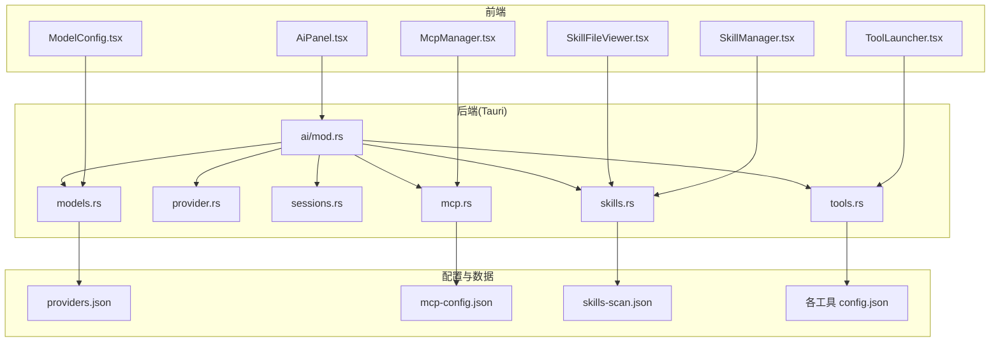
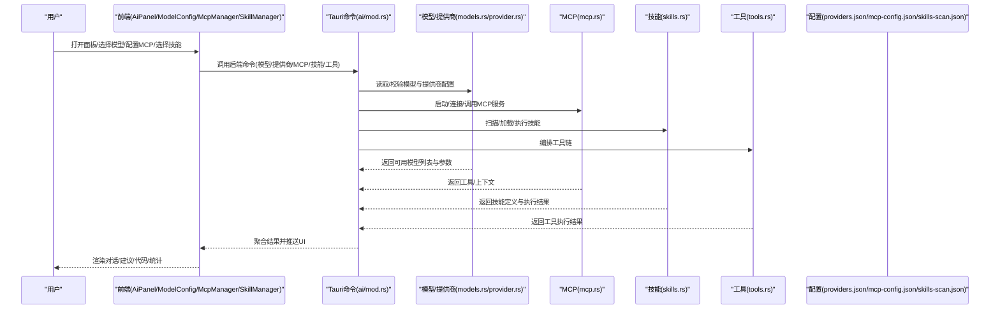
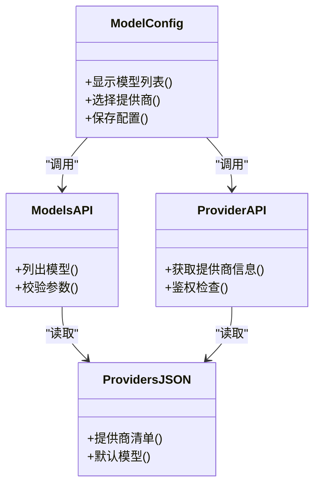
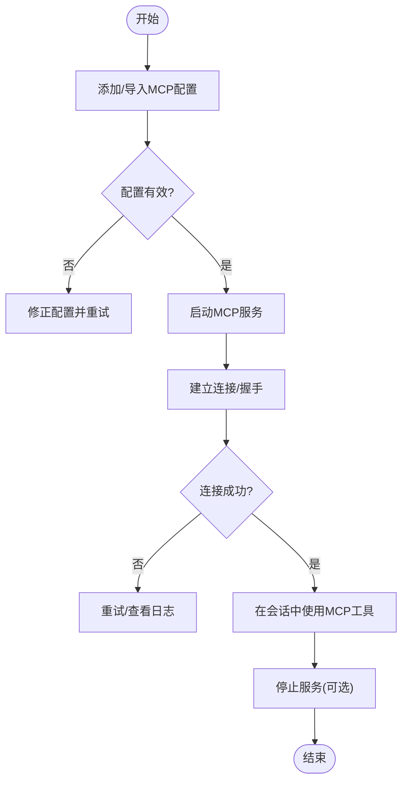
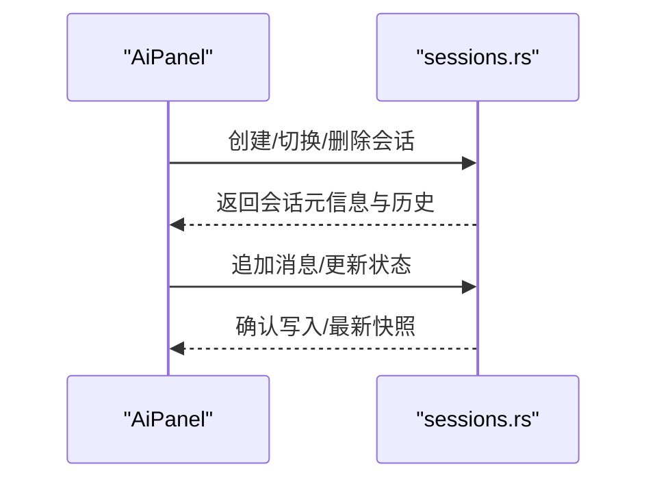
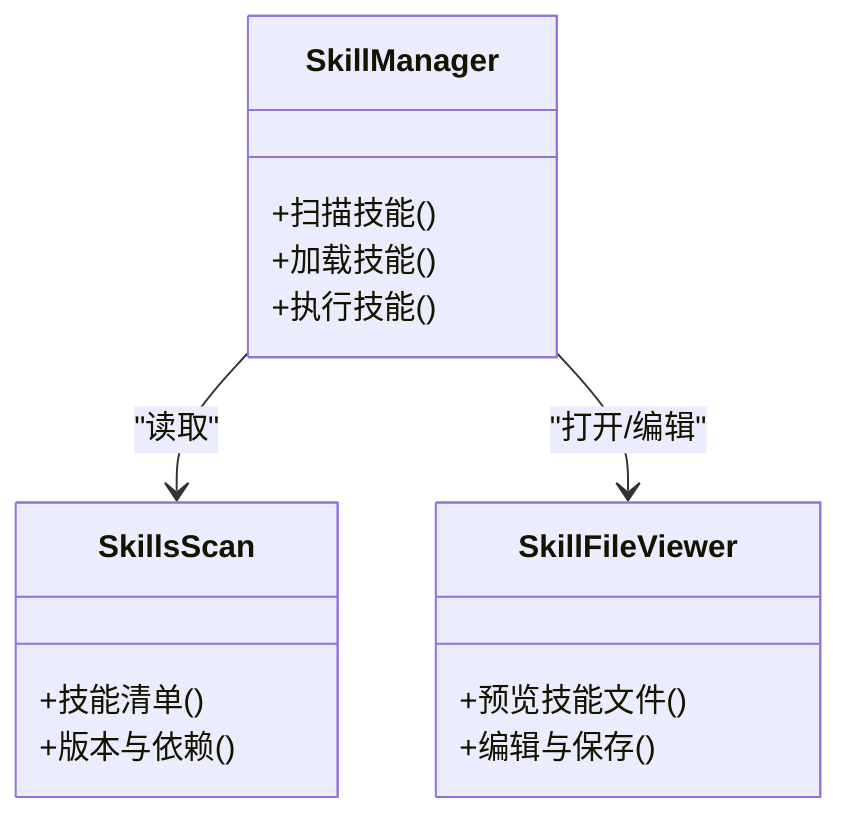
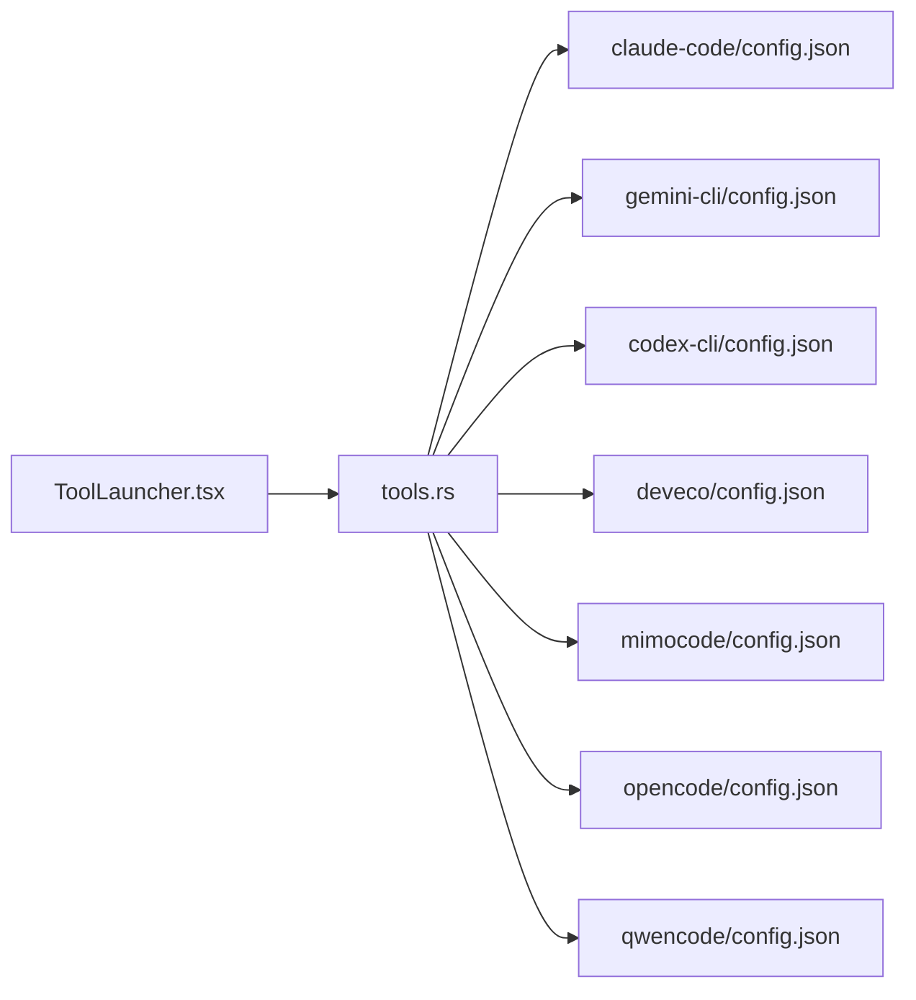
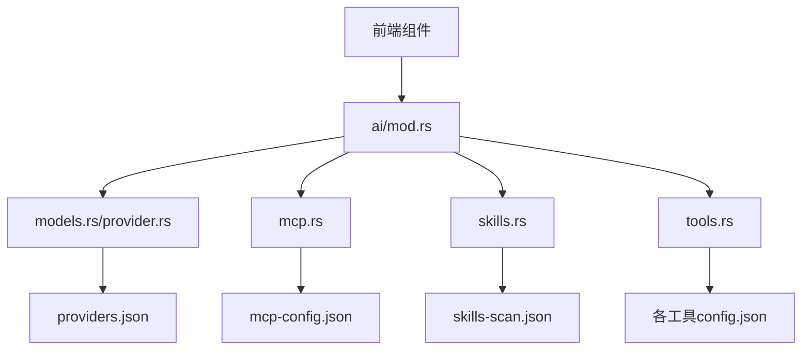

# AI 助手

<cite>
**本文引用的文件**   
- [src/components/ai/AiPanel.tsx](file://src/components/ai/AiPanel.tsx)
- [src/components/ai/ModelConfig.tsx](file://src/components/ai/ModelConfig.tsx)
- [src/components/ai/McpManager.tsx](file://src/components/ai/McpManager.tsx)
- [src/components/ai/SkillManager.tsx](file://src/components/ai/SkillManager.tsx)
- [src/components/ai/SkillFileViewer.tsx](file://src/components/ai/SkillFileViewer.tsx)
- [src/components/ai/ToolLauncher.tsx](file://src/components/ai/ToolLauncher.tsx)
- [src/components/ai/types.ts](file://src/components/ai/types.ts)
- [src-tauri/src/commands/ai/mod.rs](file://src-tauri/src/commands/ai/mod.rs)
- [src-tauri/src/commands/ai/models.rs](file://src-tauri/src/commands/ai/models.rs)
- [src-tauri/src/commands/ai/provider.rs](file://src-tauri/src/commands/ai/provider.rs)
- [src-tauri/src/commands/ai/sessions.rs](file://src-tauri/src/commands/ai/sessions.rs)
- [src-tauri/src/commands/ai/mcp.rs](file://src-tauri/src/commands/ai/mcp.rs)
- [src-tauri/src/commands/ai/skills.rs](file://src-tauri/src/commands/ai/skills.rs)
- [src-tauri/src/commands/ai/tools.rs](file://src-tauri/src/commands/ai/tools.rs)
- [ai-tools/providers.json](file://ai-tools/providers.json)
- [ai-tools/mcp-config.json](file://ai-tools/mcp-config.json)
- [ai-tools/skills-scan.json](file://ai-tools/skills-scan.json)
- [ai-tools/claude-code/config.json](file://ai-tools/claude-code/config.json)
- [ai-tools/gemini-cli/config.json](file://ai-tools/gemini-cli/config.json)
- [ai-tools/codex-cli/config.json](file://ai-tools/codex-cli/config.json)
- [ai-tools/deveco/config.json](file://ai-tools/deveco/config.json)
- [ai-tools/mimocode/config.json](file://ai-tools/mimocode/config.json)
- [ai-tools/opencode/config.json](file://ai-tools/opencode/config.json)
- [ai-tools/qwencode/config.json](file://ai-tools/qwencode/config.json)
</cite>

## 目录
1. [简介](#简介)
2. [项目结构](#项目结构)
3. [核心组件](#核心组件)
4. [架构总览](#架构总览)
5. [详细组件分析](#详细组件分析)
6. [依赖分析](#依赖分析)
7. [性能考虑](#性能考虑)
8. [故障排查指南](#故障排查指南)
9. [结论](#结论)
10. [附录](#附录)

## 简介
本文件面向“AI 助手”功能，覆盖模型配置与管理、MCP（Model Context Protocol）服务器设置与使用、会话管理与历史记录、技能系统概念与开发方法、对话界面与代码生成/智能建议的使用指南，以及工具链集成与扩展机制。文档同时为初学者提供基础使用指导，并为高级用户提供深度定制与开发指南。

## 项目结构
AI 助手由前端 React 组件与后端 Tauri 命令模块组成：
- 前端位于 src/components/ai，负责 UI 交互、状态展示与调用后端命令。
- 后端位于 src-tauri/src/commands/ai，提供模型、提供商、会话、MCP、技能、工具等能力。
- 全局配置与扫描结果位于 ai-tools 目录，包含各 AI 工具的配置文件、提供商清单、MCP 配置与技能扫描结果。

图表来源
- [src/components/ai/AiPanel.tsx](file://src/components/ai/AiPanel.tsx)
- [src/components/ai/ModelConfig.tsx](file://src/components/ai/ModelConfig.tsx)
- [src/components/ai/McpManager.tsx](file://src/components/ai/McpManager.tsx)
- [src/components/ai/SkillManager.tsx](file://src/components/ai/SkillManager.tsx)
- [src/components/ai/SkillFileViewer.tsx](file://src/components/ai/SkillFileViewer.tsx)
- [src/components/ai/ToolLauncher.tsx](file://src/components/ai/ToolLauncher.tsx)
- [src-tauri/src/commands/ai/mod.rs](file://src-tauri/src/commands/ai/mod.rs)
- [src-tauri/src/commands/ai/models.rs](file://src-tauri/src/commands/ai/models.rs)
- [src-tauri/src/commands/ai/provider.rs](file://src-tauri/src/commands/ai/provider.rs)
- [src-tauri/src/commands/ai/sessions.rs](file://src-tauri/src/commands/ai/sessions.rs)
- [src-tauri/src/commands/ai/mcp.rs](file://src-tauri/src/commands/ai/mcp.rs)
- [src-tauri/src/commands/ai/skills.rs](file://src-tauri/src/commands/ai/skills.rs)
- [src-tauri/src/commands/ai/tools.rs](file://src-tauri/src/commands/ai/tools.rs)
- [ai-tools/providers.json](file://ai-tools/providers.json)
- [ai-tools/mcp-config.json](file://ai-tools/mcp-config.json)
- [ai-tools/skills-scan.json](file://ai-tools/skills-scan.json)
- [ai-tools/claude-code/config.json](file://ai-tools/claude-code/config.json)
- [ai-tools/gemini-cli/config.json](file://ai-tools/gemini-cli/config.json)
- [ai-tools/codex-cli/config.json](file://ai-tools/codex-cli/config.json)
- [ai-tools/deveco/config.json](file://ai-tools/deveco/config.json)
- [ai-tools/mimocode/config.json](file://ai-tools/mimocode/config.json)
- [ai-tools/opencode/config.json](file://ai-tools/opencode/config.json)
- [ai-tools/qwencode/config.json](file://ai-tools/qwencode/config.json)

章节来源
- [src/components/ai/AiPanel.tsx](file://src/components/ai/AiPanel.tsx)
- [src-tauri/src/commands/ai/mod.rs](file://src-tauri/src/commands/ai/mod.rs)
- [ai-tools/providers.json](file://ai-tools/providers.json)

## 核心组件
- 模型与提供商管理：支持 OpenAI、Claude、Gemini 等多提供商的统一模型选择与参数配置。
- MCP 服务器管理：发现、启动、停止与调试 MCP 服务，统一接入外部工具与上下文。
- 会话与历史：创建、切换、持久化会话，保留上下文与消息历史。
- 技能系统：扫描、加载、编辑与执行技能，驱动代码生成与智能建议。
- 工具链集成：通过工具发射器与后端工具命令，编排多工具工作流。
- 对话界面：Markdown 渲染、流式输出、错误提示与使用统计。

章节来源
- [src/components/ai/ModelConfig.tsx](file://src/components/ai/ModelConfig.tsx)
- [src/components/ai/McpManager.tsx](file://src/components/ai/McpManager.tsx)
- [src/components/ai/SkillManager.tsx](file://src/components/ai/SkillManager.tsx)
- [src/components/ai/ToolLauncher.tsx](file://src/components/ai/ToolLauncher.tsx)
- [src-tauri/src/commands/ai/models.rs](file://src-tauri/src/commands/ai/models.rs)
- [src-tauri/src/commands/ai/provider.rs](file://src-tauri/src/commands/ai/provider.rs)
- [src-tauri/src/commands/ai/mcp.rs](file://src-tauri/src/commands/ai/mcp.rs)
- [src-tauri/src/commands/ai/skills.rs](file://src-tauri/src/commands/ai/skills.rs)
- [src-tauri/src/commands/ai/tools.rs](file://src-tauri/src/commands/ai/tools.rs)

## 架构总览
整体采用前后端分离的桌面应用架构：前端通过 Tauri 命令调用后端 Rust 模块，读取本地配置与扫描结果，驱动 AI 模型、MCP 与服务、技能与工具的执行。

图表来源
- [src-tauri/src/commands/ai/mod.rs](file://src-tauri/src/commands/ai/mod.rs)
- [src-tauri/src/commands/ai/models.rs](file://src-tauri/src/commands/ai/models.rs)
- [src-tauri/src/commands/ai/provider.rs](file://src-tauri/src/commands/ai/provider.rs)
- [src-tauri/src/commands/ai/mcp.rs](file://src-tauri/src/commands/ai/mcp.rs)
- [src-tauri/src/commands/ai/skills.rs](file://src-tauri/src/commands/ai/skills.rs)
- [src-tauri/src/commands/ai/tools.rs](file://src-tauri/src/commands/ai/tools.rs)
- [ai-tools/providers.json](file://ai-tools/providers.json)
- [ai-tools/mcp-config.json](file://ai-tools/mcp-config.json)
- [ai-tools/skills-scan.json](file://ai-tools/skills-scan.json)

## 详细组件分析

### 模型与提供商管理
- 目标：统一管理 OpenAI、Claude、Gemini 等提供商的模型选择、鉴权与参数。
- 关键实现：
  - 前端 ModelConfig 组件负责展示与编辑模型与提供商配置。
  - 后端 models.rs 与 provider.rs 提供模型枚举、提供商适配与参数校验。
  - providers.json 集中声明支持的提供商与默认模型。
- 最佳实践：
  - 将密钥与环境变量隔离到安全存储或环境变量中。
  - 为不同任务选择合适模型（如快速迭代 vs 高质量输出）。
  - 启用代理与重试策略以提升稳定性。

图表来源
- [src/components/ai/ModelConfig.tsx](file://src/components/ai/ModelConfig.tsx)
- [src-tauri/src/commands/ai/models.rs](file://src-tauri/src/commands/ai/models.rs)
- [src-tauri/src/commands/ai/provider.rs](file://src-tauri/src/commands/ai/provider.rs)
- [ai-tools/providers.json](file://ai-tools/providers.json)

章节来源
- [src/components/ai/ModelConfig.tsx](file://src/components/ai/ModelConfig.tsx)
- [src-tauri/src/commands/ai/models.rs](file://src-tauri/src/commands/ai/models.rs)
- [src-tauri/src/commands/ai/provider.rs](file://src-tauri/src/commands/ai/provider.rs)
- [ai-tools/providers.json](file://ai-tools/providers.json)

### MCP（Model Context Protocol）服务器管理
- 目标：发现、启动、停止与调试 MCP 服务，使 AI 能访问外部工具与上下文。
- 关键实现：
  - McpManager 组件提供 UI 操作入口。
  - mcp.rs 负责进程生命周期、通信协议与错误处理。
  - mcp-config.json 定义服务端点、认证与超时等参数。
- 使用流程：
  - 添加 MCP 服务条目（名称、类型、命令行或 HTTP 端点、鉴权）。
  - 启动服务并验证连通性。
  - 在会话中按需启用特定 MCP 工具集。

图表来源
- [src/components/ai/McpManager.tsx](file://src/components/ai/McpManager.tsx)
- [src-tauri/src/commands/ai/mcp.rs](file://src-tauri/src/commands/ai/mcp.rs)
- [ai-tools/mcp-config.json](file://ai-tools/mcp-config.json)

章节来源
- [src/components/ai/McpManager.tsx](file://src/components/ai/McpManager.tsx)
- [src-tauri/src/commands/ai/mcp.rs](file://src-tauri/src/commands/ai/mcp.rs)
- [ai-tools/mcp-config.json](file://ai-tools/mcp-config.json)

### 会话管理与历史记录
- 目标：维护多会话上下文、消息历史与状态切换。
- 关键实现：
  - sessions.rs 提供会话创建、切换、持久化与清理。
  - AiPanel 负责会话列表展示与消息渲染。
- 最佳实践：
  - 按任务拆分会话，避免上下文污染。
  - 定期归档重要会话，控制磁盘占用。
  - 对敏感信息进行脱敏后再持久化。

图表来源
- [src/components/ai/AiPanel.tsx](file://src/components/ai/AiPanel.tsx)
- [src-tauri/src/commands/ai/sessions.rs](file://src-tauri/src/commands/ai/sessions.rs)

章节来源
- [src/components/ai/AiPanel.tsx](file://src/components/ai/AiPanel.tsx)
- [src-tauri/src/commands/ai/sessions.rs](file://src-tauri/src/commands/ai/sessions.rs)

### 技能系统（概念、使用与开发）
- 概念：技能是可复用的任务模板，封装了提示词、工具调用与执行步骤，用于驱动代码生成与智能建议。
- 使用：
  - SkillManager 负责扫描、加载与执行技能。
  - skills-scan.json 记录已发现技能的元数据与路径。
  - SkillFileViewer 用于预览与编辑技能文件。
- 开发：
  - 定义技能清单与输入参数。
  - 组合工具与 MCP 能力形成工作流。
  - 通过单元测试与示例用例验证技能行为。

图表来源
- [src/components/ai/SkillManager.tsx](file://src/components/ai/SkillManager.tsx)
- [src/components/ai/SkillFileViewer.tsx](file://src/components/ai/SkillFileViewer.tsx)
- [src-tauri/src/commands/ai/skills.rs](file://src-tauri/src/commands/ai/skills.rs)
- [ai-tools/skills-scan.json](file://ai-tools/skills-scan.json)

章节来源
- [src/components/ai/SkillManager.tsx](file://src/components/ai/SkillManager.tsx)
- [src/components/ai/SkillFileViewer.tsx](file://src/components/ai/SkillFileViewer.tsx)
- [src-tauri/src/commands/ai/skills.rs](file://src-tauri/src/commands/ai/skills.rs)
- [ai-tools/skills-scan.json](file://ai-tools/skills-scan.json)

### 工具链集成与扩展机制
- 目标：通过 ToolLauncher 与 tools.rs 编排多种 AI 工具（如 Claude Code、Gemini CLI、Codex CLI、Deveco、OpenCode、QwenCode、MimoCode 等），形成可复用的工作流。
- 关键点：
  - 每个工具目录下存在独立的 config.json，便于差异化配置。
  - 工具发射器负责参数组装、进程调度与结果回传。
  - 可扩展新工具：新增目录与配置，注册到工具清单。

图表来源
- [src/components/ai/ToolLauncher.tsx](file://src/components/ai/ToolLauncher.tsx)
- [src-tauri/src/commands/ai/tools.rs](file://src-tauri/src/commands/ai/tools.rs)
- [ai-tools/claude-code/config.json](file://ai-tools/claude-code/config.json)
- [ai-tools/gemini-cli/config.json](file://ai-tools/gemini-cli/config.json)
- [ai-tools/codex-cli/config.json](file://ai-tools/codex-cli/config.json)
- [ai-tools/deveco/config.json](file://ai-tools/deveco/config.json)
- [ai-tools/mimocode/config.json](file://ai-tools/mimocode/config.json)
- [ai-tools/opencode/config.json](file://ai-tools/opencode/config.json)
- [ai-tools/qwencode/config.json](file://ai-tools/qwencode/config.json)

章节来源
- [src/components/ai/ToolLauncher.tsx](file://src/components/ai/ToolLauncher.tsx)
- [src-tauri/src/commands/ai/tools.rs](file://src-tauri/src/commands/ai/tools.rs)
- [ai-tools/claude-code/config.json](file://ai-tools/claude-code/config.json)
- [ai-tools/gemini-cli/config.json](file://ai-tools/gemini-cli/config.json)
- [ai-tools/codex-cli/config.json](file://ai-tools/codex-cli/config.json)
- [ai-tools/deveco/config.json](file://ai-tools/deveco/config.json)
- [ai-tools/mimocode/config.json](file://ai-tools/mimocode/config.json)
- [ai-tools/opencode/config.json](file://ai-tools/opencode/config.json)
- [ai-tools/qwencode/config.json](file://ai-tools/qwencode/config.json)

### 对话界面与智能建议
- 功能要点：
  - Markdown 渲染、流式输出、错误提示与使用统计。
  - 结合技能与工具，提供代码生成与智能建议。
- 使用建议：
  - 明确任务目标与约束条件，提升生成质量。
  - 利用会话历史保持上下文一致性。
  - 通过技能模板复用常见工作流。

章节来源
- [src/components/ai/AiPanel.tsx](file://src/components/ai/AiPanel.tsx)
- [src/components/ai/types.ts](file://src/components/ai/types.ts)

## 依赖分析
- 组件耦合：
  - 前端组件通过 Tauri 命令与后端解耦，职责清晰。
  - 后端命令模块内部按领域划分（模型、提供商、会话、MCP、技能、工具），内聚度高。
- 外部依赖：
  - providers.json 作为提供商清单中心。
  - mcp-config.json 作为 MCP 服务配置中心。
  - skills-scan.json 作为技能扫描结果索引。
  - 各工具 config.json 作为工具级配置。

图表来源
- [src-tauri/src/commands/ai/mod.rs](file://src-tauri/src/commands/ai/mod.rs)
- [src-tauri/src/commands/ai/models.rs](file://src-tauri/src/commands/ai/models.rs)
- [src-tauri/src/commands/ai/provider.rs](file://src-tauri/src/commands/ai/provider.rs)
- [src-tauri/src/commands/ai/mcp.rs](file://src-tauri/src/commands/ai/mcp.rs)
- [src-tauri/src/commands/ai/skills.rs](file://src-tauri/src/commands/ai/skills.rs)
- [src-tauri/src/commands/ai/tools.rs](file://src-tauri/src/commands/ai/tools.rs)
- [ai-tools/providers.json](file://ai-tools/providers.json)
- [ai-tools/mcp-config.json](file://ai-tools/mcp-config.json)
- [ai-tools/skills-scan.json](file://ai-tools/skills-scan.json)
- [ai-tools/claude-code/config.json](file://ai-tools/claude-code/config.json)
- [ai-tools/gemini-cli/config.json](file://ai-tools/gemini-cli/config.json)
- [ai-tools/codex-cli/config.json](file://ai-tools/codex-cli/config.json)
- [ai-tools/deveco/config.json](file://ai-tools/deveco/config.json)
- [ai-tools/mimocode/config.json](file://ai-tools/mimocode/config.json)
- [ai-tools/opencode/config.json](file://ai-tools/opencode/config.json)
- [ai-tools/qwencode/config.json](file://ai-tools/qwencode/config.json)

章节来源
- [src-tauri/src/commands/ai/mod.rs](file://src-tauri/src/commands/ai/mod.rs)
- [ai-tools/providers.json](file://ai-tools/providers.json)
- [ai-tools/mcp-config.json](file://ai-tools/mcp-config.json)
- [ai-tools/skills-scan.json](file://ai-tools/skills-scan.json)

## 性能考虑
- 模型调用：
  - 合理选择模型与温度参数，平衡速度与质量。
  - 启用缓存与重试策略，降低失败率与延迟。
- MCP 服务：
  - 控制并发连接数，避免资源争用。
  - 设置合理的超时与心跳检测。
- 技能与工具：
  - 批量任务分片执行，减少单次负载。
  - 异步处理与进度反馈，提升用户体验。
- 会话与历史：
  - 分页加载历史，避免大对象阻塞。
  - 定期清理过期会话，控制存储增长。

## 故障排查指南
- 常见问题：
  - 模型鉴权失败：检查提供商配置与密钥有效性。
  - MCP 连接失败：核对 mcp-config.json 中的端点与认证参数。
  - 技能执行异常：查看技能清单与依赖是否完整。
  - 工具链不可用：确认工具路径与权限。
- 定位方法：
  - 查看对应命令模块日志与返回值。
  - 使用 SkillFileViewer 检查技能文件语法。
  - 通过 ToolLauncher 逐步验证工具可用性。

章节来源
- [src-tauri/src/commands/ai/models.rs](file://src-tauri/src/commands/ai/models.rs)
- [src-tauri/src/commands/ai/mcp.rs](file://src-tauri/src/commands/ai/mcp.rs)
- [src-tauri/src/commands/ai/skills.rs](file://src-tauri/src/commands/ai/skills.rs)
- [src-tauri/src/commands/ai/tools.rs](file://src-tauri/src/commands/ai/tools.rs)

## 结论
AI 助手以模块化架构整合多提供商模型、MCP 服务、技能系统与工具链，提供一致的对话与自动化体验。通过清晰的配置与扩展机制，既满足初学者的易用需求，也支持高级用户的深度定制与二次开发。

## 附录
- 快速上手：
  - 配置提供商与模型，选择适合任务的模型。
  - 添加 MCP 服务并验证连通性。
  - 使用技能模板完成常见任务。
- 进阶定制：
  - 扩展新工具与技能，完善配置与测试。
  - 优化会话与历史策略，提升性能与安全性。
  - 结合代理与重试策略，增强稳定性。