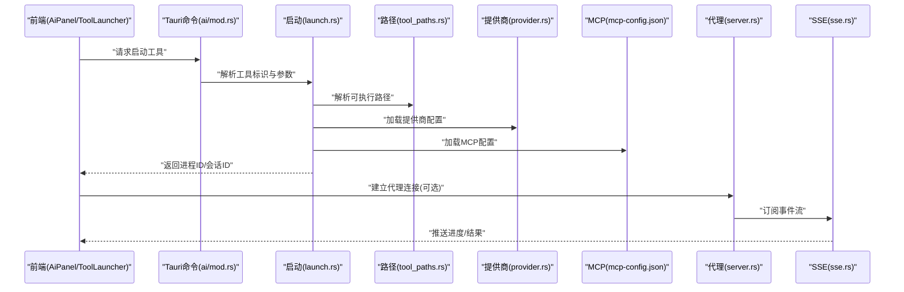
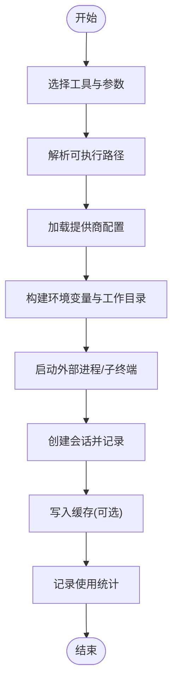
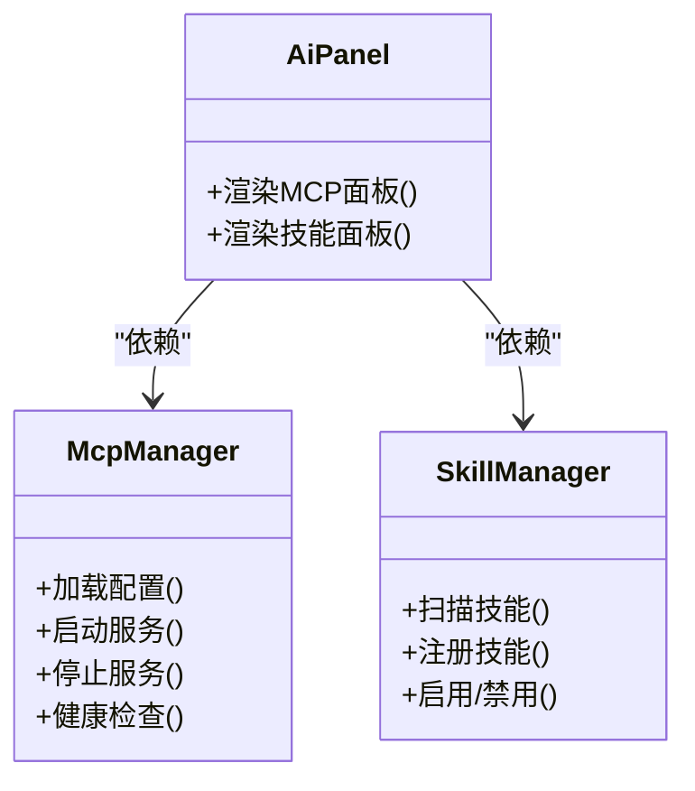
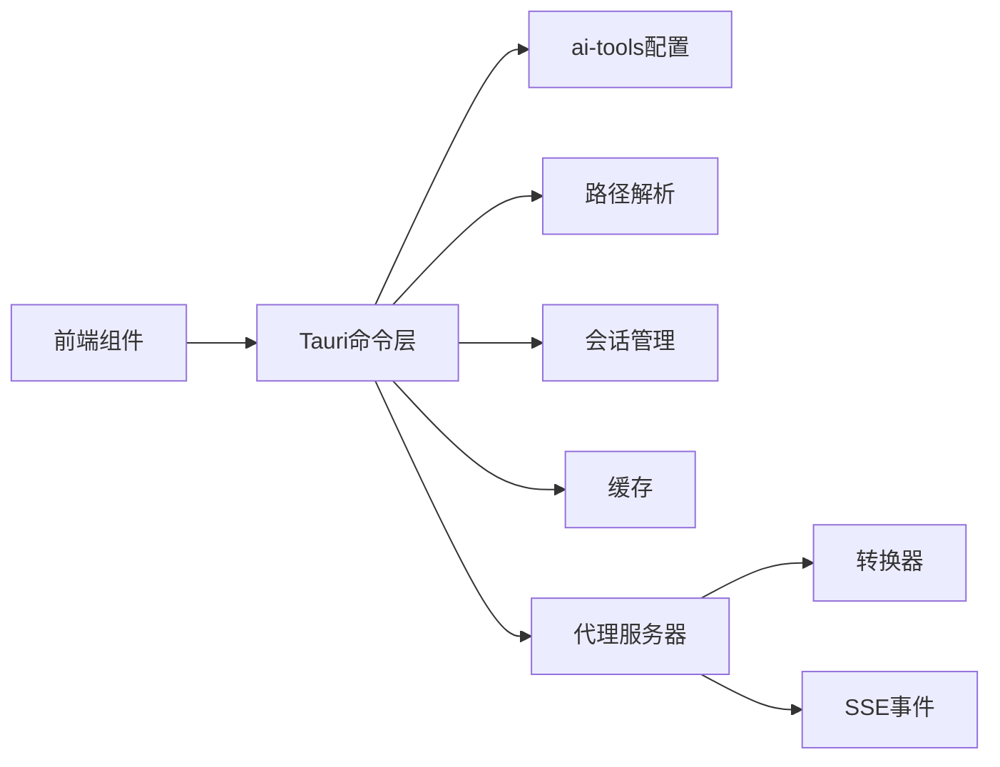

# AI 工具集成

<cite>
**本文引用的文件**   
- [ai-tools/providers.json](file://ai-tools/providers.json)
- [ai-tools/mcp-config.json](file://ai-tools/mcp-config.json)
- [ai-tools/claude-code/config.json](file://ai-tools/claude-code/config.json)
- [ai-tools/codex-cli/config.json](file://ai-tools/codex-cli/config.json)
- [ai-tools/gemini-cli/config.json](file://ai-tools/gemini-cli/config.json)
- [ai-tools/deveco/config.json](file://ai-tools/deveco/config.json)
- [ai-tools/mimocode/config.json](file://ai-tools/mimocode/config.json)
- [ai-tools/opencode/config.json](file://ai-tools/opencode/config.json)
- [ai-tools/qwencode/config.json](file://ai-tools/qwencode/config.json)
- [src/components/ai/ToolLauncher.tsx](file://src/components/ai/ToolLauncher.tsx)
- [src/components/ai/McpManager.tsx](file://src/components/ai/McpManager.tsx)
- [src/components/ai/SkillManager.tsx](file://src/components/ai/SkillManager.tsx)
- [src/components/ai/AiPanel.tsx](file://src/components/ai/AiPanel.tsx)
- [src/components/ai/types.ts](file://src/components/ai/types.ts)
- [src-tauri/src/commands/ai/mod.rs](file://src-tauri/src/commands/ai/mod.rs)
- [src-tauri/src/commands/ai/launch.rs](file://src-tauri/src/commands/ai/launch.rs)
- [src-tauri/src/commands/ai/tools.rs](file://src-tauri/src/commands/ai/tools.rs)
- [src-tauri/src/commands/ai/tool_paths.rs](file://src-tauri/src/commands/ai/tool_paths.rs)
- [src-tauri/src/commands/ai/sessions.rs](file://src-tauri/src/commands/ai/sessions.rs)
- [src-tauri/src/commands/ai/cache.rs](file://src-tauri/src/commands/ai/cache.rs)
- [src-tauri/src/commands/ai/usage.rs](file://src-tauri/src/commands/ai/usage.rs)
- [src-tauri/src/commands/ai/provider.rs](file://src-tauri/src/commands/ai/provider.rs)
- [src-tauri/src/commands/ai/models.rs](file://src-tauri/src/commands/ai/models.rs)
- [src-tauri/src/commands/ai/detect.rs](file://src-tauri/src/commands/ai/detect.rs)
- [src-tauri/src/commands/ai/terminal.rs](file://src-tauri/src/commands/ai/terminal.rs)
- [src-tauri/src/commands/ai_registry.rs](file://src-tauri/src/commands/ai_registry.rs)
- [src-tauri/src/proxy/server.rs](file://src-tauri/src/proxy/server.rs)
- [src-tauri/src/proxy/sse.rs](file://src-tauri/src/proxy/sse.rs)
- [src-tauri/src/proxy/transform.rs](file://src-tauri/src/proxy/transform.rs)
- [src-tauri/src/proxy/types.rs](file://src-tauri/src/proxy/types.rs)
- [src-tauri/src/proxy/google.rs](file://src-tauri/src/proxy/google.rs)
- [src-tauri/src/proxy/optimizers.rs](file://src-tauri/src/proxy/optimizers.rs)
- [src-tauri/src/lib.rs](file://src-tauri/src/lib.rs)
- [src/App.tsx](file://src/App.tsx)
- [src/main.tsx](file://src/main.tsx)
</cite>

## 目录
1. [简介](#简介)
2. [项目结构](#项目结构)
3. [核心组件](#核心组件)
4. [架构总览](#架构总览)
5. [详细组件分析](#详细组件分析)
6. [依赖关系分析](#依赖关系分析)
7. [性能与监控](#性能与监控)
8. [故障诊断与排错](#故障诊断与排错)
9. [安全与权限控制](#安全与权限控制)
10. [自定义工具与扩展开发](#自定义工具与扩展开发)
11. [初学者入门指南](#初学者入门指南)
12. [开发者进阶与自动化工作流](#开发者进阶与自动化工作流)
13. [结论](#结论)

## 简介
本文件面向“AI 工具集成功能”，系统性说明如何在本项目中集成与管理多种 AI 工具（如 Claude Code、Codex CLI、Gemini CLI 等），涵盖工具启动、配置管理、工作流编排、工具间通信协议与数据交换格式、自定义工具接入、性能监控、日志分析与故障诊断，以及权限控制与安全管理策略。文档同时为初学者提供基础使用指导，并为开发者提供深度集成与自动化工作流开发指南。

## 项目结构
本项目采用前端 React + Tauri 后端 Rust 的混合架构：
- 前端负责 UI 交互与可视化展示，包括工具面板、MCP 管理、技能管理与使用统计等。
- 后端通过 Tauri 命令暴露能力，实现工具发现、路径解析、会话管理、缓存、代理转发、SSE 事件等。
- ai-tools 目录集中存放各工具的配置文件与路径映射，便于统一管理与扩展。

```mermaid
graph TB
subgraph "前端"
App["App.tsx"]
AiPanel["AiPanel.tsx"]
ToolLauncher["ToolLauncher.tsx"]
McpManager["McpManager.tsx"]
SkillManager["SkillManager.tsx"]
Types["types.ts"]
end
subgraph "Tauri 后端"
Lib["lib.rs"]
AICmds["commands/ai/mod.rs"]
Launch["commands/ai/launch.rs"]
Tools["commands/ai/tools.rs"]
ToolPaths["commands/ai/tool_paths.rs"]
Sessions["commands/ai/sessions.rs"]
Cache["commands/ai/cache.rs"]
Usage["commands/ai/usage.rs"]
Provider["commands/ai/provider.rs"]
Models["commands/ai/models.rs"]
Detect["commands/ai/detect.rs"]
Terminal["commands/ai/terminal.rs"]
ProxyServer["proxy/server.rs"]
SSE["proxy/sse.rs"]
Transform["proxy/transform.rs"]
ProxyTypes["proxy/types.rs"]
GoogleProxy["proxy/google.rs"]
Optimizers["proxy/optimizers.rs"]
end
subgraph "配置与资源"
Providers["ai-tools/providers.json"]
MCPConf["ai-tools/mcp-config.json"]
CConf["ai-tools/claude-code/config.json"]
XConf["ai-tools/codex-cli/config.json"]
GConf["ai-tools/gemini-cli/config.json"]
DConf["ai-tools/deveco/config.json"]
MConf["ai-tools/mimocode/config.json"]
OConf["ai-tools/opencode/config.json"]
QConf["ai-tools/qwencode/config.json"]
end
App --> AiPanel
AiPanel --> ToolLauncher
AiPanel --> McpManager
AiPanel --> SkillManager
AiPanel --> Types
ToolLauncher --> AICmds
McpManager --> AICmds
SkillManager --> AICmds
AICmds --> Launch
AICmds --> Tools
AICmds --> ToolPaths
AICmds --> Sessions
AICmds --> Cache
AICmds --> Usage
AICmds --> Provider
AICmds --> Models
AICmds --> Detect
AICmds --> Terminal
Launch --> Providers
Launch --> CConf
Launch --> XConf
Launch --> GConf
Launch --> DConf
Launch --> MConf
Launch --> OConf
Launch --> QConf
AICmds --> ProxyServer
ProxyServer --> SSE
ProxyServer --> Transform
ProxyServer --> ProxyTypes
ProxyServer --> GoogleProxy
ProxyServer --> Optimizers
```



图表来源
- [src/App.tsx](file://src/App.tsx)
- [src/components/ai/AiPanel.tsx](file://src/components/ai/AiPanel.tsx)
- [src/components/ai/ToolLauncher.tsx](file://src/components/ai/ToolLauncher.tsx)
- [src/components/ai/McpManager.tsx](file://src/components/ai/McpManager.tsx)
- [src/components/ai/SkillManager.tsx](file://src/components/ai/SkillManager.tsx)
- [src/components/ai/types.ts](file://src/components/ai/types.ts)
- [src-tauri/src/lib.rs](file://src-tauri/src/lib.rs)
- [src-tauri/src/commands/ai/mod.rs](file://src-tauri/src/commands/ai/mod.rs)
- [src-tauri/src/commands/ai/launch.rs](file://src-tauri/src/commands/ai/launch.rs)
- [src-tauri/src/commands/ai/tools.rs](file://src-tauri/src/commands/ai/tools.rs)
- [src-tauri/src/commands/ai/tool_paths.rs](file://src-tauri/src/commands/ai/tool_paths.rs)
- [src-tauri/src/commands/ai/sessions.rs](file://src-tauri/src/commands/ai/sessions.rs)
- [src-tauri/src/commands/ai/cache.rs](file://src-tauri/src/commands/ai/cache.rs)
- [src-tauri/src/commands/ai/usage.rs](file://src-tauri/src/commands/ai/usage.rs)
- [src-tauri/src/commands/ai/provider.rs](file://src-tauri/src/commands/ai/provider.rs)
- [src-tauri/src/commands/ai/models.rs](file://src-tauri/src/commands/ai/models.rs)
- [src-tauri/src/commands/ai/detect.rs](file://src-tauri/src/commands/ai/detect.rs)
- [src-tauri/src/commands/ai/terminal.rs](file://src-tauri/src/commands/ai/terminal.rs)
- [src-tauri/src/proxy/server.rs](file://src-tauri/src/proxy/server.rs)
- [src-tauri/src/proxy/sse.rs](file://src-tauri/src/proxy/sse.rs)
- [src-tauri/src/proxy/transform.rs](file://src-tauri/src/proxy/transform.rs)
- [src-tauri/src/proxy/types.rs](file://src-tauri/src/proxy/types.rs)
- [src-tauri/src/proxy/google.rs](file://src-tauri/src/proxy/google.rs)
- [src-tauri/src/proxy/optimizers.rs](file://src-tauri/src/proxy/optimizers.rs)
- [ai-tools/providers.json](file://ai-tools/providers.json)
- [ai-tools/mcp-config.json](file://ai-tools/mcp-config.json)
- [ai-tools/claude-code/config.json](file://ai-tools/claude-code/config.json)
- [ai-tools/codex-cli/config.json](file://ai-tools/codex-cli/config.json)
- [ai-tools/gemini-cli/config.json](file://ai-tools/gemini-cli/config.json)
- [ai-tools/deveco/config.json](file://ai-tools/deveco/config.json)
- [ai-tools/mimocode/config.json](file://ai-tools/mimocode/config.json)
- [ai-tools/opencode/config.json](file://ai-tools/opencode/config.json)
- [ai-tools/qwencode/config.json](file://ai-tools/qwencode/config.json)

章节来源
- [src/App.tsx](file://src/App.tsx)
- [src-tauri/src/lib.rs](file://src-tauri/src/lib.rs)
- [ai-tools/providers.json](file://ai-tools/providers.json)
- [ai-tools/mcp-config.json](file://ai-tools/mcp-config.json)

## 核心组件
- 工具启动器（ToolLauncher）：负责根据工具标识选择对应配置、解析可执行路径、组装参数与环境变量并启动外部进程或子终端。
- MCP 管理器（McpManager）：加载与校验 mcp-config.json，维护 MCP Server 生命周期与连接状态。
- 技能管理器（SkillManager）：扫描与注册技能文件，支持在工具链中按需启用。
- AI 面板（AiPanel）：聚合上述模块，提供统一的入口与视图。
- Tauri 命令层（commands/ai/*）：封装工具发现、路径解析、会话管理、缓存、使用统计、模型与提供商信息、检测与终端操作等能力。
- 代理与 SSE（proxy/*）：提供请求转发、SSE 事件流、内容转换、Google 代理适配与优化器管道。

章节来源
- [src/components/ai/ToolLauncher.tsx](file://src/components/ai/ToolLauncher.tsx)
- [src/components/ai/McpManager.tsx](file://src/components/ai/McpManager.tsx)
- [src/components/ai/SkillManager.tsx](file://src/components/ai/SkillManager.tsx)
- [src/components/ai/AiPanel.tsx](file://src/components/ai/AiPanel.tsx)
- [src-tauri/src/commands/ai/mod.rs](file://src-tauri/src/commands/ai/mod.rs)
- [src-tauri/src/commands/ai/launch.rs](file://src-tauri/src/commands/ai/launch.rs)
- [src-tauri/src/commands/ai/tools.rs](file://src-tauri/src/commands/ai/tools.rs)
- [src-tauri/src/commands/ai/tool_paths.rs](file://src-tauri/src/commands/ai/tool_paths.rs)
- [src-tauri/src/commands/ai/sessions.rs](file://src-tauri/src/commands/ai/sessions.rs)
- [src-tauri/src/commands/ai/cache.rs](file://src-tauri/src/commands/ai/cache.rs)
- [src-tauri/src/commands/ai/usage.rs](file://src-tauri/src/commands/ai/usage.rs)
- [src-tauri/src/commands/ai/provider.rs](file://src-tauri/src/commands/ai/provider.rs)
- [src-tauri/src/commands/ai/models.rs](file://src-tauri/src/commands/ai/models.rs)
- [src-tauri/src/commands/ai/detect.rs](file://src-tauri/src/commands/ai/detect.rs)
- [src-tauri/src/commands/ai/terminal.rs](file://src-tauri/src/commands/ai/terminal.rs)
- [src-tauri/src/proxy/server.rs](file://src-tauri/src/proxy/server.rs)
- [src-tauri/src/proxy/sse.rs](file://src-tauri/src/proxy/sse.rs)
- [src-tauri/src/proxy/transform.rs](file://src-tauri/src/proxy/transform.rs)
- [src-tauri/src/proxy/types.rs](file://src-tauri/src/proxy/types.rs)
- [src-tauri/src/proxy/google.rs](file://src-tauri/src/proxy/google.rs)
- [src-tauri/src/proxy/optimizers.rs](file://src-tauri/src/proxy/optimizers.rs)

## 架构总览
整体流程：前端通过 Tauri 命令调用后端能力；后端读取 ai-tools 下的 providers 与各工具配置，完成工具发现与启动；对于需要网络访问的工具，可通过代理服务器进行转发与 SSE 推送；MCP 与技能系统作为扩展点，增强工具链能力。



图表来源
- [src/components/ai/AiPanel.tsx](file://src/components/ai/AiPanel.tsx)
- [src/components/ai/ToolLauncher.tsx](file://src/components/ai/ToolLauncher.tsx)
- [src-tauri/src/commands/ai/mod.rs](file://src-tauri/src/commands/ai/mod.rs)
- [src-tauri/src/commands/ai/launch.rs](file://src-tauri/src/commands/ai/launch.rs)
- [src-tauri/src/commands/ai/tool_paths.rs](file://src-tauri/src/commands/ai/tool_paths.rs)
- [src-tauri/src/commands/ai/provider.rs](file://src-tauri/src/commands/ai/provider.rs)
- [ai-tools/mcp-config.json](file://ai-tools/mcp-config.json)
- [src-tauri/src/proxy/server.rs](file://src-tauri/src/proxy/server.rs)
- [src-tauri/src/proxy/sse.rs](file://src-tauri/src/proxy/sse.rs)

## 详细组件分析

### 工具启动与配置管理
- 工具清单与提供商：providers.json 定义可用工具及其元数据；每个工具目录下包含 config.json 与 paths.json，用于存储该工具的运行时配置与路径映射。
- 启动流程：ToolLauncher 将用户选择与参数传递给 Tauri 命令层；launch.rs 负责拼装环境变量、工作目录与命令行参数；tool_paths.rs 解析实际可执行路径；provider.rs 加载提供商相关设置（如密钥、端点）。
- 会话与缓存：sessions.rs 维护工具会话上下文；cache.rs 提供本地缓存能力，加速重复任务。
- 使用统计：usage.rs 记录工具调用次数、耗时等指标，供前端 UsageStats 展示。



图表来源
- [src/components/ai/ToolLauncher.tsx](file://src/components/ai/ToolLauncher.tsx)
- [src-tauri/src/commands/ai/launch.rs](file://src-tauri/src/commands/ai/launch.rs)
- [src-tauri/src/commands/ai/tool_paths.rs](file://src-tauri/src/commands/ai/tool_paths.rs)
- [src-tauri/src/commands/ai/provider.rs](file://src-tauri/src/commands/ai/provider.rs)
- [src-tauri/src/commands/ai/sessions.rs](file://src-tauri/src/commands/ai/sessions.rs)
- [src-tauri/src/commands/ai/cache.rs](file://src-tauri/src/commands/ai/cache.rs)
- [src-tauri/src/commands/ai/usage.rs](file://src-tauri/src/commands/ai/usage.rs)

章节来源
- [ai-tools/providers.json](file://ai-tools/providers.json)
- [ai-tools/claude-code/config.json](file://ai-tools/claude-code/config.json)
- [ai-tools/codex-cli/config.json](file://ai-tools/codex-cli/config.json)
- [ai-tools/gemini-cli/config.json](file://ai-tools/gemini-cli/config.json)
- [ai-tools/deveco/config.json](file://ai-tools/deveco/config.json)
- [ai-tools/mimocode/config.json](file://ai-tools/mimocode/config.json)
- [ai-tools/opencode/config.json](file://ai-tools/opencode/config.json)
- [ai-tools/qwencode/config.json](file://ai-tools/qwencode/config.json)
- [src-tauri/src/commands/ai/launch.rs](file://src-tauri/src/commands/ai/launch.rs)
- [src-tauri/src/commands/ai/tool_paths.rs](file://src-tauri/src/commands/ai/tool_paths.rs)
- [src-tauri/src/commands/ai/provider.rs](file://src-tauri/src/commands/ai/provider.rs)
- [src-tauri/src/commands/ai/sessions.rs](file://src-tauri/src/commands/ai/sessions.rs)
- [src-tauri/src/commands/ai/cache.rs](file://src-tauri/src/commands/ai/cache.rs)
- [src-tauri/src/commands/ai/usage.rs](file://src-tauri/src/commands/ai/usage.rs)

### MCP 与技能系统集成
- MCP 配置：mcp-config.json 定义 MCP Server 列表、连接方式与能力声明；McpManager 负责加载、校验与生命周期管理。
- 技能系统：SkillManager 扫描技能文件，将其注册到工具链，使工具在执行时可按需启用特定能力。



图表来源
- [src/components/ai/McpManager.tsx](file://src/components/ai/McpManager.tsx)
- [src/components/ai/SkillManager.tsx](file://src/components/ai/SkillManager.tsx)
- [src/components/ai/AiPanel.tsx](file://src/components/ai/AiPanel.tsx)
- [ai-tools/mcp-config.json](file://ai-tools/mcp-config.json)

章节来源
- [src/components/ai/McpManager.tsx](file://src/components/ai/McpManager.tsx)
- [src/components/ai/SkillManager.tsx](file://src/components/ai/SkillManager.tsx)
- [ai-tools/mcp-config.json](file://ai-tools/mcp-config.json)

### 代理与 SSE 事件流
- 代理服务器：proxy/server.rs 提供统一的请求转发入口，结合 transform.rs 对请求/响应进行转换。
- SSE 事件：proxy/sse.rs 提供服务端推送，便于前端实时显示进度与结果。
- Google 代理与优化器：google.rs 与 optimizers.rs 提供针对特定服务的适配与性能优化。

```mermaid
sequenceDiagram
participant FE as "前端"
participant PS as "代理服务器(server.rs)"
participant TR as "转换器(transform.rs)"
participant GO as "Google代理(google.rs)"
participant OPT as "优化器(optimizers.rs)"
participant SSE as "SSE(sse.rs)"
FE->>PS : "发起请求"
PS->>TR : "预处理/转换"
TR->>GO : "目标服务适配"
GO->>OPT : "应用优化策略"
OPT-->>PS : "返回响应"
PS->>SSE : "推送事件"
SSE-->>FE : "实时更新"
```

图表来源
- [src-tauri/src/proxy/server.rs](file://src-tauri/src/proxy/server.rs)
- [src-tauri/src/proxy/transform.rs](file://src-tauri/src/proxy/transform.rs)
- [src-tauri/src/proxy/google.rs](file://src-tauri/src/proxy/google.rs)
- [src-tauri/src/proxy/optimizers.rs](file://src-tauri/src/proxy/optimizers.rs)
- [src-tauri/src/proxy/sse.rs](file://src-tauri/src/proxy/sse.rs)

章节来源
- [src-tauri/src/proxy/server.rs](file://src-tauri/src/proxy/server.rs)
- [src-tauri/src/proxy/sse.rs](file://src-tauri/src/proxy/sse.rs)
- [src-tauri/src/proxy/transform.rs](file://src-tauri/src/proxy/transform.rs)
- [src-tauri/src/proxy/types.rs](file://src-tauri/src/proxy/types.rs)
- [src-tauri/src/proxy/google.rs](file://src-tauri/src/proxy/google.rs)
- [src-tauri/src/proxy/optimizers.rs](file://src-tauri/src/proxy/optimizers.rs)

### 工具间通信协议与数据交换格式
- 进程间通信：通过标准输入输出、环境变量与临时文件传递参数与结果；会话 ID 用于关联多次调用。
- 代理通信：HTTP/HTTPS 请求经代理服务器转发，SSE 事件以文本流形式推送结构化消息。
- 类型定义：proxy/types.rs 定义了代理层的数据结构；前端 types.ts 定义了 UI 侧的类型契约。

章节来源
- [src-tauri/src/commands/ai/terminal.rs](file://src-tauri/src/commands/ai/terminal.rs)
- [src-tauri/src/commands/ai/sessions.rs](file://src-tauri/src/commands/ai/sessions.rs)
- [src-tauri/src/proxy/types.rs](file://src-tauri/src/proxy/types.rs)
- [src/components/ai/types.ts](file://src/components/ai/types.ts)

### 工具发现与版本管理
- detect.rs 负责环境探测与工具可用性检查；models.rs 与 provider.rs 提供模型与提供商信息；ai_registry.rs 汇总注册表能力。

章节来源
- [src-tauri/src/commands/ai/detect.rs](file://src-tauri/src/commands/ai/detect.rs)
- [src-tauri/src/commands/ai/models.rs](file://src-tauri/src/commands/ai/models.rs)
- [src-tauri/src/commands/ai_registry.rs](file://src-tauri/src/commands/ai_registry.rs)

## 依赖关系分析
- 前端依赖 Tauri 命令层，命令层依赖工具配置与路径解析、会话与缓存、代理与 SSE。
- 代理层依赖转换与优化器，形成可扩展的请求处理管道。
- 配置集中在 ai-tools 下，便于统一管理。



图表来源
- [src/components/ai/AiPanel.tsx](file://src/components/ai/AiPanel.tsx)
- [src-tauri/src/commands/ai/mod.rs](file://src-tauri/src/commands/ai/mod.rs)
- [ai-tools/providers.json](file://ai-tools/providers.json)
- [src-tauri/src/commands/ai/tool_paths.rs](file://src-tauri/src/commands/ai/tool_paths.rs)
- [src-tauri/src/commands/ai/sessions.rs](file://src-tauri/src/commands/ai/sessions.rs)
- [src-tauri/src/commands/ai/cache.rs](file://src-tauri/src/commands/ai/cache.rs)
- [src-tauri/src/proxy/server.rs](file://src-tauri/src/proxy/server.rs)
- [src-tauri/src/proxy/transform.rs](file://src-tauri/src/proxy/transform.rs)
- [src-tauri/src/proxy/sse.rs](file://src-tauri/src/proxy/sse.rs)

章节来源
- [src-tauri/src/commands/ai/mod.rs](file://src-tauri/src/commands/ai/mod.rs)
- [src-tauri/src/proxy/server.rs](file://src-tauri/src/proxy/server.rs)
- [ai-tools/providers.json](file://ai-tools/providers.json)

## 性能与监控
- 使用统计：usage.rs 记录调用次数、耗时与错误率；前端 UsageStats 提供可视化。
- 缓存策略：cache.rs 提供本地缓存，减少重复计算与网络开销。
- 代理优化：optimizers.rs 实现请求压缩、重试与超时控制；transform.rs 对数据进行轻量转换以降低带宽占用。
- SSE 实时反馈：sse.rs 推送增量更新，避免轮询带来的额外负载。

章节来源
- [src-tauri/src/commands/ai/usage.rs](file://src-tauri/src/commands/ai/usage.rs)
- [src-tauri/src/commands/ai/cache.rs](file://src-tauri/src/commands/ai/cache.rs)
- [src-tauri/src/proxy/optimizers.rs](file://src-tauri/src/proxy/optimizers.rs)
- [src-tauri/src/proxy/transform.rs](file://src-tauri/src/proxy/transform.rs)
- [src-tauri/src/proxy/sse.rs](file://src-tauri/src/proxy/sse.rs)

## 故障诊断与排错
- 终端调试：terminal.rs 提供子终端交互能力，便于观察外部工具的输出与错误。
- 会话追踪：sessions.rs 维护会话上下文，结合 usage.rs 的定位指标快速定位问题。
- 代理日志：proxy/server.rs 与 sse.rs 提供请求与事件日志，辅助排查网络与传输问题。
- 工具检测：detect.rs 帮助确认工具是否安装、路径是否正确、版本是否兼容。

章节来源
- [src-tauri/src/commands/ai/terminal.rs](file://src-tauri/src/commands/ai/terminal.rs)
- [src-tauri/src/commands/ai/sessions.rs](file://src-tauri/src/commands/ai/sessions.rs)
- [src-tauri/src/commands/ai/usage.rs](file://src-tauri/src/commands/ai/usage.rs)
- [src-tauri/src/commands/ai/detect.rs](file://src-tauri/src/commands/ai/detect.rs)
- [src-tauri/src/proxy/server.rs](file://src-tauri/src/proxy/server.rs)
- [src-tauri/src/proxy/sse.rs](file://src-tauri/src/proxy/sse.rs)

## 安全与权限控制
- 路径白名单：tool_paths.rs 限制可执行路径范围，防止任意命令执行。
- 提供商密钥管理：provider.rs 集中管理敏感配置，建议加密存储与最小权限原则。
- 代理访问控制：proxy/server.rs 可对上游服务进行鉴权与限流。
- 会话隔离：sessions.rs 确保不同用户或任务的上下文隔离。

章节来源
- [src-tauri/src/commands/ai/tool_paths.rs](file://src-tauri/src/commands/ai/tool_paths.rs)
- [src-tauri/src/commands/ai/provider.rs](file://src-tauri/src/commands/ai/provider.rs)
- [src-tauri/src/commands/ai/sessions.rs](file://src-tauri/src/commands/ai/sessions.rs)
- [src-tauri/src/proxy/server.rs](file://src-tauri/src/proxy/server.rs)

## 自定义工具与扩展开发
- 新增工具步骤：
  - 在 ai-tools 下创建新工具目录，添加 config.json 与 paths.json。
  - 在 providers.json 中注册工具元数据。
  - 在 launch.rs 中补充启动逻辑（如需特殊参数或环境变量）。
  - 在 tool_paths.rs 中增加路径解析规则。
  - 在前端 ToolLauncher 中添加 UI 选项与提示。
- MCP 扩展：
  - 在 mcp-config.json 中声明新的 MCP Server，并在 McpManager 中实现生命周期管理。
- 技能扩展：
  - 在 SkillManager 中注册新技能文件，定义触发条件与执行动作。

章节来源
- [ai-tools/providers.json](file://ai-tools/providers.json)
- [ai-tools/claude-code/config.json](file://ai-tools/claude-code/config.json)
- [ai-tools/codex-cli/config.json](file://ai-tools/codex-cli/config.json)
- [ai-tools/gemini-cli/config.json](file://ai-tools/gemini-cli/config.json)
- [ai-tools/deveco/config.json](file://ai-tools/deveco/config.json)
- [ai-tools/mimocode/config.json](file://ai-tools/mimocode/config.json)
- [ai-tools/opencode/config.json](file://ai-tools/opencode/config.json)
- [ai-tools/qwencode/config.json](file://ai-tools/qwencode/config.json)
- [ai-tools/mcp-config.json](file://ai-tools/mcp-config.json)
- [src-tauri/src/commands/ai/launch.rs](file://src-tauri/src/commands/ai/launch.rs)
- [src-tauri/src/commands/ai/tool_paths.rs](file://src-tauri/src/commands/ai/tool_paths.rs)
- [src/components/ai/ToolLauncher.tsx](file://src/components/ai/ToolLauncher.tsx)
- [src/components/ai/McpManager.tsx](file://src/components/ai/McpManager.tsx)
- [src/components/ai/SkillManager.tsx](file://src/components/ai/SkillManager.tsx)

## 初学者入门指南
- 安装与准备：
  - 确保目标 AI 工具已安装并可从命令行运行。
  - 在 ai-tools 下对应工具目录中填写 config.json 与 paths.json。
  - 在 providers.json 中注册工具。
- 基本使用：
  - 打开 AiPanel，选择工具与参数，点击启动。
  - 通过终端查看输出与错误信息。
- 常见问题：
  - 路径不正确：检查 tool_paths.rs 解析规则与 paths.json。
  - 提供商密钥缺失：在 provider.rs 配置项中补全。
  - 网络问题：启用代理并使用 SSE 观察事件。

章节来源
- [ai-tools/providers.json](file://ai-tools/providers.json)
- [ai-tools/claude-code/config.json](file://ai-tools/claude-code/config.json)
- [ai-tools/codex-cli/config.json](file://ai-tools/codex-cli/config.json)
- [ai-tools/gemini-cli/config.json](file://ai-tools/gemini-cli/config.json)
- [src/components/ai/AiPanel.tsx](file://src/components/ai/AiPanel.tsx)
- [src-tauri/src/commands/ai/tool_paths.rs](file://src-tauri/src/commands/ai/tool_paths.rs)
- [src-tauri/src/commands/ai/provider.rs](file://src-tauri/src/commands/ai/provider.rs)
- [src-tauri/src/proxy/sse.rs](file://src-tauri/src/proxy/sse.rs)

## 开发者进阶与自动化工作流
- 工作流编排：
  - 使用 sessions.rs 串联多个工具调用，按顺序或并行执行。
  - 通过 cache.rs 缓存中间结果，提升流水线效率。
  - 使用 usage.rs 收集指标，驱动自动化决策。
- 代理与 SSE：
  - 在 proxy/server.rs 中扩展路由与鉴权逻辑。
  - 在 sse.rs 中定义事件类型与数据结构，实现细粒度进度上报。
- 集成示例：
  - 将 Codex CLI 与 Gemini CLI 组合，前者生成代码，后者进行审查与优化。
  - 通过 MCP 引入外部能力（如知识库检索），增强工具链智能性。

章节来源
- [src-tauri/src/commands/ai/sessions.rs](file://src-tauri/src/commands/ai/sessions.rs)
- [src-tauri/src/commands/ai/cache.rs](file://src-tauri/src/commands/ai/cache.rs)
- [src-tauri/src/commands/ai/usage.rs](file://src-tauri/src/commands/ai/usage.rs)
- [src-tauri/src/proxy/server.rs](file://src-tauri/src/proxy/server.rs)
- [src-tauri/src/proxy/sse.rs](file://src-tauri/src/proxy/sse.rs)
- [ai-tools/mcp-config.json](file://ai-tools/mcp-config.json)

## 结论
本项目通过前端与 Tauri 后端的协同，提供了统一的 AI 工具集成平台。借助配置化与模块化设计，用户可以轻松启停各类 AI 工具，并通过 MCP 与技能系统扩展能力。代理与 SSE 机制保障了实时性与可靠性，配合使用统计与缓存策略，提升了整体性能。安全方面通过路径白名单、密钥管理与会话隔离等措施，降低了风险。未来可在自动化工作流与多工具协作方面继续深化，以满足更复杂的工程场景需求。