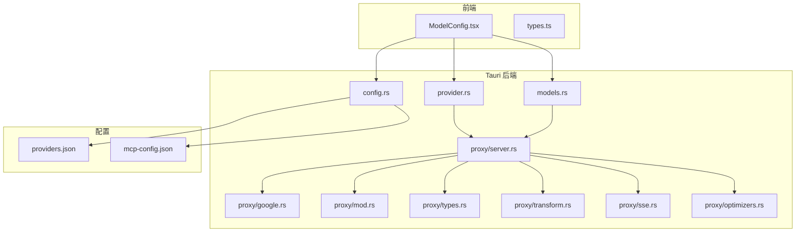
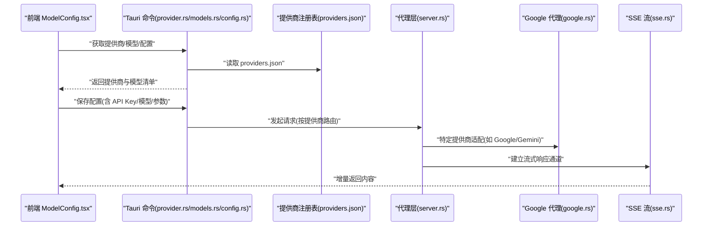
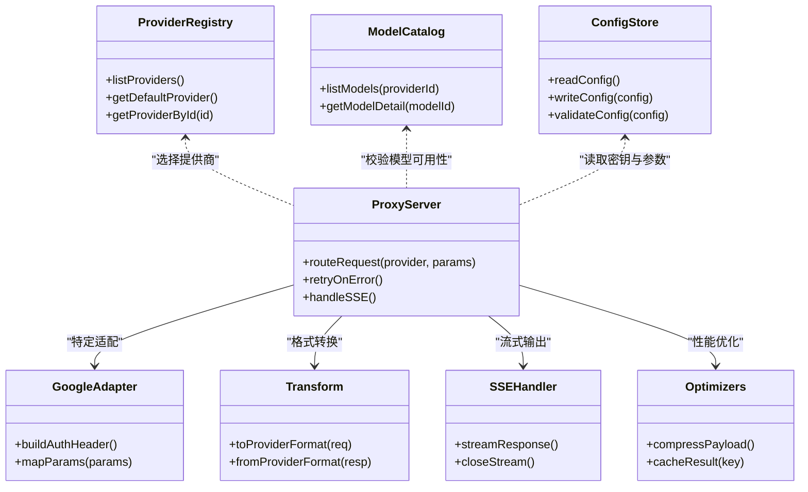
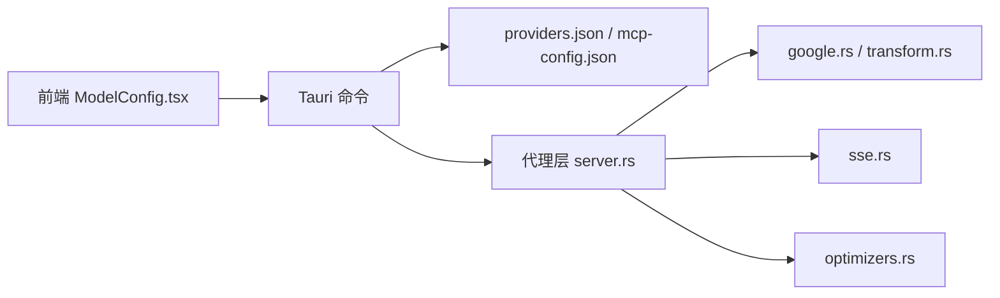

# AI 模型配置

<cite>
**本文引用的文件**   
- [ai-tools/providers.json](file://ai-tools/providers.json)
- [ai-tools/mcp-config.json](file://ai-tools/mcp-config.json)
- [src/components/ai/ModelConfig.tsx](file://src/components/ai/ModelConfig.tsx)
- [src/components/ai/types.ts](file://src/components/ai/types.ts)
- [src-tauri/src/commands/ai/provider.rs](file://src-tauri/src/commands/ai/provider.rs)
- [src-tauri/src/commands/ai/models.rs](file://src-tauri/src/commands/ai/models.rs)
- [src-tauri/src/commands/ai/config.rs](file://src-tauri/src/commands/ai/config.rs)
- [src-tauri/src/proxy/server.rs](file://src-tauri/src/proxy/server.rs)
- [src-tauri/src/proxy/google.rs](file://src-tauri/src/proxy/google.rs)
- [src-tauri/src/proxy/mod.rs](file://src-tauri/src/proxy/mod.rs)
- [src-tauri/src/proxy/transform.rs](file://src-tauri/src/proxy/transform.rs)
- [src-tauri/src/proxy/types.rs](file://src-tauri/src/proxy/types.rs)
- [src-tauri/src/proxy/sse.rs](file://src-tauri/src/proxy/sse.rs)
- [src-tauri/src/proxy/optimizers.rs](file://src-tauri/src/proxy/optimizers.rs)
</cite>

## 目录
1. [简介](#简介)
2. [项目结构](#项目结构)
3. [核心组件](#核心组件)
4. [架构总览](#架构总览)
5. [详细组件分析](#详细组件分析)
6. [依赖关系分析](#依赖关系分析)
7. [性能与费用控制](#性能与费用控制)
8. [故障排除指南](#故障排除指南)
9. [结论](#结论)
10. [附录：配置示例与最佳实践](#附录配置示例与最佳实践)

## 简介
本章节面向初学者与高级用户，系统化说明本项目中“AI 模型配置”的能力边界、支持提供商（OpenAI、Claude、Gemini、本地模型等）、API Key 设置、模型选择、参数调优、费用控制策略、多提供商切换与优先级管理，并提供可操作的配置文件示例与最佳实践。同时给出认证错误、网络问题与服务限流的排查方法。

## 项目结构
围绕 AI 模型配置的关键代码与配置分布如下：
- 前端 UI 与类型定义：用于展示与编辑模型配置、提供商列表、模型清单等
- Tauri 后端命令：提供读取/写入配置、枚举提供商与模型、代理转发等能力
- 代理层：统一封装不同提供商的 HTTP/SSE 调用、重试与优化
- 全局配置与 MCP 集成：集中式 providers 注册与工具链集成

图表来源
- [src/components/ai/ModelConfig.tsx](file://src/components/ai/ModelConfig.tsx)
- [src/components/ai/types.ts](file://src/components/ai/types.ts)
- [src-tauri/src/commands/ai/provider.rs](file://src-tauri/src/commands/ai/provider.rs)
- [src-tauri/src/commands/ai/models.rs](file://src-tauri/src/commands/ai/models.rs)
- [src-tauri/src/commands/ai/config.rs](file://src-tauri/src/commands/ai/config.rs)
- [src-tauri/src/proxy/server.rs](file://src-tauri/src/proxy/server.rs)
- [src-tauri/src/proxy/google.rs](file://src-tauri/src/proxy/google.rs)
- [src-tauri/src/proxy/mod.rs](file://src-tauri/src/proxy/mod.rs)
- [src-tauri/src/proxy/types.rs](file://src-tauri/src/proxy/types.rs)
- [src-tauri/src/proxy/transform.rs](file://src-tauri/src/proxy/transform.rs)
- [src-tauri/src/proxy/sse.rs](file://src-tauri/src/proxy/sse.rs)
- [src-tauri/src/proxy/optimizers.rs](file://src-tauri/src/proxy/optimizers.rs)
- [ai-tools/providers.json](file://ai-tools/providers.json)
- [ai-tools/mcp-config.json](file://ai-tools/mcp-config.json)

章节来源
- [src/components/ai/ModelConfig.tsx](file://src/components/ai/ModelConfig.tsx)
- [src/components/ai/types.ts](file://src/components/ai/types.ts)
- [src-tauri/src/commands/ai/provider.rs](file://src-tauri/src/commands/ai/provider.rs)
- [src-tauri/src/commands/ai/models.rs](file://src-tauri/src/commands/ai/models.rs)
- [src-tauri/src/commands/ai/config.rs](file://src-tauri/src/commands/ai/config.rs)
- [ai-tools/providers.json](file://ai-tools/providers.json)
- [ai-tools/mcp-config.json](file://ai-tools/mcp-config.json)

## 核心组件
- 提供商注册表 providers.json：集中声明支持的 AI 提供商及其基础信息，供前端与后端共同消费
- MCP 配置 mcp-config.json：与 MCP 生态对接的工具链配置入口
- 前端 ModelConfig.tsx：可视化编辑提供商、模型、密钥与参数
- 类型定义 types.ts：前后端共享的配置数据结构
- Tauri 命令 provider.rs / models.rs / config.rs：暴露 API 给前端，读写配置、列举提供商与模型
- 代理层 server.rs 及子模块：统一处理不同提供商的协议差异、重试、限流、SSE 流式响应等

章节来源
- [ai-tools/providers.json](file://ai-tools/providers.json)
- [ai-tools/mcp-config.json](file://ai-tools/mcp-config.json)
- [src/components/ai/ModelConfig.tsx](file://src/components/ai/ModelConfig.tsx)
- [src/components/ai/types.ts](file://src/components/ai/types.ts)
- [src-tauri/src/commands/ai/provider.rs](file://src-tauri/src/commands/ai/provider.rs)
- [src-tauri/src/commands/ai/models.rs](file://src-tauri/src/commands/ai/models.rs)
- [src-tauri/src/commands/ai/config.rs](file://src-tauri/src/commands/ai/config.rs)
- [src-tauri/src/proxy/server.rs](file://src-tauri/src/proxy/server.rs)

## 架构总览
下图展示了从前端到后端的完整请求路径，以及代理层如何适配不同提供商。

图表来源
- [src/components/ai/ModelConfig.tsx](file://src/components/ai/ModelConfig.tsx)
- [src-tauri/src/commands/ai/provider.rs](file://src-tauri/src/commands/ai/provider.rs)
- [src-tauri/src/commands/ai/models.rs](file://src-tauri/src/commands/ai/models.rs)
- [src-tauri/src/commands/ai/config.rs](file://src-tauri/src/commands/ai/config.rs)
- [ai-tools/providers.json](file://ai-tools/providers.json)
- [src-tauri/src/proxy/server.rs](file://src-tauri/src/proxy/server.rs)
- [src-tauri/src/proxy/google.rs](file://src-tauri/src/proxy/google.rs)
- [src-tauri/src/proxy/sse.rs](file://src-tauri/src/proxy/sse.rs)

## 详细组件分析

### 提供商注册与发现（providers.json）
- 作用：声明所有可用提供商的基础信息与默认行为，作为“单一事实源”
- 典型字段（概念性说明）：
  - id：唯一标识（如 openai、claude、gemini、local）
  - name：显示名称
  - base_url：基础 URL（对 OpenAI 兼容接口、本地服务或自定义网关）
  - auth：鉴权方式（如 Bearer Token、API Key）
  - features：是否支持流式输出、图像输入等
  - priority：优先级（用于多提供商切换时的选择顺序）
  - cost：计费单位或限额提示（可选）
- 使用位置：
  - 前端在加载时读取并渲染提供商列表
  - 后端在路由请求时根据当前选择的提供商查找对应配置

章节来源
- [ai-tools/providers.json](file://ai-tools/providers.json)

### MCP 集成入口（mcp-config.json）
- 作用：为 MCP 生态提供统一的工具与服务发现入口
- 与 AI 配置的关系：
  - 可将 AI 提供商作为 MCP 工具的一部分进行编排
  - 通过该文件将模型能力注入到工作流中

章节来源
- [ai-tools/mcp-config.json](file://ai-tools/mcp-config.json)

### 前端配置面板（ModelConfig.tsx）
- 功能要点：
  - 列出 providers.json 中的提供商，允许用户选择默认提供商
  - 展示当前提供商下的可用模型（由后端 models.rs 提供）
  - 编辑 API Key、Base URL、温度、最大令牌数等参数
  - 保存至后端配置（config.rs），并在需要时立即生效
- 交互流程：
  - 初始化：拉取提供商与模型清单
  - 变更：校验必填项（如 API Key）
  - 保存：调用后端持久化配置
  - 测试：触发一次轻量请求验证连通性与鉴权

章节来源
- [src/components/ai/ModelConfig.tsx](file://src/components/ai/ModelConfig.tsx)
- [src/components/ai/types.ts](file://src/components/ai/types.ts)

### 类型定义（types.ts）
- 目的：统一前后端配置结构，避免字段漂移
- 关键类型（概念性说明）：
  - Provider：id、name、base_url、auth、features、priority 等
  - Model：id、name、context_window、max_tokens、cost_per_token（可选）
  - Config：当前选中的提供商、模型、API Key、通用参数（temperature、top_p、max_tokens 等）
- 影响范围：
  - 前端表单绑定
  - 后端序列化/反序列化
  - 代理层构造请求体

章节来源
- [src/components/ai/types.ts](file://src/components/ai/types.ts)

### Tauri 命令：提供商与模型（provider.rs / models.rs）
- provider.rs：
  - 提供“列出提供商”“设置默认提供商”等命令
  - 读取 providers.json 并合并运行时覆盖（如有）
- models.rs：
  - 提供“列出模型”“获取模型详情”等命令
  - 可能缓存远程模型清单以提升性能
- 与前端交互：
  - 前端通过 Tauri 命令 API 调用上述能力

章节来源
- [src-tauri/src/commands/ai/provider.rs](file://src-tauri/src/commands/ai/provider.rs)
- [src-tauri/src/commands/ai/models.rs](file://src-tauri/src/commands/ai/models.rs)

### Tauri 命令：配置读写（config.rs）
- 职责：
  - 读取/更新全局 AI 配置（包括默认提供商、模型、API Key、通用参数）
  - 校验配置合法性（如必填字段、数值范围）
  - 触发必要的热重载（例如刷新模型清单）
- 安全建议：
  - 敏感字段（API Key）应加密存储或受操作系统凭据保护（视平台能力）

章节来源
- [src-tauri/src/commands/ai/config.rs](file://src-tauri/src/commands/ai/config.rs)

### 代理层（server.rs 及子模块）
- server.rs：
  - 统一入口，解析请求、选择提供商、组装请求头与参数
  - 负责重试、超时、限流、SSE 转发
- google.rs：
  - 针对 Google/Gemini 的特殊适配（如鉴权、路径、参数映射）
- transform.rs：
  - 请求/响应体转换，屏蔽不同提供商的差异
- sse.rs：
  - 处理 Server-Sent Events 流式传输
- optimizers.rs：
  - 压缩、去重、缓存等优化策略
- types.rs：
  - 内部使用的中间结构与错误码

图表来源
- [src-tauri/src/commands/ai/provider.rs](file://src-tauri/src/commands/ai/provider.rs)
- [src-tauri/src/commands/ai/models.rs](file://src-tauri/src/commands/ai/models.rs)
- [src-tauri/src/commands/ai/config.rs](file://src-tauri/src/commands/ai/config.rs)
- [src-tauri/src/proxy/server.rs](file://src-tauri/src/proxy/server.rs)
- [src-tauri/src/proxy/google.rs](file://src-tauri/src/proxy/google.rs)
- [src-tauri/src/proxy/transform.rs](file://src-tauri/src/proxy/transform.rs)
- [src-tauri/src/proxy/sse.rs](file://src-tauri/src/proxy/sse.rs)
- [src-tauri/src/proxy/optimizers.rs](file://src-tauri/src/proxy/optimizers.rs)

章节来源
- [src-tauri/src/proxy/server.rs](file://src-tauri/src/proxy/server.rs)
- [src-tauri/src/proxy/google.rs](file://src-tauri/src/proxy/google.rs)
- [src-tauri/src/proxy/transform.rs](file://src-tauri/src/proxy/transform.rs)
- [src-tauri/src/proxy/sse.rs](file://src-tauri/src/proxy/sse.rs)
- [src-tauri/src/proxy/optimizers.rs](file://src-tauri/src/proxy/optimizers.rs)
- [src-tauri/src/proxy/types.rs](file://src-tauri/src/proxy/types.rs)

## 依赖关系分析
- 前端依赖 Tauri 命令以获取/保存配置
- 命令层依赖 providers.json 与 MCP 配置
- 代理层依赖各提供商 SDK/HTTP 客户端与 SSE 实现
- 优化器与转换器贯穿请求链路，提升稳定性与吞吐

图表来源
- [src/components/ai/ModelConfig.tsx](file://src/components/ai/ModelConfig.tsx)
- [src-tauri/src/commands/ai/provider.rs](file://src-tauri/src/commands/ai/provider.rs)
- [src-tauri/src/commands/ai/models.rs](file://src-tauri/src/commands/ai/models.rs)
- [src-tauri/src/commands/ai/config.rs](file://src-tauri/src/commands/ai/config.rs)
- [ai-tools/providers.json](file://ai-tools/providers.json)
- [ai-tools/mcp-config.json](file://ai-tools/mcp-config.json)
- [src-tauri/src/proxy/server.rs](file://src-tauri/src/proxy/server.rs)
- [src-tauri/src/proxy/google.rs](file://src-tauri/src/proxy/google.rs)
- [src-tauri/src/proxy/transform.rs](file://src-tauri/src/proxy/transform.rs)
- [src-tauri/src/proxy/sse.rs](file://src-tauri/src/proxy/sse.rs)
- [src-tauri/src/proxy/optimizers.rs](file://src-tauri/src/proxy/optimizers.rs)

## 性能与费用控制
- 模型选择与上下文窗口
  - 优先选择满足任务复杂度且成本更低的模型
  - 合理设置 max_tokens 与 temperature，避免过度生成
- 流式输出
  - 启用 SSE 以降低首字节延迟，提升用户体验
- 重试与退避
  - 对瞬时失败（网络抖动、限流）采用指数退避重试
- 缓存与去重
  - 对相同请求结果进行短期缓存，减少重复调用
- 费用控制
  - 基于 providers.json 中的 cost 字段估算单次调用成本
  - 结合业务阈值限制每日/每会话配额
  - 对高成本模型增加二次确认或审批流程

[本节为通用指导，不直接分析具体文件]

## 故障排除指南
- 认证错误（401/403）
  - 检查 API Key 是否正确、是否过期
  - 确认 Base URL 与鉴权头匹配提供商要求
  - 若使用代理，确保代理未篡改鉴权头
- 网络问题（超时/连接失败）
  - 检查 DNS、防火墙、代理设置
  - 调整超时与重试策略
- 服务限流（429）
  - 降低并发与请求频率
  - 启用指数退避与队列化
- 模型不可用
  - 确认模型 ID 在当前提供商下存在
  - 检查模型能力（是否支持图像、函数调用等）
- 流式异常
  - 检查 SSE 连接是否被中间设备中断
  - 增加断线重连逻辑

章节来源
- [src-tauri/src/proxy/server.rs](file://src-tauri/src/proxy/server.rs)
- [src-tauri/src/proxy/google.rs](file://src-tauri/src/proxy/google.rs)
- [src-tauri/src/proxy/sse.rs](file://src-tauri/src/proxy/sse.rs)
- [src-tauri/src/proxy/optimizers.rs](file://src-tauri/src/proxy/optimizers.rs)

## 结论
通过 providers.json 的统一注册、Tauri 命令的集中管理与代理层的协议适配，本项目实现了跨提供商的 AI 模型配置与调用。配合前端可视化面板，用户可便捷地完成密钥管理、模型选择与参数调优；代理层则保障稳定性、性能与可扩展性。建议在生产环境引入配额与审计机制，并结合业务场景持续优化模型与参数。

[本节为总结性内容，不直接分析具体文件]

## 附录：配置示例与最佳实践

### 基础配置步骤（初学者）
- 安装与启动应用后，打开“AI 模型配置”面板
- 在提供商列表中选择目标提供商（如 OpenAI、Claude、Gemini、本地模型）
- 填写 API Key 与必要参数（如 Base URL、temperature、max_tokens）
- 点击“保存”，必要时执行“连通性测试”
- 如需切换默认提供商，可在提供商列表中设置优先级或默认值

章节来源
- [src/components/ai/ModelConfig.tsx](file://src/components/ai/ModelConfig.tsx)
- [src/components/ai/types.ts](file://src/components/ai/types.ts)
- [src-tauri/src/commands/ai/config.rs](file://src-tauri/src/commands/ai/config.rs)

### 高级配置（自定义提供商与参数）
- 在 providers.json 中添加新提供商条目（包含 id、name、base_url、auth、features、priority 等）
- 若需特殊适配（如鉴权或参数映射），在代理层新增适配器（参考 google.rs）
- 在 models.rs 中扩展模型清单或接入远程模型目录
- 在 types.ts 中补充新的配置字段，保持前后端一致

章节来源
- [ai-tools/providers.json](file://ai-tools/providers.json)
- [src-tauri/src/commands/ai/models.rs](file://src-tauri/src/commands/ai/models.rs)
- [src-tauri/src/proxy/google.rs](file://src-tauri/src/proxy/google.rs)
- [src/components/ai/types.ts](file://src/components/ai/types.ts)

### 配置文件示例（概念性）
以下为概念性示例，实际字段以 providers.json 与 types.ts 为准：

- providers.json（节选）
  - 示例条目：
    - id: "openai"
      name: "OpenAI"
      base_url: "https://api.openai.com/v1"
      auth: "Bearer"
      features: ["streaming", "images"]
      priority: 1
    - id: "claude"
      name: "Claude"
      base_url: "https://api.anthropic.com/v1"
      auth: "Bearer"
      features: ["streaming"]
      priority: 2
    - id: "gemini"
      name: "Gemini"
      base_url: "https://generativelanguage.googleapis.com/v1"
      auth: "Bearer"
      features: ["streaming", "images"]
      priority: 3
    - id: "local"
      name: "本地模型"
      base_url: "http://127.0.0.1:8080/v1"
      auth: "None"
      features: ["streaming"]
      priority: 10

- mcp-config.json（节选）
  - 示例条目：
    - tools:
      - name: "ai_chat"
        provider: "openai"
        model: "gpt-4o"
        parameters:
          temperature: 0.7
          max_tokens: 2048

章节来源
- [ai-tools/providers.json](file://ai-tools/providers.json)
- [ai-tools/mcp-config.json](file://ai-tools/mcp-config.json)

### 最佳实践
- 密钥管理
  - 使用系统级凭据管理器或加密存储
  - 定期轮换 API Key
- 模型与参数
  - 先小批量验证，再逐步扩大规模
  - 对高成本模型设置上限与告警
- 稳定性
  - 启用重试与退避
  - 监控 SSE 连接状态
- 可观测性
  - 记录关键指标（成功率、延迟、Token 用量）
  - 对异常进行分级告警

[本节为通用指导，不直接分析具体文件]