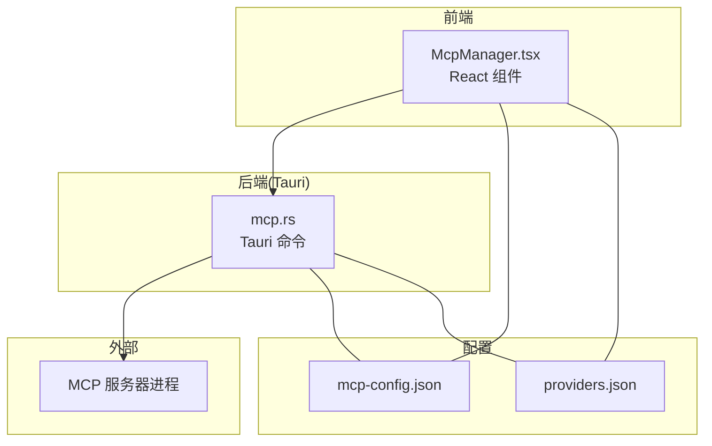
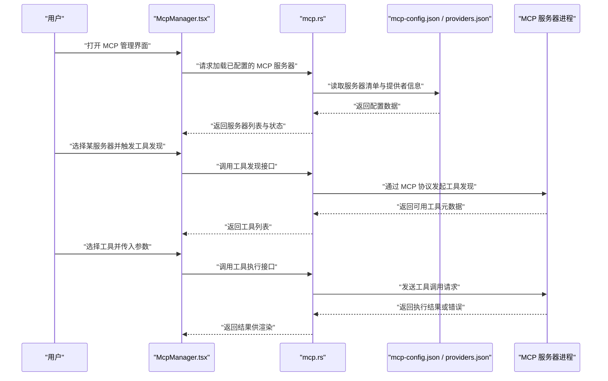
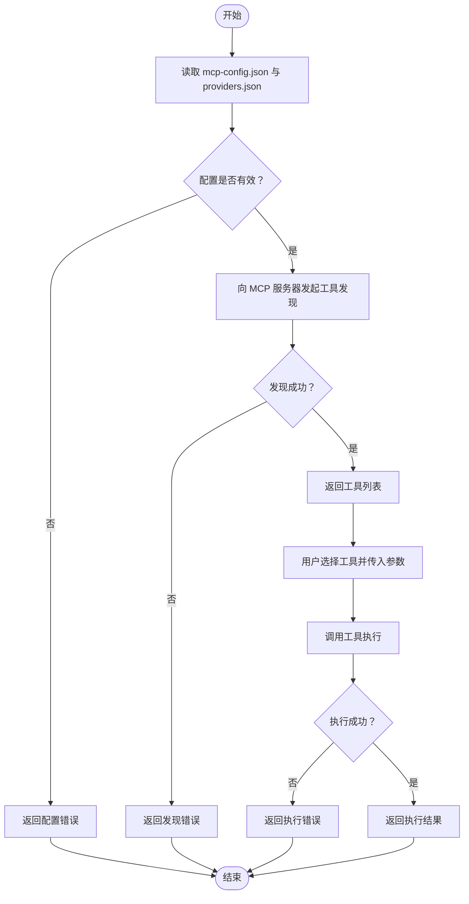
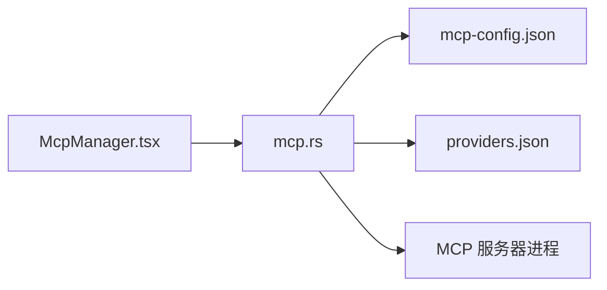

# MCP 服务器管理

<cite>
**本文引用的文件**   
- [src/components/ai/McpManager.tsx](file://src/components/ai/McpManager.tsx)
- [src-tauri/src/commands/ai/mcp.rs](file://src-tauri/src/commands/ai/mcp.rs)
- [ai-tools/mcp-config.json](file://ai-tools/mcp-config.json)
- [ai-tools/providers.json](file://ai-tools/providers.json)
- [docs/tool-config/qwen-code/features/mcp.md](file://docs/tool-config/qwen-code/features/mcp.md)
- [docs/tool-config/deveco-code/mcp-servers.mdx](file://docs/tool-config/deveco-code/mcp-servers.mdx)
- [docs/tool-config/open-code/mcp-servers.mdx](file://docs/tool-config/open-code/mcp-servers.mdx)
- [docs/tool-config/mimo-code/mcp-servers.mdx](file://docs/tool-config/mimo-code/mcp-servers.mdx)
</cite>

## 目录
1. [简介](#简介)
2. [项目结构](#项目结构)
3. [核心组件](#核心组件)
4. [架构总览](#架构总览)
5. [详细组件分析](#详细组件分析)
6. [依赖关系分析](#依赖关系分析)
7. [性能考虑](#性能考虑)
8. [故障排查指南](#故障排查指南)
9. [结论](#结论)
10. [附录](#附录)

## 简介
本文件围绕 Model Context Protocol（MCP）服务器的安装、配置与管理，结合仓库中的前端与后端实现，系统阐述工具发现、调用流程与错误处理机制。文档同时提供常用 MCP 服务器的配置示例与使用场景，并给出自定义 MCP 服务器的开发指南与最佳实践，帮助初学者快速上手，也为开发者扩展能力提供参考。

## 项目结构
本项目采用 Tauri 架构：前端 React 组件负责展示与交互，Rust 命令层负责进程管理与协议通信，配置文件集中存放于 ai-tools 目录。

图表来源
- [src/components/ai/McpManager.tsx](file://src/components/ai/McpManager.tsx)
- [src-tauri/src/commands/ai/mcp.rs](file://src-tauri/src/commands/ai/mcp.rs)
- [ai-tools/mcp-config.json](file://ai-tools/mcp-config.json)
- [ai-tools/providers.json](file://ai-tools/providers.json)

章节来源
- [src/components/ai/McpManager.tsx](file://src/components/ai/McpManager.tsx)
- [src-tauri/src/commands/ai/mcp.rs](file://src-tauri/src/commands/ai/mcp.rs)
- [ai-tools/mcp-config.json](file://ai-tools/mcp-config.json)
- [ai-tools/providers.json](file://ai-tools/providers.json)

## 核心组件
- 前端 MCP 管理器：提供 MCP 服务器的可视化配置、启停、状态查看与工具列表浏览等交互。
- 后端 MCP 命令：封装对 MCP 服务器的进程生命周期管理、消息收发与结果返回。
- 配置文件：集中定义 MCP 服务器清单、提供者信息与通用参数。

章节来源
- [src/components/ai/McpManager.tsx](file://src/components/ai/McpManager.tsx)
- [src-tauri/src/commands/ai/mcp.rs](file://src-tauri/src/commands/ai/mcp.rs)
- [ai-tools/mcp-config.json](file://ai-tools/mcp-config.json)
- [ai-tools/providers.json](file://ai-tools/providers.json)

## 架构总览
下图展示了从用户操作到 MCP 服务器调用的端到端流程。

图表来源
- [src/components/ai/McpManager.tsx](file://src/components/ai/McpManager.tsx)
- [src-tauri/src/commands/ai/mcp.rs](file://src-tauri/src/commands/ai/mcp.rs)
- [ai-tools/mcp-config.json](file://ai-tools/mcp-config.json)
- [ai-tools/providers.json](file://ai-tools/providers.json)

## 详细组件分析

### 前端 MCP 管理器（McpManager.tsx）
职责
- 渲染 MCP 服务器列表、状态与工具树。
- 触发“加载配置”“启动/停止”“工具发现”“工具调用”等操作。
- 将用户输入转换为后端命令参数，并展示返回结果。

关键交互
- 初始化时向命令层请求已配置的服务器清单。
- 点击“工具发现”后，根据所选服务器发起发现请求。
- 选择具体工具后，组装参数并调用执行接口。

章节来源
- [src/components/ai/McpManager.tsx](file://src/components/ai/McpManager.tsx)

### 后端 MCP 命令（mcp.rs）
职责
- 暴露给前端的 Tauri 命令，用于：
  - 读取与解析 mcp-config.json 与 providers.json。
  - 管理 MCP 服务器进程的生命周期（启动、停止、健康检查）。
  - 通过 MCP 协议与服务器进行工具发现与工具调用。
  - 统一错误包装与日志记录。

典型流程
- 加载配置：解析 JSON 配置，校验必填字段，合并默认值。
- 工具发现：向目标服务器发送发现请求，缓存工具元数据。
- 工具调用：序列化参数，转发至服务器，反序列化结果并返回。
- 错误处理：捕获网络/进程异常，转换为前端可展示的错误对象。

章节来源
- [src-tauri/src/commands/ai/mcp.rs](file://src-tauri/src/commands/ai/mcp.rs)

### 配置文件（mcp-config.json / providers.json）
作用
- mcp-config.json：集中声明可用的 MCP 服务器实例、运行参数与环境变量。
- providers.json：描述不同 MCP 服务器的提供者信息（如名称、版本、来源、默认参数等），便于自动发现与模板化配置。

建议结构要点
- 每个服务器条目包含唯一标识、可执行路径或远程地址、启动参数、环境变量、超时与重试策略等。
- 提供者信息应包含兼容的协议版本、工具命名空间与权限范围。

章节来源
- [ai-tools/mcp-config.json](file://ai-tools/mcp-config.json)
- [ai-tools/providers.json](file://ai-tools/providers.json)

### 工具发现与调用流程

图表来源
- [src-tauri/src/commands/ai/mcp.rs](file://src-tauri/src/commands/ai/mcp.rs)
- [ai-tools/mcp-config.json](file://ai-tools/mcp-config.json)
- [ai-tools/providers.json](file://ai-tools/providers.json)

## 依赖关系分析
- 前端 McpManager.tsx 依赖后端 mcp.rs 提供的命令接口。
- 后端命令依赖配置文件 mcp-config.json 与 providers.json。
- 运行时依赖外部 MCP 服务器进程，遵循 MCP 协议进行通信。

图表来源
- [src/components/ai/McpManager.tsx](file://src/components/ai/McpManager.tsx)
- [src-tauri/src/commands/ai/mcp.rs](file://src-tauri/src/commands/ai/mcp.rs)
- [ai-tools/mcp-config.json](file://ai-tools/mcp-config.json)
- [ai-tools/providers.json](file://ai-tools/providers.json)

章节来源
- [src/components/ai/McpManager.tsx](file://src/components/ai/McpManager.tsx)
- [src-tauri/src/commands/ai/mcp.rs](file://src-tauri/src/commands/ai/mcp.rs)
- [ai-tools/mcp-config.json](file://ai-tools/mcp-config.json)
- [ai-tools/providers.json](file://ai-tools/providers.json)

## 性能考虑
- 连接复用：为同一 MCP 服务器建立长连接，避免频繁创建/销毁进程带来的开销。
- 并发控制：限制并发工具调用数量，防止下游资源争用。
- 结果缓存：对幂等工具的结果进行短期缓存，减少重复计算。
- 超时与重试：合理设置发现与调用的超时时间，配合指数退避重试提升鲁棒性。
- 增量更新：工具元数据变更时仅拉取差异，降低带宽与解析成本。

[本节为通用指导，不直接分析具体文件]

## 故障排查指南
常见问题与定位步骤
- 无法加载配置
  - 检查 mcp-config.json 与 providers.json 语法与必填字段。
  - 确认路径与权限是否正确。
- 工具发现失败
  - 验证 MCP 服务器是否正常运行且可达。
  - 检查网络代理、防火墙与端口占用。
- 工具调用报错
  - 核对工具参数是否符合服务端契约。
  - 查看后端日志与返回的错误码，区分网络错误、参数错误与业务错误。
- 性能问题
  - 观察并发数与超时配置，必要时启用结果缓存与连接复用。

章节来源
- [src-tauri/src/commands/ai/mcp.rs](file://src-tauri/src/commands/ai/mcp.rs)
- [ai-tools/mcp-config.json](file://ai-tools/mcp-config.json)
- [ai-tools/providers.json](file://ai-tools/providers.json)

## 结论
本方案以前端可视化管理与后端进程/协议封装为核心，结合集中式配置文件，实现了 MCP 服务器的统一安装、配置、发现与调用。通过合理的错误处理与性能优化策略，可在保证稳定性的前提下提升整体效率。对于需要扩展能力的团队，可基于现有模式快速接入新的 MCP 服务器与工具生态。

[本节为总结性内容，不直接分析具体文件]

## 附录

### 常用 MCP 服务器配置示例与使用场景
- 代码仓库与版本控制类
  - 场景：在 AI 辅助下执行 git 操作、提交、分支管理等。
  - 参考：[docs/tool-config/qwen-code/features/mcp.md](file://docs/tool-config/qwen-code/features/mcp.md)
- 数据库与运维类
  - 场景：查询与分析结构化数据、执行安全运维任务。
  - 参考：[docs/tool-config/deveco-code/mcp-servers.mdx](file://docs/tool-config/deveco-code/mcp-servers.mdx)
- 云与平台集成类
  - 场景：对接云平台 API、自动化部署与监控。
  - 参考：[docs/tool-config/open-code/mcp-servers.mdx](file://docs/tool-config/open-code/mcp-servers.mdx)
- 多模型编排类
  - 场景：在不同模型间路由与组合工具链。
  - 参考：[docs/tool-config/mimo-code/mcp-servers.mdx](file://docs/tool-config/mimo-code/mcp-servers.mdx)

章节来源
- [docs/tool-config/qwen-code/features/mcp.md](file://docs/tool-config/qwen-code/features/mcp.md)
- [docs/tool-config/deveco-code/mcp-servers.mdx](file://docs/tool-config/deveco-code/mcp-servers.mdx)
- [docs/tool-config/open-code/mcp-servers.mdx](file://docs/tool-config/open-code/mcp-servers.mdx)
- [docs/tool-config/mimo-code/mcp-servers.mdx](file://docs/tool-config/mimo-code/mcp-servers.mdx)

### 自定义 MCP 服务器开发指南与最佳实践
- 协议适配
  - 明确支持的 MCP 版本与工具命名空间。
  - 严格遵循参数与返回值的类型约定。
- 健壮性
  - 实现幂等性与去重逻辑，避免副作用。
  - 增加超时、重试与熔断保护。
- 可观测性
  - 输出结构化日志，包含请求 ID、耗时与错误堆栈。
  - 暴露健康检查与指标接口。
- 安全性
  - 最小权限原则，按需开放工具。
  - 对敏感参数进行脱敏与审计。
- 兼容性
  - 向后兼容旧版工具签名。
  - 提供迁移说明与降级策略。

[本节为通用指导，不直接分析具体文件]

### MCP 与 AI 模型的集成方式与优化策略
- 集成方式
  - 以工具形式暴露 MCP 能力，由 AI 模型在推理过程中按需调用。
  - 通过统一的命令层屏蔽底层差异，向上提供一致的工具发现与调用接口。
- 优化策略
  - 上下文裁剪：仅传递必要参数，减少传输体积。
  - 批量调用：合并独立小任务，降低往返次数。
  - 流式响应：对大结果采用分块返回，提升交互体验。
  - 缓存与预取：对热点工具结果进行缓存，预测性预取提升命中率。

[本节为通用指导，不直接分析具体文件]