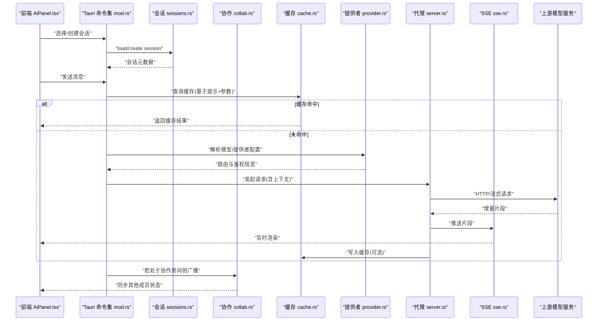
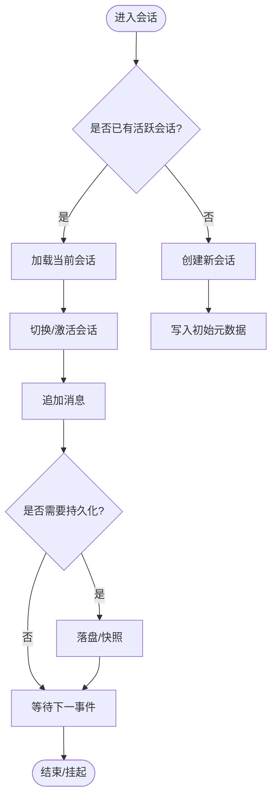
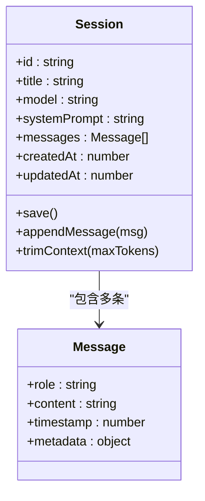
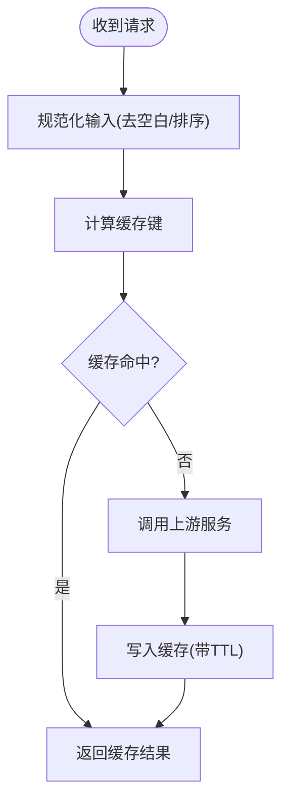
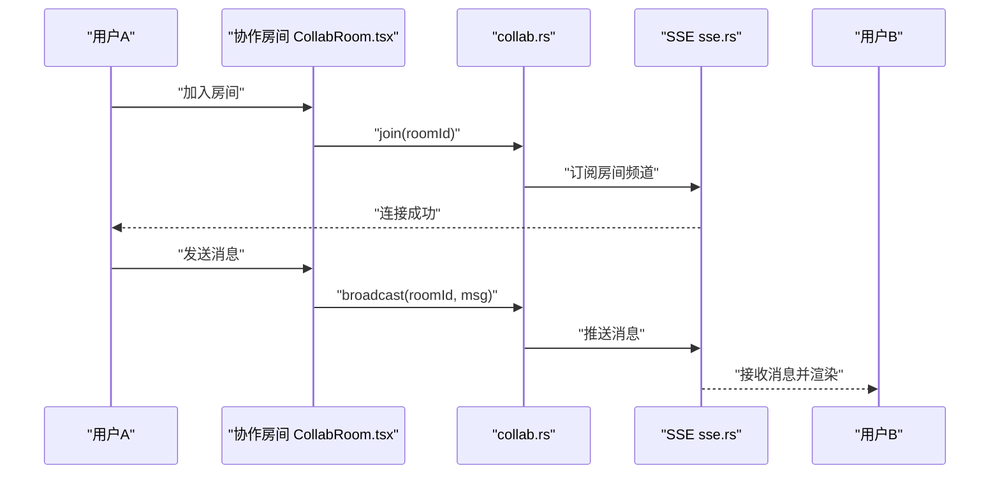
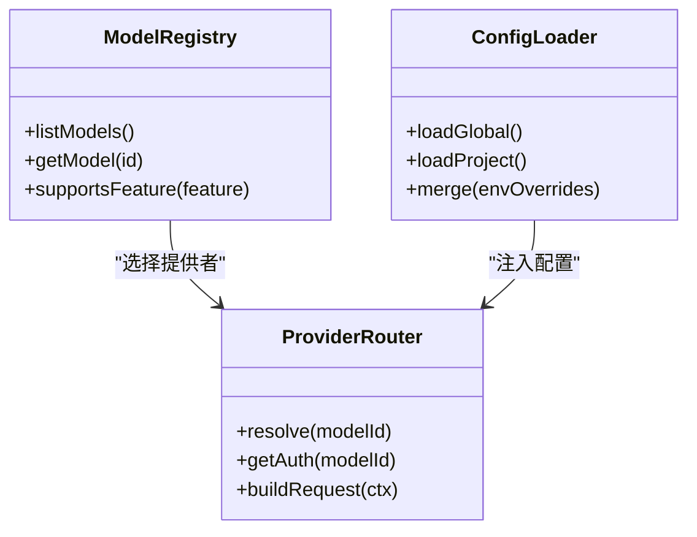
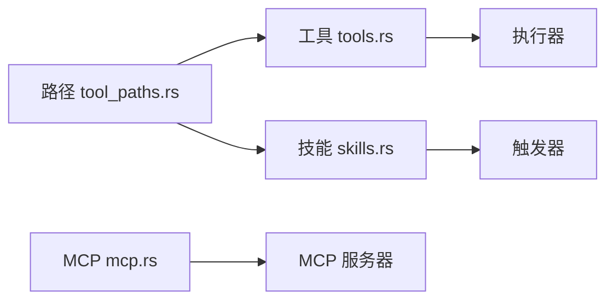
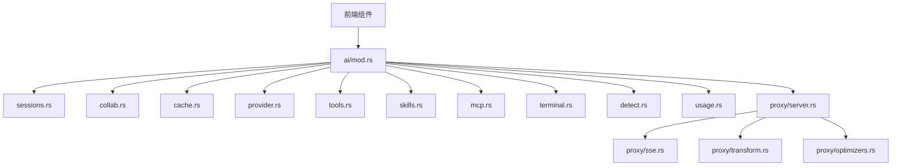

# 会话管理

<cite>
**本文引用的文件**   
- [src/components/ai/AiPanel.tsx](file://src/components/ai/AiPanel.tsx)
- [src/components/ai/CollabRoom.tsx](file://src/components/ai/CollabRoom.tsx)
- [src-tauri/src/commands/ai/sessions.rs](file://src-tauri/src/commands/ai/sessions.rs)
- [src-tauri/src/commands/ai/mod.rs](file://src-tauri/src/commands/ai/mod.rs)
- [src-tauri/src/commands/ai/collab.rs](file://src-tauri/src/commands/ai/collab.rs)
- [src-tauri/src/commands/ai/cache.rs](file://src-tauri/src/commands/ai/cache.rs)
- [src-tauri/src/commands/ai/config.rs](file://src-tauri/src/commands/ai/config.rs)
- [src-tauri/src/commands/ai/models.rs](file://src-tauri/src/commands/ai/models.rs)
- [src-tauri/src/commands/ai/provider.rs](file://src-tauri/src/commands/ai/provider.rs)
- [src-tauri/src/commands/ai/terminal.rs](file://src-tauri/src/commands/ai/terminal.rs)
- [src-tauri/src/commands/ai/tools.rs](file://src-tauri/src/commands/ai/tools.rs)
- [src-tauri/src/commands/ai/mcp.rs](file://src-tauri/src/commands/ai/mcp.rs)
- [src-tauri/src/commands/ai/skills.rs](file://src-tauri/src/commands/ai/skills.rs)
- [src-tauri/src/commands/ai/tool_paths.rs](file://src-tauri/src/commands/ai/tool_paths.rs)
- [src-tauri/src/commands/ai/detect.rs](file://src-tauri/src/commands/ai/detect.rs)
- [src-tauri/src/commands/ai/usage.rs](file://src-tauri/src/commands/ai/usage.rs)
- [src-tauri/src/proxy/server.rs](file://src-tauri/src/proxy/server.rs)
- [src-tauri/src/proxy/sse.rs](file://src-tauri/src/proxy/sse.rs)
- [src-tauri/src/proxy/types.rs](file://src-tauri/src/proxy/types.rs)
- [src-tauri/src/proxy/transform.rs](file://src-tauri/src/proxy/transform.rs)
- [src-tauri/src/proxy/optimizers.rs](file://src-tauri/src/proxy/optimizers.rs)
- [src-tauri/src/proxy/google.rs](file://src-tauri/src/proxy/google.rs)
- [src-tauri/src/proxy/mod.rs](file://src-tauri/src/proxy/mod.rs)
- [src-tauri/src/lib.rs](file://src-tauri/src/lib.rs)
- [src-tauri/src/main.rs](file://src-tauri/src/main.rs)
- [src-tauri/build.rs](file://src-tauri/build.rs)
- [src-tauri/tauri.conf.json](file://src-tauri/tauri.conf.json)
- [src/components/ai/AiCacheManager.tsx](file://src/components/ai/AiCacheManager.tsx)
- [src/components/ai/ModelConfig.tsx](file://src/components/ai/ModelConfig.tsx)
- [src/components/ai/SkillManager.tsx](file://src/components/ai/SkillManager.tsx)
- [src/components/ai/McpManager.tsx](file://src/components/ai/McpManager.tsx)
- [src/components/ai/ToolLauncher.tsx](file://src/components/ai/ToolLauncher.tsx)
- [src/components/ai/UsageStats.tsx](file://src/components/ai/UsageStats.tsx)
</cite>

## 目录
1. [简介](#简介)
2. [项目结构](#项目结构)
3. [核心组件](#核心组件)
4. [架构总览](#架构总览)
5. [详细组件分析](#详细组件分析)
6. [依赖关系分析](#依赖关系分析)
7. [性能考虑](#性能考虑)
8. [故障排查指南](#故障排查指南)
9. [结论](#结论)
10. [附录](#附录)

## 简介
本文件聚焦于“会话管理”能力，覆盖 AI 对话会话的完整生命周期：创建、切换、保存与恢复；消息历史与上下文管理；缓存策略；导出、分享与协作配置；清理、存储优化与性能调优；多用户隔离与安全；并提供面向初学者的基础使用指导以及面向高级用户的定制与自动化脚本方法。文档同时给出架构图、时序图与流程图，帮助读者快速理解并高效使用。

## 项目结构
本项目采用前端 React + Tauri（Rust）的分层架构。会话相关的前端 UI 位于 src/components/ai，后端命令与代理逻辑位于 src-tauri/src/commands/ai 与 src-tauri/src/proxy。会话数据持久化由 Rust 侧提供，并通过 Tauri 命令暴露给前端调用。

```mermaid
graph TB
subgraph "前端"
A["AiPanel.tsx"]
B["CollabRoom.tsx"]
C["AiCacheManager.tsx"]
D["ModelConfig.tsx"]
E["SkillManager.tsx"]
F["McpManager.tsx"]
G["ToolLauncher.tsx"]
H["UsageStats.tsx"]
end
subgraph "Tauri 后端"
I["lib.rs / main.rs"]
J["commands/ai/mod.rs"]
K["commands/ai/sessions.rs"]
L["commands/ai/collab.rs"]
M["commands/ai/cache.rs"]
N["commands/ai/config.rs"]
O["commands/ai/models.rs"]
P["commands/ai/provider.rs"]
Q["commands/ai/terminal.rs"]
R["commands/ai/tools.rs"]
S["commands/ai/mcp.rs"]
T["commands/ai/skills.rs"]
U["commands/ai/tool_paths.rs"]
V["commands/ai/detect.rs"]
W["commands/ai/usage.rs"]
end
subgraph "代理与流式传输"
X["proxy/server.rs"]
Y["proxy/sse.rs"]
Z["proxy/types.rs"]
AA["proxy/transform.rs"]
AB["proxy/optimizers.rs"]
AC["proxy/google.rs"]
AD["proxy/mod.rs"]
end
A --> J
B --> J
C --> J
D --> J
E --> J
F --> J
G --> J
H --> J
J --> K
J --> L
J --> M
J --> N
J --> O
J --> P
J --> Q
J --> R
J --> S
J --> T
J --> U
J --> V
J --> W
J --> X
X --> Y
X --> Z
X --> AA
X --> AB
X --> AC
X --> AD
```

图表来源
- [src-tauri/src/lib.rs](file://src-tauri/src/lib.rs)
- [src-tauri/src/main.rs](file://src-tauri/src/main.rs)
- [src-tauri/src/commands/ai/mod.rs](file://src-tauri/src/commands/ai/mod.rs)
- [src-tauri/src/commands/ai/sessions.rs](file://src-tauri/src/commands/ai/sessions.rs)
- [src-tauri/src/commands/ai/collab.rs](file://src-tauri/src/commands/ai/collab.rs)
- [src-tauri/src/commands/ai/cache.rs](file://src-tauri/src/commands/ai/cache.rs)
- [src-tauri/src/commands/ai/config.rs](file://src-tauri/src/commands/ai/config.rs)
- [src-tauri/src/commands/ai/models.rs](file://src-tauri/src/commands/ai/models.rs)
- [src-tauri/src/commands/ai/provider.rs](file://src-tauri/src/commands/ai/provider.rs)
- [src-tauri/src/commands/ai/terminal.rs](file://src-tauri/src/commands/ai/terminal.rs)
- [src-tauri/src/commands/ai/tools.rs](file://src-tauri/src/commands/ai/tools.rs)
- [src-tauri/src/commands/ai/mcp.rs](file://src-tauri/src/commands/ai/mcp.rs)
- [src-tauri/src/commands/ai/skills.rs](file://src-tauri/src/commands/ai/skills.rs)
- [src-tauri/src/commands/ai/tool_paths.rs](file://src-tauri/src/commands/ai/tool_paths.rs)
- [src-tauri/src/commands/ai/detect.rs](file://src-tauri/src/commands/ai/detect.rs)
- [src-tauri/src/commands/ai/usage.rs](file://src-tauri/src/commands/ai/usage.rs)
- [src-tauri/src/proxy/server.rs](file://src-tauri/src/proxy/server.rs)
- [src-tauri/src/proxy/sse.rs](file://src-tauri/src/proxy/sse.rs)
- [src-tauri/src/proxy/types.rs](file://src-tauri/src/proxy/types.rs)
- [src-tauri/src/proxy/transform.rs](file://src-tauri/src/proxy/transform.rs)
- [src-tauri/src/proxy/optimizers.rs](file://src-tauri/src/proxy/optimizers.rs)
- [src-tauri/src/proxy/google.rs](file://src-tauri/src/proxy/google.rs)
- [src-tauri/src/proxy/mod.rs](file://src-tauri/src/proxy/mod.rs)

章节来源
- [src-tauri/src/lib.rs](file://src-tauri/src/lib.rs)
- [src-tauri/src/main.rs](file://src-tauri/src/main.rs)
- [src-tauri/src/commands/ai/mod.rs](file://src-tauri/src/commands/ai/mod.rs)

## 核心组件
- 会话管理器（sessions.rs）：负责会话的创建、列出、切换、删除、保存与恢复，维护当前会话指针与持久化存储。
- 协作模块（collab.rs）：提供房间级协作能力，包括加入房间、广播消息、同步状态等。
- 缓存模块（cache.rs）：实现模型响应缓存、上下文摘要缓存、热路径加速。
- 配置与模型（config.rs, models.rs, provider.rs）：统一加载模型与提供者配置，解析鉴权与路由策略。
- 工具与技能（tools.rs, skills.rs, mcp.rs, tool_paths.rs）：扩展会话能力，支持外部工具与 MCP 协议集成。
- 终端与检测（terminal.rs, detect.rs）：为会话注入系统上下文与环境信息。
- 用量统计（usage.rs）：记录 token 消耗与成本估算，辅助配额与预算控制。
- 代理与 SSE（server.rs, sse.rs, types.rs, transform.rs, optimizers.rs, google.rs）：封装上游 API 请求、流式转发、错误重试与压缩优化。

章节来源
- [src-tauri/src/commands/ai/sessions.rs](file://src-tauri/src/commands/ai/sessions.rs)
- [src-tauri/src/commands/ai/collab.rs](file://src-tauri/src/commands/ai/collab.rs)
- [src-tauri/src/commands/ai/cache.rs](file://src-tauri/src/commands/ai/cache.rs)
- [src-tauri/src/commands/ai/config.rs](file://src-tauri/src/commands/ai/config.rs)
- [src-tauri/src/commands/ai/models.rs](file://src-tauri/src/commands/ai/models.rs)
- [src-tauri/src/commands/ai/provider.rs](file://src-tauri/src/commands/ai/provider.rs)
- [src-tauri/src/commands/ai/tools.rs](file://src-tauri/src/commands/ai/tools.rs)
- [src-tauri/src/commands/ai/skills.rs](file://src-tauri/src/commands/ai/skills.rs)
- [src-tauri/src/commands/ai/mcp.rs](file://src-tauri/src/commands/ai/mcp.rs)
- [src-tauri/src/commands/ai/tool_paths.rs](file://src-tauri/src/commands/ai/tool_paths.rs)
- [src-tauri/src/commands/ai/terminal.rs](file://src-tauri/src/commands/ai/terminal.rs)
- [src-tauri/src/commands/ai/detect.rs](file://src-tauri/src/commands/ai/detect.rs)
- [src-tauri/src/commands/ai/usage.rs](file://src-tauri/src/commands/ai/usage.rs)
- [src-tauri/src/proxy/server.rs](file://src-tauri/src/proxy/server.rs)
- [src-tauri/src/proxy/sse.rs](file://src-tauri/src/proxy/sse.rs)
- [src-tauri/src/proxy/types.rs](file://src-tauri/src/proxy/types.rs)
- [src-tauri/src/proxy/transform.rs](file://src-tauri/src/proxy/transform.rs)
- [src-tauri/src/proxy/optimizers.rs](file://src-tauri/src/proxy/optimizers.rs)
- [src-tauri/src/proxy/google.rs](file://src-tauri/src/proxy/google.rs)

## 架构总览
下图展示从前端到后端的端到端会话流程，包括会话选择、消息发送、流式响应与缓存命中路径。

图表来源
- [src/components/ai/AiPanel.tsx](file://src/components/ai/AiPanel.tsx)
- [src-tauri/src/commands/ai/mod.rs](file://src-tauri/src/commands/ai/mod.rs)
- [src-tauri/src/commands/ai/sessions.rs](file://src-tauri/src/commands/ai/sessions.rs)
- [src-tauri/src/commands/ai/collab.rs](file://src-tauri/src/commands/ai/collab.rs)
- [src-tauri/src/commands/ai/cache.rs](file://src-tauri/src/commands/ai/cache.rs)
- [src-tauri/src/commands/ai/provider.rs](file://src-tauri/src/commands/ai/provider.rs)
- [src-tauri/src/proxy/server.rs](file://src-tauri/src/proxy/server.rs)
- [src-tauri/src/proxy/sse.rs](file://src-tauri/src/proxy/sse.rs)

## 详细组件分析

### 会话生命周期管理（创建、切换、保存、恢复）
- 创建：根据当前项目/用户上下文生成唯一会话 ID，初始化空消息列表与默认模型/系统提示。
- 切换：更新当前会话指针，必要时触发懒加载历史消息。
- 保存：增量追加新消息，定期或事件驱动落盘；支持快照与版本化。
- 恢复：启动时扫描本地会话索引，重建内存视图；失败回退至最近可用快照。

图表来源
- [src-tauri/src/commands/ai/sessions.rs](file://src-tauri/src/commands/ai/sessions.rs)

章节来源
- [src-tauri/src/commands/ai/sessions.rs](file://src-tauri/src/commands/ai/sessions.rs)

### 消息历史与上下文管理
- 消息历史：按时间顺序维护消息数组，支持分页读取与增量更新。
- 上下文窗口：在发送前对历史进行裁剪、摘要或重排，确保不超过模型上下文上限。
- 系统提示与模板：通过配置注入全局或会话级系统提示，支持变量替换。

图表来源
- [src-tauri/src/commands/ai/sessions.rs](file://src-tauri/src/commands/ai/sessions.rs)

章节来源
- [src-tauri/src/commands/ai/sessions.rs](file://src-tauri/src/commands/ai/sessions.rs)

### 缓存策略
- 键生成：基于提示文本、模型参数与系统提示的规范化哈希。
- 命中条件：相同键且未过期时直接返回，避免重复请求。
- 失效策略：支持 TTL、大小上限与 LRU 淘汰；可针对敏感内容禁用缓存。
- 前端缓存：AiCacheManager.tsx 提供 UI 层面的缓存管理与可视化。

图表来源
- [src-tauri/src/commands/ai/cache.rs](file://src-tauri/src/commands/ai/cache.rs)
- [src/components/ai/AiCacheManager.tsx](file://src/components/ai/AiCacheManager.tsx)

章节来源
- [src-tauri/src/commands/ai/cache.rs](file://src-tauri/src/commands/ai/cache.rs)
- [src/components/ai/AiCacheManager.tsx](file://src/components/ai/AiCacheManager.tsx)

### 协作与会话分享
- 协作房间：CollabRoom.tsx 提供房间 UI，collab.rs 负责房间加入、消息广播与状态同步。
- 分享：支持将会话导出为结构化文件，便于离线分享与归档。
- 权限：房间级别访问控制，防止未授权成员读取或写入。

图表来源
- [src/components/ai/CollabRoom.tsx](file://src/components/ai/CollabRoom.tsx)
- [src-tauri/src/commands/ai/collab.rs](file://src-tauri/src/commands/ai/collab.rs)
- [src-tauri/src/proxy/sse.rs](file://src-tauri/src/proxy/sse.rs)

章节来源
- [src/components/ai/CollabRoom.tsx](file://src/components/ai/CollabRoom.tsx)
- [src-tauri/src/commands/ai/collab.rs](file://src-tauri/src/commands/ai/collab.rs)

### 模型与提供者配置
- 模型注册：models.rs 定义模型清单与能力标签。
- 提供者路由：provider.rs 根据模型选择对应上游与鉴权方式。
- 配置加载：config.rs 合并全局与项目级配置，支持环境变量覆盖。

图表来源
- [src-tauri/src/commands/ai/models.rs](file://src-tauri/src/commands/ai/models.rs)
- [src-tauri/src/commands/ai/provider.rs](file://src-tauri/src/commands/ai/provider.rs)
- [src-tauri/src/commands/ai/config.rs](file://src-tauri/src/commands/ai/config.rs)

章节来源
- [src-tauri/src/commands/ai/models.rs](file://src-tauri/src/commands/ai/models.rs)
- [src-tauri/src/commands/ai/provider.rs](file://src-tauri/src/commands/ai/provider.rs)
- [src-tauri/src/commands/ai/config.rs](file://src-tauri/src/commands/ai/config.rs)

### 工具、技能与 MCP 集成
- 工具：tools.rs 提供工具发现、参数校验与执行沙箱。
- 技能：skills.rs 管理技能包与触发规则。
- MCP：mcp.rs 对接 MCP 服务器，统一工具接口。
- 路径解析：tool_paths.rs 定位可执行文件与依赖。

图表来源
- [src-tauri/src/commands/ai/tools.rs](file://src-tauri/src/commands/ai/tools.rs)
- [src-tauri/src/commands/ai/skills.rs](file://src-tauri/src/commands/ai/skills.rs)
- [src-tauri/src/commands/ai/mcp.rs](file://src-tauri/src/commands/ai/mcp.rs)
- [src-tauri/src/commands/ai/tool_paths.rs](file://src-tauri/src/commands/ai/tool_paths.rs)

章节来源
- [src-tauri/src/commands/ai/tools.rs](file://src-tauri/src/commands/ai/tools.rs)
- [src-tauri/src/commands/ai/skills.rs](file://src-tauri/src/commands/ai/skills.rs)
- [src-tauri/src/commands/ai/mcp.rs](file://src-tauri/src/commands/ai/mcp.rs)
- [src-tauri/src/commands/ai/tool_paths.rs](file://src-tauri/src/commands/ai/tool_paths.rs)

### 终端与环境检测
- terminal.rs：在会话中注入终端输出与运行环境信息，增强上下文准确性。
- detect.rs：自动探测 SDK、语言环境与依赖，减少手动配置。

章节来源
- [src-tauri/src/commands/ai/terminal.rs](file://src-tauri/src/commands/ai/terminal.rs)
- [src-tauri/src/commands/ai/detect.rs](file://src-tauri/src/commands/ai/detect.rs)

### 用量统计与配额控制
- usage.rs：累计 token 用量、估算费用，支持阈值告警与软限制。
- UsageStats.tsx：前端可视化用量趋势与明细。

章节来源
- [src-tauri/src/commands/ai/usage.rs](file://src-tauri/src/commands/ai/usage.rs)
- [src/components/ai/UsageStats.tsx](file://src/components/ai/UsageStats.tsx)

### 代理与流式传输
- server.rs：统一入口，处理并发、超时与重试。
- sse.rs：服务端推送事件，保障低延迟与断线重连。
- transform.rs：对响应体进行格式转换与清洗。
- optimizers.rs：压缩、去重与批量合并。
- google.rs：特定上游适配。

章节来源
- [src-tauri/src/proxy/server.rs](file://src-tauri/src/proxy/server.rs)
- [src-tauri/src/proxy/sse.rs](file://src-tauri/src/proxy/sse.rs)
- [src-tauri/src/proxy/transform.rs](file://src-tauri/src/proxy/transform.rs)
- [src-tauri/src/proxy/optimizers.rs](file://src-tauri/src/proxy/optimizers.rs)
- [src-tauri/src/proxy/google.rs](file://src-tauri/src/proxy/google.rs)

## 依赖关系分析
- 前端依赖：AiPanel.tsx、CollabRoom.tsx 等通过 Tauri 命令与后端交互。
- 命令聚合：mod.rs 集中注册所有 ai 子命令，降低耦合。
- 代理层：独立于业务命令，专注网络与流式传输，提高复用性。

图表来源
- [src-tauri/src/commands/ai/mod.rs](file://src-tauri/src/commands/ai/mod.rs)
- [src-tauri/src/proxy/server.rs](file://src-tauri/src/proxy/server.rs)
- [src-tauri/src/proxy/sse.rs](file://src-tauri/src/proxy/sse.rs)
- [src-tauri/src/proxy/transform.rs](file://src-tauri/src/proxy/transform.rs)
- [src-tauri/src/proxy/optimizers.rs](file://src-tauri/src/proxy/optimizers.rs)

章节来源
- [src-tauri/src/commands/ai/mod.rs](file://src-tauri/src/commands/ai/mod.rs)
- [src-tauri/src/proxy/server.rs](file://src-tauri/src/proxy/server.rs)

## 性能考虑
- 上下文裁剪：在发送前对历史进行摘要与截断，减少 token 占用与延迟。
- 缓存命中率：合理设置 TTL 与键粒度，避免过细导致命中率低。
- 流式渲染：优先使用 SSE 增量渲染，提升首字响应速度。
- 并发与限流：对上游请求做并发控制与退避重试，避免雪崩。
- 存储优化：会话文件分片与压缩，定期清理过期快照。
- 前端优化：虚拟滚动长列表，按需加载历史页。

[本节为通用性能建议，不直接分析具体文件]

## 故障排查指南
- 无法创建会话：检查 sessions.rs 的初始化逻辑与存储路径权限。
- 切换会话无响应：确认当前会话指针更新与懒加载是否正确触发。
- 缓存未命中：核对键生成规范与输入规范化步骤。
- 协作不同步：验证 collab.rs 的房间广播与 SSE 订阅是否正常。
- 上游报错：查看 proxy/server.rs 的重试与错误码映射。
- 用量异常：检查 usage.rs 的累计逻辑与阈值告警。

章节来源
- [src-tauri/src/commands/ai/sessions.rs](file://src-tauri/src/commands/ai/sessions.rs)
- [src-tauri/src/commands/ai/cache.rs](file://src-tauri/src/commands/ai/cache.rs)
- [src-tauri/src/commands/ai/collab.rs](file://src-tauri/src/commands/ai/collab.rs)
- [src-tauri/src/proxy/server.rs](file://src-tauri/src/proxy/server.rs)
- [src-tauri/src/commands/ai/usage.rs](file://src-tauri/src/commands/ai/usage.rs)

## 结论
本方案以“会话为中心”，将创建、切换、保存、恢复、协作、缓存、工具与代理等能力解耦组合，形成可扩展、高性能的 AI 对话基础设施。通过合理的上下文管理与缓存策略，可在保证体验的同时有效控制成本。协作与分享功能进一步提升了团队效率。建议在多用户环境中强化会话隔离与权限控制，并结合用量统计实施配额治理。

[本节为总结性内容，不直接分析具体文件]

## 附录

### 初学者基础使用指导
- 新建会话：在 AiPanel.tsx 中选择模型并点击新建，系统将自动生成会话 ID 与默认系统提示。
- 发送消息：输入问题后发送，界面会实时显示流式响应。
- 切换会话：从会话列表选择目标会话即可切换，历史消息将按需加载。
- 查看用量：打开 UsageStats.tsx 面板了解 token 消耗与费用估算。

章节来源
- [src/components/ai/AiPanel.tsx](file://src/components/ai/AiPanel.tsx)
- [src/components/ai/UsageStats.tsx](file://src/components/ai/UsageStats.tsx)

### 高级用户定制与自动化
- 自定义模型与提供者：编辑 config.rs 与 models.rs，添加新模型与路由策略。
- 启用 MCP 工具：在 mcp.rs 中注册 MCP 服务器，并在会话中启用相应技能。
- 自动化脚本：通过 Tauri 命令（如 sessions.rs、collab.rs）编写脚本批量创建/迁移/导出会话。
- 缓存策略调整：在 cache.rs 中调整 TTL、容量与淘汰策略，结合 AiCacheManager.tsx 观察效果。

章节来源
- [src-tauri/src/commands/ai/config.rs](file://src-tauri/src/commands/ai/config.rs)
- [src-tauri/src/commands/ai/models.rs](file://src-tauri/src/commands/ai/models.rs)
- [src-tauri/src/commands/ai/mcp.rs](file://src-tauri/src/commands/ai/mcp.rs)
- [src-tauri/src/commands/ai/sessions.rs](file://src-tauri/src/commands/ai/sessions.rs)
- [src-tauri/src/commands/ai/collab.rs](file://src-tauri/src/commands/ai/collab.rs)
- [src-tauri/src/commands/ai/cache.rs](file://src-tauri/src/commands/ai/cache.rs)
- [src/components/ai/AiCacheManager.tsx](file://src/components/ai/AiCacheManager.tsx)

### 会话导出、分享与协作配置
- 导出：调用 sessions.rs 提供的导出接口，生成结构化会话文件。
- 分享：将导出文件发送给协作者，对方导入后可恢复上下文。
- 协作房间：在 CollabRoom.tsx 中创建/加入房间，collab.rs 负责广播与同步。

章节来源
- [src-tauri/src/commands/ai/sessions.rs](file://src-tauri/src/commands/ai/sessions.rs)
- [src/components/ai/CollabRoom.tsx](file://src/components/ai/CollabRoom.tsx)
- [src-tauri/src/commands/ai/collab.rs](file://src-tauri/src/commands/ai/collab.rs)

### 会话清理、存储优化与性能调优
- 清理：定期删除过期会话与快照，释放磁盘空间。
- 压缩：对历史消息进行压缩与去重，减小体积。
- 调优：调整上下文窗口大小、缓存 TTL 与并发限制，平衡延迟与成本。

章节来源
- [src-tauri/src/commands/ai/sessions.rs](file://src-tauri/src/commands/ai/sessions.rs)
- [src-tauri/src/commands/ai/cache.rs](file://src-tauri/src/commands/ai/cache.rs)

### 多用户环境下的会话隔离与安全
- 隔离：按用户维度组织会话目录与索引，避免跨用户访问。
- 权限：对协作房间实施访问控制，仅允许授权成员读写。
- 安全：敏感信息不入缓存，传输层启用加密与鉴权。

章节来源
- [src-tauri/src/commands/ai/collab.rs](file://src-tauri/src/commands/ai/collab.rs)
- [src-tauri/src/commands/ai/cache.rs](file://src-tauri/src/commands/ai/cache.rs)