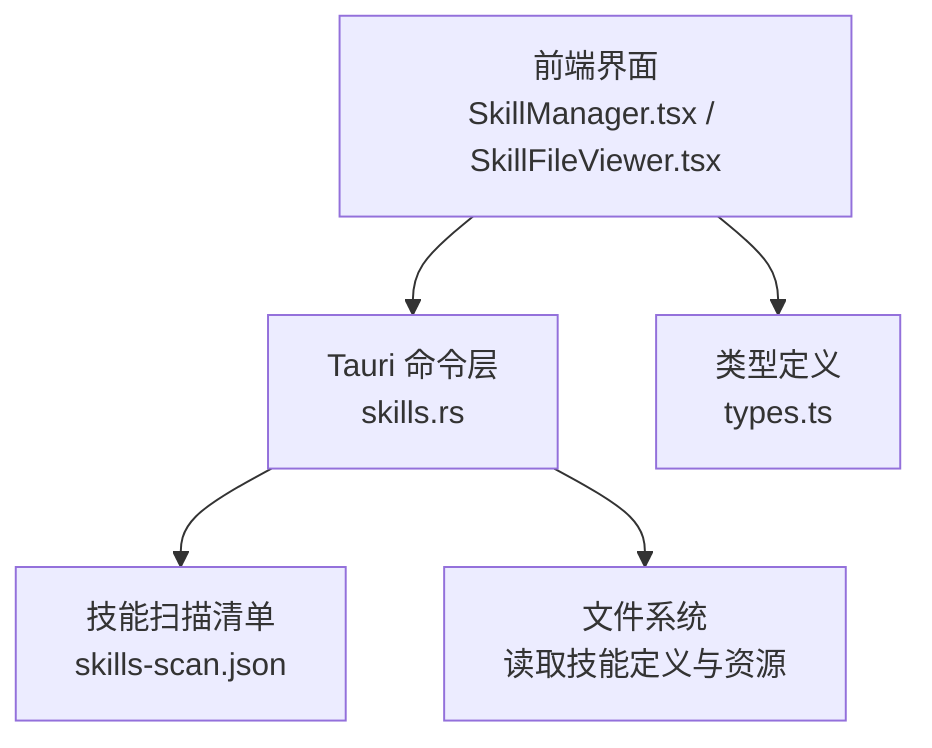
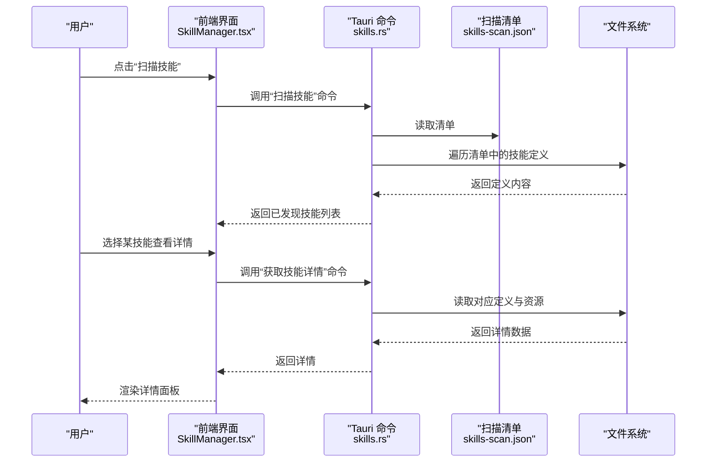
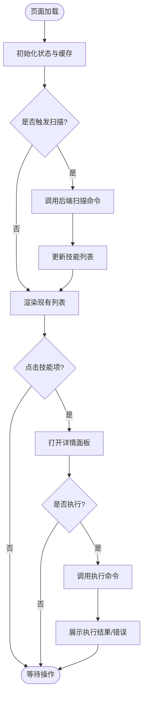
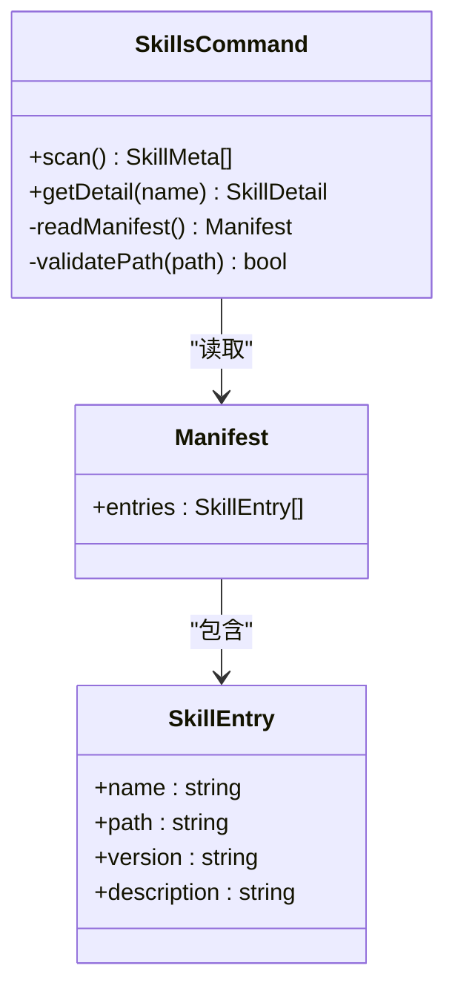
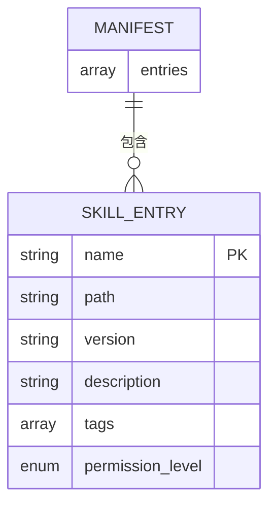
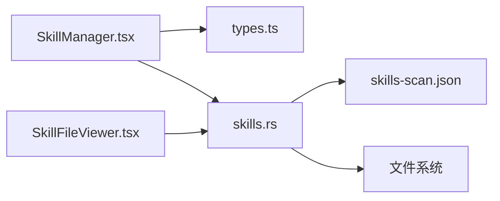

# 技能系统

<cite>
**本文引用的文件**   
- [src/components/ai/SkillManager.tsx](file://src/components/ai/SkillManager.tsx)
- [src/components/ai/SkillFileViewer.tsx](file://src/components/ai/SkillFileViewer.tsx)
- [src-tauri/src/commands/ai/skills.rs](file://src-tauri/src/commands/ai/skills.rs)
- [ai-tools/skills-scan.json](file://ai-tools/skills-scan.json)
- [src/components/ai/types.ts](file://src/components/ai/types.ts)
</cite>

## 目录
1. [简介](#简介)
2. [项目结构](#项目结构)
3. [核心组件](#核心组件)
4. [架构总览](#架构总览)
5. [详细组件分析](#详细组件分析)
6. [依赖关系分析](#依赖关系分析)
7. [性能考虑](#性能考虑)
8. [故障排查指南](#故障排查指南)
9. [结论](#结论)
10. [附录](#附录)

## 简介
本章节面向初学者与开发者，系统性介绍“技能系统”的概念、类型、执行机制、内置技能使用方法、自定义技能开发流程、定义文件格式、参数传递与结果处理、常见示例与最佳实践，以及调试、测试、部署与安全权限管理。目标是帮助读者快速上手并安全地扩展能力边界。

## 项目结构
技能系统由前端界面与后端命令层协同实现：
- 前端提供技能扫描、列表展示、详情查看与管理入口
- 后端负责读取配置、发现与解析技能定义、暴露命令接口供前端调用
- 技能定义以 JSON 形式集中描述，便于扫描与分发

图表来源
- [src/components/ai/SkillManager.tsx](file://src/components/ai/SkillManager.tsx)
- [src/components/ai/SkillFileViewer.tsx](file://src/components/ai/SkillFileViewer.tsx)
- [src-tauri/src/commands/ai/skills.rs](file://src-tauri/src/commands/ai/skills.rs)
- [ai-tools/skills-scan.json](file://ai-tools/skills-scan.json)
- [src/components/ai/types.ts](file://src/components/ai/types.ts)

章节来源
- [src/components/ai/SkillManager.tsx](file://src/components/ai/SkillManager.tsx)
- [src/components/ai/SkillFileViewer.tsx](file://src/components/ai/SkillFileViewer.tsx)
- [src-tauri/src/commands/ai/skills.rs](file://src-tauri/src/commands/ai/skills.rs)
- [ai-tools/skills-scan.json](file://ai-tools/skills-scan.json)
- [src/components/ai/types.ts](file://src/components/ai/types.ts)

## 核心组件
- 技能管理器（前端）
  - 职责：触发扫描、加载技能列表、渲染卡片、打开详情面板、发起执行请求
  - 交互：通过 Tauri 命令与后端通信，获取扫描结果与技能元数据
- 技能文件查看器（前端）
  - 职责：以可读方式展示技能定义与说明，支持搜索与高亮
- 技能命令服务（后端）
  - 职责：读取扫描清单、解析技能定义、校验权限、返回结构化结果
- 技能扫描清单（JSON）
  - 职责：声明可发现技能的集合与路径映射，驱动扫描范围
- 类型定义（前端）
  - 职责：统一前后端数据结构契约，确保类型安全

章节来源
- [src/components/ai/SkillManager.tsx](file://src/components/ai/SkillManager.tsx)
- [src/components/ai/SkillFileViewer.tsx](file://src/components/ai/SkillFileViewer.tsx)
- [src-tauri/src/commands/ai/skills.rs](file://src-tauri/src/commands/ai/skills.rs)
- [ai-tools/skills-scan.json](file://ai-tools/skills-scan.json)
- [src/components/ai/types.ts](file://src/components/ai/types.ts)

## 架构总览
技能系统采用“前端 UI + 后端命令 + JSON 清单 + 文件系统”的分层架构。前端通过 Tauri 命令调用后端能力，后端基于清单定位并解析技能定义，最终将结果回传给前端进行展示或执行。

图表来源
- [src/components/ai/SkillManager.tsx](file://src/components/ai/SkillManager.tsx)
- [src-tauri/src/commands/ai/skills.rs](file://src-tauri/src/commands/ai/skills.rs)
- [ai-tools/skills-scan.json](file://ai-tools/skills-scan.json)

## 详细组件分析

### 前端：技能管理器（SkillManager）
- 功能要点
  - 初始化时加载本地缓存的技能列表
  - 触发扫描后刷新列表，显示名称、版本、描述等摘要信息
  - 点击条目打开详情面板，支持搜索过滤
  - 对选中技能发起执行请求（若具备执行能力）
- 关键交互
  - 与后端命令的调用约定遵循 types.ts 中定义的数据结构
  - 错误状态通过 UI 提示反馈给用户

图表来源
- [src/components/ai/SkillManager.tsx](file://src/components/ai/SkillManager.tsx)
- [src/components/ai/types.ts](file://src/components/ai/types.ts)

章节来源
- [src/components/ai/SkillManager.tsx](file://src/components/ai/SkillManager.tsx)
- [src/components/ai/types.ts](file://src/components/ai/types.ts)

### 前端：技能文件查看器（SkillFileViewer）
- 功能要点
  - 以结构化视图展示技能定义的字段与说明
  - 支持关键字搜索、字段跳转与折叠展开
  - 对敏感字段进行脱敏显示（如密钥占位符）
- 使用建议
  - 在编辑或审计技能定义时优先使用该面板
  - 结合权限策略避免泄露敏感信息

章节来源
- [src/components/ai/SkillFileViewer.tsx](file://src/components/ai/SkillFileViewer.tsx)

### 后端：技能命令服务（skills.rs）
- 功能要点
  - 提供“扫描技能”“获取技能详情”等命令接口
  - 读取 skills-scan.json 作为发现入口
  - 校验访问权限与路径白名单，防止越权访问
  - 返回标准化的技能元数据与详情
- 安全与健壮性
  - 对非法路径与缺失文件进行防御性处理
  - 限制单次扫描规模，避免大清单导致阻塞

图表来源
- [src-tauri/src/commands/ai/skills.rs](file://src-tauri/src/commands/ai/skills.rs)
- [ai-tools/skills-scan.json](file://ai-tools/skills-scan.json)

章节来源
- [src-tauri/src/commands/ai/skills.rs](file://src-tauri/src/commands/ai/skills.rs)
- [ai-tools/skills-scan.json](file://ai-tools/skills-scan.json)

### 技能定义与清单（JSON）
- 清单文件（skills-scan.json）
  - 作用：集中声明所有可发现技能的元信息与路径映射
  - 典型字段：名称、路径、版本、描述、标签、权限级别等
- 技能定义文件
  - 作用：描述单个技能的行为、输入参数、输出格式、依赖与环境要求
  - 建议：保持幂等与可观测性，明确错误码与日志位置

图表来源
- [ai-tools/skills-scan.json](file://ai-tools/skills-scan.json)

章节来源
- [ai-tools/skills-scan.json](file://ai-tools/skills-scan.json)

### 类型契约（types.ts）
- 作用：统一前后端数据结构，包括技能元数据、详情、执行请求与响应
- 建议：新增字段时同步更新类型与文档，避免运行时不一致

章节来源
- [src/components/ai/types.ts](file://src/components/ai/types.ts)

## 依赖关系分析
- 前端依赖
  - SkillManager 依赖 types.ts 的类型定义与 Tauri 命令通道
  - SkillFileViewer 依赖后端提供的详情接口
- 后端依赖
  - skills.rs 依赖清单文件与文件系统
  - 可选：依赖外部工具链或脚本（由具体技能定义决定）

图表来源
- [src/components/ai/SkillManager.tsx](file://src/components/ai/SkillManager.tsx)
- [src/components/ai/SkillFileViewer.tsx](file://src/components/ai/SkillFileViewer.tsx)
- [src-tauri/src/commands/ai/skills.rs](file://src-tauri/src/commands/ai/skills.rs)
- [ai-tools/skills-scan.json](file://ai-tools/skills-scan.json)

章节来源
- [src/components/ai/SkillManager.tsx](file://src/components/ai/SkillManager.tsx)
- [src/components/ai/SkillFileViewer.tsx](file://src/components/ai/SkillFileViewer.tsx)
- [src-tauri/src/commands/ai/skills.rs](file://src-tauri/src/commands/ai/skills.rs)
- [ai-tools/skills-scan.json](file://ai-tools/skills-scan.json)

## 性能考虑
- 清单扫描
  - 增量扫描：仅对比变更清单项，减少 IO 开销
  - 并发读取：对独立技能定义并行读取，注意上限控制
- 前端渲染
  - 虚拟列表：长列表场景下按需渲染
  - 防抖搜索：降低频繁重绘带来的卡顿
- 后端健壮性
  - 超时保护：为 I/O 与外部调用设置合理超时
  - 错误降级：部分失败不影响整体可用性

[本节为通用指导，不直接分析具体文件]

## 故障排查指南
- 常见问题
  - 清单为空或路径无效：检查清单文件路径与权限
  - 详情无法加载：确认目标文件存在且可读
  - 执行失败：核对参数校验、环境变量与依赖工具
- 定位步骤
  - 查看前端控制台错误与网络请求
  - 检查后端命令返回的错误码与消息
  - 验证清单与定义文件的语法与必填字段
- 修复建议
  - 修正清单路径与权限
  - 补充缺失的环境变量或依赖
  - 增加更明确的错误提示与日志

章节来源
- [src-tauri/src/commands/ai/skills.rs](file://src-tauri/src/commands/ai/skills.rs)
- [ai-tools/skills-scan.json](file://ai-tools/skills-scan.json)

## 结论
技能系统通过清晰的清单与定义文件组织能力，配合前后端协作与严格的权限控制，实现了可扩展、可维护、可审计的技能生态。建议在生产环境启用最小权限原则、完善日志与监控，并建立规范的发布与回滚流程。

[本节为总结性内容，不直接分析具体文件]

## 附录

### 概念与类型
- 技能概念
  - 技能是对特定任务的封装，包含输入、行为与输出，可通过清单被发现与调用
- 技能类型
  - 只读型：查询与展示类任务
  - 执行型：涉及写操作或外部调用的任务
  - 组合型：串联多个子技能完成复杂流程

[本节为概念性内容，不直接分析具体文件]

### 内置技能使用指南
- 发现与浏览
  - 使用“扫描技能”列出可用技能
  - 通过“详情面板”了解用途、参数与权限
- 执行流程
  - 填写必要参数
  - 确认权限提示
  - 查看执行结果与日志

章节来源
- [src/components/ai/SkillManager.tsx](file://src/components/ai/SkillManager.tsx)
- [src/components/ai/SkillFileViewer.tsx](file://src/components/ai/SkillFileViewer.tsx)

### 自定义技能开发流程
- 准备清单
  - 在清单中添加新技能条目（名称、路径、版本、描述、权限级别）
- 编写定义
  - 明确输入参数、输出格式、错误码与日志位置
  - 标注依赖环境与运行约束
- 本地验证
  - 使用详情面板预览定义
  - 模拟执行验证参数与结果
- 发布与更新
  - 提交清单与定义到仓库
  - 在目标环境重新扫描并灰度发布

章节来源
- [ai-tools/skills-scan.json](file://ai-tools/skills-scan.json)
- [src-tauri/src/commands/ai/skills.rs](file://src-tauri/src/commands/ai/skills.rs)

### 定义文件格式与参数传递
- 清单字段建议
  - 名称、路径、版本、描述、标签、权限级别
- 定义字段建议
  - 标题、说明、参数 schema、返回值 schema、错误码、依赖、环境变量
- 参数传递
  - 使用强类型 schema 约束输入
  - 对敏感参数进行加密或占位符处理
- 结果处理
  - 标准化返回结构，包含状态、数据与消息
  - 记录关键步骤日志以便追踪

章节来源
- [ai-tools/skills-scan.json](file://ai-tools/skills-scan.json)
- [src/components/ai/types.ts](file://src/components/ai/types.ts)

### 常见技能示例与最佳实践
- 示例方向
  - 代码质量检查、文档生成、依赖升级、环境探测
- 最佳实践
  - 幂等设计、失败重试、超时控制、最小权限、可观测性

[本节为通用指导，不直接分析具体文件]

### 调试、测试与部署
- 调试
  - 前端：控制台日志、网络请求、UI 状态
  - 后端：命令返回码、错误堆栈、I/O 耗时
- 测试
  - 单元测试：参数校验、错误分支
  - 集成测试：端到端执行链路
- 部署
  - 清单与定义纳入版本管理
  - 灰度发布与回滚策略
  - 权限与密钥轮换流程

[本节为通用指导，不直接分析具体文件]

### 权限管理与安全考虑
- 权限模型
  - 基于清单的权限级别控制
  - 敏感操作的二次确认与审批
- 安全建议
  - 路径白名单与沙箱隔离
  - 最小权限原则与密钥管理
  - 输入校验与输出脱敏
  - 审计日志与告警

章节来源
- [src-tauri/src/commands/ai/skills.rs](file://src-tauri/src/commands/ai/skills.rs)
- [ai-tools/skills-scan.json](file://ai-tools/skills-scan.json)