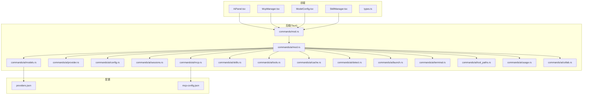
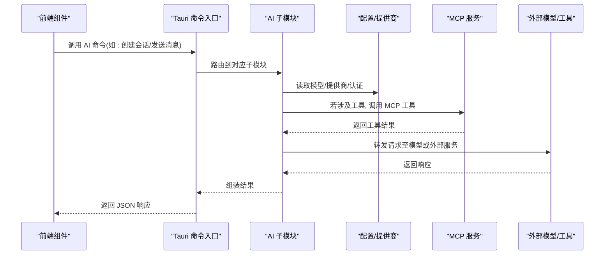
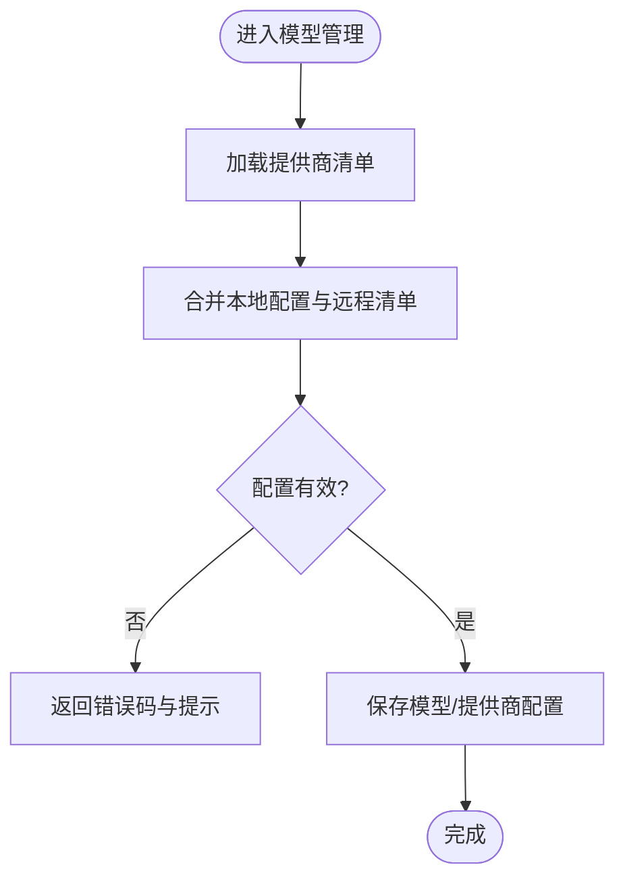
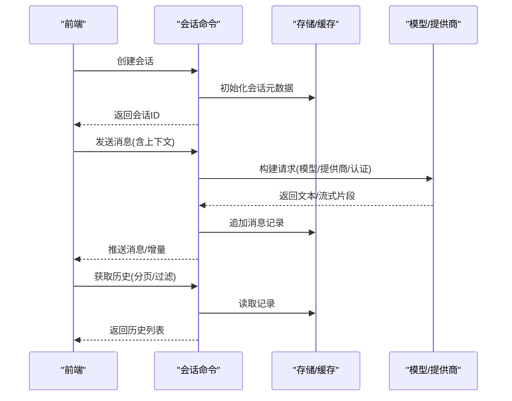
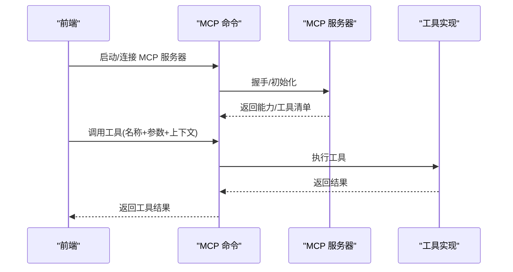
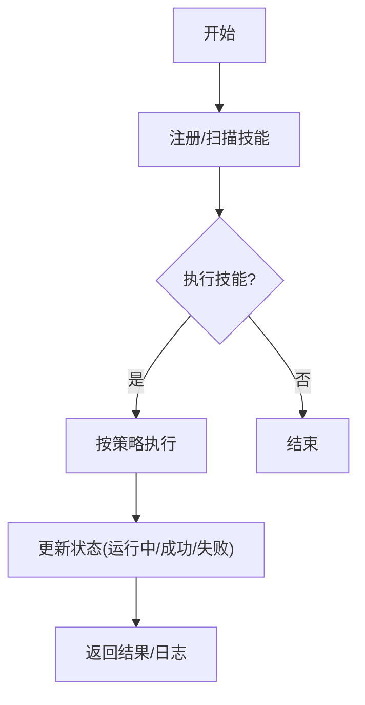
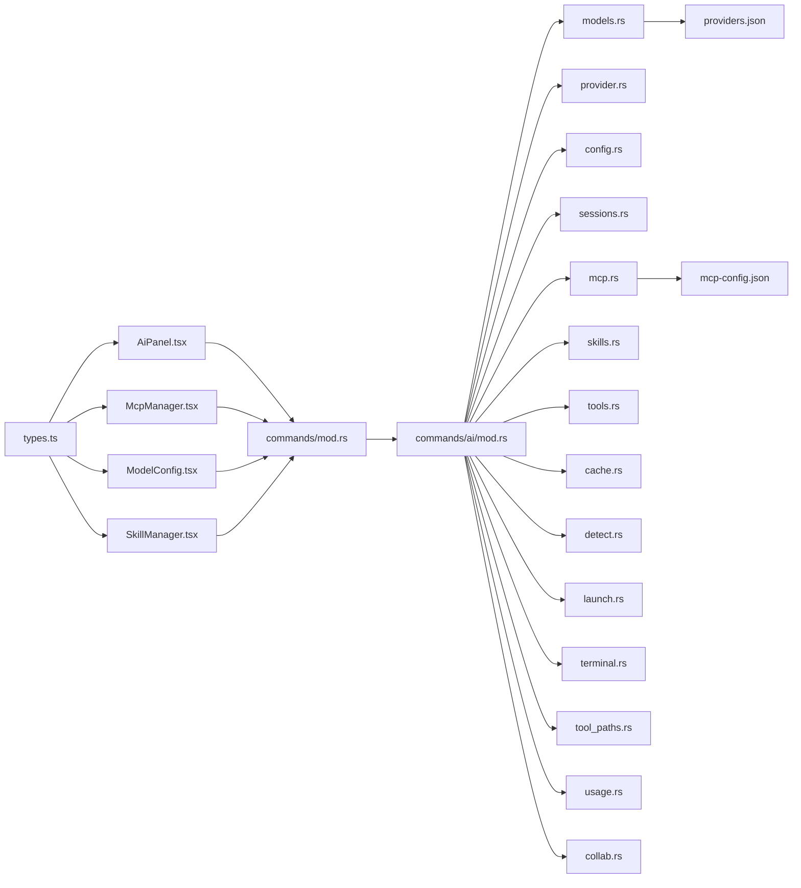

# AI 接口

<cite>
**本文引用的文件**   
- [src-tauri/src/commands/mod.rs](file://src-tauri/src/commands/mod.rs)
- [src-tauri/src/commands/ai/mod.rs](file://src-tauri/src/commands/ai/mod.rs)
- [src-tauri/src/commands/ai/models.rs](file://src-tauri/src/commands/ai/models.rs)
- [src-tauri/src/commands/ai/provider.rs](file://src-tauri/src/commands/ai/provider.rs)
- [src-tauri/src/commands/ai/config.rs](file://src-tauri/src/commands/ai/config.rs)
- [src-tauri/src/commands/ai/sessions.rs](file://src-tauri/src/commands/ai/sessions.rs)
- [src-tauri/src/commands/ai/mcp.rs](file://src-tauri/src/commands/ai/mcp.rs)
- [src-tauri/src/commands/ai/skills.rs](file://src-tauri/src/commands/ai/skills.rs)
- [src-tauri/src/commands/ai/tools.rs](file://src-tauri/src/commands/ai/tools.rs)
- [src-tauri/src/commands/ai/cache.rs](file://src-tauri/src/commands/ai/cache.rs)
- [src-tauri/src/commands/ai/detect.rs](file://src-tauri/src/commands/ai/detect.rs)
- [src-tauri/src/commands/ai/launch.rs](file://src-tauri/src/commands/ai/launch.rs)
- [src-tauri/src/commands/ai/terminal.rs](file://src-tauri/src/commands/ai/terminal.rs)
- [src-tauri/src/commands/ai/tool_paths.rs](file://src-tauri/src/commands/ai/tool_paths.rs)
- [src-tauri/src/commands/ai/usage.rs](file://src-tauri/src/commands/ai/usage.rs)
- [src-tauri/src/commands/ai/collab.rs](file://src-tauri/src/commands/ai/collab.rs)
- [src/components/ai/types.ts](file://src/components/ai/types.ts)
- [src/components/ai/AiPanel.tsx](file://src/components/ai/AiPanel.tsx)
- [src/components/ai/McpManager.tsx](file://src/components/ai/McpManager.tsx)
- [src/components/ai/ModelConfig.tsx](file://src/components/ai/ModelConfig.tsx)
- [src/components/ai/SkillManager.tsx](file://src/components/ai/SkillManager.tsx)
- [ai-tools/providers.json](file://ai-tools/providers.json)
- [ai-tools/mcp-config.json](file://ai-tools/mcp-config.json)
</cite>

## 目录
1. [简介](#简介)
2. [项目结构](#项目结构)
3. [核心组件](#核心组件)
4. [架构总览](#架构总览)
5. [详细组件分析](#详细组件分析)
6. [依赖分析](#依赖分析)
7. [性能考虑](#性能考虑)
8. [故障排查指南](#故障排查指南)
9. [结论](#结论)
10. [附录](#附录)

## 简介
本文件为 Any-Version 的 AI 功能接口提供全面 API 文档，覆盖以下能力：
- 模型管理 API：模型配置、提供商设置、认证管理等
- 会话管理 API：对话创建、消息发送、历史记录等
- MCP 协议接口：服务器管理、工具调用、上下文传递等
- 技能系统 API：技能注册、执行、状态管理等
- 完整调用示例与错误处理方案

该文档面向开发者与集成方，既提供高层概览，也深入到具体命令与数据流，帮助快速对接与排障。

## 项目结构
AI 相关能力由前端组件与 Tauri 后端命令共同实现：
- 前端（React）：提供 UI 面板、类型定义与交互逻辑
- 后端（Tauri Rust）：通过命令模块暴露 REST/IPC 风格接口，封装模型、会话、MCP、技能等能力

图表来源
- [src-tauri/src/commands/mod.rs](file://src-tauri/src/commands/mod.rs)
- [src-tauri/src/commands/ai/mod.rs](file://src-tauri/src/commands/ai/mod.rs)
- [src-tauri/src/commands/ai/models.rs](file://src-tauri/src/commands/ai/models.rs)
- [src-tauri/src/commands/ai/provider.rs](file://src-tauri/src/commands/ai/provider.rs)
- [src-tauri/src/commands/ai/config.rs](file://src-tauri/src/commands/ai/config.rs)
- [src-tauri/src/commands/ai/sessions.rs](file://src-tauri/src/commands/ai/sessions.rs)
- [src-tauri/src/commands/ai/mcp.rs](file://src-tauri/src/commands/ai/mcp.rs)
- [src-tauri/src/commands/ai/skills.rs](file://src-tauri/src/commands/ai/skills.rs)
- [src-tauri/src/commands/ai/tools.rs](file://src-tauri/src/commands/ai/tools.rs)
- [src-tauri/src/commands/ai/cache.rs](file://src-tauri/src/commands/ai/cache.rs)
- [src-tauri/src/commands/ai/detect.rs](file://src-tauri/src/commands/ai/detect.rs)
- [src-tauri/src/commands/ai/launch.rs](file://src-tauri/src/commands/ai/launch.rs)
- [src-tauri/src/commands/ai/terminal.rs](file://src-tauri/src/commands/ai/terminal.rs)
- [src-tauri/src/commands/ai/tool_paths.rs](file://src-tauri/src/commands/ai/tool_paths.rs)
- [src-tauri/src/commands/ai/usage.rs](file://src-tauri/src/commands/ai/usage.rs)
- [src-tauri/src/commands/ai/collab.rs](file://src-tauri/src/commands/ai/collab.rs)
- [src/components/ai/types.ts](file://src/components/ai/types.ts)
- [src/components/ai/AiPanel.tsx](file://src/components/ai/AiPanel.tsx)
- [src/components/ai/McpManager.tsx](file://src/components/ai/McpManager.tsx)
- [src/components/ai/ModelConfig.tsx](file://src/components/ai/ModelConfig.tsx)
- [src/components/ai/SkillManager.tsx](file://src/components/ai/SkillManager.tsx)
- [ai-tools/providers.json](file://ai-tools/providers.json)
- [ai-tools/mcp-config.json](file://ai-tools/mcp-config.json)

章节来源
- [src-tauri/src/commands/mod.rs](file://src-tauri/src/commands/mod.rs)
- [src-tauri/src/commands/ai/mod.rs](file://src-tauri/src/commands/ai/mod.rs)
- [src/components/ai/types.ts](file://src/components/ai/types.ts)
- [src/components/ai/AiPanel.tsx](file://src/components/ai/AiPanel.tsx)
- [src/components/ai/McpManager.tsx](file://src/components/ai/McpManager.tsx)
- [src/components/ai/ModelConfig.tsx](file://src/components/ai/ModelConfig.tsx)
- [src/components/ai/SkillManager.tsx](file://src/components/ai/SkillManager.tsx)
- [ai-tools/providers.json](file://ai-tools/providers.json)
- [ai-tools/mcp-config.json](file://ai-tools/mcp-config.json)

## 核心组件
- 模型管理：负责模型列表、选择、提供商绑定与认证信息维护
- 会话管理：负责对话生命周期、消息收发、历史持久化
- MCP 协议：负责 MCP 服务器启停、工具发现与调用、上下文传递
- 技能系统：负责技能注册、执行、状态监控与结果回传
- 辅助能力：缓存、检测、启动器、终端、路径解析、用量统计、协作

章节来源
- [src-tauri/src/commands/ai/models.rs](file://src-tauri/src/commands/ai/models.rs)
- [src-tauri/src/commands/ai/provider.rs](file://src-tauri/src/commands/ai/provider.rs)
- [src-tauri/src/commands/ai/config.rs](file://src-tauri/src/commands/ai/config.rs)
- [src-tauri/src/commands/ai/sessions.rs](file://src-tauri/src/commands/ai/sessions.rs)
- [src-tauri/src/commands/ai/mcp.rs](file://src-tauri/src/commands/ai/mcp.rs)
- [src-tauri/src/commands/ai/skills.rs](file://src-tauri/src/commands/ai/skills.rs)
- [src-tauri/src/commands/ai/tools.rs](file://src-tauri/src/commands/ai/tools.rs)
- [src-tauri/src/commands/ai/cache.rs](file://src-tauri/src/commands/ai/cache.rs)
- [src-tauri/src/commands/ai/detect.rs](file://src-tauri/src/commands/ai/detect.rs)
- [src-tauri/src/commands/ai/launch.rs](file://src-tauri/src/commands/ai/launch.rs)
- [src-tauri/src/commands/ai/terminal.rs](file://src-tauri/src/commands/ai/terminal.rs)
- [src-tauri/src/commands/ai/tool_paths.rs](file://src-tauri/src/commands/ai/tool_paths.rs)
- [src-tauri/src/commands/ai/usage.rs](file://src-tauri/src/commands/ai/usage.rs)
- [src-tauri/src/commands/ai/collab.rs](file://src-tauri/src/commands/ai/collab.rs)

## 架构总览
整体采用“前端组件 + Tauri 命令”的分层架构。前端通过类型定义与 UI 面板发起请求；后端命令模块统一注册并路由到各子模块，读取本地配置与外部资源，完成业务逻辑。

图表来源
- [src-tauri/src/commands/mod.rs](file://src-tauri/src/commands/mod.rs)
- [src-tauri/src/commands/ai/mod.rs](file://src-tauri/src/commands/ai/mod.rs)
- [src-tauri/src/commands/ai/models.rs](file://src-tauri/src/commands/ai/models.rs)
- [src-tauri/src/commands/ai/provider.rs](file://src-tauri/src/commands/ai/provider.rs)
- [src-tauri/src/commands/ai/mcp.rs](file://src-tauri/src/commands/ai/mcp.rs)
- [src-tauri/src/commands/ai/sessions.rs](file://src-tauri/src/commands/ai/sessions.rs)

## 详细组件分析

### 模型管理 API
职责
- 列出可用模型、选择默认模型
- 管理提供商信息与认证参数
- 加载与校验模型配置

关键命令与流程
- 模型列表与详情：查询 providers.json 与本地缓存，合并展示
- 提供商设置：写入/更新提供商配置项（端点、鉴权方式等）
- 认证管理：安全存储密钥、令牌，支持刷新与失效检测

图表来源
- [src-tauri/src/commands/ai/models.rs](file://src-tauri/src/commands/ai/models.rs)
- [src-tauri/src/commands/ai/provider.rs](file://src-tauri/src/commands/ai/provider.rs)
- [src-tauri/src/commands/ai/config.rs](file://src-tauri/src/commands/ai/config.rs)
- [ai-tools/providers.json](file://ai-tools/providers.json)

章节来源
- [src-tauri/src/commands/ai/models.rs](file://src-tauri/src/commands/ai/models.rs)
- [src-tauri/src/commands/ai/provider.rs](file://src-tauri/src/commands/ai/provider.rs)
- [src-tauri/src/commands/ai/config.rs](file://src-tauri/src/commands/ai/config.rs)
- [ai-tools/providers.json](file://ai-tools/providers.json)

### 会话管理 API
职责
- 会话生命周期：创建、切换、关闭
- 消息收发：用户消息、助手回复、流式增量
- 历史记录：持久化、分页、检索

典型调用序列

图表来源
- [src-tauri/src/commands/ai/sessions.rs](file://src-tauri/src/commands/ai/sessions.rs)
- [src-tauri/src/commands/ai/cache.rs](file://src-tauri/src/commands/ai/cache.rs)
- [src-tauri/src/commands/ai/models.rs](file://src-tauri/src/commands/ai/models.rs)
- [src-tauri/src/commands/ai/provider.rs](file://src-tauri/src/commands/ai/provider.rs)

章节来源
- [src-tauri/src/commands/ai/sessions.rs](file://src-tauri/src/commands/ai/sessions.rs)
- [src-tauri/src/commands/ai/cache.rs](file://src-tauri/src/commands/ai/cache.rs)
- [src-tauri/src/commands/ai/models.rs](file://src-tauri/src/commands/ai/models.rs)
- [src-tauri/src/commands/ai/provider.rs](file://src-tauri/src/commands/ai/provider.rs)

### MCP 协议接口
职责
- MCP 服务器管理：安装、启动、停止、健康检查
- 工具发现与调用：列出工具、执行工具、参数校验
- 上下文传递：将会话上下文注入工具调用

图表来源
- [src-tauri/src/commands/ai/mcp.rs](file://src-tauri/src/commands/ai/mcp.rs)
- [ai-tools/mcp-config.json](file://ai-tools/mcp-config.json)

章节来源
- [src-tauri/src/commands/ai/mcp.rs](file://src-tauri/src/commands/ai/mcp.rs)
- [ai-tools/mcp-config.json](file://ai-tools/mcp-config.json)

### 技能系统 API
职责
- 技能注册：扫描与登记可用技能
- 技能执行：按策略调度执行，收集输出
- 状态管理：运行中、成功、失败、重试

图表来源
- [src-tauri/src/commands/ai/skills.rs](file://src-tauri/src/commands/ai/skills.rs)
- [src-tauri/src/commands/ai/tools.rs](file://src-tauri/src/commands/ai/tools.rs)

章节来源
- [src-tauri/src/commands/ai/skills.rs](file://src-tauri/src/commands/ai/skills.rs)
- [src-tauri/src/commands/ai/tools.rs](file://src-tauri/src/commands/ai/tools.rs)

### 辅助能力接口
- 缓存：会话与中间结果缓存、清理策略
- 检测：环境/依赖检测与修复建议
- 启动器：外部工具/代理的启动与生命周期管理
- 终端：交互式终端通道
- 路径解析：工具路径与环境变量解析
- 用量统计：Token/次数统计与报表
- 协作：多端协作与会话同步

章节来源
- [src-tauri/src/commands/ai/cache.rs](file://src-tauri/src/commands/ai/cache.rs)
- [src-tauri/src/commands/ai/detect.rs](file://src-tauri/src/commands/ai/detect.rs)
- [src-tauri/src/commands/ai/launch.rs](file://src-tauri/src/commands/ai/launch.rs)
- [src-tauri/src/commands/ai/terminal.rs](file://src-tauri/src/commands/ai/terminal.rs)
- [src-tauri/src/commands/ai/tool_paths.rs](file://src-tauri/src/commands/ai/tool_paths.rs)
- [src-tauri/src/commands/ai/usage.rs](file://src-tauri/src/commands/ai/usage.rs)
- [src-tauri/src/commands/ai/collab.rs](file://src-tauri/src/commands/ai/collab.rs)

## 依赖分析
- 前端依赖
  - types.ts：定义前后端交互的数据结构与枚举
  - AiPanel.tsx：主面板，聚合模型、会话、MCP、技能等入口
  - McpManager.tsx：MCP 服务器管理与工具调用界面
  - ModelConfig.tsx：模型与提供商配置界面
  - SkillManager.tsx：技能注册与执行界面
- 后端依赖
  - commands/mod.rs：命令注册与路由
  - commands/ai/mod.rs：AI 子模块聚合
  - 各子模块：models、provider、config、sessions、mcp、skills、tools、cache、detect、launch、terminal、tool_paths、usage、collab
- 配置文件
  - providers.json：提供商清单与默认值
  - mcp-config.json：MCP 服务器与工具配置

图表来源
- [src/components/ai/types.ts](file://src/components/ai/types.ts)
- [src/components/ai/AiPanel.tsx](file://src/components/ai/AiPanel.tsx)
- [src/components/ai/McpManager.tsx](file://src/components/ai/McpManager.tsx)
- [src/components/ai/ModelConfig.tsx](file://src/components/ai/ModelConfig.tsx)
- [src/components/ai/SkillManager.tsx](file://src/components/ai/SkillManager.tsx)
- [src-tauri/src/commands/mod.rs](file://src-tauri/src/commands/mod.rs)
- [src-tauri/src/commands/ai/mod.rs](file://src-tauri/src/commands/ai/mod.rs)
- [src-tauri/src/commands/ai/models.rs](file://src-tauri/src/commands/ai/models.rs)
- [src-tauri/src/commands/ai/provider.rs](file://src-tauri/src/commands/ai/provider.rs)
- [src-tauri/src/commands/ai/config.rs](file://src-tauri/src/commands/ai/config.rs)
- [src-tauri/src/commands/ai/sessions.rs](file://src-tauri/src/commands/ai/sessions.rs)
- [src-tauri/src/commands/ai/mcp.rs](file://src-tauri/src/commands/ai/mcp.rs)
- [src-tauri/src/commands/ai/skills.rs](file://src-tauri/src/commands/ai/skills.rs)
- [src-tauri/src/commands/ai/tools.rs](file://src-tauri/src/commands/ai/tools.rs)
- [src-tauri/src/commands/ai/cache.rs](file://src-tauri/src/commands/ai/cache.rs)
- [src-tauri/src/commands/ai/detect.rs](file://src-tauri/src/commands/ai/detect.rs)
- [src-tauri/src/commands/ai/launch.rs](file://src-tauri/src/commands/ai/launch.rs)
- [src-tauri/src/commands/ai/terminal.rs](file://src-tauri/src/commands/ai/terminal.rs)
- [src-tauri/src/commands/ai/tool_paths.rs](file://src-tauri/src/commands/ai/tool_paths.rs)
- [src-tauri/src/commands/ai/usage.rs](file://src-tauri/src/commands/ai/usage.rs)
- [src-tauri/src/commands/ai/collab.rs](file://src-tauri/src/commands/ai/collab.rs)
- [ai-tools/providers.json](file://ai-tools/providers.json)
- [ai-tools/mcp-config.json](file://ai-tools/mcp-config.json)

章节来源
- [src/components/ai/types.ts](file://src/components/ai/types.ts)
- [src/components/ai/AiPanel.tsx](file://src/components/ai/AiPanel.tsx)
- [src/components/ai/McpManager.tsx](file://src/components/ai/McpManager.tsx)
- [src/components/ai/ModelConfig.tsx](file://src/components/ai/ModelConfig.tsx)
- [src/components/ai/SkillManager.tsx](file://src/components/ai/SkillManager.tsx)
- [src-tauri/src/commands/mod.rs](file://src-tauri/src/commands/mod.rs)
- [src-tauri/src/commands/ai/mod.rs](file://src-tauri/src/commands/ai/mod.rs)
- [ai-tools/providers.json](file://ai-tools/providers.json)
- [ai-tools/mcp-config.json](file://ai-tools/mcp-config.json)

## 性能考虑
- 流式响应：对长文本生成使用增量推送，降低首字节延迟
- 缓存命中：会话与工具结果缓存，减少重复计算与网络开销
- 并发控制：限制并行工具调用与模型请求数，避免过载
- 资源回收：会话关闭后及时释放资源，清理临时文件
- 批量操作：历史分页与批量导出，避免一次性加载大量数据

[本节为通用指导，不直接分析具体文件]

## 故障排查指南
常见问题与定位步骤
- 认证失败
  - 检查提供商配置与密钥是否过期
  - 查看认证刷新流程与错误码
  - 参考：提供商配置与认证管理
- 模型不可用
  - 确认模型清单与端点可达性
  - 检查网络代理与证书
  - 参考：模型列表与配置校验
- MCP 工具调用失败
  - 验证 MCP 服务器状态与工具清单
  - 检查参数校验与上下文注入
  - 参考：MCP 服务器管理与工具调用
- 会话异常
  - 检查历史持久化与缓存一致性
  - 核对会话 ID 与上下文版本
  - 参考：会话管理与缓存

章节来源
- [src-tauri/src/commands/ai/provider.rs](file://src-tauri/src/commands/ai/provider.rs)
- [src-tauri/src/commands/ai/models.rs](file://src-tauri/src/commands/ai/models.rs)
- [src-tauri/src/commands/ai/mcp.rs](file://src-tauri/src/commands/ai/mcp.rs)
- [src-tauri/src/commands/ai/sessions.rs](file://src-tauri/src/commands/ai/sessions.rs)
- [src-tauri/src/commands/ai/cache.rs](file://src-tauri/src/commands/ai/cache.rs)

## 结论
Any-Version 的 AI 接口以清晰的模块化设计实现了模型管理、会话管理、MCP 协议与技能系统的完整能力。通过统一的命令入口与前端组件解耦，便于扩展与维护。建议在集成时遵循本文档的调用约定与错误处理规范，并结合性能与排障建议优化体验。

[本节为总结性内容，不直接分析具体文件]

## 附录

### 调用示例（概念性）
- 模型管理
  - 获取模型列表：调用模型命令，返回提供商与模型清单
  - 设置默认模型：提交模型标识与提供商参数
  - 更新认证：提交密钥或令牌，触发校验与刷新
- 会话管理
  - 创建会话：返回会话 ID
  - 发送消息：携带上下文与模型选择，支持流式增量
  - 获取历史：分页与过滤条件
- MCP 协议
  - 启动服务器：根据配置初始化并返回能力
  - 调用工具：传入工具名、参数与上下文，返回结果
- 技能系统
  - 注册技能：扫描并登记
  - 执行技能：提交任务与策略，返回状态与结果

[本节为概念性示例，不直接分析具体文件]