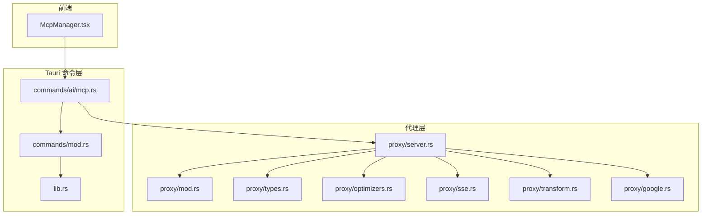
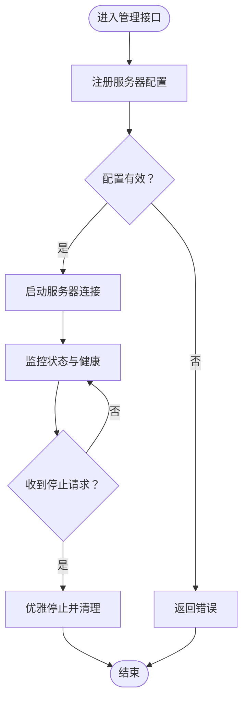
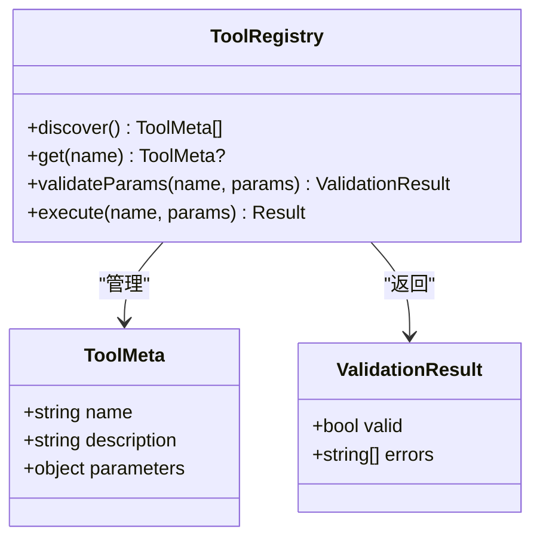
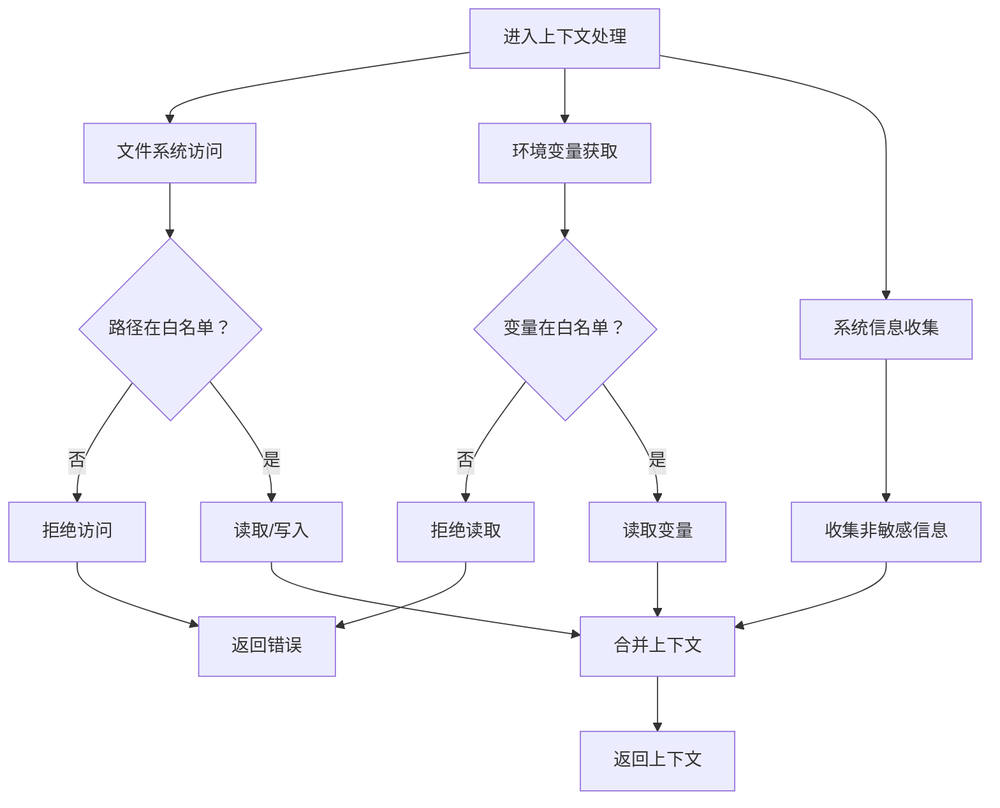
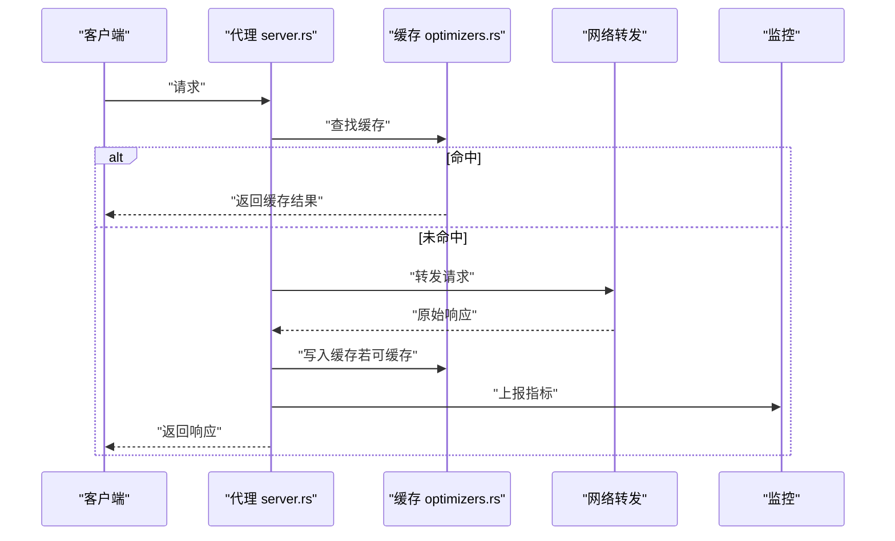
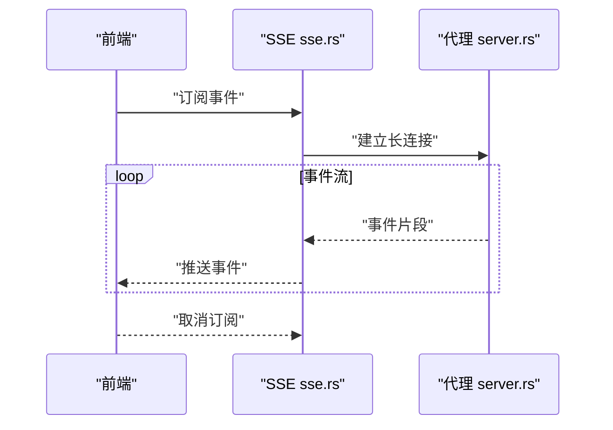
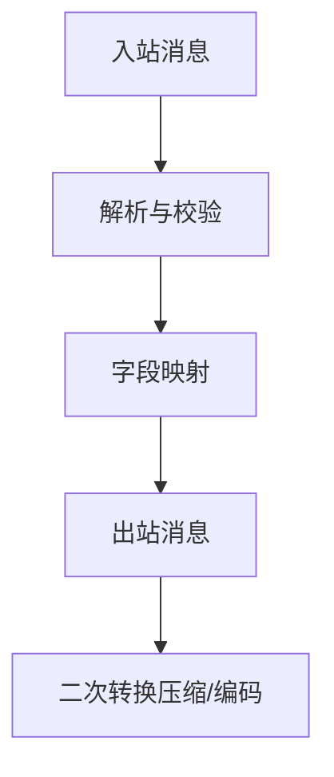
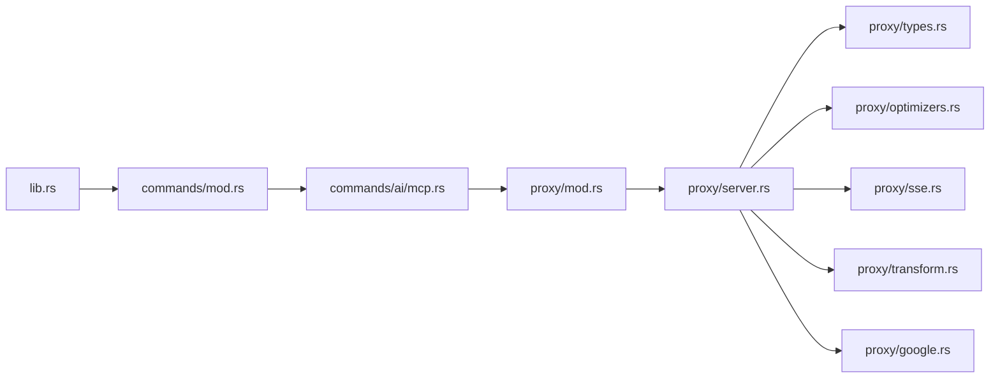

# MCP 协议接口

<cite>
**本文引用的文件**   
- [src-tauri/src/commands/ai/mcp.rs](file://src-tauri/src/commands/ai/mcp.rs)
- [src-tauri/src/proxy/mod.rs](file://src-tauri/src/proxy/mod.rs)
- [src-tauri/src/proxy/server.rs](file://src-tauri/src/proxy/server.rs)
- [src-tauri/src/proxy/types.rs](file://src-tauri/src/proxy/types.rs)
- [src-tauri/src/proxy/optimizers.rs](file://src-tauri/src/proxy/optimizers.rs)
- [src-tauri/src/proxy/sse.rs](file://src-tauri/src/proxy/sse.rs)
- [src-tauri/src/proxy/transform.rs](file://src-tauri/src/proxy/transform.rs)
- [src-tauri/src/proxy/google.rs](file://src-tauri/src/proxy/google.rs)
- [src-tauri/src/commands/mod.rs](file://src-tauri/src/commands/mod.rs)
- [src-tauri/src/lib.rs](file://src-tauri/src/lib.rs)
- [src/components/ai/McpManager.tsx](file://src/components/ai/McpManager.tsx)
- [ai-tools/mcp-config.json](file://ai-tools/mcp-config.json)
</cite>

## 目录
1. [简介](#简介)
2. [项目结构](#项目结构)
3. [核心组件](#核心组件)
4. [架构总览](#架构总览)
5. [详细组件分析](#详细组件分析)
6. [依赖关系分析](#依赖关系分析)
7. [性能考虑](#性能考虑)
8. [故障排查指南](#故障排查指南)
9. [结论](#结论)
10. [附录：协议规范与集成示例](#附录协议规范与集成示例)

## 简介
本文件面向实现 Model Context Protocol（MCP）的服务器管理与工具调用能力，提供系统化的 API 文档。内容覆盖：
- MCP 服务器管理接口：注册、启动、停止、状态监控
- 工具调用接口：动态发现、参数校验、结果返回
- 上下文传递机制：文件系统访问、环境变量获取、系统信息收集
- 代理优化功能：网络请求转发、缓存策略、性能监控
- 协议规范示例与集成指南

## 项目结构
本项目采用前后端分离的 Tauri 应用结构：
- 前端 React 组件负责 UI 交互与命令调用
- Rust 后端通过 Tauri 命令暴露 MCP 相关能力
- 代理层提供网络转发、SSE 流式传输、转换与优化



图表来源
- [src/components/ai/McpManager.tsx](file://src/components/ai/McpManager.tsx)
- [src-tauri/src/commands/mod.rs](file://src-tauri/src/commands/mod.rs)
- [src-tauri/src/commands/ai/mcp.rs](file://src-tauri/src/commands/ai/mcp.rs)
- [src-tauri/src/lib.rs](file://src-tauri/src/lib.rs)
- [src-tauri/src/proxy/mod.rs](file://src-tauri/src/proxy/mod.rs)
- [src-tauri/src/proxy/server.rs](file://src-tauri/src/proxy/server.rs)
- [src-tauri/src/proxy/types.rs](file://src-tauri/src/proxy/types.rs)
- [src-tauri/src/proxy/optimizers.rs](file://src-tauri/src/proxy/optimizers.rs)
- [src-tauri/src/proxy/sse.rs](file://src-tauri/src/proxy/sse.rs)
- [src-tauri/src/proxy/transform.rs](file://src-tauri/src/proxy/transform.rs)
- [src-tauri/src/proxy/google.rs](file://src-tauri/src/proxy/google.rs)

章节来源
- [src-tauri/src/commands/ai/mcp.rs](file://src-tauri/src/commands/ai/mcp.rs)
- [src-tauri/src/proxy/mod.rs](file://src-tauri/src/proxy/mod.rs)
- [src-tauri/src/proxy/server.rs](file://src-tauri/src/proxy/server.rs)
- [src-tauri/src/proxy/types.rs](file://src-tauri/src/proxy/types.rs)
- [src-tauri/src/proxy/optimizers.rs](file://src-tauri/src/proxy/optimizers.rs)
- [src-tauri/src/proxy/sse.rs](file://src-tauri/src/proxy/sse.rs)
- [src-tauri/src/proxy/transform.rs](file://src-tauri/src/proxy/transform.rs)
- [src-tauri/src/proxy/google.rs](file://src-tauri/src/proxy/google.rs)
- [src/components/ai/McpManager.tsx](file://src/components/ai/McpManager.tsx)

## 核心组件
本节聚焦 MCP 相关的核心模块与职责划分：
- 命令层（Tauri Commands）：对外暴露 MCP 管理、工具调用等 API
- 代理层（Proxy）：封装网络转发、SSE 流、数据转换与优化
- 类型定义（Types）：统一数据结构与错误模型
- 前端组件（McpManager）：提供可视化操作入口

章节来源
- [src-tauri/src/commands/ai/mcp.rs](file://src-tauri/src/commands/ai/mcp.rs)
- [src-tauri/src/proxy/mod.rs](file://src-tauri/src/proxy/mod.rs)
- [src-tauri/src/proxy/types.rs](file://src-tauri/src/proxy/types.rs)
- [src/components/ai/McpManager.tsx](file://src/components/ai/McpManager.tsx)

## 架构总览
下图展示了从前端到后端的完整调用链路，包括 MCP 服务器生命周期管理与工具调用的关键路径。

```mermaid
sequenceDiagram
participant UI as "前端 McpManager"
participant Cmd as "Tauri 命令 mcp.rs"
participant Proxy as "代理 server.rs"
participant SSE as "SSE sse.rs"
participant Opt as "优化 optimizers.rs"
participant Trans as "转换 transform.rs"
participant Types as "类型 types.rs"
UI->>Cmd : "注册/启动/停止/查询状态"
Cmd->>Proxy : "创建或复用连接"
Proxy->>Opt : "可选优化缓存/限流"
Proxy->>Trans : "消息格式转换"
Proxy->>SSE : "建立流式通道"
SSE-->>UI : "事件推送进度/结果"
Cmd-->>UI : "最终响应"
```

图表来源
- [src/components/ai/McpManager.tsx](file://src/components/ai/McpManager.tsx)
- [src-tauri/src/commands/ai/mcp.rs](file://src-tauri/src/commands/ai/mcp.rs)
- [src-tauri/src/proxy/server.rs](file://src-tauri/src/proxy/server.rs)
- [src-tauri/src/proxy/sse.rs](file://src-tauri/src/proxy/sse.rs)
- [src-tauri/src/proxy/optimizers.rs](file://src-tauri/src/proxy/optimizers.rs)
- [src-tauri/src/proxy/transform.rs](file://src-tauri/src/proxy/transform.rs)
- [src-tauri/src/proxy/types.rs](file://src-tauri/src/proxy/types.rs)

## 详细组件分析

### MCP 服务器管理接口
- 注册：将目标 MCP 服务器的配置（如地址、认证、超时等）持久化并纳入管理
- 启动：根据配置初始化连接，必要时进行握手与能力协商
- 停止：优雅关闭连接，释放资源
- 状态监控：返回运行状态、健康检查、最近错误与统计指标



图表来源
- [src-tauri/src/commands/ai/mcp.rs](file://src-tauri/src/commands/ai/mcp.rs)
- [src-tauri/src/proxy/server.rs](file://src-tauri/src/proxy/server.rs)
- [src-tauri/src/proxy/types.rs](file://src-tauri/src/proxy/types.rs)

章节来源
- [src-tauri/src/commands/ai/mcp.rs](file://src-tauri/src/commands/ai/mcp.rs)
- [src-tauri/src/proxy/server.rs](file://src-tauri/src/proxy/server.rs)
- [src-tauri/src/proxy/types.rs](file://src-tauri/src/proxy/types.rs)

### 工具调用接口
- 动态发现：列出可用工具及其元数据（名称、描述、参数模式）
- 参数验证：基于参数模式对输入进行校验，返回结构化错误
- 执行与返回：执行工具逻辑，返回结果或错误；支持流式输出



图表来源
- [src-tauri/src/commands/ai/mcp.rs](file://src-tauri/src/commands/ai/mcp.rs)
- [src-tauri/src/proxy/types.rs](file://src-tauri/src/proxy/types.rs)

章节来源
- [src-tauri/src/commands/ai/mcp.rs](file://src-tauri/src/commands/ai/mcp.rs)
- [src-tauri/src/proxy/types.rs](file://src-tauri/src/proxy/types.rs)

### 上下文传递机制
- 文件系统访问：在安全沙箱内读取/写入受控路径，记录审计日志
- 环境变量获取：按白名单读取必要变量，避免泄露敏感信息
- 系统信息收集：仅收集非敏感的系统概览（平台、版本、可用资源）



图表来源
- [src-tauri/src/commands/ai/mcp.rs](file://src-tauri/src/commands/ai/mcp.rs)
- [src-tauri/src/proxy/types.rs](file://src-tauri/src/proxy/types.rs)

章节来源
- [src-tauri/src/commands/ai/mcp.rs](file://src-tauri/src/commands/ai/mcp.rs)
- [src-tauri/src/proxy/types.rs](file://src-tauri/src/proxy/types.rs)

### 代理优化功能
- 网络请求转发：统一出口、重试与熔断策略
- 缓存策略：对幂等请求进行短期缓存，命中时直接返回
- 性能监控：记录延迟、吞吐、错误率，上报指标



图表来源
- [src-tauri/src/proxy/server.rs](file://src-tauri/src/proxy/server.rs)
- [src-tauri/src/proxy/optimizers.rs](file://src-tauri/src/proxy/optimizers.rs)

章节来源
- [src-tauri/src/proxy/server.rs](file://src-tauri/src/proxy/server.rs)
- [src-tauri/src/proxy/optimizers.rs](file://src-tauri/src/proxy/optimizers.rs)

### SSE 流式传输
- 建立 SSE 通道，持续推送事件（进度、中间结果、完成信号）
- 支持断线重连与心跳检测



图表来源
- [src-tauri/src/proxy/sse.rs](file://src-tauri/src/proxy/sse.rs)
- [src-tauri/src/proxy/server.rs](file://src-tauri/src/proxy/server.rs)

章节来源
- [src-tauri/src/proxy/sse.rs](file://src-tauri/src/proxy/sse.rs)
- [src-tauri/src/proxy/server.rs](file://src-tauri/src/proxy/server.rs)

### 消息转换与适配
- 在不同协议或内部表示之间进行双向转换
- 保证字段映射一致性与兼容性



图表来源
- [src-tauri/src/proxy/transform.rs](file://src-tauri/src/proxy/transform.rs)

章节来源
- [src-tauri/src/proxy/transform.rs](file://src-tauri/src/proxy/transform.rs)

### Google 特定适配
- 针对 Google 生态的专用适配逻辑（如鉴权、域名路由、特殊头）

章节来源
- [src-tauri/src/proxy/google.rs](file://src-tauri/src/proxy/google.rs)

### 前端集成入口
- McpManager 组件提供可视化的 MCP 管理能力，调用 Tauri 命令完成注册、启停与状态查看

章节来源
- [src/components/ai/McpManager.tsx](file://src/components/ai/McpManager.tsx)

## 依赖关系分析
- 命令层依赖代理层以完成实际的网络与流式通信
- 代理层内部解耦为类型、SSE、转换、优化与特定适配模块
- 前端通过 Tauri 命令间接使用代理能力



图表来源
- [src-tauri/src/lib.rs](file://src-tauri/src/lib.rs)
- [src-tauri/src/commands/mod.rs](file://src-tauri/src/commands/mod.rs)
- [src-tauri/src/commands/ai/mcp.rs](file://src-tauri/src/commands/ai/mcp.rs)
- [src-tauri/src/proxy/mod.rs](file://src-tauri/src/proxy/mod.rs)
- [src-tauri/src/proxy/server.rs](file://src-tauri/src/proxy/server.rs)
- [src-tauri/src/proxy/types.rs](file://src-tauri/src/proxy/types.rs)
- [src-tauri/src/proxy/optimizers.rs](file://src-tauri/src/proxy/optimizers.rs)
- [src-tauri/src/proxy/sse.rs](file://src-tauri/src/proxy/sse.rs)
- [src-tauri/src/proxy/transform.rs](file://src-tauri/src/proxy/transform.rs)
- [src-tauri/src/proxy/google.rs](file://src-tauri/src/proxy/google.rs)

章节来源
- [src-tauri/src/lib.rs](file://src-tauri/src/lib.rs)
- [src-tauri/src/commands/mod.rs](file://src-tauri/src/commands/mod.rs)
- [src-tauri/src/commands/ai/mcp.rs](file://src-tauri/src/commands/ai/mcp.rs)
- [src-tauri/src/proxy/mod.rs](file://src-tauri/src/proxy/mod.rs)
- [src-tauri/src/proxy/server.rs](file://src-tauri/src/proxy/server.rs)
- [src-tauri/src/proxy/types.rs](file://src-tauri/src/proxy/types.rs)
- [src-tauri/src/proxy/optimizers.rs](file://src-tauri/src/proxy/optimizers.rs)
- [src-tauri/src/proxy/sse.rs](file://src-tauri/src/proxy/sse.rs)
- [src-tauri/src/proxy/transform.rs](file://src-tauri/src/proxy/transform.rs)
- [src-tauri/src/proxy/google.rs](file://src-tauri/src/proxy/google.rs)

## 性能考虑
- 缓存策略：对幂等请求启用短 TTL 缓存，降低重复开销
- 连接复用：保持长连接，减少握手成本
- 背压控制：在高负载下限制并发与速率，保护下游服务
- 监控告警：采集延迟、吞吐、错误率，设置阈值告警
- 序列化优化：按需压缩与编码，平衡 CPU 与带宽

## 故障排查指南
- 常见问题
  - 连接失败：检查目标地址、端口、证书与防火墙规则
  - 权限不足：确认文件系统白名单与环境变量白名单配置
  - 参数校验失败：核对工具参数模式与必填项
  - 流中断：检查 SSE 心跳与重连策略
- 定位方法
  - 查看代理层日志与指标
  - 使用状态监控接口获取最近错误堆栈
  - 复现最小用例，逐步隔离问题域

章节来源
- [src-tauri/src/commands/ai/mcp.rs](file://src-tauri/src/commands/ai/mcp.rs)
- [src-tauri/src/proxy/server.rs](file://src-tauri/src/proxy/server.rs)
- [src-tauri/src/proxy/types.rs](file://src-tauri/src/proxy/types.rs)

## 结论
本实现围绕 MCP 协议提供了完整的服务器管理与工具调用能力，并通过代理层实现了高性能的网络转发、流式传输与优化策略。结合前端的可视化入口，开发者可以快速集成与运维 MCP 服务。

## 附录：协议规范与集成示例
- 配置文件示例：参考 ai-tools/mcp-config.json 中的结构与字段说明
- 集成步骤
  - 在前端 McpManager 中配置目标服务器
  - 通过 Tauri 命令完成注册与启动
  - 使用工具发现与调用接口进行业务编排
  - 利用 SSE 监听实时事件
- 最佳实践
  - 严格遵循参数模式进行校验
  - 合理设置缓存与超时
  - 开启监控与日志以便排障

章节来源
- [ai-tools/mcp-config.json](file://ai-tools/mcp-config.json)
- [src/components/ai/McpManager.tsx](file://src/components/ai/McpManager.tsx)
- [src-tauri/src/commands/ai/mcp.rs](file://src-tauri/src/commands/ai/mcp.rs)