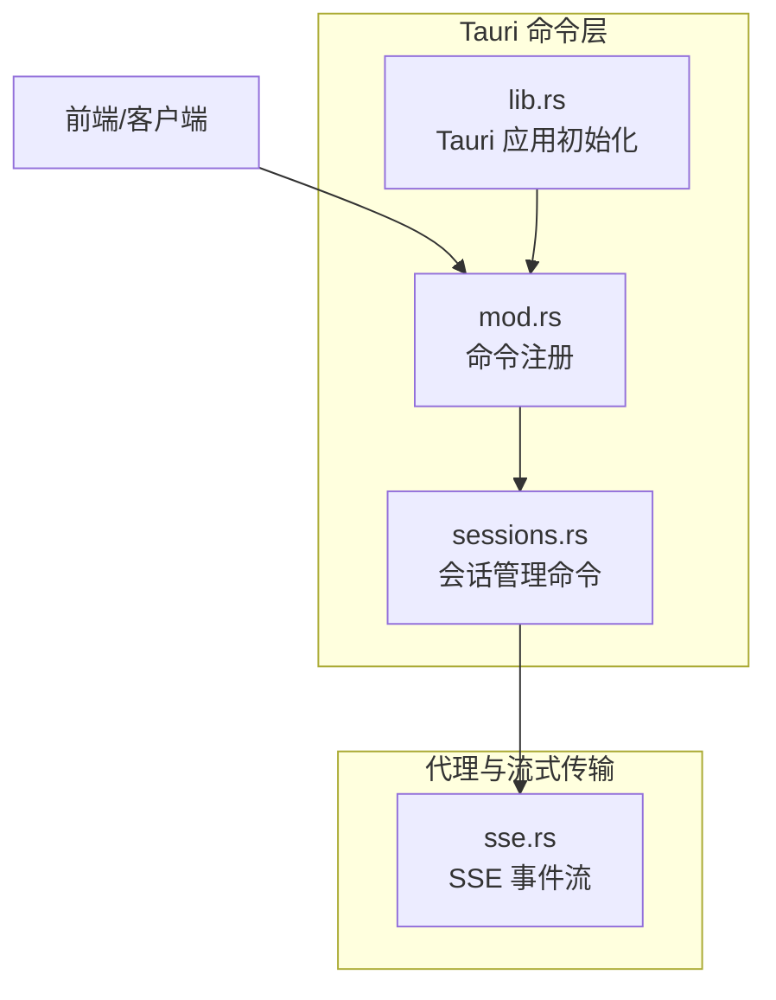
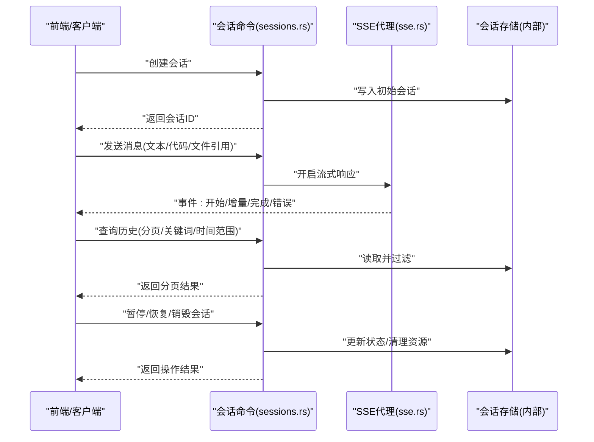
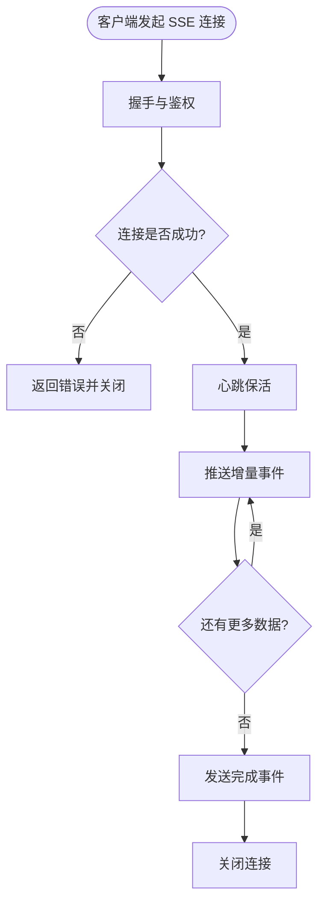
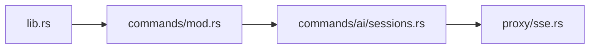

# 会话管理接口

<cite>
**本文引用的文件**   
- [src-tauri/src/commands/ai/sessions.rs](file://src-tauri/src/commands/ai/sessions.rs)
- [src-tauri/src/proxy/sse.rs](file://src-tauri/src/proxy/sse.rs)
- [src-tauri/src/commands/mod.rs](file://src-tauri/src/commands/mod.rs)
- [src-tauri/src/lib.rs](file://src-tauri/src/lib.rs)
</cite>

## 目录
1. [简介](#简介)
2. [项目结构](#项目结构)
3. [核心组件](#核心组件)
4. [架构总览](#架构总览)
5. [详细组件分析](#详细组件分析)
6. [依赖分析](#依赖分析)
7. [性能考虑](#性能考虑)
8. [故障排查指南](#故障排查指南)
9. [结论](#结论)
10. [附录](#附录) 

## 简介
本文件为 AI 会话管理功能的 API 文档，聚焦于以下能力：
- 会话生命周期管理：创建、销毁、暂停、恢复
- 消息收发：文本、代码块、文件引用等消息类型
- 历史查询：分页、关键词搜索、时间范围过滤
- 流式响应：SSE（Server-Sent Events）连接管理与实时数据传输
- 调用示例与错误处理方案

说明：
- 本文档基于仓库中 Rust 后端命令模块与 SSE 代理实现进行梳理，面向前端或外部客户端集成。
- 为避免泄露内部实现细节，本文不直接粘贴源码，而是通过“章节来源”标注对应文件与行号范围。

## 项目结构
与本次文档相关的核心位置如下：
- 会话命令层：位于 src-tauri/src/commands/ai/sessions.rs，提供会话管理的 Tauri 命令入口
- SSE 流式传输：位于 src-tauri/src/proxy/sse.rs，负责 SSE 事件流建立与转发
- 命令注册与导出：位于 src-tauri/src/commands/mod.rs 与 src-tauri/src/lib.rs，负责将命令暴露给前端

图表来源
- [src-tauri/src/commands/ai/sessions.rs](file://src-tauri/src/commands/ai/sessions.rs)
- [src-tauri/src/proxy/sse.rs](file://src-tauri/src/proxy/sse.rs)
- [src-tauri/src/commands/mod.rs](file://src-tauri/src/commands/mod.rs)
- [src-tauri/src/lib.rs](file://src-tauri/src/lib.rs)

章节来源
- [src-tauri/src/commands/ai/sessions.rs](file://src-tauri/src/commands/ai/sessions.rs)
- [src-tauri/src/proxy/sse.rs](file://src-tauri/src/proxy/sse.rs)
- [src-tauri/src/commands/mod.rs](file://src-tauri/src/commands/mod.rs)
- [src-tauri/src/lib.rs](file://src-tauri/src/lib.rs)

## 核心组件
- 会话管理器（命令层）
  - 职责：对外暴露会话创建、销毁、暂停、恢复、历史查询、消息发送等命令
  - 关键能力：会话状态机、持久化存储、消息队列、分页与过滤
- SSE 代理（流式传输）
  - 职责：维护 SSE 长连接，按事件类型推送增量内容，支持断线重连与心跳
  - 关键能力：事件序列化、背压控制、超时与重试

章节来源
- [src-tauri/src/commands/ai/sessions.rs](file://src-tauri/src/commands/ai/sessions.rs)
- [src-tauri/src/proxy/sse.rs](file://src-tauri/src/proxy/sse.rs)

## 架构总览
整体交互流程：
- 前端通过 Tauri 命令调用会话管理接口
- 会话命令层协调业务逻辑（状态变更、持久化、消息路由）
- 对于生成类操作，使用 SSE 向客户端推送增量结果
- 历史查询走同步返回路径，支持分页与过滤

图表来源
- [src-tauri/src/commands/ai/sessions.rs](file://src-tauri/src/commands/ai/sessions.rs)
- [src-tauri/src/proxy/sse.rs](file://src-tauri/src/proxy/sse.rs)

## 详细组件分析

### 会话生命周期管理接口
- 创建会话
  - 输入：会话元数据（如标题、模型配置、上下文参数等）
  - 输出：会话 ID、初始状态
  - 行为：分配唯一 ID、初始化空消息列表、落盘持久化
- 销毁会话
  - 输入：会话 ID
  - 输出：成功/失败
  - 行为：停止任何活跃流、删除会话及关联消息、释放资源
- 暂停会话
  - 输入：会话 ID
  - 输出：成功/失败
  - 行为：标记为暂停态、挂起未完成的流任务
- 恢复会话
  - 输入：会话 ID
  - 输出：成功/失败
  - 行为：从暂停态恢复到可运行态、必要时重建流通道

章节来源
- [src-tauri/src/commands/ai/sessions.rs](file://src-tauri/src/commands/ai/sessions.rs)

### 消息发送与接收接口
- 消息类型
  - 文本消息：纯文本内容
  - 代码块消息：包含语言标识与代码片段
  - 文件引用消息：包含文件路径、摘要或哈希
- 发送消息
  - 输入：会话 ID、消息体（含类型与内容）
  - 输出：消息 ID、入队状态
  - 行为：校验消息格式、追加到会话消息队列、触发后续处理（如模型调用）
- 接收消息
  - 同步：历史查询时批量返回
  - 异步：通过 SSE 事件流逐步推送增量内容

章节来源
- [src-tauri/src/commands/ai/sessions.rs](file://src-tauri/src/commands/ai/sessions.rs)

### 会话历史查询接口
- 分页查询
  - 输入：会话 ID、页码、每页大小
  - 输出：消息列表、总数、是否有下一页
- 关键词搜索
  - 输入：会话 ID、关键词
  - 输出：匹配的消息集合（支持高亮字段）
- 时间范围过滤
  - 输入：会话 ID、起始时间、结束时间
  - 输出：指定时间段内的消息集合

章节来源
- [src-tauri/src/commands/ai/sessions.rs](file://src-tauri/src/commands/ai/sessions.rs)

### 流式响应处理机制（SSE）
- 连接管理
  - 建立：客户端发起 SSE 请求，服务端返回事件流
  - 心跳：周期性心跳事件，用于保活检测
  - 断线重连：客户端侧实现指数退避重连策略
- 事件类型
  - 开始：表示一次生成任务的启动
  - 增量：分片返回的文本或结构化内容
  - 完成：一次性结束信号，携带最终统计信息
  - 错误：异常或中断事件，附带错误码与提示
- 背压与限流
  - 服务端根据客户端消费速度调整推送速率
  - 支持最大缓冲上限，避免内存膨胀

图表来源
- [src-tauri/src/proxy/sse.rs](file://src-tauri/src/proxy/sse.rs)

章节来源
- [src-tauri/src/proxy/sse.rs](file://src-tauri/src/proxy/sse.rs)

### 命令注册与导出
- 命令注册
  - 在命令模块中集中注册会话相关命令，供 Tauri 运行时分发
- 应用初始化
  - 在应用启动阶段加载命令集，确保前端可通过统一命名空间调用

章节来源
- [src-tauri/src/commands/mod.rs](file://src-tauri/src/commands/mod.rs)
- [src-tauri/src/lib.rs](file://src-tauri/src/lib.rs)

## 依赖分析
- 组件耦合
  - 会话命令依赖 SSE 代理以支持流式输出
  - 命令注册层对会话命令与 SSE 代理进行解耦装配
- 外部依赖
  - Tauri 运行时：提供命令调度与 IPC 通道
  - 文件系统/数据库：用于会话与消息持久化（具体实现由内部模块承担）

图表来源
- [src-tauri/src/commands/mod.rs](file://src-tauri/src/commands/mod.rs)
- [src-tauri/src/lib.rs](file://src-tauri/src/lib.rs)
- [src-tauri/src/commands/ai/sessions.rs](file://src-tauri/src/commands/ai/sessions.rs)
- [src-tauri/src/proxy/sse.rs](file://src-tauri/src/proxy/sse.rs)

章节来源
- [src-tauri/src/commands/mod.rs](file://src-tauri/src/commands/mod.rs)
- [src-tauri/src/lib.rs](file://src-tauri/src/lib.rs)
- [src-tauri/src/commands/ai/sessions.rs](file://src-tauri/src/commands/ai/sessions.rs)
- [src-tauri/src/proxy/sse.rs](file://src-tauri/src/proxy/sse.rs)

## 性能考虑
- 流式传输
  - 合理设置增量事件大小，避免过大导致网络拥塞
  - 启用压缩与二进制编码（如适用）以降低带宽占用
- 历史查询
  - 分页默认限制每页大小，防止一次性返回过多数据
  - 对高频查询字段建立索引（如时间戳、消息类型）
- 资源管理
  - 会话销毁时及时释放流与临时缓冲区
  - 对长时间运行的任务设置超时与取消令牌

[本节为通用指导，无需特定文件来源]

## 故障排查指南
- 常见错误
  - 会话不存在：检查会话 ID 是否正确，确认会话未被销毁
  - 权限不足：确认当前用户具备访问该会话的权限
  - 流式连接中断：检查网络稳定性与服务端心跳是否正常
- 定位步骤
  - 查看 SSE 事件日志，确认事件序列是否完整
  - 核对历史查询参数（页码、关键词、时间范围）是否符合约束
  - 检查会话状态是否为可运行态（非暂停/销毁）
- 恢复建议
  - 对 SSE 断线采用指数退避重连
  - 对历史查询失败进行重试与降级（缩小查询范围）

章节来源
- [src-tauri/src/commands/ai/sessions.rs](file://src-tauri/src/commands/ai/sessions.rs)
- [src-tauri/src/proxy/sse.rs](file://src-tauri/src/proxy/sse.rs)

## 结论
本 API 围绕会话全生命周期与消息流转构建，结合 SSE 流式传输满足实时交互需求。通过清晰的命令分层与事件驱动设计，系统具备良好的可扩展性与可维护性。建议在集成时重点关注连接可靠性、分页与过滤性能以及错误恢复策略。

[本节为总结性内容，无需特定文件来源]

## 附录

### 调用示例（概念性）
- 创建会话
  - 请求：提交会话元数据
  - 响应：返回会话 ID
- 发送消息
  - 请求：提交消息体（文本/代码/文件引用）
  - 响应：返回消息 ID 与入队状态
- 查询历史
  - 请求：提交分页、关键词、时间范围
  - 响应：返回消息列表与分页信息
- SSE 流式
  - 请求：建立 SSE 连接
  - 响应：依次收到开始、增量、完成或错误事件

[本节为概念性示例，无需特定文件来源]