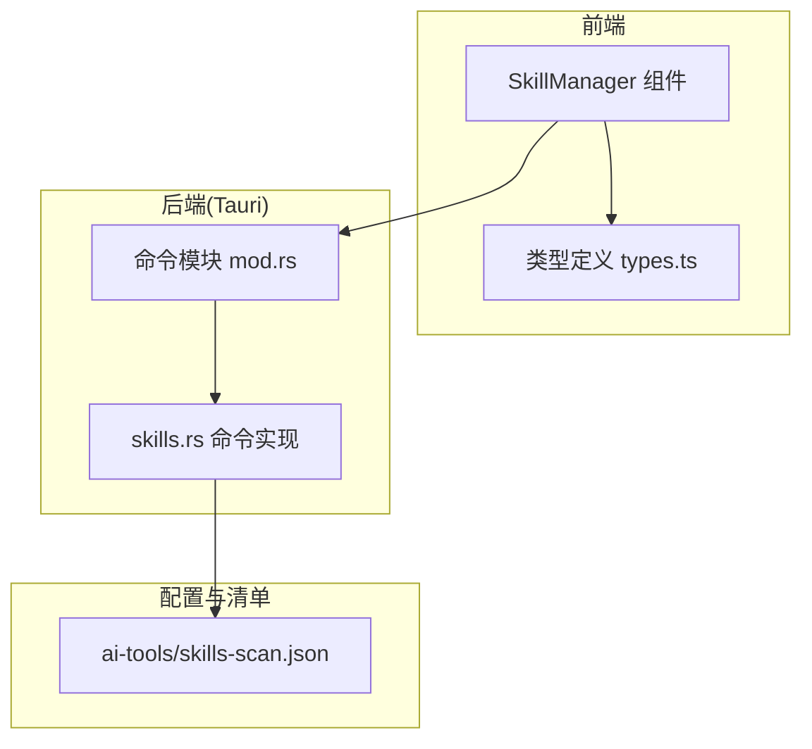
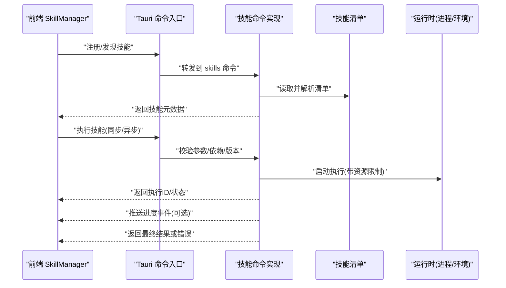
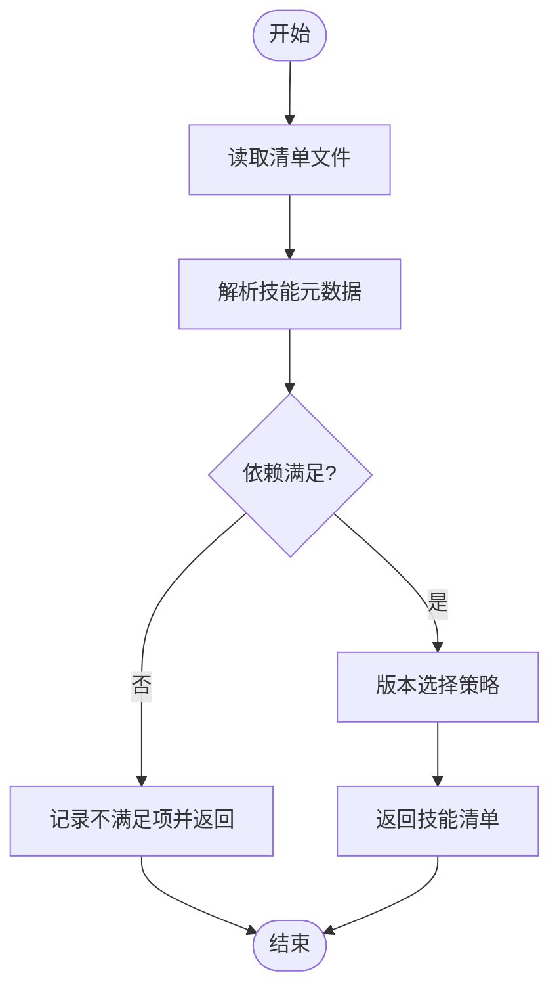
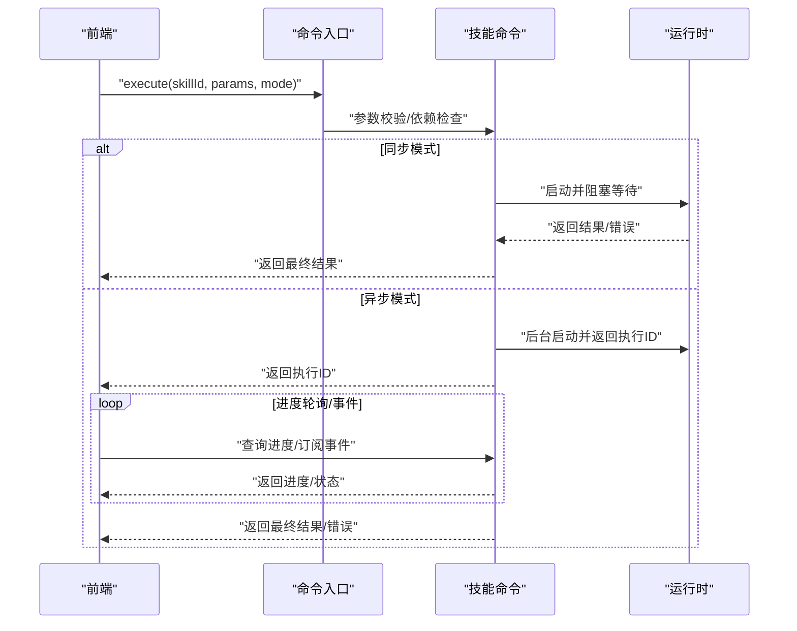
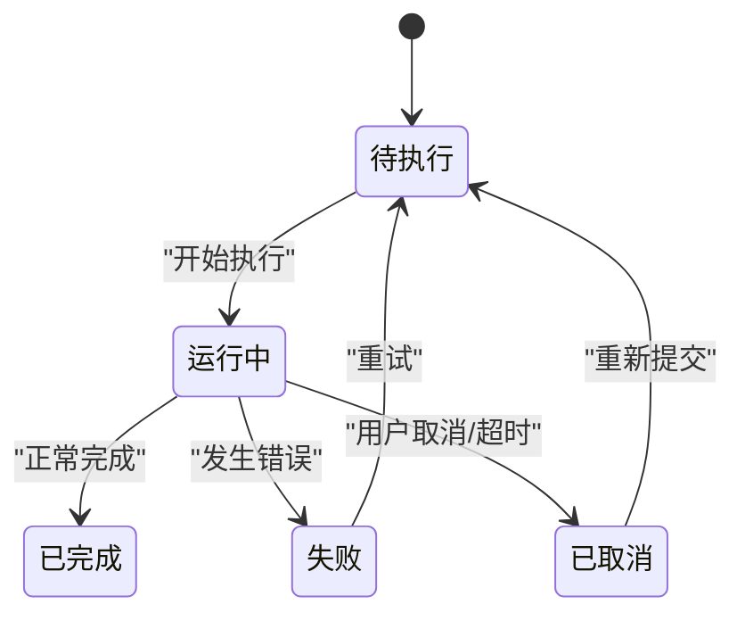

# 技能系统接口

<cite>
**本文引用的文件**   
- [src/components/ai/SkillManager.tsx](file://src/components/ai/SkillManager.tsx)
- [src/components/ai/types.ts](file://src/components/ai/types.ts)
- [src-tauri/src/commands/ai/skills.rs](file://src-tauri/src/commands/ai/skills.rs)
- [src-tauri/src/commands/mod.rs](file://src-tauri/src/commands/mod.rs)
- [ai-tools/skills-scan.json](file://ai-tools/skills-scan.json)
</cite>

## 目录
1. [简介](#简介)
2. [项目结构](#项目结构)
3. [核心组件](#核心组件)
4. [架构总览](#架构总览)
5. [详细组件分析](#详细组件分析)
6. [依赖分析](#依赖分析)
7. [性能考虑](#性能考虑)
8. [故障排查指南](#故障排查指南)
9. [结论](#结论)
10. [附录](#附录)

## 简介
本文件为 AI 技能系统的全面 API 文档，覆盖以下关键能力：
- 技能注册与发现：清单解析、依赖检查、版本管理
- 技能执行：同步与异步模式、参数传递、进度回调、结果处理
- 状态管理：运行状态监控、错误处理、资源清理
- 权限控制：沙箱隔离、资源限制与安全策略
- 开发指南与最佳实践

该文档面向开发者与集成者，既提供高层架构说明，也给出代码级映射与可视化图示，帮助快速理解并正确使用技能系统。

## 项目结构
本项目采用前后端分离的 Tauri 应用结构：
- 前端（React + TypeScript）：提供技能管理 UI 与交互逻辑
- 后端（Rust + Tauri Commands）：暴露命令接口，负责技能扫描、解析、执行与状态管理
- 配置与清单：集中存放技能扫描结果与元数据

图表来源
- [src/components/ai/SkillManager.tsx](file://src/components/ai/SkillManager.tsx)
- [src/components/ai/types.ts](file://src/components/ai/types.ts)
- [src-tauri/src/commands/mod.rs](file://src-tauri/src/commands/mod.rs)
- [src-tauri/src/commands/ai/skills.rs](file://src-tauri/src/commands/ai/skills.rs)
- [ai-tools/skills-scan.json](file://ai-tools/skills-scan.json)

章节来源
- [src/components/ai/SkillManager.tsx](file://src/components/ai/SkillManager.tsx)
- [src/components/ai/types.ts](file://src/components/ai/types.ts)
- [src-tauri/src/commands/mod.rs](file://src-tauri/src/commands/mod.rs)
- [src-tauri/src/commands/ai/skills.rs](file://src-tauri/src/commands/ai/skills.rs)
- [ai-tools/skills-scan.json](file://ai-tools/skills-scan.json)

## 核心组件
- 前端技能管理器（SkillManager）
  - 职责：渲染技能列表、触发注册/发现、发起执行请求、展示进度与结果
  - 交互：通过 Tauri 调用后端命令；使用类型定义确保数据结构一致
- 后端技能命令（skills.rs）
  - 职责：读取清单、解析元数据、校验依赖与版本、调度执行、维护运行状态
  - 输出：统一返回结构，包含状态码、消息、数据体与可选事件流标识
- 类型定义（types.ts）
  - 职责：定义技能实体、执行参数、进度事件、结果对象等前端类型契约
- 技能清单（skills-scan.json）
  - 职责：描述已发现技能的元数据、路径、版本、依赖关系等

章节来源
- [src/components/ai/SkillManager.tsx](file://src/components/ai/SkillManager.tsx)
- [src/components/ai/types.ts](file://src/components/ai/types.ts)
- [src-tauri/src/commands/ai/skills.rs](file://src-tauri/src/commands/ai/skills.rs)
- [ai-tools/skills-scan.json](file://ai-tools/skills-scan.json)

## 架构总览
整体采用“前端 UI -> Tauri 命令 -> 清单与运行时”的分层架构。前端通过类型化接口与后端交互，后端基于清单进行技能发现与执行，并提供状态与事件反馈。

图表来源
- [src/components/ai/SkillManager.tsx](file://src/components/ai/SkillManager.tsx)
- [src-tauri/src/commands/mod.rs](file://src-tauri/src/commands/mod.rs)
- [src-tauri/src/commands/ai/skills.rs](file://src-tauri/src/commands/ai/skills.rs)
- [ai-tools/skills-scan.json](file://ai-tools/skills-scan.json)

## 详细组件分析

### 技能注册与发现接口
- 功能要点
  - 清单解析：从清单文件中加载技能集合，提取名称、版本、路径、依赖等元信息
  - 依赖检查：根据依赖声明验证可用性与兼容性
  - 版本管理：支持多版本并存与选择策略（如最新稳定版）
- 典型流程
  - 前端调用注册/发现命令
  - 后端读取清单并解析
  - 校验依赖与版本约束
  - 返回技能列表与元数据

图表来源
- [src-tauri/src/commands/ai/skills.rs](file://src-tauri/src/commands/ai/skills.rs)
- [ai-tools/skills-scan.json](file://ai-tools/skills-scan.json)

章节来源
- [src-tauri/src/commands/ai/skills.rs](file://src-tauri/src/commands/ai/skills.rs)
- [ai-tools/skills-scan.json](file://ai-tools/skills-scan.json)

### 技能执行接口（同步与异步）
- 同步执行
  - 适用场景：短耗时任务，直接等待结果
  - 参数传递：结构化参数对象，含必填/选填字段与校验规则
  - 结果处理：成功返回数据体；失败返回错误码与诊断信息
- 异步执行
  - 适用场景：长耗时任务，需进度回调与取消机制
  - 进度回调：通过事件流或轮询获取执行进度与中间状态
  - 结果处理：完成后返回最终结果或错误；支持重试与幂等性

图表来源
- [src/components/ai/SkillManager.tsx](file://src/components/ai/SkillManager.tsx)
- [src-tauri/src/commands/ai/skills.rs](file://src-tauri/src/commands/ai/skills.rs)

章节来源
- [src/components/ai/SkillManager.tsx](file://src/components/ai/SkillManager.tsx)
- [src-tauri/src/commands/ai/skills.rs](file://src-tauri/src/commands/ai/skills.rs)

### 技能状态管理接口
- 运行状态监控
  - 状态枚举：待执行、运行中、已完成、失败、已取消
  - 查询方式：按执行ID查询当前状态与进度
- 错误处理
  - 错误分类：参数错误、依赖缺失、运行时异常、超时
  - 诊断信息：错误码、消息、堆栈摘要、上下文快照
- 资源清理
  - 自动回收：临时文件、进程句柄、内存占用
  - 手动清理：强制终止、释放锁、清理缓存

图表来源
- [src-tauri/src/commands/ai/skills.rs](file://src-tauri/src/commands/ai/skills.rs)

章节来源
- [src-tauri/src/commands/ai/skills.rs](file://src-tauri/src/commands/ai/skills.rs)

### 权限控制与安全策略
- 沙箱隔离
  - 进程隔离：每个技能在独立进程中运行，限制系统调用
  - 文件系统访问：白名单目录、只读挂载、写入受限
  - 网络访问：按需启用，限制目标域与端口
- 资源限制
  - CPU/内存上限：防止资源耗尽
  - I/O 配额：限制磁盘读写与网络带宽
  - 超时控制：设置最大执行时长
- 安全策略
  - 签名校验：对技能包进行完整性与来源校验
  - 最小权限原则：仅授予必要权限
  - 审计日志：记录关键操作与异常

章节来源
- [src-tauri/src/commands/ai/skills.rs](file://src-tauri/src/commands/ai/skills.rs)

### 类型与数据结构
- 前端类型定义
  - 技能实体：包含 id、name、version、dependencies、metadata 等字段
  - 执行参数：结构化对象，含校验规则与默认值
  - 进度事件：包含进度百分比、阶段、时间戳
  - 结果对象：包含成功数据或错误详情
- 后端返回结构
  - 统一响应：status、message、data、event_id（可选）
  - 错误模型：code、detail、context

章节来源
- [src/components/ai/types.ts](file://src/components/ai/types.ts)

## 依赖分析
- 组件耦合
  - 前端 SkillManager 依赖类型定义与 Tauri 命令入口
  - 后端命令模块聚合各子命令，skills.rs 聚焦技能相关逻辑
  - 清单文件作为静态配置，被后端解析消费
- 外部依赖
  - Tauri 运行时：提供进程管理与 IPC 通道
  - 文件系统：读取清单与技能包
  - 可选：事件总线用于异步进度推送

图表来源
- [src/components/ai/types.ts](file://src/components/ai/types.ts)
- [src/components/ai/SkillManager.tsx](file://src/components/ai/SkillManager.tsx)
- [src-tauri/src/commands/mod.rs](file://src-tauri/src/commands/mod.rs)
- [src-tauri/src/commands/ai/skills.rs](file://src-tauri/src/commands/ai/skills.rs)
- [ai-tools/skills-scan.json](file://ai-tools/skills-scan.json)

章节来源
- [src/components/ai/types.ts](file://src/components/ai/types.ts)
- [src/components/ai/SkillManager.tsx](file://src/components/ai/SkillManager.tsx)
- [src-tauri/src/commands/mod.rs](file://src-tauri/src/commands/mod.rs)
- [src-tauri/src/commands/ai/skills.rs](file://src-tauri/src/commands/ai/skills.rs)
- [ai-tools/skills-scan.json](file://ai-tools/skills-scan.json)

## 性能考虑
- 清单解析优化
  - 增量扫描：仅变更清单时重新解析
  - 缓存策略：对解析结果与依赖图进行内存缓存
- 执行调度
  - 并发控制：限制同时运行的技能数量
  - 优先级队列：高优先级任务优先调度
- 资源回收
  - 及时释放：任务结束后立即清理临时资源
  - 监控告警：对长时间运行与高资源占用进行告警

[本节为通用指导，无需源码引用]

## 故障排查指南
- 常见问题
  - 依赖缺失：检查清单中的依赖声明与实际环境一致性
  - 版本冲突：确认版本选择策略与约束是否满足
  - 执行超时：调整超时阈值或优化技能实现
  - 权限不足：核对沙箱策略与白名单配置
- 定位方法
  - 查看错误码与诊断信息
  - 检查审计日志与运行状态
  - 复现最小用例并逐步缩小范围

章节来源
- [src-tauri/src/commands/ai/skills.rs](file://src-tauri/src/commands/ai/skills.rs)

## 结论
本技能系统通过清晰的清单驱动与前后端分层设计，实现了可插拔的技能注册、发现、执行与状态管理。配合严格的权限控制与资源限制，能够在保证安全的前提下提供高效的技能运行环境。建议遵循本文档的最佳实践，持续提升技能质量与系统稳定性。

[本节为总结性内容，无需源码引用]

## 附录
- 开发指南与最佳实践
  - 清单编写规范：明确依赖、版本与元数据
  - 参数设计：保持向后兼容，提供默认值与校验
  - 错误处理：返回明确的错误码与上下文
  - 进度上报：定期推送进度，便于前端展示
  - 安全合规：遵循最小权限原则，避免敏感操作
  - 测试与回归：覆盖边界条件与异常路径
  - 文档与示例：提供使用说明与示例清单

[本节为通用指导，无需源码引用]