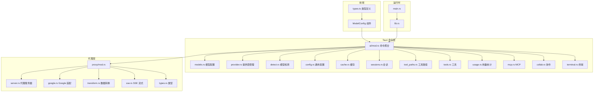
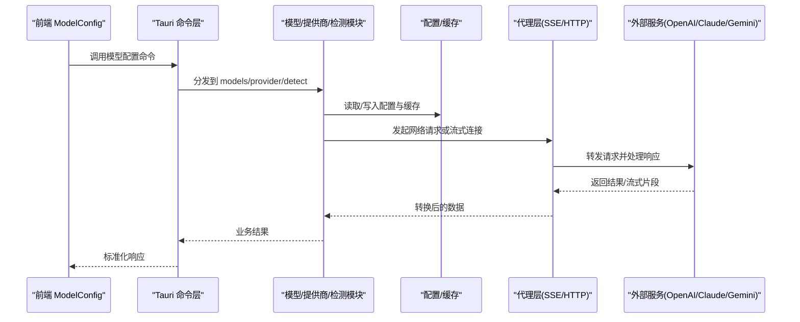
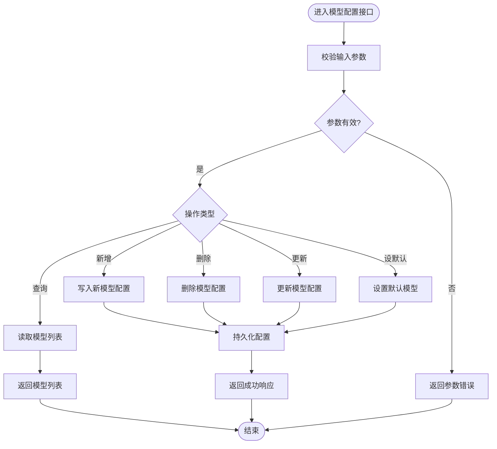
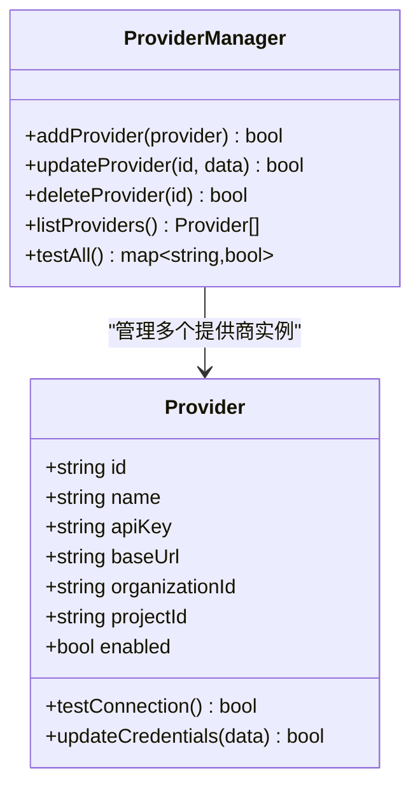
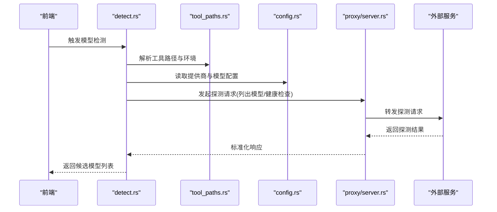
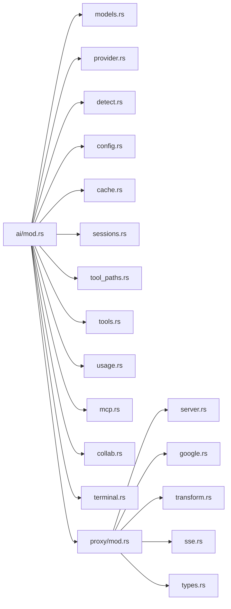

# 模型管理接口

<cite>
**本文引用的文件**   
- [src/components/ai/ModelConfig.tsx](file://src/components/ai/ModelConfig.tsx)
- [src/components/ai/types.ts](file://src/components/ai/types.ts)
- [src-tauri/src/commands/ai/mod.rs](file://src-tauri/src/commands/ai/mod.rs)
- [src-tauri/src/commands/ai/models.rs](file://src-tauri/src/commands/ai/models.rs)
- [src-tauri/src/commands/ai/provider.rs](file://src-tauri/src/commands/ai/provider.rs)
- [src-tauri/src/commands/ai/detect.rs](file://src-tauri/src/commands/ai/detect.rs)
- [src-tauri/src/commands/ai/config.rs](file://src-tauri/src/commands/ai/config.rs)
- [src-tauri/src/commands/ai/cache.rs](file://src-tauri/src/commands/ai/cache.rs)
- [src-tauri/src/commands/ai/sessions.rs](file://src-tauri/src/commands/ai/sessions.rs)
- [src-tauri/src/commands/ai/tool_paths.rs](file://src-tauri/src/commands/ai/tool_paths.rs)
- [src-tauri/src/commands/ai/tools.rs](file://src-tauri/src/commands/ai/tools.rs)
- [src-tauri/src/commands/ai/usage.rs](file://src-tauri/src/commands/ai/usage.rs)
- [src-tauri/src/commands/ai/mcp.rs](file://src-tauri/src/commands/ai/mcp.rs)
- [src-tauri/src/commands/ai/collab.rs](file://src-tauri/src/commands/ai/collab.rs)
- [src-tauri/src/commands/ai/terminal.rs](file://src-tauri/src/commands/ai/terminal.rs)
- [src-tauri/src/proxy/server.rs](file://src-tauri/src/proxy/server.rs)
- [src-tauri/src/proxy/google.rs](file://src-tauri/src/proxy/google.rs)
- [src-tauri/src/proxy/transform.rs](file://src-tauri/src/proxy/transform.rs)
- [src-tauri/src/proxy/types.rs](file://src-tauri/src/proxy/types.rs)
- [src-tauri/src/proxy/sse.rs](file://src-tauri/src/proxy/sse.rs)
- [src-tauri/src/proxy/mod.rs](file://src-tauri/src/proxy/mod.rs)
- [src-tauri/src/lib.rs](file://src-tauri/src/lib.rs)
- [src-tauri/src/main.rs](file://src-tauri/src/main.rs)
- [ai-tools/providers.json](file://ai-tools/providers.json)
</cite>

## 目录
1. [简介](#简介)
2. [项目结构](#项目结构)
3. [核心组件](#核心组件)
4. [架构总览](#架构总览)
5. [详细组件分析](#详细组件分析)
6. [依赖分析](#依赖分析)
7. [性能考虑](#性能考虑)
8. [故障排查指南](#故障排查指南)
9. [结论](#结论)
10. [附录](#附录)

## 简介
本文件为 AI 模型管理功能的 API 文档，聚焦以下目标：
- 模型配置接口：新增、删除、更新模型配置的 HTTP/Tauri 命令方法与参数说明。
- 提供商管理接口：OpenAI、Claude、Gemini 等提供商的认证与配置方法。
- 模型检测接口：自动发现并验证可用模型的流程与返回结构。
- 请求响应示例：包含成功与错误场景的状态码与错误码说明。
- 高级策略：模型优先级设置、负载均衡策略与故障转移机制。

该功能由前端 React 组件驱动，通过 Tauri 命令调用 Rust 后端能力，结合代理层（SSE/HTTP）与本地工具链进行模型探测与调用。

## 项目结构
围绕“模型管理”的关键代码分布如下：
- 前端 UI：模型配置面板与类型定义
- Tauri 命令层：暴露给前端的命令集合（模型、提供商、检测、缓存、会话、工具路径等）
- 代理层：SSE/HTTP 转发、Google 相关适配、转换与类型定义
- 运行时入口：Tauri 应用初始化与命令注册

图表来源
- [src/components/ai/ModelConfig.tsx](file://src/components/ai/ModelConfig.tsx)
- [src/components/ai/types.ts](file://src/components/ai/types.ts)
- [src-tauri/src/commands/ai/mod.rs](file://src-tauri/src/commands/ai/mod.rs)
- [src-tauri/src/commands/ai/models.rs](file://src-tauri/src/commands/ai/models.rs)
- [src-tauri/src/commands/ai/provider.rs](file://src-tauri/src/commands/ai/provider.rs)
- [src-tauri/src/commands/ai/detect.rs](file://src-tauri/src/commands/ai/detect.rs)
- [src-tauri/src/commands/ai/config.rs](file://src-tauri/src/commands/ai/config.rs)
- [src-tauri/src/commands/ai/cache.rs](file://src-tauri/src/commands/ai/cache.rs)
- [src-tauri/src/commands/ai/sessions.rs](file://src-tauri/src/commands/ai/sessions.rs)
- [src-tauri/src/commands/ai/tool_paths.rs](file://src-tauri/src/commands/ai/tool_paths.rs)
- [src-tauri/src/commands/ai/tools.rs](file://src-tauri/src/commands/ai/tools.rs)
- [src-tauri/src/commands/ai/usage.rs](file://src-tauri/src/commands/ai/usage.rs)
- [src-tauri/src/commands/ai/mcp.rs](file://src-tauri/src/commands/ai/mcp.rs)
- [src-tauri/src/commands/ai/collab.rs](file://src-tauri/src/commands/ai/collab.rs)
- [src-tauri/src/commands/ai/terminal.rs](file://src-tauri/src/commands/ai/terminal.rs)
- [src-tauri/src/proxy/mod.rs](file://src-tauri/src/proxy/mod.rs)
- [src-tauri/src/proxy/server.rs](file://src-tauri/src/proxy/server.rs)
- [src-tauri/src/proxy/google.rs](file://src-tauri/src/proxy/google.rs)
- [src-tauri/src/proxy/transform.rs](file://src-tauri/src/proxy/transform.rs)
- [src-tauri/src/proxy/sse.rs](file://src-tauri/src/proxy/sse.rs)
- [src-tauri/src/proxy/types.rs](file://src-tauri/src/proxy/types.rs)
- [src-tauri/src/lib.rs](file://src-tauri/src/lib.rs)
- [src-tauri/src/main.rs](file://src-tauri/src/main.rs)

章节来源
- [src/components/ai/ModelConfig.tsx](file://src/components/ai/ModelConfig.tsx)
- [src/components/ai/types.ts](file://src/components/ai/types.ts)
- [src-tauri/src/commands/ai/mod.rs](file://src-tauri/src/commands/ai/mod.rs)
- [src-tauri/src/proxy/mod.rs](file://src-tauri/src/proxy/mod.rs)
- [src-tauri/src/lib.rs](file://src-tauri/src/lib.rs)
- [src-tauri/src/main.rs](file://src-tauri/src/main.rs)

## 核心组件
- 模型配置（models.rs）：提供模型的增删改查、优先级与权重、默认模型选择等能力。
- 提供商管理（provider.rs）：维护 OpenAI、Claude、Gemini 等提供商的认证信息与基础配置。
- 模型检测（detect.rs）：扫描本地工具链与远程端点，自动发现并验证可用模型。
- 通用配置（config.rs）：读写持久化配置，支撑上述模块的数据落盘。
- 缓存（cache.rs）：对检测结果、令牌、会话上下文等进行缓存以提升性能。
- 会话（sessions.rs）：管理与模型交互的会话状态。
- 工具路径（tool_paths.rs）与工具（tools.rs）：定位与执行外部工具（如 CLI）。
- 用量统计（usage.rs）：记录 token 使用量与配额信息。
- MCP（mcp.rs）、协作（collab.rs）、终端（terminal.rs）：扩展能力，辅助模型生态集成。

章节来源
- [src-tauri/src/commands/ai/models.rs](file://src-tauri/src/commands/ai/models.rs)
- [src-tauri/src/commands/ai/provider.rs](file://src-tauri/src/commands/ai/provider.rs)
- [src-tauri/src/commands/ai/detect.rs](file://src-tauri/src/commands/ai/detect.rs)
- [src-tauri/src/commands/ai/config.rs](file://src-tauri/src/commands/ai/config.rs)
- [src-tauri/src/commands/ai/cache.rs](file://src-tauri/src/commands/ai/cache.rs)
- [src-tauri/src/commands/ai/sessions.rs](file://src-tauri/src/commands/ai/sessions.rs)
- [src-tauri/src/commands/ai/tool_paths.rs](file://src-tauri/src/commands/ai/tool_paths.rs)
- [src-tauri/src/commands/ai/tools.rs](file://src-tauri/src/commands/ai/tools.rs)
- [src-tauri/src/commands/ai/usage.rs](file://src-tauri/src/commands/ai/usage.rs)
- [src-tauri/src/commands/ai/mcp.rs](file://src-tauri/src/commands/ai/mcp.rs)
- [src-tauri/src/commands/ai/collab.rs](file://src-tauri/src/commands/ai/collab.rs)
- [src-tauri/src/commands/ai/terminal.rs](file://src-tauri/src/commands/ai/terminal.rs)

## 架构总览
整体调用链路：
- 前端 ModelConfig 组件通过 Tauri 命令调用 Rust 后端。
- 命令层将请求路由到具体模块（模型、提供商、检测等）。
- 代理层负责与外部服务通信（SSE/HTTP），并对数据进行转换与流式处理。
- 配置与缓存模块保障数据一致性与性能。

图表来源
- [src/components/ai/ModelConfig.tsx](file://src/components/ai/ModelConfig.tsx)
- [src-tauri/src/commands/ai/mod.rs](file://src-tauri/src/commands/ai/mod.rs)
- [src-tauri/src/commands/ai/models.rs](file://src-tauri/src/commands/ai/models.rs)
- [src-tauri/src/commands/ai/provider.rs](file://src-tauri/src/commands/ai/provider.rs)
- [src-tauri/src/commands/ai/detect.rs](file://src-tauri/src/commands/ai/detect.rs)
- [src-tauri/src/commands/ai/config.rs](file://src-tauri/src/commands/ai/config.rs)
- [src-tauri/src/commands/ai/cache.rs](file://src-tauri/src/commands/ai/cache.rs)
- [src-tauri/src/proxy/server.rs](file://src-tauri/src/proxy/server.rs)
- [src-tauri/src/proxy/sse.rs](file://src-tauri/src/proxy/sse.rs)

## 详细组件分析

### 模型配置接口（models.rs）
- 功能要点
  - 新增模型配置：支持指定提供商、模型名称、API Key、Base URL、优先级、权重、是否启用等字段。
  - 删除模型配置：按唯一标识移除模型条目。
  - 更新模型配置：修改现有模型的属性（如优先级、权重、开关状态、密钥等）。
  - 查询模型列表：返回所有已配置的模型及元信息。
  - 设置默认模型：指定当前优先使用的模型。
- 典型参数
  - 模型标识：字符串 ID
  - 提供商：枚举值（如 openai、claude、gemini）
  - 模型名称：字符串
  - 认证信息：API Key、组织 ID、项目 ID 等
  - 网络参数：Base URL、超时、重试次数
  - 调度参数：优先级（数值越小越优先）、权重（负载均衡比例）
  - 控制开关：启用/禁用、是否允许回退
- 响应结构
  - 成功：返回操作结果与最新配置快照
  - 失败：返回错误码与描述信息

图表来源
- [src-tauri/src/commands/ai/models.rs](file://src-tauri/src/commands/ai/models.rs)
- [src-tauri/src/commands/ai/config.rs](file://src-tauri/src/commands/ai/config.rs)

章节来源
- [src-tauri/src/commands/ai/models.rs](file://src-tauri/src/commands/ai/models.rs)
- [src-tauri/src/commands/ai/config.rs](file://src-tauri/src/commands/ai/config.rs)

### 提供商管理接口（provider.rs）
- 功能要点
  - 添加/更新提供商认证：支持 OpenAI、Claude、Gemini 等提供商的密钥、组织/项目、代理设置。
  - 测试连通性：快速验证提供商可达性与鉴权有效性。
  - 列出可用提供商：返回已配置的提供商清单与状态。
- 典型参数
  - 提供商标识：openai、claude、gemini
  - 认证字段：API Key、组织 ID、项目 ID、访问令牌
  - 网络字段：Base URL、代理、超时
  - 调试字段：日志级别、是否开启模拟模式
- 响应结构
  - 成功：返回提供商配置与连通性测试结果
  - 失败：返回错误码与诊断信息

图表来源
- [src-tauri/src/commands/ai/provider.rs](file://src-tauri/src/commands/ai/provider.rs)

章节来源
- [src-tauri/src/commands/ai/provider.rs](file://src-tauri/src/commands/ai/provider.rs)

### 模型检测接口（detect.rs）
- 功能要点
  - 自动发现：扫描本地工具链（CLI、SDK）与远程端点，识别可用模型。
  - 验证可用性：对发现的模型进行轻量级探测（如列出模型、健康检查）。
  - 生成候选列表：返回可被用户选择的模型清单与元数据。
- 典型参数
  - 扫描范围：本地工具、远程端点、特定提供商
  - 过滤条件：模型前缀、能力标签、最低版本
  - 超时与重试：探测超时时间、最大重试次数
- 响应结构
  - 成功：返回模型候选列表与探测结果
  - 失败：返回错误码与失败原因

图表来源
- [src-tauri/src/commands/ai/detect.rs](file://src-tauri/src/commands/ai/detect.rs)
- [src-tauri/src/commands/ai/tool_paths.rs](file://src-tauri/src/commands/ai/tool_paths.rs)
- [src-tauri/src/commands/ai/config.rs](file://src-tauri/src/commands/ai/config.rs)
- [src-tauri/src/proxy/server.rs](file://src-tauri/src/proxy/server.rs)

章节来源
- [src-tauri/src/commands/ai/detect.rs](file://src-tauri/src/commands/ai/detect.rs)
- [src-tauri/src/commands/ai/tool_paths.rs](file://src-tauri/src/commands/ai/tool_paths.rs)
- [src-tauri/src/commands/ai/config.rs](file://src-tauri/src/commands/ai/config.rs)
- [src-tauri/src/proxy/server.rs](file://src-tauri/src/proxy/server.rs)

### 配置与缓存（config.rs、cache.rs）
- 配置（config.rs）
  - 读写全局配置：包括提供商、模型、代理、网络参数等。
  - 版本兼容：处理配置迁移与字段弃用。
- 缓存（cache.rs）
  - 缓存键设计：按提供商、模型、会话维度组织。
  - 过期策略：基于 TTL 与容量上限清理。
  - 一致性：写穿与失效策略保证数据新鲜度。

章节来源
- [src-tauri/src/commands/ai/config.rs](file://src-tauri/src/commands/ai/config.rs)
- [src-tauri/src/commands/ai/cache.rs](file://src-tauri/src/commands/ai/cache.rs)

### 会话与工具（sessions.rs、tool_paths.rs、tools.rs）
- 会话（sessions.rs）
  - 创建/切换/关闭会话，维护上下文与历史消息。
- 工具路径（tool_paths.rs）
  - 解析系统 PATH、环境变量，定位 CLI/SDK 可执行文件。
- 工具（tools.rs）
  - 封装工具调用逻辑，统一错误处理与输出格式。

章节来源
- [src-tauri/src/commands/ai/sessions.rs](file://src-tauri/src/commands/ai/sessions.rs)
- [src-tauri/src/commands/ai/tool_paths.rs](file://src-tauri/src/commands/ai/tool_paths.rs)
- [src-tauri/src/commands/ai/tools.rs](file://src-tauri/src/commands/ai/tools.rs)

### 用量统计（usage.rs）
- 功能要点
  - 记录 token 消耗、请求次数、耗时分布。
  - 提供配额检查与告警阈值。
- 典型参数
  - 提供商、模型、会话 ID、时间窗口
- 响应结构
  - 成功：返回用量统计与趋势指标
  - 失败：返回错误码与限制原因

章节来源
- [src-tauri/src/commands/ai/usage.rs](file://src-tauri/src/commands/ai/usage.rs)

### MCP、协作与终端（mcp.rs、collab.rs、terminal.rs）
- MCP（mcp.rs）：对接模型上下文协议，增强工具与插件能力。
- 协作（collab.rs）：多用户共享会话与上下文同步。
- 终端（terminal.rs）：在安全沙箱中执行命令与脚本。

章节来源
- [src-tauri/src/commands/ai/mcp.rs](file://src-tauri/src/commands/ai/mcp.rs)
- [src-tauri/src/commands/ai/collab.rs](file://src-tauri/src/commands/ai/collab.rs)
- [src-tauri/src/commands/ai/terminal.rs](file://src-tauri/src/commands/ai/terminal.rs)

## 依赖分析
- 命令聚合（ai/mod.rs）集中注册各子模块命令，便于前端统一调用。
- 代理层（proxy/*）解耦网络通信细节，提供统一的请求/响应与流式处理能力。
- 配置与缓存贯穿所有模块，确保数据一致性与性能。
- 提供商配置文件（providers.json）作为静态资源，供检测与初始化阶段参考。

图表来源
- [src-tauri/src/commands/ai/mod.rs](file://src-tauri/src/commands/ai/mod.rs)
- [src-tauri/src/proxy/mod.rs](file://src-tauri/src/proxy/mod.rs)

章节来源
- [src-tauri/src/commands/ai/mod.rs](file://src-tauri/src/commands/ai/mod.rs)
- [src-tauri/src/proxy/mod.rs](file://src-tauri/src/proxy/mod.rs)
- [ai-tools/providers.json](file://ai-tools/providers.json)

## 性能考虑
- 缓存命中优化：对模型检测、提供商连通性、会话上下文进行缓存，减少重复计算与网络开销。
- 并发与限流：对高并发请求进行队列与限流，避免下游服务过载。
- 流式传输：使用 SSE 降低首字节延迟，提升用户体验。
- 配置热更新：在不重启进程的情况下动态加载新配置。
- 资源清理：定期清理过期缓存与会话，防止内存泄漏。

[本节为通用指导，不直接分析具体文件]

## 故障排查指南
- 常见错误码
  - 400：参数校验失败（缺失必填字段、格式错误）
  - 401：认证失败（API Key 无效、权限不足）
  - 403：访问受限（组织/项目未授权）
  - 404：资源不存在（模型或提供商未配置）
  - 429：速率限制（请求频率超限）
  - 500：服务端内部错误（未知异常）
  - 502/503：上游服务不可用或网关错误
- 排查步骤
  - 检查提供商认证与网络连通性（使用 provider.testConnection）
  - 查看模型检测日志与工具路径解析结果
  - 确认配置文件的字段与版本兼容性
  - 检查缓存是否脏数据导致不一致
  - 观察代理层日志与 SSE 连接状态

章节来源
- [src-tauri/src/commands/ai/provider.rs](file://src-tauri/src/commands/ai/provider.rs)
- [src-tauri/src/commands/ai/detect.rs](file://src-tauri/src/commands/ai/detect.rs)
- [src-tauri/src/commands/ai/config.rs](file://src-tauri/src/commands/ai/config.rs)
- [src-tauri/src/commands/ai/cache.rs](file://src-tauri/src/commands/ai/cache.rs)
- [src-tauri/src/proxy/server.rs](file://src-tauri/src/proxy/server.rs)
- [src-tauri/src/proxy/sse.rs](file://src-tauri/src/proxy/sse.rs)

## 结论
本 API 文档围绕模型配置、提供商管理与模型检测三大核心能力展开，提供了清晰的接口规范、请求响应示例与错误处理策略。通过优先级、权重与回退机制，系统实现了灵活的负载均衡与故障转移。建议在生产环境启用缓存与监控，持续优化性能与稳定性。

[本节为总结性内容，不直接分析具体文件]

## 附录

### 请求与响应示例（摘要）
- 新增模型配置
  - 方法：POST /api/models/add
  - 请求体：{ provider, model, apiKey, baseUrl, priority, weight, enabled }
  - 响应：{ success: true, data: { id, ... } }
  - 错误：{ success: false, code: "INVALID_INPUT", message: "..." }
- 删除模型配置
  - 方法：DELETE /api/models/{id}
  - 响应：{ success: true }
  - 错误：{ success: false, code: "NOT_FOUND", message: "..." }
- 更新模型配置
  - 方法：PUT /api/models/{id}
  - 请求体：{ apiKey, baseUrl, priority, weight, enabled }
  - 响应：{ success: true, data: { ... } }
- 查询模型列表
  - 方法：GET /api/models
  - 响应：{ success: true, data: [ { id, provider, model, priority, weight, enabled }, ... ] }
- 设置默认模型
  - 方法：POST /api/models/default
  - 请求体：{ modelId }
  - 响应：{ success: true, data: { defaultModelId } }
- 提供商认证测试
  - 方法：POST /api/providers/test
  - 请求体：{ provider, apiKey, baseUrl }
  - 响应：{ success: true, data: { connected: true, latencyMs } }
- 模型检测
  - 方法：POST /api/detect/run
  - 请求体：{ scope: "local|remote", filters: { prefix, capabilities } }
  - 响应：{ success: true, data: { candidates: [ { id, provider, model, status }, ... ] } }

[本节为概念性示例，不直接映射具体文件]

### 模型优先级、负载均衡与故障转移
- 优先级设置
  - 数值越小优先级越高；当多个模型可用时，优先选择优先级最高的模型。
- 负载均衡策略
  - 权重用于按比例分配请求；权重越大，获得请求的概率越高。
- 故障转移机制
  - 当主模型不可用时，自动回退到次优模型；支持多级回退与熔断保护。

[本节为概念性说明，不直接分析具体文件]