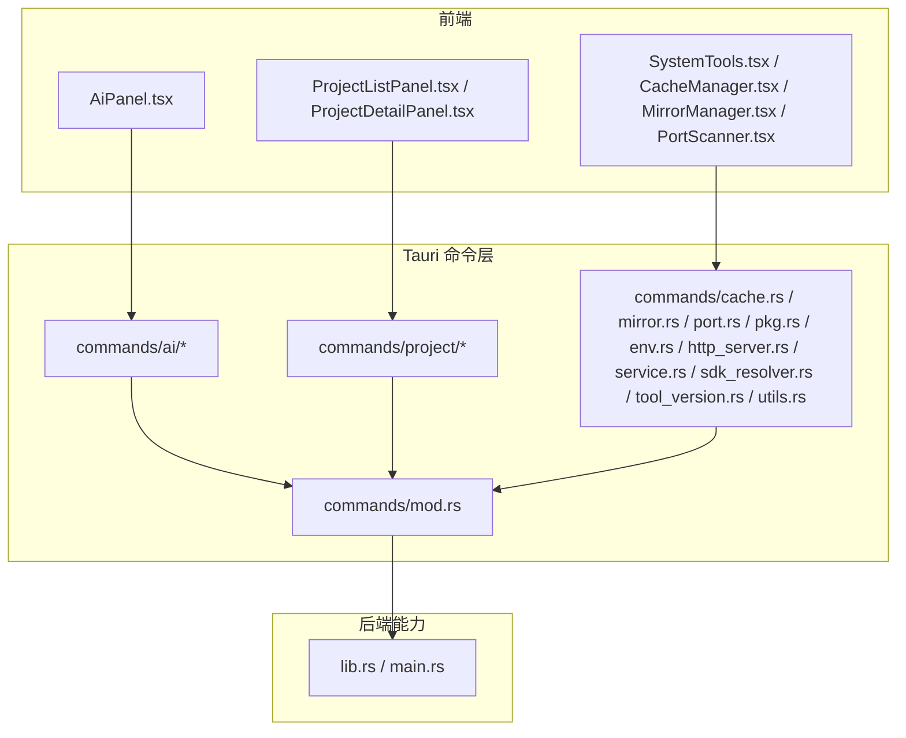
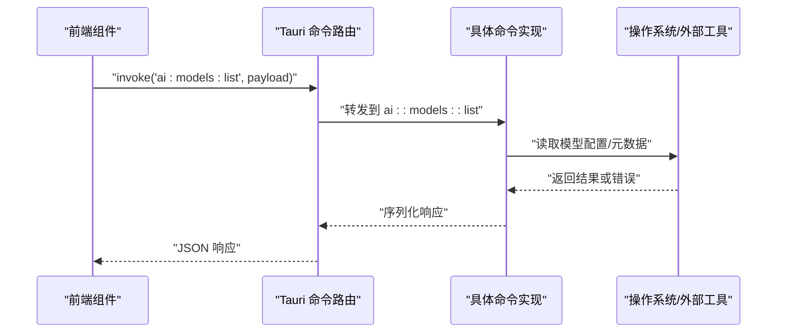
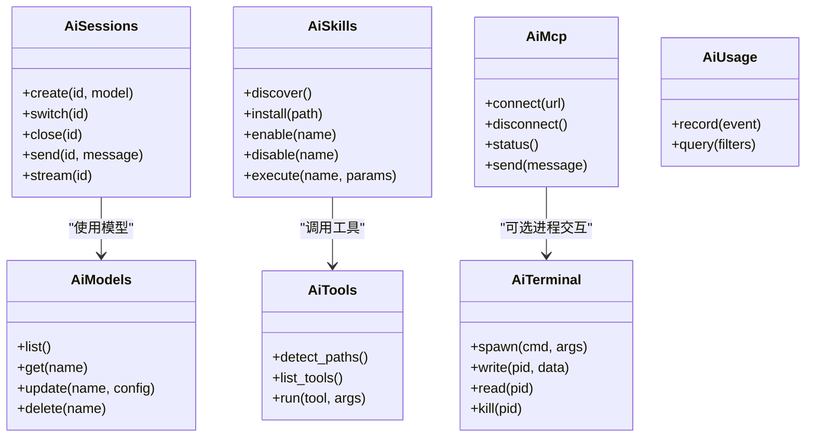
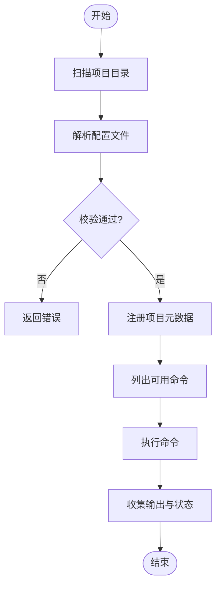
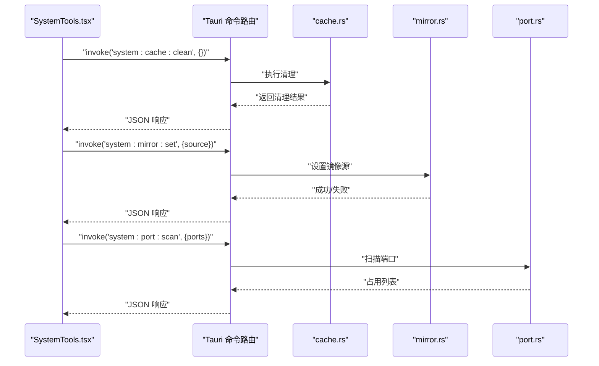
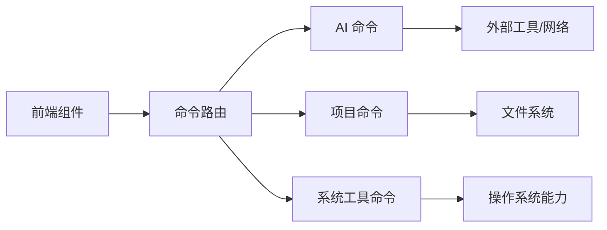

# API 参考

<cite>
**本文引用的文件**   
- [src-tauri/src/commands/mod.rs](file://src-tauri/src/commands/mod.rs)
- [src-tauri/src/commands/ai/mod.rs](file://src-tauri/src/commands/ai/mod.rs)
- [src-tauri/src/commands/ai/models.rs](file://src-tauri/src/commands/ai/models.rs)
- [src-tauri/src/commands/ai/sessions.rs](file://src-tauri/src/commands/ai/sessions.rs)
- [src-tauri/src/commands/ai/skills.rs](file://src-tauri/src/commands/ai/skills.rs)
- [src-tauri/src/commands/ai/cache.rs](file://src-tauri/src/commands/ai/cache.rs)
- [src-tauri/src/commands/ai/config.rs](file://src-tauri/src/commands/ai/config.rs)
- [src-tauri/src/commands/ai/provider.rs](file://src-tauri/src/commands/ai/provider.rs)
- [src-tauri/src/commands/ai/mcp.rs](file://src-tauri/src/commands/ai/mcp.rs)
- [src-tauri/src/commands/ai/detect.rs](file://src-tauri/src/commands/ai/detect.rs)
- [src-tauri/src/commands/ai/launch.rs](file://src-tauri/src/commands/ai/launch.rs)
- [src-tauri/src/commands/ai/terminal.rs](file://src-tauri/src/commands/ai/terminal.rs)
- [src-tauri/src/commands/ai/tools.rs](file://src-tauri/src/commands/ai/tools.rs)
- [src-tauri/src/commands/ai/tool_paths.rs](file://src-tauri/src/commands/ai/tool_paths.rs)
- [src-tauri/src/commands/ai/usage.rs](file://src-tauri/src/commands/ai/usage.rs)
- [src-tauri/src/commands/project/mod.rs](file://src-tauri/src/commands/project/mod.rs)
- [src-tauri/src/commands/project/commands.rs](file://src-tauri/src/commands/project/commands.rs)
- [src-tauri/src/commands/project/types.rs](file://src-tauri/src/commands/project/types.rs)
- [src-tauri/src/commands/project/registry.rs](file://src-tauri/src/commands/project/registry.rs)
- [src-tauri/src/commands/project/scanner.rs](file://src-tauri/src/commands/project/scanner.rs)
- [src-tauri/src/commands/project/versions.rs](file://src-tauri/src/commands/project/versions.rs)
- [src-tauri/src/commands/cache.rs](file://src-tauri/src/commands/cache.rs)
- [src-tauri/src/commands/mirror.rs](file://src-tauri/src/commands/mirror.rs)
- [src-tauri/src/commands/port.rs](file://src-tauri/src/commands/port.rs)
- [src-tauri/src/commands/pkg.rs](file://src-tauri/src/commands/pkg.rs)
- [src-tauri/src/commands/env.rs](file://src-tauri/src/commands/env.rs)
- [src-tauri/src/commands/http_server.rs](file://src-tauri/src/commands/http_server.rs)
- [src-tauri/src/commands/service.rs](file://src-tauri/src/commands/service.rs)
- [src-tauri/src/commands/sdk_resolver.rs](file://src-tauri/src/commands/sdk_resolver.rs)
- [src-tauri/src/commands/tool_version.rs](file://src-tauri/src/commands/tool_version.rs)
- [src-tauri/src/commands/utils.rs](file://src-tauri/src/commands/utils.rs)
- [src-tauri/src/lib.rs](file://src-tauri/src/lib.rs)
- [src-tauri/src/main.rs](file://src-tauri/src/main.rs)
- [src/components/ai/AiPanel.tsx](file://src/components/ai/AiPanel.tsx)
- [src/components/ai/SkillManager.tsx](file://src/components/ai/SkillManager.tsx)
- [src/components/ai/ModelConfig.tsx](file://src/components/ai/ModelConfig.tsx)
- [src/components/ai/McpManager.tsx](file://src/components/ai/McpManager.tsx)
- [src/components/ai/ToolLauncher.tsx](file://src/components/ai/ToolLauncher.tsx)
- [src/components/project/ProjectListPanel.tsx](file://src/components/project/ProjectListPanel.tsx)
- [src/components/project/ProjectDetailPanel.tsx](file://src/components/project/ProjectDetailPanel.tsx)
- [src/components/SystemTools.tsx](file://src/components/SystemTools.tsx)
- [src/components/CacheManager.tsx](file://src/components/CacheManager.tsx)
- [src/components/MirrorManager.tsx](file://src/components/MirrorManager.tsx)
- [src/components/PortScanner.tsx](file://src/components/PortScanner.tsx)
</cite>

## 目录
1. [简介](#简介)
2. [项目结构](#项目结构)
3. [核心组件](#核心组件)
4. [架构总览](#架构总览)
5. [详细组件分析](#详细组件分析)
6. [依赖分析](#依赖分析)
7. [性能考虑](#性能考虑)
8. [故障排查指南](#故障排查指南)
9. [结论](#结论)
10. [附录](#附录)

## 简介
本参考文档面向 Any-Version 的 Tauri 命令 API，覆盖前后端通信、AI 相关接口（模型管理、会话控制、技能执行等）、项目管理接口（项目操作、配置管理、版本控制）以及系统工具接口（缓存管理、镜像配置、端口扫描等）。文档提供请求/响应示例与错误码说明，并给出版本兼容性与迁移指南，帮助开发者快速集成与排障。

## 项目结构
Any-Version 采用 Tauri 架构：前端通过 TypeScript/React 调用 Tauri 命令，后端以 Rust 实现命令处理逻辑。命令按功能域组织在 src-tauri/src/commands 下，AI、项目、系统工具分别成组；前端对应 UI 组件位于 src/components 下。

图表来源
- [src-tauri/src/commands/mod.rs](file://src-tauri/src/commands/mod.rs)
- [src-tauri/src/lib.rs](file://src-tauri/src/lib.rs)
- [src/components/ai/AiPanel.tsx](file://src/components/ai/AiPanel.tsx)
- [src/components/project/ProjectListPanel.tsx](file://src/components/project/ProjectListPanel.tsx)
- [src/components/SystemTools.tsx](file://src/components/SystemTools.tsx)

章节来源
- [src-tauri/src/commands/mod.rs](file://src-tauri/src/commands/mod.rs)
- [src-tauri/src/lib.rs](file://src-tauri/src/lib.rs)
- [src-tauri/src/main.rs](file://src-tauri/src/main.rs)

## 核心组件
- AI 命令模块：提供模型管理、会话控制、技能执行、MCP 管理、终端交互、工具路径与使用统计等能力。
- 项目命令模块：提供项目注册、扫描、命令执行、类型定义与版本管理等能力。
- 系统工具命令模块：提供缓存、镜像、端口扫描、包管理、环境变量、HTTP 服务、服务管理、SDK 解析、工具版本查询与通用工具函数。

章节来源
- [src-tauri/src/commands/ai/mod.rs](file://src-tauri/src/commands/ai/mod.rs)
- [src-tauri/src/commands/project/mod.rs](file://src-tauri/src/commands/project/mod.rs)
- [src-tauri/src/commands/cache.rs](file://src-tauri/src/commands/cache.rs)
- [src-tauri/src/commands/mirror.rs](file://src-tauri/src/commands/mirror.rs)
- [src-tauri/src/commands/port.rs](file://src-tauri/src/commands/port.rs)

## 架构总览
Tauri 命令通过 Rust 暴露给前端，前端通过 invoke 调用命令。命令内部可访问文件系统、网络、进程与环境变量等资源。

图表来源
- [src-tauri/src/commands/mod.rs](file://src-tauri/src/commands/mod.rs)
- [src-tauri/src/commands/ai/models.rs](file://src-tauri/src/commands/ai/models.rs)

## 详细组件分析

### AI 命令模块
- 模型管理：列出、获取、更新、删除模型配置；支持提供商选择与鉴权参数。
- 会话控制：创建、切换、关闭会话；发送消息、接收流式事件（SSE）。
- 技能执行：发现、安装、启用/禁用、执行技能；技能文件查看。
- MCP 管理：连接、断开、状态查询、消息收发。
- 终端交互：启动子进程、读写标准输入输出、信号处理。
- 工具路径与工具集：检测工具路径、列举可用工具、执行工具命令。
- 使用统计：记录与查询调用次数、耗时、资源消耗。

图表来源
- [src-tauri/src/commands/ai/models.rs](file://src-tauri/src/commands/ai/models.rs)
- [src-tauri/src/commands/ai/sessions.rs](file://src-tauri/src/commands/ai/sessions.rs)
- [src-tauri/src/commands/ai/skills.rs](file://src-tauri/src/commands/ai/skills.rs)
- [src-tauri/src/commands/ai/mcp.rs](file://src-tauri/src/commands/ai/mcp.rs)
- [src-tauri/src/commands/ai/terminal.rs](file://src-tauri/src/commands/ai/terminal.rs)
- [src-tauri/src/commands/ai/tools.rs](file://src-tauri/src/commands/ai/tools.rs)
- [src-tauri/src/commands/ai/usage.rs](file://src-tauri/src/commands/ai/usage.rs)

章节来源
- [src-tauri/src/commands/ai/mod.rs](file://src-tauri/src/commands/ai/mod.rs)
- [src-tauri/src/commands/ai/models.rs](file://src-tauri/src/commands/ai/models.rs)
- [src-tauri/src/commands/ai/sessions.rs](file://src-tauri/src/commands/ai/sessions.rs)
- [src-tauri/src/commands/ai/skills.rs](file://src-tauri/src/commands/ai/skills.rs)
- [src-tauri/src/commands/ai/mcp.rs](file://src-tauri/src/commands/ai/mcp.rs)
- [src-tauri/src/commands/ai/terminal.rs](file://src-tauri/src/commands/ai/terminal.rs)
- [src-tauri/src/commands/ai/tools.rs](file://src-tauri/src/commands/ai/tools.rs)
- [src-tauri/src/commands/ai/usage.rs](file://src-tauri/src/commands/ai/usage.rs)

#### 模型管理 API
- 典型命令名：ai:models:list、ai:models:get、ai:models:update、ai:models:delete
- 请求参数：模型名称、提供商、鉴权信息、基础 URL、超时等
- 返回值：模型元数据、可用性状态、错误详情
- 错误处理：无效参数、权限不足、网络异常、配置文件损坏

章节来源
- [src-tauri/src/commands/ai/models.rs](file://src-tauri/src/commands/ai/models.rs)

#### 会话控制 API
- 典型命令名：ai:sessions:create、ai:sessions:switch、ai:sessions:close、ai:sessions:send、ai:sessions:stream
- 请求参数：会话 ID、模型标识、消息内容、流式开关
- 返回值：会话状态、消息列表、流式事件片段
- 错误处理：会话不存在、模型不可用、消息格式错误、流中断

章节来源
- [src-tauri/src/commands/ai/sessions.rs](file://src-tauri/src/commands/ai/sessions.rs)

#### 技能执行 API
- 典型命令名：ai:skills:discover、ai:skills:install、ai:skills:enable、ai:skills:disable、ai:skills:execute
- 请求参数：技能路径/名称、执行参数、上下文
- 返回值：技能清单、执行结果、日志
- 错误处理：技能未找到、依赖缺失、执行失败、权限问题

章节来源
- [src-tauri/src/commands/ai/skills.rs](file://src-tauri/src/commands/ai/skills.rs)

#### MCP 管理 API
- 典型命令名：ai:mcp:connect、ai:mcp:disconnect、ai:mcp:status、ai:mcp:send
- 请求参数：服务端地址、协议版本、消息体
- 返回值：连接状态、消息回执、错误信息
- 错误处理：连接失败、协议不匹配、消息超时

章节来源
- [src-tauri/src/commands/ai/mcp.rs](file://src-tauri/src/commands/ai/mcp.rs)

#### 终端交互 API
- 典型命令名：ai:terminal:spawn、ai:terminal:write、ai:terminal:read、ai:terminal:kill
- 请求参数：命令、参数、工作目录、PID、数据块
- 返回值：进程状态、输出数据、错误栈
- 错误处理：进程启动失败、写入失败、读取超时、权限不足

章节来源
- [src-tauri/src/commands/ai/terminal.rs](file://src-tauri/src/commands/ai/terminal.rs)

#### 工具路径与工具集 API
- 典型命令名：ai:tools:detect_paths、ai:tools:list、ai:tools:run
- 请求参数：工具名、参数数组、环境变量
- 返回值：工具路径、可用工具列表、执行结果
- 错误处理：工具未安装、路径错误、执行异常

章节来源
- [src-tauri/src/commands/ai/tools.rs](file://src-tauri/src/commands/ai/tools.rs)
- [src-tauri/src/commands/ai/tool_paths.rs](file://src-tauri/src/commands/ai/tool_paths.rs)

#### 使用统计 API
- 典型命令名：ai:usage:record、ai:usage:query
- 请求参数：事件类型、时间范围、过滤条件
- 返回值：统计指标、聚合结果
- 错误处理：数据写入失败、查询参数非法

章节来源
- [src-tauri/src/commands/ai/usage.rs](file://src-tauri/src/commands/ai/usage.rs)

### 项目命令模块
- 项目注册与扫描：发现本地项目、解析配置、生成元数据
- 命令执行：在项目上下文中运行命令、收集输出
- 类型定义：统一项目实体、配置项、版本信息
- 版本管理：列出、切换、安装、回滚版本

图表来源
- [src-tauri/src/commands/project/scanner.rs](file://src-tauri/src/commands/project/scanner.rs)
- [src-tauri/src/commands/project/commands.rs](file://src-tauri/src/commands/project/commands.rs)
- [src-tauri/src/commands/project/types.rs](file://src-tauri/src/commands/project/types.rs)

章节来源
- [src-tauri/src/commands/project/mod.rs](file://src-tauri/src/commands/project/mod.rs)
- [src-tauri/src/commands/project/commands.rs](file://src-tauri/src/commands/project/commands.rs)
- [src-tauri/src/commands/project/types.rs](file://src-tauri/src/commands/project/types.rs)
- [src-tauri/src/commands/project/registry.rs](file://src-tauri/src/commands/project/registry.rs)
- [src-tauri/src/commands/project/scanner.rs](file://src-tauri/src/commands/project/scanner.rs)
- [src-tauri/src/commands/project/versions.rs](file://src-tauri/src/commands/project/versions.rs)

#### 项目操作 API
- 典型命令名：project:scan、project:register、project:list、project:detail
- 请求参数：根路径、过滤器、字段选择
- 返回值：项目清单、详细信息、错误原因
- 错误处理：路径不存在、权限不足、解析失败

章节来源
- [src-tauri/src/commands/project/scanner.rs](file://src-tauri/src/commands/project/scanner.rs)
- [src-tauri/src/commands/project/registry.rs](file://src-tauri/src/commands/project/registry.rs)

#### 项目命令执行 API
- 典型命令名：project:cmd:list、project:cmd:run
- 请求参数：项目 ID、命令名、参数、工作目录
- 返回值：命令输出、退出码、耗时
- 错误处理：命令不存在、执行失败、超时

章节来源
- [src-tauri/src/commands/project/commands.rs](file://src-tauri/src/commands/project/commands.rs)

#### 项目版本管理 API
- 典型命令名：project:version:list、project:version:install、project:version:switch、project:version:rollback
- 请求参数：项目 ID、目标版本、安装源
- 返回值：版本列表、安装进度、切换结果
- 错误处理：版本不可用、下载失败、切换冲突

章节来源
- [src-tauri/src/commands/project/versions.rs](file://src-tauri/src/commands/project/versions.rs)

### 系统工具 API
- 缓存管理：清理、查询大小、管理过期策略
- 镜像配置：设置/获取镜像源、测试连通性
- 端口扫描：扫描常用端口、返回占用情况
- 包管理：安装/卸载/查询包、同步索引
- 环境变量：读取/设置 PATH、临时环境
- HTTP 服务：启动/停止本地服务、代理转发
- 服务管理：启停系统服务、状态查询
- SDK 解析：查找已安装 SDK、版本探测
- 工具版本：查询工具版本、兼容性检查

图表来源
- [src-tauri/src/commands/cache.rs](file://src-tauri/src/commands/cache.rs)
- [src-tauri/src/commands/mirror.rs](file://src-tauri/src/commands/mirror.rs)
- [src-tauri/src/commands/port.rs](file://src-tauri/src/commands/port.rs)

章节来源
- [src-tauri/src/commands/cache.rs](file://src-tauri/src/commands/cache.rs)
- [src-tauri/src/commands/mirror.rs](file://src-tauri/src/commands/mirror.rs)
- [src-tauri/src/commands/port.rs](file://src-tauri/src/commands/port.rs)
- [src-tauri/src/commands/pkg.rs](file://src-tauri/src/commands/pkg.rs)
- [src-tauri/src/commands/env.rs](file://src-tauri/src/commands/env.rs)
- [src-tauri/src/commands/http_server.rs](file://src-tauri/src/commands/http_server.rs)
- [src-tauri/src/commands/service.rs](file://src-tauri/src/commands/service.rs)
- [src-tauri/src/commands/sdk_resolver.rs](file://src-tauri/src/commands/sdk_resolver.rs)
- [src-tauri/src/commands/tool_version.rs](file://src-tauri/src/commands/tool_version.rs)
- [src-tauri/src/commands/utils.rs](file://src-tauri/src/commands/utils.rs)

## 依赖分析
- 命令路由：所有命令通过统一的命令模块进行注册与分发。
- 前端组件：各 UI 组件通过 Tauri invoke 调用命令，遵循一致的请求/响应约定。
- 外部依赖：命令可能依赖系统工具、网络库、文件系统与进程管理能力。

图表来源
- [src-tauri/src/commands/mod.rs](file://src-tauri/src/commands/mod.rs)
- [src-tauri/src/commands/ai/mod.rs](file://src-tauri/src/commands/ai/mod.rs)
- [src-tauri/src/commands/project/mod.rs](file://src-tauri/src/commands/project/mod.rs)

章节来源
- [src-tauri/src/commands/mod.rs](file://src-tauri/src/commands/mod.rs)

## 性能考虑
- 流式处理：AI 会话与终端交互建议使用流式传输，避免大消息阻塞。
- 并发控制：端口扫描与批量任务应限制并发度，防止资源耗尽。
- 缓存策略：模型元数据与项目扫描结果可缓存，减少重复 IO。
- 超时与重试：网络请求与外部命令需设置合理超时与重试策略。
- 内存管理：大文件与长日志应避免一次性加载，采用分块处理。

## 故障排查指南
- 常见错误码
  - 参数错误：请求参数缺失或格式不正确
  - 权限不足：无法访问文件或执行命令
  - 网络异常：连接失败、超时、证书错误
  - 资源不存在：模型、会话、技能、项目未找到
  - 执行失败：外部命令返回非零退出码
- 排查步骤
  - 检查命令名与参数是否匹配
  - 确认用户权限与路径有效性
  - 验证网络连接与代理设置
  - 查看日志与输出，定位失败点
  - 逐步缩小范围，隔离问题模块

章节来源
- [src-tauri/src/commands/utils.rs](file://src-tauri/src/commands/utils.rs)

## 结论
Any-Version 的 Tauri 命令 API 提供了完善的 AI、项目与系统工具能力。通过清晰的模块划分与一致的请求/响应约定，开发者可以快速集成与扩展。建议遵循最佳实践，关注性能与错误处理，确保稳定可靠的体验。

## 附录

### 请求/响应示例（示意）
- AI 模型列表
  - 请求：{ "command": "ai:models:list", "params": {} }
  - 响应：{ "data": [ { "name": "gpt-4", "provider": "openai", "status": "ok" } ], "error": null }
- 创建会话
  - 请求：{ "command": "ai:sessions:create", "params": { "id": "s1", "model": "gpt-4" } }
  - 响应：{ "data": { "id": "s1", "status": "active" }, "error": null }
- 项目扫描
  - 请求：{ "command": "project:scan", "params": { "root": "/path/to/project" } }
  - 响应：{ "data": [ { "id": "p1", "name": "my-app", "type": "nodejs" } ], "error": null }
- 端口扫描
  - 请求：{ "command": "system:port:scan", "params": { "ports": [80, 443, 3000] } }
  - 响应：{ "data": [ { "port": 3000, "pid": 1234, "process": "node" } ], "error": null }

### 错误码说明（示意）
- 0：成功
- 1：参数错误
- 2：权限不足
- 3：资源不存在
- 4：网络异常
- 5：执行失败
- 6：超时
- 7：其他错误

### 版本兼容性与迁移指南
- 向后兼容：新增命令默认保持向后兼容，旧版参数继续有效
- 废弃标记：即将废弃的命令将提前通知并提供替代方案
- 迁移步骤
  - 检查命令变更日志
  - 替换废弃命令为新版
  - 调整参数结构与错误处理
  - 回归测试确保稳定性

### 集成指导与最佳实践
- 前端调用
  - 使用统一的命令封装，处理错误与重试
  - 对长耗时操作使用流式或进度回调
- 后端实现
  - 严格校验输入，返回结构化错误
  - 合理使用并发与资源池
  - 记录关键日志，便于追踪问题
- 安全建议
  - 最小权限原则，限制敏感操作
  - 输入消毒，防止注入攻击
  - 敏感信息加密存储