# Tauri 命令 API

<cite>
**本文引用的文件**   
- [src-tauri/src/main.rs](file://src-tauri/src/main.rs)
- [src-tauri/src/lib.rs](file://src-tauri/src/lib.rs)
- [src-tauri/Cargo.toml](file://src-tauri/Cargo.toml)
- [src-tauri/tauri.conf.json](file://src-tauri/tauri.conf.json)
- [src-tauri/capabilities/default.json](file://src-tauri/capabilities/default.json)
- [src-tauri/src/commands/mod.rs](file://src-tauri/src/commands/mod.rs)
- [src-tauri/src/commands/config.rs](file://src-tauri/src/commands/config.rs)
- [src-tauri/src/commands/cache.rs](file://src-tauri/src/commands/cache.rs)
- [src-tauri/src/commands/env.rs](file://src-tauri/src/commands/env.rs)
- [src-tauri/src/commands/pkg.rs](file://src-tauri/src/commands/pkg.rs)
- [src-tauri/src/commands/port.rs](file://src-tauri/src/commands/port.rs)
- [src-tauri/src/commands/mirror.rs](file://src-tauri/src/commands/mirror.rs)
- [src-tauri/src/commands/http_server.rs](file://src-tauri/src/commands/http_server.rs)
- [src-tauri/src/commands/img_base64.rs](file://src-tauri/src/commands/img_base64.rs)
- [src-tauri/src/commands/service.rs](file://src-tauri/src/commands/service.rs)
- [src-tauri/src/commands/tool_version.rs](file://src-tauri/src/commands/tool_version.rs)
- [src-tauri/src/commands/sdk_resolver.rs](file://src-tauri/src/commands/sdk_resolver.rs)
- [src-tauri/src/commands/utils.rs](file://src-tauri/src/commands/utils.rs)
- [src-tauri/src/commands/project/mod.rs](file://src-tauri/src/commands/project/mod.rs)
- [src-tauri/src/commands/project/commands.rs](file://src-tauri/src/commands/project/commands.rs)
- [src-tauri/src/commands/project/types.rs](file://src-tauri/src/commands/project/types.rs)
- [src-tauri/src/commands/project/registry.rs](file://src-tauri/src/commands/project/registry.rs)
- [src-tauri/src/commands/project/scanner.rs](file://src-tauri/src/commands/project/scanner.rs)
- [src-tauri/src/commands/project/versions.rs](file://src-tauri/src/commands/project/versions.rs)
- [src-tauri/src/commands/ai_registry.rs](file://src-tauri/src/commands/ai_registry.rs)
- [src-tauri/src/commands/ai/mod.rs](file://src-tauri/src/commands/ai/mod.rs)
- [src-tauri/src/commands/ai/config.rs](file://src-tauri/src/commands/ai/config.rs)
- [src-tauri/src/commands/ai/detect.rs](file://src-tauri/src/commands/ai/detect.rs)
- [src-tauri/src/commands/ai/launch.rs](file://src-tauri/src/commands/ai/launch.rs)
- [src-tauri/src/commands/ai/mcp.rs](file://src-tauri/src/commands/ai/mcp.rs)
- [src-tauri/src/commands/ai/models.rs](file://src-tauri/src/commands/ai/models.rs)
- [src-tauri/src/commands/ai/provider.rs](file://src-tauri/src/commands/ai/provider.rs)
- [src-tauri/src/commands/ai/sessions.rs](file://src-tauri/src/commands/ai/sessions.rs)
- [src-tauri/src/commands/ai/skills.rs](file://src-tauri/src/commands/ai/skills.rs)
- [src-tauri/src/commands/ai/terminal.rs](file://src-tauri/src/commands/ai/terminal.rs)
- [src-tauri/src/commands/ai/tools.rs](file://src-tauri/src/commands/ai/tools.rs)
- [src-tauri/src/commands/ai/tool_paths.rs](file://src-tauri/src/commands/ai/tool_paths.rs)
- [src-tauri/src/commands/ai/usage.rs](file://src-tauri/src/commands/ai/usage.rs)
- [src-tauri/src/proxy/mod.rs](file://src-tauri/src/proxy/mod.rs)
- [src-tauri/src/proxy/server.rs](file://src-tauri/src/proxy/server.rs)
- [src-tauri/src/proxy/sse.rs](file://src-tauri/src/proxy/sse.rs)
- [src-tauri/src/proxy/types.rs](file://src-tauri/src/proxy/types.rs)
- [src-tauri/src/proxy/google.rs](file://src-tauri/src/proxy/google.rs)
- [src-tauri/src/proxy/transform.rs](file://src-tauri/src/proxy/transform.rs)
- [src-tauri/src/proxy/optimizers.rs](file://src-tauri/src/proxy/optimizers.rs)
</cite>

## 目录
1. [简介](#简介)
2. [项目结构](#项目结构)
3. [核心组件](#核心组件)
4. [架构总览](#架构总览)
5. [详细组件分析](#详细组件分析)
6. [依赖分析](#依赖分析)
7. [性能考虑](#性能考虑)
8. [故障排查指南](#故障排查指南)
9. [结论](#结论)
10. [附录](#附录)

## 简介
本参考文档面向 Any-Version 的 Tauri 命令 API，聚焦前后端通信接口定义、参数与返回值类型、错误处理机制、命令注册与事件系统、异步处理与错误传播、权限控制与安全验证、调试方法、最佳实践与常见问题。文档以仓库源码为依据，提供可追溯的来源定位与可视化图示，帮助开发者快速理解并正确使用 Tauri 命令体系。

## 项目结构
Any-Version 采用前端 TypeScript + React（Vite）与后端 Rust（Tauri）的分层架构：
- 前端位于 src 目录，通过 Tauri 客户端调用后端命令。
- 后端位于 src-tauri 目录，使用 Tauri v2 风格进行命令注册、能力配置与插件化扩展。
- 命令按领域划分在 src-tauri/src/commands 下，包含通用命令、AI 子域命令、项目管理命令等。
- 代理模块 src-tauri/src/proxy 提供 SSE 流式转发与优化能力。

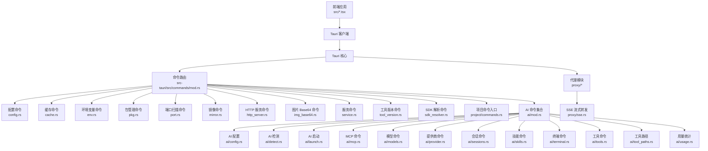

图表来源
- [src-tauri/src/commands/mod.rs](file://src-tauri/src/commands/mod.rs)
- [src-tauri/src/commands/config.rs](file://src-tauri/src/commands/config.rs)
- [src-tauri/src/commands/cache.rs](file://src-tauri/src/commands/cache.rs)
- [src-tauri/src/commands/env.rs](file://src-tauri/src/commands/env.rs)
- [src-tauri/src/commands/pkg.rs](file://src-tauri/src/commands/pkg.rs)
- [src-tauri/src/commands/port.rs](file://src-tauri/src/commands/port.rs)
- [src-tauri/src/commands/mirror.rs](file://src-tauri/src/commands/mirror.rs)
- [src-tauri/src/commands/http_server.rs](file://src-tauri/src/commands/http_server.rs)
- [src-tauri/src/commands/img_base64.rs](file://src-tauri/src/commands/img_base64.rs)
- [src-tauri/src/commands/service.rs](file://src-tauri/src/commands/service.rs)
- [src-tauri/src/commands/tool_version.rs](file://src-tauri/src/commands/tool_version.rs)
- [src-tauri/src/commands/sdk_resolver.rs](file://src-tauri/src/commands/sdk_resolver.rs)
- [src-tauri/src/commands/project/commands.rs](file://src-tauri/src/commands/project/commands.rs)
- [src-tauri/src/commands/ai/mod.rs](file://src-tauri/src/commands/ai/mod.rs)
- [src-tauri/src/commands/ai/config.rs](file://src-tauri/src/commands/ai/config.rs)
- [src-tauri/src/commands/ai/detect.rs](file://src-tauri/src/commands/ai/detect.rs)
- [src-tauri/src/commands/ai/launch.rs](file://src-tauri/src/commands/ai/launch.rs)
- [src-tauri/src/commands/ai/mcp.rs](file://src-tauri/src/commands/ai/mcp.rs)
- [src-tauri/src/commands/ai/models.rs](file://src-tauri/src/commands/ai/models.rs)
- [src-tauri/src/commands/ai/provider.rs](file://src-tauri/src/commands/ai/provider.rs)
- [src-tauri/src/commands/ai/sessions.rs](file://src-tauri/src/commands/ai/sessions.rs)
- [src-tauri/src/commands/ai/skills.rs](file://src-tauri/src/commands/ai/skills.rs)
- [src-tauri/src/commands/ai/terminal.rs](file://src-tauri/src/commands/ai/terminal.rs)
- [src-tauri/src/commands/ai/tools.rs](file://src-tauri/src/commands/ai/tools.rs)
- [src-tauri/src/commands/ai/tool_paths.rs](file://src-tauri/src/commands/ai/tool_paths.rs)
- [src-tauri/src/commands/ai/usage.rs](file://src-tauri/src/commands/ai/usage.rs)
- [src-tauri/src/proxy/sse.rs](file://src-tauri/src/proxy/sse.rs)

章节来源
- [src-tauri/src/main.rs](file://src-tauri/src/main.rs)
- [src-tauri/src/lib.rs](file://src-tauri/src/lib.rs)
- [src-tauri/Cargo.toml](file://src-tauri/Cargo.toml)
- [src-tauri/tauri.conf.json](file://src-tauri/tauri.conf.json)

## 核心组件
- 命令注册中心：集中挂载所有命令处理器，统一暴露给前端。
- 配置与状态：持久化配置、运行时状态、缓存与镜像源管理。
- 环境与服务：环境变量读取、本地 HTTP 服务启停、端口扫描。
- 包与版本：包管理器操作、工具版本管理与 SDK 解析。
- AI 子系统：模型、提供商、会话、技能、工具、MCP、终端与用量统计。
- 代理与 SSE：对外部请求进行代理、转换与流式转发。

章节来源
- [src-tauri/src/commands/mod.rs](file://src-tauri/src/commands/mod.rs)
- [src-tauri/src/commands/config.rs](file://src-tauri/src/commands/config.rs)
- [src-tauri/src/commands/cache.rs](file://src-tauri/src/commands/cache.rs)
- [src-tauri/src/commands/env.rs](file://src-tauri/src/commands/env.rs)
- [src-tauri/src/commands/pkg.rs](file://src-tauri/src/commands/pkg.rs)
- [src-tauri/src/commands/port.rs](file://src-tauri/src/commands/port.rs)
- [src-tauri/src/commands/mirror.rs](file://src-tauri/src/commands/mirror.rs)
- [src-tauri/src/commands/http_server.rs](file://src-tauri/src/commands/http_server.rs)
- [src-tauri/src/commands/img_base64.rs](file://src-tauri/src/commands/img_base64.rs)
- [src-tauri/src/commands/service.rs](file://src-tauri/src/commands/service.rs)
- [src-tauri/src/commands/tool_version.rs](file://src-tauri/src/commands/tool_version.rs)
- [src-tauri/src/commands/sdk_resolver.rs](file://src-tauri/src/commands/sdk_resolver.rs)
- [src-tauri/src/commands/project/commands.rs](file://src-tauri/src/commands/project/commands.rs)
- [src-tauri/src/commands/ai/mod.rs](file://src-tauri/src/commands/ai/mod.rs)
- [src-tauri/src/proxy/mod.rs](file://src-tauri/src/proxy/mod.rs)

## 架构总览
下图展示了从前端到后端命令、再到代理与外部资源的整体交互流程。

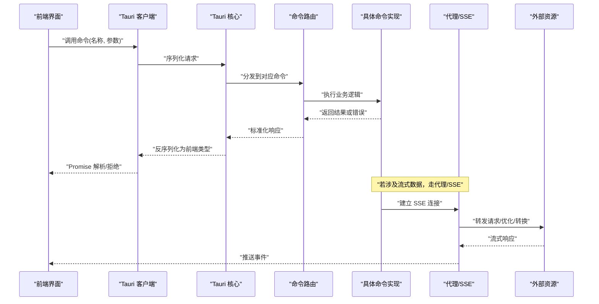

图表来源
- [src-tauri/src/commands/mod.rs](file://src-tauri/src/commands/mod.rs)
- [src-tauri/src/proxy/sse.rs](file://src-tauri/src/proxy/sse.rs)
- [src-tauri/src/proxy/server.rs](file://src-tauri/src/proxy/server.rs)

## 详细组件分析

### 命令注册与路由
- 命令入口集中在命令模块中，负责将各领域的命令处理器注册到 Tauri 应用上下文。
- 典型职责包括：
  - 聚合子模块命令（如 project、ai）。
  - 注入共享状态（配置、缓存、代理等）。
  - 统一错误包装与日志记录。

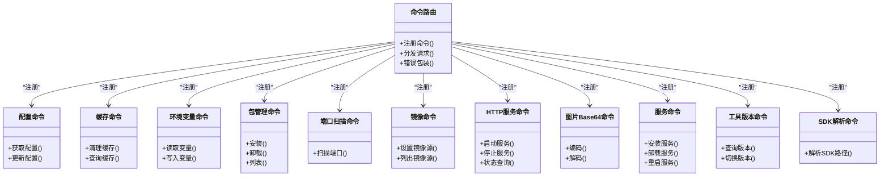

图表来源
- [src-tauri/src/commands/mod.rs](file://src-tauri/src/commands/mod.rs)
- [src-tauri/src/commands/config.rs](file://src-tauri/src/commands/config.rs)
- [src-tauri/src/commands/cache.rs](file://src-tauri/src/commands/cache.rs)
- [src-tauri/src/commands/env.rs](file://src-tauri/src/commands/env.rs)
- [src-tauri/src/commands/pkg.rs](file://src-tauri/src/commands/pkg.rs)
- [src-tauri/src/commands/port.rs](file://src-tauri/src/commands/port.rs)
- [src-tauri/src/commands/mirror.rs](file://src-tauri/src/commands/mirror.rs)
- [src-tauri/src/commands/http_server.rs](file://src-tauri/src/commands/http_server.rs)
- [src-tauri/src/commands/img_base64.rs](file://src-tauri/src/commands/img_base64.rs)
- [src-tauri/src/commands/service.rs](file://src-tauri/src/commands/service.rs)
- [src-tauri/src/commands/tool_version.rs](file://src-tauri/src/commands/tool_version.rs)
- [src-tauri/src/commands/sdk_resolver.rs](file://src-tauri/src/commands/sdk_resolver.rs)

章节来源
- [src-tauri/src/commands/mod.rs](file://src-tauri/src/commands/mod.rs)

### 配置与缓存
- 配置命令提供配置的读取与更新，通常基于 JSON 文件或内存态配置对象。
- 缓存命令用于清理与查询应用缓存，支持按命名空间或标签过滤。

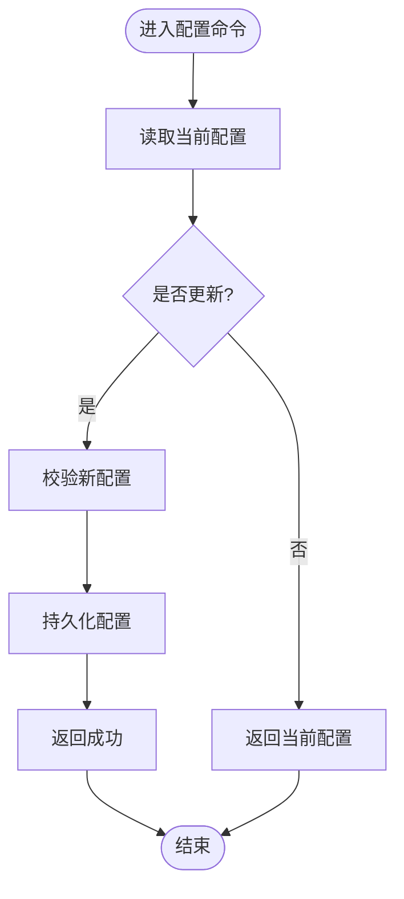

图表来源
- [src-tauri/src/commands/config.rs](file://src-tauri/src/commands/config.rs)

章节来源
- [src-tauri/src/commands/config.rs](file://src-tauri/src/commands/config.rs)
- [src-tauri/src/commands/cache.rs](file://src-tauri/src/commands/cache.rs)

### 环境变量与包管理
- 环境变量命令负责读取和写入系统或用户级环境变量，注意跨平台差异与权限要求。
- 包管理命令封装常见包管理器操作（安装、卸载、列表），内部根据目标语言/框架选择对应执行器。

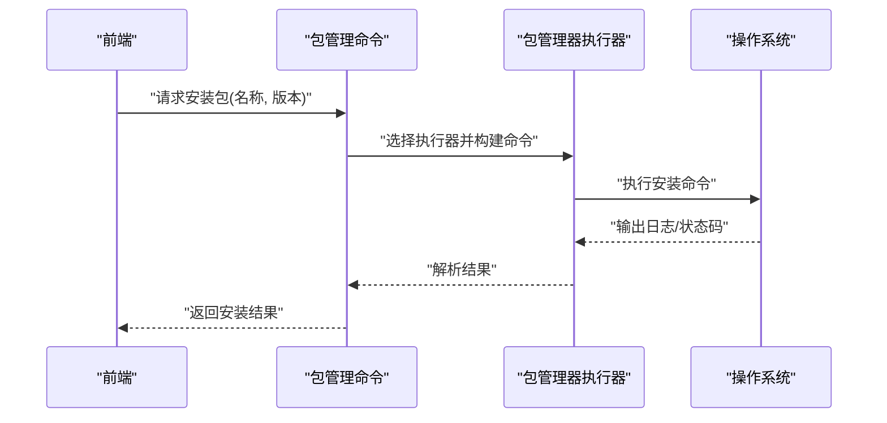

图表来源
- [src-tauri/src/commands/pkg.rs](file://src-tauri/src/commands/pkg.rs)

章节来源
- [src-tauri/src/commands/env.rs](file://src-tauri/src/commands/env.rs)
- [src-tauri/src/commands/pkg.rs](file://src-tauri/src/commands/pkg.rs)

### 端口扫描与镜像源
- 端口扫描命令对指定范围端口进行连通性探测，返回可用端口列表。
- 镜像命令用于设置与查询镜像源，影响后续包下载与资源拉取行为。

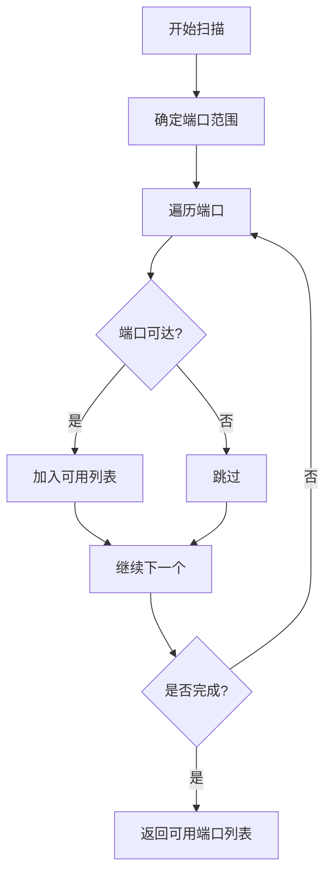

图表来源
- [src-tauri/src/commands/port.rs](file://src-tauri/src/commands/port.rs)

章节来源
- [src-tauri/src/commands/port.rs](file://src-tauri/src/commands/port.rs)
- [src-tauri/src/commands/mirror.rs](file://src-tauri/src/commands/mirror.rs)

### HTTP 服务与图片处理
- HTTP 服务命令提供本地服务的启动、停止与状态查询，常用于开发期静态资源托管或临时 API 网关。
- 图片 Base64 命令支持图片文件的编码与解码，便于前端直接渲染或传输。

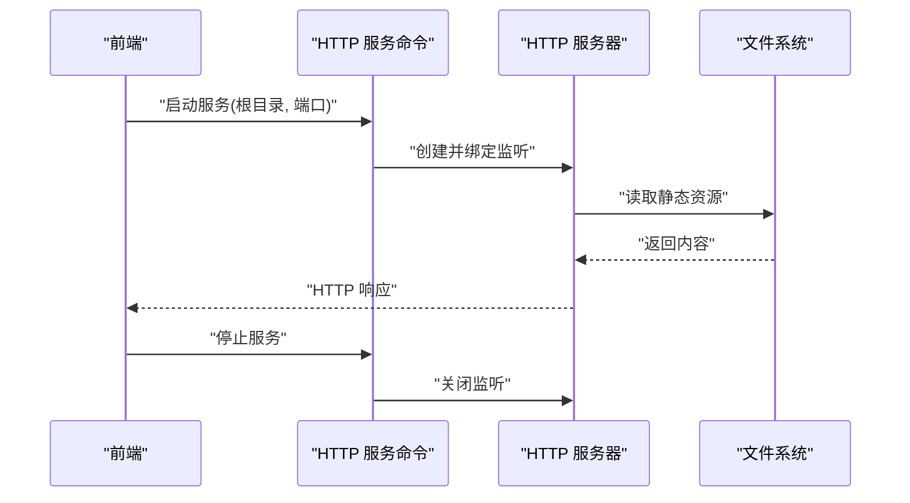

图表来源
- [src-tauri/src/commands/http_server.rs](file://src-tauri/src/commands/http_server.rs)
- [src-tauri/src/commands/img_base64.rs](file://src-tauri/src/commands/img_base64.rs)

章节来源
- [src-tauri/src/commands/http_server.rs](file://src-tauri/src/commands/http_server.rs)
- [src-tauri/src/commands/img_base64.rs](file://src-tauri/src/commands/img_base64.rs)

### 服务管理与工具版本
- 服务命令用于安装、卸载与重启系统服务，需具备相应权限。
- 工具版本命令提供工具链的版本查询与切换，配合 SDK 解析命令定位实际运行路径。

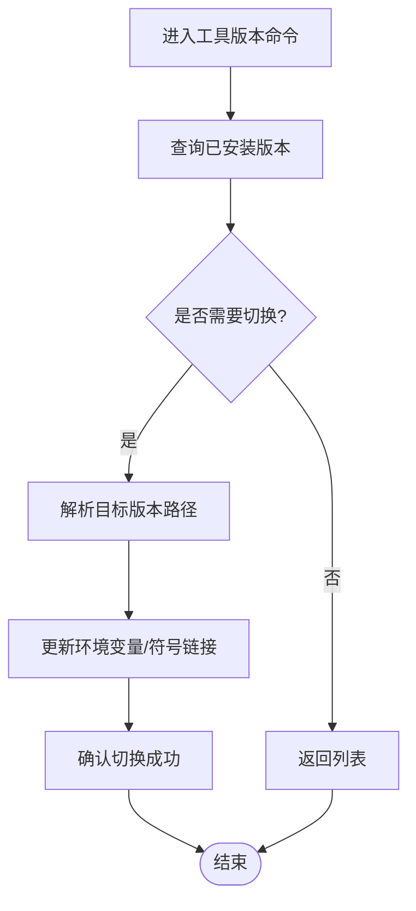

图表来源
- [src-tauri/src/commands/tool_version.rs](file://src-tauri/src/commands/tool_version.rs)
- [src-tauri/src/commands/sdk_resolver.rs](file://src-tauri/src/commands/sdk_resolver.rs)

章节来源
- [src-tauri/src/commands/service.rs](file://src-tauri/src/commands/service.rs)
- [src-tauri/src/commands/tool_version.rs](file://src-tauri/src/commands/tool_version.rs)
- [src-tauri/src/commands/sdk_resolver.rs](file://src-tauri/src/commands/sdk_resolver.rs)

### 项目管理命令
- 项目命令入口聚合了项目扫描、注册表、版本管理等子功能。
- 扫描器负责发现项目结构与依赖；注册表维护项目元数据；版本管理协调多版本共存。

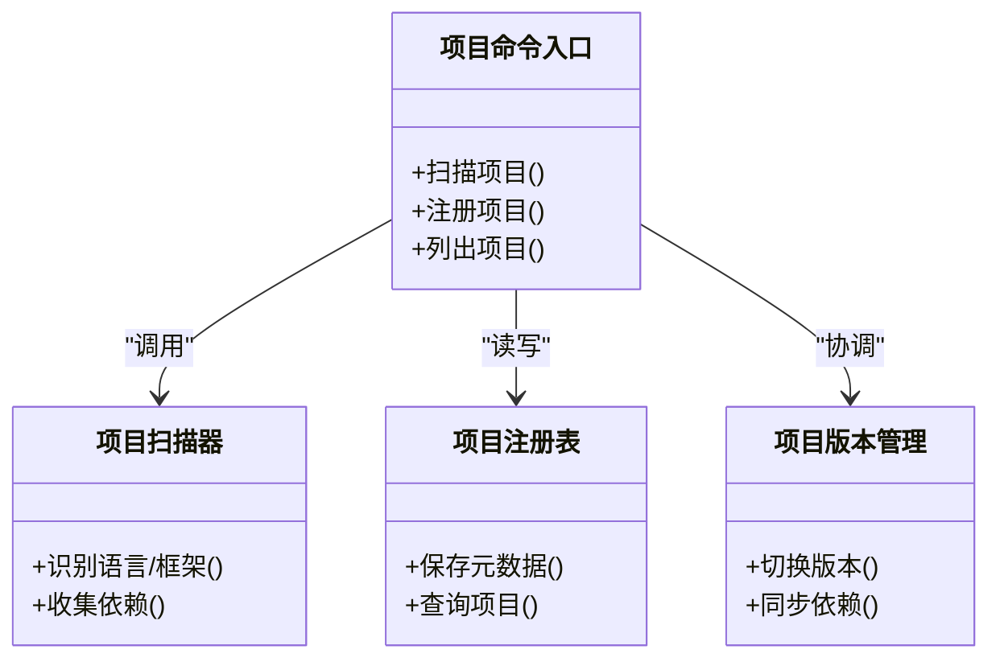

图表来源
- [src-tauri/src/commands/project/commands.rs](file://src-tauri/src/commands/project/commands.rs)
- [src-tauri/src/commands/project/scanner.rs](file://src-tauri/src/commands/project/scanner.rs)
- [src-tauri/src/commands/project/registry.rs](file://src-tauri/src/commands/project/registry.rs)
- [src-tauri/src/commands/project/versions.rs](file://src-tauri/src/commands/project/versions.rs)

章节来源
- [src-tauri/src/commands/project/mod.rs](file://src-tauri/src/commands/project/mod.rs)
- [src-tauri/src/commands/project/commands.rs](file://src-tauri/src/commands/project/commands.rs)
- [src-tauri/src/commands/project/types.rs](file://src-tauri/src/commands/project/types.rs)
- [src-tauri/src/commands/project/registry.rs](file://src-tauri/src/commands/project/registry.rs)
- [src-tauri/src/commands/project/scanner.rs](file://src-tauri/src/commands/project/scanner.rs)
- [src-tauri/src/commands/project/versions.rs](file://src-tauri/src/commands/project/versions.rs)

### AI 子系统命令
AI 子系统涵盖模型、提供商、会话、技能、工具、MCP、终端与用量统计等命令，形成完整的 AI 工作流支撑。

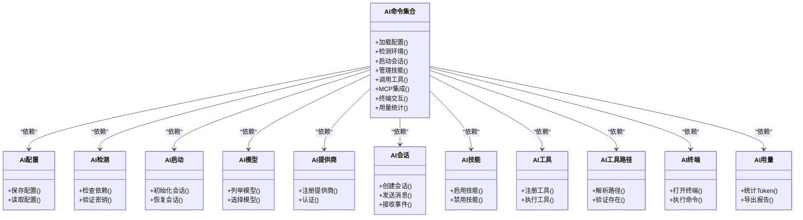

图表来源
- [src-tauri/src/commands/ai/mod.rs](file://src-tauri/src/commands/ai/mod.rs)
- [src-tauri/src/commands/ai/config.rs](file://src-tauri/src/commands/ai/config.rs)
- [src-tauri/src/commands/ai/detect.rs](file://src-tauri/src/commands/ai/detect.rs)
- [src-tauri/src/commands/ai/launch.rs](file://src-tauri/src/commands/ai/launch.rs)
- [src-tauri/src/commands/ai/models.rs](file://src-tauri/src/commands/ai/models.rs)
- [src-tauri/src/commands/ai/provider.rs](file://src-tauri/src/commands/ai/provider.rs)
- [src-tauri/src/commands/ai/sessions.rs](file://src-tauri/src/commands/ai/sessions.rs)
- [src-tauri/src/commands/ai/skills.rs](file://src-tauri/src/commands/ai/skills.rs)
- [src-tauri/src/commands/ai/tools.rs](file://src-tauri/src/commands/ai/tools.rs)
- [src-tauri/src/commands/ai/tool_paths.rs](file://src-tauri/src/commands/ai/tool_paths.rs)
- [src-tauri/src/commands/ai/terminal.rs](file://src-tauri/src/commands/ai/terminal.rs)
- [src-tauri/src/commands/ai/usage.rs](file://src-tauri/src/commands/ai/usage.rs)

章节来源
- [src-tauri/src/commands/ai/mod.rs](file://src-tauri/src/commands/ai/mod.rs)
- [src-tauri/src/commands/ai/config.rs](file://src-tauri/src/commands/ai/config.rs)
- [src-tauri/src/commands/ai/detect.rs](file://src-tauri/src/commands/ai/detect.rs)
- [src-tauri/src/commands/ai/launch.rs](file://src-tauri/src/commands/ai/launch.rs)
- [src-tauri/src/commands/ai/mcp.rs](file://src-tauri/src/commands/ai/mcp.rs)
- [src-tauri/src/commands/ai/models.rs](file://src-tauri/src/commands/ai/models.rs)
- [src-tauri/src/commands/ai/provider.rs](file://src-tauri/src/commands/ai/provider.rs)
- [src-tauri/src/commands/ai/sessions.rs](file://src-tauri/src/commands/ai/sessions.rs)
- [src-tauri/src/commands/ai/skills.rs](file://src-tauri/src/commands/ai/skills.rs)
- [src-tauri/src/commands/ai/terminal.rs](file://src-tauri/src/commands/ai/terminal.rs)
- [src-tauri/src/commands/ai/tools.rs](file://src-tauri/src/commands/ai/tools.rs)
- [src-tauri/src/commands/ai/tool_paths.rs](file://src-tauri/src/commands/ai/tool_paths.rs)
- [src-tauri/src/commands/ai/usage.rs](file://src-tauri/src/commands/ai/usage.rs)

### 代理与 SSE 流式转发
代理模块负责对外部请求进行转发、转换与优化，并通过 SSE 向前端推送实时事件。

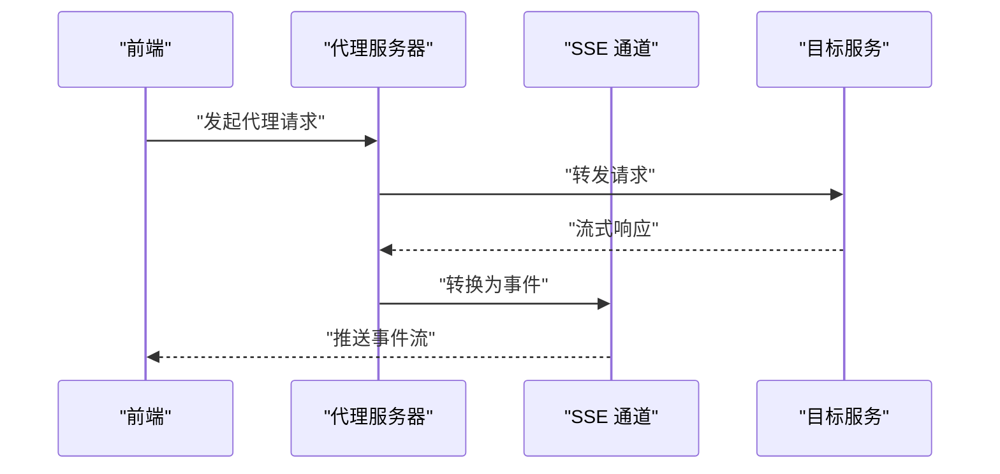

图表来源
- [src-tauri/src/proxy/server.rs](file://src-tauri/src/proxy/server.rs)
- [src-tauri/src/proxy/sse.rs](file://src-tauri/src/proxy/sse.rs)
- [src-tauri/src/proxy/transform.rs](file://src-tauri/src/proxy/transform.rs)
- [src-tauri/src/proxy/optimizers.rs](file://src-tauri/src/proxy/optimizers.rs)

章节来源
- [src-tauri/src/proxy/mod.rs](file://src-tauri/src/proxy/mod.rs)
- [src-tauri/src/proxy/server.rs](file://src-tauri/src/proxy/server.rs)
- [src-tauri/src/proxy/sse.rs](file://src-tauri/src/proxy/sse.rs)
- [src-tauri/src/proxy/types.rs](file://src-tauri/src/proxy/types.rs)
- [src-tauri/src/proxy/google.rs](file://src-tauri/src/proxy/google.rs)
- [src-tauri/src/proxy/transform.rs](file://src-tauri/src/proxy/transform.rs)
- [src-tauri/src/proxy/optimizers.rs](file://src-tauri/src/proxy/optimizers.rs)

## 依赖分析
- 命令模块之间保持低耦合，通过命令路由统一装配。
- AI 子系统与代理模块相对独立，可通过配置开关启用。
- 外部依赖（包管理器、HTTP 服务、系统服务）通过命令抽象隔离，便于测试与替换。

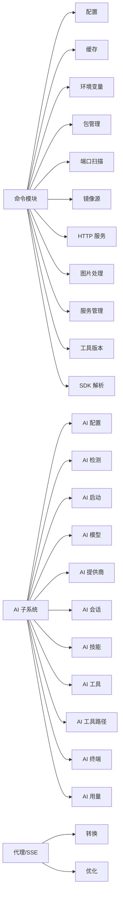

图表来源
- [src-tauri/src/commands/mod.rs](file://src-tauri/src/commands/mod.rs)
- [src-tauri/src/commands/ai/mod.rs](file://src-tauri/src/commands/ai/mod.rs)
- [src-tauri/src/proxy/mod.rs](file://src-tauri/src/proxy/mod.rs)

章节来源
- [src-tauri/src/commands/mod.rs](file://src-tauri/src/commands/mod.rs)
- [src-tauri/src/commands/ai/mod.rs](file://src-tauri/src/commands/ai/mod.rs)
- [src-tauri/src/proxy/mod.rs](file://src-tauri/src/proxy/mod.rs)

## 性能考虑
- 批量操作：对于大量文件/包的扫描与处理，建议分批执行并返回进度事件。
- 并发控制：端口扫描与网络请求应限制并发度，避免阻塞主线程。
- 缓存策略：对频繁读的配置与检测结果进行缓存，减少重复计算。
- 流式传输：长耗时任务优先采用 SSE 推送，提升用户体验。
- I/O 优化：大文件处理尽量使用流式读写，避免一次性载入内存。

[本节为通用指导，不直接分析具体文件]

## 故障排查指南
- 命令未找到：检查命令注册是否生效，确认命令名称与路由一致。
- 权限不足：涉及系统服务与环境变量修改时，确保以管理员权限运行。
- 端口占用：启动 HTTP 服务前进行端口可用性检查，必要时自动重试或提示更换端口。
- 镜像源不可达：校验镜像地址与网络连通性，提供回退默认源。
- AI 配置错误：检查密钥与模型选择是否正确，提供诊断信息输出。
- SSE 断连：监控连接状态，实现重连与心跳机制。

章节来源
- [src-tauri/src/commands/http_server.rs](file://src-tauri/src/commands/http_server.rs)
- [src-tauri/src/commands/mirror.rs](file://src-tauri/src/commands/mirror.rs)
- [src-tauri/src/commands/ai/config.rs](file://src-tauri/src/commands/ai/config.rs)
- [src-tauri/src/proxy/sse.rs](file://src-tauri/src/proxy/sse.rs)

## 结论
Any-Version 的 Tauri 命令 API 通过模块化设计与清晰的职责边界，提供了丰富的系统能力与 AI 工作流支撑。借助统一的命令注册、错误包装与 SSE 流式转发，前后端交互稳定高效。遵循本文的最佳实践与排障建议，可进一步提升应用的可靠性与可维护性。

[本节为总结性内容，不直接分析具体文件]

## 附录

### 安全与权限控制
- 能力清单：通过能力配置文件声明前端可访问的命令与资源，最小权限原则。
- 白名单机制：仅允许受信任的前端域名或协议触发敏感命令。
- 输入校验：对所有入参进行严格校验，防止注入与越权。
- 审计日志：关键操作记录审计日志，便于追踪与回溯。

章节来源
- [src-tauri/capabilities/default.json](file://src-tauri/capabilities/default.json)
- [src-tauri/tauri.conf.json](file://src-tauri/tauri.conf.json)

### 调试方法
- 启用详细日志：在开发模式下开启命令执行日志与堆栈信息。
- 前端控制台：捕获 Promise 拒绝与事件流异常，打印完整上下文。
- 代理调试：记录请求/响应头与体，辅助定位网络问题。
- 单元测试：对命令实现编写单测，覆盖正常与异常分支。

章节来源
- [src-tauri/src/commands/utils.rs](file://src-tauri/src/commands/utils.rs)
- [src-tauri/src/proxy/server.rs](file://src-tauri/src/proxy/server.rs)

### 请求/响应示例（概念性）
- 配置读取：前端调用配置命令，后端返回当前配置对象。
- 包安装：前端传入包名与版本，后端返回安装结果与日志摘要。
- 端口扫描：前端传入端口范围，后端返回可用端口列表。
- AI 会话：前端创建会话并发送消息，后端通过 SSE 推送增量响应。

[本节为概念性示例，不直接分析具体文件]