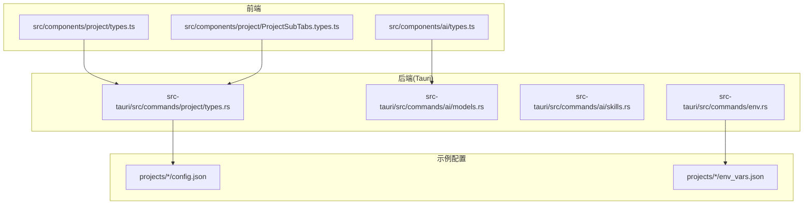
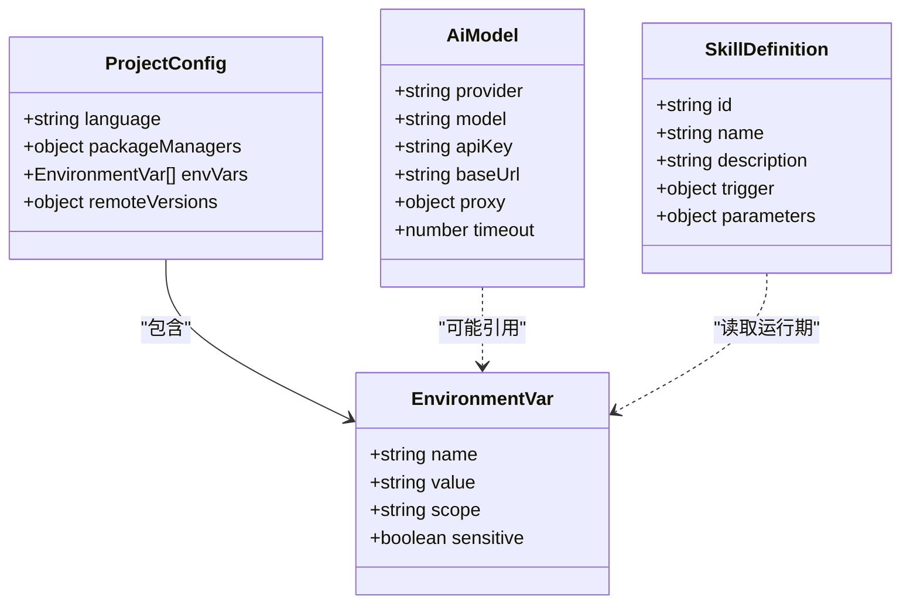
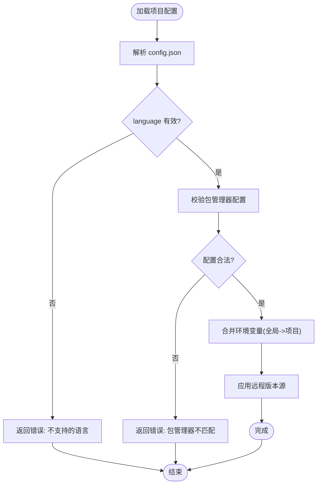
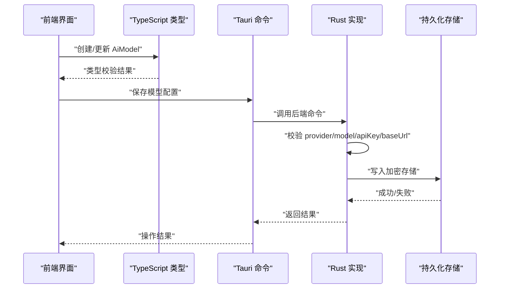
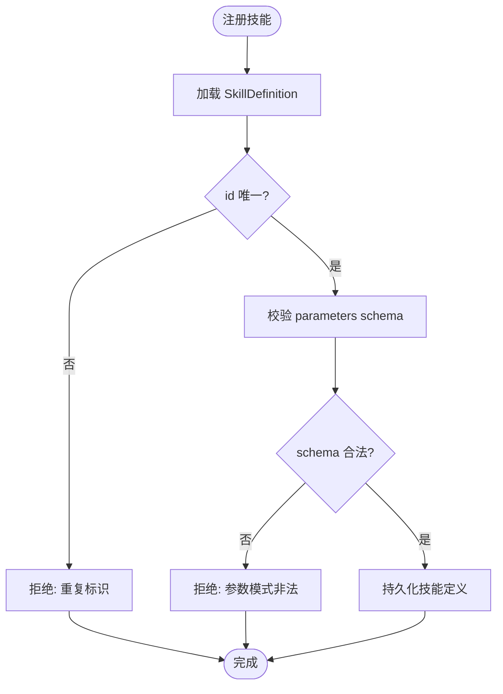
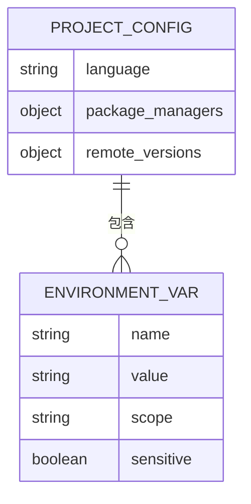
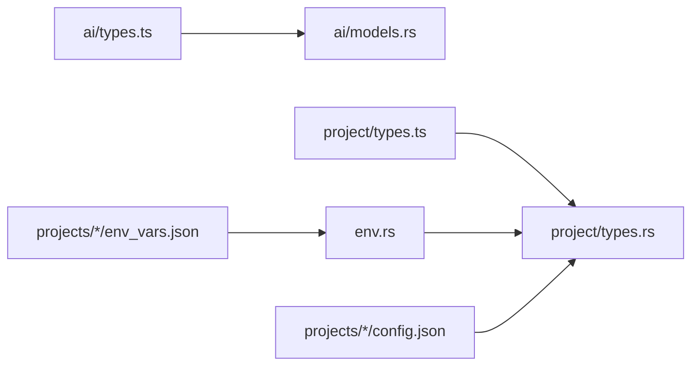

# 数据模型

<cite>
**本文引用的文件**   
- [src/components/ai/types.ts](file://src/components/ai/types.ts)
- [src/components/project/types.ts](file://src/components/project/types.ts)
- [src/components/project/ProjectSubTabs.types.ts](file://src/components/project/ProjectSubTabs.types.ts)
- [src-tauri/src/commands/project/types.rs](file://src-tauri/src/commands/project/types.rs)
- [src-tauri/src/commands/ai/models.rs](file://src-tauri/src/commands/ai/models.rs)
- [src-tauri/src/commands/ai/skills.rs](file://src-tauri/src/commands/ai/skills.rs)
- [src-tauri/src/commands/env.rs](file://src-tauri/src/commands/env.rs)
- [projects/nodejs/config.json](file://projects/nodejs/config.json)
- [projects/python/config.json](file://projects/python/config.json)
- [projects/go/config.json](file://projects/go/config.json)
- [projects/deno/env_vars.json](file://projects/deno/env_vars.json)
- [projects/rust/env_vars.json](file://projects/rust/env_vars.json)
- [docs/projects-json-schema.md](file://docs/projects-json-schema.md)
</cite>

## 目录
1. [简介](#简介)
2. [项目结构](#项目结构)
3. [核心组件](#核心组件)
4. [架构总览](#架构总览)
5. [详细组件分析](#详细组件分析)
6. [依赖关系分析](#依赖关系分析)
7. [性能考虑](#性能考虑)
8. [故障排查指南](#故障排查指南)
9. [结论](#结论)
10. [附录](#附录)

## 简介
本文件为 Any-Version 的核心数据模型参考文档，聚焦于以下关键类型与数据结构：
- ProjectConfig：项目配置模型（语言、工具链、包管理器、环境变量等）
- AiModel：AI 模型配置（提供商、模型标识、鉴权、代理等）
- SkillDefinition：技能定义（能力描述、触发方式、参数约束等）
- EnvironmentVar：环境变量（名称、值、作用域、是否敏感等）

文档目标：
- 明确字段含义、数据类型、必填项与默认值
- 说明数据验证规则、业务约束与数据关系
- 提供 JSON Schema 定义与 TypeScript 接口声明的参考
- 给出数据迁移策略与版本兼容性建议
- 总结序列化/反序列化的最佳实践

## 项目结构
Any-Version 的数据模型横跨前端 TypeScript 与后端 Rust 两个层面：
- 前端类型定义位于 src/components 下，面向 UI 与交互逻辑
- 后端命令与持久化类型位于 src-tauri/src/commands 下，面向 Tauri 命令与存储
- 示例项目配置位于 projects 目录下，用于演示与校验

图表来源
- [src/components/ai/types.ts](file://src/components/ai/types.ts)
- [src/components/project/types.ts](file://src/components/project/types.ts)
- [src/components/project/ProjectSubTabs.types.ts](file://src/components/project/ProjectSubTabs.types.ts)
- [src-tauri/src/commands/project/types.rs](file://src-tauri/src/commands/project/types.rs)
- [src-tauri/src/commands/ai/models.rs](file://src-tauri/src/commands/ai/models.rs)
- [src-tauri/src/commands/ai/skills.rs](file://src-tauri/src/commands/ai/skills.rs)
- [src-tauri/src/commands/env.rs](file://src-tauri/src/commands/env.rs)
- [projects/nodejs/config.json](file://projects/nodejs/config.json)
- [projects/python/config.json](file://projects/python/config.json)
- [projects/go/config.json](file://projects/go/config.json)
- [projects/deno/env_vars.json](file://projects/deno/env_vars.json)
- [projects/rust/env_vars.json](file://projects/rust/env_vars.json)

章节来源
- [src/components/ai/types.ts](file://src/components/ai/types.ts)
- [src/components/project/types.ts](file://src/components/project/types.ts)
- [src/components/project/ProjectSubTabs.types.ts](file://src/components/project/ProjectSubTabs.types.ts)
- [src-tauri/src/commands/project/types.rs](file://src-tauri/src/commands/project/types.rs)
- [src-tauri/src/commands/ai/models.rs](file://src-tauri/src/commands/ai/models.rs)
- [src-tauri/src/commands/ai/skills.rs](file://src-tauri/src/commands/ai/skills.rs)
- [src-tauri/src/commands/env.rs](file://src-tauri/src/commands/env.rs)
- [projects/nodejs/config.json](file://projects/nodejs/config.json)
- [projects/python/config.json](file://projects/python/config.json)
- [projects/go/config.json](file://projects/go/config.json)
- [projects/deno/env_vars.json](file://projects/deno/env_vars.json)
- [projects/rust/env_vars.json](file://projects/rust/env_vars.json)

## 核心组件
本节概述四大核心数据模型及其职责边界。

- ProjectConfig
  - 职责：描述一个项目的技术栈、工具链、包管理器、环境变量、远程版本源等
  - 典型字段：语言标识、工具版本策略、包管理器配置、环境变量集合、远程版本配置等
  - 约束：至少包含语言标识；包管理器需与语言匹配；环境变量名需合法且不冲突
  - 默认值：未显式指定的可选字段采用系统或运行时默认

- AiModel
  - 职责：描述 AI 模型的提供方、模型标识、鉴权信息、代理与超时等
  - 典型字段：提供商、模型名、API Key、Base URL、代理设置、超时、重试策略等
  - 约束：提供商与模型组合需有效；鉴权信息按提供商要求提供；URL 格式正确
  - 默认值：未指定时采用提供商默认端点与安全策略

- SkillDefinition
  - 职责：描述一项可被 Agent 调用的“技能”，包括触发条件、参数模式、执行上下文等
  - 典型字段：技能标识、名称、描述、触发方式、参数 schema、权限范围等
  - 约束：标识唯一；参数 schema 需通过校验；触发方式与实现一致
  - 默认值：未指定时采用通用行为

- EnvironmentVar
  - 职责：描述单个环境变量的元信息与值
  - 典型字段：名称、值、作用域（全局/项目）、是否敏感、注释等
  - 约束：名称符合平台规范；敏感变量不得明文落盘；作用域内不重复
  - 默认值：未指定时继承父级作用域或系统默认

章节来源
- [src/components/project/types.ts](file://src/components/project/types.ts)
- [src-tauri/src/commands/project/types.rs](file://src-tauri/src/commands/project/types.rs)
- [src-tauri/src/commands/ai/models.rs](file://src-tauri/src/commands/ai/models.rs)
- [src-tauri/src/commands/ai/skills.rs](file://src-tauri/src/commands/ai/skills.rs)
- [src-tauri/src/commands/env.rs](file://src-tauri/src/commands/env.rs)

## 架构总览
下图展示数据模型在前后端的映射关系与流转路径。

图表来源
- [src/components/project/types.ts](file://src/components/project/types.ts)
- [src-tauri/src/commands/project/types.rs](file://src-tauri/src/commands/project/types.rs)
- [src-tauri/src/commands/ai/models.rs](file://src-tauri/src/commands/ai/models.rs)
- [src-tauri/src/commands/ai/skills.rs](file://src-tauri/src/commands/ai/skills.rs)
- [src-tauri/src/commands/env.rs](file://src-tauri/src/commands/env.rs)

## 详细组件分析

### ProjectConfig 详解
- 字段语义
  - language：项目主语言标识（如 nodejs、python、go、rust 等）
  - packageManagers：各语言的包管理器配置（npm/pip/cargo 等）
  - envVars：项目级环境变量集合
  - remoteVersions：远程版本源与镜像配置
- 数据类型与必填性
  - language：字符串，必填
  - packageManagers：对象，按需存在，键名为包管理器名
  - envVars：数组，可选，元素为 EnvironmentVar
  - remoteVersions：对象，可选
- 默认值
  - 未指定字段采用运行时或系统默认
- 验证规则与业务约束
  - language 需在支持列表中
  - packageManagers 的键必须与 language 兼容
  - envVars.name 需满足命名规范且作用域内唯一
- 数据关系
  - 与 EnvironmentVar 一对多
  - 与远程版本源配置关联，影响工具链解析

图表来源
- [projects/nodejs/config.json](file://projects/nodejs/config.json)
- [projects/python/config.json](file://projects/python/config.json)
- [projects/go/config.json](file://projects/go/config.json)
- [src-tauri/src/commands/project/types.rs](file://src-tauri/src/commands/project/types.rs)

章节来源
- [src/components/project/types.ts](file://src/components/project/types.ts)
- [src-tauri/src/commands/project/types.rs](file://src-tauri/src/commands/project/types.rs)
- [projects/nodejs/config.json](file://projects/nodejs/config.json)
- [projects/python/config.json](file://projects/python/config.json)
- [projects/go/config.json](file://projects/go/config.json)

### AiModel 详解
- 字段语义
  - provider：AI 服务提供商标识
  - model：模型名称或标识
  - apiKey：鉴权凭据（敏感）
  - baseUrl：服务端点地址
  - proxy：代理配置（可选）
  - timeout：请求超时（毫秒）
- 数据类型与必填性
  - provider、model、apiKey、baseUrl：字符串，必填
  - proxy：对象，可选
  - timeout：数字，可选
- 默认值
  - baseUrl 未指定时使用提供商默认
  - timeout 未指定使用系统默认
- 验证规则与业务约束
  - provider 与 model 的组合需受支持
  - baseUrl 需为合法 URL
  - apiKey 不得为空且长度满足提供商要求
- 数据关系
  - 可能与 EnvironmentVar 中的密钥相关（例如动态注入）

图表来源
- [src/components/ai/types.ts](file://src/components/ai/types.ts)
- [src-tauri/src/commands/ai/models.rs](file://src-tauri/src/commands/ai/models.rs)

章节来源
- [src/components/ai/types.ts](file://src/components/ai/types.ts)
- [src-tauri/src/commands/ai/models.rs](file://src-tauri/src/commands/ai/models.rs)

### SkillDefinition 详解
- 字段语义
  - id：技能唯一标识
  - name：显示名称
  - description：功能描述
  - trigger：触发方式（如命令、事件、协议）
  - parameters：参数模式（JSON Schema 风格）
- 数据类型与必填性
  - id、name、description、trigger、parameters：必填
- 默认值
  - 未指定字段采用通用默认行为
- 验证规则与业务约束
  - id 全局唯一
  - parameters 需通过 schema 校验器
  - trigger 与实现保持一致
- 数据关系
  - 可能在运行期读取 EnvironmentVar 作为参数或上下文

图表来源
- [src-tauri/src/commands/ai/skills.rs](file://src-tauri/src/commands/ai/skills.rs)

章节来源
- [src-tauri/src/commands/ai/skills.rs](file://src-tauri/src/commands/ai/skills.rs)

### EnvironmentVar 详解
- 字段语义
  - name：环境变量名
  - value：变量值
  - scope：作用域（全局/项目）
  - sensitive：是否敏感（用于脱敏与加密）
- 数据类型与必填性
  - name、value、scope、sensitive：必填
- 默认值
  - scope 未指定时默认为项目级
- 验证规则与业务约束
  - name 符合平台命名规范
  - scope 内 name 唯一
  - sensitive=true 的值需加密存储
- 数据关系
  - 被 ProjectConfig 引用
  - 被 AiModel/SkillDefinition 在运行期读取

图表来源
- [src-tauri/src/commands/env.rs](file://src-tauri/src/commands/env.rs)
- [src-tauri/src/commands/project/types.rs](file://src-tauri/src/commands/project/types.rs)

章节来源
- [src-tauri/src/commands/env.rs](file://src-tauri/src/commands/env.rs)
- [src-tauri/src/commands/project/types.rs](file://src-tauri/src/commands/project/types.rs)

## 依赖关系分析
- 前端到后端的类型契约
  - TypeScript 类型与 Rust 结构体保持字段对齐，确保跨进程通信一致性
- 配置与示例
  - projects 下的 config.json 与 env_vars.json 作为最小可用样例，驱动类型校验与迁移测试
- 外部依赖
  - 网络与代理：AiModel.proxy 与 baseUrl 决定外部服务访问
  - 包管理器：ProjectConfig.packageManagers 决定工具链解析

图表来源
- [src/components/ai/types.ts](file://src/components/ai/types.ts)
- [src/components/project/types.ts](file://src/components/project/types.ts)
- [src-tauri/src/commands/ai/models.rs](file://src-tauri/src/commands/ai/models.rs)
- [src-tauri/src/commands/project/types.rs](file://src-tauri/src/commands/project/types.rs)
- [src-tauri/src/commands/env.rs](file://src-tauri/src/commands/env.rs)
- [projects/nodejs/config.json](file://projects/nodejs/config.json)
- [projects/python/config.json](file://projects/python/config.json)
- [projects/go/config.json](file://projects/go/config.json)
- [projects/deno/env_vars.json](file://projects/deno/env_vars.json)
- [projects/rust/env_vars.json](file://projects/rust/env_vars.json)

章节来源
- [src/components/ai/types.ts](file://src/components/ai/types.ts)
- [src/components/project/types.ts](file://src/components/project/types.ts)
- [src-tauri/src/commands/ai/models.rs](file://src-tauri/src/commands/ai/models.rs)
- [src-tauri/src/commands/project/types.rs](file://src-tauri/src/commands/project/types.rs)
- [src-tauri/src/commands/env.rs](file://src-tauri/src/commands/env.rs)
- [projects/nodejs/config.json](file://projects/nodejs/config.json)
- [projects/python/config.json](file://projects/python/config.json)
- [projects/go/config.json](file://projects/go/config.json)
- [projects/deno/env_vars.json](file://projects/deno/env_vars.json)
- [projects/rust/env_vars.json](file://projects/rust/env_vars.json)

## 性能考虑
- 大对象传输
  - 对大型配置（如 Skills 列表）进行分页或增量同步，避免一次性传输
- 缓存策略
  - 对远程版本源与模型清单做本地缓存，减少网络开销
- 序列化优化
  - 使用紧凑编码（如二进制或压缩 JSON）降低带宽占用
- 并发控制
  - 批量写入环境变量与模型配置时，使用事务或批处理接口

[本节为通用指导，无需特定文件来源]

## 故障排查指南
- 常见错误
  - 字段缺失或类型不匹配：检查 TypeScript/Rust 两端类型定义是否一致
  - 环境变量冲突：确认作用域内 name 唯一
  - 鉴权失败：核对 provider/model/apiKey/baseUrl 是否正确
  - 代理不可用：检查 proxy 配置与网络连通性
- 定位步骤
  - 查看 Tauri 命令日志，确认错误发生在前端校验还是后端校验
  - 对比示例配置，逐步缩小差异
  - 对敏感字段启用脱敏日志，避免泄露

章节来源
- [src-tauri/src/commands/ai/models.rs](file://src-tauri/src/commands/ai/models.rs)
- [src-tauri/src/commands/env.rs](file://src-tauri/src/commands/env.rs)
- [src-tauri/src/commands/project/types.rs](file://src-tauri/src/commands/project/types.rs)

## 结论
本项目围绕 ProjectConfig、AiModel、SkillDefinition、EnvironmentVar 四个核心数据模型构建，前后端通过严格的类型契约与校验规则保证数据一致性与安全性。建议在新增字段时遵循向后兼容原则，并提供迁移脚本与示例配置，以降低升级成本。

[本节为总结性内容，无需特定文件来源]

## 附录

### JSON Schema 参考（节选）
以下为基于仓库现有类型与示例配置的 JSON Schema 要点（以文字描述为主，便于对照实现）：
- ProjectConfig
  - 必需字段：language（字符串，枚举）
  - 可选字段：packageManagers（对象，键为包管理器名），envVars（数组，元素为 EnvironmentVar），remoteVersions（对象）
- AiModel
  - 必需字段：provider、model、apiKey、baseUrl（字符串）
  - 可选字段：proxy（对象），timeout（数字）
- SkillDefinition
  - 必需字段：id、name、description、trigger、parameters（对象）
- EnvironmentVar
  - 必需字段：name、value、scope、sensitive（布尔）

章节来源
- [docs/projects-json-schema.md](file://docs/projects-json-schema.md)
- [src/components/project/types.ts](file://src/components/project/types.ts)
- [src/components/ai/types.ts](file://src/components/ai/types.ts)
- [src-tauri/src/commands/project/types.rs](file://src-tauri/src/commands/project/types.rs)
- [src-tauri/src/commands/ai/models.rs](file://src-tauri/src/commands/ai/models.rs)
- [src-tauri/src/commands/ai/skills.rs](file://src-tauri/src/commands/ai/skills.rs)
- [src-tauri/src/commands/env.rs](file://src-tauri/src/commands/env.rs)

### TypeScript 接口声明（参考）
- ProjectConfig
  - 字段：language、packageManagers、envVars、remoteVersions
- AiModel
  - 字段：provider、model、apiKey、baseUrl、proxy、timeout
- SkillDefinition
  - 字段：id、name、description、trigger、parameters
- EnvironmentVar
  - 字段：name、value、scope、sensitive

章节来源
- [src/components/project/types.ts](file://src/components/project/types.ts)
- [src/components/ai/types.ts](file://src/components/ai/types.ts)

### 数据迁移策略与版本兼容性
- 向后兼容
  - 新增字段设为可选，并提供默认值
  - 废弃字段保留一段时间并输出警告
- 迁移脚本
  - 针对旧版 config.json 与 env_vars.json 提供转换脚本
  - 在启动时自动检测并提示用户执行迁移
- 校验与回滚
  - 迁移前生成快照，迁移失败可快速回滚
  - 迁移后执行端到端校验（类型、约束、示例运行）

章节来源
- [projects/nodejs/config.json](file://projects/nodejs/config.json)
- [projects/python/config.json](file://projects/python/config.json)
- [projects/go/config.json](file://projects/go/config.json)
- [projects/deno/env_vars.json](file://projects/deno/env_vars.json)
- [projects/rust/env_vars.json](file://projects/rust/env_vars.json)

### 序列化/反序列化最佳实践
- 统一编解码
  - 前后端使用一致的字段命名与类型映射
- 安全处理
  - 敏感字段（apiKey、sensitive=true 的环境变量）加密存储与脱敏输出
- 容错与健壮性
  - 反序列化时对未知字段忽略而非报错
  - 对缺失字段提供合理默认值
- 性能优化
  - 批量操作使用批处理接口
  - 大对象分块传输与增量更新

章节来源
- [src-tauri/src/commands/ai/models.rs](file://src-tauri/src/commands/ai/models.rs)
- [src-tauri/src/commands/env.rs](file://src-tauri/src/commands/env.rs)
- [src-tauri/src/commands/project/types.rs](file://src-tauri/src/commands/project/types.rs)