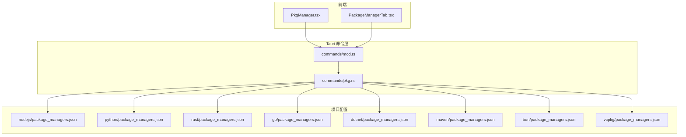
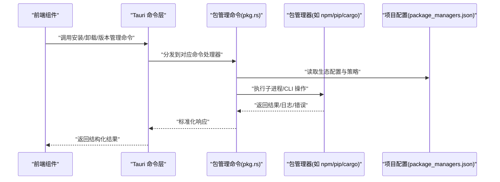
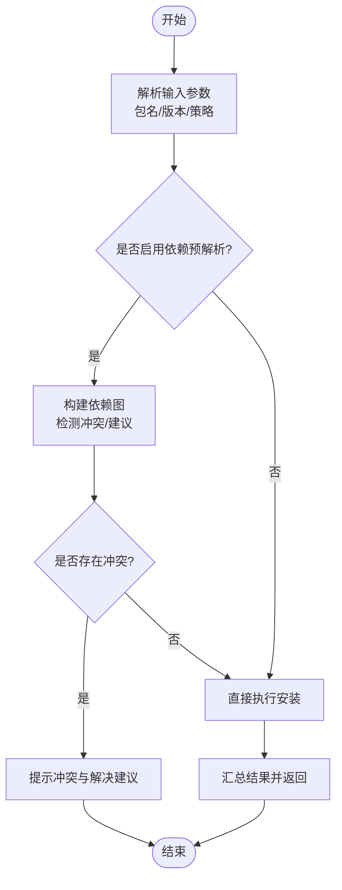
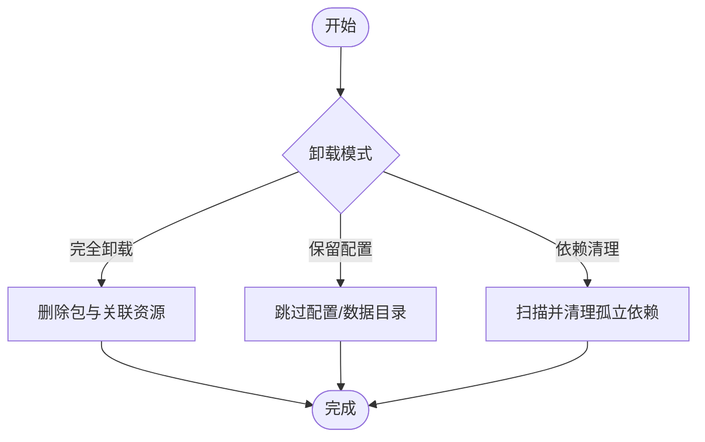
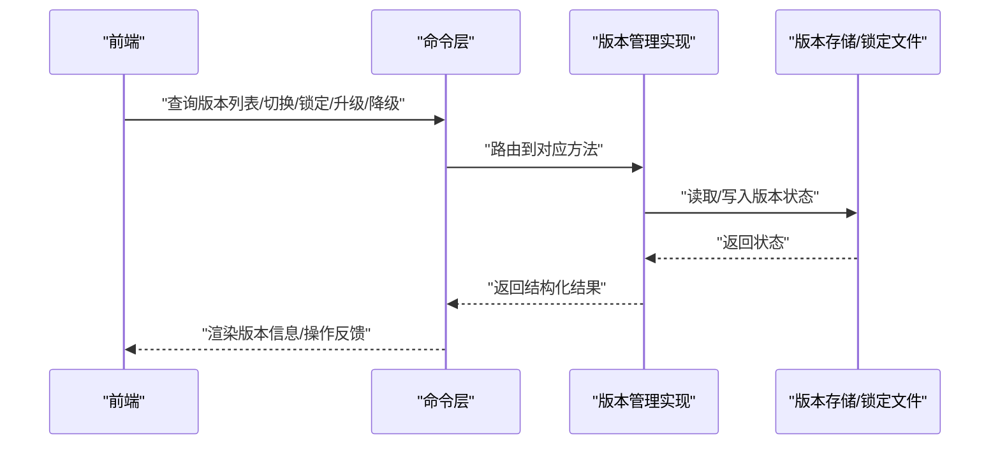
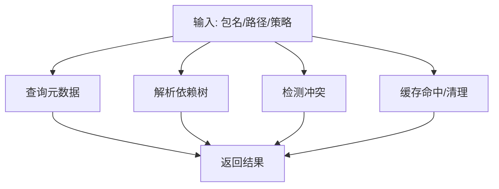
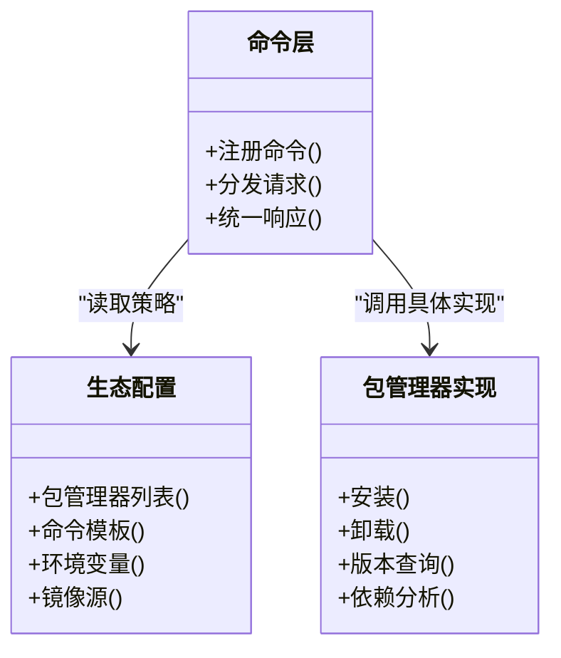
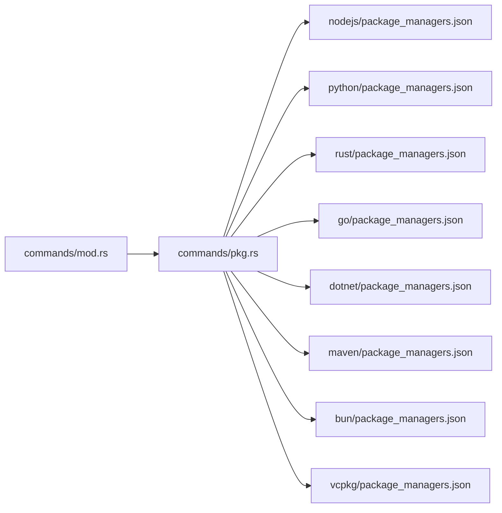

# 包管理器集成 API

<cite>
**本文引用的文件**   
- [src-tauri/src/commands/pkg.rs](file://src-tauri/src/commands/pkg.rs)
- [src-tauri/src/commands/mod.rs](file://src-tauri/src/commands/mod.rs)
- [src/components/PkgManager.tsx](file://src/components/PkgManager.tsx)
- [src/components/project/tabs/PackageManagerTab.tsx](file://src/components/project/tabs/PackageManagerTab.tsx)
- [projects/nodejs/package_managers.json](file://projects/nodejs/package_managers.json)
- [projects/python/package_managers.json](file://projects/python/package_managers.json)
- [projects/rust/package_managers.json](file://projects/rust/package_managers.json)
- [projects/go/package_managers.json](file://projects/go/package_managers.json)
- [projects/dotnet/package_managers.json](file://projects/dotnet/package_managers.json)
- [projects/maven/package_managers.json](file://projects/maven/package_managers.json)
- [projects/bun/package_managers.json](file://projects/bun/package_managers.json)
- [projects/vcpkg/package_managers.json](file://projects/vcpkg/package_managers.json)
</cite>

## 目录
1. [简介](#简介)
2. [项目结构](#项目结构)
3. [核心组件](#核心组件)
4. [架构总览](#架构总览)
5. [详细组件分析](#详细组件分析)
6. [依赖关系分析](#依赖关系分析)
7. [性能考虑](#性能考虑)
8. [故障排查指南](#故障排查指南)
9. [结论](#结论)
10. [附录](#附录)

## 简介
本文件面向 Any-Version 的“包管理器集成”能力，提供统一的 API 文档与实现说明。目标包括：
- 统一多包管理器（npm、pip、cargo、go、dotnet、maven、bun、vcpkg 等）的安装、卸载、版本管理接口
- 支持单包安装、批量安装、依赖解析、版本选择、锁定、升级/降级
- 提供包信息查询、依赖分析、冲突检测、缓存管理等辅助能力
- 通过 Tauri 命令在前端与后端之间建立稳定调用通道

## 项目结构
围绕包管理器集成的关键位置如下：
- 后端命令层（Rust/Tauri）：定义并暴露跨语言可调用的命令接口
- 前端组件（React）：封装对命令的调用，提供 UI 交互
- 项目配置（JSON）：声明各技术栈支持的包管理器及行为规则

图表来源
- [src-tauri/src/commands/mod.rs](file://src-tauri/src/commands/mod.rs)
- [src-tauri/src/commands/pkg.rs](file://src-tauri/src/commands/pkg.rs)
- [src/components/PkgManager.tsx](file://src/components/PkgManager.tsx)
- [src/components/project/tabs/PackageManagerTab.tsx](file://src/components/project/tabs/PackageManagerTab.tsx)
- [projects/nodejs/package_managers.json](file://projects/nodejs/package_managers.json)
- [projects/python/package_managers.json](file://projects/python/package_managers.json)
- [projects/rust/package_managers.json](file://projects/rust/package_managers.json)
- [projects/go/package_managers.json](file://projects/go/package_managers.json)
- [projects/dotnet/package_managers.json](file://projects/dotnet/package_managers.json)
- [projects/maven/package_managers.json](file://projects/maven/package_managers.json)
- [projects/bun/package_managers.json](file://projects/bun/package_managers.json)
- [projects/vcpkg/package_managers.json](file://projects/vcpkg/package_managers.json)

章节来源
- [src-tauri/src/commands/mod.rs](file://src-tauri/src/commands/mod.rs)
- [src-tauri/src/commands/pkg.rs](file://src-tauri/src/commands/pkg.rs)
- [src/components/PkgManager.tsx](file://src/components/PkgManager.tsx)
- [src/components/project/tabs/PackageManagerTab.tsx](file://src/components/project/tabs/PackageManagerTab.tsx)
- [projects/nodejs/package_managers.json](file://projects/nodejs/package_managers.json)
- [projects/python/package_managers.json](file://projects/python/package_managers.json)
- [projects/rust/package_managers.json](file://projects/rust/package_managers.json)
- [projects/go/package_managers.json](file://projects/go/package_managers.json)
- [projects/dotnet/package_managers.json](file://projects/dotnet/package_managers.json)
- [projects/maven/package_managers.json](file://projects/maven/package_managers.json)
- [projects/bun/package_managers.json](file://projects/bun/package_managers.json)
- [projects/vcpkg/package_managers.json](file://projects/vcpkg/package_managers.json)

## 核心组件
- 命令注册中心（mod.rs）：集中注册所有 Tauri 命令，供前端通过 invoke 调用
- 包管理命令（pkg.rs）：实现安装、卸载、版本查询、切换、锁定、升级/降级、依赖分析、冲突检测、缓存管理等具体逻辑
- 前端封装（PkgManager.tsx、PackageManagerTab.tsx）：将用户操作转换为命令调用，处理加载态、错误态与结果展示

章节来源
- [src-tauri/src/commands/mod.rs](file://src-tauri/src/commands/mod.rs)
- [src-tauri/src/commands/pkg.rs](file://src-tauri/src/commands/pkg.rs)
- [src/components/PkgManager.tsx](file://src/components/PkgManager.tsx)
- [src/components/project/tabs/PackageManagerTab.tsx](file://src/components/project/tabs/PackageManagerTab.tsx)

## 架构总览
整体采用“前端组件 -> Tauri 命令 -> 包管理器工具链 + 项目配置”的分层设计。命令层负责参数校验、策略路由、并发控制与错误归一化；配置层声明各生态的包管理器能力与默认行为。

图表来源
- [src-tauri/src/commands/mod.rs](file://src-tauri/src/commands/mod.rs)
- [src-tauri/src/commands/pkg.rs](file://src-tauri/src/commands/pkg.rs)
- [projects/nodejs/package_managers.json](file://projects/nodejs/package_managers.json)
- [projects/python/package_managers.json](file://projects/python/package_managers.json)
- [projects/rust/package_managers.json](file://projects/rust/package_managers.json)

## 详细组件分析

### 安装接口
- 单包安装：指定包名与可选版本，按生态策略解析后执行安装
- 批量安装：传入包列表，支持并行或串行执行，聚合结果
- 依赖解析：在真实安装前进行依赖图计算，输出潜在冲突与建议
- 版本选择：支持语义化版本范围、精确版本、latest、tag 等策略

图表来源
- [src-tauri/src/commands/pkg.rs](file://src-tauri/src/commands/pkg.rs)

章节来源
- [src-tauri/src/commands/pkg.rs](file://src-tauri/src/commands/pkg.rs)

### 卸载接口
- 完全卸载：移除包及其由该包管理的资源
- 保留配置：卸载时跳过配置文件或数据目录
- 依赖清理：自动清理不再被其他包使用的孤立依赖

图表来源
- [src-tauri/src/commands/pkg.rs](file://src-tauri/src/commands/pkg.rs)

章节来源
- [src-tauri/src/commands/pkg.rs](file://src-tauri/src/commands/pkg.rs)

### 版本管理接口
- 版本列表查询：列出可用版本、已安装版本与当前激活版本
- 版本切换：在当前工程或全局范围内切换至指定版本
- 版本锁定：生成锁定文件以固定依赖版本集合
- 升级/降级：按策略升级或回退到目标版本

图表来源
- [src-tauri/src/commands/pkg.rs](file://src-tauri/src/commands/pkg.rs)

章节来源
- [src-tauri/src/commands/pkg.rs](file://src-tauri/src/commands/pkg.rs)

### 辅助功能
- 包信息查询：获取包的元数据、描述、许可证、作者等
- 依赖分析：输出依赖树、循环依赖、缺失依赖
- 冲突检测：比较版本约束，定位不兼容组合
- 缓存管理：查看/清理本地缓存，提升安装速度

图表来源
- [src-tauri/src/commands/pkg.rs](file://src-tauri/src/commands/pkg.rs)

章节来源
- [src-tauri/src/commands/pkg.rs](file://src-tauri/src/commands/pkg.rs)

### 多包管理器统一接口设计
- 统一入口：通过命令层抽象不同包管理器的差异
- 生态配置：在各项目的 package_managers.json 中声明支持的工具、命令模板、环境变量、镜像源等
- 策略路由：根据包名或上下文自动选择合适管理器（例如 Node.js 使用 npm/yarn/pnpm，Python 使用 pip，Rust 使用 cargo 等）

图表来源
- [src-tauri/src/commands/mod.rs](file://src-tauri/src/commands/mod.rs)
- [src-tauri/src/commands/pkg.rs](file://src-tauri/src/commands/pkg.rs)
- [projects/nodejs/package_managers.json](file://projects/nodejs/package_managers.json)
- [projects/python/package_managers.json](file://projects/python/package_managers.json)
- [projects/rust/package_managers.json](file://projects/rust/package_managers.json)
- [projects/go/package_managers.json](file://projects/go/package_managers.json)
- [projects/dotnet/package_managers.json](file://projects/dotnet/package_managers.json)
- [projects/maven/package_managers.json](file://projects/maven/package_managers.json)
- [projects/bun/package_managers.json](file://projects/bun/package_managers.json)
- [projects/vcpkg/package_managers.json](file://projects/vcpkg/package_managers.json)

章节来源
- [src-tauri/src/commands/mod.rs](file://src-tauri/src/commands/mod.rs)
- [src-tauri/src/commands/pkg.rs](file://src-tauri/src/commands/pkg.rs)
- [projects/nodejs/package_managers.json](file://projects/nodejs/package_managers.json)
- [projects/python/package_managers.json](file://projects/python/package_managers.json)
- [projects/rust/package_managers.json](file://projects/rust/package_managers.json)
- [projects/go/package_managers.json](file://projects/go/package_managers.json)
- [projects/dotnet/package_managers.json](file://projects/dotnet/package_managers.json)
- [projects/maven/package_managers.json](file://projects/maven/package_managers.json)
- [projects/bun/package_managers.json](file://projects/bun/package_managers.json)
- [projects/vcpkg/package_managers.json](file://projects/vcpkg/package_managers.json)

### 前端集成要点
- 命令调用：通过 Tauri invoke 调用命令层接口，传递参数与回调
- 状态管理：维护加载、成功、失败状态，显示进度与错误信息
- 结果展示：渲染版本列表、依赖树、冲突报告与操作日志

章节来源
- [src/components/PkgManager.tsx](file://src/components/PkgManager.tsx)
- [src/components/project/tabs/PackageManagerTab.tsx](file://src/components/project/tabs/PackageManagerTab.tsx)

## 依赖关系分析
- 命令注册与分发集中在 mod.rs，确保新增命令可插拔
- pkg.rs 作为包管理相关命令的实现主体，依赖生态配置与外部 CLI
- 前端组件仅关注调用与展示，降低耦合度

图表来源
- [src-tauri/src/commands/mod.rs](file://src-tauri/src/commands/mod.rs)
- [src-tauri/src/commands/pkg.rs](file://src-tauri/src/commands/pkg.rs)
- [projects/nodejs/package_managers.json](file://projects/nodejs/package_managers.json)
- [projects/python/package_managers.json](file://projects/python/package_managers.json)
- [projects/rust/package_managers.json](file://projects/rust/package_managers.json)
- [projects/go/package_managers.json](file://projects/go/package_managers.json)
- [projects/dotnet/package_managers.json](file://projects/dotnet/package_managers.json)
- [projects/maven/package_managers.json](file://projects/maven/package_managers.json)
- [projects/bun/package_managers.json](file://projects/bun/package_managers.json)
- [projects/vcpkg/package_managers.json](file://projects/vcpkg/package_managers.json)

章节来源
- [src-tauri/src/commands/mod.rs](file://src-tauri/src/commands/mod.rs)
- [src-tauri/src/commands/pkg.rs](file://src-tauri/src/commands/pkg.rs)
- [projects/nodejs/package_managers.json](file://projects/nodejs/package_managers.json)
- [projects/python/package_managers.json](file://projects/python/package_managers.json)
- [projects/rust/package_managers.json](file://projects/rust/package_managers.json)
- [projects/go/package_managers.json](file://projects/go/package_managers.json)
- [projects/dotnet/package_managers.json](file://projects/dotnet/package_managers.json)
- [projects/maven/package_managers.json](file://projects/maven/package_managers.json)
- [projects/bun/package_managers.json](file://projects/bun/package_managers.json)
- [projects/vcpkg/package_managers.json](file://projects/vcpkg/package_managers.json)

## 性能考虑
- 批量操作：优先并行执行独立任务，限制并发度避免系统过载
- 依赖预解析：仅在必要时启用，避免大型工程的昂贵计算
- 缓存利用：复用本地缓存与锁文件，减少网络与重复下载
- 增量更新：区分变更包，仅对受影响部分执行重建

## 故障排查指南
- 常见错误分类
  - 权限不足：检查运行环境与 PATH
  - 网络问题：确认代理/镜像源配置
  - 版本冲突：依据冲突检测结果调整约束
  - 依赖缺失：补全必要工具链或环境变量
- 诊断步骤
  - 开启详细日志，定位失败阶段
  - 隔离最小复现用例，逐步缩小范围
  - 清理缓存后重试，排除脏数据影响
  - 对比不同生态配置，验证策略正确性

章节来源
- [src-tauri/src/commands/pkg.rs](file://src-tauri/src/commands/pkg.rs)

## 结论
Any-Version 通过命令层与生态配置的解耦，为多种包管理器提供了统一、可扩展的集成方案。前端以简洁的调用方式获得一致体验，后端则专注于策略、并发与错误治理。后续可在更多生态与更丰富的策略上持续扩展。

## 附录
- 生态配置示例文件
  - [projects/nodejs/package_managers.json](file://projects/nodejs/package_managers.json)
  - [projects/python/package_managers.json](file://projects/python/package_managers.json)
  - [projects/rust/package_managers.json](file://projects/rust/package_managers.json)
  - [projects/go/package_managers.json](file://projects/go/package_managers.json)
  - [projects/dotnet/package_managers.json](file://projects/dotnet/package_managers.json)
  - [projects/maven/package_managers.json](file://projects/maven/package_managers.json)
  - [projects/bun/package_managers.json](file://projects/bun/package_managers.json)
  - [projects/vcpkg/package_managers.json](file://projects/vcpkg/package_managers.json)