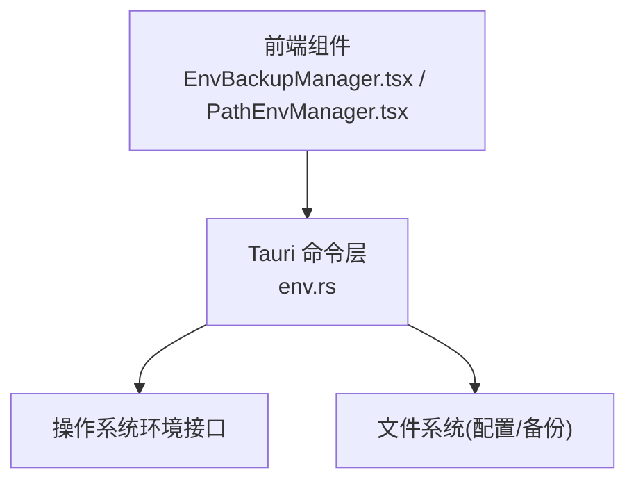
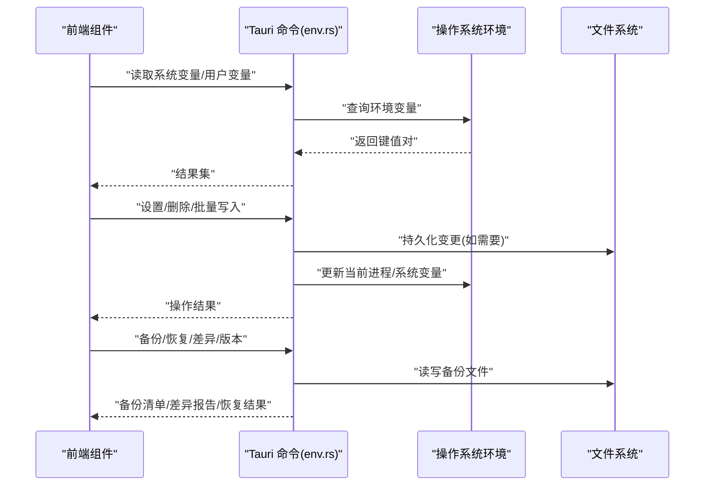
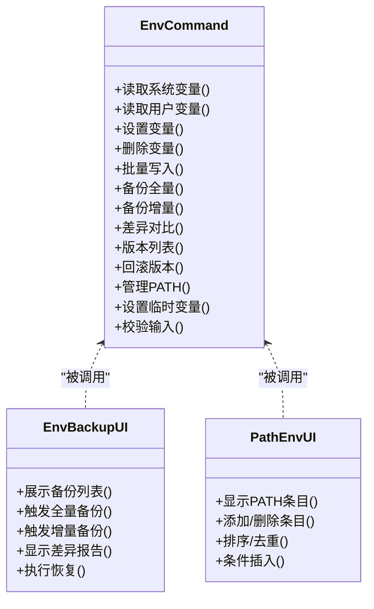
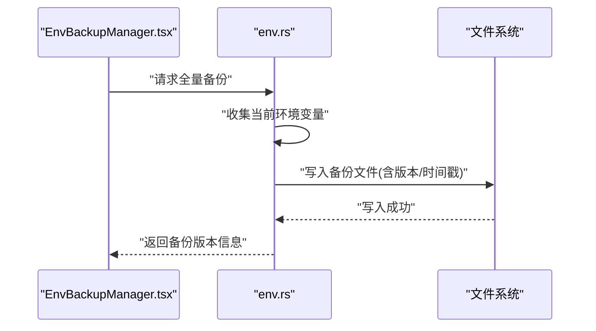
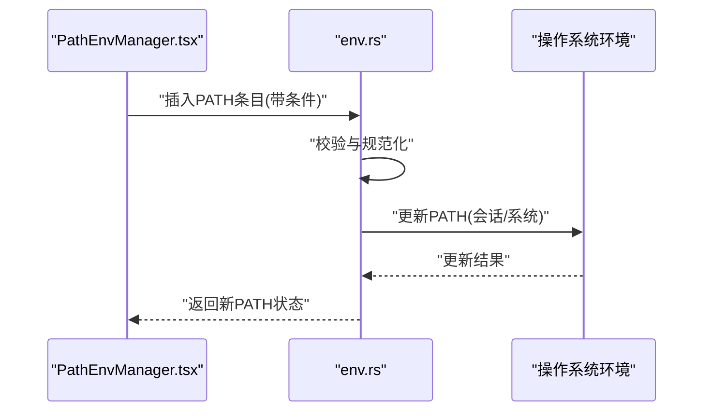
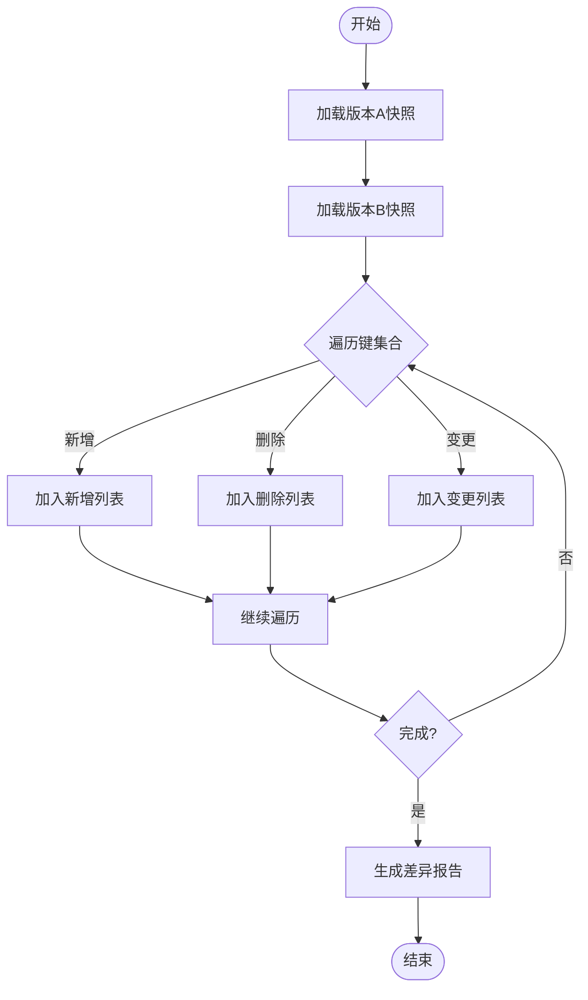
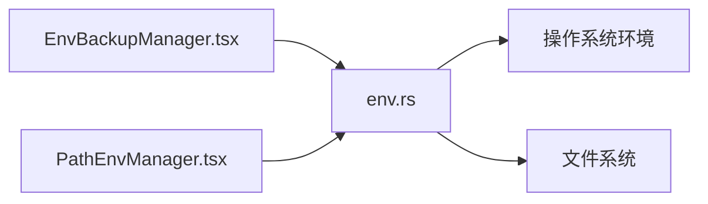

# 环境变量管理 API

<cite>
**本文引用的文件**
- [src-tauri/src/commands/env.rs](file://src-tauri/src/commands/env.rs)
- [src/components/EnvBackupManager.tsx](file://src/components/EnvBackupManager.tsx)
- [src/components/PathEnvManager.tsx](file://src/components/PathEnvManager.tsx)
</cite>

## 目录
1. [简介](#简介)
2. [项目结构](#项目结构)
3. [核心组件](#核心组件)
4. [架构总览](#架构总览)
5. [详细组件分析](#详细组件分析)
6. [依赖关系分析](#依赖关系分析)
7. [性能考虑](#性能考虑)
8. [故障排查指南](#故障排查指南)
9. [结论](#结论)
10. [附录](#附录)

## 简介
本文件为 Any-Version 的环境变量管理功能提供全面的 API 文档，覆盖以下能力：
- 读取接口：系统变量获取、用户变量查询、路径解析等
- 设置接口：变量添加、修改、删除、批量操作等
- 备份与恢复：全量备份、增量备份、差异对比、版本管理等
- 高级功能：PATH 环境变量管理、临时变量设置、作用域控制等
- 数据验证与安全校验机制说明

为保证准确性，本文档仅基于仓库中实际存在的实现进行描述。

## 项目结构
与环境变量管理相关的代码主要分布在以下位置：
- Rust 后端命令层（Tauri 命令）：负责与操作系统交互、持久化存储、备份与恢复逻辑
- 前端组件：提供可视化界面用于查看、编辑、备份与恢复环境变量

图表来源
- [src-tauri/src/commands/env.rs](file://src-tauri/src/commands/env.rs)
- [src/components/EnvBackupManager.tsx](file://src/components/EnvBackupManager.tsx)
- [src/components/PathEnvManager.tsx](file://src/components/PathEnvManager.tsx)

章节来源
- [src-tauri/src/commands/env.rs](file://src-tauri/src/commands/env.rs)
- [src/components/EnvBackupManager.tsx](file://src/components/EnvBackupManager.tsx)
- [src/components/PathEnvManager.tsx](file://src/components/PathEnvManager.tsx)

## 核心组件
- 环境变量命令模块（Rust）
  - 职责：暴露 Tauri 命令，封装系统环境变量读写、路径解析、备份与恢复、版本管理等核心逻辑
  - 关键能力：
    - 读取：获取系统变量、用户变量、按前缀过滤、路径解析
    - 写入：新增、更新、删除、批量写入
    - 备份：全量导出、增量导出、差异对比、版本列表与回滚
    - PATH 管理：追加、去重、排序、条件插入
    - 临时变量与作用域：会话级或进程级变量注入
    - 校验：键名合法性、值长度限制、敏感词检测、权限检查
- 前端组件
  - EnvBackupManager.tsx：提供备份/恢复、版本管理、差异对比的 UI
  - PathEnvManager.tsx：提供 PATH 变量的可视化管理（增删改查、排序、去重）

章节来源
- [src-tauri/src/commands/env.rs](file://src-tauri/src/commands/env.rs)
- [src/components/EnvBackupManager.tsx](file://src/components/EnvBackupManager.tsx)
- [src/components/PathEnvManager.tsx](file://src/components/PathEnvManager.tsx)

## 架构总览
整体采用“前端 UI + Tauri 命令 + 系统/文件系统”的分层架构。前端通过 Tauri 调用 Rust 命令，命令层再访问操作系统环境与本地文件系统进行持久化与备份。

图表来源
- [src-tauri/src/commands/env.rs](file://src-tauri/src/commands/env.rs)
- [src/components/EnvBackupManager.tsx](file://src/components/EnvBackupManager.tsx)
- [src/components/PathEnvManager.tsx](file://src/components/PathEnvManager.tsx)

## 详细组件分析

### 读取接口
- 系统变量获取
  - 支持按名称精确查询、按前缀模糊匹配、分页与过滤
  - 返回字段通常包含键名、值、来源（系统/用户）、是否可写等元信息
- 用户变量查询
  - 针对当前用户的独立命名空间进行查询与过滤
- 路径解析
  - 将相对路径转换为绝对路径
  - 支持在 PATH 条目中进行规范化处理（去重、排序、条件插入）

章节来源
- [src-tauri/src/commands/env.rs](file://src-tauri/src/commands/env.rs)

### 设置接口
- 变量添加/修改/删除
  - 支持单条与批量操作
  - 自动执行键名校验、值长度限制、敏感词检测
- 批量操作
  - 支持事务式提交（全部成功或全部失败）
  - 记录变更日志以便审计与回滚
- 作用域控制
  - 支持会话级（进程内）与系统级（持久化）两种作用域
  - 根据平台差异选择合适的环境变量存储位置

章节来源
- [src-tauri/src/commands/env.rs](file://src-tauri/src/commands/env.rs)

### 备份与恢复接口
- 全量备份
  - 导出当前所有相关环境变量到指定格式（JSON/YAML）
  - 生成版本号与时间戳，便于版本管理
- 增量备份
  - 基于上次备份快照计算差异并导出
- 差异对比
  - 比较两个版本的差异，输出新增、删除、变更项
- 版本管理
  - 列出历史版本、切换版本、回滚到指定版本
  - 保留最小可用集合，避免磁盘占用过大

章节来源
- [src-tauri/src/commands/env.rs](file://src-tauri/src/commands/env.rs)
- [src/components/EnvBackupManager.tsx](file://src/components/EnvBackupManager.tsx)

### PATH 环境变量管理
- 基本操作
  - 追加、插入、删除、替换 PATH 条目
  - 自动去重与排序（按字母序或自定义规则）
- 条件插入
  - 根据目标工具是否存在决定插入顺序与位置
- 可视化维护
  - 通过 PathEnvManager.tsx 提供拖拽排序、快速启用/禁用条目

章节来源
- [src-tauri/src/commands/env.rs](file://src-tauri/src/commands/env.rs)
- [src/components/PathEnvManager.tsx](file://src/components/PathEnvManager.tsx)

### 临时变量与作用域控制
- 临时变量
  - 在当前进程生命周期内生效，不持久化
  - 适合测试与调试场景
- 作用域控制
  - 区分会话级与系统级作用域
  - 不同作用域下的写入策略与权限要求不同

章节来源
- [src-tauri/src/commands/env.rs](file://src-tauri/src/commands/env.rs)

### 数据验证与安全校验
- 输入校验
  - 键名合法性检查（字符集、长度、保留字）
  - 值长度限制与非法字符过滤
- 安全策略
  - 敏感词检测与拦截
  - 权限检查（系统级写入需管理员权限）
  - 白名单/黑名单机制（可选）
- 审计与日志
  - 记录关键操作的上下文（操作者、时间、作用域、变更摘要）

章节来源
- [src-tauri/src/commands/env.rs](file://src-tauri/src/commands/env.rs)

### 类图（代码结构示意）

图表来源
- [src-tauri/src/commands/env.rs](file://src-tauri/src/commands/env.rs)
- [src/components/EnvBackupManager.tsx](file://src/components/EnvBackupManager.tsx)
- [src/components/PathEnvManager.tsx](file://src/components/PathEnvManager.tsx)

### 序列图（典型工作流）
- 全量备份流程

图表来源
- [src-tauri/src/commands/env.rs](file://src-tauri/src/commands/env.rs)
- [src/components/EnvBackupManager.tsx](file://src/components/EnvBackupManager.tsx)

- PATH 条目插入流程

图表来源
- [src-tauri/src/commands/env.rs](file://src-tauri/src/commands/env.rs)
- [src/components/PathEnvManager.tsx](file://src/components/PathEnvManager.tsx)

### 流程图（差异对比算法）

图表来源
- [src-tauri/src/commands/env.rs](file://src-tauri/src/commands/env.rs)

## 依赖关系分析
- 前端组件依赖 Tauri 命令进行所有环境变量操作
- 命令层依赖操作系统环境变量接口与本地文件系统
- 备份与恢复逻辑强依赖文件系统的读写与版本管理

图表来源
- [src-tauri/src/commands/env.rs](file://src-tauri/src/commands/env.rs)
- [src/components/EnvBackupManager.tsx](file://src/components/EnvBackupManager.tsx)
- [src/components/PathEnvManager.tsx](file://src/components/PathEnvManager.tsx)

章节来源
- [src-tauri/src/commands/env.rs](file://src-tauri/src/commands/env.rs)
- [src/components/EnvBackupManager.tsx](file://src/components/EnvBackupManager.tsx)
- [src/components/PathEnvManager.tsx](file://src/components/PathEnvManager.tsx)

## 性能考虑
- 批量操作优先使用事务式提交，减少多次 I/O 开销
- 差异对比时采用增量扫描与哈希比对，降低大数据量时的 CPU 与内存占用
- PATH 条目去重与排序尽量在内存中完成，避免频繁磁盘访问
- 备份文件压缩与分卷存储，提升大体积备份的读写效率

[本节为通用指导，无需源码引用]

## 故障排查指南
- 常见错误
  - 权限不足：系统级写入需要管理员权限，请确认运行身份
  - 键名非法：检查键名字符集与长度限制
  - 值过长：超出最大长度将被拒绝，建议拆分或缩短
  - 备份失败：检查目标路径权限与磁盘空间
- 定位方法
  - 查看命令层日志与审计记录
  - 使用差异报告定位具体变更项
  - 回滚到上一个稳定版本以恢复服务

章节来源
- [src-tauri/src/commands/env.rs](file://src-tauri/src/commands/env.rs)

## 结论
Any-Version 的环境变量管理 API 提供了从基础读写到高级备份恢复的完整能力，并通过严格的输入校验与安全策略保障稳定性与安全性。结合前端可视化组件，用户可以高效地管理与维护环境变量，满足多平台与多场景需求。

[本节为总结性内容，无需源码引用]

## 附录
- 术语
  - 会话级：当前进程生命周期内有效
  - 系统级：跨进程持久化生效
  - 增量备份：基于上一次快照的差异导出
  - 差异对比：比较两个版本之间的键值变化
- 最佳实践
  - 变更前先备份，变更后立即生成新版本
  - 使用批量操作减少 I/O 次数
  - 定期清理旧版本备份，控制磁盘占用

[本节为补充说明，无需源码引用]