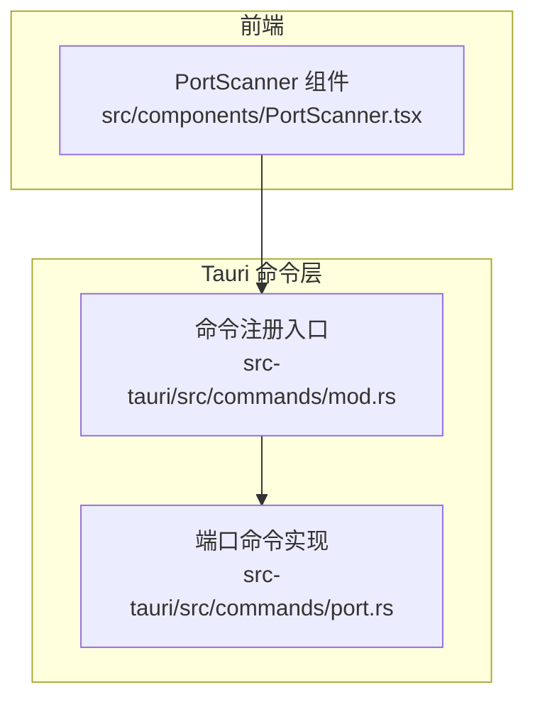
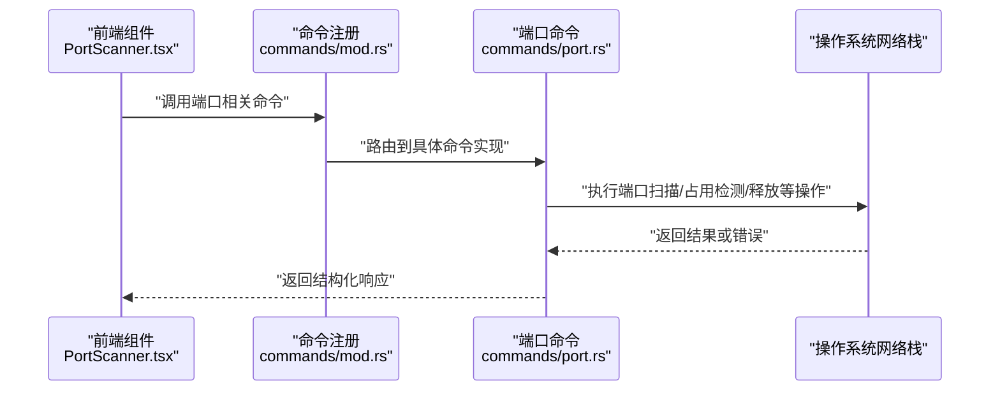
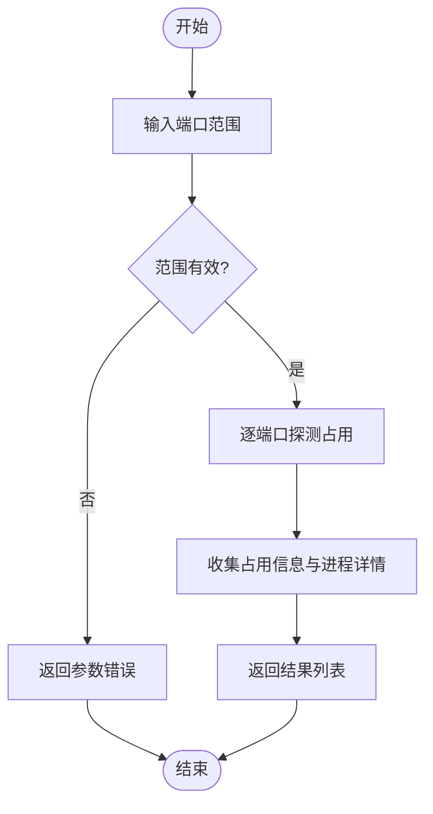
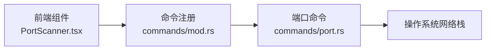

# 端口管理 API

<cite>
**本文引用的文件**   
- [src/components/PortScanner.tsx](file://src/components/PortScanner.tsx)
- [src-tauri/src/commands/port.rs](file://src-tauri/src/commands/port.rs)
- [src-tauri/src/commands/mod.rs](file://src-tauri/src/commands/mod.rs)
</cite>

## 目录
1. [简介](#简介)
2. [项目结构](#项目结构)
3. [核心组件](#核心组件)
4. [架构总览](#架构总览)
5. [详细组件分析](#详细组件分析)
6. [依赖分析](#依赖分析)
7. [性能考虑](#性能考虑)
8. [故障排查指南](#故障排查指南)
9. [结论](#结论)
10. [附录](#附录)

## 简介
本文件为 Any-Version 的“端口管理”能力提供面向前端的 API 文档，覆盖以下能力：
- 端口扫描接口：端口占用检测、服务发现、端口范围扫描等。
- 端口监控接口：实时监听、状态变化通知、历史数据记录等。
- 端口释放接口：进程终止、端口绑定解除、资源清理等。
- 高级功能：端口冲突检测、端口分配建议、安全策略配置等。
- 错误处理与异常恢复机制。

说明：
- 前端通过 Tauri 命令调用后端 Rust 实现进行系统级端口操作。
- 本文档以实际源码为依据，对现有能力进行梳理；未实现的特性将明确标注为“待实现”。

## 项目结构
与端口管理相关的代码主要分布在以下位置：
- 前端 UI 组件：用于展示端口扫描结果、触发扫描与释放等操作。
- 后端命令层：暴露给前端的 Tauri 命令，封装系统级端口操作。

图表来源
- [src/components/PortScanner.tsx](file://src/components/PortScanner.tsx)
- [src-tauri/src/commands/mod.rs](file://src-tauri/src/commands/mod.rs)
- [src-tauri/src/commands/port.rs](file://src-tauri/src/commands/port.rs)

章节来源
- [src/components/PortScanner.tsx](file://src/components/PortScanner.tsx)
- [src-tauri/src/commands/mod.rs](file://src-tauri/src/commands/mod.rs)
- [src-tauri/src/commands/port.rs](file://src-tauri/src/commands/port.rs)

## 核心组件
- 前端组件 PortScanner
  - 职责：渲染端口扫描界面，发起扫描、释放、查看占用信息等请求，并展示结果。
  - 交互：通过 Tauri 命令与后端通信，获取端口状态、执行释放等操作。
- 后端命令 port.rs
  - 职责：实现端口扫描、端口占用查询、端口释放等系统级操作，并以 Tauri 命令形式暴露给前端。
  - 集成：在命令注册模块中统一注册，供前端调用。

章节来源
- [src/components/PortScanner.tsx](file://src/components/PortScanner.tsx)
- [src-tauri/src/commands/port.rs](file://src-tauri/src/commands/port.rs)
- [src-tauri/src/commands/mod.rs](file://src-tauri/src/commands/mod.rs)

## 架构总览
整体调用链路：前端组件 -> Tauri 命令注册 -> 端口命令实现 -> 系统端口操作。

图表来源
- [src/components/PortScanner.tsx](file://src/components/PortScanner.tsx)
- [src-tauri/src/commands/mod.rs](file://src-tauri/src/commands/mod.rs)
- [src-tauri/src/commands/port.rs](file://src-tauri/src/commands/port.rs)

## 详细组件分析

### 前端组件：端口扫描器（PortScanner）
- 功能要点
  - 提供端口范围输入与扫描按钮。
  - 显示端口占用情况与对应进程信息。
  - 支持一键释放指定端口。
- 交互流程
  - 用户输入端口范围后，触发扫描请求。
  - 接收后端返回的端口状态列表，渲染表格或列表视图。
  - 针对占用端口，提供释放操作入口。
- 错误处理
  - 捕获网络/权限错误，提示用户重试或检查权限。
  - 对超时或无响应场景进行友好提示。

章节来源
- [src/components/PortScanner.tsx](file://src/components/PortScanner.tsx)

### 后端命令：端口管理（port.rs）
- 能力清单
  - 端口占用检测：查询指定端口是否被占用及占用进程信息。
  - 端口范围扫描：批量扫描端口区间，返回占用详情。
  - 端口释放：尝试终止占用进程并解除端口绑定。
- 设计要点
  - 使用系统工具或内核接口获取端口与进程映射。
  - 对跨平台差异进行抽象，保证在不同操作系统上行为一致。
  - 对高风险操作（如进程终止）增加确认与权限校验。
- 错误处理
  - 区分权限不足、端口不存在、进程无法终止等错误类型。
  - 返回明确的错误码与消息，便于前端展示与重试。

章节来源
- [src-tauri/src/commands/port.rs](file://src-tauri/src/commands/port.rs)

### 命令注册：命令入口（mod.rs）
- 职责
  - 集中注册所有对外暴露的命令，包括端口相关命令。
  - 维护命令命名空间与参数解析。
- 扩展性
  - 新增端口命令时，仅需在此处注册即可被前端调用。

章节来源
- [src-tauri/src/commands/mod.rs](file://src-tauri/src/commands/mod.rs)

### 概念性概览：端口扫描流程
以下为概念性流程图，帮助理解扫描过程的关键步骤。

[此图为概念性流程，不直接映射具体源码文件]

## 依赖分析
- 组件耦合
  - 前端组件仅依赖 Tauri 命令接口，不直接访问系统资源，解耦良好。
  - 后端命令层屏蔽系统差异，降低上层复杂度。
- 外部依赖
  - 操作系统网络栈与进程管理接口。
  - Tauri 运行时提供的命令通道与序列化机制。

图表来源
- [src/components/PortScanner.tsx](file://src/components/PortScanner.tsx)
- [src-tauri/src/commands/mod.rs](file://src-tauri/src/commands/mod.rs)
- [src-tauri/src/commands/port.rs](file://src-tauri/src/commands/port.rs)

章节来源
- [src/components/PortScanner.tsx](file://src/components/PortScanner.tsx)
- [src-tauri/src/commands/mod.rs](file://src-tauri/src/commands/mod.rs)
- [src-tauri/src/commands/port.rs](file://src-tauri/src/commands/port.rs)

## 性能考虑
- 批量扫描优化
  - 采用并发探测减少总体耗时，同时限制并发度避免系统压力过大。
  - 对大范围扫描提供分页或增量更新策略。
- 缓存与去抖
  - 对频繁查询的端口状态进行短期缓存，减少重复系统调用。
  - 对输入变更进行去抖，避免频繁触发扫描。
- 资源释放
  - 释放操作应尽快完成，必要时异步执行并反馈进度。

[本节为通用指导，不直接分析具体文件]

## 故障排查指南
- 常见错误
  - 权限不足：需要管理员/root 权限才能读取进程或终止进程。
  - 端口不存在：目标端口未被任何进程占用。
  - 进程无法终止：进程处于不可中断状态或被系统保护。
- 定位方法
  - 检查命令返回值中的错误码与消息。
  - 在前端日志中查看调用链路与超时情况。
  - 在系统层面验证端口占用与进程状态。
- 恢复策略
  - 对于临时性错误（如系统繁忙），建议指数退避重试。
  - 对于权限问题，引导用户提升权限或切换运行环境。

章节来源
- [src-tauri/src/commands/port.rs](file://src-tauri/src/commands/port.rs)

## 结论
当前端口管理能力已具备端口扫描、占用检测与释放等核心功能，并通过 Tauri 命令清晰暴露给前端。建议在后续迭代中完善监控与历史记录能力，增强安全策略与冲突检测，以提升用户体验与系统稳定性。

[本节为总结性内容，不直接分析具体文件]

## 附录

### API 定义（基于现有实现）
- 端口占用检测
  - 描述：查询指定端口是否被占用，返回占用进程信息。
  - 输入：端口号
  - 输出：占用状态、进程标识、进程名称等
  - 错误：权限不足、端口无效
- 端口范围扫描
  - 描述：对给定端口区间进行批量扫描，返回每个端口的占用详情。
  - 输入：起始端口、结束端口
  - 输出：端口状态列表
  - 错误：参数非法、系统调用失败
- 端口释放
  - 描述：尝试终止占用进程并解除端口绑定。
  - 输入：端口号、确认标志
  - 输出：释放结果、残留状态
  - 错误：进程无法终止、权限不足

章节来源
- [src-tauri/src/commands/port.rs](file://src-tauri/src/commands/port.rs)

### 待实现能力（规划）
- 端口监控接口
  - 实时监听：持续观察端口状态变化。
  - 状态变化通知：通过事件或回调推送状态变更。
  - 历史数据记录：持久化端口状态快照，支持回溯与分析。
- 高级功能
  - 端口冲突检测：在多服务启动前预检冲突。
  - 端口分配建议：根据历史使用与规则推荐可用端口。
  - 安全策略配置：白名单端口、最小权限原则、审计日志。

[本节为规划性内容，不直接分析具体文件]