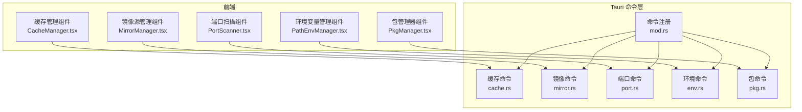
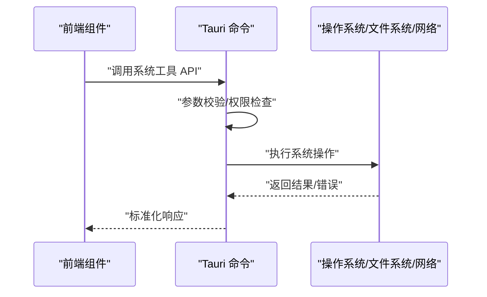
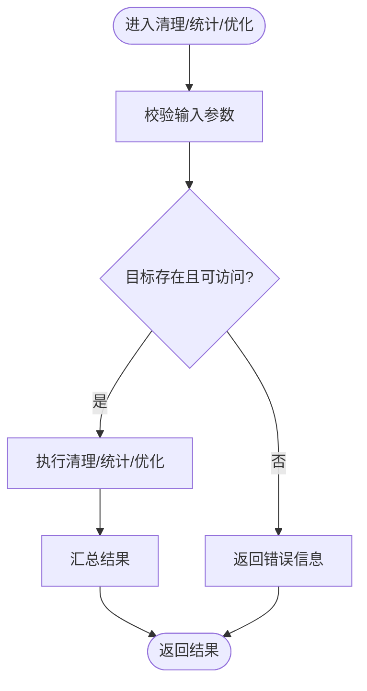
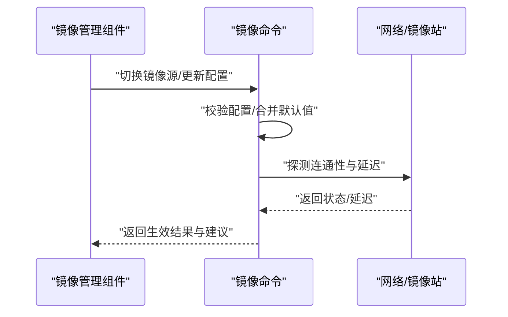
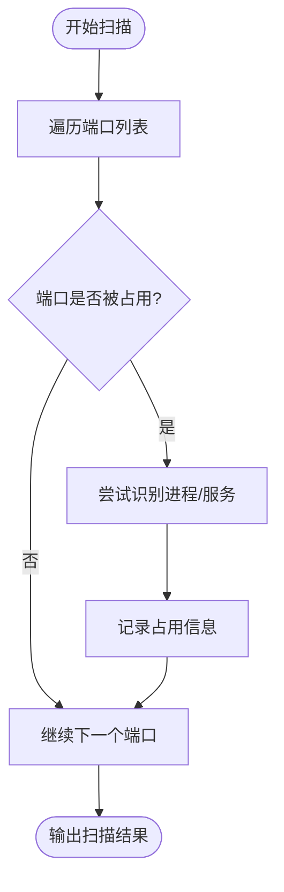
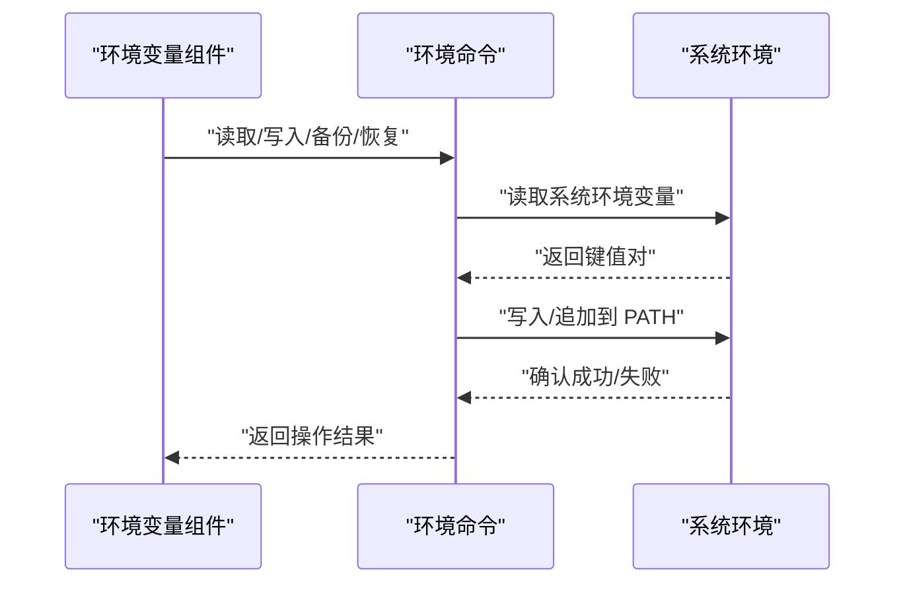
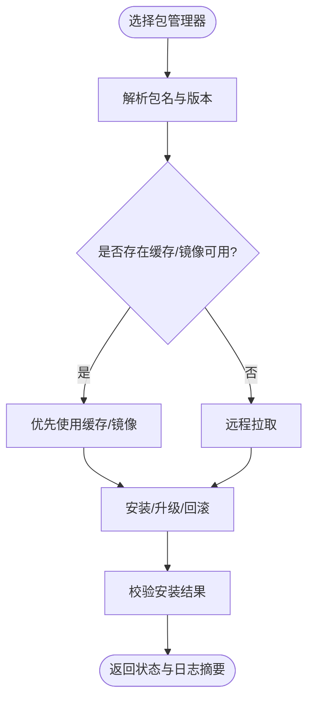
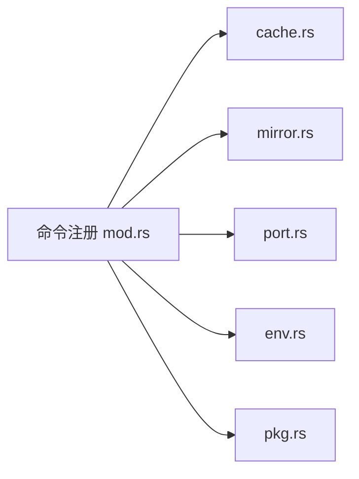

# 系统工具 API

<cite>
**本文引用的文件**   
- [src/components/CacheManager.tsx](file://src/components/CacheManager.tsx)
- [src/components/MirrorManager.tsx](file://src/components/MirrorManager.tsx)
- [src/components/PortScanner.tsx](file://src/components/PortScanner.tsx)
- [src/components/PathEnvManager.tsx](file://src/components/PathEnvManager.tsx)
- [src/components/PkgManager.tsx](file://src/components/PkgManager.tsx)
- [src-tauri/src/commands/cache.rs](file://src-tauri/src/commands/cache.rs)
- [src-tauri/src/commands/mirror.rs](file://src-tauri/src/commands/mirror.rs)
- [src-tauri/src/commands/port.rs](file://src-tauri/src/commands/port.rs)
- [src-tauri/src/commands/env.rs](file://src-tauri/src/commands/env.rs)
- [src-tauri/src/commands/pkg.rs](file://src-tauri/src/commands/pkg.rs)
- [src-tauri/src/commands/mod.rs](file://src-tauri/src/commands/mod.rs)
</cite>

## 目录
1. [简介](#简介)
2. [项目结构](#项目结构)
3. [核心组件](#核心组件)
4. [架构总览](#架构总览)
5. [详细组件分析](#详细组件分析)
6. [依赖分析](#依赖分析)
7. [性能考虑](#性能考虑)
8. [故障排除指南](#故障排除指南)
9. [结论](#结论)
10. [附录](#附录)

## 简介
本文件为 Any-Version 的系统工具功能提供全面的 API 文档，覆盖以下能力：
- 缓存管理：清理、统计、存储优化等接口
- 镜像源管理：镜像配置、下载加速、源切换等接口
- 端口扫描与管理：端口占用检测、服务发现、端口释放等接口
- 环境变量管理：路径设置、变量读取、备份恢复等接口
- 包管理器集成：安装、卸载、版本管理等操作

文档面向开发者与使用者，既包含高层概览，也提供代码级映射与可视化图示，帮助快速理解并正确使用各模块 API。

## 项目结构
系统工具采用前端 Tauri 应用 + Rust 后端命令的架构。前端通过 React 组件暴露用户界面，调用 Tauri 命令；Rust 侧实现具体系统交互逻辑（文件系统、网络、进程、端口等）。

图表来源
- [src/components/CacheManager.tsx](file://src/components/CacheManager.tsx)
- [src/components/MirrorManager.tsx](file://src/components/MirrorManager.tsx)
- [src/components/PortScanner.tsx](file://src/components/PortScanner.tsx)
- [src/components/PathEnvManager.tsx](file://src/components/PathEnvManager.tsx)
- [src/components/PkgManager.tsx](file://src/components/PkgManager.tsx)
- [src-tauri/src/commands/mod.rs](file://src-tauri/src/commands/mod.rs)
- [src-tauri/src/commands/cache.rs](file://src-tauri/src/commands/cache.rs)
- [src-tauri/src/commands/mirror.rs](file://src-tauri/src/commands/mirror.rs)
- [src-tauri/src/commands/port.rs](file://src-tauri/src/commands/port.rs)
- [src-tauri/src/commands/env.rs](file://src-tauri/src/commands/env.rs)
- [src-tauri/src/commands/pkg.rs](file://src-tauri/src/commands/pkg.rs)

章节来源
- [src-tauri/src/commands/mod.rs](file://src-tauri/src/commands/mod.rs)

## 核心组件
本节概述五大系统工具组件的职责与对外能力边界：
- 缓存管理：提供清理、统计、优化等能力，用于释放磁盘空间与提升后续操作性能
- 镜像源管理：集中管理镜像源配置，支持切换与加速策略
- 端口扫描与管理：扫描本地端口占用，辅助服务发现与端口释放
- 环境变量管理：维护 PATH 及其他关键变量，支持读写与备份恢复
- 包管理器集成：封装常见包管理器的安装、卸载、版本管理等操作

章节来源
- [src/components/CacheManager.tsx](file://src/components/CacheManager.tsx)
- [src/components/MirrorManager.tsx](file://src/components/MirrorManager.tsx)
- [src/components/PortScanner.tsx](file://src/components/PortScanner.tsx)
- [src/components/PathEnvManager.tsx](file://src/components/PathEnvManager.tsx)
- [src/components/PkgManager.tsx](file://src/components/PkgManager.tsx)

## 架构总览
整体数据流遵循“前端组件 -> Tauri 命令 -> 系统资源”的模式。命令层负责权限校验、参数解析、错误处理与结果序列化，返回给前端进行展示或进一步操作。

图表来源
- [src-tauri/src/commands/mod.rs](file://src-tauri/src/commands/mod.rs)
- [src-tauri/src/commands/cache.rs](file://src-tauri/src/commands/cache.rs)
- [src-tauri/src/commands/mirror.rs](file://src-tauri/src/commands/mirror.rs)
- [src-tauri/src/commands/port.rs](file://src-tauri/src/commands/port.rs)
- [src-tauri/src/commands/env.rs](file://src-tauri/src/commands/env.rs)
- [src-tauri/src/commands/pkg.rs](file://src-tauri/src/commands/pkg.rs)

## 详细组件分析

### 缓存管理 API
职责范围
- 清理：按类型或条件清理缓存目录与文件
- 统计：获取缓存大小、数量、分布等信息
- 优化：压缩、去重、迁移等存储优化操作

典型流程

图表来源
- [src-tauri/src/commands/cache.rs](file://src-tauri/src/commands/cache.rs)

使用示例（概念性）
- 清理指定类型的缓存
- 获取缓存总量与分类占比
- 对大体积缓存执行压缩或迁移

章节来源
- [src/components/CacheManager.tsx](file://src/components/CacheManager.tsx)
- [src-tauri/src/commands/cache.rs](file://src-tauri/src/commands/cache.rs)

### 镜像源管理 API
职责范围
- 镜像配置：新增、更新、删除镜像源
- 下载加速：启用代理、重试、并发等策略
- 源切换：按平台/语言/包管理器选择最优源

典型流程

图表来源
- [src-tauri/src/commands/mirror.rs](file://src-tauri/src/commands/mirror.rs)

使用示例（概念性）
- 列出当前可用镜像源
- 切换至国内镜像并验证连通性
- 针对特定包管理器设置专属镜像

章节来源
- [src/components/MirrorManager.tsx](file://src/components/MirrorManager.tsx)
- [src-tauri/src/commands/mirror.rs](file://src-tauri/src/commands/mirror.rs)

### 端口扫描与管理 API
职责范围
- 端口占用检测：扫描常用端口，识别监听进程
- 服务发现：结合已知服务清单推断服务类型
- 端口释放：停止占用进程或提示用户手动干预

典型流程

图表来源
- [src-tauri/src/commands/port.rs](file://src-tauri/src/commands/port.rs)

使用示例（概念性）
- 扫描 80/443/3000/5432 等常用端口
- 根据进程名判断是否为数据库/Web 服务
- 在具备权限时终止占用进程

章节来源
- [src/components/PortScanner.tsx](file://src/components/PortScanner.tsx)
- [src-tauri/src/commands/port.rs](file://src-tauri/src/commands/port.rs)

### 环境变量管理 API
职责范围
- 路径设置：维护 PATH 及自定义变量
- 变量读取：查询当前会话与环境持久化变量
- 备份恢复：导出/导入环境变量快照

典型流程

图表来源
- [src-tauri/src/commands/env.rs](file://src-tauri/src/commands/env.rs)

使用示例（概念性）
- 将某 SDK 的 bin 目录加入 PATH
- 导出当前环境变量到 JSON 文件
- 从备份恢复 PATH 与其他变量

章节来源
- [src/components/PathEnvManager.tsx](file://src/components/PathEnvManager.tsx)
- [src-tauri/src/commands/env.rs](file://src-tauri/src/commands/env.rs)

### 包管理器集成 API
职责范围
- 安装：按包名与版本安装依赖
- 卸载：移除已安装包及其关联文件
- 版本管理：列出、切换、锁定版本

典型流程

图表来源
- [src-tauri/src/commands/pkg.rs](file://src-tauri/src/commands/pkg.rs)

使用示例（概念性）
- 安装指定版本的 Node.js 并加入 PATH
- 卸载不再使用的 Python 版本
- 列出已安装的 Go 版本并切换到目标版本

章节来源
- [src/components/PkgManager.tsx](file://src/components/PkgManager.tsx)
- [src-tauri/src/commands/pkg.rs](file://src-tauri/src/commands/pkg.rs)

## 依赖分析
命令层统一注册与分发，降低前端与各后端模块的耦合度。

图表来源
- [src-tauri/src/commands/mod.rs](file://src-tauri/src/commands/mod.rs)
- [src-tauri/src/commands/cache.rs](file://src-tauri/src/commands/cache.rs)
- [src-tauri/src/commands/mirror.rs](file://src-tauri/src/commands/mirror.rs)
- [src-tauri/src/commands/port.rs](file://src-tauri/src/commands/port.rs)
- [src-tauri/src/commands/env.rs](file://src-tauri/src/commands/env.rs)
- [src-tauri/src/commands/pkg.rs](file://src-tauri/src/commands/pkg.rs)

章节来源
- [src-tauri/src/commands/mod.rs](file://src-tauri/src/commands/mod.rs)

## 性能考虑
- 批量操作：尽量合并多次小请求为一次批量调用，减少往返开销
- 增量扫描：端口扫描与缓存统计支持增量模式，避免全量遍历
- 并行与限流：镜像探测与下载任务应限制并发数，避免拥塞
- 缓存命中：优先使用本地缓存与镜像，减少网络抖动影响
- 异步反馈：长耗时操作返回进度与中间结果，提升用户体验

[本节为通用指导，不直接分析具体文件]

## 故障排除指南
常见问题与定位建议
- 权限不足：涉及系统环境变量修改、进程终止等操作需管理员权限
- 网络异常：镜像不可达或超时，建议切换备用镜像或检查代理设置
- 端口冲突：无法释放端口时，确认进程是否被其他服务拉起
- 路径污染：PATH 重复项或顺序不当导致命令找不到，建议导出后人工核对
- 包安装失败：查看日志摘要与错误码，必要时清理缓存并重试

章节来源
- [src-tauri/src/commands/cache.rs](file://src-tauri/src/commands/cache.rs)
- [src-tauri/src/commands/mirror.rs](file://src-tauri/src/commands/mirror.rs)
- [src-tauri/src/commands/port.rs](file://src-tauri/src/commands/port.rs)
- [src-tauri/src/commands/env.rs](file://src-tauri/src/commands/env.rs)
- [src-tauri/src/commands/pkg.rs](file://src-tauri/src/commands/pkg.rs)

## 结论
Any-Version 系统工具以清晰的模块化设计提供了缓存、镜像、端口、环境与包管理的统一入口。通过 Tauri 命令层屏蔽底层差异，前端组件专注交互与展示，便于扩展与维护。建议在生产环境中结合权限控制、日志审计与监控告警，进一步提升稳定性与可观测性。

[本节为总结性内容，不直接分析具体文件]

## 附录
- 术语说明
  - 镜像源：用于加速下载的第三方站点或代理
  - 端口占用：已有进程监听该 TCP/UDP 端口
  - 环境变量：操作系统提供的键值对配置，如 PATH
- 参考组件
  - 缓存管理：[src/components/CacheManager.tsx](file://src/components/CacheManager.tsx)
  - 镜像源管理：[src/components/MirrorManager.tsx](file://src/components/MirrorManager.tsx)
  - 端口扫描与管理：[src/components/PortScanner.tsx](file://src/components/PortScanner.tsx)
  - 环境变量管理：[src/components/PathEnvManager.tsx](file://src/components/PathEnvManager.tsx)
  - 包管理器集成：[src/components/PkgManager.tsx](file://src/components/PkgManager.tsx)