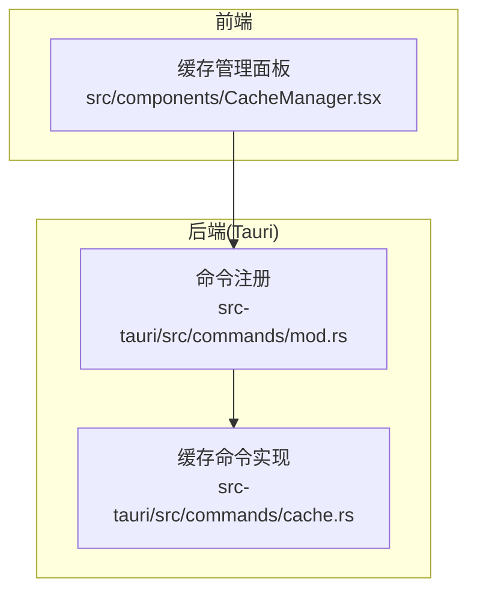
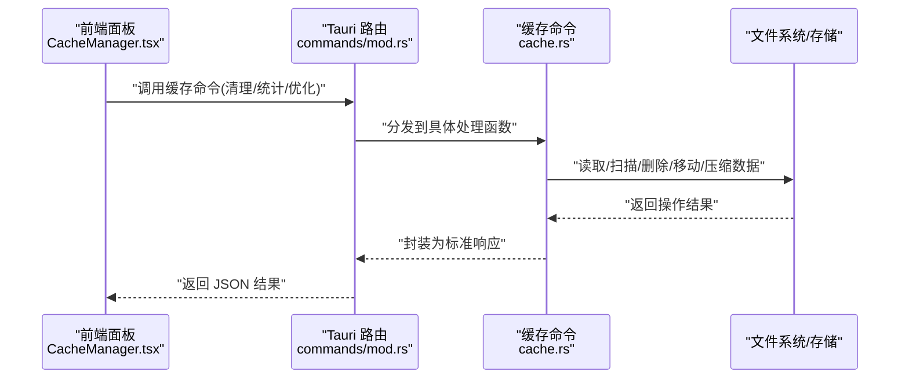
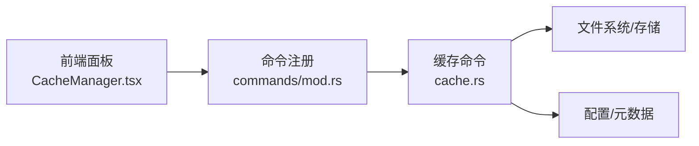

# 缓存管理 API

<cite>
**本文引用的文件**   
- [src-tauri/src/commands/cache.rs](file://src-tauri/src/commands/cache.rs)
- [src-tauri/src/commands/mod.rs](file://src-tauri/src/commands/mod.rs)
- [src/components/CacheManager.tsx](file://src/components/CacheManager.tsx)
</cite>

## 目录
1. [简介](#简介)
2. [项目结构](#项目结构)
3. [核心组件](#核心组件)
4. [架构总览](#架构总览)
5. [详细组件分析](#详细组件分析)
6. [依赖分析](#依赖分析)
7. [性能考虑](#性能考虑)
8. [故障排除指南](#故障排除指南)
9. [结论](#结论)
10. [附录](#附录) 

## 简介
本文件为 Any-Version 的“缓存管理”能力提供面向使用者的 API 文档，覆盖以下方面：
- 缓存清理接口：支持按类型清理、批量清理与智能清理等策略。
- 缓存统计信息接口：包括缓存大小查询、使用率分析与存储分布统计。
- 缓存优化接口：涵盖压缩、去重、迁移等优化操作。
- 完整的请求/响应格式、错误码定义与使用示例。
- 性能优化建议与故障排除指南。

说明：
- 后端实现位于 Rust（Tauri）命令层；前端通过 Tauri 调用这些命令。
- 本文档以实际代码为依据进行梳理，未实现的接口将明确标注“待实现”。

## 项目结构
与缓存管理相关的核心位置如下：
- 后端命令：src-tauri/src/commands/cache.rs
- 命令注册入口：src-tauri/src/commands/mod.rs
- 前端面板：src/components/CacheManager.tsx

图表来源
- [src/components/CacheManager.tsx](file://src/components/CacheManager.tsx)
- [src-tauri/src/commands/mod.rs](file://src-tauri/src/commands/mod.rs)
- [src-tauri/src/commands/cache.rs](file://src-tauri/src/commands/cache.rs)

章节来源
- [src-tauri/src/commands/cache.rs](file://src-tauri/src/commands/cache.rs)
- [src-tauri/src/commands/mod.rs](file://src-tauri/src/commands/mod.rs)
- [src/components/CacheManager.tsx](file://src/components/CacheManager.tsx)

## 核心组件
- 缓存命令模块（Rust/Tauri）
  - 职责：暴露缓存清理、统计、优化等能力，供前端通过 Tauri 调用。
  - 关键文件：[src-tauri/src/commands/cache.rs](file://src-tauri/src/commands/cache.rs)
- 命令注册（Rust/Tauri）
  - 职责：将具体命令函数注册到 Tauri 运行时，使前端可发现并调用。
  - 关键文件：[src-tauri/src/commands/mod.rs](file://src-tauri/src/commands/mod.rs)
- 缓存管理面板（前端）
  - 职责：提供用户界面，触发清理、统计、优化等操作，展示结果与状态。
  - 关键文件：[src/components/CacheManager.tsx](file://src/components/CacheManager.tsx)

章节来源
- [src-tauri/src/commands/cache.rs](file://src-tauri/src/commands/cache.rs)
- [src-tauri/src/commands/mod.rs](file://src-tauri/src/commands/mod.rs)
- [src/components/CacheManager.tsx](file://src/components/CacheManager.tsx)

## 架构总览
整体交互流程：前端面板发起操作 → Tauri 路由至对应命令 → 执行缓存清理/统计/优化逻辑 → 返回结构化结果给前端展示。

图表来源
- [src/components/CacheManager.tsx](file://src/components/CacheManager.tsx)
- [src-tauri/src/commands/mod.rs](file://src-tauri/src/commands/mod.rs)
- [src-tauri/src/commands/cache.rs](file://src-tauri/src/commands/cache.rs)

## 详细组件分析

### 缓存清理接口
- 功能范围
  - 指定类型清理：按缓存类型（如 AI、项目、镜像等）清理。
  - 批量清理：一次性清理多个类型或全部缓存。
  - 智能清理：基于访问频率、过期时间、空间阈值等策略自动选择目标。
- 典型请求参数（示例字段，具体以实现为准）
  - type: 字符串或枚举，表示要清理的缓存类型。
  - strategy: 字符串，可选值如 "all"、"by_type"、"smart"。
  - filters: 对象，包含 size_threshold、age_days、access_count 等筛选条件。
  - dry_run: 布尔，是否仅模拟不实际删除。
- 响应结构（示例字段）
  - status: 成功/失败
  - cleaned_count: 清理条目数
  - freed_bytes: 释放字节数
  - details: 各类型的清理明细
- 错误码（示例）
  - 400: 参数非法或缺失
  - 403: 权限不足
  - 500: 内部错误（IO、锁冲突等）
- 使用示例
  - 清理指定类型：strategy=by_type, type="ai"
  - 批量清理：strategy=all
  - 智能清理：strategy=smart, filters.size_threshold=1GB, filters.age_days=30

章节来源
- [src-tauri/src/commands/cache.rs](file://src-tauri/src/commands/cache.rs)

### 缓存统计信息接口
- 功能范围
  - 缓存大小查询：总大小、分类型大小。
  - 使用率分析：命中率、冷热比例、增长趋势。
  - 存储分布统计：按目录/命名空间/时间维度的分布。
- 典型请求参数
  - scope: 全局或指定类型
  - granularity: 维度（type/dir/time）
  - time_range: 时间窗口（用于趋势分析）
- 响应结构（示例字段）
  - total_size_bytes
  - by_type: {类型: 大小}
  - usage_rate: 命中率/使用率指标
  - distribution: 按维度分布
- 错误码
  - 400: 参数非法
  - 500: 统计计算异常或 IO 错误
- 使用示例
  - 获取全局统计：scope="global", granularity="type"
  - 获取某类型分布：scope="project", granularity="dir"

章节来源
- [src-tauri/src/commands/cache.rs](file://src-tauri/src/commands/cache.rs)

### 缓存优化接口
- 功能范围
  - 压缩：对大体积冷数据执行压缩，减少占用。
  - 去重：识别重复内容，合并副本，保留引用。
  - 迁移：将部分缓存迁移至其他存储介质或目录（如从本地到外部盘）。
- 典型请求参数
  - operation: "compress" | "dedupe" | "migrate"
  - targets: 目标集合（类型/路径/标签）
  - options: 各操作的特定选项（如压缩级别、迁移目标路径）
- 响应结构（示例字段）
  - status
  - processed_count
  - saved_bytes
  - migration_status: 若为迁移，包含源/目标与进度
- 错误码
  - 400: 参数非法
  - 409: 资源冲突（例如正在被写入）
  - 500: 内部错误（IO、校验失败等）
- 使用示例
  - 压缩：operation="compress", targets=["ai"], options.level=6
  - 去重：operation="dedupe", targets=["project"]
  - 迁移：operation="migrate", targets=["old_dir"], options.dest="/mnt/backup"

章节来源
- [src-tauri/src/commands/cache.rs](file://src-tauri/src/commands/cache.rs)

### 前端缓存管理面板
- 职责
  - 提供可视化操作入口，聚合清理、统计、优化三类能力。
  - 展示统计图表与操作日志，辅助决策。
- 交互要点
  - 调用后端命令前进行参数校验与确认提示。
  - 对耗时操作采用轮询或事件通知更新进度。
  - 统一错误处理与重试机制。

章节来源
- [src/components/CacheManager.tsx](file://src/components/CacheManager.tsx)

## 依赖分析
- 组件耦合
  - 前端面板依赖命令注册表进行调用。
  - 命令注册表集中管理缓存相关命令，降低前端与实现的直接耦合。
- 外部依赖
  - 文件系统/存储：清理、统计、优化均涉及底层 IO。
  - 配置与元数据：用于策略判断（如过期时间、访问计数）。
- 潜在风险
  - 并发写冲突：在清理/优化期间需避免并发修改导致不一致。
  - 大目录遍历性能：统计与去重可能涉及大量文件扫描。

图表来源
- [src/components/CacheManager.tsx](file://src/components/CacheManager.tsx)
- [src-tauri/src/commands/mod.rs](file://src-tauri/src/commands/mod.rs)
- [src-tauri/src/commands/cache.rs](file://src-tauri/src/commands/cache.rs)

章节来源
- [src-tauri/src/commands/mod.rs](file://src-tauri/src/commands/mod.rs)
- [src-tauri/src/commands/cache.rs](file://src-tauri/src/commands/cache.rs)
- [src/components/CacheManager.tsx](file://src/components/CacheManager.tsx)

## 性能考虑
- 批量与分页
  - 对大规模统计与清理建议分批处理，避免长时间阻塞。
- 并发控制
  - 限制并发任务数量，防止 I/O 饱和与磁盘抖动。
- 索引与元数据
  - 维护缓存索引（类型、大小、访问时间），提升统计与筛选效率。
- 增量与差异
  - 统计与去重尽量采用增量方式，减少全量扫描。
- 异步与进度
  - 长耗时操作返回任务 ID，前端轮询进度，提升用户体验。
- 资源保护
  - 清理与优化时跳过当前活跃文件，避免破坏运行态。

## 故障排除指南
- 常见问题
  - 权限不足：确保进程具备读写目标目录权限。
  - 文件被占用：清理/优化前检查是否有进程持有句柄。
  - 磁盘空间不足：在执行迁移/压缩前评估可用空间。
  - 超时：对大批量操作设置合理超时与重试策略。
- 定位方法
  - 查看命令返回的错误码与详情字段。
  - 开启调试日志，关注 IO 错误与锁冲突。
  - 使用统计接口先验证数据规模与分布，再决定策略。
- 恢复建议
  - 优先执行 dry_run 模式验证影响面。
  - 对关键数据建立快照或备份后再执行破坏性操作。

## 结论
本文档围绕 Any-Version 的缓存管理功能，系统梳理了清理、统计、优化三类接口的能力边界、请求/响应约定、错误码与使用示例，并结合前端面板与后端命令的实现位置给出架构图与依赖关系。建议在落地过程中完善参数校验、并发控制与进度反馈，以提升稳定性与可观测性。

## 附录
- 术语
  - 类型：缓存的分类标识（如 AI、项目、镜像等）。
  - 策略：清理或优化的执行方式（如 all、by_type、smart）。
  - 干跑：仅模拟不实际变更的操作模式。
- 参考文件
  - 后端命令实现：[src-tauri/src/commands/cache.rs](file://src-tauri/src/commands/cache.rs)
  - 命令注册入口：[src-tauri/src/commands/mod.rs](file://src-tauri/src/commands/mod.rs)
  - 前端面板：[src/components/CacheManager.tsx](file://src/components/CacheManager.tsx)