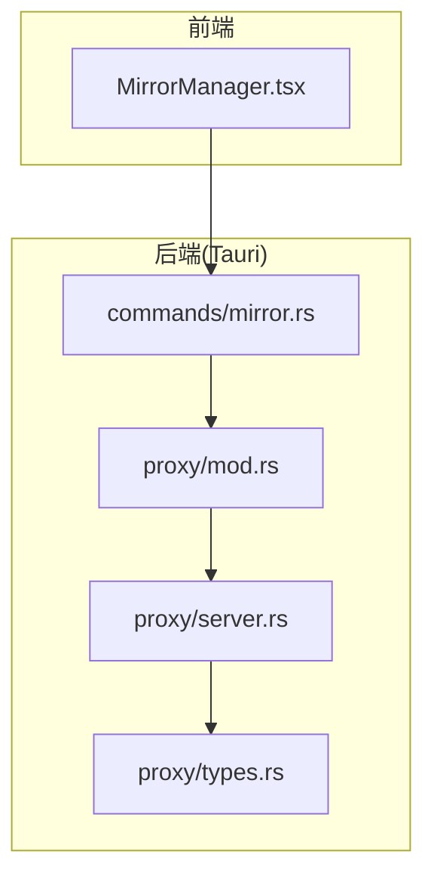
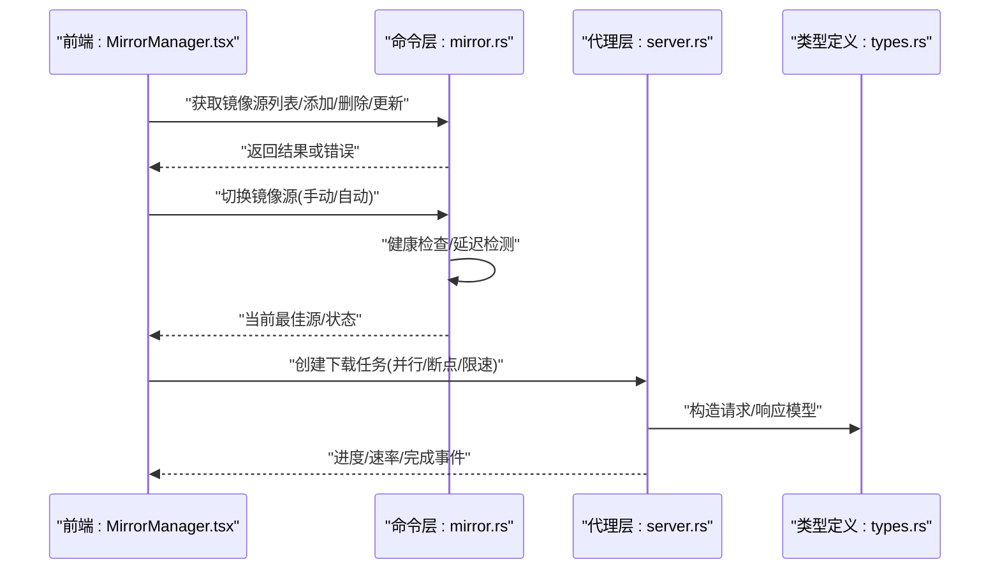
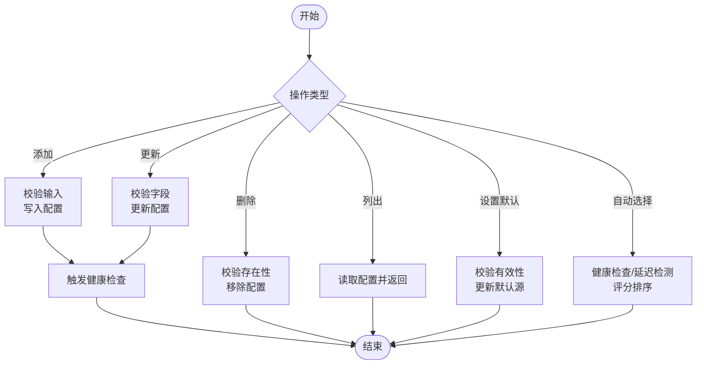
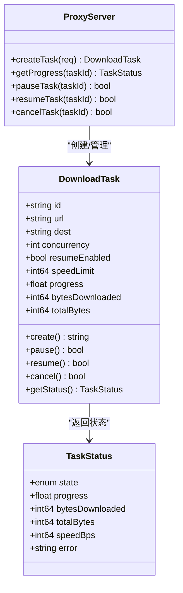
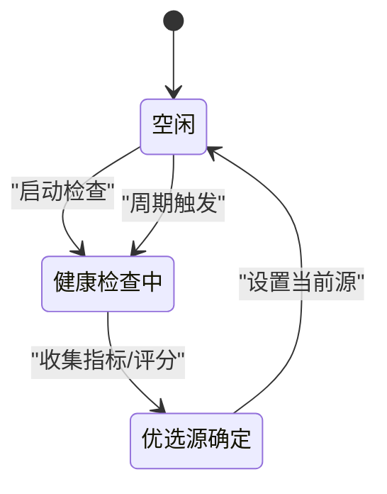
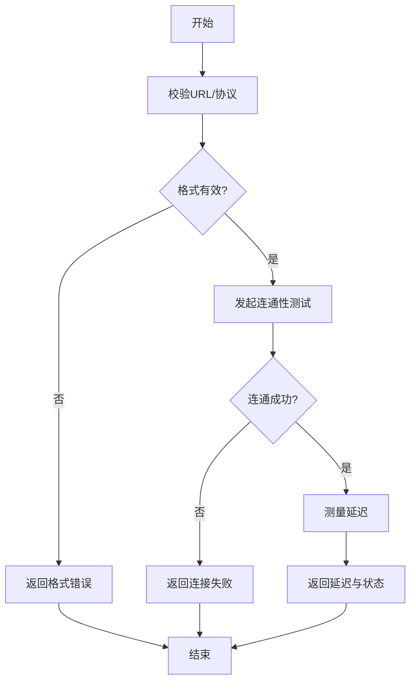

# 镜像源管理 API

<cite>
**本文引用的文件**   
- [src-tauri/src/commands/mirror.rs](file://src-tauri/src/commands/mirror.rs)
- [src/components/MirrorManager.tsx](file://src/components/MirrorManager.tsx)
- [src-tauri/src/proxy/server.rs](file://src-tauri/src/proxy/server.rs)
- [src-tauri/src/proxy/types.rs](file://src-tauri/src/proxy/types.rs)
- [src-tauri/src/proxy/mod.rs](file://src-tauri/src/proxy/mod.rs)
</cite>

## 目录
1. [简介](#简介)
2. [项目结构](#项目结构)
3. [核心组件](#核心组件)
4. [架构总览](#架构总览)
5. [详细组件分析](#详细组件分析)
6. [依赖分析](#依赖分析)
7. [性能考虑](#性能考虑)
8. [故障排查指南](#故障排查指南)
9. [结论](#结论)
10. [附录](#附录)

## 简介
本文件为 Any-Version 的“镜像源管理”功能提供全面的 API 文档，覆盖以下能力：
- 镜像源配置接口：添加、删除、更新、查询与批量操作
- 镜像下载加速接口：并行下载、断点续传、速度控制
- 镜像源切换接口：自动选择、手动切换、健康检查
- 辅助接口：镜像源验证、测试连接、延迟检测
- 使用示例与配置模板（以路径引用形式给出）

该功能由前端 UI 与后端命令层协作实现，并通过代理模块提供下载加速能力。

## 项目结构
镜像源管理相关代码主要分布在以下位置：
- 前端界面与交互：src/components/MirrorManager.tsx
- 后端命令层（Tauri 命令）：src-tauri/src/commands/mirror.rs
- 代理与下载加速：src-tauri/src/proxy/server.rs、types.rs、mod.rs

图表来源
- [src/components/MirrorManager.tsx](file://src/components/MirrorManager.tsx)
- [src-tauri/src/commands/mirror.rs](file://src-tauri/src/commands/mirror.rs)
- [src-tauri/src/proxy/mod.rs](file://src-tauri/src/proxy/mod.rs)
- [src-tauri/src/proxy/server.rs](file://src-tauri/src/proxy/server.rs)
- [src-tauri/src/proxy/types.rs](file://src-tauri/src/proxy/types.rs)

章节来源
- [src/components/MirrorManager.tsx](file://src/components/MirrorManager.tsx)
- [src-tauri/src/commands/mirror.rs](file://src-tauri/src/commands/mirror.rs)
- [src-tauri/src/proxy/mod.rs](file://src-tauri/src/proxy/mod.rs)
- [src-tauri/src/proxy/server.rs](file://src-tauri/src/proxy/server.rs)
- [src-tauri/src/proxy/types.rs](file://src-tauri/src/proxy/types.rs)

## 核心组件
- 镜像源配置管理（命令层）
  - 职责：维护镜像源集合、执行增删改查、持久化配置、触发健康检查与切换策略
  - 关键能力：添加/删除/更新镜像源；列出所有源；设置默认源；按规则自动选择最佳源
- 镜像下载加速（代理层）
  - 职责：提供高并发下载、分块并行、断点续传、限速与重试
  - 关键能力：创建下载任务、查询进度、暂停/恢复、取消、限速参数
- 镜像源切换与健康检查
  - 职责：周期性探测可用性与延迟，支持手动指定与自动择优
  - 关键能力：健康检查、延迟检测、失败回退、权重/优先级策略
- 辅助接口
  - 职责：验证镜像源可达性、连通性测试、延迟测量、错误诊断
  - 关键能力：ping/延迟、连通性校验、错误码说明

章节来源
- [src-tauri/src/commands/mirror.rs](file://src-tauri/src/commands/mirror.rs)
- [src-tauri/src/proxy/server.rs](file://src-tauri/src/proxy/server.rs)
- [src-tauri/src/proxy/types.rs](file://src-tauri/src/proxy/types.rs)

## 架构总览
整体调用链从前端的镜像管理面板发起，经由 Tauri 命令路由到后端逻辑，必要时通过代理服务进行下载加速与网络优化。

图表来源
- [src/components/MirrorManager.tsx](file://src/components/MirrorManager.tsx)
- [src-tauri/src/commands/mirror.rs](file://src-tauri/src/commands/mirror.rs)
- [src-tauri/src/proxy/server.rs](file://src-tauri/src/proxy/server.rs)
- [src-tauri/src/proxy/types.rs](file://src-tauri/src/proxy/types.rs)

## 详细组件分析

### 镜像源配置接口（命令层）
- 能力清单
  - 添加镜像源：注册新源并保存配置
  - 删除镜像源：移除指定源并清理关联缓存
  - 更新镜像源：修改名称、URL、优先级等属性
  - 列出镜像源：返回全部源及其状态
  - 设置默认源：指定当前生效的镜像源
  - 自动选择最佳源：基于健康度与延迟评分选择
- 典型流程
  - 添加/更新：校验输入 -> 写入配置 -> 触发健康检查 -> 返回结果
  - 删除：校验存在性 -> 移除配置 -> 清理资源 -> 返回结果
  - 自动选择：遍历候选源 -> 健康检查/延迟检测 -> 计算评分 -> 选择最优

图表来源
- [src-tauri/src/commands/mirror.rs](file://src-tauri/src/commands/mirror.rs)

章节来源
- [src-tauri/src/commands/mirror.rs](file://src-tauri/src/commands/mirror.rs)

### 镜像下载加速接口（代理层）
- 能力清单
  - 创建下载任务：指定 URL、目标路径、并发数、是否启用断点续传、限速阈值
  - 查询任务状态：进度百分比、已下载字节、剩余时间、当前速率
  - 控制任务：暂停、恢复、取消
  - 事件回调：进度更新、完成、失败（含错误码）
- 关键特性
  - 并行下载：将大文件分块并发拉取，合并后输出
  - 断点续传：记录已下载片段，异常恢复时从断点继续
  - 速度控制：全局或任务级限速，避免拥塞
  - 重试与回退：失败自动重试，可配置最大次数与退避策略

图表来源
- [src-tauri/src/proxy/server.rs](file://src-tauri/src/proxy/server.rs)
- [src-tauri/src/proxy/types.rs](file://src-tauri/src/proxy/types.rs)

章节来源
- [src-tauri/src/proxy/server.rs](file://src-tauri/src/proxy/server.rs)
- [src-tauri/src/proxy/types.rs](file://src-tauri/src/proxy/types.rs)

### 镜像源切换与健康检查
- 切换机制
  - 手动切换：用户指定某源为当前生效源
  - 自动切换：根据健康检查结果与延迟评分动态选择
- 健康检查
  - 周期探测：定时对每个源执行连通性与延迟检测
  - 指标采集：成功率、平均延迟、最近失败次数
  - 回退策略：当首选源不可用时，自动切换到次优源
- 延迟检测
  - 轻量探测：HTTP HEAD 或最小资源访问
  - 统计窗口：滑动窗口内多次采样取中位数

图表来源
- [src-tauri/src/commands/mirror.rs](file://src-tauri/src/commands/mirror.rs)

章节来源
- [src-tauri/src/commands/mirror.rs](file://src-tauri/src/commands/mirror.rs)

### 辅助接口（验证、测试连接、延迟检测）
- 验证镜像源：校验 URL 格式、协议、证书与权限
- 测试连接：尝试访问镜像根路径或索引文件，返回成功/失败
- 延迟检测：测量端到端往返时延，返回毫秒值
- 错误诊断：返回错误分类与建议修复步骤

图表来源
- [src-tauri/src/commands/mirror.rs](file://src-tauri/src/commands/mirror.rs)

章节来源
- [src-tauri/src/commands/mirror.rs](file://src-tauri/src/commands/mirror.rs)

### 前端集成与交互（MirrorManager）
- 职责
  - 展示镜像源列表与状态
  - 提供添加/删除/更新/切换入口
  - 显示下载任务进度与控制按钮
  - 触发健康检查与延迟检测
- 交互要点
  - 异步调用命令层接口，处理加载态与错误提示
  - 实时刷新任务进度与源健康状态
  - 支持批量操作与一键切换

章节来源
- [src/components/MirrorManager.tsx](file://src/components/MirrorManager.tsx)

## 依赖分析
- 组件耦合
  - 前端仅依赖命令层暴露的接口，不直接访问网络细节
  - 命令层负责业务编排与配置持久化，必要时委托代理层执行下载
  - 代理层封装下载算法与网络优化，对外暴露统一的任务管理接口
- 外部依赖
  - 网络库：用于 HTTP 请求、分块下载、流式传输
  - 文件系统：用于断点续传的元数据与临时文件管理
  - 配置存储：本地 JSON/数据库持久化镜像源配置

图表来源
- [src/components/MirrorManager.tsx](file://src/components/MirrorManager.tsx)
- [src-tauri/src/commands/mirror.rs](file://src-tauri/src/commands/mirror.rs)
- [src-tauri/src/proxy/server.rs](file://src-tauri/src/proxy/server.rs)
- [src-tauri/src/proxy/types.rs](file://src-tauri/src/proxy/types.rs)

章节来源
- [src/components/MirrorManager.tsx](file://src/components/MirrorManager.tsx)
- [src-tauri/src/commands/mirror.rs](file://src-tauri/src/commands/mirror.rs)
- [src-tauri/src/proxy/server.rs](file://src-tauri/src/proxy/server.rs)
- [src-tauri/src/proxy/types.rs](file://src-tauri/src/proxy/types.rs)

## 性能考虑
- 并行下载
  - 合理设置并发数，避免过多导致拥塞或频繁上下文切换
  - 结合文件大小与网络带宽动态调整
- 断点续传
  - 使用稳定的分块 ID 与偏移量，确保恢复一致性
  - 定期持久化进度，降低崩溃损失
- 速度控制
  - 全局限速与任务级限速相结合，优先保障关键任务
  - 自适应限速：根据网络质量动态调整
- 健康检查
  - 采用轻量探测与滑动窗口统计，减少开销
  - 错峰执行健康检查，避免与下载高峰冲突

[本节为通用指导，无需具体文件引用]

## 故障排查指南
- 常见问题
  - 镜像源不可达：检查 URL、代理设置、防火墙与证书
  - 下载中断：确认断点续传元数据完整，清理损坏临时文件
  - 速度过慢：降低并发或开启限速，检查网络拥塞
  - 自动切换未生效：查看健康检查日志与评分权重
- 定位方法
  - 查看命令层返回的错误码与消息
  - 检查代理层任务状态与错误堆栈
  - 使用辅助接口进行连通性与延迟测试

章节来源
- [src-tauri/src/commands/mirror.rs](file://src-tauri/src/commands/mirror.rs)
- [src-tauri/src/proxy/server.rs](file://src-tauri/src/proxy/server.rs)

## 结论
镜像源管理 API 通过清晰的职责划分与模块化设计，实现了灵活的源配置、高效的下载加速与可靠的切换策略。配合健康检查与辅助接口，系统能够在复杂网络环境下保持稳定与高性能。

[本节为总结，无需具体文件引用]

## 附录

### 使用示例（路径引用）
- 添加镜像源
  - 参考：[src-tauri/src/commands/mirror.rs](file://src-tauri/src/commands/mirror.rs)
- 删除镜像源
  - 参考：[src-tauri/src/commands/mirror.rs](file://src-tauri/src/commands/mirror.rs)
- 更新镜像源
  - 参考：[src-tauri/src/commands/mirror.rs](file://src-tauri/src/commands/mirror.rs)
- 列出镜像源
  - 参考：[src-tauri/src/commands/mirror.rs](file://src-tauri/src/commands/mirror.rs)
- 设置默认源
  - 参考：[src-tauri/src/commands/mirror.rs](file://src-tauri/src/commands/mirror.rs)
- 自动选择最佳源
  - 参考：[src-tauri/src/commands/mirror.rs](file://src-tauri/src/commands/mirror.rs)
- 创建下载任务（并行/断点/限速）
  - 参考：[src-tauri/src/proxy/server.rs](file://src-tauri/src/proxy/server.rs)
- 查询下载进度与控制任务
  - 参考：[src-tauri/src/proxy/server.rs](file://src-tauri/src/proxy/server.rs)
- 健康检查与延迟检测
  - 参考：[src-tauri/src/commands/mirror.rs](file://src-tauri/src/commands/mirror.rs)
- 前端交互入口
  - 参考：[src/components/MirrorManager.tsx](file://src/components/MirrorManager.tsx)

### 配置模板（路径引用）
- 镜像源配置项结构
  - 参考：[src-tauri/src/commands/mirror.rs](file://src-tauri/src/commands/mirror.rs)
- 下载任务参数结构
  - 参考：[src-tauri/src/proxy/types.rs](file://src-tauri/src/proxy/types.rs)