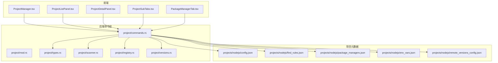
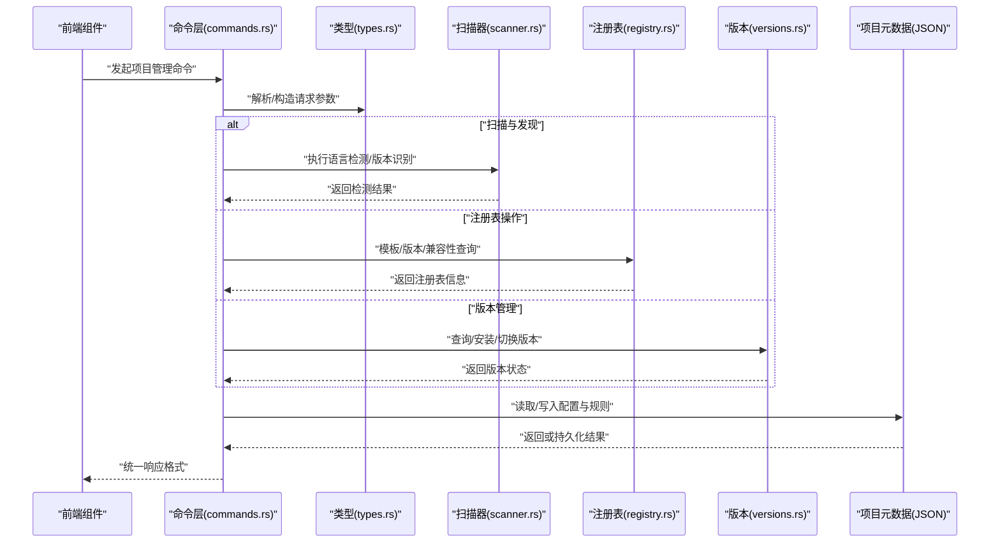
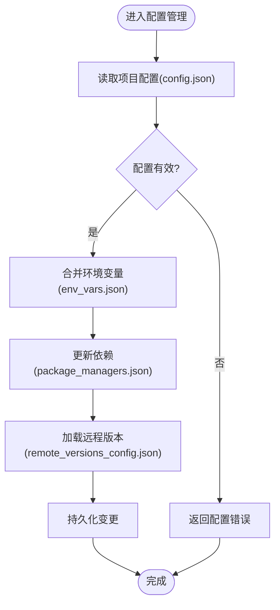
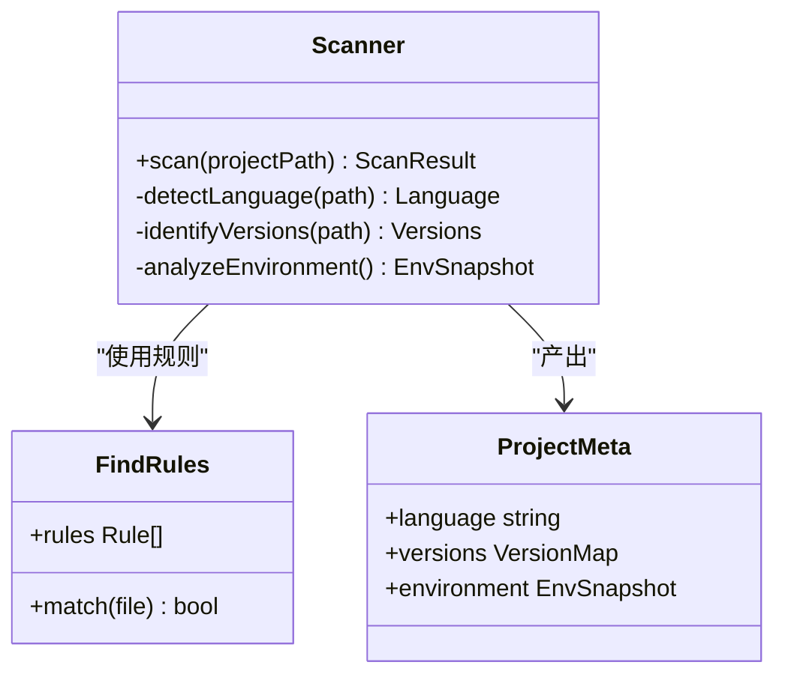
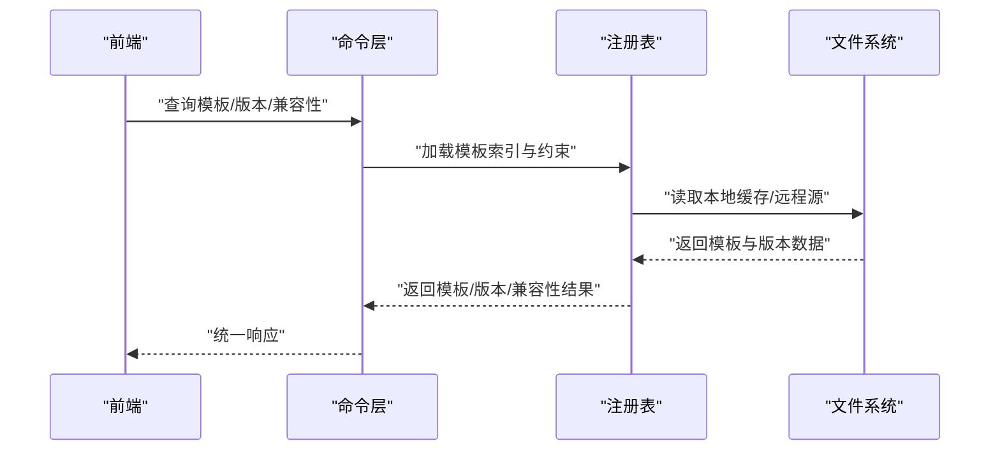
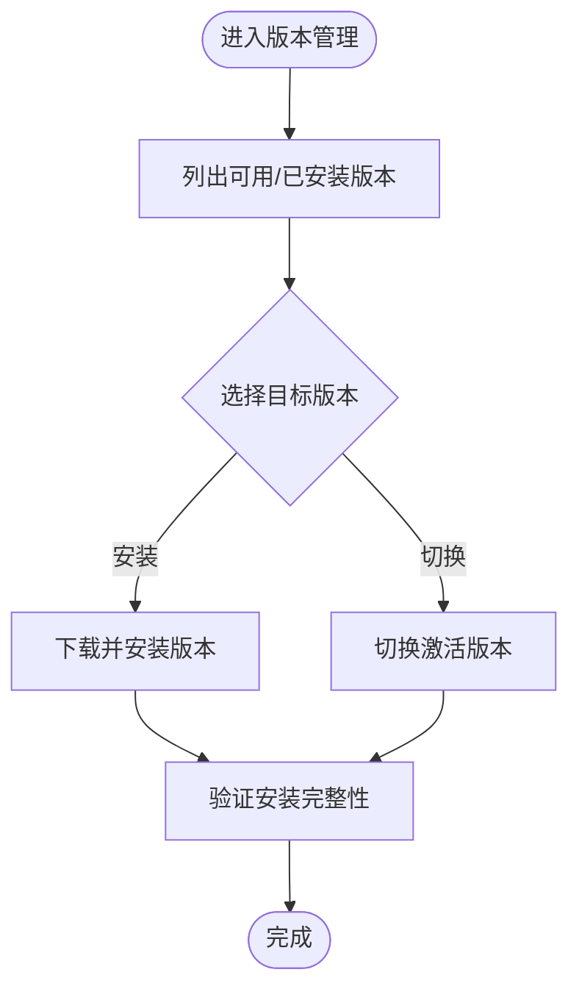
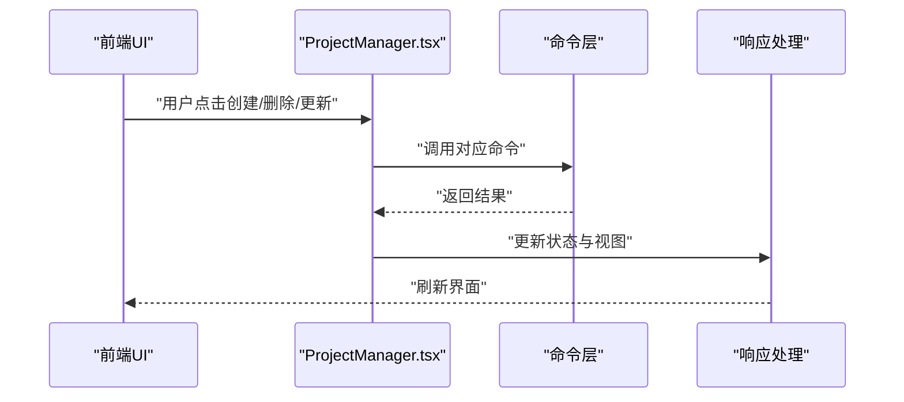
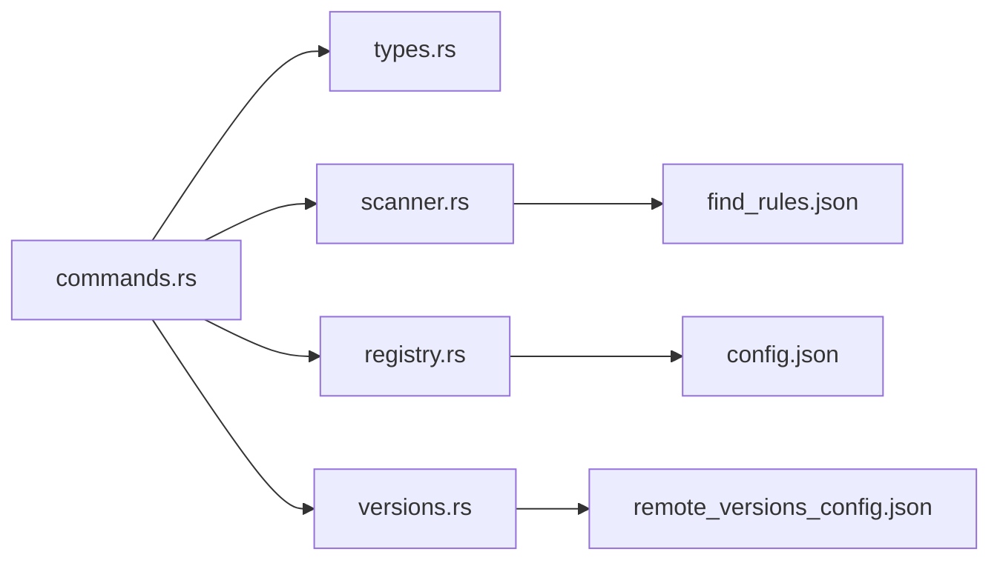

# 项目管理 API

<cite>
**本文引用的文件**   
- [src-tauri/src/commands/project/mod.rs](file://src-tauri/src/commands/project/mod.rs)
- [src-tauri/src/commands/project/commands.rs](file://src-tauri/src/commands/project/commands.rs)
- [src-tauri/src/commands/project/types.rs](file://src-tauri/src/commands/project/types.rs)
- [src-tauri/src/commands/project/scanner.rs](file://src-tauri/src/commands/project/scanner.rs)
- [src-tauri/src/commands/project/registry.rs](file://src-tauri/src/commands/project/registry.rs)
- [src-tauri/src/commands/project/versions.rs](file://src-tauri/src/commands/project/versions.rs)
- [src/components/project/ProjectManager.tsx](file://src/components/project/ProjectManager.tsx)
- [src/components/project/ProjectListPanel.tsx](file://src/components/project/ProjectListPanel.tsx)
- [src/components/project/ProjectDetailPanel.tsx](file://src/components/project/ProjectDetailPanel.tsx)
- [src/components/project/ProjectSubTabs.tsx](file://src/components/project/ProjectSubTabs.tsx)
- [src/components/project/ProjectSubTabs.types.ts](file://src/components/project/ProjectSubTabs.types.ts)
- [src/components/project/tabs/PackageManagerTab.tsx](file://src/components/project/tabs/PackageManagerTab.tsx)
- [projects/nodejs/config.json](file://projects/nodejs/config.json)
- [projects/nodejs/find_rules.json](file://projects/nodejs/find_rules.json)
- [projects/nodejs/package_managers.json](file://projects/nodejs/package_managers.json)
- [projects/nodejs/env_vars.json](file://projects/nodejs/env_vars.json)
- [projects/nodejs/remote_versions_config.json](file://projects/nodejs/remote_versions_config.json)
</cite>

## 目录
1. [简介](#简介)
2. [项目结构](#项目结构)
3. [核心组件](#核心组件)
4. [架构总览](#架构总览)
5. [详细组件分析](#详细组件分析)
6. [依赖关系分析](#依赖关系分析)
7. [性能考虑](#性能考虑)
8. [故障排查指南](#故障排查指南)
9. [结论](#结论)
10. [附录](#附录)

## 简介
本文件面向 Any-Version 的项目管理功能，提供完整、可操作的 API 文档。内容覆盖：
- 项目生命周期管理接口（创建、删除、更新等）
- 项目配置管理（配置文件读写、环境变量设置、依赖管理等）
- 项目扫描与发现（语言检测、版本识别、环境分析）
- 项目注册表（模板管理、版本控制、兼容性检查）
- 使用示例与集成指南（前端调用路径与后端命令映射）

目标读者包括开发者、集成方与运维人员，力求在保持技术深度的同时，提供清晰易懂的说明。

## 项目结构
本项目采用 Tauri 架构，前端为 React + TypeScript，后端命令集中在 Rust 模块中。与“项目管理”相关的核心代码分布如下：
- 后端命令层：src-tauri/src/commands/project/*
- 前端 UI 与交互：src/components/project/*
- 项目类型定义与规则：projects/*/config.json, find_rules.json, package_managers.json, env_vars.json, remote_versions_config.json

图表来源
- [src/components/project/ProjectManager.tsx](file://src/components/project/ProjectManager.tsx)
- [src/components/project/ProjectListPanel.tsx](file://src/components/project/ProjectListPanel.tsx)
- [src/components/project/ProjectDetailPanel.tsx](file://src/components/project/ProjectDetailPanel.tsx)
- [src/components/project/ProjectSubTabs.tsx](file://src/components/project/ProjectSubTabs.tsx)
- [src/components/project/tabs/PackageManagerTab.tsx](file://src/components/project/tabs/PackageManagerTab.tsx)
- [src-tauri/src/commands/project/mod.rs](file://src-tauri/src/commands/project/mod.rs)
- [src-tauri/src/commands/project/commands.rs](file://src-tauri/src/commands/project/commands.rs)
- [src-tauri/src/commands/project/types.rs](file://src-tauri/src/commands/project/types.rs)
- [src-tauri/src/commands/project/scanner.rs](file://src-tauri/src/commands/project/scanner.rs)
- [src-tauri/src/commands/project/registry.rs](file://src-tauri/src/commands/project/registry.rs)
- [src-tauri/src/commands/project/versions.rs](file://src-tauri/src/commands/project/versions.rs)
- [projects/nodejs/config.json](file://projects/nodejs/config.json)
- [projects/nodejs/find_rules.json](file://projects/nodejs/find_rules.json)
- [projects/nodejs/package_managers.json](file://projects/nodejs/package_managers.json)
- [projects/nodejs/env_vars.json](file://projects/nodejs/env_vars.json)
- [projects/nodejs/remote_versions_config.json](file://projects/nodejs/remote_versions_config.json)

章节来源
- [src-tauri/src/commands/project/mod.rs](file://src-tauri/src/commands/project/mod.rs)
- [src-tauri/src/commands/project/commands.rs](file://src-tauri/src/commands/project/commands.rs)
- [src-tauri/src/commands/project/types.rs](file://src-tauri/src/commands/project/types.rs)
- [src-tauri/src/commands/project/scanner.rs](file://src-tauri/src/commands/project/scanner.rs)
- [src-tauri/src/commands/project/registry.rs](file://src-tauri/src/commands/project/registry.rs)
- [src-tauri/src/commands/project/versions.rs](file://src-tauri/src/commands/project/versions.rs)
- [src/components/project/ProjectManager.tsx](file://src/components/project/ProjectManager.tsx)
- [src/components/project/ProjectListPanel.tsx](file://src/components/project/ProjectListPanel.tsx)
- [src/components/project/ProjectDetailPanel.tsx](file://src/components/project/ProjectDetailPanel.tsx)
- [src/components/project/ProjectSubTabs.tsx](file://src/components/project/ProjectSubTabs.tsx)
- [src/components/project/tabs/PackageManagerTab.tsx](file://src/components/project/tabs/PackageManagerTab.tsx)
- [projects/nodejs/config.json](file://projects/nodejs/config.json)
- [projects/nodejs/find_rules.json](file://projects/nodejs/find_rules.json)
- [projects/nodejs/package_managers.json](file://projects/nodejs/package_managers.json)
- [projects/nodejs/env_vars.json](file://projects/nodejs/env_vars.json)
- [projects/nodejs/remote_versions_config.json](file://projects/nodejs/remote_versions_config.json)

## 核心组件
- 命令路由与导出：负责将前端调用的命令分发到具体实现模块。
- 类型定义：统一前后端数据结构，确保请求/响应一致性。
- 扫描器：基于规则进行语言检测、版本识别与环境分析。
- 注册表：管理模板、版本信息与兼容性校验。
- 版本管理：封装版本查询、安装、切换等操作。
- 前端面板：提供项目列表、详情、包管理器操作等界面能力。

章节来源
- [src-tauri/src/commands/project/mod.rs](file://src-tauri/src/commands/project/mod.rs)
- [src-tauri/src/commands/project/types.rs](file://src-tauri/src/commands/project/types.rs)
- [src-tauri/src/commands/project/scanner.rs](file://src-tauri/src/commands/project/scanner.rs)
- [src-tauri/src/commands/project/registry.rs](file://src-tauri/src/commands/project/registry.rs)
- [src-tauri/src/commands/project/versions.rs](file://src-tauri/src/commands/project/versions.rs)
- [src/components/project/ProjectListPanel.tsx](file://src/components/project/ProjectListPanel.tsx)
- [src/components/project/ProjectDetailPanel.tsx](file://src/components/project/ProjectDetailPanel.tsx)
- [src/components/project/tabs/PackageManagerTab.tsx](file://src/components/project/tabs/PackageManagerTab.tsx)

## 架构总览
下图展示了从前端到后端的调用链路以及关键数据源。

图表来源
- [src-tauri/src/commands/project/commands.rs](file://src-tauri/src/commands/project/commands.rs)
- [src-tauri/src/commands/project/types.rs](file://src-tauri/src/commands/project/types.rs)
- [src-tauri/src/commands/project/scanner.rs](file://src-tauri/src/commands/project/scanner.rs)
- [src-tauri/src/commands/project/registry.rs](file://src-tauri/src/commands/project/registry.rs)
- [src-tauri/src/commands/project/versions.rs](file://src-tauri/src/commands/project/versions.rs)
- [projects/nodejs/config.json](file://projects/nodejs/config.json)
- [projects/nodejs/find_rules.json](file://projects/nodejs/find_rules.json)
- [projects/nodejs/package_managers.json](file://projects/nodejs/package_managers.json)
- [projects/nodejs/env_vars.json](file://projects/nodejs/env_vars.json)
- [projects/nodejs/remote_versions_config.json](file://projects/nodejs/remote_versions_config.json)

## 详细组件分析

### 项目生命周期管理接口
- 主要职责
  - 创建项目：根据模板与规则初始化项目目录结构与基础配置。
  - 删除项目：安全移除项目目录与相关缓存。
  - 更新项目：合并配置变更、同步依赖、应用补丁。
- 典型流程
  - 前端通过命令层触发生命周期操作。
  - 命令层校验参数并调用相应子模块（扫描器/注册表/版本）。
  - 对文件系统与元数据进行原子性更新，失败时回滚。
- 错误处理
  - 参数校验失败返回明确错误码。
  - 文件 I/O 异常捕获并记录上下文。
  - 并发冲突采用锁机制避免重复操作。

章节来源
- [src-tauri/src/commands/project/commands.rs](file://src-tauri/src/commands/project/commands.rs)
- [src-tauri/src/commands/project/types.rs](file://src-tauri/src/commands/project/types.rs)

### 项目配置管理 API
- 配置文件读写
  - 支持多语言项目的 config.json 读写与校验。
  - 提供增量更新与全量替换两种模式。
- 环境变量设置
  - 读取/写入 env_vars.json，支持按环境区分。
  - 提供变量注入与清理能力。
- 依赖管理
  - 基于 package_managers.json 描述各语言的包管理器行为。
  - 支持安装、升级、锁定版本与镜像源切换。
- 远程版本配置
  - 通过 remote_versions_config.json 指定版本源与策略。

图表来源
- [projects/nodejs/config.json](file://projects/nodejs/config.json)
- [projects/nodejs/env_vars.json](file://projects/nodejs/env_vars.json)
- [projects/nodejs/package_managers.json](file://projects/nodejs/package_managers.json)
- [projects/nodejs/remote_versions_config.json](file://projects/nodejs/remote_versions_config.json)

章节来源
- [src-tauri/src/commands/project/commands.rs](file://src-tauri/src/commands/project/commands.rs)
- [projects/nodejs/config.json](file://projects/nodejs/config.json)
- [projects/nodejs/env_vars.json](file://projects/nodejs/env_vars.json)
- [projects/nodejs/package_managers.json](file://projects/nodejs/package_managers.json)
- [projects/nodejs/remote_versions_config.json](file://projects/nodejs/remote_versions_config.json)

### 项目扫描与发现接口
- 语言检测
  - 依据 find_rules.json 中的匹配规则识别项目语言与框架。
- 版本识别
  - 解析包清单与运行时标识，推断当前使用的 SDK/工具链版本。
- 环境分析
  - 收集 PATH、系统库、可用包管理器等信息，生成运行环境快照。
- 输出结构
  - 标准化扫描结果，便于后续注册表与版本管理消费。

图表来源
- [src-tauri/src/commands/project/scanner.rs](file://src-tauri/src/commands/project/scanner.rs)
- [projects/nodejs/find_rules.json](file://projects/nodejs/find_rules.json)

章节来源
- [src-tauri/src/commands/project/scanner.rs](file://src-tauri/src/commands/project/scanner.rs)
- [projects/nodejs/find_rules.json](file://projects/nodejs/find_rules.json)

### 项目注册表 API
- 模板管理
  - 提供模板列表、详情与下载能力。
  - 支持模板版本选择与回滚。
- 版本控制
  - 维护模板与工具的版本索引。
  - 提供语义化版本比较与约束解析。
- 兼容性检查
  - 基于宿主环境与目标模板的约束进行兼容判定。
  - 给出冲突项与建议修复方案。

图表来源
- [src-tauri/src/commands/project/registry.rs](file://src-tauri/src/commands/project/registry.rs)

章节来源
- [src-tauri/src/commands/project/registry.rs](file://src-tauri/src/commands/project/registry.rs)

### 版本管理 API
- 版本查询
  - 列出可用版本、已安装版本与当前激活版本。
- 版本安装/切换
  - 支持按语义化版本安装与切换。
  - 提供安装进度与失败重试。
- 版本清理
  - 清理未使用版本与临时文件。

图表来源
- [src-tauri/src/commands/project/versions.rs](file://src-tauri/src/commands/project/versions.rs)

章节来源
- [src-tauri/src/commands/project/versions.rs](file://src-tauri/src/commands/project/versions.rs)

### 前端集成与调用示例
- 入口组件
  - ProjectManager.tsx：聚合项目相关命令调用与状态管理。
- 列表与详情
  - ProjectListPanel.tsx：展示项目列表与基本操作入口。
  - ProjectDetailPanel.tsx：展示项目详情、配置与操作面板。
- 子标签页
  - ProjectSubTabs.tsx：按功能划分子标签页（如包管理器、环境等）。
  - PackageManagerTab.tsx：封装包管理器相关的前端交互。
- 类型对齐
  - ProjectSubTabs.types.ts：定义子标签页的数据结构与枚举。

图表来源
- [src/components/project/ProjectManager.tsx](file://src/components/project/ProjectManager.tsx)
- [src/components/project/ProjectListPanel.tsx](file://src/components/project/ProjectListPanel.tsx)
- [src/components/project/ProjectDetailPanel.tsx](file://src/components/project/ProjectDetailPanel.tsx)
- [src/components/project/ProjectSubTabs.tsx](file://src/components/project/ProjectSubTabs.tsx)
- [src/components/project/tabs/PackageManagerTab.tsx](file://src/components/project/tabs/PackageManagerTab.tsx)
- [src/components/project/ProjectSubTabs.types.ts](file://src/components/project/ProjectSubTabs.types.ts)

章节来源
- [src/components/project/ProjectManager.tsx](file://src/components/project/ProjectManager.tsx)
- [src/components/project/ProjectListPanel.tsx](file://src/components/project/ProjectListPanel.tsx)
- [src/components/project/ProjectDetailPanel.tsx](file://src/components/project/ProjectDetailPanel.tsx)
- [src/components/project/ProjectSubTabs.tsx](file://src/components/project/ProjectSubTabs.tsx)
- [src/components/project/tabs/PackageManagerTab.tsx](file://src/components/project/tabs/PackageManagerTab.tsx)
- [src/components/project/ProjectSubTabs.types.ts](file://src/components/project/ProjectSubTabs.types.ts)

## 依赖关系分析
- 模块耦合
  - 命令层集中编排扫描器、注册表与版本管理，降低前端复杂度。
  - 类型定义作为契约，保证前后端数据结构一致。
- 外部依赖
  - 文件系统访问用于读写项目元数据与模板缓存。
  - 网络访问用于拉取远程版本与模板资源（由注册表模块负责）。
- 潜在循环依赖
  - 通过分层与接口隔离避免循环引用；若新增模块，建议遵循单向依赖原则。

图表来源
- [src-tauri/src/commands/project/commands.rs](file://src-tauri/src/commands/project/commands.rs)
- [src-tauri/src/commands/project/types.rs](file://src-tauri/src/commands/project/types.rs)
- [src-tauri/src/commands/project/scanner.rs](file://src-tauri/src/commands/project/scanner.rs)
- [src-tauri/src/commands/project/registry.rs](file://src-tauri/src/commands/project/registry.rs)
- [src-tauri/src/commands/project/versions.rs](file://src-tauri/src/commands/project/versions.rs)
- [projects/nodejs/find_rules.json](file://projects/nodejs/find_rules.json)
- [projects/nodejs/config.json](file://projects/nodejs/config.json)
- [projects/nodejs/remote_versions_config.json](file://projects/nodejs/remote_versions_config.json)

章节来源
- [src-tauri/src/commands/project/mod.rs](file://src-tauri/src/commands/project/mod.rs)
- [src-tauri/src/commands/project/commands.rs](file://src-tauri/src/commands/project/commands.rs)

## 性能考虑
- 批量操作
  - 对大量项目扫描与版本查询应支持分页与并行化，减少阻塞。
- 缓存策略
  - 对模板索引、版本列表与环境快照引入短期缓存，降低重复计算。
- 增量更新
  - 配置与依赖更新尽量采用增量合并，避免全量重写。
- I/O 优化
  - 大文件写入采用原子替换与事务式提交，提升可靠性与速度。

## 故障排查指南
- 常见问题
  - 配置校验失败：检查 config.json 与 env_vars.json 的字段与类型。
  - 扫描结果为空：确认 find_rules.json 是否包含匹配规则。
  - 版本不可用：核对 remote_versions_config.json 的源地址与权限。
- 日志与诊断
  - 关注命令层的错误堆栈与上下文信息。
  - 对文件 I/O 与网络请求增加重试与超时控制。
- 恢复策略
  - 失败时回滚至上一稳定状态。
  - 提供一键清理与重建缓存的能力。

章节来源
- [src-tauri/src/commands/project/commands.rs](file://src-tauri/src/commands/project/commands.rs)
- [src-tauri/src/commands/project/scanner.rs](file://src-tauri/src/commands/project/scanner.rs)
- [src-tauri/src/commands/project/registry.rs](file://src-tauri/src/commands/project/registry.rs)
- [src-tauri/src/commands/project/versions.rs](file://src-tauri/src/commands/project/versions.rs)

## 结论
Any-Version 的项目管理 API 以清晰的层次与明确的契约组织，覆盖了从项目发现、配置管理到模板与版本控制的完整链路。通过统一的命令层与类型定义，前端得以高效集成，同时保证了扩展性与可维护性。建议在集成过程中严格遵循类型契约，并结合缓存与批量化策略提升整体性能。

## 附录
- 术语
  - 模板：预定义的项目骨架与初始配置。
  - 版本：SDK/工具链/依赖的具体发行版。
  - 兼容性：宿主环境与目标模板/版本的适配程度。
- 最佳实践
  - 变更前备份项目元数据。
  - 使用语义化版本约束，避免破坏性升级。
  - 对敏感环境变量进行加密存储与最小权限访问。