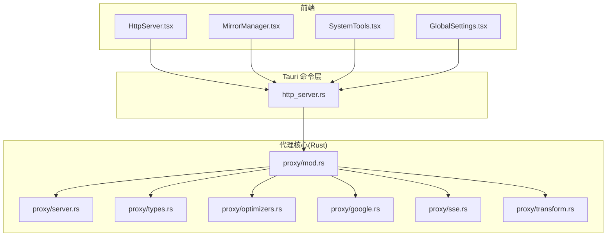
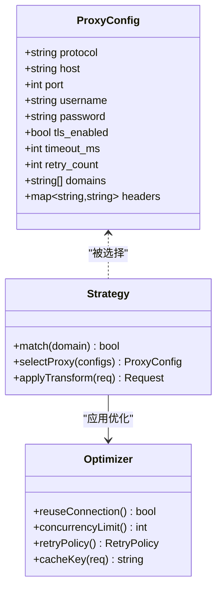
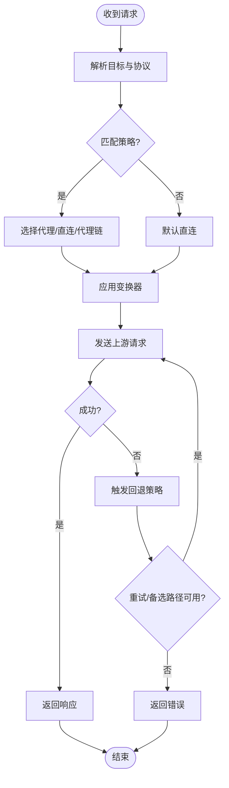
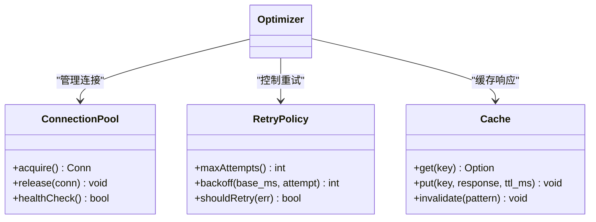
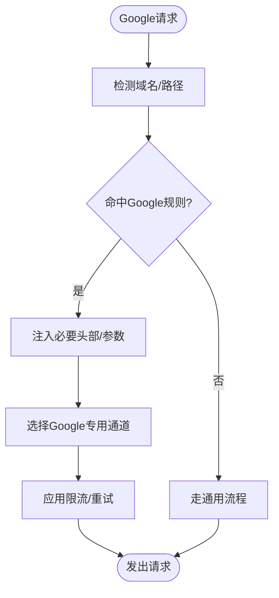
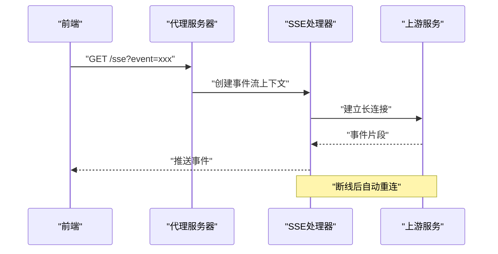
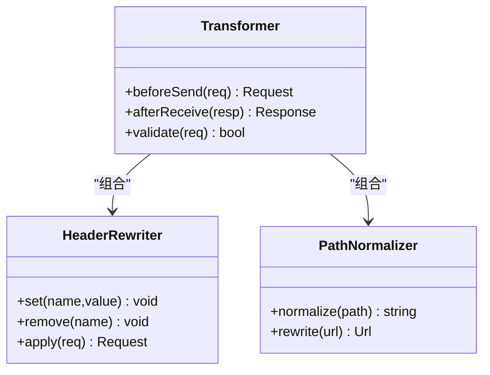
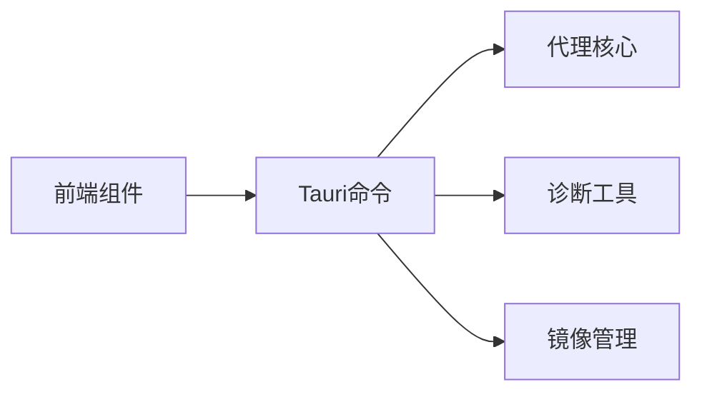
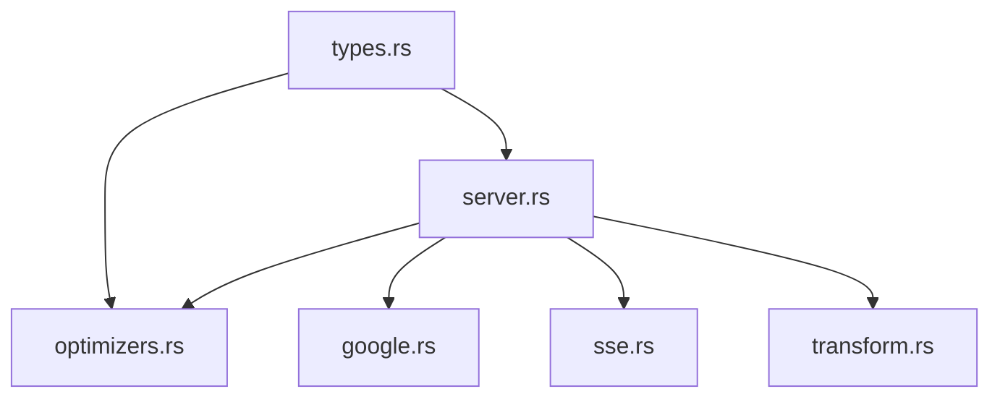

# 代理和网络优化

<cite>
**本文引用的文件**   
- [src-tauri/src/proxy/mod.rs](file://src-tauri/src/proxy/mod.rs)
- [src-tauri/src/proxy/server.rs](file://src-tauri/src/proxy/server.rs)
- [src-tauri/src/proxy/types.rs](file://src-tauri/src/proxy/types.rs)
- [src-tauri/src/proxy/optimizers.rs](file://src-tauri/src/proxy/optimizers.rs)
- [src-tauri/src/proxy/google.rs](file://src-tauri/src/proxy/google.rs)
- [src-tauri/src/proxy/sse.rs](file://src-tauri/src/proxy/sse.rs)
- [src-tauri/src/proxy/transform.rs](file://src-tauri/src/proxy/transform.rs)
- [src-tauri/src/commands/http_server.rs](file://src-tauri/src/commands/http_server.rs)
- [src/components/HttpServer.tsx](file://src/components/HttpServer.tsx)
- [src/components/MirrorManager.tsx](file://src/components/MirrorManager.tsx)
- [src/components/SystemTools.tsx](file://src/components/SystemTools.tsx)
- [src/components/GlobalSettings.tsx](file://src/components/GlobalSettings.tsx)
</cite>

## 目录
1. [简介](#简介)
2. [项目结构](#项目结构)
3. [核心组件](#核心组件)
4. [架构总览](#架构总览)
5. [详细组件分析](#详细组件分析)
6. [依赖关系分析](#依赖关系分析)
7. [性能考虑](#性能考虑)
8. [故障排查指南](#故障排查指南)
9. [结论](#结论)
10. [附录](#附录)

## 简介
本章节面向“代理和网络优化”能力，覆盖以下主题：
- 代理配置原理与设置方法（HTTP、HTTPS、SOCKS5）
- 网络请求优化机制与智能路由策略
- SSE（Server-Sent Events）处理与实时通信
- Google API 代理优化与其他第三方服务特殊处理
- 网络诊断工具与调试方法
- 不同网络环境下的配置示例与最佳实践
- 代理链配置与高可用部署方案
- 初学者入门指导与高级用户深度定制、性能调优选项

## 项目结构
本项目采用前后端分离的 Tauri 应用结构。与代理和网络优化相关的后端逻辑集中在 Rust 模块 src-tauri/src/proxy 下，前端通过命令通道调用后端能力，并在 UI 中提供可视化配置与管理入口。



图表来源
- [src/components/HttpServer.tsx](file://src/components/HttpServer.tsx)
- [src/components/MirrorManager.tsx](file://src/components/MirrorManager.tsx)
- [src/components/SystemTools.tsx](file://src/components/SystemTools.tsx)
- [src/components/GlobalSettings.tsx](file://src/components/GlobalSettings.tsx)
- [src-tauri/src/commands/http_server.rs](file://src-tauri/src/commands/http_server.rs)
- [src-tauri/src/proxy/mod.rs](file://src-tauri/src/proxy/mod.rs)
- [src-tauri/src/proxy/server.rs](file://src-tauri/src/proxy/server.rs)
- [src-tauri/src/proxy/types.rs](file://src-tauri/src/proxy/types.rs)
- [src-tauri/src/proxy/optimizers.rs](file://src-tauri/src/proxy/optimizers.rs)
- [src-tauri/src/proxy/google.rs](file://src-tauri/src/proxy/google.rs)
- [src-tauri/src/proxy/sse.rs](file://src-tauri/src/proxy/sse.rs)
- [src-tauri/src/proxy/transform.rs](file://src-tauri/src/proxy/transform.rs)

章节来源
- [src-tauri/src/proxy/mod.rs](file://src-tauri/src/proxy/mod.rs)
- [src-tauri/src/commands/http_server.rs](file://src-tauri/src/commands/http_server.rs)
- [src/components/HttpServer.tsx](file://src/components/HttpServer.tsx)

## 核心组件
- 代理类型与配置模型：定义代理协议、认证、超时、重试等统一数据结构，供上层统一消费。
- 代理服务器与调度器：负责监听本地端口、解析请求、选择上游代理或直连、执行转换与优化。
- 优化器：实现连接复用、并发控制、缓存、压缩、重试退避等通用优化策略。
- Google API 专用优化：针对 Google 服务的域名、路径、头部进行适配与加速。
- SSE 处理器：支持服务端推送事件流，保持长连接并转发事件片段。
- 变换器：对请求/响应进行头字段改写、鉴权注入、内容裁剪等。
- 命令层与前端集成：通过 Tauri 命令暴露 HTTP 代理管理、镜像站点切换、系统网络诊断等能力。

章节来源
- [src-tauri/src/proxy/types.rs](file://src-tauri/src/proxy/types.rs)
- [src-tauri/src/proxy/server.rs](file://src-tauri/src/proxy/server.rs)
- [src-tauri/src/proxy/optimizers.rs](file://src-tauri/src/proxy/optimizers.rs)
- [src-tauri/src/proxy/google.rs](file://src-tauri/src/proxy/google.rs)
- [src-tauri/src/proxy/sse.rs](file://src-tauri/src/proxy/sse.rs)
- [src-tauri/src/proxy/transform.rs](file://src-tauri/src/proxy/transform.rs)
- [src-tauri/src/commands/http_server.rs](file://src-tauri/src/commands/http_server.rs)
- [src/components/HttpServer.tsx](file://src/components/HttpServer.tsx)

## 架构总览
整体数据流从前端的 UI 操作开始，经由 Tauri 命令层进入代理核心，由调度器根据目标域、协议与策略选择最优路径（直连、单级代理、多级代理链），在传输过程中应用优化器与变换器，必要时走 Google 专用通道或启用 SSE 长连接。

```mermaid
sequenceDiagram
participant UI as "前端界面"
participant Cmd as "Tauri命令层"
participant Core as "代理核心(mod.rs)"
participant Srv as "代理服务器(server.rs)"
participant Opt as "优化器(optimizers.rs)"
participant G as "Google优化(google.rs)"
participant SSE as "SSE处理器(sse.rs)"
participant X as "变换器(transform.rs)"
UI->>Cmd : "启动/配置代理"
Cmd->>Core : "加载配置与策略"
Core->>Srv : "创建并绑定本地监听"
UI->>Cmd : "发起网络请求"
Cmd->>Srv : "转发到代理服务器"
Srv->>Core : "解析目标与协议"
Core->>G : "判断是否命中Google规则"
alt 命中Google
Core-->>Srv : "使用Google专用通道"
else 普通目标
Core-->>Srv : "选择直连/代理/代理链"
end
Srv->>Opt : "应用连接复用/并发/重试"
Srv->>X : "执行请求/响应变换"
alt 需要SSE
Srv->>SSE : "建立事件流"
SSE-->>UI : "持续推送事件"
else 常规HTTP
Srv-->>UI : "返回响应体"
end
```

图表来源
- [src-tauri/src/proxy/mod.rs](file://src-tauri/src/proxy/mod.rs)
- [src-tauri/src/proxy/server.rs](file://src-tauri/src/proxy/server.rs)
- [src-tauri/src/proxy/optimizers.rs](file://src-tauri/src/proxy/optimizers.rs)
- [src-tauri/src/proxy/google.rs](file://src-tauri/src/proxy/google.rs)
- [src-tauri/src/proxy/sse.rs](file://src-tauri/src/proxy/sse.rs)
- [src-tauri/src/proxy/transform.rs](file://src-tauri/src/proxy/transform.rs)
- [src-tauri/src/commands/http_server.rs](file://src-tauri/src/commands/http_server.rs)
- [src/components/HttpServer.tsx](file://src/components/HttpServer.tsx)

## 详细组件分析

### 代理类型与配置模型
- 支持的协议：HTTP、HTTPS、SOCKS5
- 关键属性：地址、端口、用户名/密码、TLS 参数、超时、重试次数、白名单/黑名单、按域分流规则
- 扩展点：可插拔的策略匹配器与自定义变换器



图表来源
- [src-tauri/src/proxy/types.rs](file://src-tauri/src/proxy/types.rs)
- [src-tauri/src/proxy/optimizers.rs](file://src-tauri/src/proxy/optimizers.rs)

章节来源
- [src-tauri/src/proxy/types.rs](file://src-tauri/src/proxy/types.rs)

### 代理服务器与调度器
- 功能要点：
  - 本地监听端口，接收来自应用的 HTTP/HTTPS/SOCKS5 请求
  - 基于目标域与策略表选择上游代理或直连
  - 支持代理链：将前一个代理的输出作为下一个代理的输入
  - 错误回退：当某条路径失败时自动尝试备选路径
- 关键流程：
  - 请求解析 -> 策略匹配 -> 路径选择 -> 执行变换 -> 发送上游 -> 响应组装



图表来源
- [src-tauri/src/proxy/server.rs](file://src-tauri/src/proxy/server.rs)
- [src-tauri/src/proxy/mod.rs](file://src-tauri/src/proxy/mod.rs)

章节来源
- [src-tauri/src/proxy/server.rs](file://src-tauri/src/proxy/server.rs)
- [src-tauri/src/proxy/mod.rs](file://src-tauri/src/proxy/mod.rs)

### 网络请求优化机制
- 连接复用：减少握手开销，提升吞吐
- 并发控制：限制最大并发数，避免资源耗尽
- 重试与退避：指数退避与抖动，提高稳定性
- 缓存：对幂等 GET 请求进行短期缓存
- 压缩：按需启用 gzip/br 压缩以减少带宽占用



图表来源
- [src-tauri/src/proxy/optimizers.rs](file://src-tauri/src/proxy/optimizers.rs)

章节来源
- [src-tauri/src/proxy/optimizers.rs](file://src-tauri/src/proxy/optimizers.rs)

### Google API 代理优化
- 适用场景：访问 Google 相关服务时的域名识别、路径匹配、头部注入与限速保护
- 特性：
  - 域名白名单与路径正则匹配
  - 鉴权头自动注入（如必要）
  - 限流与重试策略增强
  - 可选的专用中转节点



图表来源
- [src-tauri/src/proxy/google.rs](file://src-tauri/src/proxy/google.rs)
- [src-tauri/src/proxy/transform.rs](file://src-tauri/src/proxy/transform.rs)

章节来源
- [src-tauri/src/proxy/google.rs](file://src-tauri/src/proxy/google.rs)
- [src-tauri/src/proxy/transform.rs](file://src-tauri/src/proxy/transform.rs)

### SSE（Server-Sent Events）处理与实时通信
- 能力：
  - 建立与服务端的事件流连接
  - 逐块转发事件片段至前端
  - 断线重连与心跳保活
- 典型用途：日志流、进度更新、实时通知



图表来源
- [src-tauri/src/proxy/sse.rs](file://src-tauri/src/proxy/sse.rs)
- [src-tauri/src/proxy/server.rs](file://src-tauri/src/proxy/server.rs)

章节来源
- [src-tauri/src/proxy/sse.rs](file://src-tauri/src/proxy/sse.rs)
- [src-tauri/src/proxy/server.rs](file://src-tauri/src/proxy/server.rs)

### 变换器（Transform）
- 作用：对请求/响应进行统一改造，包括：
  - 头部重写（Host、User-Agent、鉴权头等）
  - 路径替换与查询参数标准化
  - 敏感信息脱敏与日志裁剪
  - 压缩开关与内容长度调整



图表来源
- [src-tauri/src/proxy/transform.rs](file://src-tauri/src/proxy/transform.rs)

章节来源
- [src-tauri/src/proxy/transform.rs](file://src-tauri/src/proxy/transform.rs)

### 命令层与前端集成
- 命令层职责：
  - 暴露 HTTP 代理启停、配置更新、状态查询接口
  - 聚合镜像站点管理与系统网络诊断能力
- 前端职责：
  - 提供可视化配置面板与一键切换
  - 展示代理状态、延迟、错误统计
  - 触发诊断任务并展示结果



图表来源
- [src-tauri/src/commands/http_server.rs](file://src-tauri/src/commands/http_server.rs)
- [src/components/HttpServer.tsx](file://src/components/HttpServer.tsx)
- [src/components/MirrorManager.tsx](file://src/components/MirrorManager.tsx)
- [src/components/SystemTools.tsx](file://src/components/SystemTools.tsx)

章节来源
- [src-tauri/src/commands/http_server.rs](file://src-tauri/src/commands/http_server.rs)
- [src/components/HttpServer.tsx](file://src/components/HttpServer.tsx)
- [src/components/MirrorManager.tsx](file://src/components/MirrorManager.tsx)
- [src/components/SystemTools.tsx](file://src/components/SystemTools.tsx)

## 依赖关系分析
- 模块内聚性：
  - types 提供统一的数据模型，降低耦合
  - server 作为入口，协调 optimizers、google、sse、transform
- 外部依赖：
  - 网络栈与 TLS 库（用于 HTTPS 与 SOCKS5 隧道）
  - 事件流与异步运行时（用于 SSE 与并发控制）
- 潜在循环依赖：
  - 确保 transform 不反向依赖 server，仅通过函数式接口被调用



图表来源
- [src-tauri/src/proxy/types.rs](file://src-tauri/src/proxy/types.rs)
- [src-tauri/src/proxy/server.rs](file://src-tauri/src/proxy/server.rs)
- [src-tauri/src/proxy/optimizers.rs](file://src-tauri/src/proxy/optimizers.rs)
- [src-tauri/src/proxy/google.rs](file://src-tauri/src/proxy/google.rs)
- [src-tauri/src/proxy/sse.rs](file://src-tauri/src/proxy/sse.rs)
- [src-tauri/src/proxy/transform.rs](file://src-tauri/src/proxy/transform.rs)

章节来源
- [src-tauri/src/proxy/mod.rs](file://src-tauri/src/proxy/mod.rs)

## 性能考虑
- 连接池大小与 TTL：根据目标服务 QPS 与延迟特征动态调整
- 并发上限：避免 CPU/内存峰值过高导致抖动
- 重试退避：合理设置最大重试次数与退避基数，防止雪崩
- 缓存命中率：对热点静态资源开启短 TTL 缓存
- 压缩开关：仅在带宽受限环境下启用，避免 CPU 瓶颈
- 代理链长度：尽量控制在 2 级以内，减少累积延迟

[本节为通用性能建议，无需特定文件引用]

## 故障排查指南
- 常见问题定位：
  - 无法连接上游：检查代理地址、端口、认证、TLS 证书
  - 频繁超时：评估网络质量、代理负载、重试策略
  - 鉴权失败：确认头部注入是否正确、令牌有效期
  - SSE 中断：查看心跳间隔、重连策略、上游稳定性
- 诊断工具：
  - 连通性测试：ping、traceroute、curl/wget 抓包
  - 延迟与丢包：网络质量测量与对比
  - 代理链路追踪：记录每跳耗时与错误码
- 日志与指标：
  - 记录请求 ID、目标域、选择的代理路径、耗时、错误码
  - 监控连接池利用率、缓存命中率、重试率

章节来源
- [src/components/SystemTools.tsx](file://src/components/SystemTools.tsx)
- [src-tauri/src/commands/http_server.rs](file://src-tauri/src/commands/http_server.rs)

## 结论
本方案以统一的代理类型与策略为核心，结合优化器、变换器与专用通道（如 Google），实现了灵活、稳定且高性能的网络访问能力。通过 SSE 支持实时通信，配合完善的诊断与监控手段，可在复杂网络环境中提供一致的用户体验。

[本节为总结性内容，无需特定文件引用]

## 附录

### 代理配置原理与设置方法
- 协议支持：
  - HTTP：适用于大多数 Web 服务，支持基本认证
  - HTTPS：加密传输，需正确配置 CA 证书与主机名校验
  - SOCKS5：适用于更广泛的 TCP 流量，适合代理链与匿名需求
- 配置项说明：
  - 地址与端口：上游代理的可达地址
  - 认证：用户名/密码或 Token
  - TLS：是否启用、证书路径、跳过校验（谨慎使用）
  - 超时与重试：根据业务容忍度设定
  - 白名单/黑名单：按域名的精细分流
- 设置步骤：
  - 在前端界面添加代理条目，保存后生效
  - 或通过命令层批量导入配置
  - 验证连通性与延迟

章节来源
- [src/components/HttpServer.tsx](file://src/components/HttpServer.tsx)
- [src-tauri/src/commands/http_server.rs](file://src-tauri/src/commands/http_server.rs)

### 智能路由策略
- 策略维度：
  - 目标域匹配：精确域名、通配符、正则表达式
  - 协议与路径：按 URL 模式分流
  - 服务质量：基于历史延迟与成功率动态选择
- 决策流程：
  - 优先级排序 -> 条件匹配 -> 健康检查 -> 选择路径
  - 失败回退：自动切换到备选代理或直连

章节来源
- [src-tauri/src/proxy/server.rs](file://src-tauri/src/proxy/server.rs)
- [src-tauri/src/proxy/optimizers.rs](file://src-tauri/src/proxy/optimizers.rs)

### 不同网络环境的配置示例与最佳实践
- 家庭宽带：
  - 优先直连，必要时使用单级 HTTP 代理
  - 开启缓存与压缩，提升下载速度
- 企业网络：
  - 使用公司统一代理，配置认证与白名单
  - 限制并发，避免影响其他业务
- 移动网络：
  - 增大超时与重试次数，适应不稳定链路
  - 关闭不必要的压缩，节省 CPU
- 跨境访问：
  - 启用 Google 专用通道与路径优化
  - 使用就近节点与多活代理

[本节为概念性指导，无需特定文件引用]

### 代理链配置与高可用部署
- 代理链：
  - 顺序：客户端 -> 代理A -> 代理B -> 上游
  - 注意：每增加一级都会引入额外延迟与故障点
- 高可用：
  - 多实例部署与负载均衡
  - 健康检查与快速故障转移
  - 配置热更新与灰度发布

[本节为概念性指导，无需特定文件引用]

### 初学者入门指导
- 第一步：安装并启动应用，打开代理管理页面
- 第二步：添加一个可用的 HTTP 代理，保存并启用
- 第三步：访问常用网站，观察延迟与错误统计
- 第四步：如需访问 Google 服务，启用专用通道并验证
- 第五步：遇到问题，使用诊断工具收集日志并反馈

章节来源
- [src/components/HttpServer.tsx](file://src/components/HttpServer.tsx)
- [src/components/SystemTools.tsx](file://src/components/SystemTools.tsx)

### 高级用户深度定制与性能调优
- 自定义策略：
  - 编写新的匹配器与选择器，注册到调度器
- 变换器扩展：
  - 实现自定义头部注入、路径重写、内容脱敏
- 优化器调参：
  - 调整连接池大小、并发上限、重试退避曲线
- 监控与告警：
  - 导出关键指标（QPS、延迟、错误率、缓存命中率）
  - 设置阈值告警与自动恢复

章节来源
- [src-tauri/src/proxy/optimizers.rs](file://src-tauri/src/proxy/optimizers.rs)
- [src-tauri/src/proxy/transform.rs](file://src-tauri/src/proxy/transform.rs)
- [src-tauri/src/proxy/mod.rs](file://src-tauri/src/proxy/mod.rs)