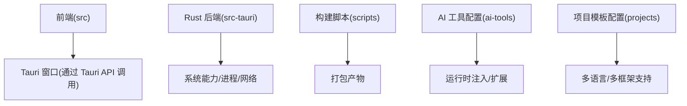
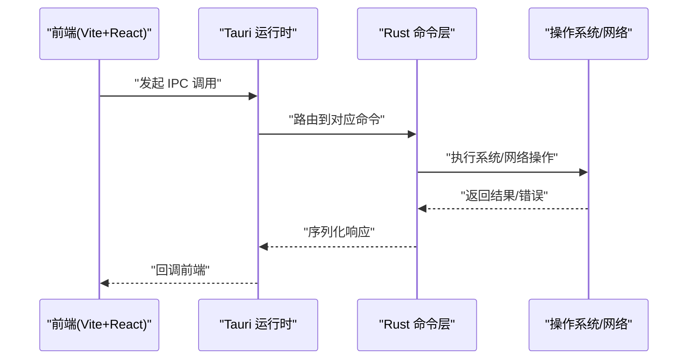
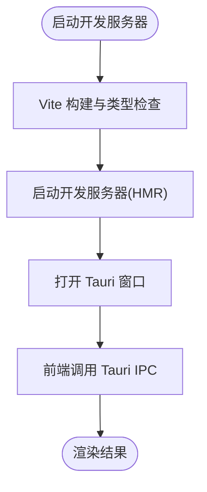
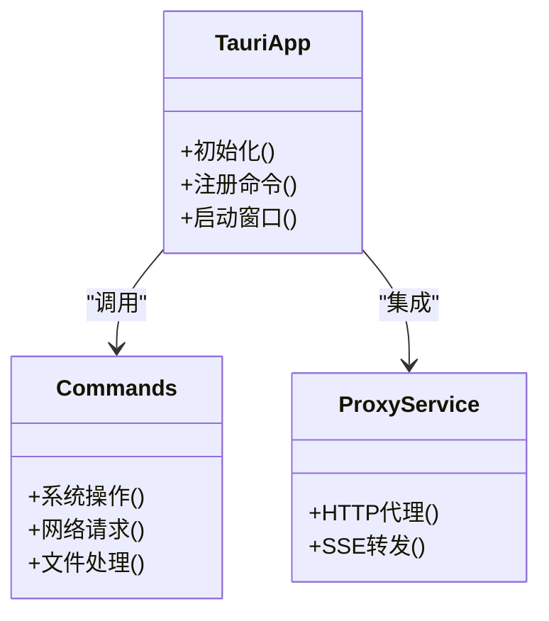
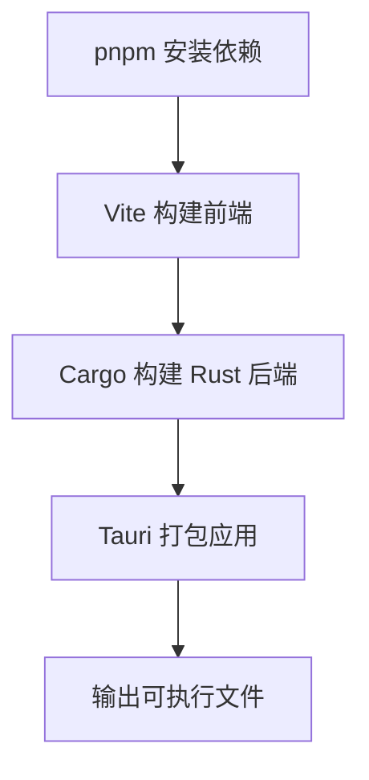
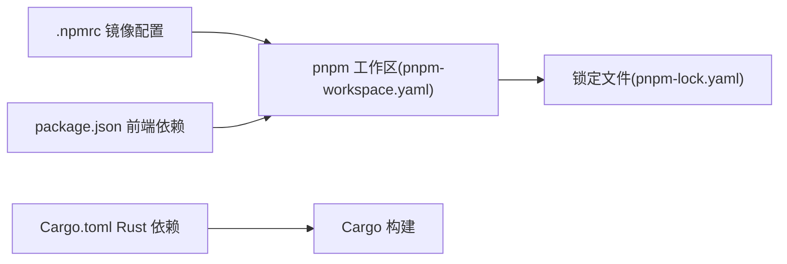

# 开发环境搭建

<cite>
**本文引用的文件**   
- [README.md](file://README.md)
- [package.json](file://package.json)
- [.npmrc](file://.npmrc)
- [pnpm-workspace.yaml](file://pnpm-workspace.yaml)
- [tsconfig.json](file://tsconfig.json)
- [vite.config.ts](file://vite.config.ts)
- [src/main.tsx](file://src/main.tsx)
- [src/App.tsx](file://src/App.tsx)
- [src-tauri/Cargo.toml](file://src-tauri/Cargo.toml)
- [src-tauri/tauri.conf.json](file://src-tauri/tauri.conf.json)
- [src-tauri/build.rs](file://src-tauri/build.rs)
- [src-tauri/src/lib.rs](file://src-tauri/src/lib.rs)
- [src-tauri/src/main.rs](file://src-tauri/src/main.rs)
- [scripts/bump-version.js](file://scripts/bump-version.js)
- [scripts/update_agent_docs.py](file://scripts/update_agent_docs.py)
- [ai-tools/mcp-config.json](file://ai-tools/mcp-config.json)
- [ai-tools/providers.json](file://ai-tools/providers.json)
- [projects/nodejs/config.json](file://projects/nodejs/config.json)
- [projects/rust/config.json](file://projects/rust/config.json)
- [projects/python/config.json](file://projects/python/config.json)
</cite>

## 目录
1. [简介](#简介)
2. [项目结构](#项目结构)
3. [核心组件](#核心组件)
4. [架构总览](#架构总览)
5. [详细组件分析](#详细组件分析)
6. [依赖分析](#依赖分析)
7. [性能考虑](#性能考虑)
8. [故障排查指南](#故障排查指南)
9. [结论](#结论)
10. [附录](#附录)

## 简介
本指南面向新开发者，提供从零开始的本地开发环境搭建说明。项目采用 Tauri（Rust 后端 + Web 前端）架构，使用 pnpm 进行包管理，TypeScript 作为前端语言，Rust 作为桌面端核心逻辑。文档涵盖前置依赖安装、工具链配置、项目初始化、多语言环境准备、IDE 建议、版本管理与分支策略，以及常见问题排查与解决方案。

## 项目结构
仓库采用前后端分离的 Tauri 工程组织方式：
- 前端资源位于 src 目录，包含 React + TypeScript 应用入口与页面组件。
- Rust 后端位于 src-tauri 目录，包含 Tauri 配置、命令模块、代理与服务等。
- 脚本位于 scripts 目录，用于版本发布与文档更新等自动化任务。
- AI 工具与项目模板配置分别位于 ai-tools 与 projects 目录。

[本节为概念性概览，不直接分析具体文件]

## 核心组件
- 前端应用
  - 入口与路由：由 Vite 驱动，React 渲染到 DOM。
  - 状态与 UI：基于 React 组件树，结合 Tauri 提供的 IPC 能力与后端交互。
- Rust 后端
  - Tauri 应用主体：负责窗口生命周期、菜单、托盘、IPC 命令注册等。
  - 命令层：暴露给前端的命令集合，封装系统操作、网络请求、文件处理等。
  - 代理与服务：内置 HTTP/SSE 代理能力，便于转发或调试外部服务。
- 构建与打包
  - 前端构建：Vite + TypeScript。
  - 后端构建：Cargo 构建，Tauri CLI 集成打包。
- 脚本与自动化
  - 版本升级与文档更新脚本，辅助发布流程。

章节来源
- [src/main.tsx:1-200](file://src/main.tsx#L1-L200)
- [src/App.tsx:1-200](file://src/App.tsx#L1-L200)
- [src-tauri/src/main.rs:1-200](file://src-tauri/src/main.rs#L1-L200)
- [src-tauri/src/lib.rs:1-200](file://src-tauri/src/lib.rs#L1-L200)
- [src-tauri/tauri.conf.json:1-200](file://src-tauri/tauri.conf.json#L1-L200)
- [vite.config.ts:1-200](file://vite.config.ts#L1-L200)
- [scripts/bump-version.js:1-200](file://scripts/bump-version.js#L1-L200)
- [scripts/update_agent_docs.py:1-200](file://scripts/update_agent_docs.py#L1-L200)

## 架构总览
下图展示了 Tauri 应用的典型运行路径：前端通过 Tauri 的 IPC 调用 Rust 命令，Rust 执行系统级操作或网络请求，结果返回至前端渲染。

图表来源
- [src-tauri/src/main.rs:1-200](file://src-tauri/src/main.rs#L1-L200)
- [src-tauri/src/lib.rs:1-200](file://src-tauri/src/lib.rs#L1-L200)
- [src/main.tsx:1-200](file://src/main.tsx#L1-L200)

章节来源
- [src-tauri/tauri.conf.json:1-200](file://src-tauri/tauri.conf.json#L1-L200)
- [vite.config.ts:1-200](file://vite.config.ts#L1-L200)

## 详细组件分析

### 前端（Vite + React + TypeScript）
- 构建与开发服务器
  - 使用 Vite 提供热重载与快速构建。
  - TypeScript 编译与类型检查由 tsconfig 控制。
- 应用入口
  - main.tsx 挂载根组件，App.tsx 定义应用结构与路由。
- 与后端通信
  - 通过 Tauri 客户端库调用 Rust 命令，实现跨进程通信。

图表来源
- [vite.config.ts:1-200](file://vite.config.ts#L1-L200)
- [tsconfig.json:1-200](file://tsconfig.json#L1-L200)
- [src/main.tsx:1-200](file://src/main.tsx#L1-L200)
- [src/App.tsx:1-200](file://src/App.tsx#L1-L200)

章节来源
- [vite.config.ts:1-200](file://vite.config.ts#L1-L200)
- [tsconfig.json:1-200](file://tsconfig.json#L1-L200)
- [src/main.tsx:1-200](file://src/main.tsx#L1-L200)
- [src/App.tsx:1-200](file://src/App.tsx#L1-L200)

### Rust 后端（Tauri + Cargo）
- 应用主体
  - main.rs 初始化 Tauri 应用，注册命令与插件。
  - lib.rs 导出公共接口与命令模块。
- 命令层
  - 将系统能力（文件、网络、进程等）暴露为可被前端调用的命令。
- 代理与服务
  - 提供 HTTP/SSE 代理能力，便于调试与转发。

图表来源
- [src-tauri/src/main.rs:1-200](file://src-tauri/src/main.rs#L1-L200)
- [src-tauri/src/lib.rs:1-200](file://src-tauri/src/lib.rs#L1-L200)

章节来源
- [src-tauri/src/main.rs:1-200](file://src-tauri/src/main.rs#L1-L200)
- [src-tauri/src/lib.rs:1-200](file://src-tauri/src/lib.rs#L1-L200)
- [src-tauri/Cargo.toml:1-200](file://src-tauri/Cargo.toml#L1-L200)
- [src-tauri/tauri.conf.json:1-200](file://src-tauri/tauri.conf.json#L1-L200)

### 构建与打包（Tauri CLI + Cargo）
- 构建流程
  - 先构建前端资源，再由 Tauri 打包为桌面应用。
- 构建脚本
  - build.rs 可用于自定义构建阶段逻辑。
- 发布脚本
  - bump-version.js 用于统一版本号管理。

图表来源
- [src-tauri/build.rs:1-200](file://src-tauri/build.rs#L1-L200)
- [scripts/bump-version.js:1-200](file://scripts/bump-version.js#L1-L200)

章节来源
- [src-tauri/build.rs:1-200](file://src-tauri/build.rs#L1-L200)
- [scripts/bump-version.js:1-200](file://scripts/bump-version.js#L1-L200)

### 脚本与自动化
- 版本管理
  - bump-version.js 统一变更版本号，配合发布流程。
- 文档更新
  - update_agent_docs.py 用于同步或生成 AI 工具相关文档。

章节来源
- [scripts/bump-version.js:1-200](file://scripts/bump-version.js#L1-L200)
- [scripts/update_agent_docs.py:1-200](file://scripts/update_agent_docs.py#L1-L200)

### AI 工具与项目模板
- AI 工具配置
  - mcp-config.json 与 providers.json 定义 MCP 服务器与提供商信息。
- 项目模板
  - projects 下各语言/框架的 config.json 描述模板元数据与规则。

章节来源
- [ai-tools/mcp-config.json:1-200](file://ai-tools/mcp-config.json#L1-L200)
- [ai-tools/providers.json:1-200](file://ai-tools/providers.json#L1-L200)
- [projects/nodejs/config.json:1-200](file://projects/nodejs/config.json#L1-L200)
- [projects/rust/config.json:1-200](file://projects/rust/config.json#L1-L200)
- [projects/python/config.json:1-200](file://projects/python/config.json#L1-L200)

## 依赖分析
- 包管理器
  - pnpm 工作区与锁文件确保依赖一致性与快速安装。
- NPM 镜像与缓存
  - .npmrc 可配置镜像源与缓存路径，提升下载速度。
- 前端依赖
  - package.json 声明了构建与运行所需的前端依赖。
- Rust 依赖
  - src-tauri/Cargo.toml 声明了 Rust 侧依赖与特性。

图表来源
- [pnpm-workspace.yaml:1-200](file://pnpm-workspace.yaml#L1-L200)
- [.npmrc:1-200](file://.npmrc#L1-L200)
- [package.json:1-200](file://package.json#L1-L200)
- [src-tauri/Cargo.toml:1-200](file://src-tauri/Cargo.toml#L1-L200)

章节来源
- [pnpm-workspace.yaml:1-200](file://pnpm-workspace.yaml#L1-L200)
- [.npmrc:1-200](file://.npmrc#L1-L200)
- [package.json:1-200](file://package.json#L1-L200)
- [src-tauri/Cargo.toml:1-200](file://src-tauri/Cargo.toml#L1-L200)

## 性能考虑
- 启用 pnpm 的严格模式与工作区，减少重复依赖与磁盘占用。
- 合理配置 Vite 的增量构建与缓存，缩短冷启动时间。
- 在 Rust 侧避免阻塞主线程，使用异步 IO 与消息队列优化吞吐。
- 对大文件或频繁访问的数据，考虑在前端与后端之间引入缓存策略。

[本节为通用指导，不直接分析具体文件]

## 故障排查指南
- Node.js 与 pnpm
  - 确认 Node.js 版本满足要求；若安装缓慢，检查 .npmrc 镜像配置。
  - 清理缓存后重试安装：删除 pnpm-lock.yaml 与 node_modules，重新安装。
- Rust 与 Tauri
  - 确保已安装 Rust 工具链与目标平台；Windows 需安装 Visual Studio Build Tools。
  - 若链接失败，检查系统库与编译器版本是否匹配。
- 环境变量
  - 某些命令需要特定环境变量（如代理、SDK 路径），请在终端中显式设置或在 IDE 中配置。
- 端口冲突
  - 若开发服务器无法启动，检查端口占用并更换端口。
- 权限问题
  - 在类 Unix 系统上，必要时以管理员权限运行安装或构建脚本。

章节来源
- [.npmrc:1-200](file://.npmrc#L1-L200)
- [src-tauri/Cargo.toml:1-200](file://src-tauri/Cargo.toml#L1-L200)
- [src-tauri/tauri.conf.json:1-200](file://src-tauri/tauri.conf.json#L1-L200)

## 结论
通过以上步骤，你可以在本地完成从依赖安装、工具链配置到项目初始化的完整开发环境搭建。建议在团队内统一 Node.js、Rust 与 pnpm 的版本，并使用 CI 验证构建流程，以确保一致性。

[本节为总结性内容，不直接分析具体文件]

## 附录

### 前置依赖安装清单
- Node.js
  - 建议使用 LTS 版本，并通过 nvm 或官方安装包管理。
- Rust
  - 使用 rustup 安装稳定版工具链，并根据平台安装必要的系统依赖。
- pnpm
  - 通过 npm 全局安装或使用官方安装器。
- Python（可选）
  - 如需运行 Python 脚本（如文档更新），请安装 Python 3 并确保 pip 可用。

[本节为通用指导，不直接分析具体文件]

### 开发工具链配置（VSCode 推荐）
- 插件
  - Rust Analyzer、ESLint、Prettier、Tauri 扩展（如有）。
- 格式化与 Linting
  - 在 VSCode 设置中启用保存时格式化，选择 Prettier 作为默认格式化器。
  - 为 TypeScript 启用 ESLint 规则，保持代码风格一致。
- 调试配置
  - 前端：使用 Chrome/Edge 调试器，配置 Source Map。
  - Rust：使用 VSCode 的 Debug Adapter for Rust，断点调试 Tauri 命令。

[本节为通用指导，不直接分析具体文件]

### 项目初始化流程（快速启动）
- 克隆仓库并进入项目目录。
- 安装前端依赖：使用 pnpm 安装工作区依赖。
- 配置环境变量（如代理、镜像源、SDK 路径）。
- 启动开发服务器：运行 Vite 开发模式。
- 启动 Tauri 应用：使用 Tauri CLI 运行或构建。
- 验证功能：打开应用并测试关键命令与界面。

章节来源
- [package.json:1-200](file://package.json#L1-L200)
- [pnpm-workspace.yaml:1-200](file://pnpm-workspace.yaml#L1-L200)
- [vite.config.ts:1-200](file://vite.config.ts#L1-L200)
- [src-tauri/tauri.conf.json:1-200](file://src-tauri/tauri.conf.json#L1-L200)

### 多语言开发环境准备
- TypeScript
  - 使用 tsconfig.json 配置编译选项与路径别名。
- Rust
  - 使用 Cargo 管理依赖与构建；配置 Rust Analyzer 以获得更好的 IDE 体验。
- Python
  - 如需运行 Python 脚本，确保 Python 解释器与 pip 可用，并在终端中激活虚拟环境。

章节来源
- [tsconfig.json:1-200](file://tsconfig.json#L1-L200)
- [src-tauri/Cargo.toml:1-200](file://src-tauri/Cargo.toml#L1-L200)
- [scripts/update_agent_docs.py:1-200](file://scripts/update_agent_docs.py#L1-L200)

### 版本管理与分支策略
- 版本管理
  - 使用 bump-version.js 统一版本号，提交前确保版本号与变更日志一致。
- 分支策略
  - 推荐使用主干开发（main）+ 功能分支（feature/*）+ 修复分支（fix/*）的模式。
  - 重要变更通过 Pull Request 合并，并进行必要测试。

章节来源
- [scripts/bump-version.js:1-200](file://scripts/bump-version.js#L1-L200)

### 常见环境问题与解决方案
- 依赖安装失败
  - 检查网络与镜像源配置；清理缓存后重试。
- 构建失败
  - 确认 Node.js 与 Rust 版本兼容；查看构建日志定位错误。
- 运行时异常
  - 检查环境变量与权限；在 Tauri 窗口中查看控制台输出。

章节来源
- [.npmrc:1-200](file://.npmrc#L1-L200)
- [src-tauri/Cargo.toml:1-200](file://src-tauri/Cargo.toml#L1-L200)
- [src-tauri/tauri.conf.json:1-200](file://src-tauri/tauri.conf.json#L1-L200)