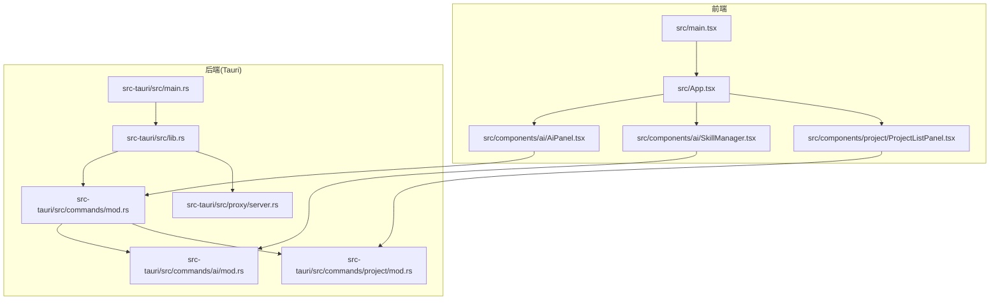
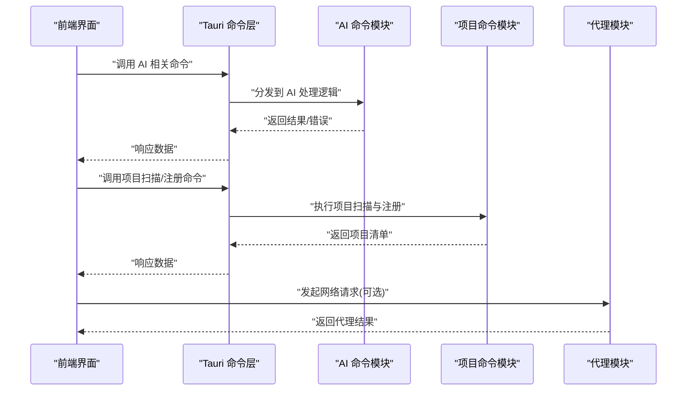
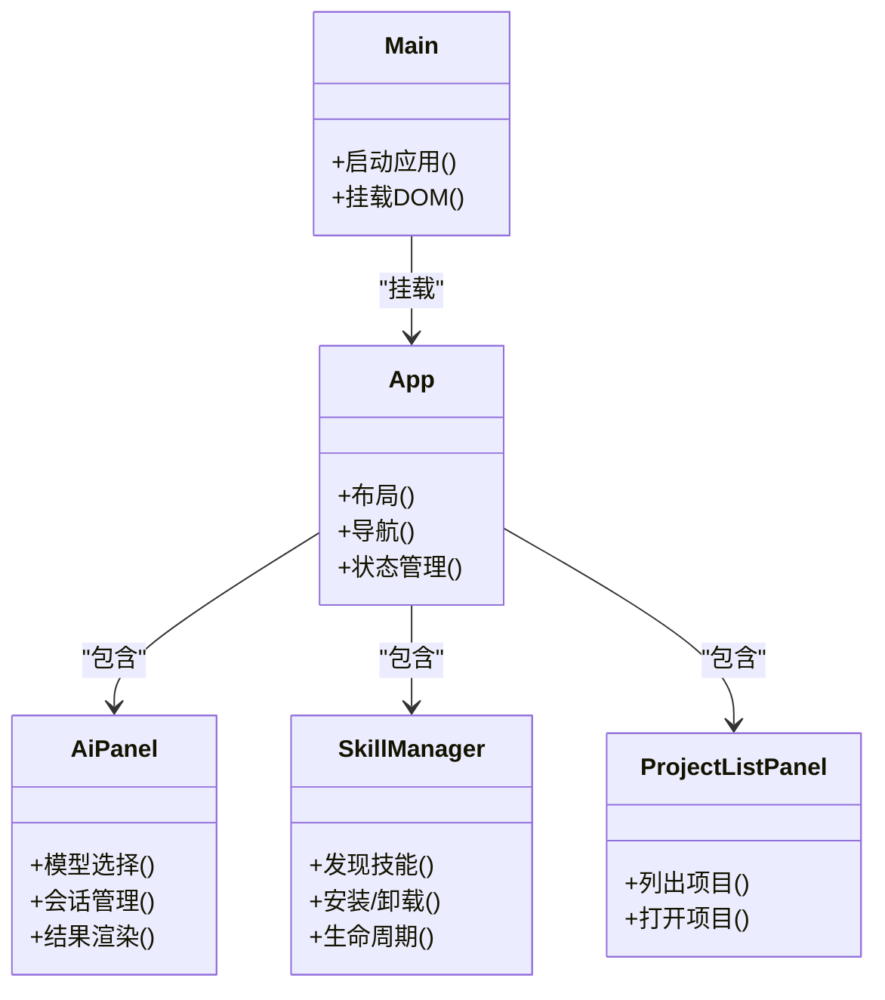
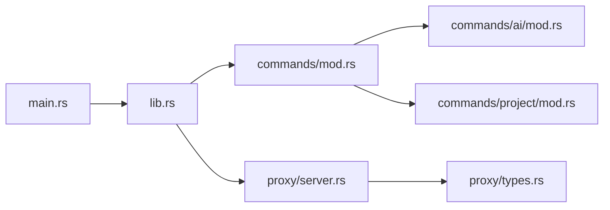
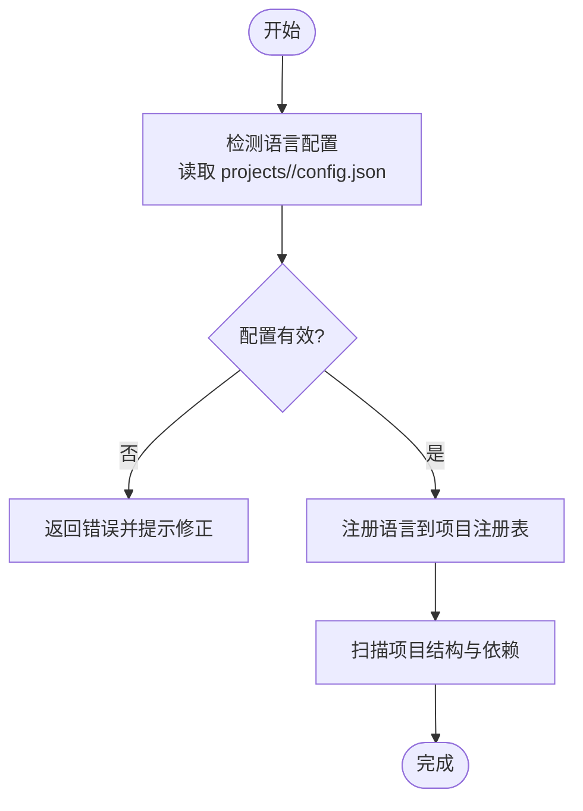
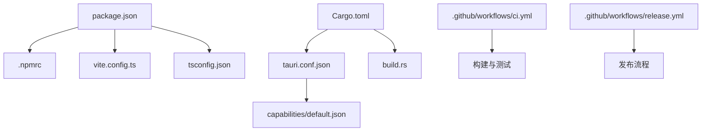

# 开发者指南

<cite>
**本文引用的文件**   
- [README.md](file://README.md)
- [package.json](file://package.json)
- [vite.config.ts](file://vite.config.ts)
- [tsconfig.json](file://tsconfig.json)
- [.npmrc](file://.npmrc)
- [src/main.tsx](file://src/main.tsx)
- [src/App.tsx](file://src/App.tsx)
- [src/components/ai/AiPanel.tsx](file://src/components/ai/AiPanel.tsx)
- [src/components/ai/SkillManager.tsx](file://src/components/ai/SkillManager.tsx)
- [src/components/project/ProjectListPanel.tsx](file://src/components/project/ProjectListPanel.tsx)
- [src-tauri/src/lib.rs](file://src-tauri/src/lib.rs)
- [src-tauri/src/main.rs](file://src-tauri/src/main.rs)
- [src-tauri/Cargo.toml](file://src-tauri/Cargo.toml)
- [src-tauri/build.rs](file://src-tauri/build.rs)
- [src-tauri/tauri.conf.json](file://src-tauri/tauri.conf.json)
- [src-tauri/capabilities/default.json](file://src-tauri/capabilities/default.json)
- [src-tauri/src/commands/mod.rs](file://src-tauri/src/commands/mod.rs)
- [src-tauri/src/commands/ai/mod.rs](file://src-tauri/src/commands/ai/mod.rs)
- [src-tauri/src/commands/ai/provider.rs](file://src-tauri/src/commands/ai/provider.rs)
- [src-tauri/src/commands/ai/skills.rs](file://src-tauri/src/commands/ai/skills.rs)
- [src-tauri/src/commands/ai/mcp.rs](file://src-tauri/src/commands/ai/mcp.rs)
- [src-tauri/src/commands/project/mod.rs](file://src-tauri/src/commands/project/mod.rs)
- [src-tauri/src/commands/project/registry.rs](file://src-tauri/src/commands/project/registry.rs)
- [src-tauri/src/proxy/server.rs](file://src-tauri/src/proxy/server.rs)
- [src-tauri/src/proxy/types.rs](file://src-tauri/src/proxy/types.rs)
- [projects/rust/config.json](file://projects/rust/config.json)
- [projects/nodejs/config.json](file://projects/nodejs/config.json)
- [scripts/bump-version.js](file://scripts/bump-version.js)
- [.github/workflows/ci.yml](file://.github/workflows/ci.yml)
- [.github/workflows/release.yml](file://.github/workflows/release.yml)
</cite>

## 目录
1. [简介](#简介)
2. [项目结构](#项目结构)
3. [核心组件](#核心组件)
4. [架构总览](#架构总览)
5. [详细组件分析](#详细组件分析)
6. [依赖分析](#依赖分析)
7. [性能考虑](#性能考虑)
8. [故障排查指南](#故障排查指南)
9. [结论](#结论)
10. [附录](#附录)

## 简介
本指南面向新贡献者与高级开发者，提供从环境搭建、构建流程到插件扩展、测试调试、性能优化与发布的全链路开发说明。本项目采用 Tauri + React 的桌面应用架构：前端使用 React + Vite 构建，后端使用 Rust（Tauri）暴露命令接口；通过能力声明与配置驱动的方式组织 AI 工具、技能与项目模板。

## 项目结构
整体由前后端两部分组成：
- 前端 src：React 组件、页面与状态管理，基于 Vite 构建。
- 后端 src-tauri：Rust 实现，通过 Tauri 命令桥接前端与系统能力，包含代理、AI 命令、项目管理等模块。
- 配置与资源：项目模板与规则位于 projects/*，Tauri 能力与打包配置位于 src-tauri/capabilities 与 tauri.conf.json。
- 脚本与 CI：版本管理与自动化流水线在 scripts 与 .github/workflows。

图表来源
- [src/main.tsx:1-200](file://src/main.tsx#L1-L200)
- [src/App.tsx:1-200](file://src/App.tsx#L1-L200)
- [src/components/ai/AiPanel.tsx:1-200](file://src/components/ai/AiPanel.tsx#L1-L200)
- [src/components/ai/SkillManager.tsx:1-200](file://src/components/ai/SkillManager.tsx#L1-L200)
- [src/components/project/ProjectListPanel.tsx:1-200](file://src/components/project/ProjectListPanel.tsx#L1-L200)
- [src-tauri/src/main.rs:1-200](file://src-tauri/src/main.rs#L1-L200)
- [src-tauri/src/lib.rs:1-200](file://src-tauri/src/lib.rs#L1-L200)
- [src-tauri/src/commands/mod.rs:1-200](file://src-tauri/src/commands/mod.rs#L1-L200)
- [src-tauri/src/commands/ai/mod.rs:1-200](file://src-tauri/src/commands/ai/mod.rs#L1-L200)
- [src-tauri/src/commands/project/mod.rs:1-200](file://src-tauri/src/commands/project/mod.rs#L1-L200)
- [src-tauri/src/proxy/server.rs:1-200](file://src-tauri/src/proxy/server.rs#L1-L200)

章节来源
- [README.md:1-200](file://README.md#L1-L200)
- [package.json:1-200](file://package.json#L1-L200)
- [vite.config.ts:1-200](file://vite.config.ts#L1-L200)
- [tsconfig.json:1-200](file://tsconfig.json#L1-L200)
- [.npmrc:1-200](file://.npmrc#L1-L200)
- [src-tauri/tauri.conf.json:1-200](file://src-tauri/tauri.conf.json#L1-L200)
- [src-tauri/capabilities/default.json:1-200](file://src-tauri/capabilities/default.json#L1-L200)

## 核心组件
- 前端入口与路由
  - 主入口负责挂载应用与初始化全局上下文。
  - App 组件组织页面布局与子面板。
- AI 相关面板
  - AiPanel 提供模型选择、会话管理与结果渲染。
  - SkillManager 负责技能的发现、安装与管理。
- 项目管理
  - ProjectListPanel 展示已识别的项目列表与操作入口。
- 后端命令层
  - commands 模块按功能域划分，如 ai、project、proxy 等。
  - ai 子模块封装模型提供商、MCP、技能、缓存等能力。
  - project 子模块封装项目扫描、注册表与版本解析。
- 代理与服务
  - proxy 模块提供本地代理服务，用于转发或优化外部请求。

章节来源
- [src/main.tsx:1-200](file://src/main.tsx#L1-L200)
- [src/App.tsx:1-200](file://src/App.tsx#L1-L200)
- [src/components/ai/AiPanel.tsx:1-200](file://src/components/ai/AiPanel.tsx#L1-L200)
- [src/components/ai/SkillManager.tsx:1-200](file://src/components/ai/SkillManager.tsx#L1-L200)
- [src/components/project/ProjectListPanel.tsx:1-200](file://src/components/project/ProjectListPanel.tsx#L1-L200)
- [src-tauri/src/commands/mod.rs:1-200](file://src-tauri/src/commands/mod.rs#L1-L200)
- [src-tauri/src/commands/ai/mod.rs:1-200](file://src-tauri/src/commands/ai/mod.rs#L1-L200)
- [src-tauri/src/commands/project/mod.rs:1-200](file://src-tauri/src/commands/project/mod.rs#L1-L200)
- [src-tauri/src/proxy/server.rs:1-200](file://src-tauri/src/proxy/server.rs#L1-L200)

## 架构总览
前端通过 Tauri 命令调用后端能力，后端以模块化方式组织业务逻辑，并通过能力声明控制可访问的系统权限。代理模块为外部服务提供本地中转与优化。

图表来源
- [src-tauri/src/commands/mod.rs:1-200](file://src-tauri/src/commands/mod.rs#L1-L200)
- [src-tauri/src/commands/ai/mod.rs:1-200](file://src-tauri/src/commands/ai/mod.rs#L1-L200)
- [src-tauri/src/commands/project/mod.rs:1-200](file://src-tauri/src/commands/project/mod.rs#L1-L200)
- [src-tauri/src/proxy/server.rs:1-200](file://src-tauri/src/proxy/server.rs#L1-L200)

## 详细组件分析

### 前端 React 组件架构
- 入口与根组件
  - main.tsx 负责创建应用实例并挂载到 DOM。
  - App.tsx 组织全局布局与子面板，承载导航与状态。
- AI 面板
  - AiPanel.tsx 提供模型配置、会话交互与输出渲染。
  - SkillManager.tsx 负责技能发现、安装与生命周期管理。
- 项目管理
  - ProjectListPanel.tsx 展示项目列表与基础操作。

图表来源
- [src/main.tsx:1-200](file://src/main.tsx#L1-L200)
- [src/App.tsx:1-200](file://src/App.tsx#L1-L200)
- [src/components/ai/AiPanel.tsx:1-200](file://src/components/ai/AiPanel.tsx#L1-L200)
- [src/components/ai/SkillManager.tsx:1-200](file://src/components/ai/SkillManager.tsx#L1-L200)
- [src/components/project/ProjectListPanel.tsx:1-200](file://src/components/project/ProjectListPanel.tsx#L1-L200)

章节来源
- [src/main.tsx:1-200](file://src/main.tsx#L1-L200)
- [src/App.tsx:1-200](file://src/App.tsx#L1-L200)
- [src/components/ai/AiPanel.tsx:1-200](file://src/components/ai/AiPanel.tsx#L1-L200)
- [src/components/ai/SkillManager.tsx:1-200](file://src/components/ai/SkillManager.tsx#L1-L200)
- [src/components/project/ProjectListPanel.tsx:1-200](file://src/components/project/ProjectListPanel.tsx#L1-L200)

### 后端 Rust 模块组织
- 命令层
  - commands/mod.rs 统一注册与分发命令。
  - ai/mod.rs 聚合 AI 相关命令（提供商、会话、技能、MCP、缓存等）。
  - project/mod.rs 聚合项目相关命令（扫描、注册表、版本）。
- 代理与服务
  - proxy/server.rs 提供本地代理服务，types.rs 定义数据结构。
- 应用入口
  - main.rs 启动 Tauri 应用。
  - lib.rs 初始化命令与能力。

图表来源
- [src-tauri/src/main.rs:1-200](file://src-tauri/src/main.rs#L1-L200)
- [src-tauri/src/lib.rs:1-200](file://src-tauri/src/lib.rs#L1-L200)
- [src-tauri/src/commands/mod.rs:1-200](file://src-tauri/src/commands/mod.rs#L1-L200)
- [src-tauri/src/commands/ai/mod.rs:1-200](file://src-tauri/src/commands/ai/mod.rs#L1-L200)
- [src-tauri/src/commands/project/mod.rs:1-200](file://src-tauri/src/commands/project/mod.rs#L1-L200)
- [src-tauri/src/proxy/server.rs:1-200](file://src-tauri/src/proxy/server.rs#L1-L200)
- [src-tauri/src/proxy/types.rs:1-200](file://src-tauri/src/proxy/types.rs#L1-L200)

章节来源
- [src-tauri/src/main.rs:1-200](file://src-tauri/src/main.rs#L1-L200)
- [src-tauri/src/lib.rs:1-200](file://src-tauri/src/lib.rs#L1-L200)
- [src-tauri/src/commands/mod.rs:1-200](file://src-tauri/src/commands/mod.rs#L1-L200)
- [src-tauri/src/commands/ai/mod.rs:1-200](file://src-tauri/src/commands/ai/mod.rs#L1-L200)
- [src-tauri/src/commands/project/mod.rs:1-200](file://src-tauri/src/commands/project/mod.rs#L1-L200)
- [src-tauri/src/proxy/server.rs:1-200](file://src-tauri/src/proxy/server.rs#L1-L200)
- [src-tauri/src/proxy/types.rs:1-200](file://src-tauri/src/proxy/types.rs#L1-L200)

### 插件开发机制
- 新语言支持
  - 在 projects/<lang>/config.json 中定义语言元信息、环境变量、包管理器与远程版本配置。
  - 结合 find_rules.json 与 package_managers.json 完成自动发现与安装策略。
- AI 提供商扩展
  - 在 commands/ai/provider.rs 中新增提供商实现，遵循统一的接口契约。
  - 在 commands/ai/mod.rs 中注册新提供商，确保前端可枚举与选择。
- 技能开发
  - 在 commands/ai/skills.rs 中实现技能的发现、安装与执行钩子。
  - 前端 SkillManager.tsx 提供用户交互入口。
- MCP 集成
  - 在 commands/ai/mcp.rs 中实现 MCP 协议适配，使外部工具可被统一调度。

图表来源
- [projects/rust/config.json:1-200](file://projects/rust/config.json#L1-L200)
- [projects/nodejs/config.json:1-200](file://projects/nodejs/config.json#L1-L200)
- [src-tauri/src/commands/project/registry.rs:1-200](file://src-tauri/src/commands/project/registry.rs#L1-L200)
- [src-tauri/src/commands/ai/provider.rs:1-200](file://src-tauri/src/commands/ai/provider.rs#L1-L200)
- [src-tauri/src/commands/ai/skills.rs:1-200](file://src-tauri/src/commands/ai/skills.rs#L1-L200)
- [src-tauri/src/commands/ai/mcp.rs:1-200](file://src-tauri/src/commands/ai/mcp.rs#L1-L200)

章节来源
- [projects/rust/config.json:1-200](file://projects/rust/config.json#L1-L200)
- [projects/nodejs/config.json:1-200](file://projects/nodejs/config.json#L1-L200)
- [src-tauri/src/commands/ai/provider.rs:1-200](file://src-tauri/src/commands/ai/provider.rs#L1-L200)
- [src-tauri/src/commands/ai/skills.rs:1-200](file://src-tauri/src/commands/ai/skills.rs#L1-L200)
- [src-tauri/src/commands/ai/mcp.rs:1-200](file://src-tauri/src/commands/ai/mcp.rs#L1-L200)
- [src-tauri/src/commands/project/registry.rs:1-200](file://src-tauri/src/commands/project/registry.rs#L1-L200)

## 依赖分析
- 前端依赖
  - 使用 pnpm 工作区与 Vite 构建，TypeScript 编译配置在 tsconfig.json。
  - 镜像与源配置在 .npmrc。
- 后端依赖
  - Cargo 工程，依赖声明在 Cargo.toml。
  - Tauri 配置在 tauri.conf.json，能力声明在 capabilities/default.json。
- 构建与打包
  - build.rs 参与构建期任务。
  - CI 与发布流水线在 .github/workflows。

图表来源
- [package.json:1-200](file://package.json#L1-L200)
- [.npmrc:1-200](file://.npmrc#L1-L200)
- [vite.config.ts:1-200](file://vite.config.ts#L1-L200)
- [tsconfig.json:1-200](file://tsconfig.json#L1-L200)
- [src-tauri/Cargo.toml:1-200](file://src-tauri/Cargo.toml#L1-L200)
- [src-tauri/tauri.conf.json:1-200](file://src-tauri/tauri.conf.json#L1-L200)
- [src-tauri/capabilities/default.json:1-200](file://src-tauri/capabilities/default.json#L1-L200)
- [src-tauri/build.rs:1-200](file://src-tauri/build.rs#L1-L200)
- [.github/workflows/ci.yml:1-200](file://.github/workflows/ci.yml#L1-L200)
- [.github/workflows/release.yml:1-200](file://.github/workflows/release.yml#L1-L200)

章节来源
- [package.json:1-200](file://package.json#L1-L200)
- [.npmrc:1-200](file://.npmrc#L1-L200)
- [vite.config.ts:1-200](file://vite.config.ts#L1-L200)
- [tsconfig.json:1-200](file://tsconfig.json#L1-L200)
- [src-tauri/Cargo.toml:1-200](file://src-tauri/Cargo.toml#L1-L200)
- [src-tauri/tauri.conf.json:1-200](file://src-tauri/tauri.conf.json#L1-L200)
- [src-tauri/capabilities/default.json:1-200](file://src-tauri/capabilities/default.json#L1-L200)
- [src-tauri/build.rs:1-200](file://src-tauri/build.rs#L1-L200)
- [.github/workflows/ci.yml:1-200](file://.github/workflows/ci.yml#L1-L200)
- [.github/workflows/release.yml:1-200](file://.github/workflows/release.yml#L1-L200)

## 性能考虑
- 前端
  - 合理拆分组件与懒加载，减少首屏体积。
  - 避免频繁重渲染，使用稳定引用与状态最小化更新。
- 后端
  - 命令处理尽量异步，避免阻塞事件循环。
  - 对 I/O 密集操作进行批处理与缓存。
- 代理
  - 复用连接与压缩传输，减少延迟。
  - 对热点路径增加缓存层。

## 故障排查指南
- 常见问题定位
  - 检查 Tauri 能力是否允许所需系统访问。
  - 核对 AI 提供商配置与密钥是否正确。
  - 验证项目模板配置与包管理器路径。
- 日志与调试
  - 前端使用浏览器控制台与网络面板。
  - 后端启用 Tauri 日志，查看命令调用链与错误堆栈。
- 代理问题
  - 确认端口占用与证书配置。
  - 检查上游服务的可达性与鉴权。

章节来源
- [src-tauri/capabilities/default.json:1-200](file://src-tauri/capabilities/default.json#L1-L200)
- [src-tauri/src/commands/ai/provider.rs:1-200](file://src-tauri/src/commands/ai/provider.rs#L1-L200)
- [src-tauri/src/proxy/server.rs:1-200](file://src-tauri/src/proxy/server.rs#L1-L200)

## 结论
本项目通过清晰的模块划分与配置驱动，提供了可扩展的 AI 工具平台。建议在新功能开发时遵循现有命令与能力模式，完善文档与测试，确保稳定性与可维护性。

## 附录

### 开发环境搭建与构建流程
- 前置要求
  - Node.js 与 pnpm 工作区。
  - Rust 工具链与 Tauri CLI。
- 安装依赖
  - 使用 pnpm 安装前端依赖。
  - 使用 cargo 拉取后端依赖。
- 开发与构建
  - 前端开发服务器：Vite 启动。
  - 后端调试：cargo dev 或 cargo run。
  - 打包：遵循 Tauri 打包流程。
- 版本管理
  - 使用 scripts/bump-version.js 进行版本号升级。

章节来源
- [package.json:1-200](file://package.json#L1-L200)
- [vite.config.ts:1-200](file://vite.config.ts#L1-L200)
- [src-tauri/Cargo.toml:1-200](file://src-tauri/Cargo.toml#L1-L200)
- [scripts/bump-version.js:1-200](file://scripts/bump-version.js#L1-L200)

### 代码规范与贡献流程
- 代码风格
  - 前端遵循 TypeScript 与 ESLint/Prettier 配置。
  - 后端遵循 rustfmt 与 clippy 检查。
- 提交规范
  - 使用约定式提交信息，便于生成变更日志。
- 审查流程
  - 提交 PR 后触发 CI，通过后进入合并阶段。

章节来源
- [tsconfig.json:1-200](file://tsconfig.json#L1-L200)
- [.github/workflows/ci.yml:1-200](file://.github/workflows/ci.yml#L1-L200)

### 测试策略与调试技巧
- 单元测试
  - 前端使用 Jest/Vitest 编写组件与工具函数测试。
  - 后端使用 cargo test 编写命令与工具测试。
- 集成测试
  - 端到端测试覆盖关键用户流程。
- 调试技巧
  - 前端断点与网络抓包。
  - 后端日志与 Tauri 调试窗口。

章节来源
- [.github/workflows/ci.yml:1-200](file://.github/workflows/ci.yml#L1-L200)

### 发布流程与版本管理
- 版本升级
  - 使用 bump-version.js 统一提升版本号。
- 流水线
  - CI 执行构建与测试。
  - Release 流水线生成产物并发布。

章节来源
- [scripts/bump-version.js:1-200](file://scripts/bump-version.js#L1-L200)
- [.github/workflows/release.yml:1-200](file://.github/workflows/release.yml#L1-L200)