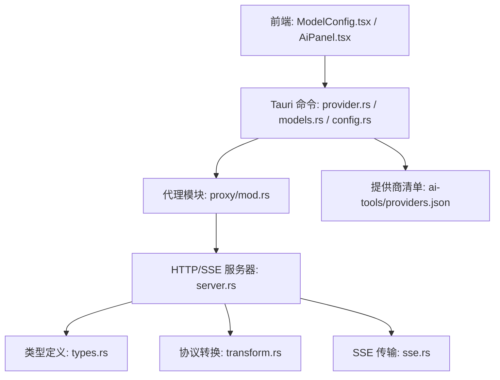
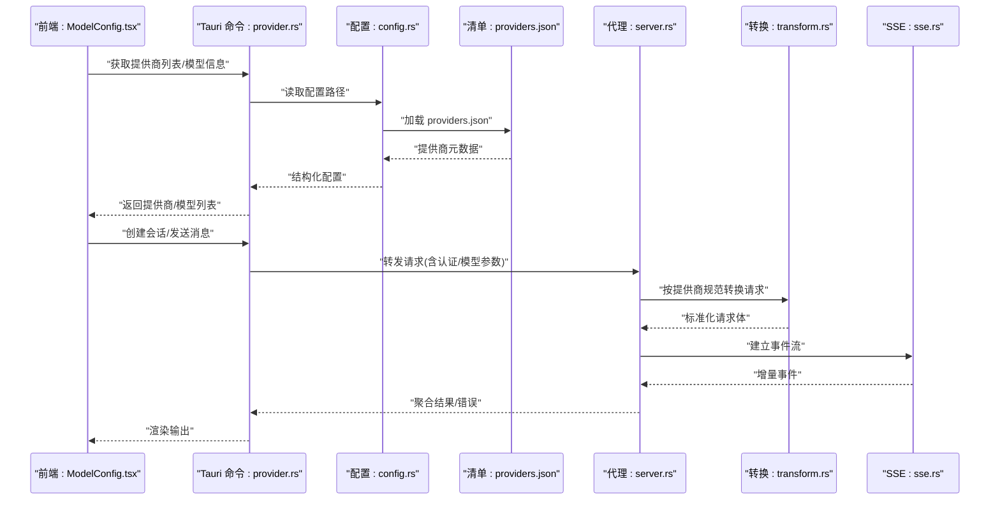
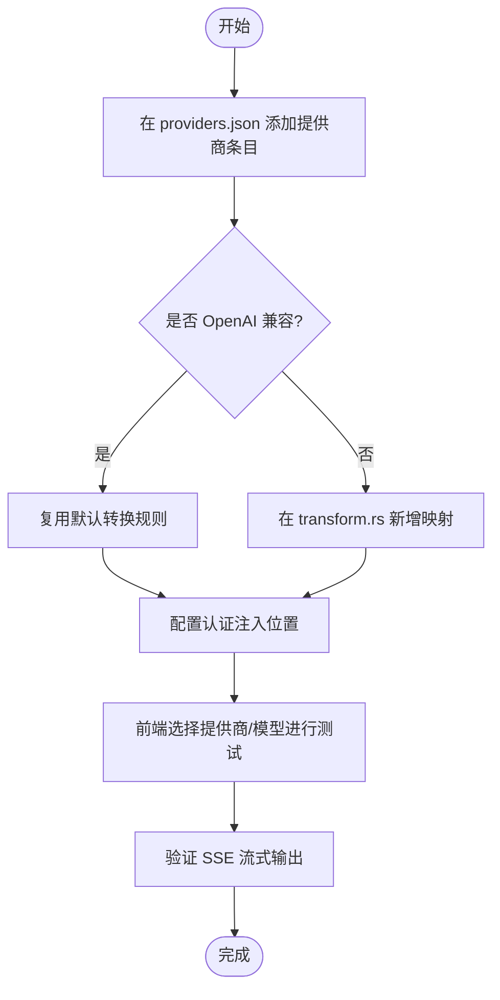
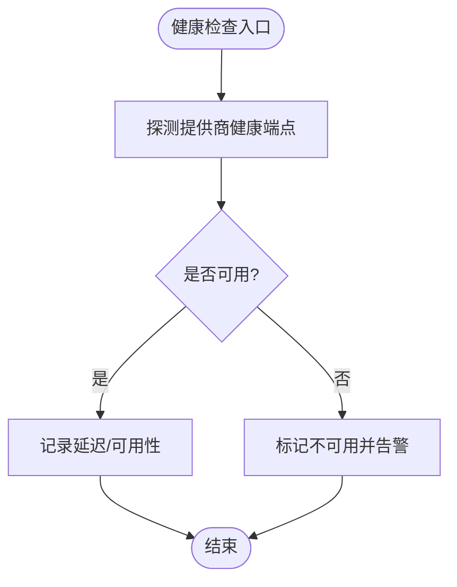
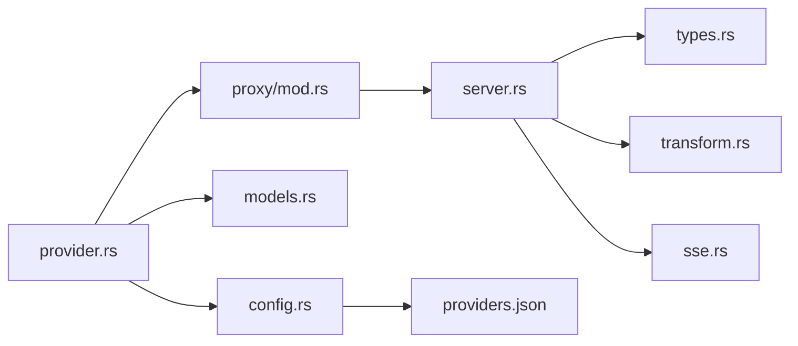

# AI 提供商插件开发

<cite>
**本文引用的文件**   
- [ai-tools/providers.json](file://ai-tools/providers.json)
- [src-tauri/src/commands/ai/provider.rs](file://src-tauri/src/commands/ai/provider.rs)
- [src-tauri/src/commands/ai/models.rs](file://src-tauri/src/commands/ai/models.rs)
- [src-tauri/src/commands/ai/config.rs](file://src-tauri/src/commands/ai/config.rs)
- [src-tauri/src/proxy/server.rs](file://src-tauri/src/proxy/server.rs)
- [src-tauri/src/proxy/types.rs](file://src-tauri/src/proxy/types.rs)
- [src-tauri/src/proxy/sse.rs](file://src-tauri/src/proxy/sse.rs)
- [src-tauri/src/proxy/transform.rs](file://src-tauri/src/proxy/transform.rs)
- [src-tauri/src/proxy/mod.rs](file://src-tauri/src/proxy/mod.rs)
- [src/components/ai/ModelConfig.tsx](file://src/components/ai/ModelConfig.tsx)
- [src/components/ai/AiPanel.tsx](file://src/components/ai/AiPanel.tsx)
</cite>

## 目录
1. [简介](#简介)
2. [项目结构](#项目结构)
3. [核心组件](#核心组件)
4. [架构总览](#架构总览)
5. [详细组件分析](#详细组件分析)
6. [依赖关系分析](#依赖关系分析)
7. [性能与可靠性](#性能与可靠性)
8. [故障排查指南](#故障排查指南)
9. [结论](#结论)
10. [附录](#附录)

## 简介
本指南面向希望为系统新增 AI 服务提供商的开发者，围绕 providers.json 配置、API 客户端实现、请求响应处理、错误处理、模型参数管理、认证扩展（API Key/OAuth/令牌刷新）、OpenAI 兼容 API 集成、健康检查、限流与重试等主题提供系统化说明。文档以仓库现有实现为依据，帮助你在不侵入核心逻辑的前提下，通过配置与最小化代码扩展新的 AI 提供商。

## 项目结构
本项目采用前后端分离与 Tauri 后端命令模式：
- 前端 UI 负责展示与交互（如模型配置面板）
- Tauri 后端提供命令接口，加载 providers.json，解析并调用代理层进行 HTTP 通信
- 代理层统一封装 SSE、转换、类型定义等能力，屏蔽不同提供商差异
- 配置中心集中管理提供商元数据、端点、认证方式与模型参数

图表来源
- [src-tauri/src/commands/ai/provider.rs](file://src-tauri/src/commands/ai/provider.rs)
- [src-tauri/src/commands/ai/models.rs](file://src-tauri/src/commands/ai/models.rs)
- [src-tauri/src/commands/ai/config.rs](file://src-tauri/src/commands/ai/config.rs)
- [src-tauri/src/proxy/mod.rs](file://src-tauri/src/proxy/mod.rs)
- [src-tauri/src/proxy/server.rs](file://src-tauri/src/proxy/server.rs)
- [src-tauri/src/proxy/types.rs](file://src-tauri/src/proxy/types.rs)
- [src-tauri/src/proxy/transform.rs](file://src-tauri/src/proxy/transform.rs)
- [src-tauri/src/proxy/sse.rs](file://src-tauri/src/proxy/sse.rs)
- [ai-tools/providers.json](file://ai-tools/providers.json)

章节来源
- [src-tauri/src/commands/ai/provider.rs](file://src-tauri/src/commands/ai/provider.rs)
- [src-tauri/src/commands/ai/models.rs](file://src-tauri/src/commands/ai/models.rs)
- [src-tauri/src/commands/ai/config.rs](file://src-tauri/src/commands/ai/config.rs)
- [src-tauri/src/proxy/mod.rs](file://src-tauri/src/proxy/mod.rs)
- [src-tauri/src/proxy/server.rs](file://src-tauri/src/proxy/server.rs)
- [src-tauri/src/proxy/types.rs](file://src-tauri/src/proxy/types.rs)
- [src-tauri/src/proxy/transform.rs](file://src-tauri/src/proxy/transform.rs)
- [src-tauri/src/proxy/sse.rs](file://src-tauri/src/proxy/sse.rs)
- [ai-tools/providers.json](file://ai-tools/providers.json)
- [src/components/ai/ModelConfig.tsx](file://src/components/ai/ModelConfig.tsx)
- [src/components/ai/AiPanel.tsx](file://src/components/ai/AiPanel.tsx)

## 核心组件
- 提供商清单与元数据：providers.json 集中描述各提供商的标识、名称、图标、默认端点、支持的模型、认证方式、能力开关等。
- 命令层：provider.rs、models.rs、config.rs 暴露 Tauri 命令，读取配置、校验参数、转发到代理层。
- 代理层：server.rs 作为 HTTP/SSE 网关，types.rs 定义通用请求/响应结构，transform.rs 做协议适配，sse.rs 负责事件流。
- 前端：ModelConfig.tsx 提供可视化配置入口，AiPanel.tsx 承载对话与状态展示。

章节来源
- [ai-tools/providers.json](file://ai-tools/providers.json)
- [src-tauri/src/commands/ai/provider.rs](file://src-tauri/src/commands/ai/provider.rs)
- [src-tauri/src/commands/ai/models.rs](file://src-tauri/src/commands/ai/models.rs)
- [src-tauri/src/commands/ai/config.rs](file://src-tauri/src/commands/ai/config.rs)
- [src-tauri/src/proxy/server.rs](file://src-tauri/src/proxy/server.rs)
- [src-tauri/src/proxy/types.rs](file://src-tauri/src/proxy/types.rs)
- [src-tauri/src/proxy/transform.rs](file://src-tauri/src/proxy/transform.rs)
- [src-tauri/src/proxy/sse.rs](file://src-tauri/src/proxy/sse.rs)
- [src/components/ai/ModelConfig.tsx](file://src/components/ai/ModelConfig.tsx)
- [src/components/ai/AiPanel.tsx](file://src/components/ai/AiPanel.tsx)

## 架构总览
下图展示了从前端发起一次“选择提供商/模型”到后端加载配置、构造请求、走代理层返回结果的完整链路。

图表来源
- [src-tauri/src/commands/ai/provider.rs](file://src-tauri/src/commands/ai/provider.rs)
- [src-tauri/src/commands/ai/config.rs](file://src-tauri/src/commands/ai/config.rs)
- [ai-tools/providers.json](file://ai-tools/providers.json)
- [src-tauri/src/proxy/server.rs](file://src-tauri/src/proxy/server.rs)
- [src-tauri/src/proxy/transform.rs](file://src-tauri/src/proxy/transform.rs)
- [src-tauri/src/proxy/sse.rs](file://src-tauri/src/proxy/sse.rs)

## 详细组件分析

### 提供商清单 providers.json 结构
- 提供商元数据
  - 唯一标识、显示名称、图标、文档链接、是否启用
  - 默认基础 URL、是否支持流式输出、是否支持工具调用
- API 端点配置
  - 聊天补全、图像生成、嵌入等端点路径
  - 请求方法、路径模板、查询参数映射
- 认证方式设置
  - 支持的认证类型（如 API Key、OAuth、自定义头）
  - 密钥注入位置（Header/Query/Body）
  - 令牌刷新策略（可选）
- 模型配置
  - 模型 ID、名称、上下文窗口限制、最大输出长度
  - 温度、TopP、频率惩罚等默认值或范围约束
- 能力与兼容性
  - OpenAI 兼容标记、功能开关（如多模态、函数调用）
  - 限流策略（QPS/并发）与重试策略（次数/退避）

章节来源
- [ai-tools/providers.json](file://ai-tools/providers.json)

### 新提供商集成流程（端到端）
- 步骤一：在 providers.json 中注册提供商
  - 填写元数据、端点、认证、模型、能力与限流/重试策略
- 步骤二：实现/适配协议转换
  - 若提供商非 OpenAI 兼容，需在 transform.rs 中增加映射规则，将内部标准请求转换为目标格式
- 步骤三：认证扩展
  - 在 provider.rs/config.rs 中接入密钥来源（环境变量/安全存储），按 providers.json 指定位置注入
  - 如需 OAuth/令牌刷新，可在代理层或命令层加入刷新钩子
- 步骤四：测试与验证
  - 使用前端 ModelConfig.tsx 选择新提供商与模型，观察会话是否正常
  - 通过 SSE 事件确认流式输出是否正确

图表来源
- [ai-tools/providers.json](file://ai-tools/providers.json)
- [src-tauri/src/proxy/transform.rs](file://src-tauri/src/proxy/transform.rs)
- [src-tauri/src/commands/ai/provider.rs](file://src-tauri/src/commands/ai/provider.rs)
- [src-tauri/src/commands/ai/config.rs](file://src-tauri/src/commands/ai/config.rs)
- [src/components/ai/ModelConfig.tsx](file://src/components/ai/ModelConfig.tsx)

章节来源
- [ai-tools/providers.json](file://ai-tools/providers.json)
- [src-tauri/src/proxy/transform.rs](file://src-tauri/src/proxy/transform.rs)
- [src-tauri/src/commands/ai/provider.rs](file://src-tauri/src/commands/ai/provider.rs)
- [src-tauri/src/commands/ai/config.rs](file://src-tauri/src/commands/ai/config.rs)
- [src/components/ai/ModelConfig.tsx](file://src/components/ai/ModelConfig.tsx)

### 模型配置管理
- 模型参数
  - temperature、top_p、max_tokens、frequency_penalty、presence_penalty 等
  - 可通过 providers.json 中的模型条目设定默认值与取值范围
- 上下文窗口限制
  - 由提供商清单中的上下文长度字段控制，超出时应在请求前截断或提示用户
- 前端可视化
  - ModelConfig.tsx 提供模型选择与参数编辑界面，提交后由命令层持久化并用于后续请求

章节来源
- [ai-tools/providers.json](file://ai-tools/providers.json)
- [src/components/ai/ModelConfig.tsx](file://src/components/ai/ModelConfig.tsx)
- [src-tauri/src/commands/ai/models.rs](file://src-tauri/src/commands/ai/models.rs)

### 认证系统扩展
- API Key
  - 在 providers.json 指定密钥注入位置（如 Authorization: Bearer {key}）
  - 命令层从安全存储或环境变量读取并注入
- OAuth
  - 在代理层增加授权码流程与回调处理，缓存 access_token 与 refresh_token
  - 当 token 过期时自动刷新并重试原请求
- 令牌刷新
  - 基于时间戳与剩余有效期触发刷新；失败则回退到本地缓存或提示重新登录

章节来源
- [ai-tools/providers.json](file://ai-tools/providers.json)
- [src-tauri/src/commands/ai/provider.rs](file://src-tauri/src/commands/ai/provider.rs)
- [src-tauri/src/proxy/server.rs](file://src-tauri/src/proxy/server.rs)

### OpenAI 兼容 API 集成示例
- 适用条件：提供商遵循 OpenAI Chat Completions 语义
- 集成要点
  - 在 providers.json 中声明 base_url、chat 端点、认证方式为 Header 注入
  - 无需额外转换逻辑，直接复用默认适配器
  - 开启流式输出以支持 SSE
- 验证方式
  - 使用相同请求体结构与字段名，确保 temperature、top_p、max_tokens 等生效

章节来源
- [ai-tools/providers.json](file://ai-tools/providers.json)
- [src-tauri/src/proxy/transform.rs](file://src-tauri/src/proxy/transform.rs)
- [src-tauri/src/proxy/sse.rs](file://src-tauri/src/proxy/sse.rs)

### 健康检查、限流与重试
- 健康检查
  - 定期向提供商健康端点或轻量接口发起探测，记录可用性与延迟
  - 不可用时在前端降级或提示切换提供商
- 限流
  - 基于 providers.json 的 QPS/并发限制，在代理层维护令牌桶或滑动窗口
  - 超限请求进入队列并按策略排队或拒绝
- 重试
  - 针对可重试错误（如 429、5xx、网络抖动）执行指数退避
  - 结合令牌刷新与熔断策略，避免雪崩

图表来源
- [src-tauri/src/proxy/server.rs](file://src-tauri/src/proxy/server.rs)
- [ai-tools/providers.json](file://ai-tools/providers.json)

章节来源
- [src-tauri/src/proxy/server.rs](file://src-tauri/src/proxy/server.rs)
- [ai-tools/providers.json](file://ai-tools/providers.json)

## 依赖关系分析
- 命令层依赖配置与清单，代理层依赖类型定义与转换器
- 前端仅依赖命令层暴露的接口，不直接访问外部网络
- 代理层对 SSE 与转换逻辑解耦，便于扩展新提供商

图表来源
- [src-tauri/src/commands/ai/provider.rs](file://src-tauri/src/commands/ai/provider.rs)
- [src-tauri/src/commands/ai/config.rs](file://src-tauri/src/commands/ai/config.rs)
- [src-tauri/src/commands/ai/models.rs](file://src-tauri/src/commands/ai/models.rs)
- [src-tauri/src/proxy/mod.rs](file://src-tauri/src/proxy/mod.rs)
- [src-tauri/src/proxy/server.rs](file://src-tauri/src/proxy/server.rs)
- [src-tauri/src/proxy/types.rs](file://src-tauri/src/proxy/types.rs)
- [src-tauri/src/proxy/transform.rs](file://src-tauri/src/proxy/transform.rs)
- [src-tauri/src/proxy/sse.rs](file://src-tauri/src/proxy/sse.rs)
- [ai-tools/providers.json](file://ai-tools/providers.json)

章节来源
- [src-tauri/src/commands/ai/provider.rs](file://src-tauri/src/commands/ai/provider.rs)
- [src-tauri/src/commands/ai/config.rs](file://src-tauri/src/commands/ai/config.rs)
- [src-tauri/src/commands/ai/models.rs](file://src-tauri/src/commands/ai/models.rs)
- [src-tauri/src/proxy/mod.rs](file://src-tauri/src/proxy/mod.rs)
- [src-tauri/src/proxy/server.rs](file://src-tauri/src/proxy/server.rs)
- [src-tauri/src/proxy/types.rs](file://src-tauri/src/proxy/types.rs)
- [src-tauri/src/proxy/transform.rs](file://src-tauri/src/proxy/transform.rs)
- [src-tauri/src/proxy/sse.rs](file://src-tauri/src/proxy/sse.rs)
- [ai-tools/providers.json](file://ai-tools/providers.json)

## 性能与可靠性
- 流式输出优先：使用 SSE 降低首字节延迟，提升用户体验
- 合理限流：依据提供商配额与网络状况动态调整并发与速率
- 重试与退避：对瞬态错误实施指数退避，避免放大负载
- 健康检查：提前发现不可用节点，快速切换或降级
- 缓存与去重：对重复请求与热点结果进行短期缓存，减少冗余调用

[本节为通用指导，不直接分析具体文件]

## 故障排查指南
- 常见问题
  - 认证失败：检查密钥注入位置与权限，确认 OAuth 流程已完成
  - 429 限流：查看限流策略与重试间隔，必要时降低并发
  - 流中断：检查 SSE 连接稳定性与代理层心跳机制
  - 模型参数无效：核对 providers.json 中模型定义与默认值
- 定位手段
  - 打开前端 ModelConfig.tsx 日志区域，观察请求/响应摘要
  - 在代理层 server.rs 打印关键路径耗时与错误码
  - 使用健康检查端点确认提供商可用性

章节来源
- [src/components/ai/ModelConfig.tsx](file://src/components/ai/ModelConfig.tsx)
- [src-tauri/src/proxy/server.rs](file://src-tauri/src/proxy/server.rs)

## 结论
通过在 providers.json 中声明提供商元数据、端点、认证与模型参数，并在代理层按需实现协议转换与流式传输，即可低成本扩展新的 AI 提供商。配合健康检查、限流与重试机制，可显著提升系统的稳定性与用户体验。对于 OpenAI 兼容的提供商，几乎无需额外适配即可快速接入。

[本节为总结性内容，不直接分析具体文件]

## 附录
- 最佳实践
  - 将敏感信息置于安全存储，避免明文配置
  - 为每个提供商提供独立的限流与重试策略
  - 保持请求体字段命名一致，便于前端与后端协同
- 参考路径
  - 提供商清单：[ai-tools/providers.json](file://ai-tools/providers.json)
  - 命令层：[src-tauri/src/commands/ai/provider.rs](file://src-tauri/src/commands/ai/provider.rs)、[src-tauri/src/commands/ai/models.rs](file://src-tauri/src/commands/ai/models.rs)、[src-tauri/src/commands/ai/config.rs](file://src-tauri/src/commands/ai/config.rs)
  - 代理层：[src-tauri/src/proxy/server.rs](file://src-tauri/src/proxy/server.rs)、[src-tauri/src/proxy/types.rs](file://src-tauri/src/proxy/types.rs)、[src-tauri/src/proxy/transform.rs](file://src-tauri/src/proxy/transform.rs)、[src-tauri/src/proxy/sse.rs](file://src-tauri/src/proxy/sse.rs)
  - 前端：[src/components/ai/ModelConfig.tsx](file://src/components/ai/ModelConfig.tsx)、[src/components/ai/AiPanel.tsx](file://src/components/ai/AiPanel.tsx)