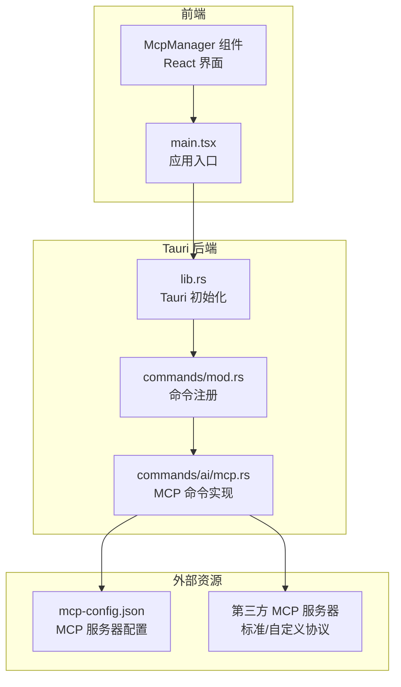
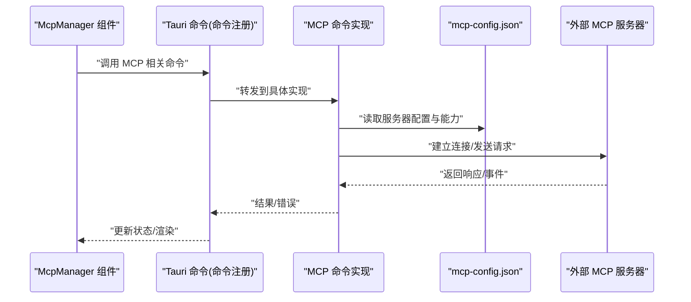
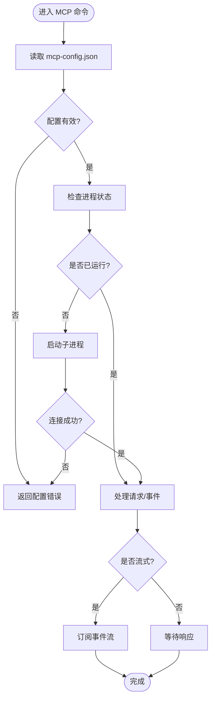
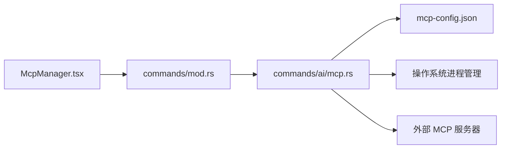

# MCP 服务器插件开发

<cite>
**本文引用的文件**   
- [ai-tools/mcp-config.json](file://ai-tools/mcp-config.json)
- [src-tauri/src/commands/ai/mcp.rs](file://src-tauri/src/commands/ai/mcp.rs)
- [src/components/ai/McpManager.tsx](file://src/components/ai/McpManager.tsx)
- [src-tauri/src/commands/mod.rs](file://src-tauri/src/commands/mod.rs)
- [src-tauri/src/lib.rs](file://src-tauri/src/lib.rs)
- [src/main.tsx](file://src/main.tsx)
- [docs/tool-config/qwen-code/features/mcp.md](file://docs/tool-config/qwen-code/features/mcp.md)
</cite>

## 目录
1. [简介](#简介)
2. [项目结构](#项目结构)
3. [核心组件](#核心组件)
4. [架构总览](#架构总览)
5. [详细组件分析](#详细组件分析)
6. [依赖关系分析](#依赖关系分析)
7. [性能考虑](#性能考虑)
8. [故障排查指南](#故障排查指南)
9. [结论](#结论)
10. [附录](#附录)

## 简介
本指南面向希望在本项目中集成或扩展 Model Context Protocol（MCP）服务器的开发者。文档围绕以下目标展开：
- 解释 MCP 协议在本项目中的实现原理与通信机制
- 文档化 MCP 服务器的配置结构与能力声明，包括 mcp-config.json 的字段含义、连接参数与生命周期管理
- 说明 MCP 消息格式与交互模式（请求-响应、流式传输、错误处理）
- 提供第三方 MCP 服务器的集成示例与适配建议
- 覆盖安全考虑（认证、授权、访问控制）、调试与监控方法

## 项目结构
本项目采用前后端分离的 Tauri 应用结构：
- 前端 React 层负责 UI 与用户交互，通过 Tauri 命令调用后端 Rust 逻辑
- 后端 Rust 层暴露 Tauri 命令，封装 MCP 客户端能力，管理进程生命周期与通信
- 配置文件 ai-tools/mcp-config.json 用于声明可用的 MCP 服务器及其连接参数

图表来源
- [src/components/ai/McpManager.tsx](file://src/components/ai/McpManager.tsx)
- [src/main.tsx](file://src/main.tsx)
- [src-tauri/src/lib.rs](file://src-tauri/src/lib.rs)
- [src-tauri/src/commands/mod.rs](file://src-tauri/src/commands/mod.rs)
- [src-tauri/src/commands/ai/mcp.rs](file://src-tauri/src/commands/ai/mcp.rs)
- [ai-tools/mcp-config.json](file://ai-tools/mcp-config.json)

章节来源
- [src/components/ai/McpManager.tsx](file://src/components/ai/McpManager.tsx)
- [src/main.tsx](file://src/main.tsx)
- [src-tauri/src/lib.rs](file://src-tauri/src/lib.rs)
- [src-tauri/src/commands/mod.rs](file://src-tauri/src/commands/mod.rs)
- [src-tauri/src/commands/ai/mcp.rs](file://src-tauri/src/commands/ai/mcp.rs)
- [ai-tools/mcp-config.json](file://ai-tools/mcp-config.json)

## 核心组件
- McpManager 组件：提供 MCP 服务器的可视化管理与操作入口，触发后端命令进行启动、停止、重启与状态查询
- Tauri 命令模块：在 commands/mod.rs 中统一注册，将前端调用映射到具体实现
- MCP 命令实现：commands/ai/mcp.rs 中实现具体的 MCP 客户端逻辑，包括读取配置、启动子进程、发送请求、接收响应与事件
- 配置文件：ai-tools/mcp-config.json 描述可用 MCP 服务器列表、连接参数与能力声明

章节来源
- [src/components/ai/McpManager.tsx](file://src/components/ai/McpManager.tsx)
- [src-tauri/src/commands/mod.rs](file://src-tauri/src/commands/mod.rs)
- [src-tauri/src/commands/ai/mcp.rs](file://src-tauri/src/commands/ai/mcp.rs)
- [ai-tools/mcp-config.json](file://ai-tools/mcp-config.json)

## 架构总览
整体架构遵循“前端 UI → Tauri 命令 → MCP 客户端 → 外部 MCP 服务器”的分层模型。Tauri 作为桥接层，负责进程管理、序列化/反序列化、错误传播与日志输出；MCP 客户端根据配置动态选择并连接目标服务器，支持请求-响应与流式事件。

图表来源
- [src/components/ai/McpManager.tsx](file://src/components/ai/McpManager.tsx)
- [src-tauri/src/commands/mod.rs](file://src-tauri/src/commands/mod.rs)
- [src-tauri/src/commands/ai/mcp.rs](file://src-tauri/src/commands/ai/mcp.rs)
- [ai-tools/mcp-config.json](file://ai-tools/mcp-config.json)

## 详细组件分析

### MCP 命令实现（Rust）
- 职责：解析 mcp-config.json，维护已启动的 MCP 服务器实例，处理请求-响应与流式事件，封装错误类型并向上抛出
- 关键流程：
  - 启动：根据配置生成命令行参数与环境变量，创建子进程并记录 PID
  - 请求：构造 MCP 消息，写入标准输入或 IPC 通道，等待响应或订阅事件
  - 停止：优雅关闭子进程，释放资源
  - 重启：先停止再启动，确保幂等性
- 错误处理：网络不可达、进程崩溃、超时、非法配置等场景需明确区分并返回结构化错误信息

图表来源
- [src-tauri/src/commands/ai/mcp.rs](file://src-tauri/src/commands/ai/mcp.rs)
- [ai-tools/mcp-config.json](file://ai-tools/mcp-config.json)

章节来源
- [src-tauri/src/commands/ai/mcp.rs](file://src-tauri/src/commands/ai/mcp.rs)

### 前端 McpManager 组件
- 职责：展示 MCP 服务器列表、状态与能力，提供启动/停止/重启按钮，实时刷新状态
- 交互：通过 Tauri 命令与后端通信，监听状态变更并更新 UI
- 容错：对后端返回的错误进行友好提示，支持重试与手动刷新

章节来源
- [src/components/ai/McpManager.tsx](file://src/components/ai/McpManager.tsx)

### 命令注册与 Tauri 初始化
- 命令注册：在 commands/mod.rs 中集中注册所有 Tauri 命令，便于统一管理
- 初始化：lib.rs 中完成 Tauri 应用初始化，挂载命令与中间件

章节来源
- [src-tauri/src/commands/mod.rs](file://src-tauri/src/commands/mod.rs)
- [src-tauri/src/lib.rs](file://src-tauri/src/lib.rs)

### 应用入口
- main.tsx 负责加载前端根组件与 Tauri 桥接，确保命令通道就绪后再渲染 UI

章节来源
- [src/main.tsx](file://src/main.tsx)

### 配置结构（mcp-config.json）
- 用途：声明可用的 MCP 服务器集合、连接参数与能力声明
- 关键字段（概念性说明）：
  - servers：数组，每个元素代表一个 MCP 服务器
    - name：服务器名称
    - command：可执行文件或脚本路径
    - args：启动参数数组
    - env：环境变量键值对
    - capabilities：能力声明对象，包含支持的协议版本、工具集、事件类型等
    - transport：传输方式（如 stdio、ipc、http），默认 stdio
    - timeout：请求超时时间（毫秒）
    - retry：重试策略（次数、间隔）
- 校验：启动前对必填字段与类型进行校验，失败时阻止启动并返回错误

章节来源
- [ai-tools/mcp-config.json](file://ai-tools/mcp-config.json)

### 消息格式与交互模式
- 请求-响应：客户端发送带唯一 ID 的请求，服务端返回对应 ID 的响应；错误以结构化错误对象返回
- 流式传输：服务端推送事件流，客户端按事件类型分发处理；适用于进度、日志、增量数据
- 错误处理：网络错误、超时、协议不匹配、权限不足等分类，前端显示友好提示，后端记录详细日志

章节来源
- [src-tauri/src/commands/ai/mcp.rs](file://src-tauri/src/commands/ai/mcp.rs)

### 第三方 MCP 服务器集成示例
- 标准 MCP 服务器：直接通过 command 与 args 启动，transport 使用 stdio 或 ipc
- 自定义协议适配：若第三方服务器使用非标准协议，可在 MCP 命令实现中添加适配器层，将标准 MCP 消息转换为目标协议消息
- 参考文档：qwen-code 的 MCP 功能文档可作为理解能力声明与配置的参考

章节来源
- [docs/tool-config/qwen-code/features/mcp.md](file://docs/tool-config/qwen-code/features/mcp.md)

## 依赖关系分析
- 前端依赖 Tauri 命令通道，后端依赖文件系统读取配置与操作系统进程管理
- 耦合点：
  - McpManager 与 Tauri 命令接口
  - MCP 命令实现与 mcp-config.json 结构
  - 外部 MCP 服务器的协议契约

图表来源
- [src/components/ai/McpManager.tsx](file://src/components/ai/McpManager.tsx)
- [src-tauri/src/commands/mod.rs](file://src-tauri/src/commands/mod.rs)
- [src-tauri/src/commands/ai/mcp.rs](file://src-tauri/src/commands/ai/mcp.rs)
- [ai-tools/mcp-config.json](file://ai-tools/mcp-config.json)

章节来源
- [src/components/ai/McpManager.tsx](file://src/components/ai/McpManager.tsx)
- [src-tauri/src/commands/mod.rs](file://src-tauri/src/commands/mod.rs)
- [src-tauri/src/commands/ai/mcp.rs](file://src-tauri/src/commands/ai/mcp.rs)
- [ai-tools/mcp-config.json](file://ai-tools/mcp-config.json)

## 性能考虑
- 进程复用：避免频繁启停，尽量复用已运行的 MCP 服务器进程
- 并发控制：限制同时发起的请求数量，防止阻塞与资源耗尽
- 超时与重试：合理设置超时时间与重试策略，提升鲁棒性
- 流式优化：对大体积数据采用分块传输与背压控制
- 日志采样：在高吞吐场景下对日志进行采样，降低 I/O 压力

## 故障排查指南
- 常见问题：
  - 配置错误：字段缺失或类型不符导致启动失败
  - 进程崩溃：外部服务器异常退出，需捕获并重启
  - 超时：网络或服务端处理慢，需调整超时参数
  - 权限不足：无法执行命令或访问文件，需检查权限与环境变量
- 诊断步骤：
  - 查看后端日志定位错误堆栈
  - 验证 mcp-config.json 语法与字段
  - 手动执行命令确认可独立运行
  - 使用网络抓包或 IPC 监控工具观察消息流

章节来源
- [src-tauri/src/commands/ai/mcp.rs](file://src-tauri/src/commands/ai/mcp.rs)

## 结论
通过在 Tauri 后端封装 MCP 客户端逻辑，并在前端提供可视化管理界面，本项目实现了可扩展的 MCP 服务器插件体系。借助统一的配置结构与清晰的命令接口，开发者可以快速集成标准与自定义 MCP 服务器，并通过完善的错误处理与监控手段保障稳定性。

## 附录
- 最佳实践：
  - 为每个 MCP 服务器定义最小必要能力，避免过度声明
  - 使用环境变量注入敏感信息，避免硬编码
  - 为关键操作添加审计日志，便于追踪与合规
- 参考链接：
  - qwen-code MCP 功能文档可作为能力声明与配置的参考