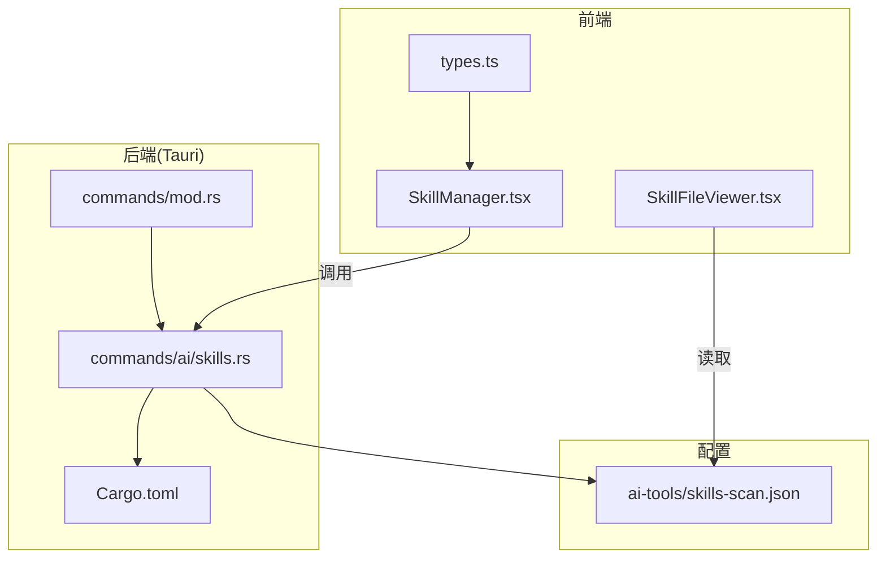
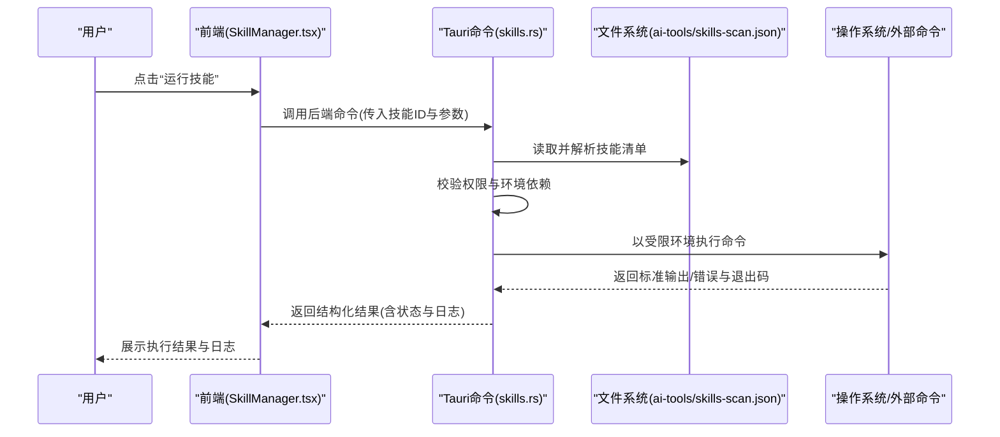
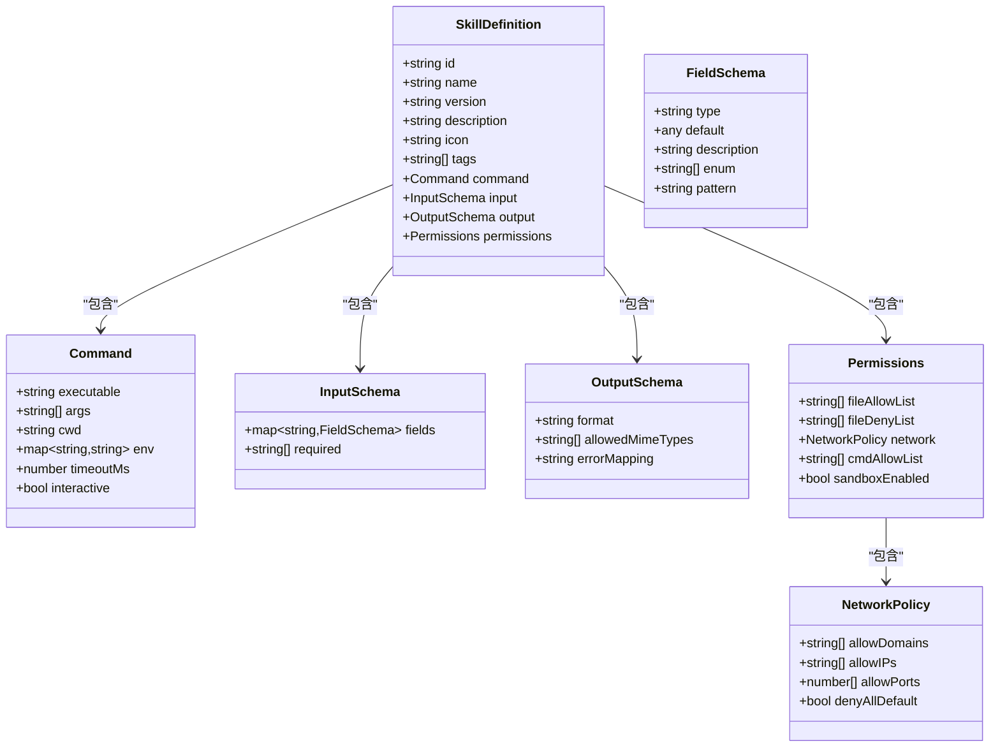
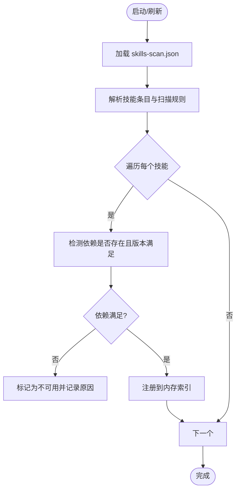
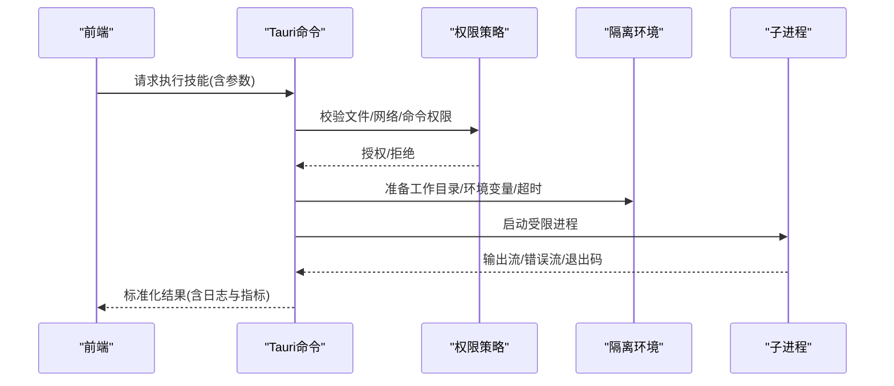
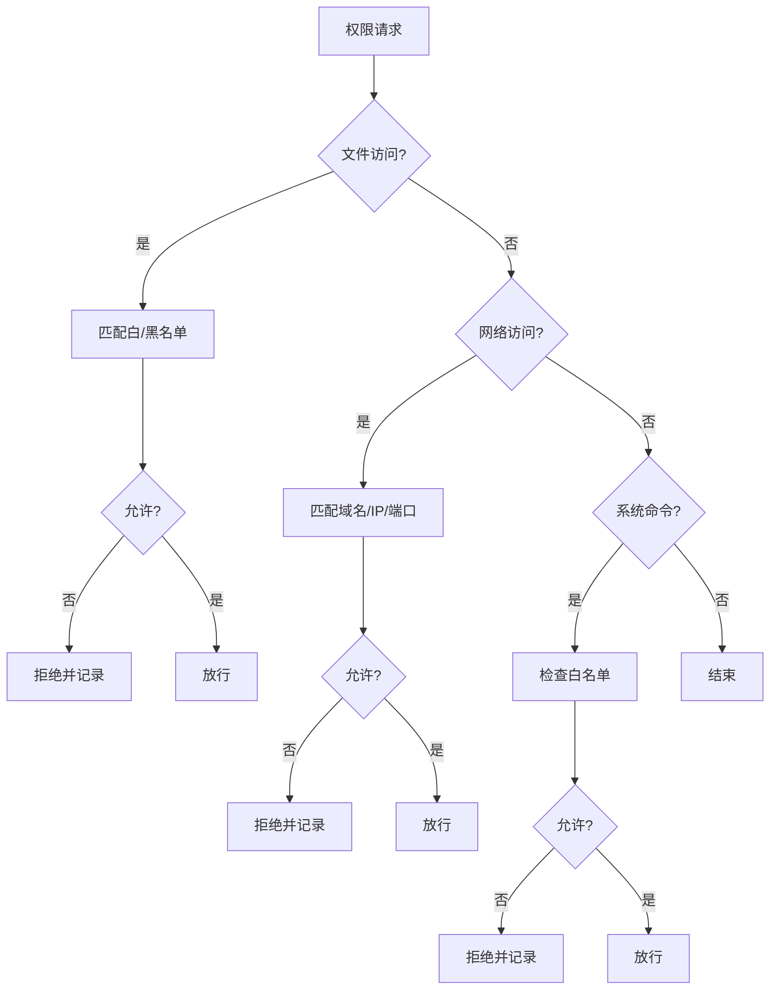
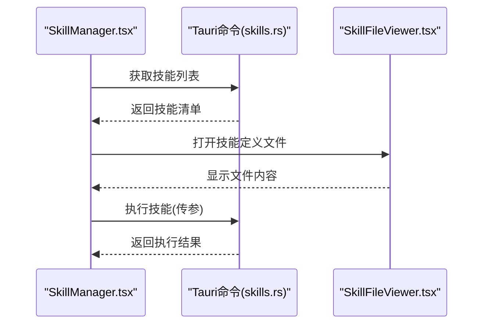
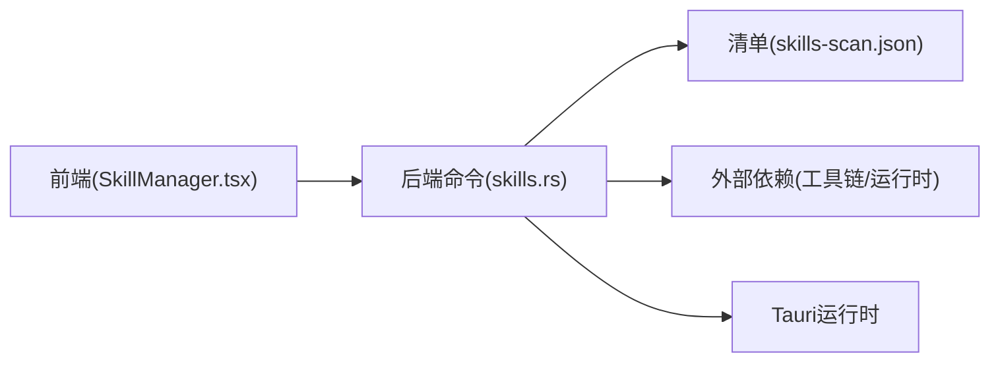

# 技能插件开发

<cite>
**本文引用的文件**   
- [ai-tools/skills-scan.json](file://ai-tools/skills-scan.json)
- [src-tauri/src/commands/ai/skills.rs](file://src-tauri/src/commands/ai/skills.rs)
- [src/components/ai/SkillManager.tsx](file://src/components/ai/SkillManager.tsx)
- [src/components/ai/SkillFileViewer.tsx](file://src/components/ai/SkillFileViewer.tsx)
- [src/components/ai/types.ts](file://src/components/ai/types.ts)
- [src-tauri/src/commands/mod.rs](file://src-tauri/src/commands/mod.rs)
- [src-tauri/Cargo.toml](file://src-tauri/Cargo.toml)
</cite>

## 目录
1. [简介](#简介)
2. [项目结构](#项目结构)
3. [核心组件](#核心组件)
4. [架构总览](#架构总览)
5. [详细组件分析](#详细组件分析)
6. [依赖分析](#依赖分析)
7. [性能考虑](#性能考虑)
8. [故障排查指南](#故障排查指南)
9. [结论](#结论)
10. [附录](#附录)

## 简介
本指南面向希望为系统扩展“技能”能力的开发者，围绕以下目标展开：
- 定义与理解 SkillDefinition 数据结构（元数据、执行命令、输入输出规范、权限要求）
- 说明技能发现机制（skills-scan.json 配置、自动扫描规则、依赖检测）
- 解释技能执行引擎的工作流程（命令执行、环境隔离、结果处理）
- 描述权限控制系统（文件访问、网络访问、系统命令限制）
- 提供从定义到部署的完整自定义技能开发示例
- 介绍测试框架、调试工具与性能优化建议

## 项目结构
本项目采用前后端分离的 Tauri 应用结构：前端使用 React + TypeScript，后端使用 Rust。技能相关能力由后端命令模块暴露，前端通过 UI 组件进行管理与展示。

图表来源
- [src/components/ai/SkillManager.tsx](file://src/components/ai/SkillManager.tsx)
- [src/components/ai/SkillFileViewer.tsx](file://src/components/ai/SkillFileViewer.tsx)
- [src/components/ai/types.ts](file://src/components/ai/types.ts)
- [src-tauri/src/commands/mod.rs](file://src-tauri/src/commands/mod.rs)
- [src-tauri/src/commands/ai/skills.rs](file://src-tauri/src/commands/ai/skills.rs)
- [ai-tools/skills-scan.json](file://ai-tools/skills-scan.json)
- [src-tauri/Cargo.toml](file://src-tauri/Cargo.toml)

章节来源
- [src-tauri/src/commands/mod.rs](file://src-tauri/src/commands/mod.rs)
- [src-tauri/src/commands/ai/skills.rs](file://src-tauri/src/commands/ai/skills.rs)
- [src/components/ai/SkillManager.tsx](file://src/components/ai/SkillManager.tsx)
- [src/components/ai/SkillFileViewer.tsx](file://src/components/ai/SkillFileViewer.tsx)
- [src/components/ai/types.ts](file://src/components/ai/types.ts)
- [ai-tools/skills-scan.json](file://ai-tools/skills-scan.json)
- [src-tauri/Cargo.toml](file://src-tauri/Cargo.toml)

## 核心组件
- 技能发现与清单
  - 通过 ai-tools/skills-scan.json 声明技能清单与扫描规则，作为技能注册中心。
- 后端命令接口
  - 在 commands/ai/skills.rs 中实现技能的查询、解析、执行等能力，并通过 mod.rs 注册为 Tauri 命令。
- 前端管理界面
  - SkillManager.tsx 负责列出、筛选、触发技能；SkillFileViewer.tsx 用于查看技能定义文件；types.ts 定义前后端交互的数据类型。

章节来源
- [ai-tools/skills-scan.json](file://ai-tools/skills-scan.json)
- [src-tauri/src/commands/ai/skills.rs](file://src-tauri/src/commands/ai/skills.rs)
- [src-tauri/src/commands/mod.rs](file://src-tauri/src/commands/mod.rs)
- [src/components/ai/SkillManager.tsx](file://src/components/ai/SkillManager.tsx)
- [src/components/ai/SkillFileViewer.tsx](file://src/components/ai/SkillFileViewer.tsx)
- [src/components/ai/types.ts](file://src/components/ai/types.ts)

## 架构总览
整体架构遵循“前端 UI -> Tauri 命令 -> 文件系统/外部命令”的分层模式。技能清单位于 ai-tools 目录，便于集中维护；Tauri 命令负责加载清单、校验权限、执行命令并返回结构化结果；前端负责渲染与管理。

图表来源
- [src/components/ai/SkillManager.tsx](file://src/components/ai/SkillManager.tsx)
- [src-tauri/src/commands/ai/skills.rs](file://src-tauri/src/commands/ai/skills.rs)
- [ai-tools/skills-scan.json](file://ai-tools/skills-scan.json)

## 详细组件分析

### 技能定义模型（SkillDefinition）
- 元数据
  - 名称、版本、作者、描述、图标、标签等，用于 UI 展示与检索。
- 执行命令
  - 指定可执行路径或脚本入口、工作目录、环境变量、超时时间、是否允许交互式输入等。
- 输入输出规范
  - 输入参数 schema（类型、必填、默认值、校验规则）、输出格式（JSON/文本/二进制）、错误码约定。
- 权限要求
  - 文件访问白名单/黑名单、网络访问策略（域名/IP/端口）、系统命令白名单、沙箱开关。

图表来源
- [src/components/ai/types.ts](file://src/components/ai/types.ts)
- [src-tauri/src/commands/ai/skills.rs](file://src-tauri/src/commands/ai/skills.rs)

章节来源
- [src/components/ai/types.ts](file://src/components/ai/types.ts)
- [src-tauri/src/commands/ai/skills.rs](file://src-tauri/src/commands/ai/skills.rs)

### 技能发现机制（skills-scan.json）
- 配置文件职责
  - 集中声明所有可用技能及其元数据、扫描路径、依赖项、版本约束、启用/禁用标记。
- 自动扫描规则
  - 支持按目录递归扫描、按文件名/后缀匹配、按包管理器清单识别（如 package.json、requirements.txt 等）。
- 依赖检测
  - 根据声明的依赖列表检查本地环境是否满足（可执行存在、版本范围、必要库），不满足时在前端提示安装指引。

图表来源
- [ai-tools/skills-scan.json](file://ai-tools/skills-scan.json)
- [src-tauri/src/commands/ai/skills.rs](file://src-tauri/src/commands/ai/skills.rs)

章节来源
- [ai-tools/skills-scan.json](file://ai-tools/skills-scan.json)
- [src-tauri/src/commands/ai/skills.rs](file://src-tauri/src/commands/ai/skills.rs)

### 技能执行引擎
- 命令执行
  - 基于 Command 字段拼装进程参数，设置工作目录与环境变量，支持超时控制与可选的交互式输入。
- 环境隔离
  - 通过权限策略限制文件读写范围、网络访问目标、系统命令白名单；必要时启用沙箱模式。
- 结果处理
  - 统一封装标准输出、标准错误、退出码、耗时、资源占用等信息，转换为前端友好的结构化响应。

图表来源
- [src-tauri/src/commands/ai/skills.rs](file://src-tauri/src/commands/ai/skills.rs)
- [src/components/ai/SkillManager.tsx](file://src/components/ai/SkillManager.tsx)

章节来源
- [src-tauri/src/commands/ai/skills.rs](file://src-tauri/src/commands/ai/skills.rs)
- [src/components/ai/SkillManager.tsx](file://src/components/ai/SkillManager.tsx)

### 权限控制系统
- 文件访问权限
  - 基于白名单/黑名单策略，限定技能可访问的路径集合；支持相对路径与工作目录拼接计算。
- 网络访问控制
  - 通过域名/IP/端口白名单限制出站连接；默认拒绝策略配合显式放行。
- 系统命令限制
  - 仅允许白名单中的命令被调用；对危险命令进行拦截与审计。
- 沙箱模式
  - 在受控环境中运行，限制系统调用与资源上限，降低风险面。

图表来源
- [src-tauri/src/commands/ai/skills.rs](file://src-tauri/src/commands/ai/skills.rs)
- [src/components/ai/types.ts](file://src/components/ai/types.ts)

章节来源
- [src-tauri/src/commands/ai/skills.rs](file://src-tauri/src/commands/ai/skills.rs)
- [src/components/ai/types.ts](file://src/components/ai/types.ts)

### 前端管理界面
- SkillManager.tsx
  - 负责加载技能列表、过滤与搜索、触发执行、展示结果与日志。
- SkillFileViewer.tsx
  - 提供对技能定义文件的可视化浏览，便于定位问题与核对配置。
- types.ts
  - 定义前后端交互的类型契约，确保数据结构一致。

图表来源
- [src/components/ai/SkillManager.tsx](file://src/components/ai/SkillManager.tsx)
- [src/components/ai/SkillFileViewer.tsx](file://src/components/ai/SkillFileViewer.tsx)
- [src-tauri/src/commands/ai/skills.rs](file://src-tauri/src/commands/ai/skills.rs)

章节来源
- [src/components/ai/SkillManager.tsx](file://src/components/ai/SkillManager.tsx)
- [src/components/ai/SkillFileViewer.tsx](file://src/components/ai/SkillFileViewer.tsx)
- [src/components/ai/types.ts](file://src/components/ai/types.ts)
- [src-tauri/src/commands/ai/skills.rs](file://src-tauri/src/commands/ai/skills.rs)

## 依赖分析
- 模块耦合
  - 前端 SkillManager 依赖后端 skills 命令；后端命令依赖清单文件与系统资源。
- 外部依赖
  - 构建与运行时依赖由 Cargo.toml 管理；技能执行可能依赖外部工具链与语言运行时。

图表来源
- [src/components/ai/SkillManager.tsx](file://src/components/ai/SkillManager.tsx)
- [src-tauri/src/commands/ai/skills.rs](file://src-tauri/src/commands/ai/skills.rs)
- [ai-tools/skills-scan.json](file://ai-tools/skills-scan.json)
- [src-tauri/Cargo.toml](file://src-tauri/Cargo.toml)

章节来源
- [src-tauri/Cargo.toml](file://src-tauri/Cargo.toml)
- [src-tauri/src/commands/ai/skills.rs](file://src-tauri/src/commands/ai/skills.rs)
- [src/components/ai/SkillManager.tsx](file://src/components/ai/SkillManager.tsx)
- [ai-tools/skills-scan.json](file://ai-tools/skills-scan.json)

## 性能考虑
- 清单缓存
  - 对 skills-scan.json 的解析结果进行内存缓存，避免频繁 IO。
- 并行发现
  - 多目录/多规则并发扫描，提升发现速度。
- 懒加载
  - 仅在需要时加载技能详情与依赖信息。
- 执行限流
  - 对并发执行的技能数量进行限制，防止资源争用。
- 超时与取消
  - 为长耗时任务设置合理超时，并提供取消机制。
- 日志采样
  - 对高频日志进行采样，减少 I/O 开销。

[本节为通用指导，无需源码引用]

## 故障排查指南
- 常见问题
  - 技能未出现在列表：检查清单路径与扫描规则是否正确；确认依赖是否满足。
  - 执行失败：查看标准错误输出与退出码；核对权限策略是否放行所需资源。
  - 网络异常：确认域名/IP/端口是否在白名单内；检查代理与防火墙设置。
- 调试工具
  - 使用 SkillFileViewer.tsx 快速定位配置问题。
  - 在后端命令中增加详细日志，结合前端日志面板进行排障。
- 回滚与恢复
  - 保留历史版本的清单与配置；出现问题时可快速回滚。

章节来源
- [src/components/ai/SkillFileViewer.tsx](file://src/components/ai/SkillFileViewer.tsx)
- [src-tauri/src/commands/ai/skills.rs](file://src-tauri/src/commands/ai/skills.rs)

## 结论
通过清晰的 SkillDefinition 模型、集中的清单发现机制、严格的权限控制与健壮的执行引擎，本系统为技能插件提供了可扩展、安全、易用的基础能力。开发者可据此快速构建高质量技能，并在生产环境中稳定运行。

[本节为总结性内容，无需源码引用]

## 附录

### 自定义技能开发全流程示例
- 步骤一：定义技能清单
  - 在 ai-tools/skills-scan.json 中添加新技能条目，填写元数据、扫描路径与依赖。
- 步骤二：编写执行脚本
  - 按照 Command 字段要求准备可执行文件或脚本，确保工作目录与环境变量正确。
- 步骤三：声明输入输出
  - 在 InputSchema 与 OutputSchema 中定义参数与返回格式，保证前后端一致性。
- 步骤四：配置权限
  - 在 Permissions 中设置文件、网络与命令白名单，必要时开启沙箱。
- 步骤五：本地验证
  - 使用前端 SkillManager 触发执行，观察结果与日志；必要时调整策略与参数。
- 步骤六：发布与分发
  - 将清单与脚本纳入版本管理，随应用打包发布；更新依赖与文档。

章节来源
- [ai-tools/skills-scan.json](file://ai-tools/skills-scan.json)
- [src/components/ai/SkillManager.tsx](file://src/components/ai/SkillManager.tsx)
- [src-tauri/src/commands/ai/skills.rs](file://src-tauri/src/commands/ai/skills.rs)

### 测试框架与最佳实践
- 单元测试
  - 针对输入校验、权限判断、结果转换逻辑编写用例。
- 集成测试
  - 模拟真实执行环境，覆盖成功、失败、超时、权限拒绝等场景。
- 回归测试
  - 在清单变更或依赖升级后自动运行关键用例，保障稳定性。
- 性能基准
  - 对高并发执行与大数据量输出进行压测，评估资源占用与吞吐。

[本节为通用指导，无需源码引用]