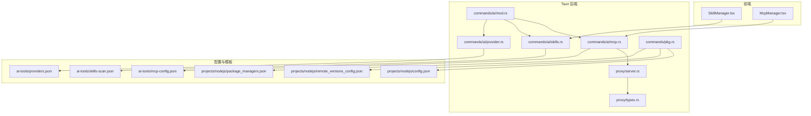
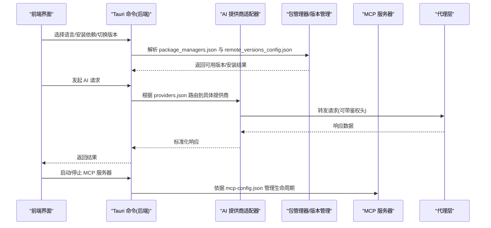
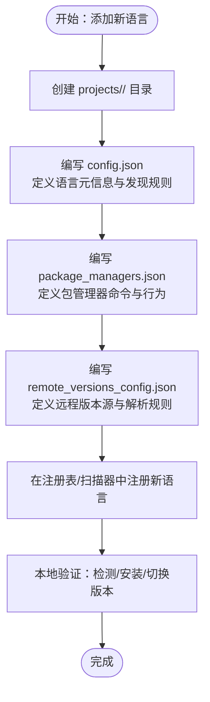
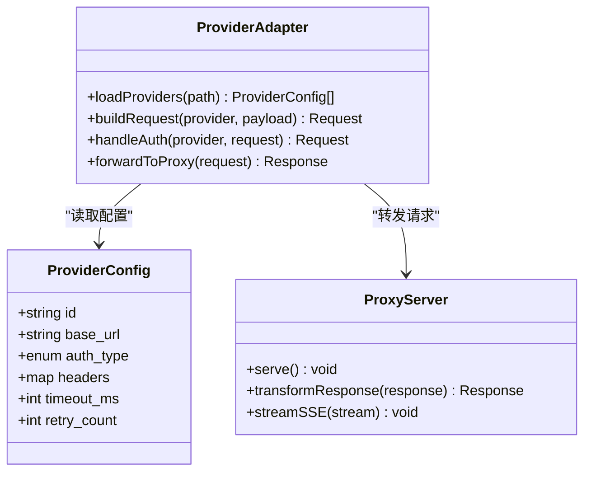
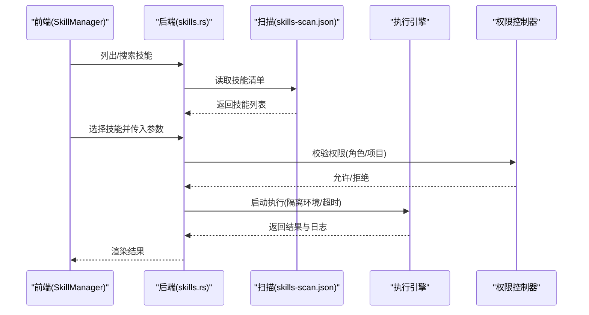
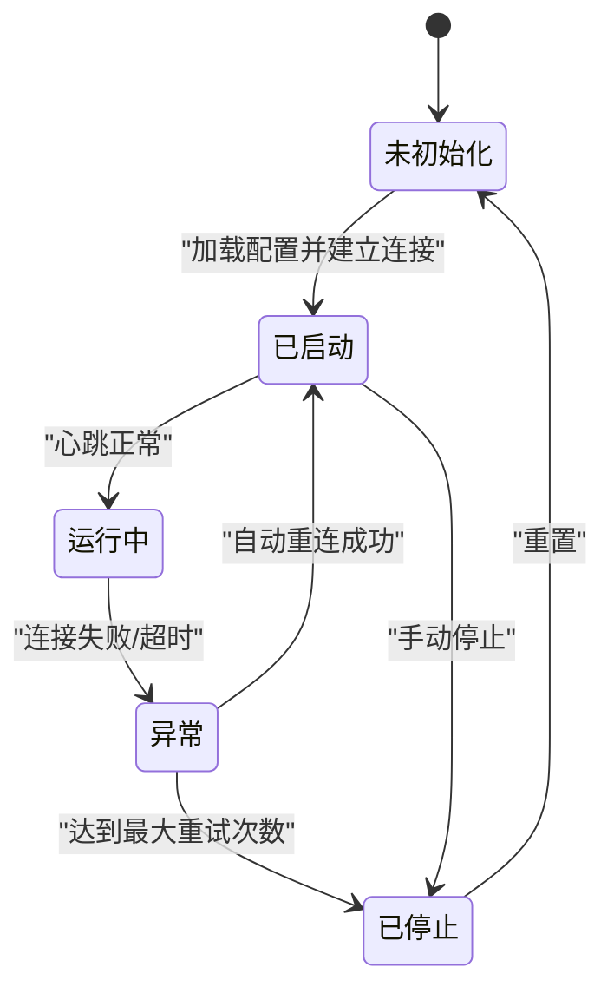
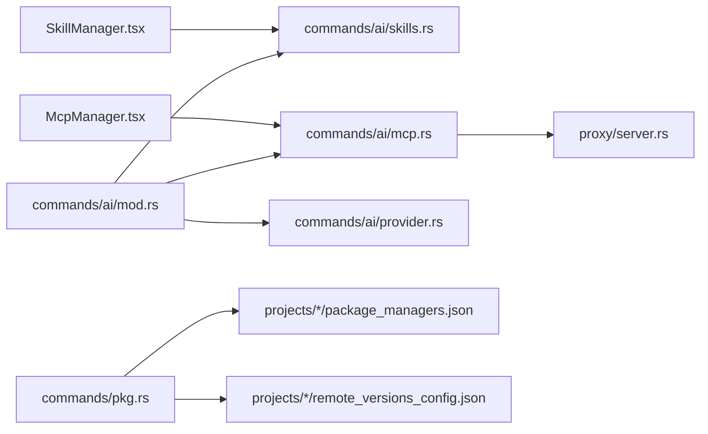

# 插件开发指南

<cite>
**本文引用的文件**   
- [ai-tools/providers.json](file://ai-tools/providers.json)
- [ai-tools/mcp-config.json](file://ai-tools/mcp-config.json)
- [ai-tools/skills-scan.json](file://ai-tools/skills-scan.json)
- [projects/nodejs/config.json](file://projects/nodejs/config.json)
- [projects/nodejs/package_managers.json](file://projects/nodejs/package_managers.json)
- [projects/nodejs/remote_versions_config.json](file://projects/nodejs/remote_versions_config.json)
- [src/components/ai/SkillManager.tsx](file://src/components/ai/SkillManager.tsx)
- [src/components/ai/McpManager.tsx](file://src/components/ai/McpManager.tsx)
- [src-tauri/src/commands/ai/mod.rs](file://src-tauri/src/commands/ai/mod.rs)
- [src-tauri/src/commands/ai/provider.rs](file://src-tauri/src/commands/ai/provider.rs)
- [src-tauri/src/commands/ai/skills.rs](file://src-tauri/src/commands/ai/skills.rs)
- [src-tauri/src/commands/ai/mcp.rs](file://src-tauri/src/commands/ai/mcp.rs)
- [src-tauri/src/commands/project/types.rs](file://src-tauri/src/commands/project/types.rs)
- [src-tauri/src/commands/project/registry.rs](file://src-tauri/src/commands/project/registry.rs)
- [src-tauri/src/commands/project/scanner.rs](file://src-tauri/src/commands/project/scanner.rs)
- [src-tauri/src/commands/project/versions.rs](file://src-tauri/src/commands/project/versions.rs)
- [src-tauri/src/commands/pkg.rs](file://src-tauri/src/commands/pkg.rs)
- [src-tauri/src/proxy/server.rs](file://src-tauri/src/proxy/server.rs)
- [src-tauri/src/proxy/types.rs](file://src-tauri/src/proxy/types.rs)
- [scripts/bump-version.js](file://scripts/bump-version.js)
- [.github/workflows/release.yml](file://.github/workflows/release.yml)
</cite>

## 目录
1. [简介](#简介)
2. [项目结构](#项目结构)
3. [核心组件](#核心组件)
4. [架构总览](#架构总览)
5. [详细组件分析](#详细组件分析)
6. [依赖关系分析](#依赖关系分析)
7. [性能考虑](#性能考虑)
8. [故障排查指南](#故障排查指南)
9. [结论](#结论)
10. [附录](#附录)

## 简介
本指南面向希望为当前工程扩展“语言支持”、“AI 提供商”、“技能系统”和“MCP 服务器”的开发者。文档覆盖以下主题：
- 新增语言支持：通过 projects/*/config.json、包管理器集成与远程版本配置，实现新语言的发现、安装与版本管理。
- AI 提供商扩展：基于 providers.json 的配置驱动方式，结合后端命令模块加载与认证处理。
- 技能系统：SkillDefinition 结构、扫描与执行引擎、权限控制策略。
- MCP 服务器：配置、启动、生命周期管理与集成方式。
- 插件生命周期、错误处理与日志记录。
- 插件测试方法与发布流程（含版本升级脚本与 CI）。

## 项目结构
仓库采用前后端分离与多语言项目模板的组合式结构：
- 前端 React/Tauri 应用：提供 UI 与交互入口，调用 Rust 后端命令。
- Rust Tauri 后端：暴露命令接口，负责配置解析、进程管理、网络代理、MCP 服务、技能执行等。
- 语言项目模板：位于 projects/*，每个子目录描述一种语言或工具的发现规则、包管理器与远程版本信息。
- AI 工具配置：ai-tools 下集中存放 providers、MCP、技能扫描结果等全局配置。

图表来源
- [src/components/ai/SkillManager.tsx](file://src/components/ai/SkillManager.tsx)
- [src/components/ai/McpManager.tsx](file://src/components/ai/McpManager.tsx)
- [src-tauri/src/commands/ai/mod.rs](file://src-tauri/src/commands/ai/mod.rs)
- [src-tauri/src/commands/ai/provider.rs](file://src-tauri/src/commands/ai/provider.rs)
- [src-tauri/src/commands/ai/skills.rs](file://src-tauri/src/commands/ai/skills.rs)
- [src-tauri/src/commands/ai/mcp.rs](file://src-tauri/src/commands/ai/mcp.rs)
- [src-tauri/src/commands/pkg.rs](file://src-tauri/src/commands/pkg.rs)
- [src-tauri/src/proxy/server.rs](file://src-tauri/src/proxy/server.rs)
- [src-tauri/src/proxy/types.rs](file://src-tauri/src/proxy/types.rs)
- [ai-tools/providers.json](file://ai-tools/providers.json)
- [ai-tools/mcp-config.json](file://ai-tools/mcp-config.json)
- [ai-tools/skills-scan.json](file://ai-tools/skills-scan.json)
- [projects/nodejs/config.json](file://projects/nodejs/config.json)
- [projects/nodejs/package_managers.json](file://projects/nodejs/package_managers.json)
- [projects/nodejs/remote_versions_config.json](file://projects/nodejs/remote_versions_config.json)

章节来源
- [src-tauri/src/commands/ai/mod.rs](file://src-tauri/src/commands/ai/mod.rs)
- [src-tauri/src/commands/project/types.rs](file://src-tauri/src/commands/project/types.rs)
- [src-tauri/src/commands/project/registry.rs](file://src-tauri/src/commands/project/registry.rs)
- [src-tauri/src/commands/project/scanner.rs](file://src-tauri/src/commands/project/scanner.rs)
- [src-tauri/src/commands/project/versions.rs](file://src-tauri/src/commands/project/versions.rs)

## 核心组件
- 语言项目注册表与扫描器：负责从 projects/* 模板中读取语言定义、发现规则与包管理器配置，并在项目中自动识别语言类型与可用工具链。
- 包管理器与版本管理：根据 package_managers.json 与 remote_versions_config.json 进行包安装、更新与远程版本列表获取。
- AI 提供商：通过 providers.json 声明式配置，后端在运行时加载并统一认证与请求转发。
- 技能系统：基于 skills-scan.json 与 SkillDefinition 结构，提供技能的发现、权限校验与执行。
- MCP 服务器：通过 mcp-config.json 管理 MCP 实例的生命周期、连接与通信。
- 代理层：对上游 API 请求进行优化与透传，屏蔽网络差异。

章节来源
- [src-tauri/src/commands/project/registry.rs](file://src-tauri/src/commands/project/registry.rs)
- [src-tauri/src/commands/project/scanner.rs](file://src-tauri/src/commands/project/scanner.rs)
- [src-tauri/src/commands/pkg.rs](file://src-tauri/src/commands/pkg.rs)
- [src-tauri/src/commands/ai/provider.rs](file://src-tauri/src/commands/ai/provider.rs)
- [src-tauri/src/commands/ai/skills.rs](file://src-tauri/src/commands/ai/skills.rs)
- [src-tauri/src/commands/ai/mcp.rs](file://src-tauri/src/commands/ai/mcp.rs)
- [src-tauri/src/proxy/server.rs](file://src-tauri/src/proxy/server.rs)

## 架构总览
整体采用“配置驱动 + 命令编排”的架构：
- 配置层：providers.json、mcp-config.json、skills-scan.json、projects/*/config.json、package_managers.json、remote_versions_config.json。
- 命令层：Rust 命令模块按功能域划分，对外暴露稳定接口。
- 运行层：进程管理、网络代理、MCP 客户端/服务端、技能执行环境。

图表来源
- [src-tauri/src/commands/ai/provider.rs](file://src-tauri/src/commands/ai/provider.rs)
- [src-tauri/src/commands/pkg.rs](file://src-tauri/src/commands/pkg.rs)
- [src-tauri/src/commands/ai/mcp.rs](file://src-tauri/src/commands/ai/mcp.rs)
- [src-tauri/src/proxy/server.rs](file://src-tauri/src/proxy/server.rs)
- [ai-tools/providers.json](file://ai-tools/providers.json)
- [ai-tools/mcp-config.json](file://ai-tools/mcp-config.json)
- [projects/nodejs/package_managers.json](file://projects/nodejs/package_managers.json)
- [projects/nodejs/remote_versions_config.json](file://projects/nodejs/remote_versions_config.json)

## 详细组件分析

### 新增语言支持（projects/*/config.json 与包管理器）
- 目标：为新语言创建项目模板，定义发现规则、环境变量、包管理器与远程版本源。
- 关键配置项（以 Node.js 为例）：
  - config.json：语言标识、默认工具链、环境变量、路径规则等。
  - package_managers.json：包管理器命令、安装/卸载/查询语义、镜像与缓存策略。
  - remote_versions_config.json：远程版本列表源、解析规则、缓存与刷新策略。
- 后端集成：
  - 项目注册表 registry 与扫描器 scanner 会读取 projects/* 模板，匹配当前工作区并生成语言上下文。
  - pkg 命令根据 package_managers.json 执行包操作；versions 模块使用 remote_versions_config.json 拉取并缓存版本列表。

图表来源
- [projects/nodejs/config.json](file://projects/nodejs/config.json)
- [projects/nodejs/package_managers.json](file://projects/nodejs/package_managers.json)
- [projects/nodejs/remote_versions_config.json](file://projects/nodejs/remote_versions_config.json)
- [src-tauri/src/commands/project/registry.rs](file://src-tauri/src/commands/project/registry.rs)
- [src-tauri/src/commands/project/scanner.rs](file://src-tauri/src/commands/project/scanner.rs)
- [src-tauri/src/commands/project/versions.rs](file://src-tauri/src/commands/project/versions.rs)
- [src-tauri/src/commands/pkg.rs](file://src-tauri/src/commands/pkg.rs)

章节来源
- [projects/nodejs/config.json](file://projects/nodejs/config.json)
- [projects/nodejs/package_managers.json](file://projects/nodejs/package_managers.json)
- [projects/nodejs/remote_versions_config.json](file://projects/nodejs/remote_versions_config.json)
- [src-tauri/src/commands/project/types.rs](file://src-tauri/src/commands/project/types.rs)
- [src-tauri/src/commands/project/registry.rs](file://src-tauri/src/commands/project/registry.rs)
- [src-tauri/src/commands/project/scanner.rs](file://src-tauri/src/commands/project/scanner.rs)
- [src-tauri/src/commands/project/versions.rs](file://src-tauri/src/commands/project/versions.rs)
- [src-tauri/src/commands/pkg.rs](file://src-tauri/src/commands/pkg.rs)

### AI 提供商扩展机制（providers.json 与认证）
- 目标：在不修改核心逻辑的前提下，新增第三方 AI 提供商。
- 配置驱动：
  - providers.json：声明提供商 ID、基础 URL、鉴权方式、模型映射、重试与超时策略等。
- 后端适配：
  - provider.rs 负责加载 providers.json，动态构建请求头、签名与重试策略。
  - proxy/server.rs 与 types.rs 提供统一的请求转发、SSE 流式输出与错误转换。
- 认证处理：
  - 支持多种鉴权模式（如 Bearer Token、API Key、OAuth 回调），由 providers.json 指定。
  - 敏感凭据建议通过环境变量或安全存储注入，避免硬编码。

图表来源
- [ai-tools/providers.json](file://ai-tools/providers.json)
- [src-tauri/src/commands/ai/provider.rs](file://src-tauri/src/commands/ai/provider.rs)
- [src-tauri/src/proxy/server.rs](file://src-tauri/src/proxy/server.rs)
- [src-tauri/src/proxy/types.rs](file://src-tauri/src/proxy/types.rs)

章节来源
- [ai-tools/providers.json](file://ai-tools/providers.json)
- [src-tauri/src/commands/ai/provider.rs](file://src-tauri/src/commands/ai/provider.rs)
- [src-tauri/src/proxy/server.rs](file://src-tauri/src/proxy/server.rs)
- [src-tauri/src/proxy/types.rs](file://src-tauri/src/proxy/types.rs)

### 技能系统（SkillDefinition、执行引擎与权限控制）
- 目标：提供可插拔的技能能力，包括代码生成、格式化、测试、部署等。
- 数据结构：
  - SkillDefinition：包含技能 ID、名称、描述、触发条件、输入参数、权限要求、执行命令/脚本、环境变量、超时与重试策略等。
- 扫描与注册：
  - skills-scan.json 维护已发现技能清单，供前端与管理面板展示。
  - 后端 skills.rs 负责加载、校验与执行。
- 执行引擎：
  - 隔离执行环境（沙箱/容器可选）、资源限制、超时控制、标准输出捕获与结构化日志。
- 权限控制：
  - 基于角色/用户/项目的细粒度权限矩阵，执行前进行授权检查。
  - 敏感操作需二次确认或审批流。

图表来源
- [ai-tools/skills-scan.json](file://ai-tools/skills-scan.json)
- [src-tauri/src/commands/ai/skills.rs](file://src-tauri/src/commands/ai/skills.rs)
- [src/components/ai/SkillManager.tsx](file://src/components/ai/SkillManager.tsx)

章节来源
- [ai-tools/skills-scan.json](file://ai-tools/skills-scan.json)
- [src-tauri/src/commands/ai/skills.rs](file://src-tauri/src/commands/ai/skills.rs)
- [src/components/ai/SkillManager.tsx](file://src/components/ai/SkillManager.tsx)

### MCP 服务器的开发与集成
- 目标：统一管理 MCP 服务器实例，提供启停、配置热更新与状态监控。
- 配置：
  - mcp-config.json：定义 MCP 服务器地址、协议、鉴权、超时、重试、日志级别等。
- 生命周期：
  - 启动时初始化连接池与心跳检测；异常时自动重连与降级。
  - 支持多实例并行与资源配额。
- 集成：
  - 前端 McpManager.tsx 提供可视化控制面板。
  - 后端 mcp.rs 负责与 MCP 协议交互、消息路由与错误上报。

图表来源
- [ai-tools/mcp-config.json](file://ai-tools/mcp-config.json)
- [src-tauri/src/commands/ai/mcp.rs](file://src-tauri/src/commands/ai/mcp.rs)
- [src/components/ai/McpManager.tsx](file://src/components/ai/McpManager.tsx)

章节来源
- [ai-tools/mcp-config.json](file://ai-tools/mcp-config.json)
- [src-tauri/src/commands/ai/mcp.rs](file://src-tauri/src/commands/ai/mcp.rs)
- [src/components/ai/McpManager.tsx](file://src/components/ai/McpManager.tsx)

### 插件生命周期管理、错误处理与日志记录
- 生命周期：
  - 初始化：加载配置、预热缓存、建立连接。
  - 运行：监听事件、处理请求、周期性健康检查。
  - 关闭：优雅退出、释放资源、持久化状态。
- 错误处理：
  - 统一错误码与消息结构，区分可恢复与不可恢复错误。
  - 重试策略与退避算法，熔断与降级开关。
- 日志记录：
  - 分级日志（调试/信息/警告/错误），结构化字段（trace_id、component、action）。
  - 日志轮转与采样，避免磁盘膨胀。

章节来源
- [src-tauri/src/commands/ai/mod.rs](file://src-tauri/src/commands/ai/mod.rs)
- [src-tauri/src/proxy/server.rs](file://src-tauri/src/proxy/server.rs)

### 插件开发示例与最佳实践
- 示例：新增一个自定义 AI 提供商
  - 在 providers.json 中添加条目，定义鉴权与模型映射。
  - 在 provider.rs 中补充特定签名逻辑（如需）。
  - 通过前端发起请求，观察代理层日志与响应。
- 示例：新增一个技能
  - 在 skills-scan.json 中登记技能元数据。
  - 在 skills.rs 中实现执行逻辑与权限校验。
  - 在前端 SkillManager.tsx 中增加 UI 入口与结果展示。
- 最佳实践：
  - 配置优先：所有可变行为通过 JSON 配置驱动。
  - 幂等设计：包安装、版本切换等操作具备幂等性。
  - 安全最小化：仅授予必要权限，敏感信息不落地。
  - 可观测性：关键路径埋点与指标上报。

[本节为概念性内容，无需源码引用]

## 依赖关系分析
- 前端依赖：
  - SkillManager.tsx 与 McpManager.tsx 分别依赖后端的 skills 与 mcp 命令。
- 后端依赖：
  - ai/mod.rs 聚合 provider、skills、mcp 等子模块。
  - project 模块依赖 types、registry、scanner、versions 完成语言发现与版本管理。
  - pkg 模块依赖 package_managers.json 与 remote_versions_config.json。
  - proxy 模块为所有外部请求提供统一出口。

图表来源
- [src/components/ai/SkillManager.tsx](file://src/components/ai/SkillManager.tsx)
- [src/components/ai/McpManager.tsx](file://src/components/ai/McpManager.tsx)
- [src-tauri/src/commands/ai/mod.rs](file://src-tauri/src/commands/ai/mod.rs)
- [src-tauri/src/commands/ai/provider.rs](file://src-tauri/src/commands/ai/provider.rs)
- [src-tauri/src/commands/ai/skills.rs](file://src-tauri/src/commands/ai/skills.rs)
- [src-tauri/src/commands/ai/mcp.rs](file://src-tauri/src/commands/ai/mcp.rs)
- [src-tauri/src/commands/pkg.rs](file://src-tauri/src/commands/pkg.rs)
- [src-tauri/src/proxy/server.rs](file://src-tauri/src/proxy/server.rs)
- [projects/nodejs/package_managers.json](file://projects/nodejs/package_managers.json)
- [projects/nodejs/remote_versions_config.json](file://projects/nodejs/remote_versions_config.json)

章节来源
- [src-tauri/src/commands/ai/mod.rs](file://src-tauri/src/commands/ai/mod.rs)
- [src-tauri/src/commands/pkg.rs](file://src-tauri/src/commands/pkg.rs)
- [src-tauri/src/proxy/server.rs](file://src-tauri/src/proxy/server.rs)

## 性能考虑
- 配置缓存：对 providers.json、mcp-config.json、skills-scan.json 与语言模板进行内存缓存，减少 I/O。
- 并发控制：包安装与版本切换任务队列化，限制并发度，避免阻塞主线程。
- 网络优化：代理层启用连接复用、压缩与重试退避；SSE 流式传输降低首字节延迟。
- 资源限制：技能执行设置 CPU/内存上限与超时，防止资源耗尽。
- 日志采样：在高吞吐场景下开启采样与异步写入，降低 IO 压力。

[本节为通用指导，无需源码引用]

## 故障排查指南
- 常见问题定位：
  - 语言检测失败：检查 projects/*/config.json 的发现规则与路径变量。
  - 包安装失败：核对 package_managers.json 的命令与镜像配置。
  - 远程版本不可用：查看 remote_versions_config.json 的源地址与解析规则。
  - AI 请求失败：检查 providers.json 的鉴权与基础 URL，查看代理层日志。
  - MCP 连接中断：确认 mcp-config.json 的地址与协议，关注重连与熔断状态。
- 日志与诊断：
  - 启用调试日志，收集 trace_id 与请求链路。
  - 导出关键指标（成功率、延迟、重试次数）用于趋势分析。
- 回滚与恢复：
  - 配置变更采用灰度发布与快照回滚。
  - 技能执行失败保留现场日志与中间产物以便复现。

章节来源
- [src-tauri/src/commands/ai/provider.rs](file://src-tauri/src/commands/ai/provider.rs)
- [src-tauri/src/commands/ai/mcp.rs](file://src-tauri/src/commands/ai/mcp.rs)
- [src-tauri/src/commands/pkg.rs](file://src-tauri/src/commands/pkg.rs)
- [src-tauri/src/proxy/server.rs](file://src-tauri/src/proxy/server.rs)

## 结论
本指南提供了从语言支持、AI 提供商、技能系统到 MCP 服务器的完整插件开发路径。通过配置驱动与模块化命令体系，开发者可以高效扩展能力并保持系统稳定性。建议在迭代过程中持续完善可观测性与自动化测试，确保插件质量与用户体验。

[本节为总结性内容，无需源码引用]

## 附录

### 插件测试方法
- 单元测试：针对 provider 适配、技能执行与包管理命令编写用例。
- 集成测试：端到端验证语言检测、版本切换、AI 请求与 MCP 生命周期。
- 配置校验：对 providers.json、mcp-config.json、skills-scan.json 与 projects/* 模板进行 schema 校验。
- 性能压测：模拟高并发请求与长时任务，评估资源占用与稳定性。

[本节为通用指导，无需源码引用]

### 发布流程与版本管理
- 版本升级：使用 scripts/bump-version.js 统一提升版本号与相关元数据。
- CI/CD：.github/workflows/release.yml 定义构建、打包与发布流水线。
- 发布物：包含前端产物、后端二进制与配置文件模板，附带校验与签名步骤。

章节来源
- [scripts/bump-version.js](file://scripts/bump-version.js)
- [.github/workflows/release.yml](file://.github/workflows/release.yml)