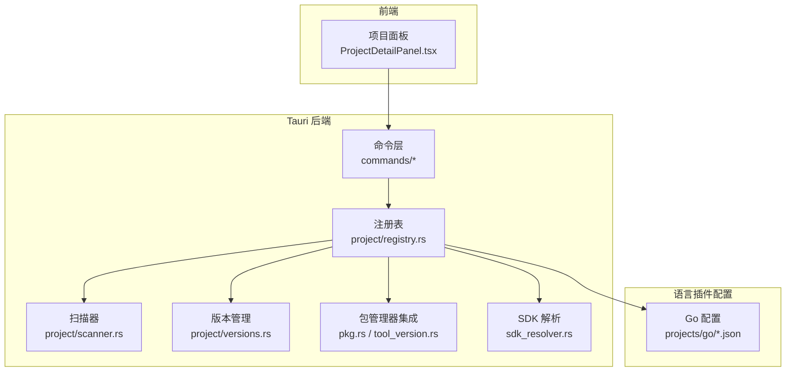
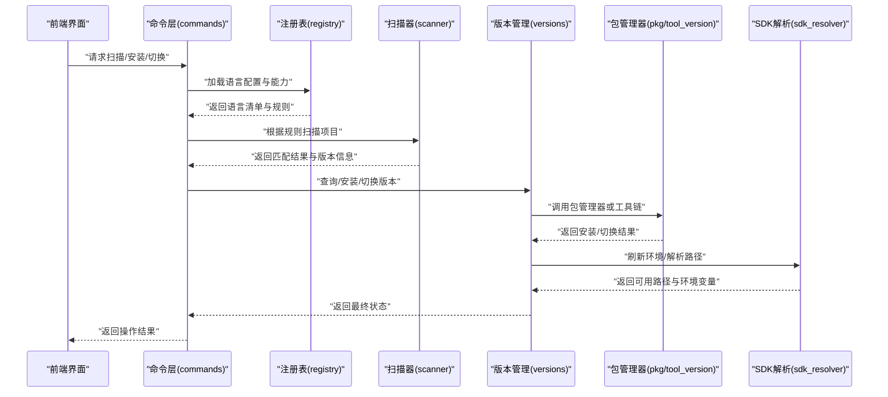
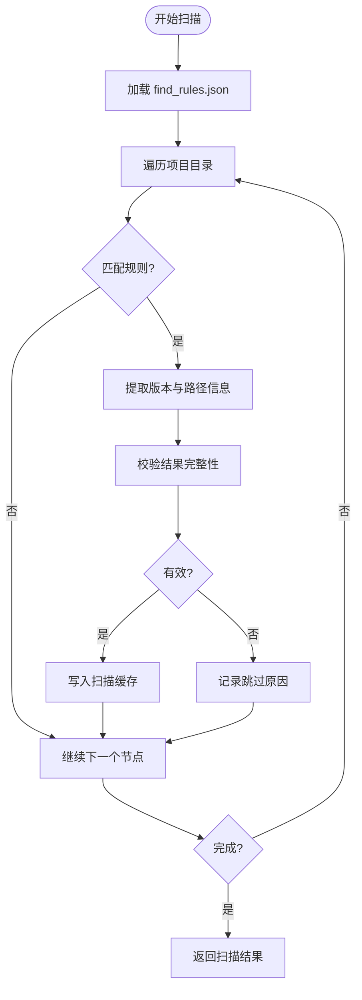
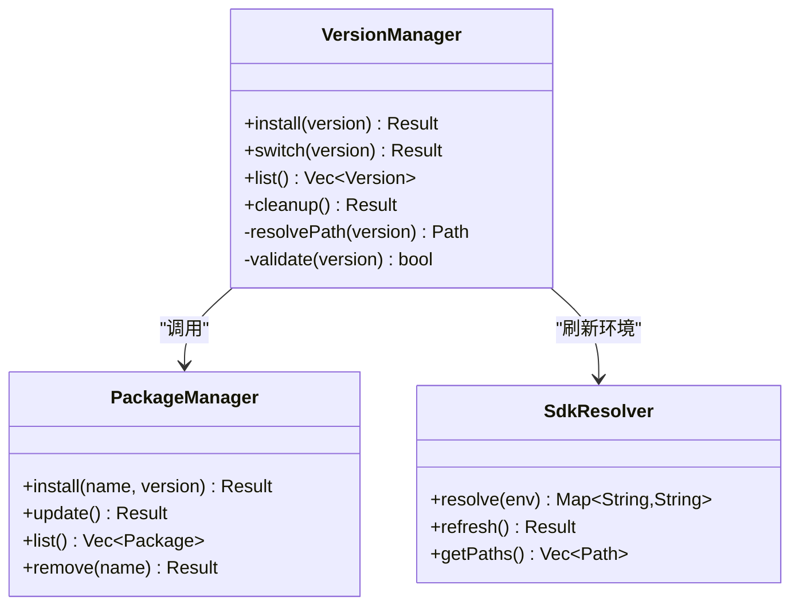
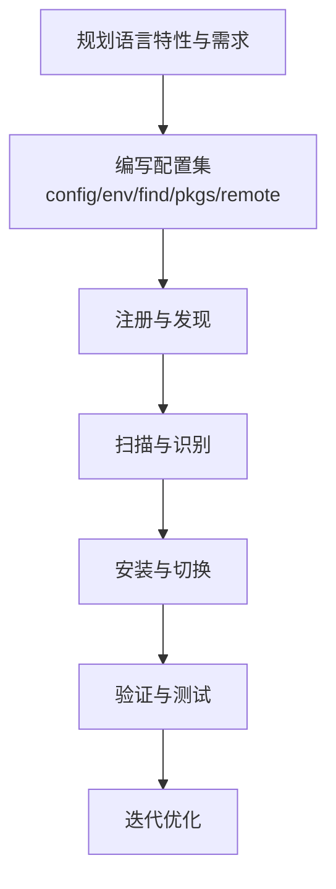
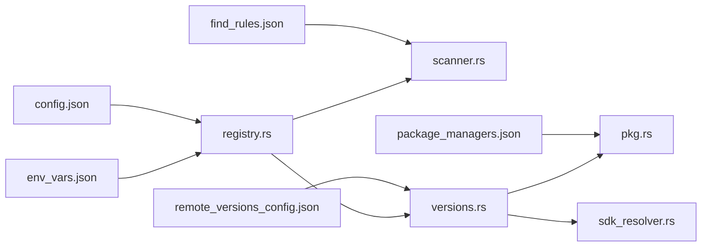

# 语言支持插件开发

<cite>
**本文引用的文件**   
- [projects/go/config.json](file://projects/go/config.json)
- [projects/go/env_vars.json](file://projects/go/env_vars.json)
- [projects/go/find_rules.json](file://projects/go/find_rules.json)
- [projects/go/package_managers.json](file://projects/go/package_managers.json)
- [projects/go/remote_versions_config.json](file://projects/go/remote_versions_config.json)
- [src-tauri/src/commands/project/scanner.rs](file://src-tauri/src/commands/project/scanner.rs)
- [src-tauri/src/commands/project/types.rs](file://src-tauri/src/commands/project/types.rs)
- [src-tauri/src/commands/project/versions.rs](file://src-tauri/src/commands/project/versions.rs)
- [src-tauri/src/commands/project/registry.rs](file://src-tauri/src/commands/project/registry.rs)
- [src-tauri/src/commands/pkg.rs](file://src-tauri/src/commands/pkg.rs)
- [src-tauri/src/commands/tool_version.rs](file://src-tauri/src/commands/tool_version.rs)
- [src-tauri/src/commands/sdk_resolver.rs](file://src-tauri/src/commands/sdk_resolver.rs)
</cite>

## 目录
1. [简介](#简介)
2. [项目结构](#项目结构)
3. [核心组件](#核心组件)
4. [架构总览](#架构总览)
5. [详细组件分析](#详细组件分析)
6. [依赖关系分析](#依赖关系分析)
7. [性能考虑](#性能考虑)
8. [故障排查指南](#故障排查指南)
9. [结论](#结论)
10. [附录](#附录)

## 简介
本指南面向希望在 projects/ 目录下新增编程语言支持的开发者，系统化说明以下要点：
- 配置体系：config.json、package_managers.json、remote_versions_config.json、env_vars.json 的完整结构与字段含义
- 语言扫描器与自定义规则：find_rules.json 的工作原理与编写规范
- 版本管理策略：安装、切换与管理机制
- Go 语言插件全流程示例：从配置文件到系统集成的端到端步骤
- 测试方法与调试技巧：如何验证新语言插件的正确性与稳定性

## 项目结构
语言支持以“按语言分目录”的方式组织在 projects/ 下。每个语言目录包含一组描述该语言行为与能力的 JSON 配置文件。后端通过 Rust 命令模块加载这些配置并驱动扫描、解析、安装与切换等流程。

图表来源
- [src-tauri/src/commands/project/registry.rs](file://src-tauri/src/commands/project/registry.rs)
- [src-tauri/src/commands/project/scanner.rs](file://src-tauri/src/commands/project/scanner.rs)
- [src-tauri/src/commands/project/versions.rs](file://src-tauri/src/commands/project/versions.rs)
- [src-tauri/src/commands/pkg.rs](file://src-tauri/src/commands/pkg.rs)
- [src-tauri/src/commands/tool_version.rs](file://src-tauri/src/commands/tool_version.rs)
- [src-tauri/src/commands/sdk_resolver.rs](file://src-tauri/src/commands/sdk_resolver.rs)
- [projects/go/config.json](file://projects/go/config.json)
- [projects/go/env_vars.json](file://projects/go/env_vars.json)
- [projects/go/find_rules.json](file://projects/go/find_rules.json)
- [projects/go/package_managers.json](file://projects/go/package_managers.json)
- [projects/go/remote_versions_config.json](file://projects/go/remote_versions_config.json)

章节来源
- [src-tauri/src/commands/project/registry.rs](file://src-tauri/src/commands/project/registry.rs)
- [src-tauri/src/commands/project/scanner.rs](file://src-tauri/src/commands/project/scanner.rs)
- [src-tauri/src/commands/project/versions.rs](file://src-tauri/src/commands/project/versions.rs)
- [src-tauri/src/commands/pkg.rs](file://src-tauri/src/commands/pkg.rs)
- [src-tauri/src/commands/tool_version.rs](file://src-tauri/src/commands/tool_version.rs)
- [src-tauri/src/commands/sdk_resolver.rs](file://src-tauri/src/commands/sdk_resolver.rs)
- [projects/go/config.json](file://projects/go/config.json)
- [projects/go/env_vars.json](file://projects/go/env_vars.json)
- [projects/go/find_rules.json](file://projects/go/find_rules.json)
- [projects/go/package_managers.json](file://projects/go/package_managers.json)
- [projects/go/remote_versions_config.json](file://projects/go/remote_versions_config.json)

## 核心组件
- 语言注册表（Registry）：负责发现、加载与缓存各语言的配置与能力元数据
- 扫描器（Scanner）：基于 find_rules.json 在项目目录中识别语言特征与版本信息
- 版本管理（Versions）：提供安装、切换、列出与清理等生命周期操作
- 包管理器集成（Pkg/ToolVersion）：对接各语言生态的包管理器或工具链
- SDK 解析（SdkResolver）：解析环境变量与路径，定位已安装的 SDK 或运行时

章节来源
- [src-tauri/src/commands/project/registry.rs](file://src-tauri/src/commands/project/registry.rs)
- [src-tauri/src/commands/project/scanner.rs](file://src-tauri/src/commands/project/scanner.rs)
- [src-tauri/src/commands/project/versions.rs](file://src-tauri/src/commands/project/versions.rs)
- [src-tauri/src/commands/pkg.rs](file://src-tauri/src/commands/pkg.rs)
- [src-tauri/src/commands/tool_version.rs](file://src-tauri/src/commands/tool_version.rs)
- [src-tauri/src/commands/sdk_resolver.rs](file://src-tauri/src/commands/sdk_resolver.rs)

## 架构总览
下图展示了从前端触发到后端执行的关键调用链，以及各组件之间的交互关系。

图表来源
- [src-tauri/src/commands/project/registry.rs](file://src-tauri/src/commands/project/registry.rs)
- [src-tauri/src/commands/project/scanner.rs](file://src-tauri/src/commands/project/scanner.rs)
- [src-tauri/src/commands/project/versions.rs](file://src-tauri/src/commands/project/versions.rs)
- [src-tauri/src/commands/pkg.rs](file://src-tauri/src/commands/pkg.rs)
- [src-tauri/src/commands/tool_version.rs](file://src-tauri/src/commands/tool_version.rs)
- [src-tauri/src/commands/sdk_resolver.rs](file://src-tauri/src/commands/sdk_resolver.rs)

## 详细组件分析

### 配置体系总览
语言插件的核心由以下 JSON 文件组成：
- config.json：语言元数据、默认行为、命令模板、平台适配等
- package_managers.json：包管理器定义与命令映射
- remote_versions_config.json：远程版本源、镜像与解析策略
- env_vars.json：环境变量注入与 PATH 扩展
- find_rules.json：语言特征匹配规则与版本探测逻辑

章节来源
- [projects/go/config.json](file://projects/go/config.json)
- [projects/go/package_managers.json](file://projects/go/package_managers.json)
- [projects/go/remote_versions_config.json](file://projects/go/remote_versions_config.json)
- [projects/go/env_vars.json](file://projects/go/env_vars.json)
- [projects/go/find_rules.json](file://projects/go/find_rules.json)

#### config.json 结构定义
- 语言标识与名称：用于唯一标识语言及显示名
- 命令模板：可执行文件命名、版本输出命令、初始化命令等
- 平台适配：不同操作系统下的差异处理（如 Windows 后缀、Unix 权限）
- 默认版本策略：是否允许自动选择稳定版、候选版等
- 环境变量注入：与 env_vars.json 联动的基础开关
- 包管理器绑定：与 package_managers.json 的关联键
- 远程版本源：与 remote_versions_config.json 的关联键
- 扫描规则引用：与 find_rules.json 的关联键
- 安全与沙箱：是否允许执行外部命令、是否需要提权等

章节来源
- [projects/go/config.json](file://projects/go/config.json)

#### package_managers.json 结构定义
- 包管理器列表：每种包管理器的标识、名称、命令前缀
- 命令映射：install、update、list、remove 等操作的命令模板
- 参数替换：版本号、目标目录、缓存目录等占位符
- 镜像与代理：私有仓库地址、认证信息、超时设置
- 并发与重试：并行下载数量、失败重试次数与退避策略
- 校验与签名：哈希校验、签名验证开关与算法

章节来源
- [projects/go/package_managers.json](file://projects/go/package_managers.json)

#### remote_versions_config.json 结构定义
- 版本源列表：官方源、社区源、镜像源的优先级与可用性检查
- 版本格式：语义化版本、预发布标记、兼容范围
- 解析策略：JSON/HTML 解析器、正则表达式、分页抓取
- 缓存策略：本地缓存目录、过期时间、增量更新
- 错误恢复：网络异常重试、降级源切换、熔断阈值

章节来源
- [projects/go/remote_versions_config.json](file://projects/go/remote_versions_config.json)

#### env_vars.json 结构定义
- 环境变量注入：PATH、LANG、GOPATH 等关键变量的追加与覆盖
- 条件注入：基于 OS、架构、Shell 类型动态生效
- 作用域：全局、用户级、项目级环境隔离
- 冲突检测：重复键合并策略、警告与回滚
- 调试输出：打印注入前后的环境变量快照

章节来源
- [projects/go/env_vars.json](file://projects/go/env_vars.json)

#### find_rules.json 结构定义
- 规则集合：文件名模式、目录结构、特定文件内容匹配
- 版本探测：命令行输出解析、文件头解析、配置文件读取
- 优先级与权重：多规则命中时的排序与去重
- 容错与跳过：忽略隐藏目录、权限不足、符号链接处理
- 扩展点：自定义脚本钩子、外部解析器调用

章节来源
- [projects/go/find_rules.json](file://projects/go/find_rules.json)

### 语言扫描器工作原理
扫描器依据 find_rules.json 中的规则对项目目录进行遍历与匹配，提取语言特征与版本信息，并将结果上报给注册表与版本管理模块。

图表来源
- [src-tauri/src/commands/project/scanner.rs](file://src-tauri/src/commands/project/scanner.rs)
- [projects/go/find_rules.json](file://projects/go/find_rules.json)

章节来源
- [src-tauri/src/commands/project/scanner.rs](file://src-tauri/src/commands/project/scanner.rs)
- [projects/go/find_rules.json](file://projects/go/find_rules.json)

### 版本管理策略
版本管理模块负责语言的安装、切换、列出与清理等操作，并与包管理器与 SDK 解析器协作。

图表来源
- [src-tauri/src/commands/project/versions.rs](file://src-tauri/src/commands/project/versions.rs)
- [src-tauri/src/commands/pkg.rs](file://src-tauri/src/commands/pkg.rs)
- [src-tauri/src/commands/tool_version.rs](file://src-tauri/src/commands/tool_version.rs)
- [src-tauri/src/commands/sdk_resolver.rs](file://src-tauri/src/commands/sdk_resolver.rs)

章节来源
- [src-tauri/src/commands/project/versions.rs](file://src-tauri/src/commands/project/versions.rs)
- [src-tauri/src/commands/pkg.rs](file://src-tauri/src/commands/pkg.rs)
- [src-tauri/src/commands/tool_version.rs](file://src-tauri/src/commands/tool_version.rs)
- [src-tauri/src/commands/sdk_resolver.rs](file://src-tauri/src/commands/sdk_resolver.rs)

### Go 语言插件开发示例（端到端）
以下步骤演示如何在 projects/ 下为 Go 语言创建完整的插件支持：

1. 创建语言目录与基础配置
   - 新建 projects/go/ 目录
   - 编写 config.json：定义语言标识、命令模板、平台适配、默认版本策略、包管理器与远程版本源关联键
   - 编写 env_vars.json：注入 PATH、GOPATH 等必要环境变量
   - 编写 find_rules.json：定义 go.mod、go.sum、.go 文件等特征匹配规则
   - 编写 package_managers.json：定义 go install、go get 等命令映射
   - 编写 remote_versions_config.json：定义 golang.org/dl 或其他镜像源

2. 注册与发现
   - 确保注册表能加载 projects/go/*.json 配置
   - 验证扫描器能基于 find_rules.json 识别 Go 项目

3. 版本安装与切换
   - 使用 versions 模块调用 pkg 与 tool_version 完成安装
   - 通过 sdk_resolver 刷新环境变量与路径

4. 集成与验证
   - 在前端界面查看语言列表与版本信息
   - 执行安装与切换操作并观察日志

章节来源
- [projects/go/config.json](file://projects/go/config.json)
- [projects/go/env_vars.json](file://projects/go/env_vars.json)
- [projects/go/find_rules.json](file://projects/go/find_rules.json)
- [projects/go/package_managers.json](file://projects/go/package_managers.json)
- [projects/go/remote_versions_config.json](file://projects/go/remote_versions_config.json)
- [src-tauri/src/commands/project/registry.rs](file://src-tauri/src/commands/project/registry.rs)
- [src-tauri/src/commands/project/scanner.rs](file://src-tauri/src/commands/project/scanner.rs)
- [src-tauri/src/commands/project/versions.rs](file://src-tauri/src/commands/project/versions.rs)
- [src-tauri/src/commands/pkg.rs](file://src-tauri/src/commands/pkg.rs)
- [src-tauri/src/commands/tool_version.rs](file://src-tauri/src/commands/tool_version.rs)
- [src-tauri/src/commands/sdk_resolver.rs](file://src-tauri/src/commands/sdk_resolver.rs)

### 概念性概览
以下为通用插件开发流程的概念图，帮助理解整体思路与阶段划分。

[此图为概念流程图，不直接对应具体源码文件]

## 依赖关系分析
语言插件与后端模块的依赖关系如下：

图表来源
- [src-tauri/src/commands/project/registry.rs](file://src-tauri/src/commands/project/registry.rs)
- [src-tauri/src/commands/project/scanner.rs](file://src-tauri/src/commands/project/scanner.rs)
- [src-tauri/src/commands/project/versions.rs](file://src-tauri/src/commands/project/versions.rs)
- [src-tauri/src/commands/pkg.rs](file://src-tauri/src/commands/pkg.rs)
- [src-tauri/src/commands/sdk_resolver.rs](file://src-tauri/src/commands/sdk_resolver.rs)
- [projects/go/config.json](file://projects/go/config.json)
- [projects/go/env_vars.json](file://projects/go/env_vars.json)
- [projects/go/find_rules.json](file://projects/go/find_rules.json)
- [projects/go/package_managers.json](file://projects/go/package_managers.json)
- [projects/go/remote_versions_config.json](file://projects/go/remote_versions_config.json)

章节来源
- [src-tauri/src/commands/project/registry.rs](file://src-tauri/src/commands/project/registry.rs)
- [src-tauri/src/commands/project/scanner.rs](file://src-tauri/src/commands/project/scanner.rs)
- [src-tauri/src/commands/project/versions.rs](file://src-tauri/src/commands/project/versions.rs)
- [src-tauri/src/commands/pkg.rs](file://src-tauri/src/commands/pkg.rs)
- [src-tauri/src/commands/sdk_resolver.rs](file://src-tauri/src/commands/sdk_resolver.rs)
- [projects/go/config.json](file://projects/go/config.json)
- [projects/go/env_vars.json](file://projects/go/env_vars.json)
- [projects/go/find_rules.json](file://projects/go/find_rules.json)
- [projects/go/package_managers.json](file://projects/go/package_managers.json)
- [projects/go/remote_versions_config.json](file://projects/go/remote_versions_config.json)

## 性能考虑
- 扫描优化：对大型项目启用增量扫描与缓存，避免重复遍历
- 规则精简：减少不必要的正则与深度遍历，提升匹配效率
- 并发控制：包管理器安装与远程版本拉取时限制并发数，避免资源争用
- 镜像优先：优先使用就近镜像源，降低网络延迟
- 错误快速失败：在网络或权限问题发生时尽早返回，避免长时间阻塞

## 故障排查指南
- 扫描不到语言
  - 检查 find_rules.json 的规则是否覆盖项目特征
  - 确认扫描器日志中的匹配与跳过原因
- 版本无法安装
  - 核对 package_managers.json 的命令模板与参数替换
  - 检查 remote_versions_config.json 的源可达性与解析器
- 环境变量未生效
  - 查看 env_vars.json 的作用域与条件注入
  - 使用 SDK 解析器刷新后再次验证 PATH
- 切换失败
  - 确认版本存在且校验通过
  - 检查权限与磁盘空间

章节来源
- [src-tauri/src/commands/project/scanner.rs](file://src-tauri/src/commands/project/scanner.rs)
- [src-tauri/src/commands/project/versions.rs](file://src-tauri/src/commands/project/versions.rs)
- [src-tauri/src/commands/pkg.rs](file://src-tauri/src/commands/pkg.rs)
- [src-tauri/src/commands/tool_version.rs](file://src-tauri/src/commands/tool_version.rs)
- [src-tauri/src/commands/sdk_resolver.rs](file://src-tauri/src/commands/sdk_resolver.rs)

## 结论
通过标准化的配置体系与清晰的模块职责，语言支持插件的开发与维护变得可预期且可扩展。遵循本文的结构与最佳实践，可以快速为新语言添加完整支持，并确保安装、切换与扫描的稳定性和性能。

## 附录
- 建议的目录命名与文件命名约定
- 常见错误码与日志级别对照
- 参考其他语言插件的配置样例（Node.js、Python、Rust 等）