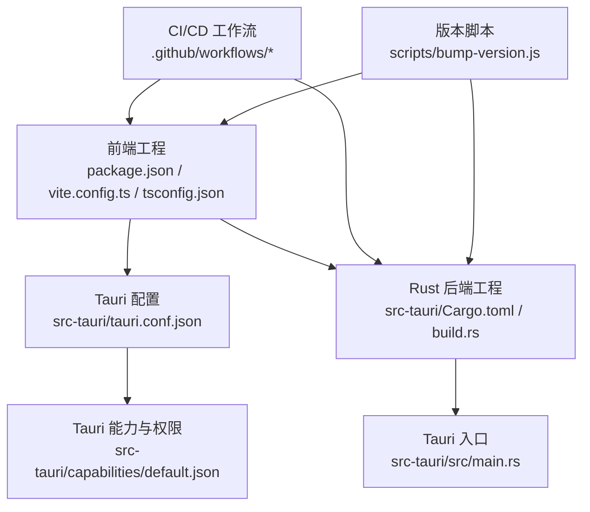
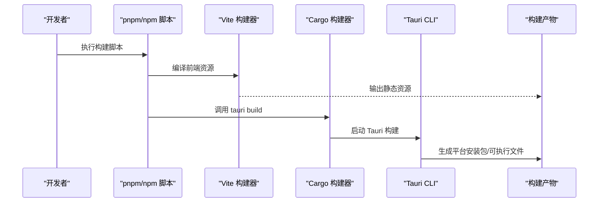
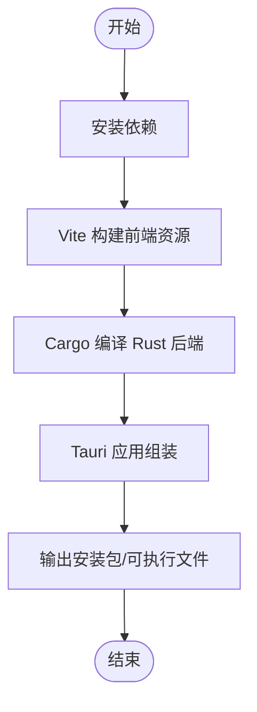
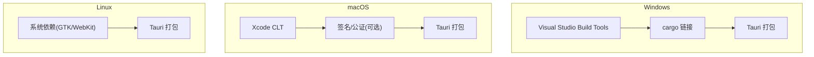
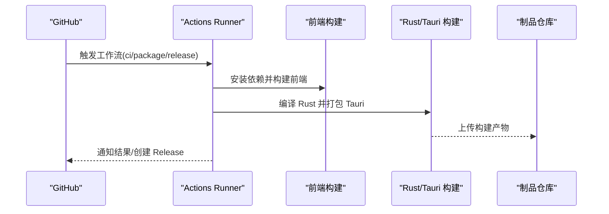
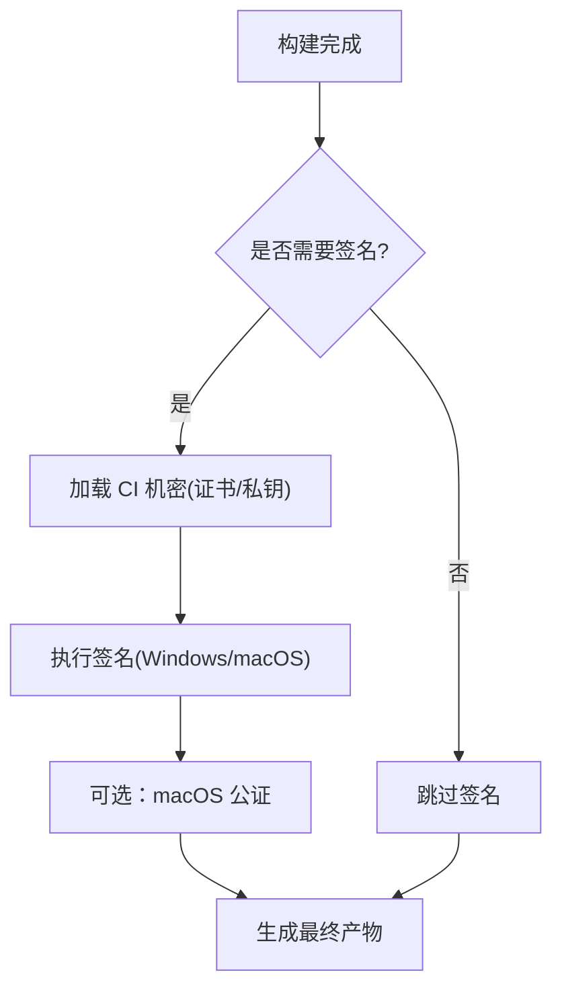
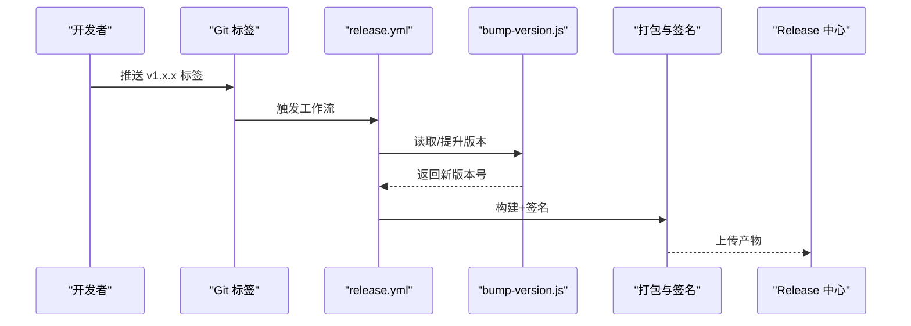
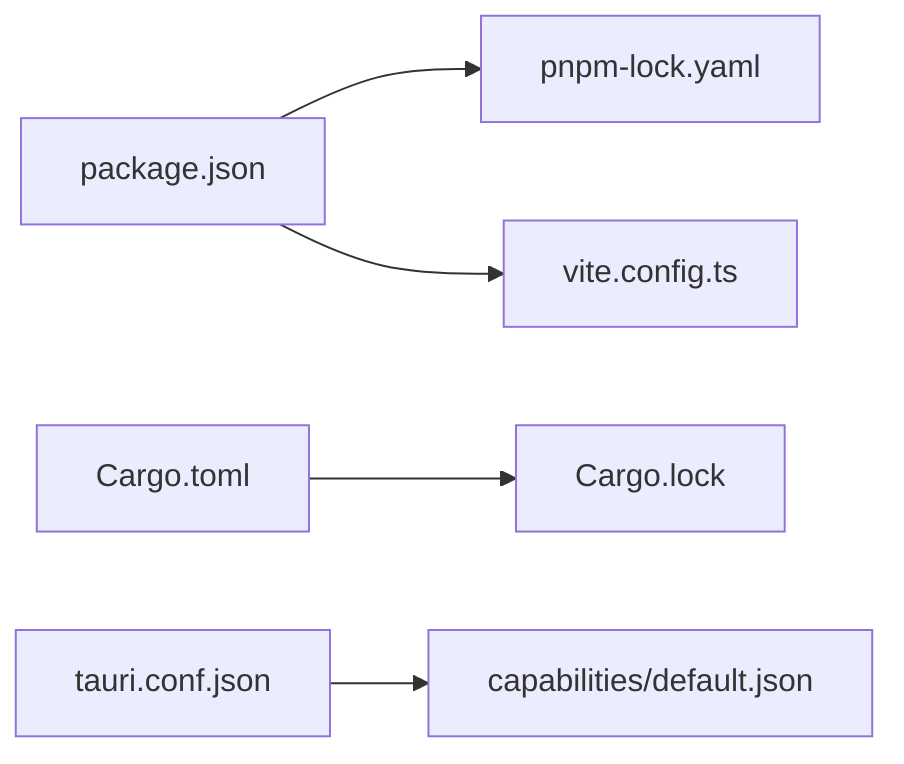

# 构建与部署

<cite>
**本文引用的文件**   
- [package.json](file://package.json)
- [vite.config.ts](file://vite.config.ts)
- [tsconfig.json](file://tsconfig.json)
- [.npmrc](file://.npmrc)
- [src-tauri/tauri.conf.json](file://src-tauri/tauri.conf.json)
- [src-tauri/Cargo.toml](file://src-tauri/Cargo.toml)
- [src-tauri/build.rs](file://src-tauri/build.rs)
- [src-tauri/src/main.rs](file://src-tauri/src/main.rs)
- [src-tauri/capabilities/default.json](file://src-tauri/capabilities/default.json)
- [scripts/bump-version.js](file://scripts/bump-version.js)
- [.github/workflows/ci.yml](file://.github/workflows/ci.yml)
- [.github/workflows/package.yml](file://.github/workflows/package.yml)
- [.github/workflows/release.yml](file://.github/workflows/release.yml)
</cite>

## 目录
1. [简介](#简介)
2. [项目结构](#项目结构)
3. [核心组件](#核心组件)
4. [架构总览](#架构总览)
5. [详细组件分析](#详细组件分析)
6. [依赖分析](#依赖分析)
7. [性能考虑](#性能考虑)
8. [故障排查指南](#故障排查指南)
9. [结论](#结论)
10. [附录](#附录)

## 简介
本指南面向本地开发与 CI/CD 的构建、打包与发布，覆盖以下目标：
- 前端资源编译（Vite + TypeScript）
- Rust 后端打包（Cargo/Tauri）
- Tauri 应用组装与跨平台产物
- 跨平台构建配置（Windows、macOS、Linux）
- CI/CD 流水线（GitHub Actions）：自动化测试、代码质量检查、打包与发布
- 应用签名与安全配置
- 版本管理策略与发布流程
- 生产环境部署建议与最佳实践
- 更新机制与回滚策略

## 项目结构
本项目采用 Tauri 桌面应用架构：前端基于 Vite + TypeScript，后端基于 Rust。根目录包含前端工程与脚本，src-tauri 为 Tauri/Rust 工程，.github/workflows 存放 CI/CD 工作流。

**图示来源**
- [package.json:1-200](file://package.json#L1-L200)
- [vite.config.ts:1-200](file://vite.config.ts#L1-L200)
- [tsconfig.json:1-200](file://tsconfig.json#L1-L200)
- [src-tauri/tauri.conf.json:1-200](file://src-tauri/tauri.conf.json#L1-L200)
- [src-tauri/Cargo.toml:1-200](file://src-tauri/Cargo.toml#L1-L200)
- [src-tauri/build.rs:1-200](file://src-tauri/build.rs#L1-L200)
- [src-tauri/src/main.rs:1-200](file://src-tauri/src/main.rs#L1-L200)
- [src-tauri/capabilities/default.json:1-200](file://src-tauri/capabilities/default.json#L1-L200)
- [scripts/bump-version.js:1-200](file://scripts/bump-version.js#L1-L200)
- [.github/workflows/ci.yml:1-200](file://.github/workflows/ci.yml#L1-L200)
- [.github/workflows/package.yml:1-200](file://.github/workflows/package.yml#L1-L200)
- [.github/workflows/release.yml:1-200](file://.github/workflows/release.yml#L1-L200)

**章节来源**
- [package.json:1-200](file://package.json#L1-L200)
- [vite.config.ts:1-200](file://vite.config.ts#L1-L200)
- [tsconfig.json:1-200](file://tsconfig.json#L1-L200)
- [src-tauri/tauri.conf.json:1-200](file://src-tauri/tauri.conf.json#L1-L200)
- [src-tauri/Cargo.toml:1-200](file://src-tauri/Cargo.toml#L1-L200)
- [src-tauri/build.rs:1-200](file://src-tauri/build.rs#L1-L200)
- [src-tauri/src/main.rs:1-200](file://src-tauri/src/main.rs#L1-L200)
- [src-tauri/capabilities/default.json:1-200](file://src-tauri/capabilities/default.json#L1-L200)
- [scripts/bump-version.js:1-200](file://scripts/bump-version.js#L1-L200)
- [.github/workflows/ci.yml:1-200](file://.github/workflows/ci.yml#L1-L200)
- [.github/workflows/package.yml:1-200](file://.github/workflows/package.yml#L1-L200)
- [.github/workflows/release.yml:1-200](file://.github/workflows/release.yml#L1-L200)

## 核心组件
- 前端构建系统：Vite + TypeScript，通过 package.json 中的脚本驱动开发、预览与构建。
- Tauri 配置：定义应用元数据、窗口行为、前端资源路径、插件与能力等。
- Rust 后端：Cargo 工程，build.rs 用于构建期任务，main.rs 作为 Tauri 应用入口。
- 安全与权限：capabilities/default.json 控制命令访问与 IPC 白名单。
- 版本管理：scripts/bump-version.js 提供统一版本号提升逻辑。
- CI/CD：ci.yml、package.yml、release.yml 分别负责快速验证、多端打包与发布。

**章节来源**
- [package.json:1-200](file://package.json#L1-L200)
- [vite.config.ts:1-200](file://vite.config.ts#L1-L200)
- [src-tauri/tauri.conf.json:1-200](file://src-tauri/tauri.conf.json#L1-L200)
- [src-tauri/Cargo.toml:1-200](file://src-tauri/Cargo.toml#L1-L200)
- [src-tauri/build.rs:1-200](file://src-tauri/build.rs#L1-L200)
- [src-tauri/src/main.rs:1-200](file://src-tauri/src/main.rs#L1-L200)
- [src-tauri/capabilities/default.json:1-200](file://src-tauri/capabilities/default.json#L1-L200)
- [scripts/bump-version.js:1-200](file://scripts/bump-version.js#L1-L200)

## 架构总览
下图展示从源码到可分发产物的端到端构建流程，包括前端静态资源编译、Rust 后端编译、Tauri 应用组装以及 CI 触发点。

**图示来源**
- [package.json:1-200](file://package.json#L1-L200)
- [vite.config.ts:1-200](file://vite.config.ts#L1-L200)
- [src-tauri/tauri.conf.json:1-200](file://src-tauri/tauri.conf.json#L1-L200)
- [src-tauri/Cargo.toml:1-200](file://src-tauri/Cargo.toml#L1-L200)

## 详细组件分析

### 本地构建流程
- 安装依赖
  - 使用 pnpm 或 npm 安装依赖。若存在 .npmrc，请确保镜像源与缓存设置正确。
- 前端构建
  - 通过 package.json 中定义的脚本运行 Vite 构建，产出静态资源。
  - 如需自定义构建行为，调整 vite.config.ts（如别名、插件、优化选项）。
- Rust 后端与 Tauri 打包
  - 在 src-tauri 目录下执行 Cargo/Tauri 构建。
  - tauri.conf.json 指定前端资源目录、窗口配置、图标、能力等。
  - build.rs 可用于构建期预处理（例如生成配置文件、拷贝资源）。
- 本地调试
  - 使用 Tauri dev 模式进行热重载与调试。

**图示来源**
- [package.json:1-200](file://package.json#L1-L200)
- [vite.config.ts:1-200](file://vite.config.ts#L1-L200)
- [src-tauri/tauri.conf.json:1-200](file://src-tauri/tauri.conf.json#L1-L200)
- [src-tauri/Cargo.toml:1-200](file://src-tauri/Cargo.toml#L1-L200)
- [src-tauri/build.rs:1-200](file://src-tauri/build.rs#L1-L200)

**章节来源**
- [.npmrc:1-200](file://.npmrc#L1-L200)
- [package.json:1-200](file://package.json#L1-L200)
- [vite.config.ts:1-200](file://vite.config.ts#L1-L200)
- [src-tauri/tauri.conf.json:1-200](file://src-tauri/tauri.conf.json#L1-L200)
- [src-tauri/Cargo.toml:1-200](file://src-tauri/Cargo.toml#L1-L200)
- [src-tauri/build.rs:1-200](file://src-tauri/build.rs#L1-L200)

### 跨平台构建配置
- Windows
  - 需要安装 Visual Studio Build Tools（MSVC 工具链），确保 cargo 能链接 Rust 二进制。
  - 可在 tauri.conf.json 中配置目标平台、签名证书与安装包参数。
- macOS
  - 需要 Xcode Command Line Tools；如需签名与公证，需准备 Apple Developer ID 与相关证书。
  - 可通过环境变量注入签名信息，避免硬编码敏感内容。
- Linux
  - 需要安装对应发行版的构建依赖（如 GTK、WebKitGTK 等，具体取决于 Tauri 后端需求）。
  - 可使用包管理器安装必要库后执行构建。

**图示来源**
- [src-tauri/tauri.conf.json:1-200](file://src-tauri/tauri.conf.json#L1-L200)

**章节来源**
- [src-tauri/tauri.conf.json:1-200](file://src-tauri/tauri.conf.json#L1-L200)

### CI/CD 流水线配置
- ci.yml
  - 触发条件：推送或 PR。
  - 步骤：安装依赖、前端构建、Rust 构建、基础测试与静态检查。
- package.yml
  - 触发条件：手动触发或特定分支。
  - 步骤：多平台构建（Windows/macOS/Linux）、产物归档。
- release.yml
  - 触发条件：创建 Git Tag。
  - 步骤：版本提升、签名（可选）、生成安装包、上传至 Release。

**图示来源**
- [.github/workflows/ci.yml:1-200](file://.github/workflows/ci.yml#L1-L200)
- [.github/workflows/package.yml:1-200](file://.github/workflows/package.yml#L1-L200)
- [.github/workflows/release.yml:1-200](file://.github/workflows/release.yml#L1-L200)

**章节来源**
- [.github/workflows/ci.yml:1-200](file://.github/workflows/ci.yml#L1-L200)
- [.github/workflows/package.yml:1-200](file://.github/workflows/package.yml#L1-L200)
- [.github/workflows/release.yml:1-200](file://.github/workflows/release.yml#L1-L200)

### 应用签名与安全配置
- 能力与权限
  - capabilities/default.json 定义允许的命令与 IPC 范围，遵循最小权限原则。
- 代码签名
  - Windows：使用 Authenticode 签名（证书由受信任 CA 颁发）。
  - macOS：使用 Developer ID 签名并进行公证。
  - Linux：通常无需签名，但可附加 GPG 校验以增强完整性。
- 密钥管理
  - 将证书与私钥存储于 CI 机密（Secrets），避免进入代码库。
  - 在 release.yml 中按需注入签名参数与环境变量。

**图示来源**
- [src-tauri/capabilities/default.json:1-200](file://src-tauri/capabilities/default.json#L1-L200)
- [.github/workflows/release.yml:1-200](file://.github/workflows/release.yml#L1-L200)

**章节来源**
- [src-tauri/capabilities/default.json:1-200](file://src-tauri/capabilities/default.json#L1-L200)
- [.github/workflows/release.yml:1-200](file://.github/workflows/release.yml#L1-L200)

### 版本管理策略与发布流程
- 版本提升
  - 使用 scripts/bump-version.js 统一提升版本号，同时更新前端与 Rust 工程中的版本字段。
- 发布流程
  - 在 release.yml 中绑定 Git Tag，自动触发版本提升、构建、签名与发布。
  - 产物命名包含版本号，便于追踪与回滚。

**图示来源**
- [scripts/bump-version.js:1-200](file://scripts/bump-version.js#L1-L200)
- [.github/workflows/release.yml:1-200](file://.github/workflows/release.yml#L1-L200)

**章节来源**
- [scripts/bump-version.js:1-200](file://scripts/bump-version.js#L1-L200)
- [.github/workflows/release.yml:1-200](file://.github/workflows/release.yml#L1-L200)

### 生产环境部署建议与最佳实践
- 产物选择
  - 优先分发安装包（msi/pkg/appimage/rpm 等），减少用户手动配置成本。
- 安全加固
  - 启用严格的能力白名单，仅暴露必要命令。
  - 对关键资源进行完整性校验（哈希/GPG）。
- 性能优化
  - 前端开启压缩与缓存策略（Vite 默认已优化，可按需扩展）。
  - Rust 使用 release 构建，必要时启用 LTO 与 strip。
- 日志与诊断
  - 在生产环境关闭冗余日志，保留错误上报通道。
  - 提供崩溃报告收集与远程诊断接口（遵循隐私合规）。

[本节为通用指导，不直接分析具体文件]

### 更新机制与回滚策略
- 更新机制
  - 通过内置更新模块或外部服务检查新版本，下载并替换应用资源。
  - 更新前进行完整性校验与签名验证。
- 回滚策略
  - 保留上一版本安装包与数据备份。
  - 支持一键回滚到上一个稳定版本，并在失败时自动恢复。

[本节为通用指导，不直接分析具体文件]

## 依赖分析
- 前端依赖
  - 由 package.json 声明，建议使用 pnpm-lock.yaml 锁定版本。
  - .npmrc 可配置私有源与缓存加速。
- Rust 依赖
  - 由 src-tauri/Cargo.toml 与 Cargo.lock 管理。
- Tauri 依赖
  - 由 src-tauri/tauri.conf.json 与能力文件共同决定运行时权限与功能。

**图示来源**
- [package.json:1-200](file://package.json#L1-L200)
- [pnpm-lock.yaml:1-200](file://pnpm-lock.yaml#L1-L200)
- [vite.config.ts:1-200](file://vite.config.ts#L1-L200)
- [src-tauri/Cargo.toml:1-200](file://src-tauri/Cargo.toml#L1-L200)
- [src-tauri/tauri.conf.json:1-200](file://src-tauri/tauri.conf.json#L1-L200)
- [src-tauri/capabilities/default.json:1-200](file://src-tauri/capabilities/default.json#L1-L200)

**章节来源**
- [package.json:1-200](file://package.json#L1-L200)
- [pnpm-lock.yaml:1-200](file://pnpm-lock.yaml#L1-L200)
- [vite.config.ts:1-200](file://vite.config.ts#L1-L200)
- [src-tauri/Cargo.toml:1-200](file://src-tauri/Cargo.toml#L1-L200)
- [src-tauri/tauri.conf.json:1-200](file://src-tauri/tauri.conf.json#L1-L200)
- [src-tauri/capabilities/default.json:1-200](file://src-tauri/capabilities/default.json#L1-L200)

## 性能考虑
- 构建阶段
  - 并行化：前端与 Rust 构建尽量并行执行，缩短 CI 时间。
  - 缓存：缓存 node_modules 与 Cargo 目标目录，提高重复构建速度。
- 运行阶段
  - 资源体积：启用前端压缩与 Tree Shaking，移除未使用代码。
  - 内存占用：合理设置窗口与线程池大小，避免过度分配。

[本节为通用指导，不直接分析具体文件]

## 故障排查指南
- 常见构建问题
  - 缺少系统依赖（Linux）：根据报错安装相应库（如 GTK/WebKit）。
  - 签名失败（macOS/Windows）：检查证书有效期、私钥匹配与权限。
  - 网络超时：配置 .npmrc 与 Cargo 镜像源，或使用代理。
- 定位方法
  - 查看 CI 日志，定位失败步骤。
  - 本地复现：逐步执行各阶段命令，缩小问题范围。
  - 启用详细日志：在构建脚本中添加 verbose 输出。

**章节来源**
- [.npmrc:1-200](file://.npmrc#L1-L200)
- [.github/workflows/ci.yml:1-200](file://.github/workflows/ci.yml#L1-L200)
- [.github/workflows/package.yml:1-200](file://.github/workflows/package.yml#L1-L200)
- [.github/workflows/release.yml:1-200](file://.github/workflows/release.yml#L1-L200)

## 结论
通过统一的版本管理与 CI/CD 流水线，本项目实现了跨平台的自动化构建、签名与发布。结合最小权限的安全模型与完善的回滚策略，可有效保障生产环境的稳定性与安全性。建议在后续迭代中持续优化构建缓存、产物体积与用户体验。

[本节为总结性内容，不直接分析具体文件]

## 附录
- 常用命令参考
  - 安装依赖：使用 pnpm 或 npm 安装。
  - 前端构建：执行 package.json 中定义的构建脚本。
  - Tauri 构建：在 src-tauri 下执行 Cargo/Tauri 构建。
- 关键配置文件说明
  - package.json：脚本与依赖声明。
  - vite.config.ts：前端构建配置。
  - tauri.conf.json：Tauri 应用配置。
  - Cargo.toml：Rust 工程与依赖。
  - capabilities/default.json：能力与权限白名单。
  - bump-version.js：版本提升脚本。
  - CI 工作流：ci.yml、package.yml、release.yml。

**章节来源**
- [package.json:1-200](file://package.json#L1-L200)
- [vite.config.ts:1-200](file://vite.config.ts#L1-L200)
- [src-tauri/tauri.conf.json:1-200](file://src-tauri/tauri.conf.json#L1-L200)
- [src-tauri/Cargo.toml:1-200](file://src-tauri/Cargo.toml#L1-L200)
- [src-tauri/capabilities/default.json:1-200](file://src-tauri/capabilities/default.json#L1-L200)
- [scripts/bump-version.js:1-200](file://scripts/bump-version.js#L1-L200)
- [.github/workflows/ci.yml:1-200](file://.github/workflows/ci.yml#L1-L200)
- [.github/workflows/package.yml:1-200](file://.github/workflows/package.yml#L1-L200)
- [.github/workflows/release.yml:1-200](file://.github/workflows/release.yml#L1-L200)