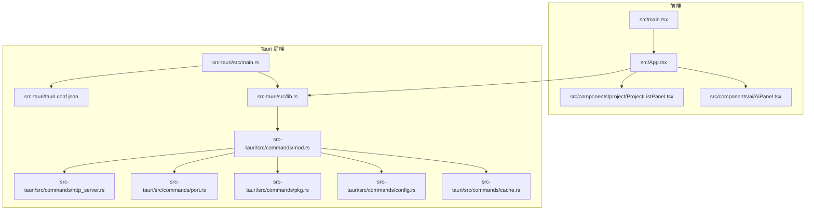
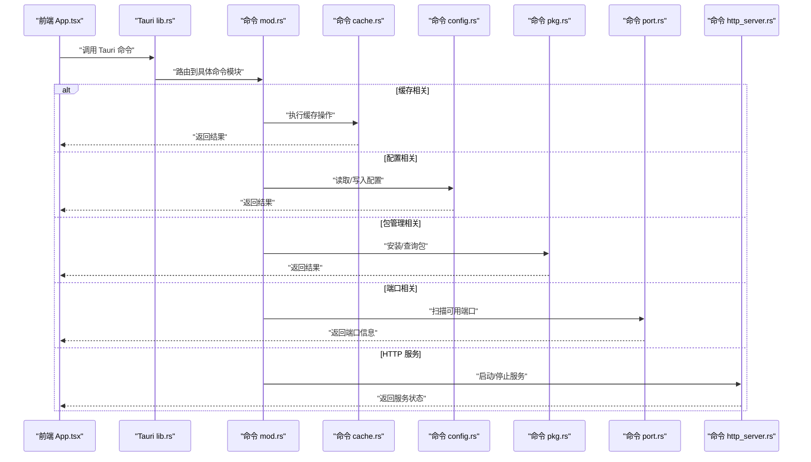
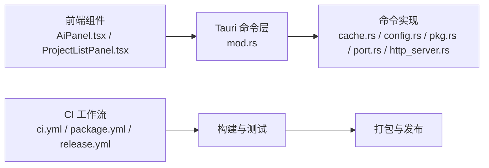

# 测试与调试

<cite>
**本文引用的文件**   
- [ci.yml](file://.github/workflows/ci.yml)
- [package.yml](file://.github/workflows/package.yml)
- [release.yml](file://.github/workflows/release.yml)
- [Cargo.toml](file://src-tauri/Cargo.toml)
- [tauri.conf.json](file://src-tauri/tauri.conf.json)
- [lib.rs](file://src-tauri/src/lib.rs)
- [main.rs](file://src-tauri/src/main.rs)
- [mod.rs（命令入口）](file://src-tauri/src/commands/mod.rs)
- [cache.rs（Rust 缓存命令）](file://src-tauri/src/commands/cache.rs)
- [config.rs（Rust 配置命令）](file://src-tauri/src/commands/config.rs)
- [pkg.rs（Rust 包管理命令）](file://src-tauri/src/commands/pkg.rs)
- [port.rs（Rust 端口命令）](file://src-tauri/src/commands/port.rs)
- [http_server.rs（Rust HTTP 服务命令）](file://src-tauri/src/commands/http_server.rs)
- [AiPanel.tsx](file://src/components/ai/AiPanel.tsx)
- [ProjectListPanel.tsx](file://src/components/project/ProjectListPanel.tsx)
- [App.tsx](file://src/App.tsx)
- [main.tsx](file://src/main.tsx)
</cite>

## 目录
1. [简介](#简介)
2. [项目结构](#项目结构)
3. [核心组件](#核心组件)
4. [架构总览](#架构总览)
5. [详细组件分析](#详细组件分析)
6. [依赖分析](#依赖分析)
7. [性能考虑](#性能考虑)
8. [故障排除指南](#故障排除指南)
9. [结论](#结论)
10. [附录](#附录)

## 简介
本指南面向 Tauri + Rust 后端 + TypeScript 前端的桌面应用，提供覆盖单元测试、集成测试、端到端测试的完整策略，以及调试技巧、性能分析与优化方法、持续集成与自动化测试流程、常见问题诊断与排障、内存泄漏检测与瓶颈分析等实践建议。文档以仓库现有代码为基础，给出可落地的步骤与参考路径，帮助团队建立稳定高效的测试与调试体系。

## 项目结构
本项目采用前后端分离的 Tauri 架构：
- 前端：TypeScript + React（Vite），位于 src 目录，包含 UI 组件与应用入口。
- 后端：Rust（Tauri），位于 src-tauri 目录，通过 Tauri 命令暴露能力给前端。
- 工作流：GitHub Actions 定义 CI、打包与发布流水线。

图表来源
- [main.tsx](file://src/main.tsx)
- [App.tsx](file://src/App.tsx)
- [AiPanel.tsx](file://src/components/ai/AiPanel.tsx)
- [ProjectListPanel.tsx](file://src/components/project/ProjectListPanel.tsx)
- [main.rs](file://src-tauri/src/main.rs)
- [lib.rs](file://src-tauri/src/lib.rs)
- [tauri.conf.json](file://src-tauri/tauri.conf.json)
- [mod.rs（命令入口）](file://src-tauri/src/commands/mod.rs)
- [cache.rs（Rust 缓存命令）](file://src-tauri/src/commands/cache.rs)
- [config.rs（Rust 配置命令）](file://src-tauri/src/commands/config.rs)
- [pkg.rs（Rust 包管理命令）](file://src-tauri/src/commands/pkg.rs)
- [port.rs（Rust 端口命令）](file://src-tauri/src/commands/port.rs)
- [http_server.rs（Rust HTTP 服务命令）](file://src-tauri/src/commands/http_server.rs)

章节来源
- [main.tsx](file://src/main.tsx)
- [App.tsx](file://src/App.tsx)
- [main.rs](file://src-tauri/src/main.rs)
- [lib.rs](file://src-tauri/src/lib.rs)
- [tauri.conf.json](file://src-tauri/tauri.conf.json)

## 核心组件
- 前端应用入口与路由挂载：负责初始化 React 应用并挂载根组件。
- Tauri 命令模块：将 Rust 能力暴露为前端可调用的命令，涵盖缓存、配置、包管理、端口扫描、HTTP 服务等。
- 关键 UI 组件：AI 面板、项目管理列表等，承载用户交互与状态展示。

章节来源
- [main.tsx](file://src/main.tsx)
- [App.tsx](file://src/App.tsx)
- [mod.rs（命令入口）](file://src-tauri/src/commands/mod.rs)
- [cache.rs（Rust 缓存命令）](file://src-tauri/src/commands/cache.rs)
- [config.rs（Rust 配置命令）](file://src-tauri/src/commands/config.rs)
- [pkg.rs（Rust 包管理命令）](file://src-tauri/src/commands/pkg.rs)
- [port.rs（Rust 端口命令）](file://src-tauri/src/commands/port.rs)
- [http_server.rs（Rust HTTP 服务命令）](file://src-tauri/src/commands/http_server.rs)
- [AiPanel.tsx](file://src/components/ai/AiPanel.tsx)
- [ProjectListPanel.tsx](file://src/components/project/ProjectListPanel.tsx)

## 架构总览
下图展示了从前端到 Tauri 后端的调用链路，包括命令注册与分发过程。

图表来源
- [App.tsx](file://src/App.tsx)
- [lib.rs](file://src-tauri/src/lib.rs)
- [mod.rs（命令入口）](file://src-tauri/src/commands/mod.rs)
- [cache.rs（Rust 缓存命令）](file://src-tauri/src/commands/cache.rs)
- [config.rs（Rust 配置命令）](file://src-tauri/src/commands/config.rs)
- [pkg.rs（Rust 包管理命令）](file://src-tauri/src/commands/pkg.rs)
- [port.rs（Rust 端口命令）](file://src-tauri/src/commands/port.rs)
- [http_server.rs（Rust HTTP 服务命令）](file://src-tauri/src/commands/http_server.rs)

## 详细组件分析

### Rust 后端单元测试
- 目标
  - 验证命令逻辑的正确性、边界条件与错误处理。
  - 对纯函数或无副作用逻辑进行快速断言。
- 组织方式
  - 在对应命令文件中添加测试模块，使用 crate 内测试。
  - 针对 I/O 或外部依赖，优先使用 mock 或隔离环境。
- 示例参考路径
  - 缓存命令测试：[cache.rs（Rust 缓存命令）](file://src-tauri/src/commands/cache.rs)
  - 配置命令测试：[config.rs（Rust 配置命令）](file://src-tauri/src/commands/config.rs)
  - 包管理命令测试：[pkg.rs（Rust 包管理命令）](file://src-tauri/src/commands/pkg.rs)
  - 端口命令测试：[port.rs（Rust 端口命令）](file://src-tauri/src/commands/port.rs)
  - HTTP 服务命令测试：[http_server.rs（Rust HTTP 服务命令）](file://src-tauri/src/commands/http_server.rs)
- 运行方式
  - 使用 Cargo 测试工具链执行单测。
  - 建议在 CI 中并行运行以提升速度。

章节来源
- [cache.rs（Rust 缓存命令）](file://src-tauri/src/commands/cache.rs)
- [config.rs（Rust 配置命令）](file://src-tauri/src/commands/config.rs)
- [pkg.rs（Rust 包管理命令）](file://src-tauri/src/commands/pkg.rs)
- [port.rs（Rust 端口命令）](file://src-tauri/src/commands/port.rs)
- [http_server.rs（Rust HTTP 服务命令）](file://src-tauri/src/commands/http_server.rs)

### TypeScript 前端单元测试
- 目标
  - 验证组件渲染、事件处理与状态更新。
  - 对业务逻辑与工具函数进行断言。
- 组织方式
  - 为每个重要组件编写测试用例，关注输入输出与交互行为。
  - 对异步逻辑使用合适的等待与断言策略。
- 示例参考路径
  - AI 面板组件测试：[AiPanel.tsx](file://src/components/ai/AiPanel.tsx)
  - 项目列表组件测试：[ProjectListPanel.tsx](file://src/components/project/ProjectListPanel.tsx)
  - 应用入口与路由测试：[App.tsx](file://src/App.tsx)、[main.tsx](file://src/main.tsx)
- 运行方式
  - 使用 Vite 集成的测试框架执行单测。
  - 结合覆盖率报告评估测试质量。

章节来源
- [AiPanel.tsx](file://src/components/ai/AiPanel.tsx)
- [ProjectListPanel.tsx](file://src/components/project/ProjectListPanel.tsx)
- [App.tsx](file://src/App.tsx)
- [main.tsx](file://src/main.tsx)

### 集成测试策略
- Tauri 命令集成测试
  - 通过 Tauri 测试工具模拟前端调用命令，验证命令注册与返回值。
  - 参考命令入口与注册位置：[mod.rs（命令入口）](file://src-tauri/src/commands/mod.rs)、[lib.rs](file://src-tauri/src/lib.rs)。
- UI 组件集成测试
  - 组合多个组件进行交互测试，确保数据流与状态同步正确。
  - 参考组件：[AiPanel.tsx](file://src/components/ai/AiPanel.tsx)、[ProjectListPanel.tsx](file://src/components/project/ProjectListPanel.tsx)。
- 端到端测试（E2E）
  - 使用浏览器或桌面自动化驱动应用，覆盖关键用户流程。
  - 结合 Tauri 开发模式与打包产物进行验证。

章节来源
- [mod.rs（命令入口）](file://src-tauri/src/commands/mod.rs)
- [lib.rs](file://src-tauri/src/lib.rs)
- [AiPanel.tsx](file://src/components/ai/AiPanel.tsx)
- [ProjectListPanel.tsx](file://src/components/project/ProjectListPanel.tsx)

### 调试技巧
- 浏览器开发者工具
  - 使用控制台、网络面板、性能面板定位前端问题。
  - 在开发模式下查看 Tauri 日志与窗口输出。
- Rust 调试器配置
  - 使用 IDE 或命令行调试器附加进程，设置断点与变量观察。
  - 结合日志输出定位命令执行路径与异常。
- Tauri 日志查看
  - 启用日志级别，捕获命令调用与错误堆栈。
  - 在 CI 环境中保留日志以便回溯。

章节来源
- [tauri.conf.json](file://src-tauri/tauri.conf.json)
- [main.rs](file://src-tauri/src/main.rs)
- [lib.rs](file://src-tauri/src/lib.rs)

### 性能分析与优化方法
- 前端性能
  - 使用性能面板分析渲染耗时与重排重绘。
  - 对大列表与复杂组件进行虚拟化与懒加载。
- Rust 后端性能
  - 使用基准测试与剖析工具识别热点。
  - 避免不必要的克隆与阻塞 I/O，合理并发。
- 端到端性能
  - 监控命令响应时间与资源占用。
  - 对长任务进行分片与进度反馈。

章节来源
- [pkg.rs（Rust 包管理命令）](file://src-tauri/src/commands/pkg.rs)
- [http_server.rs（Rust HTTP 服务命令）](file://src-tauri/src/commands/http_server.rs)

### 持续集成与自动化测试流程
- CI 流水线
  - 构建、测试、打包与发布阶段串联。
  - 缓存依赖与构建产物提升速度。
- 关键配置文件
  - CI 主流程：[ci.yml](file://.github/workflows/ci.yml)
  - 打包流程：[package.yml](file://.github/workflows/package.yml)
  - 发布流程：[release.yml](file://.github/workflows/release.yml)
- 建议
  - 并行执行多平台测试。
  - 失败时上传日志与快照便于诊断。

章节来源
- [ci.yml](file://.github/workflows/ci.yml)
- [package.yml](file://.github/workflows/package.yml)
- [release.yml](file://.github/workflows/release.yml)

### 常见问题诊断与故障排除
- 命令未注册或调用失败
  - 检查命令入口与注册逻辑。
  - 参考：[mod.rs（命令入口）](file://src-tauri/src/commands/mod.rs)、[lib.rs](file://src-tauri/src/lib.rs)。
- 配置读取/写入异常
  - 校验路径权限与格式。
  - 参考：[config.rs（Rust 配置命令）](file://src-tauri/src/commands/config.rs)。
- 包管理命令超时或失败
  - 检查网络代理与镜像源。
  - 参考：[pkg.rs（Rust 包管理命令）](file://src-tauri/src/commands/pkg.rs)。
- 端口冲突或服务无法启动
  - 扫描可用端口并动态分配。
  - 参考：[port.rs（Rust 端口命令）](file://src-tauri/src/commands/port.rs)、[http_server.rs（Rust HTTP 服务命令）](file://src-tauri/src/commands/http_server.rs)。

章节来源
- [mod.rs（命令入口）](file://src-tauri/src/commands/mod.rs)
- [lib.rs](file://src-tauri/src/lib.rs)
- [config.rs（Rust 配置命令）](file://src-tauri/src/commands/config.rs)
- [pkg.rs（Rust 包管理命令）](file://src-tauri/src/commands/pkg.rs)
- [port.rs（Rust 端口命令）](file://src-tauri/src/commands/port.rs)
- [http_server.rs（Rust HTTP 服务命令）](file://src-tauri/src/commands/http_server.rs)

### 内存泄漏检测与性能瓶颈分析
- Rust 内存检测
  - 使用内存剖析工具定位泄漏点。
  - 关注长期运行的服务与缓存模块。
- 前端内存检测
  - 使用内存快照对比分析对象增长。
  - 清理定时器与事件监听器。
- 瓶颈定位
  - 结合 CPU 与 I/O 指标分析热点。
  - 对慢命令进行专项优化与回归测试。

章节来源
- [cache.rs（Rust 缓存命令）](file://src-tauri/src/commands/cache.rs)
- [http_server.rs（Rust HTTP 服务命令）](file://src-tauri/src/commands/http_server.rs)

## 依赖分析
- 前端依赖
  - React 生态与 Vite 构建系统。
  - 组件间通过 props 与状态管理通信。
- 后端依赖
  - Tauri 运行时与命令框架。
  - 各命令模块职责清晰，低耦合高内聚。
- 构建与发布
  - GitHub Actions 编排 CI/CD 流程。

图表来源
- [AiPanel.tsx](file://src/components/ai/AiPanel.tsx)
- [ProjectListPanel.tsx](file://src/components/project/ProjectListPanel.tsx)
- [mod.rs（命令入口）](file://src-tauri/src/commands/mod.rs)
- [cache.rs（Rust 缓存命令）](file://src-tauri/src/commands/cache.rs)
- [config.rs（Rust 配置命令）](file://src-tauri/src/commands/config.rs)
- [pkg.rs（Rust 包管理命令）](file://src-tauri/src/commands/pkg.rs)
- [port.rs（Rust 端口命令）](file://src-tauri/src/commands/port.rs)
- [http_server.rs（Rust HTTP 服务命令）](file://src-tauri/src/commands/http_server.rs)
- [ci.yml](file://.github/workflows/ci.yml)
- [package.yml](file://.github/workflows/package.yml)
- [release.yml](file://.github/workflows/release.yml)

章节来源
- [ci.yml](file://.github/workflows/ci.yml)
- [package.yml](file://.github/workflows/package.yml)
- [release.yml](file://.github/workflows/release.yml)

## 性能考虑
- 前端
  - 减少不必要的重渲染，使用 memo 与虚拟列表。
  - 合并请求与批量更新状态。
- 后端
  - 避免阻塞主线程，使用异步 I/O。
  - 对频繁访问的数据进行缓存与失效策略。
- 端到端
  - 控制并发与重试次数，避免雪崩。
  - 对关键路径进行压测与容量规划。

## 故障排除指南
- 日志收集
  - 在开发与 CI 中开启详细日志。
  - 记录命令参数与返回码。
- 复现与最小化
  - 构造最小可复现场景，隔离无关因素。
- 回滚与降级
  - 在 CI 中保留历史版本与制品。
  - 对不稳定功能提供开关与降级方案。

章节来源
- [tauri.conf.json](file://src-tauri/tauri.conf.json)
- [main.rs](file://src-tauri/src/main.rs)

## 结论
通过完善的单元测试、集成测试与端到端测试，配合系统的调试与性能分析方法，以及稳定的 CI/CD 流水线，可以显著提升项目的质量与交付效率。建议持续迭代测试策略，关注关键路径与高风险模块，形成闭环的质量保障体系。

## 附录
- 常用命令参考
  - 运行 Rust 单测：使用 Cargo 测试工具链。
  - 运行前端单测：使用 Vite 测试脚本。
  - 执行 CI 本地模拟：使用 GitHub Actions 本地运行器。
- 参考路径汇总
  - 命令入口与注册：[mod.rs（命令入口）](file://src-tauri/src/commands/mod.rs)、[lib.rs](file://src-tauri/src/lib.rs)
  - 关键命令实现：[cache.rs](file://src-tauri/src/commands/cache.rs)、[config.rs](file://src-tauri/src/commands/config.rs)、[pkg.rs](file://src-tauri/src/commands/pkg.rs)、[port.rs](file://src-tauri/src/commands/port.rs)、[http_server.rs](file://src-tauri/src/commands/http_server.rs)
  - 前端组件：[AiPanel.tsx](file://src/components/ai/AiPanel.tsx)、[ProjectListPanel.tsx](file://src/components/project/ProjectListPanel.tsx)、[App.tsx](file://src/App.tsx)、[main.tsx](file://src/main.tsx)
  - 工作流：[ci.yml](file://.github/workflows/ci.yml)、[package.yml](file://.github/workflows/package.yml)、[release.yml](file://.github/workflows/release.yml)