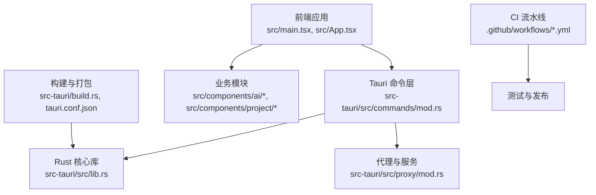
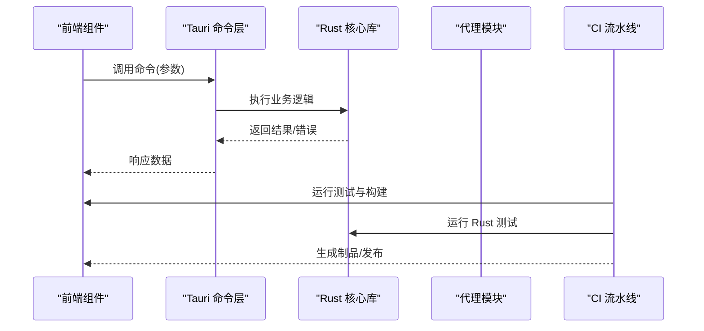
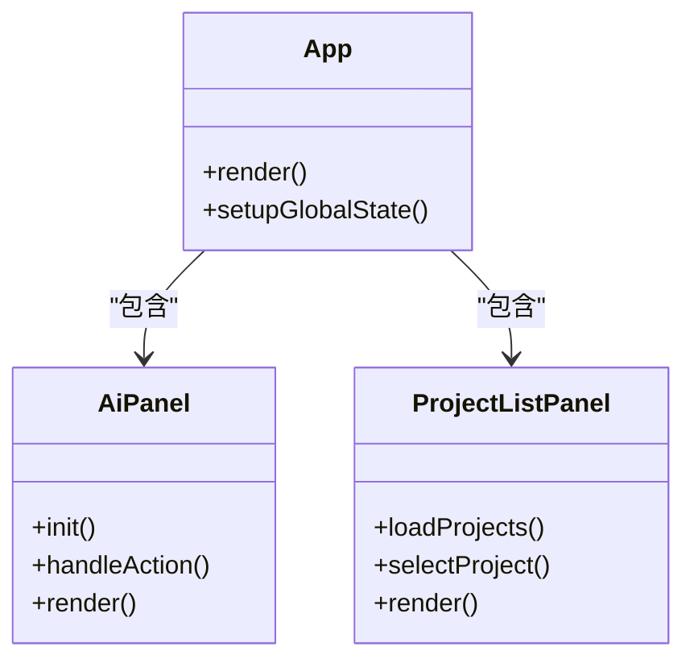
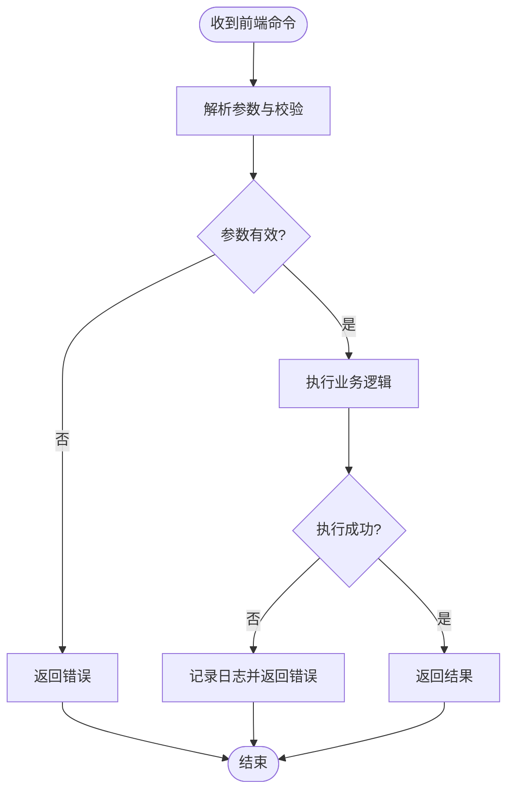
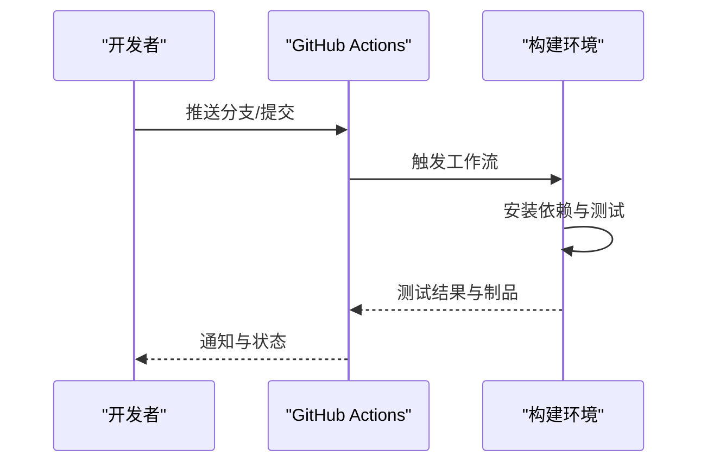
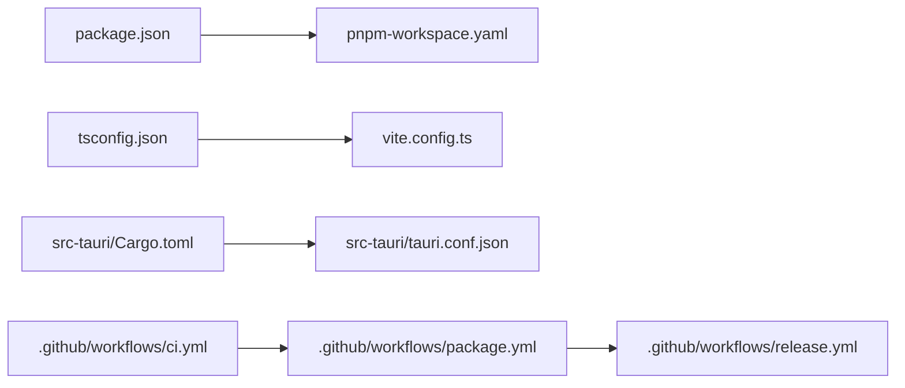

# 贡献指南

<cite>
**本文引用的文件**   
- [README.md](file://README.md)
- [.github/workflows/ci.yml](file://.github/workflows/ci.yml)
- [.github/workflows/package.yml](file://.github/workflows/package.yml)
- [.github/workflows/release.yml](file://.github/workflows/release.yml)
- [package.json](file://package.json)
- [tsconfig.json](file://tsconfig.json)
- [vite.config.ts](file://vite.config.ts)
- [src-tauri/Cargo.toml](file://src-tauri/Cargo.toml)
- [src-tauri/build.rs](file://src-tauri/build.rs)
- [src-tauri/tauri.conf.json](file://src-tauri/tauri.conf.json)
- [src/main.tsx](file://src/main.tsx)
- [src/App.tsx](file://src/App.tsx)
- [src/components/ai/AiPanel.tsx](file://src/components/ai/AiPanel.tsx)
- [src/components/project/ProjectListPanel.tsx](file://src/components/project/ProjectListPanel.tsx)
- [src-tauri/src/lib.rs](file://src-tauri/src/lib.rs)
- [src-tauri/src/main.rs](file://src-tauri/src/main.rs)
- [src-tauri/src/commands/mod.rs](file://src-tauri/src/commands/mod.rs)
- [src-tauri/src/proxy/mod.rs](file://src-tauri/src/proxy/mod.rs)
</cite>

## 目录
1. [简介](#简介)
2. [项目结构](#项目结构)
3. [核心组件](#核心组件)
4. [架构总览](#架构总览)
5. [详细组件分析](#详细组件分析)
6. [依赖分析](#依赖分析)
7. [性能考虑](#性能考虑)
8. [故障排查指南](#故障排查指南)
9. [结论](#结论)
10. [附录](#附录)

## 简介
本贡献指南面向希望参与本项目开发与文档改进的贡献者，涵盖代码规范与风格、Git 工作流、问题报告与功能请求流程、文档与翻译贡献方式、社区行为准则与沟通渠道、新贡献者入门任务以及许可证与知识产权政策。请在本仓库中遵循以下约定，以确保协作顺畅与质量稳定。

## 项目结构
本项目采用 Tauri + Vite + TypeScript 的前端与 Rust 后端混合架构：
- 前端（TypeScript/React）：位于 src 目录，使用 Vite 构建与开发。
- 后端（Rust/Tauri）：位于 src-tauri 目录，通过 Tauri 暴露命令给前端调用。
- 配置与脚本：根目录包含 package.json、tsconfig.json、vite.config.ts 等；CI 流水线在 .github/workflows 下定义。
- 文档与计划：docs 目录存放文档与方案；scripts 提供辅助脚本。

图表来源
- [src/main.tsx:1-50](file://src/main.tsx#L1-L50)
- [src/App.tsx:1-50](file://src/App.tsx#L1-L50)
- [src-tauri/src/commands/mod.rs:1-50](file://src-tauri/src/commands/mod.rs#L1-L50)
- [src-tauri/src/lib.rs:1-50](file://src-tauri/src/lib.rs#L1-L50)
- [src-tauri/src/proxy/mod.rs:1-50](file://src-tauri/src/proxy/mod.rs#L1-L50)
- [src-tauri/build.rs:1-50](file://src-tauri/build.rs#L1-L50)
- [src-tauri/tauri.conf.json:1-50](file://src-tauri/tauri.conf.json#L1-L50)
- [.github/workflows/ci.yml:1-50](file://.github/workflows/ci.yml#L1-L50)

章节来源
- [README.md:1-100](file://README.md#L1-L100)
- [package.json:1-100](file://package.json#L1-L100)
- [tsconfig.json:1-50](file://tsconfig.json#L1-L50)
- [vite.config.ts:1-50](file://vite.config.ts#L1-L50)
- [src-tauri/Cargo.toml:1-50](file://src-tauri/Cargo.toml#L1-L50)

## 核心组件
- 前端入口与路由
  - main.tsx：应用初始化与挂载。
  - App.tsx：顶层组件与全局状态组织。
- 功能面板与工具
  - AiPanel.tsx：AI 相关面板与交互。
  - ProjectListPanel.tsx：项目管理列表与操作。
- 后端命令与能力
  - commands/mod.rs：Tauri 命令注册与分发。
  - lib.rs：Rust 核心逻辑与对外接口。
  - proxy/mod.rs：代理与网络相关能力。
- 构建与配置
  - build.rs：构建期脚本。
  - tauri.conf.json：Tauri 应用配置。
  - Cargo.toml：Rust 依赖与元信息。

章节来源
- [src/main.tsx:1-50](file://src/main.tsx#L1-L50)
- [src/App.tsx:1-50](file://src/App.tsx#L1-L50)
- [src/components/ai/AiPanel.tsx:1-50](file://src/components/ai/AiPanel.tsx#L1-L50)
- [src/components/project/ProjectListPanel.tsx:1-50](file://src/components/project/ProjectListPanel.tsx#L1-L50)
- [src-tauri/src/commands/mod.rs:1-50](file://src-tauri/src/commands/mod.rs#L1-L50)
- [src-tauri/src/lib.rs:1-50](file://src-tauri/src/lib.rs#L1-L50)
- [src-tauri/src/proxy/mod.rs:1-50](file://src-tauri/src/proxy/mod.rs#L1-L50)
- [src-tauri/build.rs:1-50](file://src-tauri/build.rs#L1-L50)
- [src-tauri/tauri.conf.json:1-50](file://src-tauri/tauri.conf.json#L1-L50)
- [src-tauri/Cargo.toml:1-50](file://src-tauri/Cargo.toml#L1-L50)

## 架构总览
前端通过 Tauri 命令与 Rust 后端通信，后端执行系统级或网络级任务，并将结果返回给前端渲染。CI 流水线负责测试、打包与发布。

图表来源
- [src/components/ai/AiPanel.tsx:1-50](file://src/components/ai/AiPanel.tsx#L1-L50)
- [src-tauri/src/commands/mod.rs:1-50](file://src-tauri/src/commands/mod.rs#L1-L50)
- [src-tauri/src/lib.rs:1-50](file://src-tauri/src/lib.rs#L1-L50)
- [src-tauri/src/proxy/mod.rs:1-50](file://src-tauri/src/proxy/mod.rs#L1-L50)
- [.github/workflows/ci.yml:1-50](file://.github/workflows/ci.yml#L1-L50)

## 详细组件分析

### 前端组件（TypeScript/React）
- 编码规范
  - 使用 TypeScript 严格模式，类型声明优先于 any。
  - 组件以函数式为主，合理拆分 hooks 与工具函数。
  - 命名：组件 PascalCase，变量 camelCase，常量 UPPER_SNAKE_CASE。
  - 文件组织：按功能域分目录，如 components/ai、components/project。
- 提交前检查
  - 确保 tsconfig.json 的编译选项通过。
  - 使用 Vite 进行本地预览与构建验证。
- 关键路径参考
  - 应用入口与顶层组件：[src/main.tsx](file://src/main.tsx)、[src/App.tsx](file://src/App.tsx)
  - AI 面板示例：[src/components/ai/AiPanel.tsx](file://src/components/ai/AiPanel.tsx)
  - 项目管理面板示例：[src/components/project/ProjectListPanel.tsx](file://src/components/project/ProjectListPanel.tsx)

图表来源
- [src/App.tsx:1-50](file://src/App.tsx#L1-L50)
- [src/components/ai/AiPanel.tsx:1-50](file://src/components/ai/AiPanel.tsx#L1-L50)
- [src/components/project/ProjectListPanel.tsx:1-50](file://src/components/project/ProjectListPanel.tsx#L1-L50)

章节来源
- [tsconfig.json:1-50](file://tsconfig.json#L1-L50)
- [vite.config.ts:1-50](file://vite.config.ts#L1-L50)
- [src/main.tsx:1-50](file://src/main.tsx#L1-L50)
- [src/App.tsx:1-50](file://src/App.tsx#L1-L50)
- [src/components/ai/AiPanel.tsx:1-50](file://src/components/ai/AiPanel.tsx#L1-L50)
- [src/components/project/ProjectListPanel.tsx:1-50](file://src/components/project/ProjectListPanel.tsx#L1-L50)

### 后端命令与核心（Rust/Tauri）
- 编码规范
  - 遵循 Rust 社区惯例，使用 clippy 与 rustfmt。
  - 错误处理使用 Result 与自定义错误类型，避免 unwrap。
  - 模块化清晰：commands、proxy、lib 分层明确。
- 命令注册与调用
  - 通过 Tauri 命令层将前端调用映射到 Rust 实现。
- 关键路径参考
  - 命令注册与分发：[src-tauri/src/commands/mod.rs](file://src-tauri/src/commands/mod.rs)
  - 核心库与对外接口：[src-tauri/src/lib.rs](file://src-tauri/src/lib.rs)
  - 代理与网络能力：[src-tauri/src/proxy/mod.rs](file://src-tauri/src/proxy/mod.rs)
  - 构建脚本与配置：[src-tauri/build.rs](file://src-tauri/build.rs)、[src-tauri/tauri.conf.json](file://src-tauri/tauri.conf.json)

图表来源
- [src-tauri/src/commands/mod.rs:1-50](file://src-tauri/src/commands/mod.rs#L1-L50)
- [src-tauri/src/lib.rs:1-50](file://src-tauri/src/lib.rs#L1-L50)
- [src-tauri/src/proxy/mod.rs:1-50](file://src-tauri/src/proxy/mod.rs#L1-L50)

章节来源
- [src-tauri/Cargo.toml:1-50](file://src-tauri/Cargo.toml#L1-L50)
- [src-tauri/src/commands/mod.rs:1-50](file://src-tauri/src/commands/mod.rs#L1-L50)
- [src-tauri/src/lib.rs:1-50](file://src-tauri/src/lib.rs#L1-L50)
- [src-tauri/src/proxy/mod.rs:1-50](file://src-tauri/src/proxy/mod.rs#L1-L50)
- [src-tauri/build.rs:1-50](file://src-tauri/build.rs#L1-L50)
- [src-tauri/tauri.conf.json:1-50](file://src-tauri/tauri.conf.json#L1-L50)

### 构建与发布（CI/CD）
- 流水线职责
  - ci.yml：拉取代码、安装依赖、运行测试与构建。
  - package.yml：打包产物与上传。
  - release.yml：创建版本标签与发布说明。
- 本地验证
  - 在提交前运行本地构建与测试，确保与 CI 一致。
- 关键路径参考
  - 持续集成与打包：[.github/workflows/ci.yml](file://.github/workflows/ci.yml)、[.github/workflows/package.yml](file://.github/workflows/package.yml)、[.github/workflows/release.yml](file://.github/workflows/release.yml)

图表来源
- [.github/workflows/ci.yml:1-50](file://.github/workflows/ci.yml#L1-L50)
- [.github/workflows/package.yml:1-50](file://.github/workflows/package.yml#L1-L50)
- [.github/workflows/release.yml:1-50](file://.github/workflows/release.yml#L1-L50)

章节来源
- [.github/workflows/ci.yml:1-50](file://.github/workflows/ci.yml#L1-L50)
- [.github/workflows/package.yml:1-50](file://.github/workflows/package.yml#L1-L50)
- [.github/workflows/release.yml:1-50](file://.github/workflows/release.yml#L1-L50)

## 依赖分析
- 前端依赖
  - 包管理：pnpm（见 pnpm-workspace.yaml）。
  - 构建：Vite（vite.config.ts）。
  - 类型：TypeScript（tsconfig.json）。
- 后端依赖
  - 包管理：Cargo（Cargo.toml）。
  - 运行时：Tauri（tauri.conf.json）。
- 外部集成
  - GitHub Actions 用于自动化测试与发布。

图表来源
- [package.json:1-100](file://package.json#L1-L100)
- [tsconfig.json:1-50](file://tsconfig.json#L1-L50)
- [vite.config.ts:1-50](file://vite.config.ts#L1-L50)
- [src-tauri/Cargo.toml:1-50](file://src-tauri/Cargo.toml#L1-L50)
- [src-tauri/tauri.conf.json:1-50](file://src-tauri/tauri.conf.json#L1-L50)
- [.github/workflows/ci.yml:1-50](file://.github/workflows/ci.yml#L1-L50)
- [.github/workflows/package.yml:1-50](file://.github/workflows/package.yml#L1-L50)
- [.github/workflows/release.yml:1-50](file://.github/workflows/release.yml#L1-L50)

章节来源
- [package.json:1-100](file://package.json#L1-L100)
- [tsconfig.json:1-50](file://tsconfig.json#L1-L50)
- [vite.config.ts:1-50](file://vite.config.ts#L1-L50)
- [src-tauri/Cargo.toml:1-50](file://src-tauri/Cargo.toml#L1-L50)
- [src-tauri/tauri.conf.json:1-50](file://src-tauri/tauri.conf.json#L1-L50)
- [.github/workflows/ci.yml:1-50](file://.github/workflows/ci.yml#L1-L50)
- [.github/workflows/package.yml:1-50](file://.github/workflows/package.yml#L1-L50)
- [.github/workflows/release.yml:1-50](file://.github/workflows/release.yml#L1-L50)

## 性能考虑
- 前端
  - 合理使用 React 状态与副作用，避免不必要的重渲染。
  - 大列表与图片资源需懒加载与缓存。
- 后端
  - 异步 I/O 与错误快速失败，减少阻塞。
  - 对频繁调用的命令进行结果缓存与去抖。
- 构建
  - 增量构建与并行测试，缩短反馈周期。

## 故障排查指南
- 常见问题
  - 前端无法启动：检查 Node 与 pnpm 版本、依赖是否安装完整。
  - 后端命令报错：查看 Tauri 日志与 Rust 错误栈，定位参数校验与业务逻辑。
  - CI 失败：对照本地构建步骤，确认环境变量与权限。
- 建议
  - 增加结构化日志与错误上下文。
  - 为关键路径添加单元测试与集成测试。

## 结论
遵循本指南的规范与工作流，有助于提升代码质量与协作效率。请在提交前完成本地验证，并在 Pull Request 中清晰描述变更动机与影响范围。

## 附录

### 代码规范与风格指南
- TypeScript 编码规范
  - 启用严格类型检查，避免 any；使用泛型与联合类型表达约束。
  - 组件与模块边界清晰，导出最小化 API。
  - 命名与注释保持一致性与可读性。
- Rust 代码约定
  - 使用 rustfmt 与 clippy 保持风格统一。
  - 错误处理优先使用 Result 与自定义错误类型。
  - 模块化与文档注释完善。
- 提交信息格式
  - 使用“类型: 简短描述”的格式，例如 feat、fix、docs、refactor、test、chore。
  - 必要时附加变更范围与影响说明。

章节来源
- [tsconfig.json:1-50](file://tsconfig.json#L1-L50)
- [src-tauri/Cargo.toml:1-50](file://src-tauri/Cargo.toml#L1-L50)

### Git 工作流程
- 分支策略
  - main：稳定分支，仅接受合并后的发布内容。
  - develop：集成分支，日常开发合并目标。
  - feature/*：功能分支，从 develop 切出，完成后合并回 develop。
  - hotfix/*：紧急修复分支，从 main 切出，完成后合并回 main 与 develop。
- Pull Request 流程
  - 在 PR 中描述变更背景、影响范围与测试情况。
  - 至少一名维护者审查通过后合并。
- 代码审查要求
  - 关注正确性、可维护性与性能。
  - 建议附带截图或日志片段以便评审。

### 问题报告与功能请求
- 问题报告
  - 提供复现步骤、期望与实际行为、环境与日志。
  - 尽量附上最小可复现代码或配置。
- 功能请求
  - 描述需求背景、使用场景与预期效果。
  - 评估可行性与优先级，由维护者讨论后纳入规划。

### 文档贡献与翻译
- 文档贡献
  - 在 docs 目录下新增或更新文档，遵循现有结构与命名。
  - 提交前检查链接与排版。
- 翻译流程
  - 新增语言子目录，保持原文档结构与层级。
  - 同步更新索引与导航，确保多语言一致性。

### 社区行为准则与沟通渠道
- 行为准则
  - 尊重他人、包容多元、理性讨论。
  - 禁止骚扰与歧视性言论。
- 沟通渠道
  - 使用 Issues 与 Discussions 进行公开交流。
  - 重要决策与变更记录在 README 与变更日志中。

### 新贡献者入门任务
- 环境搭建
  - 安装 Node、pnpm、Rust 工具链。
  - 克隆仓库并安装依赖，运行本地构建与预览。
- 入门任务
  - 修复一个小的 UI 文案或样式问题。
  - 为某个命令补充单元测试与文档注释。
  - 翻译一篇文档或修正错别字。

### 许可证与知识产权
- 许可证
  - 请遵守仓库根目录的许可证文件要求。
- 知识产权
  - 贡献即表示同意以仓库许可证授权代码与文档。
  - 不得引入未授权的第三方代码或资源。

章节来源
- [README.md:1-100](file://README.md#L1-L100)