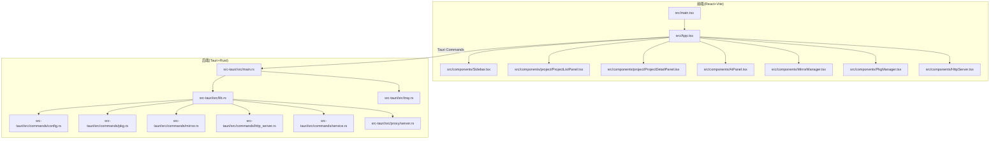
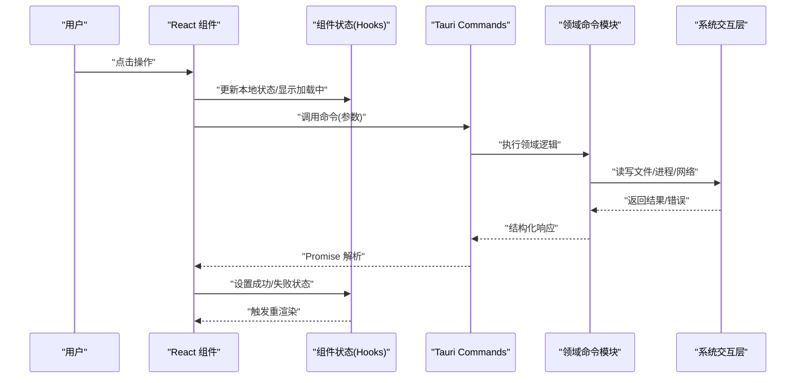
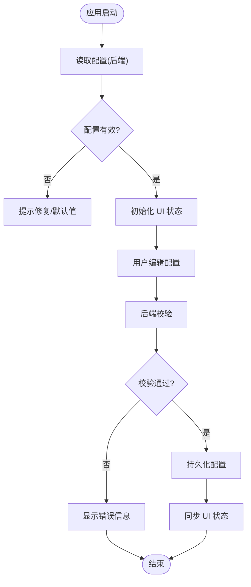
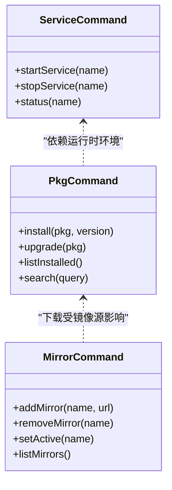
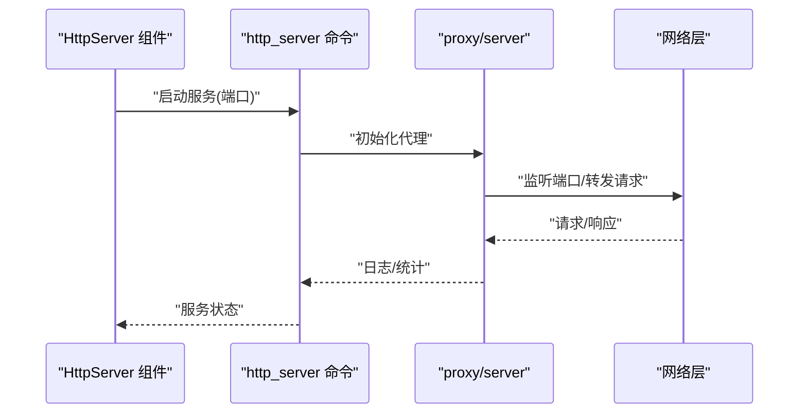
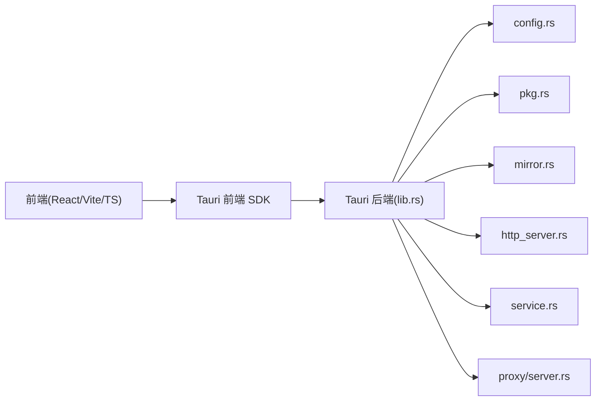

# 项目架构设计

<cite>
**本文引用的文件**   
- [README.md](file://README.md)
- [package.json](file://package.json)
- [vite.config.ts](file://vite.config.ts)
- [tsconfig.json](file://tsconfig.json)
- [src/main.tsx](file://src/main.tsx)
- [src/App.tsx](file://src/App.tsx)
- [src/components/Sidebar.tsx](file://src/components/Sidebar.tsx)
- [src/components/project/ProjectListPanel.tsx](file://src/components/project/ProjectListPanel.tsx)
- [src/components/project/ProjectDetailPanel.tsx](file://src/components/project/ProjectDetailPanel.tsx)
- [src/components/AiPanel.tsx](file://src/components/AiPanel.tsx)
- [src/components/MirrorManager.tsx](file://src/components/MirrorManager.tsx)
- [src/components/PkgManager.tsx](file://src/components/PkgManager.tsx)
- [src/components/HttpServer.tsx](file://src/components/HttpServer.tsx)
- [src-tauri/src/main.rs](file://src-tauri/src/main.rs)
- [src-tauri/src/lib.rs](file://src-tauri/src/lib.rs)
- [src-tauri/src/tray.rs](file://src-tauri/src/tray.rs)
- [src-tauri/Cargo.toml](file://src-tauri/Cargo.toml)
- [src-tauri/tauri.conf.json](file://src-tauri/tauri.conf.json)
- [src-tauri/capabilities/default.json](file://src-tauri/capabilities/default.json)
- [src-tauri/src/commands/mod.rs](file://src-tauri/src/commands/mod.rs)
- [src-tauri/src/commands/config.rs](file://src-tauri/src/commands/config.rs)
- [src-tauri/src/commands/pkg.rs](file://src-tauri/src/commands/pkg.rs)
- [src-tauri/src/commands/mirror.rs](file://src-tauri/src/commands/mirror.rs)
- [src-tauri/src/commands/http_server.rs](file://src-tauri/src/commands/http_server.rs)
- [src-tauri/src/commands/service.rs](file://src-tauri/src/commands/service.rs)
- [src-tauri/src/proxy/server.rs](file://src-tauri/src/proxy/server.rs)
</cite>

## 目录
1. [简介](#简介)
2. [项目结构](#项目结构)
3. [核心组件](#核心组件)
4. [架构总览](#架构总览)
5. [详细组件分析](#详细组件分析)
6. [依赖关系分析](#依赖关系分析)
7. [性能考虑](#性能考虑)
8. [故障排查指南](#故障排查指南)
9. [结论](#结论)
10. [附录](#附录)

## 简介
Any-Version 是一个基于 Tauri 的跨平台桌面应用，采用“前端 React + 后端 Rust”的分层架构。其目标是统一管理多语言、多工具的多版本环境（如 Node.js、Python、Go、Java、数据库等），并提供镜像源管理、包管理器集成、AI 助手与代理能力等扩展功能。整体遵循 MVVM 模式组织前端状态与视图，通过 Tauri Commands 暴露后端能力，形成清晰的前后端通信边界；同时以事件驱动方式连接 UI 与系统服务，提供可扩展的配置中心与插件化能力。

## 项目结构
仓库采用前后端分离的组织方式：
- 前端位于 src 目录，使用 Vite 构建，React 作为 UI 框架，TypeScript 保证类型安全。
- 后端位于 src-tauri 目录，Rust 实现 Tauri 命令、系统交互、代理服务与配置持久化。
- 项目元数据与构建脚本位于根目录，包括 package.json、vite.config.ts、tsconfig.json 以及 Tauri 配置文件 tauri.conf.json。



图表来源
- [src/main.tsx:1-200](file://src/main.tsx#L1-L200)
- [src/App.tsx:1-200](file://src/App.tsx#L1-L200)
- [src/components/Sidebar.tsx:1-200](file://src/components/Sidebar.tsx#L1-L200)
- [src/components/project/ProjectListPanel.tsx:1-200](file://src/components/project/ProjectListPanel.tsx#L1-L200)
- [src/components/project/ProjectDetailPanel.tsx:1-200](file://src/components/project/ProjectDetailPanel.tsx#L1-L200)
- [src/components/AiPanel.tsx:1-200](file://src/components/AiPanel.tsx#L1-L200)
- [src/components/MirrorManager.tsx:1-200](file://src/components/MirrorManager.tsx#L1-L200)
- [src/components/PkgManager.tsx:1-200](file://src/components/PkgManager.tsx#L1-L200)
- [src/components/HttpServer.tsx:1-200](file://src/components/HttpServer.tsx#L1-L200)
- [src-tauri/src/main.rs:1-200](file://src-tauri/src/main.rs#L1-L200)
- [src-tauri/src/lib.rs:1-200](file://src-tauri/src/lib.rs#L1-L200)
- [src-tauri/src/tray.rs:1-200](file://src-tauri/src/tray.rs#L1-L200)
- [src-tauri/src/commands/config.rs:1-200](file://src-tauri/src/commands/config.rs#L1-L200)
- [src-tauri/src/commands/pkg.rs:1-200](file://src-tauri/src/commands/pkg.rs#L1-L200)
- [src-tauri/src/commands/mirror.rs:1-200](file://src-tauri/src/commands/mirror.rs#L1-L200)
- [src-tauri/src/commands/http_server.rs:1-200](file://src-tauri/src/commands/http_server.rs#L1-L200)
- [src-tauri/src/commands/service.rs:1-200](file://src-tauri/src/commands/service.rs#L1-L200)
- [src-tauri/src/proxy/server.rs:1-200](file://src-tauri/src/proxy/server.rs#L1-L200)

章节来源
- [README.md:1-200](file://README.md#L1-L200)
- [package.json:1-200](file://package.json#L1-L200)
- [vite.config.ts:1-200](file://vite.config.ts#L1-L200)
- [tsconfig.json:1-200](file://tsconfig.json#L1-L200)
- [src-tauri/tauri.conf.json:1-200](file://src-tauri/tauri.conf.json#L1-L200)

## 核心组件
- 前端入口与路由
  - main.tsx 负责初始化 React 应用并挂载到 DOM。
  - App.tsx 组织全局布局、侧边栏与主内容区，承载页面级导航与状态。
- 功能面板
  - Sidebar.tsx 提供导航菜单与上下文切换。
  - ProjectListPanel.tsx / ProjectDetailPanel.tsx 管理项目列表与详情，展示版本信息与操作入口。
  - AiPanel.tsx 集成 AI 助手相关能力（模型配置、会话、技能管理等）。
  - MirrorManager.tsx 管理镜像源配置与切换。
  - PkgManager.tsx 封装包管理器操作（安装、升级、查询等）。
  - HttpServer.tsx 控制内置 HTTP 服务的启停与端口管理。
- 后端能力
  - main.rs 启动 Tauri 应用，注册命令与托盘。
  - lib.rs 集中注册所有 Tauri Commands，定义前后端接口契约。
  - commands/* 按领域划分命令模块（配置、包管理、镜像、HTTP 服务等）。
  - proxy/server.rs 提供代理服务器能力，支持网络请求转发与优化。
  - tray.rs 提供系统托盘交互，便于后台常驻与快捷操作。

章节来源
- [src/main.tsx:1-200](file://src/main.tsx#L1-L200)
- [src/App.tsx:1-200](file://src/App.tsx#L1-L200)
- [src/components/Sidebar.tsx:1-200](file://src/components/Sidebar.tsx#L1-L200)
- [src/components/project/ProjectListPanel.tsx:1-200](file://src/components/project/ProjectListPanel.tsx#L1-L200)
- [src/components/project/ProjectDetailPanel.tsx:1-200](file://src/components/project/ProjectDetailPanel.tsx#L1-L200)
- [src/components/AiPanel.tsx:1-200](file://src/components/AiPanel.tsx#L1-L200)
- [src/components/MirrorManager.tsx:1-200](file://src/components/MirrorManager.tsx#L1-L200)
- [src/components/PkgManager.tsx:1-200](file://src/components/PkgManager.tsx#L1-L200)
- [src/components/HttpServer.tsx:1-200](file://src/components/HttpServer.tsx#L1-L200)
- [src-tauri/src/main.rs:1-200](file://src-tauri/src/main.rs#L1-L200)
- [src-tauri/src/lib.rs:1-200](file://src-tauri/src/lib.rs#L1-L200)
- [src-tauri/src/tray.rs:1-200](file://src-tauri/src/tray.rs#L1-L200)
- [src-tauri/src/commands/mod.rs:1-200](file://src-tauri/src/commands/mod.rs#L1-L200)
- [src-tauri/src/commands/config.rs:1-200](file://src-tauri/src/commands/config.rs#L1-L200)
- [src-tauri/src/commands/pkg.rs:1-200](file://src-tauri/src/commands/pkg.rs#L1-L200)
- [src-tauri/src/commands/mirror.rs:1-200](file://src-tauri/src/commands/mirror.rs#L1-L200)
- [src-tauri/src/commands/http_server.rs:1-200](file://src-tauri/src/commands/http_server.rs#L1-L200)
- [src-tauri/src/commands/service.rs:1-200](file://src-tauri/src/commands/service.rs#L1-L200)
- [src-tauri/src/proxy/server.rs:1-200](file://src-tauri/src/proxy/server.rs#L1-L200)

## 架构总览
Any-Version 采用分层架构：
- 表现层（UI）：React 组件树，基于 Hooks 进行状态管理与副作用处理。
- 业务层（Commands）：Tauri 命令模块，封装领域逻辑（配置、包管理、镜像、HTTP 服务、代理等）。
- 基础设施层（系统交互）：文件系统、进程管理、网络 I/O、托盘与窗口生命周期。

```mermaid
graph TB
UI["前端 UI 层<br/>React 组件"] --> API["Tauri Commands 接口层<br/>lib.rs 注册"]
API --> Domain["领域命令模块<br/>config/pkg/mirror/http_server/service"]
Domain --> Infra["系统交互层<br/>文件/进程/网络/托盘"]
UI <- --> |"JSON 消息/异步调用"| API
```

图表来源
- [src-tauri/src/lib.rs:1-200](file://src-tauri/src/lib.rs#L1-L200)
- [src-tauri/src/commands/config.rs:1-200](file://src-tauri/src/commands/config.rs#L1-L200)
- [src-tauri/src/commands/pkg.rs:1-200](file://src-tauri/src/commands/pkg.rs#L1-L200)
- [src-tauri/src/commands/mirror.rs:1-200](file://src-tauri/src/commands/mirror.rs#L1-L200)
- [src-tauri/src/commands/http_server.rs:1-200](file://src-tauri/src/commands/http_server.rs#L1-L200)
- [src-tauri/src/commands/service.rs:1-200](file://src-tauri/src/commands/service.rs#L1-L200)

## 详细组件分析

### 前端 MVVM 与事件驱动
- 视图（View）：各功能面板组件（Sidebar、ProjectListPanel、AiPanel 等）负责渲染与用户交互。
- 模型（Model）：通过 Tauri Commands 获取或更新后端状态（配置、包信息、镜像源等）。
- 视图模型（ViewModel）：在组件内使用 React Hooks 维护本地状态，协调 UI 与后端调用，处理加载与错误状态。
- 事件驱动：用户操作触发事件，组件发出命令调用，后端返回结果后更新状态，驱动 UI 刷新。



图表来源
- [src/components/project/ProjectListPanel.tsx:1-200](file://src/components/project/ProjectListPanel.tsx#L1-L200)
- [src/components/AiPanel.tsx:1-200](file://src/components/AiPanel.tsx#L1-L200)
- [src/components/MirrorManager.tsx:1-200](file://src/components/MirrorManager.tsx#L1-L200)
- [src/components/PkgManager.tsx:1-200](file://src/components/PkgManager.tsx#L1-L200)
- [src-tauri/src/lib.rs:1-200](file://src-tauri/src/lib.rs#L1-L200)
- [src-tauri/src/commands/config.rs:1-200](file://src-tauri/src/commands/config.rs#L1-L200)
- [src-tauri/src/commands/pkg.rs:1-200](file://src-tauri/src/commands/pkg.rs#L1-L200)
- [src-tauri/src/commands/mirror.rs:1-200](file://src-tauri/src/commands/mirror.rs#L1-L200)

章节来源
- [src/App.tsx:1-200](file://src/App.tsx#L1-L200)
- [src/components/Sidebar.tsx:1-200](file://src/components/Sidebar.tsx#L1-L200)
- [src/components/project/ProjectListPanel.tsx:1-200](file://src/components/project/ProjectListPanel.tsx#L1-L200)
- [src/components/project/ProjectDetailPanel.tsx:1-200](file://src/components/project/ProjectDetailPanel.tsx#L1-L200)
- [src/components/AiPanel.tsx:1-200](file://src/components/AiPanel.tsx#L1-L200)
- [src/components/MirrorManager.tsx:1-200](file://src/components/MirrorManager.tsx#L1-L200)
- [src/components/PkgManager.tsx:1-200](file://src/components/PkgManager.tsx#L1-L200)
- [src/components/HttpServer.tsx:1-200](file://src/components/HttpServer.tsx#L1-L200)

### 配置中心设计
- 配置存储：后端通过配置命令模块统一读取与写入配置（如镜像源、环境变量、路径等）。
- 配置同步：前端在启动时拉取配置，并在用户修改后写回后端，确保多面板共享一致状态。
- 配置校验：后端对关键配置项进行合法性检查，避免无效配置导致运行时异常。



图表来源
- [src-tauri/src/commands/config.rs:1-200](file://src-tauri/src/commands/config.rs#L1-L200)
- [src/components/MirrorManager.tsx:1-200](file://src/components/MirrorManager.tsx#L1-L200)

章节来源
- [src-tauri/src/commands/config.rs:1-200](file://src-tauri/src/commands/config.rs#L1-L200)
- [src/components/MirrorManager.tsx:1-200](file://src/components/MirrorManager.tsx#L1-L200)

### 包管理与镜像源
- 包管理命令：封装常见包管理器操作（安装、升级、查询、列出已安装包等）。
- 镜像源管理：提供镜像源增删改查与切换，影响后续下载行为。
- 错误处理：对网络超时、权限不足、路径不存在等场景进行统一错误分类与提示。



图表来源
- [src-tauri/src/commands/pkg.rs:1-200](file://src-tauri/src/commands/pkg.rs#L1-L200)
- [src-tauri/src/commands/mirror.rs:1-200](file://src-tauri/src/commands/mirror.rs#L1-L200)
- [src-tauri/src/commands/service.rs:1-200](file://src-tauri/src/commands/service.rs#L1-L200)

章节来源
- [src/components/PkgManager.tsx:1-200](file://src/components/PkgManager.tsx#L1-L200)
- [src/components/MirrorManager.tsx:1-200](file://src/components/MirrorManager.tsx#L1-L200)
- [src-tauri/src/commands/pkg.rs:1-200](file://src-tauri/src/commands/pkg.rs#L1-L200)
- [src-tauri/src/commands/mirror.rs:1-200](file://src-tauri/src/commands/mirror.rs#L1-L200)
- [src-tauri/src/commands/service.rs:1-200](file://src-tauri/src/commands/service.rs#L1-L200)

### HTTP 服务与代理
- HTTP 服务：提供内置 Web 服务用于调试或外部集成，支持端口选择与启停控制。
- 代理服务器：在网络请求层面进行转发与优化，可结合镜像源策略提升下载效率。



图表来源
- [src/components/HttpServer.tsx:1-200](file://src/components/HttpServer.tsx#L1-L200)
- [src-tauri/src/commands/http_server.rs:1-200](file://src-tauri/src/commands/http_server.rs#L1-L200)
- [src-tauri/src/proxy/server.rs:1-200](file://src-tauri/src/proxy/server.rs#L1-L200)

章节来源
- [src/components/HttpServer.tsx:1-200](file://src/components/HttpServer.tsx#L1-L200)
- [src-tauri/src/commands/http_server.rs:1-200](file://src-tauri/src/commands/http_server.rs#L1-L200)
- [src-tauri/src/proxy/server.rs:1-200](file://src-tauri/src/proxy/server.rs#L1-L200)

### 系统托盘与生命周期
- 托盘：提供常驻图标与快捷菜单，便于快速访问常用功能。
- 生命周期：应用启动时初始化托盘与窗口，退出时清理资源与服务。

章节来源
- [src-tauri/src/tray.rs:1-200](file://src-tauri/src/tray.rs#L1-L200)
- [src-tauri/src/main.rs:1-200](file://src-tauri/src/main.rs#L1-L200)

## 依赖关系分析
- 前端依赖
  - React 生态（Hooks、组件库）、Vite 构建工具、TypeScript 类型系统。
  - 通过 Tauri 前端 SDK 调用后端命令。
- 后端依赖
  - Tauri 运行时、Rust 标准库与第三方 crate（网络、进程、文件系统）。
  - 命令模块按职责拆分，集中注册于 lib.rs。



图表来源
- [package.json:1-200](file://package.json#L1-L200)
- [vite.config.ts:1-200](file://vite.config.ts#L1-L200)
- [tsconfig.json:1-200](file://tsconfig.json#L1-L200)
- [src-tauri/src/lib.rs:1-200](file://src-tauri/src/lib.rs#L1-L200)
- [src-tauri/Cargo.toml:1-200](file://src-tauri/Cargo.toml#L1-L200)

章节来源
- [package.json:1-200](file://package.json#L1-L200)
- [vite.config.ts:1-200](file://vite.config.ts#L1-L200)
- [tsconfig.json:1-200](file://tsconfig.json#L1-L200)
- [src-tauri/Cargo.toml:1-200](file://src-tauri/Cargo.toml#L1-L200)
- [src-tauri/src/lib.rs:1-200](file://src-tauri/src/lib.rs#L1-L200)

## 性能考虑
- 前端
  - 合理使用 React Hooks 与 memoization，减少不必要的重渲染。
  - 大列表分页与虚拟滚动，降低 DOM 压力。
  - 懒加载与代码分割，缩短首屏时间。
- 后端
  - 命令执行尽量异步化，避免阻塞 UI 线程。
  - 批量操作合并 IO，减少磁盘与网络往返。
  - 缓存热点配置与包索引，提高响应速度。
- 网络
  - 利用代理与镜像源策略，提升下载成功率与速度。
  - 重试与退避机制，增强鲁棒性。

[本节为通用指导，不直接分析具体文件]

## 故障排查指南
- 常见问题定位
  - 配置错误：检查配置命令模块的校验逻辑与错误返回。
  - 包管理失败：确认镜像源可用性与网络连通性。
  - HTTP 服务冲突：检查端口占用与权限问题。
  - 代理异常：查看代理服务器日志与转发规则。
- 建议步骤
  - 启用详细日志输出，定位错误堆栈。
  - 隔离复现最小用例，逐步缩小范围。
  - 验证系统环境与依赖是否满足要求。

章节来源
- [src-tauri/src/commands/config.rs:1-200](file://src-tauri/src/commands/config.rs#L1-L200)
- [src-tauri/src/commands/mirror.rs:1-200](file://src-tauri/src/commands/mirror.rs#L1-L200)
- [src-tauri/src/commands/http_server.rs:1-200](file://src-tauri/src/commands/http_server.rs#L1-L200)
- [src-tauri/src/proxy/server.rs:1-200](file://src-tauri/src/proxy/server.rs#L1-L200)

## 结论
Any-Version 通过 Tauri 将 React 前端与 Rust 后端有机结合，形成清晰的 MVVM 与事件驱动架构。配置中心、包管理、镜像源与代理服务构成核心能力域，具备良好的扩展性与可维护性。建议在后续迭代中持续完善错误处理与性能优化，并引入更完善的测试与监控体系。

[本节为总结性内容，不直接分析具体文件]

## 附录
- 技术栈选择与权衡
  - React + Vite + TypeScript：开发体验好、生态成熟、类型安全。
  - Tauri + Rust：轻量二进制体积、高性能系统交互、跨平台能力强。
  - 代理与镜像源：提升下载稳定性与速度，适配不同网络环境。
- 扩展点与集成模式
  - 新增命令：在 lib.rs 注册新命令，并在前端组件中调用。
  - 新增面板：创建 React 组件，接入侧边栏导航与路由。
  - 插件化：通过配置中心与命令接口扩展第三方工具或服务。

[本节为补充说明，不直接分析具体文件]