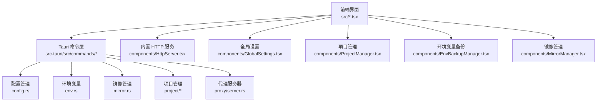
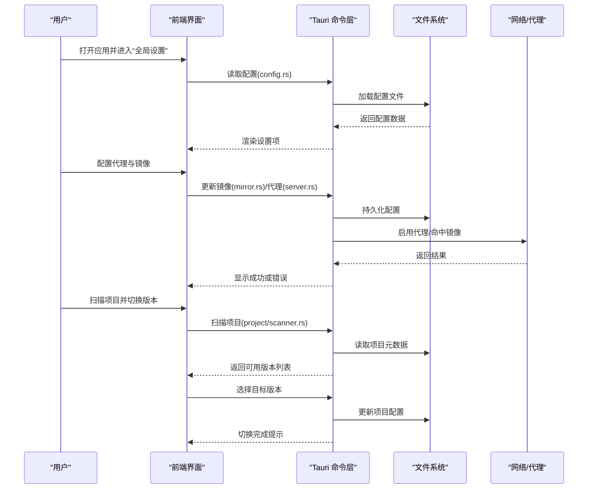
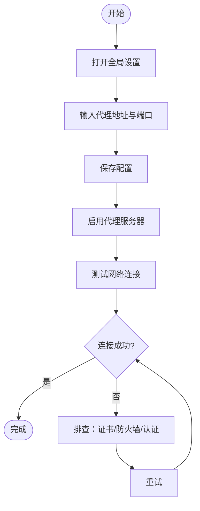
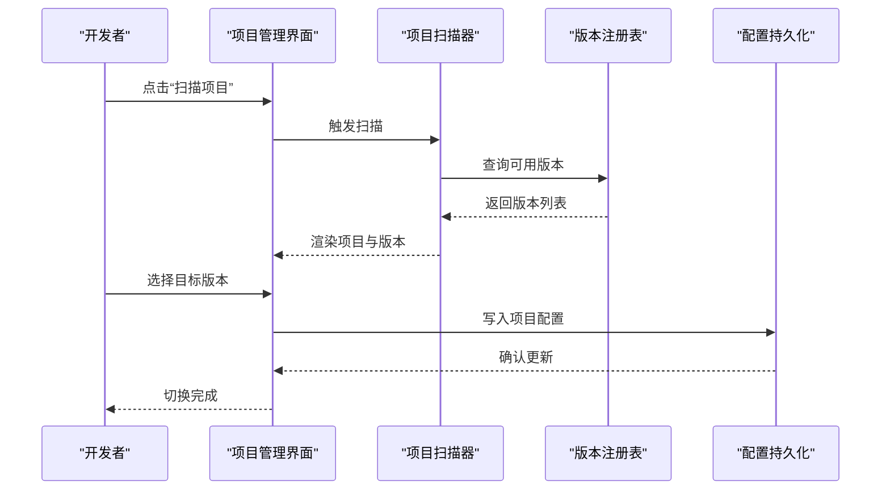
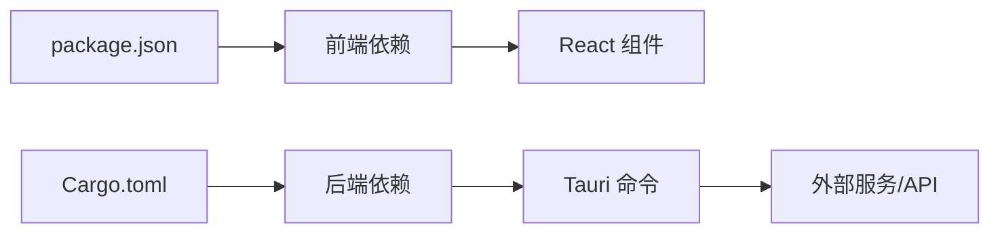

# 快速开始

<cite>
**本文引用的文件**   
- [README.md](file://README.md)
- [package.json](file://package.json)
- [src/main.tsx](file://src/main.tsx)
- [src/App.tsx](file://src/App.tsx)
- [src/components/GlobalSettings.tsx](file://src/components/GlobalSettings.tsx)
- [src/components/ProjectManager.tsx](file://src/components/ProjectManager.tsx)
- [src/components/EnvBackupManager.tsx](file://src/components/EnvBackupManager.tsx)
- [src/components/MirrorManager.tsx](file://src/components/MirrorManager.tsx)
- [src/components/HttpServer.tsx](file://src/components/HttpServer.tsx)
- [src-tauri/src/main.rs](file://src-tauri/src/main.rs)
- [src-tauri/src/lib.rs](file://src-tauri/src/lib.rs)
- [src-tauri/src/commands/mod.rs](file://src-tauri/src/commands/mod.rs)
- [src-tauri/src/commands/config.rs](file://src-tauri/src/commands/config.rs)
- [src-tauri/src/commands/env.rs](file://src-tauri/src/commands/env.rs)
- [src-tauri/src/commands/mirror.rs](file://src-tauri/src/commands/mirror.rs)
- [src-tauri/src/commands/project/registry.rs](file://src-tauri/src/commands/project/registry.rs)
- [src-tauri/src/commands/project/scanner.rs](file://src-tauri/src/commands/project/scanner.rs)
- [src-tauri/src/proxy/server.rs](file://src-tauri/src/proxy/server.rs)
- [ai-tools/providers.json](file://ai-tools/providers.json)
- [ai-tools/mcp-config.json](file://ai-tools/mcp-config.json)
</cite>

## 目录
1. [简介](#简介)
2. [项目结构](#项目结构)
3. [核心组件](#核心组件)
4. [架构总览](#架构总览)
5. [详细组件分析](#详细组件分析)
6. [依赖分析](#依赖分析)
7. [性能考虑](#性能考虑)
8. [故障排除指南](#故障排除指南)
9. [结论](#结论)
10. [附录](#附录)

## 简介
Any-Version 是一个跨平台的桌面应用，用于统一管理多语言、多工具的多版本 SDK、包管理器与 AI 助手。它提供一键安装、版本切换、代理与镜像配置、环境变量管理、AI 模型与技能管理等能力，帮助开发者在 Windows、macOS、Linux 上快速上手并高效工作。

本快速开始指南将带你完成：
- 三大平台（Windows、macOS、Linux）的安装与首次启动
- 初始配置向导与环境变量设置
- 代理与网络配置基础步骤
- 常见使用场景入门示例：创建第一个项目、切换语言版本、配置 AI 助手
- 常见问题与解决方案

## 项目结构
Any-Version 采用 Tauri 架构：前端基于 React + TypeScript，后端为 Rust。关键目录说明如下：
- src：前端界面与业务逻辑（React 组件、状态管理、HTTP 服务面板等）
- src-tauri：Tauri 后端（Rust），包含命令接口、配置、环境、镜像、代理、项目管理等模块
- ai-tools：AI 工具与提供者配置（如 providers.json、mcp-config.json）
- projects：各语言/工具的默认项目模板与远程版本配置
- docs：文档与计划

图表来源
- [src/main.tsx:1-200](file://src/main.tsx#L1-L200)
- [src/App.tsx:1-200](file://src/App.tsx#L1-L200)
- [src/components/HttpServer.tsx:1-200](file://src/components/HttpServer.tsx#L1-L200)
- [src/components/GlobalSettings.tsx:1-200](file://src/components/GlobalSettings.tsx#L1-L200)
- [src/components/ProjectManager.tsx:1-200](file://src/components/ProjectManager.tsx#L1-L200)
- [src/components/EnvBackupManager.tsx:1-200](file://src/components/EnvBackupManager.tsx#L1-L200)
- [src/components/MirrorManager.tsx:1-200](file://src/components/MirrorManager.tsx#L1-L200)
- [src-tauri/src/commands/mod.rs:1-200](file://src-tauri/src/commands/mod.rs#L1-L200)
- [src-tauri/src/commands/config.rs:1-200](file://src-tauri/src/commands/config.rs#L1-L200)
- [src-tauri/src/commands/env.rs:1-200](file://src-tauri/src/commands/env.rs#L1-L200)
- [src-tauri/src/commands/mirror.rs:1-200](file://src-tauri/src/commands/mirror.rs#L1-L200)
- [src-tauri/src/commands/project/registry.rs:1-200](file://src-tauri/src/commands/project/registry.rs#L1-L200)
- [src-tauri/src/commands/project/scanner.rs:1-200](file://src-tauri/src/commands/project/scanner.rs#L1-L200)
- [src-tauri/src/proxy/server.rs:1-200](file://src-tauri/src/proxy/server.rs#L1-L200)

章节来源
- [README.md:1-200](file://README.md#L1-L200)
- [package.json:1-200](file://package.json#L1-L200)
- [src/main.tsx:1-200](file://src/main.tsx#L1-L200)
- [src/App.tsx:1-200](file://src/App.tsx#L1-L200)

## 核心组件
- 全局设置：集中管理应用偏好、主题、语言、窗口行为等
- 项目管理：扫描本地项目、识别语言与包管理器、列出可用版本
- 环境变量备份：导出/导入当前会话的环境变量快照
- 镜像管理：配置国内镜像源与加速策略
- 内置 HTTP 服务：提供本地调试与外部访问的轻量服务
- AI 工具与提供者：通过 providers.json 与 mcp-config.json 管理 AI 助手与 MCP 服务器

章节来源
- [src/components/GlobalSettings.tsx:1-200](file://src/components/GlobalSettings.tsx#L1-L200)
- [src/components/ProjectManager.tsx:1-200](file://src/components/ProjectManager.tsx#L1-L200)
- [src/components/EnvBackupManager.tsx:1-200](file://src/components/EnvBackupManager.tsx#L1-L200)
- [src/components/MirrorManager.tsx:1-200](file://src/components/MirrorManager.tsx#L1-L200)
- [src/components/HttpServer.tsx:1-200](file://src/components/HttpServer.tsx#L1-L200)
- [ai-tools/providers.json:1-200](file://ai-tools/providers.json#L1-L200)
- [ai-tools/mcp-config.json:1-200](file://ai-tools/mcp-config.json#L1-L200)

## 架构总览
Any-Version 的前端通过 Tauri 命令调用后端能力，实现跨平台一致体验。核心交互流程包括：读取/写入配置、管理环境变量、切换镜像源、扫描项目与版本、启动代理服务等。

图表来源
- [src-tauri/src/commands/config.rs:1-200](file://src-tauri/src/commands/config.rs#L1-L200)
- [src-tauri/src/commands/mirror.rs:1-200](file://src-tauri/src/commands/mirror.rs#L1-L200)
- [src-tauri/src/proxy/server.rs:1-200](file://src-tauri/src/proxy/server.rs#L1-L200)
- [src-tauri/src/commands/project/scanner.rs:1-200](file://src-tauri/src/commands/project/scanner.rs#L1-L200)
- [src-tauri/src/commands/project/registry.rs:1-200](file://src-tauri/src/commands/project/registry.rs#L1-L200)

## 详细组件分析

### 安装与首次启动（Windows、macOS、Linux）
- 获取安装包
  - 从发布页面下载对应平台的安装包或压缩包
  - 若使用源码构建，参考 package.json 中的脚本进行构建与打包
- 安装步骤
  - Windows：双击安装包，按向导完成安装；或在命令行执行安装脚本
  - macOS：拖拽至应用程序文件夹，或通过 Homebrew 安装（若提供）
  - Linux：解压后运行可执行文件或安装发行包
- 首次启动
  - 启动应用后，进入“全局设置”，完成语言、主题、窗口行为等基础配置
  - 如需代理，可在“代理与网络”中配置 HTTP/HTTPS 代理地址与认证信息
  - 建议配置镜像源以提升下载速度（见“镜像管理”）

章节来源
- [package.json:1-200](file://package.json#L1-L200)
- [src/components/GlobalSettings.tsx:1-200](file://src/components/GlobalSettings.tsx#L1-L200)
- [src-tauri/src/main.rs:1-200](file://src-tauri/src/main.rs#L1-L200)
- [src-tauri/src/lib.rs:1-200](file://src-tauri/src/lib.rs#L1-L200)

### 环境变量设置
- 查看与导出
  - 在“环境变量备份”中导出当前会话的环境变量快照，便于迁移或排查问题
- 导入与恢复
  - 导入之前导出的快照，快速恢复开发环境
- 注意事项
  - 不同平台路径分隔符差异（Windows 使用分号，Unix 使用冒号）
  - 避免覆盖系统级敏感变量，优先使用项目级或会话级变量

章节来源
- [src/components/EnvBackupManager.tsx:1-200](file://src/components/EnvBackupManager.tsx#L1-L200)
- [src-tauri/src/commands/env.rs:1-200](file://src-tauri/src/commands/env.rs#L1-L200)

### 代理与网络配置
- 配置代理
  - 在“全局设置”或“代理与网络”中填写代理地址、端口、用户名与密码
  - 支持 HTTP/HTTPS 代理，部分场景支持 SOCKS（取决于后端实现）
- 启用代理服务
  - 可通过内置代理服务器转发请求，提升稳定性与缓存命中率
- 验证连通性
  - 使用内置测试功能检查代理是否生效，必要时调整防火墙或安全软件规则

图表来源
- [src-tauri/src/proxy/server.rs:1-200](file://src-tauri/src/proxy/server.rs#L1-L200)
- [src-tauri/src/commands/config.rs:1-200](file://src-tauri/src/commands/config.rs#L1-L200)

章节来源
- [src/components/GlobalSettings.tsx:1-200](file://src/components/GlobalSettings.tsx#L1-L200)
- [src-tauri/src/proxy/server.rs:1-200](file://src-tauri/src/proxy/server.rs#L1-L200)

### 镜像管理
- 选择镜像源
  - 在“镜像管理”中选择官方或国内镜像源，降低下载延迟
- 自定义镜像
  - 添加自定义镜像地址，适用于企业内网或私有仓库
- 优先级与回退
  - 配置多个镜像源的优先级，失败时自动回退到下一个源

章节来源
- [src/components/MirrorManager.tsx:1-200](file://src/components/MirrorManager.tsx#L1-L200)
- [src-tauri/src/commands/mirror.rs:1-200](file://src-tauri/src/commands/mirror.rs#L1-L200)

### 项目管理与版本切换
- 扫描项目
  - 应用自动扫描指定目录下的项目，识别语言与包管理器
- 列出可用版本
  - 根据项目元数据与远程版本配置，展示可选版本
- 切换版本
  - 选择目标版本并应用，更新项目配置与 PATH 环境变量

图表来源
- [src-tauri/src/commands/project/scanner.rs:1-200](file://src-tauri/src/commands/project/scanner.rs#L1-L200)
- [src-tauri/src/commands/project/registry.rs:1-200](file://src-tauri/src/commands/project/registry.rs#L1-L200)
- [src/components/ProjectManager.tsx:1-200](file://src/components/ProjectManager.tsx#L1-L200)

章节来源
- [src/components/ProjectManager.tsx:1-200](file://src/components/ProjectManager.tsx#L1-L200)
- [src-tauri/src/commands/project/scanner.rs:1-200](file://src-tauri/src/commands/project/scanner.rs#L1-L200)
- [src-tauri/src/commands/project/registry.rs:1-200](file://src-tauri/src/commands/project/registry.rs#L1-L200)

### 内置 HTTP 服务
- 启动服务
  - 在“内置 HTTP 服务”中设置监听端口与路由
- 访问与调试
  - 通过浏览器或 curl 访问本地服务，便于联调与演示
- 安全建议
  - 仅绑定 localhost，避免暴露到公网；必要时启用鉴权

章节来源
- [src/components/HttpServer.tsx:1-200](file://src/components/HttpServer.tsx#L1-L200)

### AI 助手与 MCP 配置
- 提供者配置
  - 编辑 ai-tools/providers.json，添加或修改 AI 提供商（如密钥、端点、模型）
- MCP 服务器
  - 在 ai-tools/mcp-config.json 中配置 MCP 服务器地址与参数
- 启动与测试
  - 在 AI 面板中选择模型与技能，发送测试消息验证连通性

章节来源
- [ai-tools/providers.json:1-200](file://ai-tools/providers.json#L1-L200)
- [ai-tools/mcp-config.json:1-200](file://ai-tools/mcp-config.json#L1-L200)

## 依赖分析
- 前端依赖
  - React、TypeScript、Vite 等，详见 package.json
- 后端依赖
  - Tauri、Rust 标准库与第三方 crate（网络、配置、文件系统）
- 外部集成
  - 包管理器（npm/pip/go mod 等）、AI 提供商 API、MCP 服务器

图表来源
- [package.json:1-200](file://package.json#L1-L200)
- [src-tauri/Cargo.toml:1-200](file://src-tauri/Cargo.toml#L1-L200)

章节来源
- [package.json:1-200](file://package.json#L1-L200)
- [src-tauri/Cargo.toml:1-200](file://src-tauri/Cargo.toml#L1-L200)

## 性能考虑
- 镜像与代理
  - 合理配置镜像源与代理，减少网络往返与重试开销
- 扫描优化
  - 限制扫描目录范围，避免对大型仓库进行全量扫描
- 缓存策略
  - 利用内置缓存与本地元数据，提高版本列表加载速度
- 资源占用
  - 关闭不必要的后台任务与服务，释放内存与 CPU

[本节为通用指导，不直接分析具体文件]

## 故障排除指南
- 无法连接网络
  - 检查代理配置是否正确，确认防火墙与安全软件未拦截
  - 使用内置测试功能验证连通性
- 镜像下载失败
  - 更换镜像源或调整优先级，检查证书与域名解析
- 环境变量未生效
  - 确认变量作用域（系统/用户/项目/会话），重启终端或应用
- 项目扫描为空
  - 检查项目根目录是否存在元数据文件（如 package.json、go.mod、pom.xml 等）
- AI 助手不可用
  - 校验 providers.json 中的密钥与端点，检查网络可达性与速率限制

章节来源
- [src-tauri/src/commands/config.rs:1-200](file://src-tauri/src/commands/config.rs#L1-L200)
- [src-tauri/src/commands/mirror.rs:1-200](file://src-tauri/src/commands/mirror.rs#L1-L200)
- [src-tauri/src/commands/env.rs:1-200](file://src-tauri/src/commands/env.rs#L1-L200)
- [src-tauri/src/commands/project/scanner.rs:1-200](file://src-tauri/src/commands/project/scanner.rs#L1-L200)

## 结论
通过本快速开始指南，你已完成 Any-Version 的安装、首次启动、环境与网络配置，并掌握了项目管理、版本切换与 AI 助手的基础用法。建议进一步阅读文档与配置示例，结合团队规范与企业内网要求，定制更高效的开发工作流。

[本节为总结性内容，不直接分析具体文件]

## 附录
- 常用命令与入口
  - 启动应用：双击图标或运行可执行文件
  - 打开全局设置：菜单或快捷键
  - 打开项目管理：侧边栏导航
- 配置文件位置
  - 全局配置：应用数据目录下 config.json
  - 项目配置：项目根目录 config.json
  - AI 提供者：ai-tools/providers.json
  - MCP 配置：ai-tools/mcp-config.json

章节来源
- [src-tauri/src/commands/config.rs:1-200](file://src-tauri/src/commands/config.rs#L1-L200)
- [ai-tools/providers.json:1-200](file://ai-tools/providers.json#L1-L200)
- [ai-tools/mcp-config.json:1-200](file://ai-tools/mcp-config.json#L1-L200)