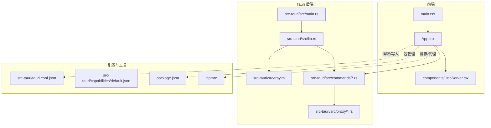
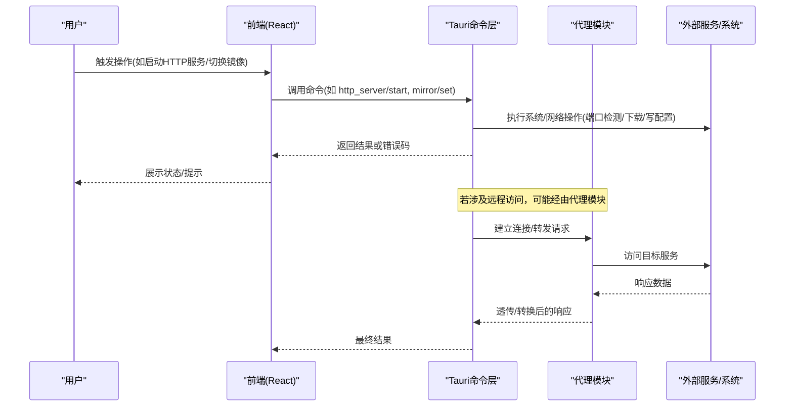
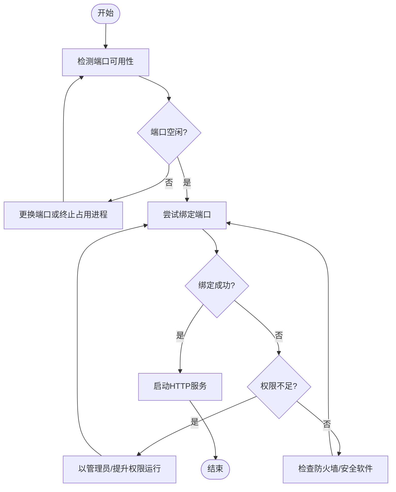
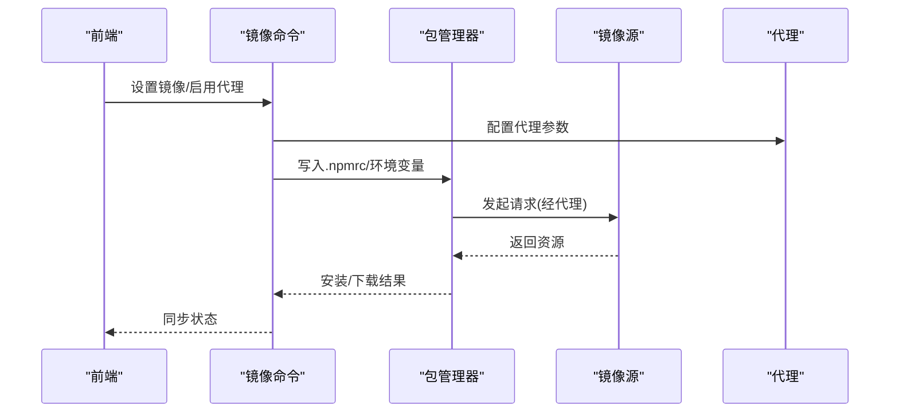
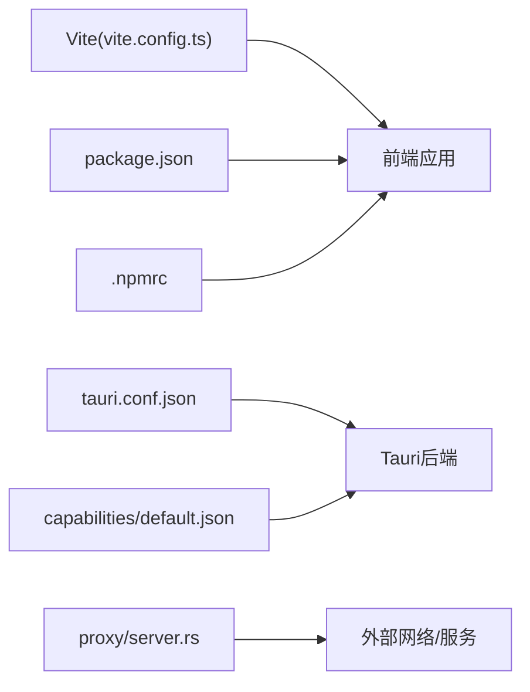

# 故障排除

<cite>
**本文引用的文件**   
- [README.md](file://README.md)
- [package.json](file://package.json)
- [vite.config.ts](file://vite.config.ts)
- [src/main.tsx](file://src/main.tsx)
- [src/App.tsx](file://src/App.tsx)
- [src/components/HttpServer.tsx](file://src/components/HttpServer.tsx)
- [src-tauri/src/main.rs](file://src-tauri/src/main.rs)
- [src-tauri/src/lib.rs](file://src-tauri/src/lib.rs)
- [src-tauri/src/tray.rs](file://src-tauri/src/tray.rs)
- [src-tauri/src/commands/mod.rs](file://src-tauri/src/commands/mod.rs)
- [src-tauri/src/commands/config.rs](file://src-tauri/src/commands/config.rs)
- [src-tauri/src/commands/env.rs](file://src-tauri/src/commands/env.rs)
- [src-tauri/src/commands/mirror.rs](file://src-tauri/src/commands/mirror.rs)
- [src-tauri/src/commands/pkg.rs](file://src-tauri/src/commands/pkg.rs)
- [src-tauri/src/commands/port.rs](file://src-tauri/src/commands/port.rs)
- [src-tauri/src/commands/http_server.rs](file://src-tauri/src/commands/http_server.rs)
- [src-tauri/src/proxy/server.rs](file://src-tauri/src/proxy/server.rs)
- [src-tauri/src/proxy/google.rs](file://src-tauri/src/proxy/google.rs)
- [src-tauri/src/proxy/transform.rs](file://src-tauri/src/proxy/transform.rs)
- [src-tauri/src/proxy/types.rs](file://src-tauri/src/proxy/types.rs)
- [src-tauri/src/proxy/sse.rs](file://src-tauri/src/proxy/sse.rs)
- [src-tauri/src/proxy/optimizers.rs](file://src-tauri/src/proxy/optimizers.rs)
- [src-tauri/capabilities/default.json](file://src-tauri/capabilities/default.json)
- [src-tauri/tauri.conf.json](file://src-tauri/tauri.conf.json)
- [.npmrc](file://.npmrc)
- [scripts/bump-version.js](file://scripts/bump-version.js)
</cite>

## 目录
1. [简介](#简介)
2. [项目结构](#项目结构)
3. [核心组件](#核心组件)
4. [架构总览](#架构总览)
5. [详细组件分析](#详细组件分析)
6. [依赖分析](#依赖分析)
7. [性能考虑](#性能考虑)
8. [故障排除指南](#故障排除指南)
9. [结论](#结论)
10. [附录](#附录)

## 简介
本指南面向使用本项目的用户与开发者，提供系统化的问题定位与修复方法。内容覆盖安装、配置、网络、权限、日志与调试、性能诊断与优化、跨平台差异、错误代码对照及社区支持流程，帮助用户自助解决问题并降低技术支持成本。

## 项目结构
本项目采用 Tauri + React 的前后端混合架构：
- 前端（React/Vite）负责 UI 与交互，通过 Tauri 命令调用 Rust 后端能力。
- 后端（Rust/Tauri）提供系统级能力：进程管理、环境变量、镜像源、端口扫描、HTTP 服务、代理转发等。
- 配置文件集中于 src-tauri 与项目根目录的 package.json、.npmrc 等。

图表来源
- [src/main.tsx:1-200](file://src/main.tsx#L1-L200)
- [src/App.tsx:1-200](file://src/App.tsx#L1-L200)
- [src/components/HttpServer.tsx:1-200](file://src/components/HttpServer.tsx#L1-L200)
- [src-tauri/src/main.rs:1-200](file://src-tauri/src/main.rs#L1-L200)
- [src-tauri/src/lib.rs:1-200](file://src-tauri/src/lib.rs#L1-L200)
- [src-tauri/src/tray.rs:1-200](file://src-tauri/src/tray.rs#L1-L200)
- [src-tauri/src/commands/mod.rs:1-200](file://src-tauri/src/commands/mod.rs#L1-L200)
- [src-tauri/src/proxy/server.rs:1-200](file://src-tauri/src/proxy/server.rs#L1-L200)
- [src-tauri/tauri.conf.json:1-200](file://src-tauri/tauri.conf.json#L1-L200)
- [src-tauri/capabilities/default.json:1-200](file://src-tauri/capabilities/default.json#L1-L200)
- [package.json:1-200](file://package.json#L1-L200)
- [.npmrc:1-200](file://.npmrc#L1-L200)

章节来源
- [README.md:1-200](file://README.md#L1-L200)
- [package.json:1-200](file://package.json#L1-L200)
- [vite.config.ts:1-200](file://vite.config.ts#L1-L200)
- [src/main.tsx:1-200](file://src/main.tsx#L1-L200)
- [src/App.tsx:1-200](file://src/App.tsx#L1-L200)
- [src-tauri/src/main.rs:1-200](file://src-tauri/src/main.rs#L1-L200)
- [src-tauri/src/lib.rs:1-200](file://src-tauri/src/lib.rs#L1-L200)
- [src-tauri/src/tray.rs:1-200](file://src-tauri/src/tray.rs#L1-L200)
- [src-tauri/src/commands/mod.rs:1-200](file://src-tauri/src/commands/mod.rs#L1-L200)
- [src-tauri/tauri.conf.json:1-200](file://src-tauri/tauri.conf.json#L1-L200)
- [src-tauri/capabilities/default.json:1-200](file://src-tauri/capabilities/default.json#L1-L200)
- [.npmrc:1-200](file://.npmrc#L1-L200)

## 核心组件
- 应用入口与生命周期
  - 前端入口与路由挂载：[src/main.tsx](file://src/main.tsx)、[src/App.tsx](file://src/App.tsx)
  - Tauri 后端初始化与托盘：[src-tauri/src/main.rs](file://src-tauri/src/main.rs)、[src-tauri/src/tray.rs](file://src-tauri/src/tray.rs)
- 命令层（Tauri Commands）
  - 统一注册与导出：[src-tauri/src/commands/mod.rs](file://src-tauri/src/commands/mod.rs)
  - 配置与环境变量：[src-tauri/src/commands/config.rs](file://src-tauri/src/commands/config.rs)、[src-tauri/src/commands/env.rs](file://src-tauri/src/commands/env.rs)
  - 镜像源与包管理：[src-tauri/src/commands/mirror.rs](file://src-tauri/src/commands/mirror.rs)、[src-tauri/src/commands/pkg.rs](file://src-tauri/src/commands/pkg.rs)
  - 端口扫描与 HTTP 服务：[src-tauri/src/commands/port.rs](file://src-tauri/src/commands/port.rs)、[src-tauri/src/commands/http_server.rs](file://src-tauri/src/commands/http_server.rs)
- 代理与网络
  - 代理服务器与 SSE：[src-tauri/src/proxy/server.rs](file://src-tauri/src/proxy/server.rs)、[src-tauri/src/proxy/sse.rs](file://src-tauri/src/proxy/sse.rs)
  - Google 相关处理与转换：[src-tauri/src/proxy/google.rs](file://src-tauri/src/proxy/google.rs)、[src-tauri/src/proxy/transform.rs](file://src-tauri/src/proxy/transform.rs)
  - 类型定义与优化器：[src-tauri/src/proxy/types.rs](file://src-tauri/src/proxy/types.rs)、[src-tauri/src/proxy/optimizers.rs](file://src-tauri/src/proxy/optimizers.rs)
- 配置与权限
  - Tauri 配置与能力声明：[src-tauri/tauri.conf.json](file://src-tauri/tauri.conf.json)、[src-tauri/capabilities/default.json](file://src-tauri/capabilities/default.json)
  - 前端构建与开发配置：[vite.config.ts](file://vite.config.ts)
  - 包管理与镜像设置：[package.json](file://package.json)、[.npmrc](file://.npmrc)

章节来源
- [src/main.tsx:1-200](file://src/main.tsx#L1-L200)
- [src/App.tsx:1-200](file://src/App.tsx#L1-L200)
- [src-tauri/src/main.rs:1-200](file://src-tauri/src/main.rs#L1-L200)
- [src-tauri/src/tray.rs:1-200](file://src-tauri/src/tray.rs#L1-L200)
- [src-tauri/src/commands/mod.rs:1-200](file://src-tauri/src/commands/mod.rs#L1-L200)
- [src-tauri/src/commands/config.rs:1-200](file://src-tauri/src/commands/config.rs#L1-L200)
- [src-tauri/src/commands/env.rs:1-200](file://src-tauri/src/commands/env.rs#L1-L200)
- [src-tauri/src/commands/mirror.rs:1-200](file://src-tauri/src/commands/mirror.rs#L1-L200)
- [src-tauri/src/commands/pkg.rs:1-200](file://src-tauri/src/commands/pkg.rs#L1-L200)
- [src-tauri/src/commands/port.rs:1-200](file://src-tauri/src/commands/port.rs#L1-L200)
- [src-tauri/src/commands/http_server.rs:1-200](file://src-tauri/src/commands/http_server.rs#L1-L200)
- [src-tauri/src/proxy/server.rs:1-200](file://src-tauri/src/proxy/server.rs#L1-L200)
- [src-tauri/src/proxy/sse.rs:1-200](file://src-tauri/src/proxy/sse.rs#L1-L200)
- [src-tauri/src/proxy/google.rs:1-200](file://src-tauri/src/proxy/google.rs#L1-L200)
- [src-tauri/src/proxy/transform.rs:1-200](file://src-tauri/src/proxy/transform.rs#L1-L200)
- [src-tauri/src/proxy/types.rs:1-200](file://src-tauri/src/proxy/types.rs#L1-L200)
- [src-tauri/src/proxy/optimizers.rs:1-200](file://src-tauri/src/proxy/optimizers.rs#L1-L200)
- [src-tauri/tauri.conf.json:1-200](file://src-tauri/tauri.conf.json#L1-L200)
- [src-tauri/capabilities/default.json:1-200](file://src-tauri/capabilities/default.json#L1-L200)
- [vite.config.ts:1-200](file://vite.config.ts#L1-L200)
- [package.json:1-200](file://package.json#L1-L200)
- [.npmrc:1-200](file://.npmrc#L1-L200)

## 架构总览
下图展示了从前端到后端再到外部服务的请求链路，以及关键配置点。

图表来源
- [src/components/HttpServer.tsx:1-200](file://src/components/HttpServer.tsx#L1-L200)
- [src-tauri/src/commands/http_server.rs:1-200](file://src-tauri/src/commands/http_server.rs#L1-L200)
- [src-tauri/src/commands/mirror.rs:1-200](file://src-tauri/src/commands/mirror.rs#L1-L200)
- [src-tauri/src/proxy/server.rs:1-200](file://src-tauri/src/proxy/server.rs#L1-L200)
- [src-tauri/src/proxy/sse.rs:1-200](file://src-tauri/src/proxy/sse.rs#L1-L200)

## 详细组件分析

### 组件A：HTTP 服务与端口冲突
- 功能概述
  - 前端提供“启动/停止本地 HTTP 服务”的能力；后端负责监听端口、处理请求、返回状态。
- 常见问题
  - 端口占用导致无法启动
  - 权限不足导致绑定低端口失败
  - 防火墙/安全软件拦截
- 排查步骤
  - 检查端口是否被占用：参考端口扫描命令实现路径 [src-tauri/src/commands/port.rs](file://src-tauri/src/commands/port.rs)
  - 查看 HTTP 服务命令日志与错误：参考 [src-tauri/src/commands/http_server.rs](file://src-tauri/src/commands/http_server.rs)
  - 确认当前用户权限与端口范围限制
- 修复建议
  - 更换可用端口或释放占用进程
  - 以管理员/提升权限运行（Windows 需管理员，macOS/Linux 避免绑定 <1024 端口）
  - 调整防火墙规则允许本地回环或指定端口

图表来源
- [src-tauri/src/commands/port.rs:1-200](file://src-tauri/src/commands/port.rs#L1-L200)
- [src-tauri/src/commands/http_server.rs:1-200](file://src-tauri/src/commands/http_server.rs#L1-L200)

章节来源
- [src/components/HttpServer.tsx:1-200](file://src/components/HttpServer.tsx#L1-L200)
- [src-tauri/src/commands/http_server.rs:1-200](file://src-tauri/src/commands/http_server.rs#L1-L200)
- [src-tauri/src/commands/port.rs:1-200](file://src-tauri/src/commands/port.rs#L1-L200)

### 组件B：镜像源与网络代理
- 功能概述
  - 提供镜像源切换、NPM 镜像配置、代理转发等功能，用于加速下载与绕过网络限制。
- 常见问题
  - 镜像地址不可达或证书校验失败
  - 代理未生效或循环代理
  - 环境变量与 .npmrc 冲突
- 排查步骤
  - 验证镜像可达性与证书链：参考 [src-tauri/src/commands/mirror.rs](file://src-tauri/src/commands/mirror.rs)
  - 检查代理服务器状态与 SSE 连接：参考 [src-tauri/src/proxy/server.rs](file://src-tauri/src/proxy/server.rs)、[src-tauri/src/proxy/sse.rs](file://src-tauri/src/proxy/sse.rs)
  - 核对 .npmrc 与全局环境变量优先级：参考 [package.json](file://package.json)、[.npmrc](file://.npmrc)
- 修复建议
  - 切换到稳定镜像源并更新 CA 证书
  - 关闭冲突代理或修正代理链
  - 统一配置来源，避免重复设置

图表来源
- [src-tauri/src/commands/mirror.rs:1-200](file://src-tauri/src/commands/mirror.rs#L1-L200)
- [src-tauri/src/proxy/server.rs:1-200](file://src-tauri/src/proxy/server.rs#L1-L200)
- [src-tauri/src/proxy/sse.rs:1-200](file://src-tauri/src/proxy/sse.rs#L1-L200)
- [package.json:1-200](file://package.json#L1-L200)
- [.npmrc:1-200](file://.npmrc#L1-L200)

章节来源
- [src-tauri/src/commands/mirror.rs:1-200](file://src-tauri/src/commands/mirror.rs#L1-L200)
- [src-tauri/src/proxy/server.rs:1-200](file://src-tauri/src/proxy/server.rs#L1-L200)
- [src-tauri/src/proxy/sse.rs:1-200](file://src-tauri/src/proxy/sse.rs#L1-L200)
- [package.json:1-200](file://package.json#L1-L200)
- [.npmrc:1-200](file://.npmrc#L1-L200)

### 组件C：配置与环境变量
- 功能概述
  - 统一管理应用配置与环境变量，包括 Tauri 配置、能力权限、前端构建配置等。
- 常见问题
  - 配置项缺失或格式错误
  - 能力权限不足导致命令不可用
  - 环境变量未在当前会话生效
- 排查步骤
  - 检查 Tauri 配置与能力声明：[src-tauri/tauri.conf.json](file://src-tauri/tauri.conf.json)、[src-tauri/capabilities/default.json](file://src-tauri/capabilities/default.json)
  - 验证命令注册与导出：[src-tauri/src/commands/mod.rs](file://src-tauri/src/commands/mod.rs)
  - 读取/写入环境变量的命令实现：[src-tauri/src/commands/env.rs](file://src-tauri/src/commands/env.rs)
- 修复建议
  - 修正 JSON 语法与必填字段
  - 按需开启所需能力
  - 重启应用使环境变量生效

章节来源
- [src-tauri/tauri.conf.json:1-200](file://src-tauri/tauri.conf.json#L1-L200)
- [src-tauri/capabilities/default.json:1-200](file://src-tauri/capabilities/default.json#L1-L200)
- [src-tauri/src/commands/mod.rs:1-200](file://src-tauri/src/commands/mod.rs#L1-L200)
- [src-tauri/src/commands/env.rs:1-200](file://src-tauri/src/commands/env.rs#L1-L200)

## 依赖分析
- 前端依赖
  - Vite 构建与开发服务器：[vite.config.ts](file://vite.config.ts)
  - 包清单与脚本：[package.json](file://package.json)
- 后端依赖
  - Tauri 运行时与插件：[src-tauri/tauri.conf.json](file://src-tauri/tauri.conf.json)
  - 能力与权限：[src-tauri/capabilities/default.json](file://src-tauri/capabilities/default.json)
- 外部依赖
  - 包管理器与镜像源：[package.json](file://package.json)、[.npmrc](file://.npmrc)
  - 代理与网络：[src-tauri/src/proxy/server.rs](file://src-tauri/src/proxy/server.rs)

图表来源
- [vite.config.ts:1-200](file://vite.config.ts#L1-L200)
- [package.json:1-200](file://package.json#L1-L200)
- [.npmrc:1-200](file://.npmrc#L1-L200)
- [src-tauri/tauri.conf.json:1-200](file://src-tauri/tauri.conf.json#L1-L200)
- [src-tauri/capabilities/default.json:1-200](file://src-tauri/capabilities/default.json#L1-L200)
- [src-tauri/src/proxy/server.rs:1-200](file://src-tauri/src/proxy/server.rs#L1-L200)

章节来源
- [vite.config.ts:1-200](file://vite.config.ts#L1-L200)
- [package.json:1-200](file://package.json#L1-L200)
- [.npmrc:1-200](file://.npmrc#L1-L200)
- [src-tauri/tauri.conf.json:1-200](file://src-tauri/tauri.conf.json#L1-L200)
- [src-tauri/capabilities/default.json:1-200](file://src-tauri/capabilities/default.json#L1-L200)
- [src-tauri/src/proxy/server.rs:1-200](file://src-tauri/src/proxy/server.rs#L1-L200)

## 性能考虑
- 前端渲染
  - 减少不必要的重渲染与大型对象传递，合理拆分组件与懒加载。
- 网络 I/O
  - 对大文件或频繁请求启用缓存与压缩；避免阻塞主线程。
- 代理与转换
  - 在代理层进行必要的去重与批处理，减少往返次数；注意 SSE 连接的稳定性与重连策略。
- 端口与服务
  - 避免在高并发场景下频繁创建/销毁服务实例；复用连接池与线程池。

## 故障排除指南

### 安装与启动问题
- 现象
  - 安装失败、依赖缺失、首次启动崩溃或白屏
- 排查步骤
  - 检查 Node 与 PNPM 版本是否符合要求（参见 [package.json](file://package.json)）
  - 清理缓存后重试安装：删除 node_modules 与锁文件，重新安装
  - 查看构建日志与浏览器控制台输出
- 常见原因与修复
  - 网络超时：切换镜像源或使用代理（参考 [src-tauri/src/commands/mirror.rs](file://src-tauri/src/commands/mirror.rs)）
  - 权限不足：以管理员/提升权限运行安装脚本
  - 端口冲突：修改开发服务器端口（参考 [vite.config.ts](file://vite.config.ts)）

章节来源
- [package.json:1-200](file://package.json#L1-L200)
- [vite.config.ts:1-200](file://vite.config.ts#L1-L200)
- [src-tauri/src/commands/mirror.rs:1-200](file://src-tauri/src/commands/mirror.rs#L1-L200)

### 配置错误
- 现象
  - 功能不可用、命令报错、界面显示异常
- 排查步骤
  - 校验 Tauri 配置与能力声明：[src-tauri/tauri.conf.json](file://src-tauri/tauri.conf.json)、[src-tauri/capabilities/default.json](file://src-tauri/capabilities/default.json)
  - 检查命令注册是否正确：[src-tauri/src/commands/mod.rs](file://src-tauri/src/commands/mod.rs)
  - 验证环境变量是否生效：[src-tauri/src/commands/env.rs](file://src-tauri/src/commands/env.rs)
- 修复建议
  - 修正 JSON 语法与必填字段
  - 按需开启能力，确保命令可被前端调用
  - 重启应用使配置变更生效

章节来源
- [src-tauri/tauri.conf.json:1-200](file://src-tauri/tauri.conf.json#L1-L200)
- [src-tauri/capabilities/default.json:1-200](file://src-tauri/capabilities/default.json#L1-L200)
- [src-tauri/src/commands/mod.rs:1-200](file://src-tauri/src/commands/mod.rs#L1-L200)
- [src-tauri/src/commands/env.rs:1-200](file://src-tauri/src/commands/env.rs#L1-L200)

### 网络连接问题
- 现象
  - 下载缓慢、证书校验失败、代理无效
- 排查步骤
  - 测试镜像源连通性：参考 [src-tauri/src/commands/mirror.rs](file://src-tauri/src/commands/mirror.rs)
  - 检查代理服务器与 SSE 连接：参考 [src-tauri/src/proxy/server.rs](file://src-tauri/src/proxy/server.rs)、[src-tauri/src/proxy/sse.rs](file://src-tauri/src/proxy/sse.rs)
  - 校验 .npmrc 与全局环境变量优先级：[package.json](file://package.json)、[.npmrc](file://.npmrc)
- 修复建议
  - 切换至稳定镜像源并更新 CA 证书
  - 关闭冲突代理或修正代理链
  - 统一配置来源，避免重复设置

章节来源
- [src-tauri/src/commands/mirror.rs:1-200](file://src-tauri/src/commands/mirror.rs#L1-L200)
- [src-tauri/src/proxy/server.rs:1-200](file://src-tauri/src/proxy/server.rs#L1-L200)
- [src-tauri/src/proxy/sse.rs:1-200](file://src-tauri/src/proxy/sse.rs#L1-L200)
- [package.json:1-200](file://package.json#L1-L200)
- [.npmrc:1-200](file://.npmrc#L1-L200)

### 权限问题
- 现象
  - 绑定低端口失败、写入系统目录失败、命令无权限
- 排查步骤
  - 确认当前用户权限与目标端口范围
  - 检查 Tauri 能力是否包含所需权限：[src-tauri/capabilities/default.json](file://src-tauri/capabilities/default.json)
- 修复建议
  - 以管理员/提升权限运行
  - 避免绑定 <1024 端口，或申请相应权限
  - 将工作目录迁移至用户可写路径

章节来源
- [src-tauri/capabilities/default.json:1-200](file://src-tauri/capabilities/default.json#L1-L200)

### 日志查看与调试方法
- 前端
  - 打开浏览器开发者工具，查看 Console 与 Network 面板
  - 关注 Tauri 命令调用栈与返回值
- 后端
  - 查看 Tauri 应用日志与托盘输出：[src-tauri/src/tray.rs](file://src-tauri/src/tray.rs)
  - 针对具体命令增加日志输出点（例如 HTTP 服务、镜像切换、端口扫描）
- 代理与网络
  - 检查代理日志与 SSE 事件流：[src-tauri/src/proxy/server.rs](file://src-tauri/src/proxy/server.rs)、[src-tauri/src/proxy/sse.rs](file://src-tauri/src/proxy/sse.rs)

章节来源
- [src-tauri/src/tray.rs:1-200](file://src-tauri/src/tray.rs#L1-L200)
- [src-tauri/src/proxy/server.rs:1-200](file://src-tauri/src/proxy/server.rs#L1-L200)
- [src-tauri/src/proxy/sse.rs:1-200](file://src-tauri/src/proxy/sse.rs#L1-L200)

### 性能问题诊断与优化
- 诊断
  - 使用浏览器 Performance 面板分析渲染瓶颈
  - 监控网络请求耗时与重试次数
  - 观察代理层的吞吐与延迟
- 优化
  - 前端：减少重渲染、懒加载、分页与虚拟列表
  - 网络：启用缓存、压缩、连接复用
  - 代理：批处理、去重、限流与熔断

### 不同操作系统平台的特定问题
- Windows
  - 管理员权限需求：部分系统目录写入或低端口绑定需要管理员
  - 防火墙与安全软件拦截：放行本地回环与指定端口
- macOS
  - Gatekeeper 与沙盒：确保应用签名与信任
  - 代理与证书：系统证书链与终端代理设置
- Linux
  - 权限模型：避免绑定 <1024 端口，必要时使用 sudo 或端口转发
  - 桌面集成：托盘图标与通知权限

### 错误代码对照表与修复步骤
说明：以下为通用错误分类与对应修复建议，实际错误码请以各命令返回为准。
- 网络类
  - 超时/连接失败：检查镜像源可达性与代理配置
  - 证书校验失败：更新 CA 证书或切换可信镜像
- 端口类
  - 端口占用：释放占用进程或更换端口
  - 权限不足：提升权限或避免绑定低端口
- 配置类
  - JSON 语法错误：修正 tauri.conf.json 与 capabilities
  - 环境变量冲突：统一 .npmrc 与系统环境变量
- 权限类
  - 写入失败：迁移至用户可写目录
  - 能力缺失：在 capabilities 中开启所需权限

章节来源
- [src-tauri/src/commands/http_server.rs:1-200](file://src-tauri/src/commands/http_server.rs#L1-L200)
- [src-tauri/src/commands/port.rs:1-200](file://src-tauri/src/commands/port.rs#L1-L200)
- [src-tauri/src/commands/mirror.rs:1-200](file://src-tauri/src/commands/mirror.rs#L1-L200)
- [src-tauri/tauri.conf.json:1-200](file://src-tauri/tauri.conf.json#L1-L200)
- [src-tauri/capabilities/default.json:1-200](file://src-tauri/capabilities/default.json#L1-L200)

### 社区支持与问题报告流程
- 反馈渠道
  - 提交 Issue：附上操作系统、版本号、复现步骤、日志与截图
  - 讨论区：描述背景与期望行为，便于社区协助
- 信息收集
  - 前端：浏览器控制台与网络面板截图
  - 后端：Tauri 日志与托盘输出
  - 网络：代理与镜像源测试结果
- 复现最小化
  - 提供最小可复现代码片段或配置
  - 隔离第三方干扰（关闭无关代理/扩展）

## 结论
通过系统化地定位安装、配置、网络、权限等问题，结合日志与调试手段，大多数问题可在用户侧快速解决。建议在团队内沉淀常见问题的标准化处理流程，持续完善错误码与排障手册，以提升整体效率与用户体验。

## 附录
- 常用命令与路径
  - 构建与开发：参考 [vite.config.ts](file://vite.config.ts)、[package.json](file://package.json)
  - 版本发布脚本：[scripts/bump-version.js](file://scripts/bump-version.js)
- 相关文件索引
  - 前端入口与组件：[src/main.tsx](file://src/main.tsx)、[src/App.tsx](file://src/App.tsx)、[src/components/HttpServer.tsx](file://src/components/HttpServer.tsx)
  - Tauri 后端与命令：[src-tauri/src/main.rs](file://src-tauri/src/main.rs)、[src-tauri/src/lib.rs](file://src-tauri/src/lib.rs)、[src-tauri/src/commands/*.rs](file://src-tauri/src/commands/mod.rs)
  - 代理与网络：[src-tauri/src/proxy/*.rs](file://src-tauri/src/proxy/server.rs)
  - 配置与权限：[src-tauri/tauri.conf.json](file://src-tauri/tauri.conf.json)、[src-tauri/capabilities/default.json](file://src-tauri/capabilities/default.json)