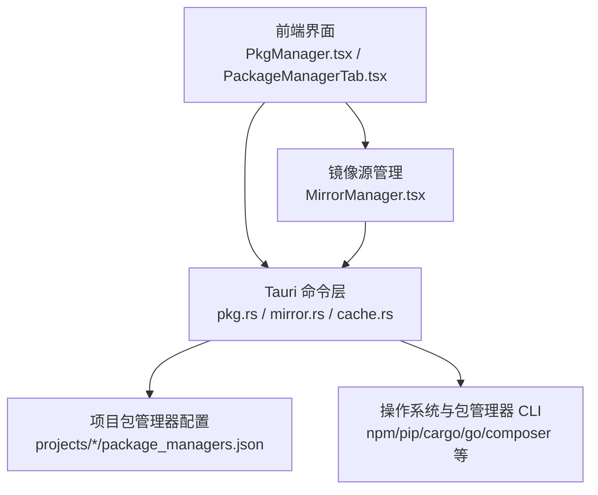
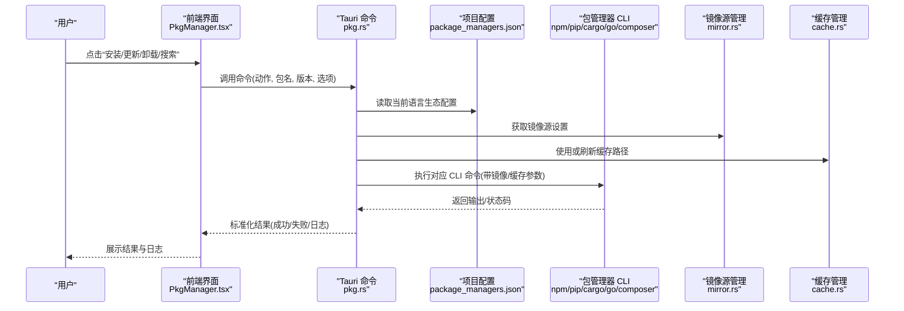
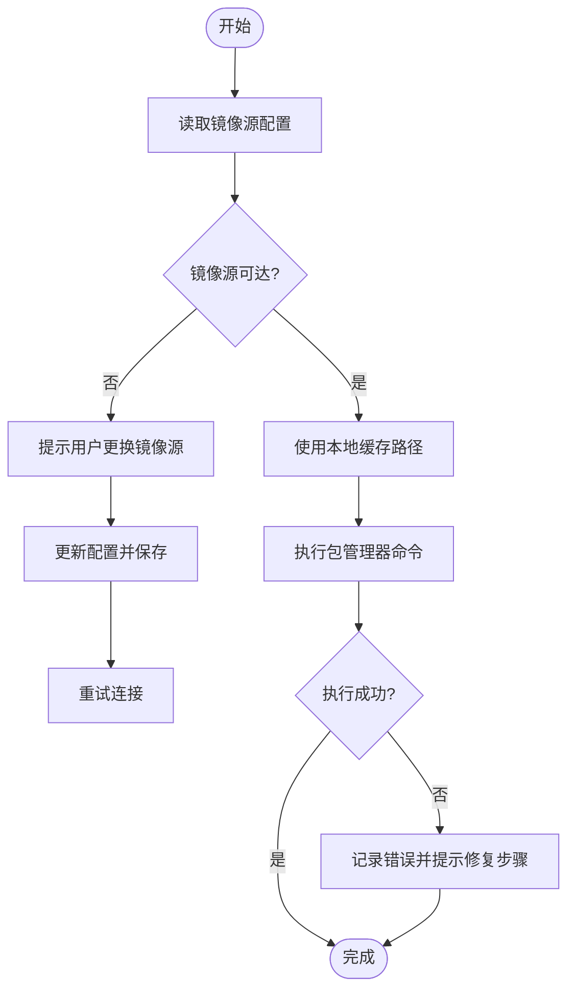
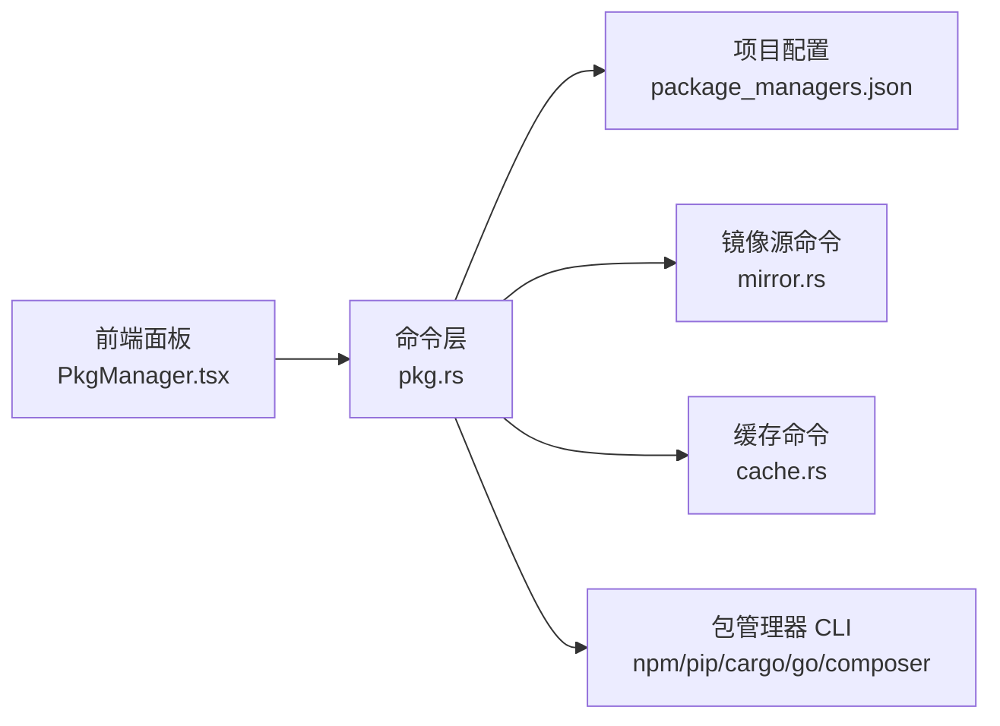

# 包管理器集成

<cite>
**本文引用的文件**   
- [src/components/PkgManager.tsx](file://src/components/PkgManager.tsx)
- [src/components/project/tabs/PackageManagerTab.tsx](file://src/components/project/tabs/PackageManagerTab.tsx)
- [src-tauri/src/commands/pkg.rs](file://src-tauri/src/commands/pkg.rs)
- [src-tauri/src/commands/mod.rs](file://src-tauri/src/commands/mod.rs)
- [src-tauri/src/lib.rs](file://src-tauri/src/lib.rs)
- [projects/nodejs/package_managers.json](file://projects/nodejs/package_managers.json)
- [projects/python/package_managers.json](file://projects/python/package_managers.json)
- [projects/go/package_managers.json](file://projects/go/package_managers.json)
- [projects/rust/package_managers.json](file://projects/rust/package_managers.json)
- [projects/bun/package_managers.json](file://projects/bun/package_managers.json)
- [projects/deno/package_managers.json](file://projects/deno/package_managers.json)
- [projects/maven/package_managers.json](file://projects/maven/package_managers.json)
- [projects/gradle/package_managers.json](file://projects/gradle/package_managers.json)
- [projects/dotnet/package_managers.json](file://projects/dotnet/package_managers.json)
- [projects/flutter/package_managers.json](file://projects/flutter/package_managers.json)
- [projects/vcpkg/package_managers.json](file://projects/vcpkg/package_managers.json)
- [src/components/MirrorManager.tsx](file://src/components/MirrorManager.tsx)
- [src-tauri/src/commands/mirror.rs](file://src-tauri/src/commands/mirror.rs)
- [src-tauri/src/commands/cache.rs](file://src-tauri/src/commands/cache.rs)
</cite>

## 目录
1. [简介](#简介)
2. [项目结构](#项目结构)
3. [核心组件](#核心组件)
4. [架构总览](#架构总览)
5. [详细组件分析](#详细组件分析)
6. [依赖关系分析](#依赖关系分析)
7. [性能考虑](#性能考虑)
8. [故障排除指南](#故障排除指南)
9. [结论](#结论)
10. [附录](#附录)

## 简介
本文件面向“包管理器集成”能力，系统性说明如何在项目中统一管理与调用 npm、pip、cargo、go mod、composer 等主流包管理器的安装、更新、卸载与依赖解析流程；解释配置文件结构与自定义选项；阐述缓存机制与镜像源配置；提供搜索、版本选择与批量操作的使用方式；并给出性能优化技巧与常见问题排查方法。文档同时结合前端界面与后端命令层，展示从用户交互到系统调用的完整链路。

## 项目结构
本项目采用前后端分离的桌面应用架构：
- 前端（React + Tauri）提供可视化界面，包含包管理器面板、镜像源管理、缓存管理等模块。
- 后端（Rust/Tauri）暴露命令接口，封装各语言生态的包管理器 CLI 调用，并提供统一的错误处理与结果返回。
- 项目级配置位于 projects/<language>/package_managers.json，用于声明该语言生态支持的包管理器及其行为。

图表来源
- [src/components/PkgManager.tsx](file://src/components/PkgManager.tsx)
- [src/components/project/tabs/PackageManagerTab.tsx](file://src/components/project/tabs/PackageManagerTab.tsx)
- [src-tauri/src/commands/pkg.rs](file://src-tauri/src/commands/pkg.rs)
- [src-tauri/src/commands/mirror.rs](file://src-tauri/src/commands/mirror.rs)
- [src-tauri/src/commands/cache.rs](file://src-tauri/src/commands/cache.rs)
- [projects/nodejs/package_managers.json](file://projects/nodejs/package_managers.json)
- [projects/python/package_managers.json](file://projects/python/package_managers.json)
- [projects/go/package_managers.json](file://projects/go/package_managers.json)
- [projects/rust/package_managers.json](file://projects/rust/package_managers.json)

章节来源
- [src/components/PkgManager.tsx](file://src/components/PkgManager.tsx)
- [src/components/project/tabs/PackageManagerTab.tsx](file://src/components/project/tabs/PackageManagerTab.tsx)
- [src-tauri/src/commands/pkg.rs](file://src-tauri/src/commands/pkg.rs)
- [src-tauri/src/commands/mirror.rs](file://src-tauri/src/commands/mirror.rs)
- [src-tauri/src/commands/cache.rs](file://src-tauri/src/commands/cache.rs)
- [projects/nodejs/package_managers.json](file://projects/nodejs/package_managers.json)
- [projects/python/package_managers.json](file://projects/python/package_managers.json)
- [projects/go/package_managers.json](file://projects/go/package_managers.json)
- [projects/rust/package_managers.json](file://projects/rust/package_managers.json)

## 核心组件
- 包管理器面板（前端）
  - 负责展示当前项目的包列表、状态、版本信息，并提供安装、更新、卸载、搜索、批量操作等交互入口。
  - 通过 Tauri 命令与后端通信，触发实际的包管理操作。
- 包管理命令（后端）
  - 封装对具体包管理器的调用，包括参数拼装、环境变量注入、工作目录控制、输出解析与错误映射。
  - 支持按项目配置动态选择包管理器与执行策略。
- 镜像源与缓存管理
  - 提供镜像源切换、缓存清理、缓存路径查看等功能，提升下载速度与稳定性。
- 项目级包管理器配置
  - 每个语言生态在 projects/<lang>/package_managers.json 中定义其支持的包管理器及默认行为，便于多工具共存与按需切换。

章节来源
- [src/components/PkgManager.tsx](file://src/components/PkgManager.tsx)
- [src/components/project/tabs/PackageManagerTab.tsx](file://src/components/project/tabs/PackageManagerTab.tsx)
- [src-tauri/src/commands/pkg.rs](file://src-tauri/src/commands/pkg.rs)
- [src/components/MirrorManager.tsx](file://src/components/MirrorManager.tsx)
- [src-tauri/src/commands/mirror.rs](file://src-tauri/src/commands/mirror.rs)
- [src-tauri/src/commands/cache.rs](file://src-tauri/src/commands/cache.rs)
- [projects/nodejs/package_managers.json](file://projects/nodejs/package_managers.json)
- [projects/python/package_managers.json](file://projects/python/package_managers.json)
- [projects/go/package_managers.json](file://projects/go/package_managers.json)
- [projects/rust/package_managers.json](file://projects/rust/package_managers.json)

## 架构总览
下图展示了从用户操作到包管理器执行的端到端流程，以及镜像源与缓存管理的参与点。

图表来源
- [src/components/PkgManager.tsx](file://src/components/PkgManager.tsx)
- [src-tauri/src/commands/pkg.rs](file://src-tauri/src/commands/pkg.rs)
- [src-tauri/src/commands/mirror.rs](file://src-tauri/src/commands/mirror.rs)
- [src-tauri/src/commands/cache.rs](file://src-tauri/src/commands/cache.rs)
- [projects/nodejs/package_managers.json](file://projects/nodejs/package_managers.json)
- [projects/python/package_managers.json](file://projects/python/package_managers.json)
- [projects/go/package_managers.json](file://projects/go/package_managers.json)
- [projects/rust/package_managers.json](file://projects/rust/package_managers.json)

## 详细组件分析

### 包管理器命令层（后端）
- 职责
  - 接收前端请求，解析动作类型（安装、更新、卸载、搜索、列出、锁定等）。
  - 根据当前项目语言生态加载 package_managers.json，确定目标包管理器与默认参数。
  - 注入镜像源与缓存相关的环境变量或命令行参数。
  - 执行外部进程，捕获标准输出与错误，转换为统一的结构化响应。
- 关键设计
  - 命令路由：将不同包管理器的差异抽象为统一接口，减少前端耦合。
  - 错误映射：将底层 CLI 的错误码与输出文本映射为用户可读的错误信息。
  - 并发控制：对批量操作进行串行或限流执行，避免资源争用。
- 扩展性
  - 新增包管理器时，仅需在命令层添加适配逻辑并在对应语言的 package_managers.json 中注册。

章节来源
- [src-tauri/src/commands/pkg.rs](file://src-tauri/src/commands/pkg.rs)
- [src-tauri/src/commands/mod.rs](file://src-tauri/src/commands/mod.rs)
- [src-tauri/src/lib.rs](file://src-tauri/src/lib.rs)

### 前端包管理器面板
- 职责
  - 渲染包列表、版本信息与状态。
  - 提供安装、更新、卸载、搜索、批量操作的交互入口。
  - 显示执行日志与错误提示，支持重试与回滚建议。
- 交互流程
  - 用户选择动作与目标包后，前端构造请求并调用 Tauri 命令。
  - 收到结果后更新 UI，必要时弹出确认对话框或引导用户修正配置。

章节来源
- [src/components/PkgManager.tsx](file://src/components/PkgManager.tsx)
- [src/components/project/tabs/PackageManagerTab.tsx](file://src/components/project/tabs/PackageManagerTab.tsx)

### 镜像源与缓存管理
- 镜像源管理
  - 提供全局或项目级的镜像源配置，如 npm registry、pip index-url、cargo registry、go proxy、composer repositories 等。
  - 支持快速切换与验证连通性。
- 缓存管理
  - 提供缓存路径查看、清理、预热等操作，降低重复下载成本。
  - 与命令层联动，在执行前确保缓存可用。

图表来源
- [src/components/MirrorManager.tsx](file://src/components/MirrorManager.tsx)
- [src-tauri/src/commands/mirror.rs](file://src-tauri/src/commands/mirror.rs)
- [src-tauri/src/commands/cache.rs](file://src-tauri/src/commands/cache.rs)

章节来源
- [src/components/MirrorManager.tsx](file://src/components/MirrorManager.tsx)
- [src-tauri/src/commands/mirror.rs](file://src-tauri/src/commands/mirror.rs)
- [src-tauri/src/commands/cache.rs](file://src-tauri/src/commands/cache.rs)

### 项目级包管理器配置（package_managers.json）
- 作用
  - 声明当前语言生态支持的包管理器集合与默认项。
  - 指定默认参数、环境变量、工作目录规则、锁文件位置等。
- 典型字段（概念性说明）
  - 包管理器标识（如 npm、pip、cargo、go、composer 等）。
  - 默认命令与参数模板。
  - 镜像源与环境变量覆盖。
  - 锁文件与缓存路径约定。
  - 是否启用并行下载、超时与重试策略。
- 多工具共存
  - 同一语言生态可配置多个包管理器（例如 Node.js 下 npm、pnpm、yarn），由项目或用户选择。

章节来源
- [projects/nodejs/package_managers.json](file://projects/nodejs/package_managers.json)
- [projects/python/package_managers.json](file://projects/python/package_managers.json)
- [projects/go/package_managers.json](file://projects/go/package_managers.json)
- [projects/rust/package_managers.json](file://projects/rust/package_managers.json)
- [projects/bun/package_managers.json](file://projects/bun/package_managers.json)
- [projects/deno/package_managers.json](file://projects/deno/package_managers.json)
- [projects/maven/package_managers.json](file://projects/maven/package_managers.json)
- [projects/gradle/package_managers.json](file://projects/gradle/package_managers.json)
- [projects/dotnet/package_managers.json](file://projects/dotnet/package_managers.json)
- [projects/flutter/package_managers.json](file://projects/flutter/package_managers.json)
- [projects/vcpkg/package_managers.json](file://projects/vcpkg/package_managers.json)

### 主流包管理器集成要点
- npm（Node.js）
  - 安装/更新/卸载：通过 npm install/update/uninstall 等子命令执行。
  - 依赖解析：基于 package-lock.json 或 pnpm-lock.yaml/yarn.lock 的锁定文件保证一致性。
  - 镜像源：registry 配置与 .npmrc 环境变量。
  - 缓存：node_modules 与 npm 缓存目录。
- pip（Python）
  - 安装/更新/卸载：pip install/--upgrade/uninstall。
  - 依赖解析：基于 requirements.txt 或 pyproject.toml 的约束。
  - 镜像源：index-url/trusted-host 配置。
  - 缓存：pip 缓存目录与虚拟环境隔离。
- cargo（Rust）
  - 安装/更新/卸载：cargo add/update/remove。
  - 依赖解析：Cargo.lock 锁定版本。
  - 镜像源：registries 与代理配置。
  - 缓存：~/.cargo/registry 与 target 目录。
- go mod（Go）
  - 安装/更新/卸载：go get/add/remove。
  - 依赖解析：go.sum 与 module 版本选择策略。
  - 镜像源：GOPROXY 与 GONOSUMCHECK。
  - 缓存：$GOPATH/pkg/mod 与 Go 构建缓存。
- composer（PHP）
  - 安装/更新/卸载：composer install/update/remove。
  - 依赖解析：composer.lock 锁定版本。
  - 镜像源：repositories 与 packagist 镜像。
  - 缓存：vendor 与 Composer 缓存目录。

章节来源
- [projects/nodejs/package_managers.json](file://projects/nodejs/package_managers.json)
- [projects/python/package_managers.json](file://projects/python/package_managers.json)
- [projects/rust/package_managers.json](file://projects/rust/package_managers.json)
- [projects/go/package_managers.json](file://projects/go/package_managers.json)
- [projects/maven/package_managers.json](file://projects/maven/package_managers.json)
- [projects/gradle/package_managers.json](file://projects/gradle/package_managers.json)
- [projects/dotnet/package_managers.json](file://projects/dotnet/package_managers.json)
- [projects/flutter/package_managers.json](file://projects/flutter/package_managers.json)
- [projects/vcpkg/package_managers.json](file://projects/vcpkg/package_managers.json)

### 包搜索、版本选择与批量操作
- 包搜索
  - 前端提供搜索框，调用后端命令查询包名与描述，支持模糊匹配与分页。
  - 搜索结果包含名称、版本范围、依赖数量与更新时间等元数据。
- 版本选择
  - 支持语义化版本过滤（>=、^、~、精确版本），并展示兼容性与冲突提示。
  - 锁定文件优先策略：若存在锁文件，默认遵循锁定版本，除非显式升级。
- 批量操作
  - 支持多选包的批量安装/更新/卸载，内部进行顺序执行与错误聚合。
  - 提供进度反馈与失败重试机制，避免部分成功导致的状态不一致。

章节来源
- [src/components/PkgManager.tsx](file://src/components/PkgManager.tsx)
- [src/components/project/tabs/PackageManagerTab.tsx](file://src/components/project/tabs/PackageManagerTab.tsx)
- [src-tauri/src/commands/pkg.rs](file://src-tauri/src/commands/pkg.rs)

## 依赖关系分析
- 组件耦合
  - 前端面板与命令层通过 Tauri 命令解耦，便于替换实现与单元测试。
  - 命令层与项目配置强关联，配置变更直接影响执行策略。
- 外部依赖
  - 各语言生态的包管理器 CLI 作为外部进程被调用，需确保 PATH 正确与权限充足。
- 潜在循环依赖
  - 命令层不直接依赖前端，镜像与缓存管理以独立命令形式暴露，避免循环引用。

图表来源
- [src/components/PkgManager.tsx](file://src/components/PkgManager.tsx)
- [src-tauri/src/commands/pkg.rs](file://src-tauri/src/commands/pkg.rs)
- [src-tauri/src/commands/mirror.rs](file://src-tauri/src/commands/mirror.rs)
- [src-tauri/src/commands/cache.rs](file://src-tauri/src/commands/cache.rs)
- [projects/nodejs/package_managers.json](file://projects/nodejs/package_managers.json)

章节来源
- [src/components/PkgManager.tsx](file://src/components/PkgManager.tsx)
- [src-tauri/src/commands/pkg.rs](file://src-tauri/src/commands/pkg.rs)
- [src-tauri/src/commands/mirror.rs](file://src-tauri/src/commands/mirror.rs)
- [src-tauri/src/commands/cache.rs](file://src-tauri/src/commands/cache.rs)
- [projects/nodejs/package_managers.json](file://projects/nodejs/package_managers.json)

## 性能考虑
- 并行与限流
  - 批量操作采用串行或有限并发执行，避免 I/O 争用与网络拥塞。
- 缓存预热
  - 首次安装后自动预热常用依赖，缩短后续构建时间。
- 镜像源就近选择
  - 根据地理位置或延迟探测选择最优镜像源，减少下载耗时。
- 增量更新
  - 利用锁文件与增量解析，仅拉取变更依赖，降低带宽与磁盘占用。
- 超时与重试
  - 为网络请求设置合理超时与指数退避重试，提高鲁棒性。

[本节为通用指导，无需特定文件来源]

## 故障排除指南
- 常见错误与定位
  - 权限不足：检查当前用户对缓存目录与项目目录的写入权限。
  - 网络异常：验证镜像源连通性，尝试切换备用镜像或关闭代理。
  - 版本冲突：查看依赖树与锁定文件，必要时降级或放宽版本约束。
  - 锁文件不一致：重新生成锁文件或强制同步依赖。
- 诊断步骤
  - 查看命令层日志与原始 CLI 输出，定位失败阶段。
  - 使用镜像源测试功能验证连通性与速度。
  - 清理缓存后重试，排除损坏缓存导致的异常。
- 恢复策略
  - 回滚到上一个稳定版本（基于锁文件或 Git 提交）。
  - 重置镜像源与缓存配置至默认值，逐步排查问题。

章节来源
- [src-tauri/src/commands/pkg.rs](file://src-tauri/src/commands/pkg.rs)
- [src-tauri/src/commands/mirror.rs](file://src-tauri/src/commands/mirror.rs)
- [src-tauri/src/commands/cache.rs](file://src-tauri/src/commands/cache.rs)

## 结论
通过统一的前端面板与后端命令层，本项目实现了对多种主流包管理器的集中化管理。借助项目级配置、镜像源与缓存机制，用户在安装、更新、卸载、搜索与批量操作中获得了稳定高效的体验。未来可在依赖冲突检测、自动化升级策略与更细粒度的并发控制方面持续优化。

[本节为总结性内容，无需特定文件来源]

## 附录
- 术语表
  - 镜像源：替代官方仓库的加速站点。
  - 锁文件：记录已解析依赖版本的清单文件。
  - 缓存：本地存储的依赖副本，用于加速重复安装。
- 参考配置示例路径
  - Node.js：projects/nodejs/package_managers.json
  - Python：projects/python/package_managers.json
  - Rust：projects/rust/package_managers.json
  - Go：projects/go/package_managers.json
  - PHP：projects/maven/package_managers.json（如需 PHP 生态，可参照此结构扩展）

[本节为补充信息，无需特定文件来源]