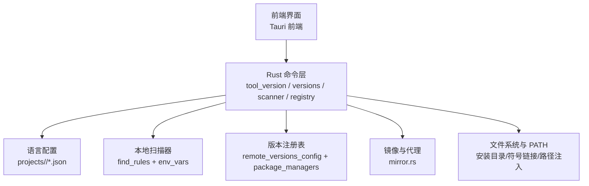
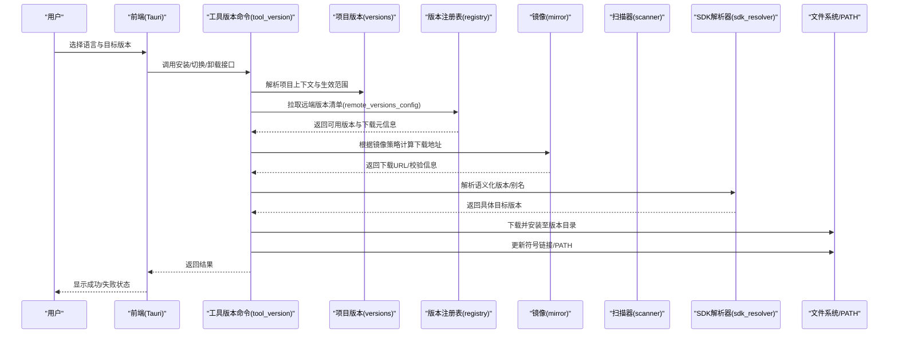
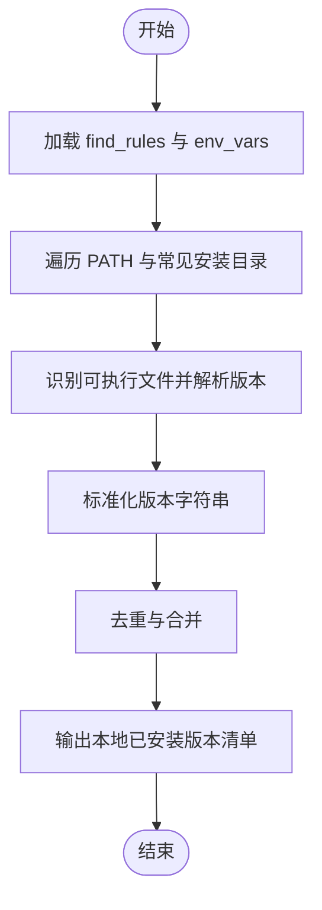
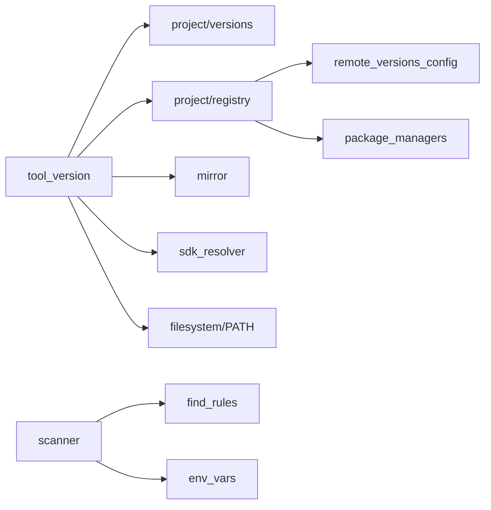

# 多语言版本管理

<cite>
**本文引用的文件**   
- [src-tauri/src/commands/tool_version.rs](file://src-tauri/src/commands/tool_version.rs)
- [src-tauri/src/commands/project/versions.rs](file://src-tauri/src/commands/project/versions.rs)
- [src-tauri/src/commands/project/scanner.rs](file://src-tauri/src/commands/project/scanner.rs)
- [src-tauri/src/commands/project/registry.rs](file://src-tauri/src/commands/project/registry.rs)
- [src-tauri/src/commands/sdk_resolver.rs](file://src-tauri/src/commands/sdk_resolver.rs)
- [src-tauri/src/commands/mirror.rs](file://src-tauri/src/commands/mirror.rs)
- [projects/nodejs/config.json](file://projects/nodejs/config.json)
- [projects/nodejs/env_vars.json](file://projects/nodejs/env_vars.json)
- [projects/nodejs/find_rules.json](file://projects/nodejs/find_rules.json)
- [projects/nodejs/package_managers.json](file://projects/nodejs/package_managers.json)
- [projects/nodejs/remote_versions_config.json](file://projects/nodejs/remote_versions_config.json)
- [projects/python/config.json](file://projects/python/config.json)
- [projects/python/env_vars.json](file://projects/python/env_vars.json)
- [projects/python/find_rules.json](file://projects/python/find_rules.json)
- [projects/python/package_managers.json](file://projects/python/package_managers.json)
- [projects/python/remote_versions_config.json](file://projects/python/remote_versions_config.json)
- [projects/go/config.json](file://projects/go/config.json)
- [projects/go/env_vars.json](file://projects/go/env_vars.json)
- [projects/go/find_rules.json](file://projects/go/find_rules.json)
- [projects/go/package_managers.json](file://projects/go/package_managers.json)
- [projects/go/remote_versions_config.json](file://projects/go/remote_versions_config.json)
- [projects/java/config.json](file://projects/java/config.json)
- [projects/java/env_vars.json](file://projects/java/env_vars.json)
- [projects/java/find_rules.json](file://projects/java/find_rules.json)
- [projects/java/remote_versions_config.json](file://projects/java/remote_versions_config.json)
- [projects/rust/config.json](file://projects/rust/config.json)
- [projects/rust/env_vars.json](file://projects/rust/env_vars.json)
- [projects/rust/find_rules.json](file://projects/rust/find_rules.json)
- [projects/rust/package_managers.json](file://projects/rust/package_managers.json)
- [projects/rust/remote_versions_config.json](file://projects/rust/remote_versions_config.json)
- [projects/deno/config.json](file://projects/deno/config.json)
- [projects/deno/env_vars.json](file://projects/deno/env_vars.json)
- [projects/deno/find_rules.json](file://projects/deno/find_rules.json)
- [projects/deno/package_managers.json](file://projects/deno/package_managers.json)
- [projects/deno/remote_versions_config.json](file://projects/deno/remote_versions_config.json)
- [projects/bun/config.json](file://projects/bun/config.json)
- [projects/bun/find_rules.json](file://projects/bun/find_rules.json)
- [projects/bun/package_managers.json](file://projects/bun/package_managers.json)
- [projects/bun/remote_versions_config.json](file://projects/bun/remote_versions_config.json)
</cite>

## 目录
1. [简介](#简介)
2. [项目结构](#项目结构)
3. [核心组件](#核心组件)
4. [架构总览](#架构总览)
5. [详细组件分析](#详细组件分析)
6. [依赖关系分析](#依赖关系分析)
7. [性能考虑](#性能考虑)
8. [故障排查指南](#故障排查指南)
9. [结论](#结论)
10. [附录](#附录)

## 简介
本文件面向“多语言版本管理”能力，聚焦 Node.js、Python、Go、Java、Rust、Deno、Bun 等语言的版本安装、切换与管理。文档从系统架构、数据流与处理逻辑出发，解释版本注册表（registry）的工作原理（发现、下载、安装、卸载），说明版本扫描器如何自动检测已安装版本，并给出各语言特定的配置项与环境变量设置、实际使用示例与最佳实践，以及常见冲突与依赖问题的解决方案。

## 项目结构
仓库采用“前端 Tauri + Rust 后端命令层 + 声明式项目配置”的分层组织方式：
- 前端通过 Tauri 暴露的 Rust 命令调用后端能力
- Rust 命令层负责解析配置、执行扫描、访问远程版本源、下载与安装、更新 PATH 等
- 每种语言在 projects/<lang>/ 下以 JSON 声明其版本来源、环境变量、查找规则、包管理器与镜像策略

图表来源
- [src-tauri/src/commands/tool_version.rs](file://src-tauri/src/commands/tool_version.rs)
- [src-tauri/src/commands/project/versions.rs](file://src-tauri/src/commands/project/versions.rs)
- [src-tauri/src/commands/project/scanner.rs](file://src-tauri/src/commands/project/scanner.rs)
- [src-tauri/src/commands/project/registry.rs](file://src-tauri/src/commands/project/registry.rs)
- [src-tauri/src/commands/mirror.rs](file://src-tauri/src/commands/mirror.rs)
- [projects/nodejs/config.json](file://projects/nodejs/config.json)
- [projects/python/config.json](file://projects/python/config.json)
- [projects/go/config.json](file://projects/go/config.json)
- [projects/java/config.json](file://projects/java/config.json)
- [projects/rust/config.json](file://projects/rust/config.json)
- [projects/deno/config.json](file://projects/deno/config.json)
- [projects/bun/config.json](file://projects/bun/config.json)

章节来源
- [src-tauri/src/commands/tool_version.rs](file://src-tauri/src/commands/tool_version.rs)
- [src-tauri/src/commands/project/versions.rs](file://src-tauri/src/commands/project/versions.rs)
- [src-tauri/src/commands/project/scanner.rs](file://src-tauri/src/commands/project/scanner.rs)
- [src-tauri/src/commands/project/registry.rs](file://src-tauri/src/commands/project/registry.rs)
- [src-tauri/src/commands/mirror.rs](file://src-tauri/src/commands/mirror.rs)
- [projects/nodejs/config.json](file://projects/nodejs/config.json)
- [projects/python/config.json](file://projects/python/config.json)
- [projects/go/config.json](file://projects/go/config.json)
- [projects/java/config.json](file://projects/java/config.json)
- [projects/rust/config.json](file://projects/rust/config.json)
- [projects/deno/config.json](file://projects/deno/config.json)
- [projects/bun/config.json](file://projects/bun/config.json)

## 核心组件
- 工具版本命令接口：对外暴露列出、安装、切换、卸载等操作入口
- 项目版本编排：按项目维度聚合语言、版本选择与生效范围
- 本地扫描器：基于 find_rules 与 env_vars 自动发现已安装版本
- 版本注册表：读取 remote_versions_config 与 package_managers 获取远端版本清单与下载元信息
- SDK 解析器：将语义化版本或别名解析为具体可安装目标
- 镜像与代理：统一控制下载源与网络优化
- 环境注入：安装后更新 PATH 或创建符号链接，使切换生效

章节来源
- [src-tauri/src/commands/tool_version.rs](file://src-tauri/src/commands/tool_version.rs)
- [src-tauri/src/commands/project/versions.rs](file://src-tauri/src/commands/project/versions.rs)
- [src-tauri/src/commands/project/scanner.rs](file://src-tauri/src/commands/project/scanner.rs)
- [src-tauri/src/commands/project/registry.rs](file://src-tauri/src/commands/project/registry.rs)
- [src-tauri/src/commands/sdk_resolver.rs](file://src-tauri/src/commands/sdk_resolver.rs)
- [src-tauri/src/commands/mirror.rs](file://src-tauri/src/commands/mirror.rs)

## 架构总览
下图展示了从用户操作到最终生效的端到端流程，涵盖注册表查询、下载、安装、切换与环境生效。

图表来源
- [src-tauri/src/commands/tool_version.rs](file://src-tauri/src/commands/tool_version.rs)
- [src-tauri/src/commands/project/versions.rs](file://src-tauri/src/commands/project/versions.rs)
- [src-tauri/src/commands/project/registry.rs](file://src-tauri/src/commands/project/registry.rs)
- [src-tauri/src/commands/mirror.rs](file://src-tauri/src/commands/mirror.rs)
- [src-tauri/src/commands/sdk_resolver.rs](file://src-tauri/src/commands/sdk_resolver.rs)

## 详细组件分析

### 工具版本命令层（tool_version）
- 职责
  - 提供统一的 CLI/Tauri 命令入口，封装安装、切换、卸载、列表等动作
  - 协调项目版本、注册表、镜像、SDK 解析与文件系统操作
- 关键流程
  - 输入参数校验（语言、版本表达式、作用域）
  - 调用注册表获取版本清单
  - 结合镜像策略生成下载 URL
  - 调用 SDK 解析器进行版本归一化
  - 执行下载、解压、安装、建立符号链接或写入 PATH
  - 返回结构化结果与错误码
- 错误处理
  - 网络异常重试与回退镜像
  - 校验失败时清理临时文件
  - 权限不足时提示管理员运行

章节来源
- [src-tauri/src/commands/tool_version.rs](file://src-tauri/src/commands/tool_version.rs)

### 项目版本编排（project/versions）
- 职责
  - 维护项目级语言版本绑定（如 .any-version 或项目根配置）
  - 决定版本生效范围（全局/会话/项目）
- 关键流程
  - 读取项目配置中的语言-版本映射
  - 合并环境变量与命令行覆盖
  - 输出当前生效版本集供其他模块消费

章节来源
- [src-tauri/src/commands/project/versions.rs](file://src-tauri/src/commands/project/versions.rs)

### 本地版本扫描器（project/scanner）
- 职责
  - 基于 find_rules 与 env_vars 自动发现系统中已安装版本
- 关键流程
  - 遍历常见安装位置与 PATH 中可执行文件
  - 解析二进制版本号（如 node -v、python --version）
  - 去重与标准化（主版本/次版本/补丁）
  - 输出本地已安装版本清单
- 扩展点
  - 新增语言只需补充 find_rules 与 env_vars 即可接入

章节来源
- [src-tauri/src/commands/project/scanner.rs](file://src-tauri/src/commands/project/scanner.rs)

### 版本注册表（project/registry）
- 职责
  - 集中管理远端版本清单与下载元信息
- 关键流程
  - 加载 remote_versions_config 定义的数据源地址与格式
  - 按需拉取版本列表（支持缓存与增量更新）
  - 解析 package_managers 提供的包管理器特定字段（如 npm/pip/go mod 兼容信息）
  - 返回过滤后的可用版本集合
- 安全与一致性
  - 校验签名/哈希（若提供）
  - 版本排序与稳定性标记（stable/beta/nightly）

章节来源
- [src-tauri/src/commands/project/registry.rs](file://src-tauri/src/commands/project/registry.rs)

### SDK 解析器（sdk_resolver）
- 职责
  - 将用户输入的语义化版本或别名（如 lts、latest、>=x.y）解析为具体版本
- 关键流程
  - 匹配稳定版优先策略
  - 处理预发布与分支别名
  - 与注册表返回的版本集合做交集
- 输出
  - 规范化后的目标版本字符串

章节来源
- [src-tauri/src/commands/sdk_resolver.rs](file://src-tauri/src/commands/sdk_resolver.rs)

### 镜像与代理（mirror）
- 职责
  - 统一管理下载源、镜像地址、超时与并发
- 关键流程
  - 根据语言与平台选择镜像
  - 拼接下载 URL 与校验信息
  - 失败时自动切换备用镜像
- 配置
  - 可通过全局镜像配置覆盖默认源

章节来源
- [src-tauri/src/commands/mirror.rs](file://src-tauri/src/commands/mirror.rs)

### 语言配置模型（projects/<lang>/*.json）
- config.json
  - 语言基础信息与安装目录模板、平台适配开关
- env_vars.json
  - 运行时环境变量（如 JAVA_HOME、GOROOT、RUSTUP_HOME、NODE_PATH 等）
- find_rules.json
  - 本地版本发现规则（搜索路径、正则匹配、命令探测）
- package_managers.json
  - 包管理器相关能力（是否支持虚拟环境、插件隔离等）
- remote_versions_config.json
  - 远端版本清单来源、分页与缓存策略

章节来源
- [projects/nodejs/config.json](file://projects/nodejs/config.json)
- [projects/nodejs/env_vars.json](file://projects/nodejs/env_vars.json)
- [projects/nodejs/find_rules.json](file://projects/nodejs/find_rules.json)
- [projects/nodejs/package_managers.json](file://projects/nodejs/package_managers.json)
- [projects/nodejs/remote_versions_config.json](file://projects/nodejs/remote_versions_config.json)
- [projects/python/config.json](file://projects/python/config.json)
- [projects/python/env_vars.json](file://projects/python/env_vars.json)
- [projects/python/find_rules.json](file://projects/python/find_rules.json)
- [projects/python/package_managers.json](file://projects/python/package_managers.json)
- [projects/python/remote_versions_config.json](file://projects/python/remote_versions_config.json)
- [projects/go/config.json](file://projects/go/config.json)
- [projects/go/env_vars.json](file://projects/go/env_vars.json)
- [projects/go/find_rules.json](file://projects/go/find_rules.json)
- [projects/go/package_managers.json](file://projects/go/package_managers.json)
- [projects/go/remote_versions_config.json](file://projects/go/remote_versions_config.json)
- [projects/java/config.json](file://projects/java/config.json)
- [projects/java/env_vars.json](file://projects/java/env_vars.json)
- [projects/java/find_rules.json](file://projects/java/find_rules.json)
- [projects/java/remote_versions_config.json](file://projects/java/remote_versions_config.json)
- [projects/rust/config.json](file://projects/rust/config.json)
- [projects/rust/env_vars.json](file://projects/rust/env_vars.json)
- [projects/rust/find_rules.json](file://projects/rust/find_rules.json)
- [projects/rust/package_managers.json](file://projects/rust/package_managers.json)
- [projects/rust/remote_versions_config.json](file://projects/rust/remote_versions_config.json)
- [projects/deno/config.json](file://projects/deno/config.json)
- [projects/deno/env_vars.json](file://projects/deno/env_vars.json)
- [projects/deno/find_rules.json](file://projects/deno/find_rules.json)
- [projects/deno/package_managers.json](file://projects/deno/package_managers.json)
- [projects/deno/remote_versions_config.json](file://projects/deno/remote_versions_config.json)
- [projects/bun/config.json](file://projects/bun/config.json)
- [projects/bun/find_rules.json](file://projects/bun/find_rules.json)
- [projects/bun/package_managers.json](file://projects/bun/package_managers.json)
- [projects/bun/remote_versions_config.json](file://projects/bun/remote_versions_config.json)

### 语言特定实现要点与示例

#### Node.js
- 版本来源
  - 通过 remote_versions_config 指向官方或镜像站点
- 安装与切换
  - 下载对应平台的二进制包，解压至版本目录，更新符号链接或 PATH
- 常用环境变量
  - NODE_PATH、NPM_CONFIG_PREFIX、npm 镜像等
- 示例流程
  - 安装指定版本 -> 切换为当前项目默认 -> 验证 node -v

章节来源
- [projects/nodejs/remote_versions_config.json](file://projects/nodejs/remote_versions_config.json)
- [projects/nodejs/env_vars.json](file://projects/nodejs/env_vars.json)
- [projects/nodejs/find_rules.json](file://projects/nodejs/find_rules.json)

#### Python
- 版本来源
  - 官方构建或第三方构建（如 pyenv 风格）
- 安装与切换
  - 支持虚拟环境；切换后可自动激活 venv
- 常用环境变量
  - PYTHONDONTWRITEBYTECODE、PYTHONPATH、pip 镜像
- 示例流程
  - 安装 3.x -> 创建并切换到项目 venv -> 验证 python --version

章节来源
- [projects/python/remote_versions_config.json](file://projects/python/remote_versions_config.json)
- [projects/python/env_vars.json](file://projects/python/env_vars.json)
- [projects/python/find_rules.json](file://projects/python/find_rules.json)

#### Go
- 版本来源
  - 官方 tar.gz 包或 go 官方镜像
- 安装与切换
  - 解压至版本目录，更新 GOROOT 与 PATH
- 常用环境变量
  - GOPATH、GOMODCACHE、GOPROXY
- 示例流程
  - 安装 1.x -> 切换 -> 验证 go version

章节来源
- [projects/go/remote_versions_config.json](file://projects/go/remote_versions_config.json)
- [projects/go/env_vars.json](file://projects/go/env_vars.json)
- [projects/go/find_rules.json](file://projects/go/find_rules.json)

#### Java
- 版本来源
  - JDK 发行版（OpenJDK/Oracle 等）
- 安装与切换
  - 解压至版本目录，设置 JAVA_HOME，更新 PATH
- 常用环境变量
  - JAVA_HOME、JAVA_OPTS、MAVEN_OPTS
- 示例流程
  - 安装 JDK 17 -> 切换 -> 验证 java -version

章节来源
- [projects/java/remote_versions_config.json](file://projects/java/remote_versions_config.json)
- [projects/java/env_vars.json](file://projects/java/env_vars.json)
- [projects/java/find_rules.json](file://projects/java/find_rules.json)

#### Rust
- 版本来源
  - rustup 分发或官方构建
- 安装与切换
  - 通过 rustup 或等效机制切换 toolchain
- 常用环境变量
  - RUSTUP_HOME、CARGO_HOME、RUSTFLAGS
- 示例流程
  - 安装 stable/nightly -> 切换 -> 验证 rustc --version

章节来源
- [projects/rust/remote_versions_config.json](file://projects/rust/remote_versions_config.json)
- [projects/rust/env_vars.json](file://projects/rust/env_vars.json)
- [projects/rust/find_rules.json](file://projects/rust/find_rules.json)

#### Deno
- 版本来源
  - 官方发布或镜像
- 安装与切换
  - 下载二进制并更新 PATH
- 常用环境变量
  - DENO_INSTALL_ROOT、DENO_DIR
- 示例流程
  - 安装最新稳定版 -> 切换 -> 验证 deno --version

章节来源
- [projects/deno/remote_versions_config.json](file://projects/deno/remote_versions_config.json)
- [projects/deno/env_vars.json](file://projects/deno/env_vars.json)
- [projects/deno/find_rules.json](file://projects/deno/find_rules.json)

#### Bun
- 版本来源
  - 官方发布或镜像
- 安装与切换
  - 下载二进制并更新 PATH
- 常用环境变量
  - BUN_INSTALL
- 示例流程
  - 安装最新稳定版 -> 切换 -> 验证 bun --version

章节来源
- [projects/bun/remote_versions_config.json](file://projects/bun/remote_versions_config.json)
- [projects/bun/find_rules.json](file://projects/bun/find_rules.json)

### 版本扫描算法流程图

图表来源
- [src-tauri/src/commands/project/scanner.rs](file://src-tauri/src/commands/project/scanner.rs)
- [projects/nodejs/find_rules.json](file://projects/nodejs/find_rules.json)
- [projects/python/find_rules.json](file://projects/python/find_rules.json)
- [projects/go/find_rules.json](file://projects/go/find_rules.json)
- [projects/java/find_rules.json](file://projects/java/find_rules.json)
- [projects/rust/find_rules.json](file://projects/rust/find_rules.json)
- [projects/deno/find_rules.json](file://projects/deno/find_rules.json)
- [projects/bun/find_rules.json](file://projects/bun/find_rules.json)

## 依赖关系分析
- 组件耦合
  - tool_version 强依赖 project/versions、registry、mirror、sdk_resolver
  - scanner 依赖 find_rules 与 env_vars 配置
  - registry 依赖 remote_versions_config 与 package_managers
- 外部依赖
  - 网络请求（版本清单与二进制下载）
  - 文件系统（解压、符号链接、PATH 注入）
  - 操作系统差异（Windows/Unix 路径与权限）

图表来源
- [src-tauri/src/commands/tool_version.rs](file://src-tauri/src/commands/tool_version.rs)
- [src-tauri/src/commands/project/versions.rs](file://src-tauri/src/commands/project/versions.rs)
- [src-tauri/src/commands/project/registry.rs](file://src-tauri/src/commands/project/registry.rs)
- [src-tauri/src/commands/mirror.rs](file://src-tauri/src/commands/mirror.rs)
- [src-tauri/src/commands/sdk_resolver.rs](file://src-tauri/src/commands/sdk_resolver.rs)
- [src-tauri/src/commands/project/scanner.rs](file://src-tauri/src/commands/project/scanner.rs)

章节来源
- [src-tauri/src/commands/tool_version.rs](file://src-tauri/src/commands/tool_version.rs)
- [src-tauri/src/commands/project/versions.rs](file://src-tauri/src/commands/project/versions.rs)
- [src-tauri/src/commands/project/registry.rs](file://src-tauri/src/commands/project/registry.rs)
- [src-tauri/src/commands/mirror.rs](file://src-tauri/src/commands/mirror.rs)
- [src-tauri/src/commands/sdk_resolver.rs](file://src-tauri/src/commands/sdk_resolver.rs)
- [src-tauri/src/commands/project/scanner.rs](file://src-tauri/src/commands/project/scanner.rs)

## 性能考虑
- 版本清单缓存
  - 对 remote_versions_config 的结果进行本地缓存，减少重复网络请求
- 并行下载与校验
  - 对大体积二进制启用分块下载与并发校验
- 增量更新
  - 仅拉取变更版本，避免全量刷新
- 扫描优化
  - 对 PATH 与常见目录进行索引，避免重复扫描
- 资源释放
  - 下载完成后及时清理临时文件，避免磁盘占用

[本节为通用指导，不直接分析具体文件]

## 故障排查指南
- 无法连接远端版本源
  - 检查镜像配置与代理设置
  - 确认防火墙与证书信任链
- 下载失败或校验不通过
  - 更换镜像或重试
  - 检查磁盘空间与权限
- 切换后未生效
  - 确认 PATH 更新是否在当前 shell 生效
  - 重启终端或重新加载环境变量
- 版本冲突
  - 使用项目级绑定隔离不同项目的语言版本
  - 清理残留符号链接或旧版本目录
- 权限问题
  - 在需要提升权限的系统上以管理员运行

章节来源
- [src-tauri/src/commands/mirror.rs](file://src-tauri/src/commands/mirror.rs)
- [src-tauri/src/commands/tool_version.rs](file://src-tauri/src/commands/tool_version.rs)

## 结论
本方案通过“声明式配置 + 统一命令层 + 模块化组件”的方式，实现了跨语言的多版本管理能力。借助注册表、镜像与扫描器，系统能够可靠地发现、下载、安装与切换版本，并通过项目级绑定解决常见的版本冲突与依赖问题。建议在生产环境中启用缓存与镜像，并结合 CI/CD 固定版本，确保一致性与可复现性。

[本节为总结，不直接分析具体文件]

## 附录

### 快速上手示例（概念流程）
- 安装 Node.js 指定版本
  - 选择语言与版本 -> 触发安装 -> 等待完成 -> 验证 node -v
- 切换 Python 版本并激活虚拟环境
  - 选择 Python 版本 -> 安装/切换 -> 自动激活 venv -> 验证 python --version
- 切换 Go 版本
  - 选择 Go 版本 -> 安装/切换 -> 验证 go version
- 切换 Java 版本
  - 选择 JDK 版本 -> 安装/切换 -> 验证 java -version
- 切换 Rust 版本
  - 选择 toolchain -> 安装/切换 -> 验证 rustc --version
- 切换 Deno/Bun 版本
  - 选择版本 -> 安装/切换 -> 验证对应 --version

[本节为概念性示例，不直接分析具体文件]