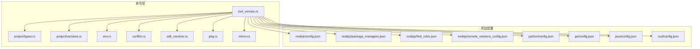
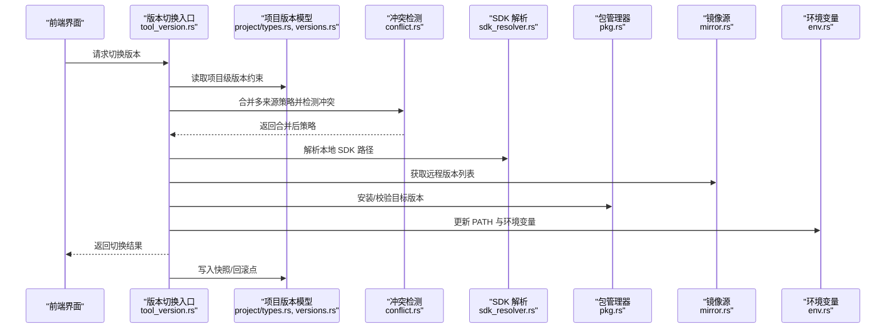
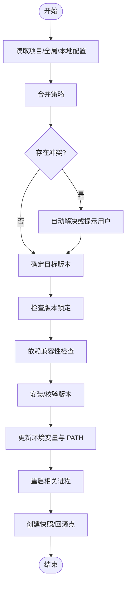
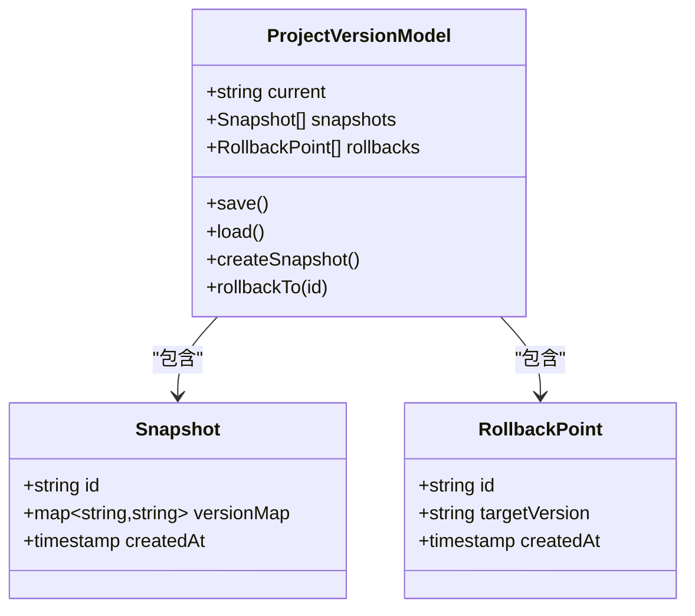
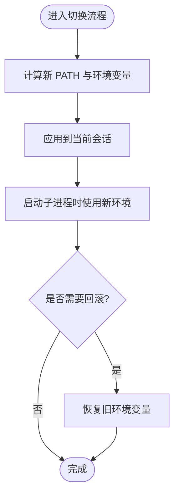
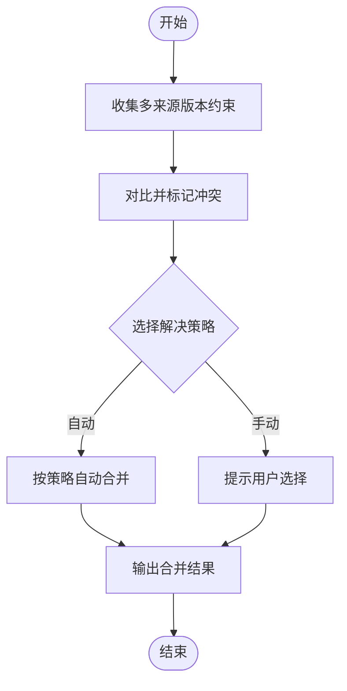
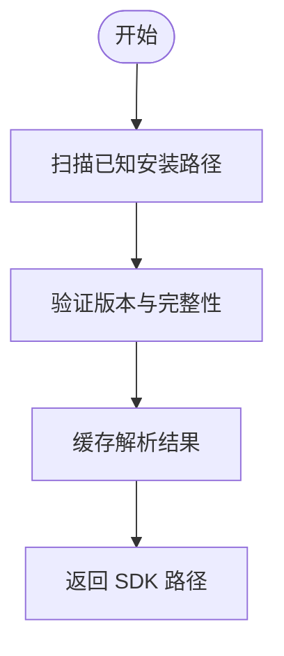
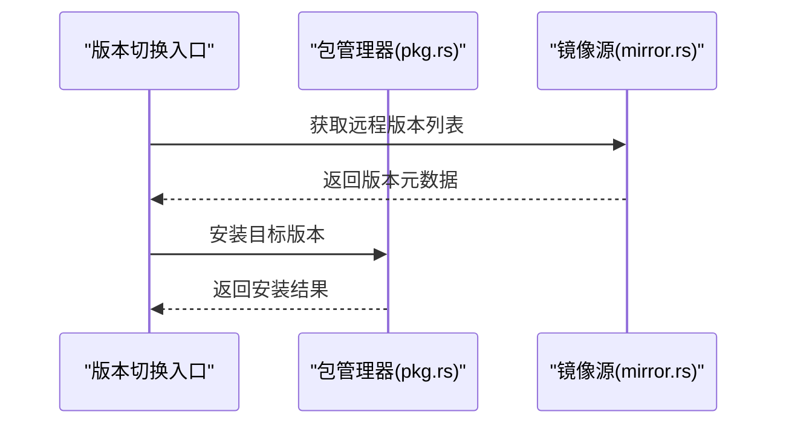
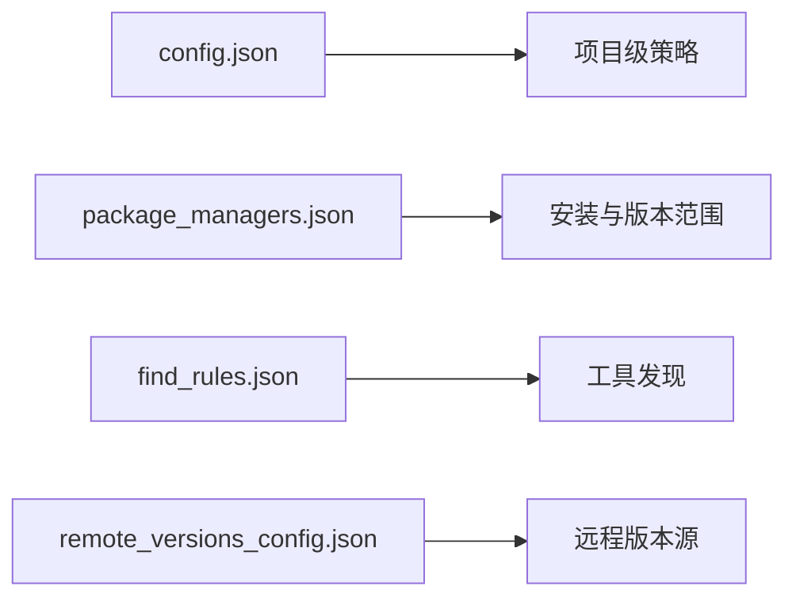
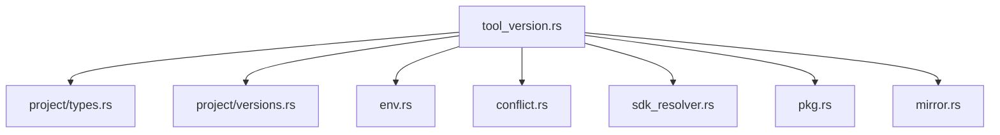

# 版本切换策略

<cite>
**本文引用的文件**   
- [src-tauri/src/commands/tool_version.rs](file://src-tauri/src/commands/tool_version.rs)
- [src-tauri/src/commands/project/types.rs](file://src-tauri/src/commands/project/types.rs)
- [src-tauri/src/commands/project/versions.rs](file://src-tauri/src/commands/project/versions.rs)
- [src-tauri/src/commands/env.rs](file://src-tauri/src/commands/env.rs)
- [src-tauri/src/commands/conflict.rs](file://src-tauri/src/commands/conflict.rs)
- [src-tauri/src/commands/sdk_resolver.rs](file://src-tauri/src/commands/sdk_resolver.rs)
- [src-tauri/src/commands/pkg.rs](file://src-tauri/src/commands/pkg.rs)
- [src-tauri/src/commands/mirror.rs](file://src-tauri/src/commands/mirror.rs)
- [projects/nodejs/config.json](file://projects/nodejs/config.json)
- [projects/nodejs/package_managers.json](file://projects/nodejs/package_managers.json)
- [projects/nodejs/find_rules.json](file://projects/nodejs/find_rules.json)
- [projects/nodejs/remote_versions_config.json](file://projects/nodejs/remote_versions_config.json)
- [projects/python/config.json](file://projects/python/config.json)
- [projects/go/config.json](file://projects/go/config.json)
- [projects/java/config.json](file://projects/java/config.json)
- [projects/rust/config.json](file://projects/rust/config.json)
</cite>

## 目录
1. [简介](#简介)
2. [项目结构](#项目结构)
3. [核心组件](#核心组件)
4. [架构总览](#架构总览)
5. [详细组件分析](#详细组件分析)
6. [依赖关系分析](#依赖关系分析)
7. [性能考虑](#性能考虑)
8. [故障排查指南](#故障排查指南)
9. [结论](#结论)
10. [附录](#附录)

## 简介
本文件围绕“版本切换策略”能力，系统化说明项目级、全局级与本地级的优先级规则、版本锁定机制、依赖兼容性检查、环境变量更新与进程重启逻辑、回滚与快照、冲突检测与自动解决策略、CI/CD 集成方式、最佳实践与性能优化建议，以及常见问题处理。文档面向不同技术背景的读者，既提供高层概览，也给出代码级映射与可视化图示。

## 项目结构
与版本切换相关的核心实现位于 Rust 后端命令层（Tauri commands），并配合各语言项目的配置与规则文件：
- 命令层
  - tool_version.rs：版本选择、解析、切换流程入口
  - project/types.rs、project/versions.rs：项目维度版本模型与操作
  - env.rs：环境变量注入与 PATH 管理
  - conflict.rs：冲突检测与自动解决
  - sdk_resolver.rs：SDK 路径解析与发现
  - pkg.rs：包管理器调用（安装/查询）
  - mirror.rs：镜像源与远程版本列表
- 项目配置与规则
  - projects/<lang>/config.json：项目级版本策略与开关
  - projects/<lang>/package_managers.json：包管理器及版本范围
  - projects/<lang>/find_rules.json：工具发现规则
  - projects/<lang>/remote_versions_config.json：远程版本来源配置

图表来源
- [src-tauri/src/commands/tool_version.rs](file://src-tauri/src/commands/tool_version.rs)
- [src-tauri/src/commands/project/types.rs](file://src-tauri/src/commands/project/types.rs)
- [src-tauri/src/commands/project/versions.rs](file://src-tauri/src/commands/project/versions.rs)
- [src-tauri/src/commands/env.rs](file://src-tauri/src/commands/env.rs)
- [src-tauri/src/commands/conflict.rs](file://src-tauri/src/commands/conflict.rs)
- [src-tauri/src/commands/sdk_resolver.rs](file://src-tauri/src/commands/sdk_resolver.rs)
- [src-tauri/src/commands/pkg.rs](file://src-tauri/src/commands/pkg.rs)
- [src-tauri/src/commands/mirror.rs](file://src-tauri/src/commands/mirror.rs)
- [projects/nodejs/config.json](file://projects/nodejs/config.json)
- [projects/nodejs/package_managers.json](file://projects/nodejs/package_managers.json)
- [projects/nodejs/find_rules.json](file://projects/nodejs/find_rules.json)
- [projects/nodejs/remote_versions_config.json](file://projects/nodejs/remote_versions_config.json)
- [projects/python/config.json](file://projects/python/config.json)
- [projects/go/config.json](file://projects/go/config.json)
- [projects/java/config.json](file://projects/java/config.json)
- [projects/rust/config.json](file://projects/rust/config.json)

章节来源
- [src-tauri/src/commands/tool_version.rs](file://src-tauri/src/commands/tool_version.rs)
- [src-tauri/src/commands/project/types.rs](file://src-tauri/src/commands/project/types.rs)
- [src-tauri/src/commands/project/versions.rs](file://src-tauri/src/commands/project/versions.rs)
- [src-tauri/src/commands/env.rs](file://src-tauri/src/commands/env.rs)
- [src-tauri/src/commands/conflict.rs](file://src-tauri/src/commands/conflict.rs)
- [src-tauri/src/commands/sdk_resolver.rs](file://src-tauri/src/commands/sdk_resolver.rs)
- [src-tauri/src/commands/pkg.rs](file://src-tauri/src/commands/pkg.rs)
- [src-tauri/src/commands/mirror.rs](file://src-tauri/src/commands/mirror.rs)
- [projects/nodejs/config.json](file://projects/nodejs/config.json)
- [projects/nodejs/package_managers.json](file://projects/nodejs/package_managers.json)
- [projects/nodejs/find_rules.json](file://projects/nodejs/find_rules.json)
- [projects/nodejs/remote_versions_config.json](file://projects/nodejs/remote_versions_config.json)
- [projects/python/config.json](file://projects/python/config.json)
- [projects/go/config.json](file://projects/go/config.json)
- [projects/java/config.json](file://projects/java/config.json)
- [projects/rust/config.json](file://projects/rust/config.json)

## 核心组件
- 版本选择与切换入口
  - 负责读取多来源配置、计算目标版本、执行安装/校验、更新环境与重启子进程。
- 项目级版本模型与操作
  - 定义项目维度的版本约束、快照与回滚数据结构，并提供持久化读写。
- 环境变量与 PATH 管理
  - 在切换前后注入/恢复环境变量，确保子进程使用正确 SDK 路径。
- 冲突检测与自动解决
  - 识别多来源版本冲突，按策略合并或提示用户确认。
- SDK 解析与发现
  - 根据平台与工具链规则定位已安装 SDK，避免重复下载。
- 包管理器与镜像源
  - 通过包管理器安装指定版本；从镜像源拉取远程版本列表与制品。

章节来源
- [src-tauri/src/commands/tool_version.rs](file://src-tauri/src/commands/tool_version.rs)
- [src-tauri/src/commands/project/types.rs](file://src-tauri/src/commands/project/types.rs)
- [src-tauri/src/commands/project/versions.rs](file://src-tauri/src/commands/project/versions.rs)
- [src-tauri/src/commands/env.rs](file://src-tauri/src/commands/env.rs)
- [src-tauri/src/commands/conflict.rs](file://src-tauri/src/commands/conflict.rs)
- [src-tauri/src/commands/sdk_resolver.rs](file://src-tauri/src/commands/sdk_resolver.rs)
- [src-tauri/src/commands/pkg.rs](file://src-tauri/src/commands/pkg.rs)
- [src-tauri/src/commands/mirror.rs](file://src-tauri/src/commands/mirror.rs)

## 架构总览
版本切换的整体流程如下：
- 输入来源：项目级配置、全局级策略、本地级覆盖（如工作区或会话）。
- 解析阶段：合并多来源策略，进行冲突检测与自动解决。
- 决策阶段：依据锁定与兼容性规则确定最终版本。
- 执行阶段：按需安装/校验、更新环境变量、重启相关进程。
- 结果持久化：记录快照、回滚点与变更日志。

图表来源
- [src-tauri/src/commands/tool_version.rs](file://src-tauri/src/commands/tool_version.rs)
- [src-tauri/src/commands/project/types.rs](file://src-tauri/src/commands/project/types.rs)
- [src-tauri/src/commands/project/versions.rs](file://src-tauri/src/commands/project/versions.rs)
- [src-tauri/src/commands/conflict.rs](file://src-tauri/src/commands/conflict.rs)
- [src-tauri/src/commands/sdk_resolver.rs](file://src-tauri/src/commands/sdk_resolver.rs)
- [src-tauri/src/commands/pkg.rs](file://src-tauri/src/commands/pkg.rs)
- [src-tauri/src/commands/mirror.rs](file://src-tauri/src/commands/mirror.rs)
- [src-tauri/src/commands/env.rs](file://src-tauri/src/commands/env.rs)

## 详细组件分析

### 版本选择与切换入口（tool_version.rs）
- 职责
  - 聚合项目级、全局级与本地级策略，驱动完整切换流程。
  - 协调 SDK 解析、镜像源查询、包管理器安装、环境更新与进程重启。
- 关键行为
  - 读取并合并多来源配置，触发冲突检测。
  - 基于锁定与兼容性规则确定目标版本。
  - 执行安装/校验，更新环境变量，重启受影响的子进程。
  - 生成快照与回滚点，记录变更日志。

图表来源
- [src-tauri/src/commands/tool_version.rs](file://src-tauri/src/commands/tool_version.rs)
- [src-tauri/src/commands/conflict.rs](file://src-tauri/src/commands/conflict.rs)
- [src-tauri/src/commands/sdk_resolver.rs](file://src-tauri/src/commands/sdk_resolver.rs)
- [src-tauri/src/commands/pkg.rs](file://src-tauri/src/commands/pkg.rs)
- [src-tauri/src/commands/mirror.rs](file://src-tauri/src/commands/mirror.rs)
- [src-tauri/src/commands/env.rs](file://src-tauri/src/commands/env.rs)

章节来源
- [src-tauri/src/commands/tool_version.rs](file://src-tauri/src/commands/tool_version.rs)

### 项目级版本模型与操作（project/types.rs, project/versions.rs）
- 职责
  - 定义项目维度的版本约束、快照与回滚数据结构。
  - 提供持久化读写接口，支持版本锁定与变更记录。
- 关键行为
  - 维护当前生效版本、历史快照与回滚点。
  - 在项目根目录或约定位置存储版本状态。

图表来源
- [src-tauri/src/commands/project/types.rs](file://src-tauri/src/commands/project/types.rs)
- [src-tauri/src/commands/project/versions.rs](file://src-tauri/src/commands/project/versions.rs)

章节来源
- [src-tauri/src/commands/project/types.rs](file://src-tauri/src/commands/project/types.rs)
- [src-tauri/src/commands/project/versions.rs](file://src-tauri/src/commands/project/versions.rs)

### 环境变量与 PATH 管理（env.rs）
- 职责
  - 在切换前后注入/恢复环境变量，确保子进程使用正确的 SDK 路径。
- 关键行为
  - 计算新的 PATH 前缀/后缀，应用至当前会话与后续子进程。
  - 支持临时作用域与持久化作用域两种模式。

图表来源
- [src-tauri/src/commands/env.rs](file://src-tauri/src/commands/env.rs)

章节来源
- [src-tauri/src/commands/env.rs](file://src-tauri/src/commands/env.rs)

### 冲突检测与自动解决（conflict.rs）
- 职责
  - 识别来自项目级、全局级与本地级的版本冲突。
  - 提供自动解决策略（如最高兼容、最低破坏、用户确认）。
- 关键行为
  - 比较不同来源的版本约束，输出冲突清单与建议方案。
  - 支持交互式确认与非交互式自动合并。

图表来源
- [src-tauri/src/commands/conflict.rs](file://src-tauri/src/commands/conflict.rs)

章节来源
- [src-tauri/src/commands/conflict.rs](file://src-tauri/src/commands/conflict.rs)

### SDK 解析与发现（sdk_resolver.rs）
- 职责
  - 根据平台与工具链规则定位已安装 SDK，避免重复下载。
- 关键行为
  - 扫描常见安装路径与注册表信息。
  - 验证版本与完整性，缓存解析结果以提升性能。

图表来源
- [src-tauri/src/commands/sdk_resolver.rs](file://src-tauri/src/commands/sdk_resolver.rs)

章节来源
- [src-tauri/src/commands/sdk_resolver.rs](file://src-tauri/src/commands/sdk_resolver.rs)

### 包管理器与镜像源（pkg.rs, mirror.rs）
- 职责
  - 通过包管理器安装指定版本；从镜像源拉取远程版本列表与制品。
- 关键行为
  - 解析 package_managers.json 中的安装命令与参数。
  - 使用 remote_versions_config.json 配置的镜像源获取版本元数据。
  - 支持断点续传与重试策略。

图表来源
- [src-tauri/src/commands/pkg.rs](file://src-tauri/src/commands/pkg.rs)
- [src-tauri/src/commands/mirror.rs](file://src-tauri/src/commands/mirror.rs)
- [projects/nodejs/package_managers.json](file://projects/nodejs/package_managers.json)
- [projects/nodejs/remote_versions_config.json](file://projects/nodejs/remote_versions_config.json)

章节来源
- [src-tauri/src/commands/pkg.rs](file://src-tauri/src/commands/pkg.rs)
- [src-tauri/src/commands/mirror.rs](file://src-tauri/src/commands/mirror.rs)
- [projects/nodejs/package_managers.json](file://projects/nodejs/package_managers.json)
- [projects/nodejs/remote_versions_config.json](file://projects/nodejs/remote_versions_config.json)

### 项目配置与规则（以 Node.js 为例）
- config.json：项目级版本策略与开关
- package_managers.json：包管理器及版本范围
- find_rules.json：工具发现规则
- remote_versions_config.json：远程版本来源配置

图表来源
- [projects/nodejs/config.json](file://projects/nodejs/config.json)
- [projects/nodejs/package_managers.json](file://projects/nodejs/package_managers.json)
- [projects/nodejs/find_rules.json](file://projects/nodejs/find_rules.json)
- [projects/nodejs/remote_versions_config.json](file://projects/nodejs/remote_versions_config.json)

章节来源
- [projects/nodejs/config.json](file://projects/nodejs/config.json)
- [projects/nodejs/package_managers.json](file://projects/nodejs/package_managers.json)
- [projects/nodejs/find_rules.json](file://projects/nodejs/find_rules.json)
- [projects/nodejs/remote_versions_config.json](file://projects/nodejs/remote_versions_config.json)

## 依赖关系分析
- 组件耦合
  - tool_version.rs 作为编排者，依赖 project/*、conflict、sdk_resolver、pkg、mirror、env。
  - project/types.rs 与 project/versions.rs 强内聚于版本状态与持久化。
  - env.rs 与外部进程交互紧密，需保证原子性与可回滚。
- 外部依赖
  - 包管理器与镜像源为外部系统，需具备容错与重试。
- 潜在循环依赖
  - 当前分层清晰，未见明显循环依赖。

图表来源
- [src-tauri/src/commands/tool_version.rs](file://src-tauri/src/commands/tool_version.rs)
- [src-tauri/src/commands/project/types.rs](file://src-tauri/src/commands/project/types.rs)
- [src-tauri/src/commands/project/versions.rs](file://src-tauri/src/commands/project/versions.rs)
- [src-tauri/src/commands/env.rs](file://src-tauri/src/commands/env.rs)
- [src-tauri/src/commands/conflict.rs](file://src-tauri/src/commands/conflict.rs)
- [src-tauri/src/commands/sdk_resolver.rs](file://src-tauri/src/commands/sdk_resolver.rs)
- [src-tauri/src/commands/pkg.rs](file://src-tauri/src/commands/pkg.rs)
- [src-tauri/src/commands/mirror.rs](file://src-tauri/src/commands/mirror.rs)

章节来源
- [src-tauri/src/commands/tool_version.rs](file://src-tauri/src/commands/tool_version.rs)
- [src-tauri/src/commands/project/types.rs](file://src-tauri/src/commands/project/types.rs)
- [src-tauri/src/commands/project/versions.rs](file://src-tauri/src/commands/project/versions.rs)
- [src-tauri/src/commands/env.rs](file://src-tauri/src/commands/env.rs)
- [src-tauri/src/commands/conflict.rs](file://src-tauri/src/commands/conflict.rs)
- [src-tauri/src/commands/sdk_resolver.rs](file://src-tauri/src/commands/sdk_resolver.rs)
- [src-tauri/src/commands/pkg.rs](file://src-tauri/src/commands/pkg.rs)
- [src-tauri/src/commands/mirror.rs](file://src-tauri/src/commands/mirror.rs)

## 性能考虑
- 缓存 SDK 解析结果，减少重复扫描。
- 并行获取远程版本列表与本地校验，缩短等待时间。
- 增量安装与校验，避免全量重算。
- 对大体积制品启用断点续传与并发分块下载。
- 控制环境变量更新的粒度与作用域，降低进程重启开销。

[本节为通用指导，不直接分析具体文件]

## 故障排查指南
- 常见问题
  - 版本锁定失败：检查锁定文件是否被其他进程修改，确保原子写入。
  - 依赖不兼容：查看兼容性检查结果，调整版本范围或降级策略。
  - 环境变量未生效：确认 PATH 注入顺序与作用域，必要时重启终端。
  - 镜像源不可用：切换备用镜像源或检查网络代理设置。
  - 进程重启失败：检查进程句柄占用与权限，尝试手动终止后重试。
- 错误处理建议
  - 统一错误码与消息格式，便于前端展示与日志分析。
  - 关键步骤增加重试与超时控制。
  - 保留切换前后的快照，支持一键回滚。

章节来源
- [src-tauri/src/commands/conflict.rs](file://src-tauri/src/commands/conflict.rs)
- [src-tauri/src/commands/env.rs](file://src-tauri/src/commands/env.rs)
- [src-tauri/src/commands/mirror.rs](file://src-tauri/src/commands/mirror.rs)
- [src-tauri/src/commands/pkg.rs](file://src-tauri/src/commands/pkg.rs)
- [src-tauri/src/commands/sdk_resolver.rs](file://src-tauri/src/commands/sdk_resolver.rs)
- [src-tauri/src/commands/tool_version.rs](file://src-tauri/src/commands/tool_version.rs)

## 结论
版本切换策略通过多来源配置合并、冲突检测与自动解决、锁定与兼容性检查、环境变量更新与进程重启、快照与回滚等能力，提供了稳定可靠的跨语言工具链版本管理能力。结合 CI/CD 集成与最佳实践，可在团队与自动化环境中高效落地。

[本节为总结性内容，不直接分析具体文件]

## 附录

### 优先级规则（项目级、全局级、本地级）
- 优先级从高到低：本地级 > 项目级 > 全局级
- 合并策略：高优先级覆盖低优先级；冲突时按自动解决策略或用户确认决定
- 锁定优先：若存在锁定，则忽略非锁定来源的变更

章节来源
- [src-tauri/src/commands/tool_version.rs](file://src-tauri/src/commands/tool_version.rs)
- [src-tauri/src/commands/conflict.rs](file://src-tauri/src/commands/conflict.rs)

### 版本锁定机制与依赖兼容性检查
- 锁定机制：记录当前生效版本与依赖树，防止漂移
- 兼容性检查：基于包管理器元数据与语义化版本规则进行匹配
- 失败处理：回退到最近可用版本或提示用户干预

章节来源
- [src-tauri/src/commands/project/types.rs](file://src-tauri/src/commands/project/types.rs)
- [src-tauri/src/commands/project/versions.rs](file://src-tauri/src/commands/project/versions.rs)
- [src-tauri/src/commands/pkg.rs](file://src-tauri/src/commands/pkg.rs)

### 环境变量更新与进程重启逻辑
- 更新顺序：先计算新环境，再应用，最后重启子进程
- 回滚保障：若重启失败，自动恢复旧环境并记录事件
- 作用域控制：支持仅当前会话与持久化两种模式

章节来源
- [src-tauri/src/commands/env.rs](file://src-tauri/src/commands/env.rs)
- [src-tauri/src/commands/tool_version.rs](file://src-tauri/src/commands/tool_version.rs)

### 版本回滚与快照功能
- 快照：每次成功切换后自动生成快照，包含版本映射与时间戳
- 回滚：根据快照 ID 恢复到指定状态，并更新项目级版本模型
- 审计：记录回滚原因与操作人，便于追踪

章节来源
- [src-tauri/src/commands/project/types.rs](file://src-tauri/src/commands/project/types.rs)
- [src-tauri/src/commands/project/versions.rs](file://src-tauri/src/commands/project/versions.rs)

### 版本冲突检测与自动解决策略
- 检测：对比多来源版本约束，输出冲突清单
- 策略：最高兼容、最低破坏、用户确认
- 结果：生成合并后的策略并继续切换流程

章节来源
- [src-tauri/src/commands/conflict.rs](file://src-tauri/src/commands/conflict.rs)
- [src-tauri/src/commands/tool_version.rs](file://src-tauri/src/commands/tool_version.rs)

### 最佳实践
- 明确锁定策略，避免多人协作时的版本漂移
- 在项目中声明最小兼容版本范围，提升稳定性
- 使用镜像源加速下载，配置超时与重试
- 在 CI/CD 中固定版本，确保构建可重现

[本节为通用指导，不直接分析具体文件]

### CI/CD 集成示例
- 在流水线中调用版本切换命令，传入项目路径与目标版本
- 使用镜像源与缓存目录，减少网络开销
- 切换完成后运行测试与打包任务，失败则自动回滚

[本节为通用指导，不直接分析具体文件]

### 多语言项目配置参考
- Node.js：config.json、package_managers.json、find_rules.json、remote_versions_config.json
- Python：config.json
- Go：config.json
- Java：config.json
- Rust：config.json

章节来源
- [projects/nodejs/config.json](file://projects/nodejs/config.json)
- [projects/nodejs/package_managers.json](file://projects/nodejs/package_managers.json)
- [projects/nodejs/find_rules.json](file://projects/nodejs/find_rules.json)
- [projects/nodejs/remote_versions_config.json](file://projects/nodejs/remote_versions_config.json)
- [projects/python/config.json](file://projects/python/config.json)
- [projects/go/config.json](file://projects/go/config.json)
- [projects/java/config.json](file://projects/java/config.json)
- [projects/rust/config.json](file://projects/rust/config.json)