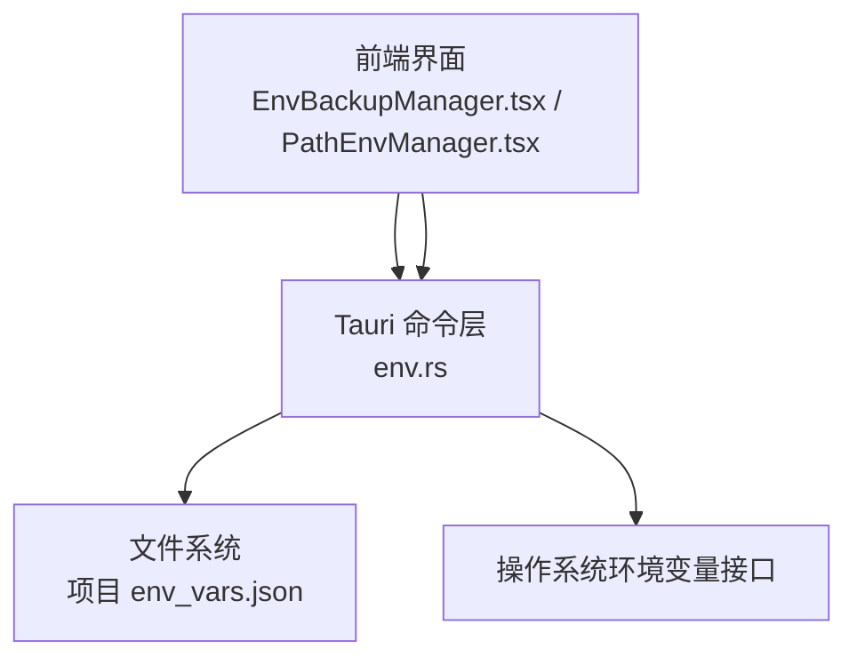
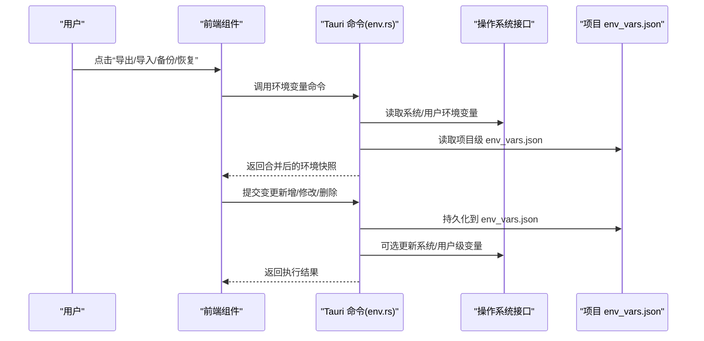
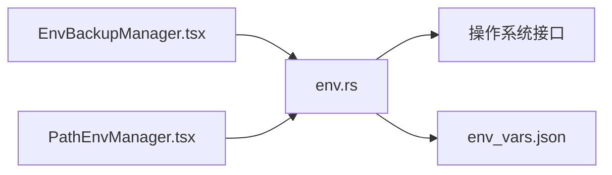
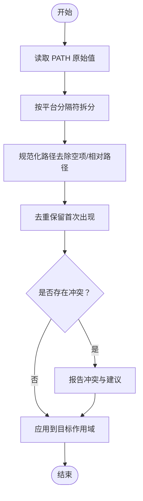

# 环境变量管理

<cite>
**本文引用的文件**   
- [src/components/EnvBackupManager.tsx](file://src/components/EnvBackupManager.tsx)
- [src/components/PathEnvManager.tsx](file://src/components/PathEnvManager.tsx)
- [src-tauri/src/commands/env.rs](file://src-tauri/src/commands/env.rs)
- [src-tauri/src/commands/mod.rs](file://src-tauri/src/commands/mod.rs)
- [projects/deno/env_vars.json](file://projects/deno/env_vars.json)
- [projects/go/env_vars.json](file://projects/go/env_vars.json)
- [projects/nodejs/env_vars.json](file://projects/nodejs/env_vars.json)
- [projects/python/env_vars.json](file://projects/python/env_vars.json)
- [projects/rust/env_vars.json](file://projects/rust/env_vars.json)
</cite>

## 目录
1. [简介](#简介)
2. [项目结构](#项目结构)
3. [核心组件](#核心组件)
4. [架构总览](#架构总览)
5. [详细组件分析](#详细组件分析)
6. [依赖关系分析](#依赖关系分析)
7. [性能考虑](#性能考虑)
8. [故障排查指南](#故障排查指南)
9. [结论](#结论)
10. [附录](#附录)

## 简介
本文件围绕“环境变量管理”能力，系统化阐述环境变量的定义、作用域与优先级规则；说明系统级、用户级与项目级环境变量的管理方法；介绍备份、恢复与同步机制；解释 PATH 的管理与路径解析逻辑；提供导入导出功能与格式支持；给出调试与验证工具使用方法；并覆盖跨操作系统配置要点以及常见冲突与权限问题的解决方案。

## 项目结构
本项目在前后端协同的架构下实现环境变量管理：
- 前端通过 React 组件提供可视化操作界面，包括环境变量备份管理与 PATH 管理面板。
- 后端通过 Tauri 命令暴露底层能力，负责读取、写入、校验与持久化环境变量。
- 项目级环境变量以 JSON 文件形式存储于各项目的配置目录中，便于版本化管理与团队协作。

图表来源
- [src/components/EnvBackupManager.tsx](file://src/components/EnvBackupManager.tsx)
- [src/components/PathEnvManager.tsx](file://src/components/PathEnvManager.tsx)
- [src-tauri/src/commands/env.rs](file://src-tauri/src/commands/env.rs)
- [src-tauri/src/commands/mod.rs](file://src-tauri/src/commands/mod.rs)

章节来源
- [src/components/EnvBackupManager.tsx](file://src/components/EnvBackupManager.tsx)
- [src/components/PathEnvManager.tsx](file://src/components/PathEnvManager.tsx)
- [src-tauri/src/commands/env.rs](file://src-tauri/src/commands/env.rs)
- [src-tauri/src/commands/mod.rs](file://src-tauri/src/commands/mod.rs)

## 核心组件
- 环境变量备份管理器（前端）：提供环境变量的导出、导入、备份与恢复等操作的可视化入口。
- PATH 环境变量管理器（前端）：提供对 PATH 的增删改查、排序与冲突检测等交互。
- 环境变量命令（后端）：封装系统级与用户级环境变量的读写、校验、合并与持久化逻辑，并与项目级 env_vars.json 进行同步。

章节来源
- [src/components/EnvBackupManager.tsx](file://src/components/EnvBackupManager.tsx)
- [src/components/PathEnvManager.tsx](file://src/components/PathEnvManager.tsx)
- [src-tauri/src/commands/env.rs](file://src-tauri/src/commands/env.rs)

## 架构总览
整体数据流遵循“前端调用 → Tauri 命令 → 系统/文件 → 返回结果”的模式。关键流程包括：
- 读取当前环境快照（系统 + 用户 + 项目）。
- 合并策略：项目级 > 用户级 > 系统级（同名键时高优先级覆盖低优先级）。
- 写入与持久化：将变更落盘到项目 env_vars.json，并在需要时更新系统或用户级变量。
- PATH 解析：按平台分隔符拆分、去重、排序与冲突检测。

图表来源
- [src/components/EnvBackupManager.tsx](file://src/components/EnvBackupManager.tsx)
- [src/components/PathEnvManager.tsx](file://src/components/PathEnvManager.tsx)
- [src-tauri/src/commands/env.rs](file://src-tauri/src/commands/env.rs)
- [src-tauri/src/commands/mod.rs](file://src-tauri/src/commands/mod.rs)

## 详细组件分析

### 环境变量备份管理器（前端）
职责
- 提供环境变量的导出与导入入口。
- 触发备份与恢复流程，展示进度与错误信息。
- 与后端命令交互，完成实际的数据读写。

交互要点
- 导出：从后端获取当前环境快照，生成可共享的文件。
- 导入：读取本地文件，校验格式后提交至后端进行合并与持久化。
- 备份/恢复：基于时间戳或命名约定创建备份集，支持回滚。

章节来源
- [src/components/EnvBackupManager.tsx](file://src/components/EnvBackupManager.tsx)

### PATH 环境变量管理器（前端）
职责
- 展示当前 PATH 列表，支持添加、删除、移动顺序、去重与冲突提示。
- 根据目标作用域（系统/用户/项目）应用变更。
- 提供路径有效性检查与快速修复建议。

交互要点
- 列表渲染：按平台分隔符解析 PATH，显示条目与来源。
- 变更提交：将差异提交给后端命令，由后端决定写入位置与生效范围。
- 冲突检测：识别重复项与潜在覆盖风险，给出调整建议。

章节来源
- [src/components/PathEnvManager.tsx](file://src/components/PathEnvManager.tsx)

### 环境变量命令（后端）
职责
- 暴露统一的环境变量操作接口，供前端调用。
- 实现多作用域合并策略与优先级规则。
- 处理 PATH 解析、去重、排序与冲突检测。
- 与项目 env_vars.json 同步，确保一致性。

关键能力
- 读取：聚合系统级、用户级与项目级环境变量。
- 写入：按作用域写入系统/用户环境变量，并将项目级变更持久化到 env_vars.json。
- 校验：对键名、值格式与 PATH 条目进行合法性检查。
- 同步：在导入/恢复后自动对齐项目与环境状态。

章节来源
- [src-tauri/src/commands/env.rs](file://src-tauri/src/commands/env.rs)
- [src-tauri/src/commands/mod.rs](file://src-tauri/src/commands/mod.rs)

### 项目级环境变量（JSON 文件）
说明
- 每个项目目录下存在 env_vars.json，用于声明该项目所需的环境变量。
- 该文件可作为团队共享的配置基线，配合版本控制使用。
- 导入/恢复时优先应用项目级配置，再叠加用户级与系统级。

示例文件
- [projects/deno/env_vars.json](file://projects/deno/env_vars.json)
- [projects/go/env_vars.json](file://projects/go/env_vars.json)
- [projects/nodejs/env_vars.json](file://projects/nodejs/env_vars.json)
- [projects/python/env_vars.json](file://projects/python/env_vars.json)
- [projects/rust/env_vars.json](file://projects/rust/env_vars.json)

章节来源
- [projects/deno/env_vars.json](file://projects/deno/env_vars.json)
- [projects/go/env_vars.json](file://projects/go/env_vars.json)
- [projects/nodejs/env_vars.json](file://projects/nodejs/env_vars.json)
- [projects/python/env_vars.json](file://projects/python/env_vars.json)
- [projects/rust/env_vars.json](file://projects/rust/env_vars.json)

## 依赖关系分析
- 前端组件依赖 Tauri 命令层提供的异步接口。
- 命令层依赖操作系统环境变量 API 与文件系统。
- 项目级 env_vars.json 作为持久化载体，与运行时环境变量保持双向同步。

图表来源
- [src/components/EnvBackupManager.tsx](file://src/components/EnvBackupManager.tsx)
- [src/components/PathEnvManager.tsx](file://src/components/PathEnvManager.tsx)
- [src-tauri/src/commands/env.rs](file://src-tauri/src/commands/env.rs)

章节来源
- [src/components/EnvBackupManager.tsx](file://src/components/EnvBackupManager.tsx)
- [src/components/PathEnvManager.tsx](file://src/components/PathEnvManager.tsx)
- [src-tauri/src/commands/env.rs](file://src-tauri/src/commands/env.rs)

## 性能考虑
- 批量操作：尽量合并多次写入为一次事务，减少 I/O 次数。
- 增量同步：仅计算差异并应用变更，避免全量重写。
- 缓存快照：在会话内缓存环境快照，降低频繁读取开销。
- PATH 优化：去重与排序仅在必要时执行，避免不必要的字符串处理。

[本节为通用指导，不直接分析具体文件]

## 故障排查指南
常见问题与定位步骤
- 权限不足
  - 现象：无法写入系统级环境变量。
  - 排查：确认运行账户具备管理员/提升权限；尝试切换为用户级或项目级作用域。
- 路径无效或重复
  - 现象：PATH 中包含不存在或重复的路径。
  - 排查：使用 PATH 管理器进行去重与有效性检查；移除无效条目。
- 导入失败或格式错误
  - 现象：导入时报错或无变化。
  - 排查：检查文件格式与键名规范；确认目标作用域是否允许写入。
- 冲突与覆盖
  - 现象：同一键在不同作用域存在不同值。
  - 排查：查看合并优先级；在项目级显式声明期望值以避免覆盖。

章节来源
- [src/components/EnvBackupManager.tsx](file://src/components/EnvBackupManager.tsx)
- [src/components/PathEnvManager.tsx](file://src/components/PathEnvManager.tsx)
- [src-tauri/src/commands/env.rs](file://src-tauri/src/commands/env.rs)

## 结论
本项目通过“前端可视化 + 后端命令 + 项目级 JSON”的组合，实现了安全、可控且可协作的环境变量管理能力。借助明确的优先级规则、完善的备份恢复机制与 PATH 专用管理工具，开发者可在多操作系统环境下高效维护一致的运行环境。

[本节为总结性内容，不直接分析具体文件]

## 附录

### 作用域与优先级规则
- 作用域
  - 系统级：影响所有用户与进程，通常需要管理员权限。
  - 用户级：仅影响当前登录用户。
  - 项目级：仅影响特定项目及其子进程，通常来自 env_vars.json。
- 优先级（从高到低）
  - 项目级 > 用户级 > 系统级
  - 同名键时，高优先级覆盖低优先级。

[本节为概念性说明，不直接分析具体文件]

### PATH 管理与路径解析逻辑
- 解析
  - 按平台分隔符拆分 PATH（Windows 使用分号，类 Unix 使用冒号）。
  - 去除空条目与重复项，保留首次出现顺序。
- 冲突检测
  - 识别多个条目指向相同目标的可执行文件或库。
  - 提供排序建议与冲突提示。
- 应用
  - 支持在系统/用户/项目作用域分别应用变更。
  - 变更后即时刷新会话可见性（视平台与权限而定）。

[本节为概念性说明，不直接分析具体文件]

### 导入/导出与格式支持
- 导出
  - 输出当前环境快照（系统 + 用户 + 项目），便于分享与审计。
- 导入
  - 支持项目级 env_vars.json 格式；导入时按优先级合并。
- 格式
  - 项目级采用 JSON 键值对；键名为环境变量名，值为字符串。
  - 建议在导入前进行语法与语义校验。

章节来源
- [projects/deno/env_vars.json](file://projects/deno/env_vars.json)
- [projects/go/env_vars.json](file://projects/go/env_vars.json)
- [projects/nodejs/env_vars.json](file://projects/nodejs/env_vars.json)
- [projects/python/env_vars.json](file://projects/python/env_vars.json)
- [projects/rust/env_vars.json](file://projects/rust/env_vars.json)

### 调试与验证工具使用方法
- 查看当前快照
  - 通过前端“导出”功能获取当前环境快照，核对键值与来源。
- 验证 PATH
  - 使用 PATH 管理器列出条目，检查有效性与冲突。
- 回滚与对比
  - 利用备份集进行差异对比与回滚，确保变更可追溯。

章节来源
- [src/components/EnvBackupManager.tsx](file://src/components/EnvBackupManager.tsx)
- [src/components/PathEnvManager.tsx](file://src/components/PathEnvManager.tsx)

### 跨操作系统配置要点
- Windows
  - 系统级写入需管理员权限；PATH 分隔符为分号。
  - 某些设置需重启资源管理器或重新登录才能生效。
- macOS
  - 用户级可通过用户配置文件或 launchd 管理；PATH 分隔符为冒号。
  - GUI 设置可能不会立即反映到终端会话，需重新打开终端。
- Linux
  - 用户级可通过 shell 初始化脚本（如 .bashrc/.zshrc）管理；PATH 分隔符为冒号。
  - 系统级通常通过 /etc/profile 或 systemd 环境管理。

[本节为通用指导，不直接分析具体文件]

### 常见冲突与权限问题
- 权限问题
  - 无法写入系统级：提升权限或改用用户级/项目级作用域。
- 冲突问题
  - 同名键覆盖：在项目级显式声明期望值，避免被用户级或系统级覆盖。
  - PATH 重复：使用 PATH 管理器去重与排序，消除歧义。
- 生效范围
  - 部分设置需重启应用或终端；必要时重启系统以确保全局生效。

章节来源
- [src/components/EnvBackupManager.tsx](file://src/components/EnvBackupManager.tsx)
- [src/components/PathEnvManager.tsx](file://src/components/PathEnvManager.tsx)
- [src-tauri/src/commands/env.rs](file://src-tauri/src/commands/env.rs)