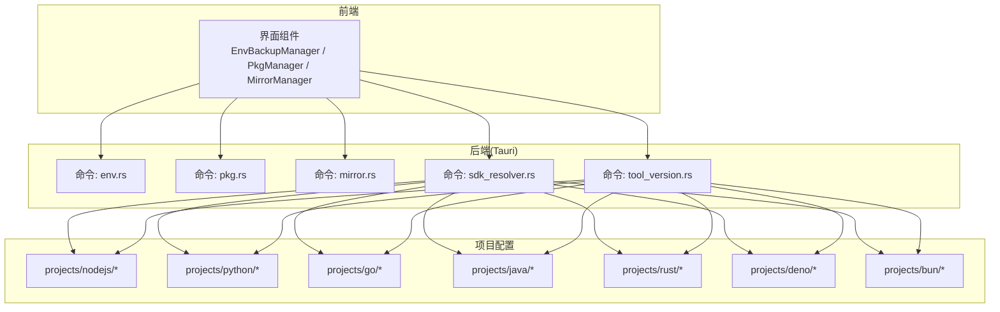
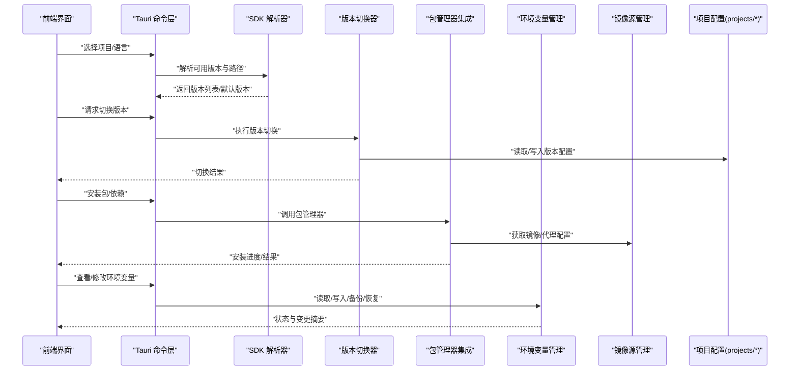
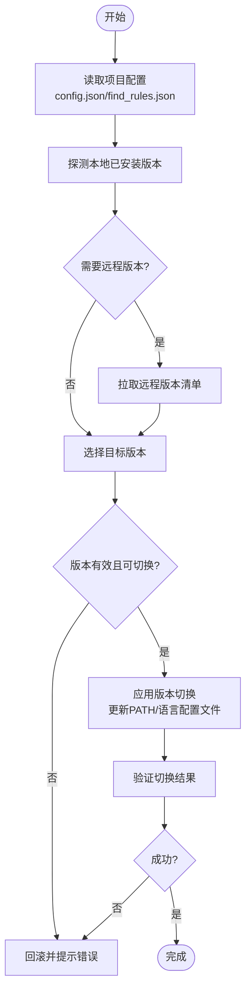
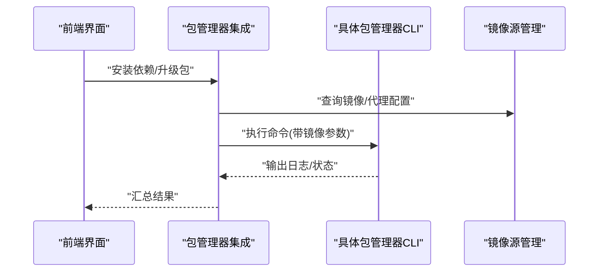
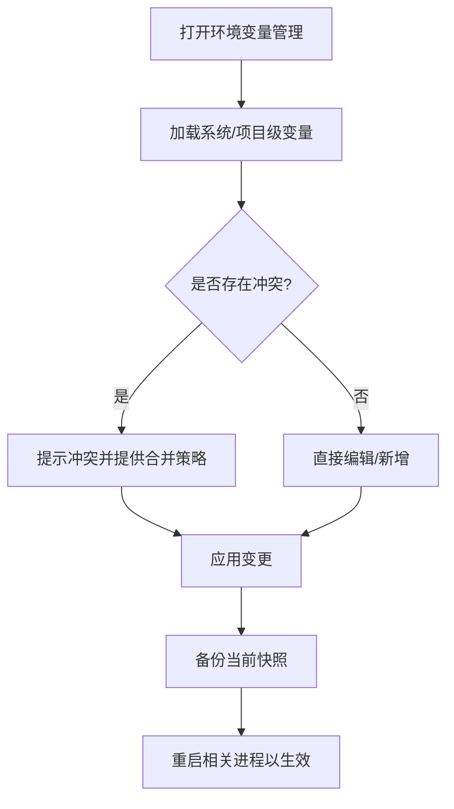
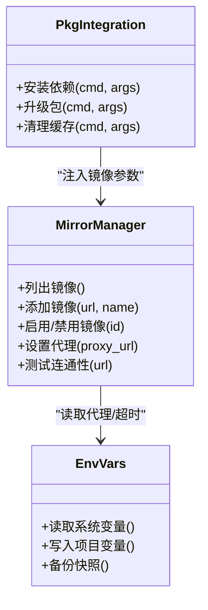
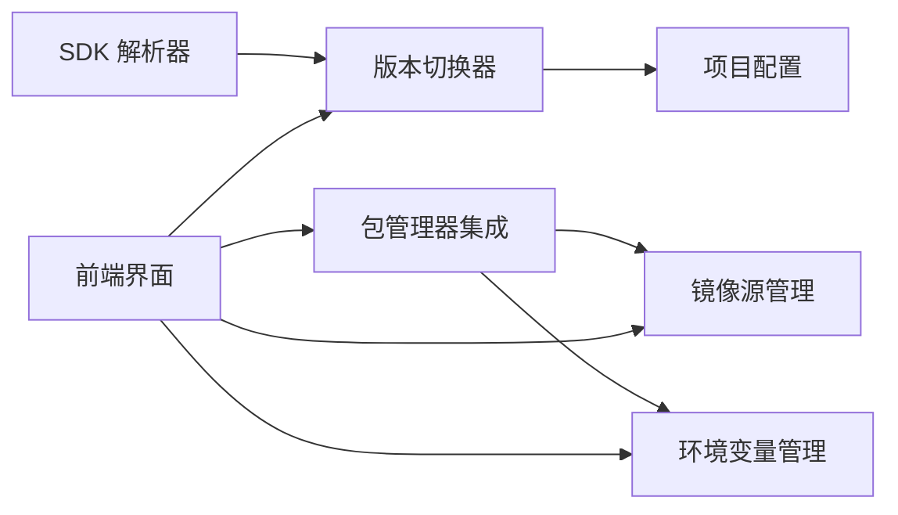

# 环境管理

<cite>
**本文引用的文件**   
- [src-tauri/src/commands/tool_version.rs](file://src-tauri/src/commands/tool_version.rs)
- [src-tauri/src/commands/env.rs](file://src-tauri/src/commands/env.rs)
- [src-tauri/src/commands/pkg.rs](file://src-tauri/src/commands/pkg.rs)
- [src-tauri/src/commands/sdk_resolver.rs](file://src-tauri/src/commands/sdk_resolver.rs)
- [src-tauri/src/commands/mirror.rs](file://src-tauri/src/commands/mirror.rs)
- [src/components/EnvBackupManager.tsx](file://src/components/EnvBackupManager.tsx)
- [src/components/PkgManager.tsx](file://src/components/PkgManager.tsx)
- [src/components/MirrorManager.tsx](file://src/components/MirrorManager.tsx)
- [projects/nodejs/config.json](file://projects/nodejs/config.json)
- [projects/python/config.json](file://projects/python/config.json)
- [projects/go/config.json](file://projects/go/config.json)
- [projects/java/config.json](file://projects/java/config.json)
- [projects/rust/config.json](file://projects/rust/config.json)
- [projects/deno/config.json](file://projects/deno/config.json)
- [projects/bun/config.json](file://projects/bun/config.json)
- [projects/nodejs/package_managers.json](file://projects/nodejs/package_managers.json)
- [projects/python/package_managers.json](file://projects/python/package_managers.json)
- [projects/go/package_managers.json](file://projects/go/package_managers.json)
- [projects/rust/package_managers.json](file://projects/rust/package_managers.json)
- [projects/deno/env_vars.json](file://projects/deno/env_vars.json)
- [projects/go/env_vars.json](file://projects/go/env_vars.json)
- [projects/python/env_vars.json](file://projects/python/env_vars.json)
- [projects/rust/env_vars.json](file://projects/rust/env_vars.json)
</cite>

## 目录
1. [简介](#简介)
2. [项目结构](#项目结构)
3. [核心组件](#核心组件)
4. [架构总览](#架构总览)
5. [详细组件分析](#详细组件分析)
6. [依赖关系分析](#依赖关系分析)
7. [性能考量](#性能考量)
8. [故障排查指南](#故障排查指南)
9. [结论](#结论)
10. [附录](#附录)

## 简介
本章节面向初学者与高级用户，系统性阐述“环境管理”能力：多语言运行时版本管理、包管理器集成、环境变量配置与管理策略、版本切换策略与最佳实践。目标是在 Node.js、Python、Go、Java、Rust、Deno、Bun 等生态中实现一致、可移植、可观测的环境控制体验。

## 项目结构
本项目采用前后端分离的桌面应用架构：
- 前端（React + Tauri）提供可视化界面，负责展示与交互。
- 后端（Tauri Rust）暴露命令接口，执行系统级操作（版本解析、安装、切换、镜像源设置、包管理等）。
- 项目配置位于 projects 目录，按语言/工具维度组织，包含运行期配置、包管理器规则、远程版本清单与环境变量模板。

图表来源
- [src/components/EnvBackupManager.tsx](file://src/components/EnvBackupManager.tsx)
- [src/components/PkgManager.tsx](file://src/components/PkgManager.tsx)
- [src/components/MirrorManager.tsx](file://src/components/MirrorManager.tsx)
- [src-tauri/src/commands/env.rs](file://src-tauri/src/commands/env.rs)
- [src-tauri/src/commands/pkg.rs](file://src-tauri/src/commands/pkg.rs)
- [src-tauri/src/commands/mirror.rs](file://src-tauri/src/commands/mirror.rs)
- [src-tauri/src/commands/sdk_resolver.rs](file://src-tauri/src/commands/sdk_resolver.rs)
- [src-tauri/src/commands/tool_version.rs](file://src-tauri/src/commands/tool_version.rs)
- [projects/nodejs/config.json](file://projects/nodejs/config.json)
- [projects/python/config.json](file://projects/python/config.json)
- [projects/go/config.json](file://projects/go/config.json)
- [projects/java/config.json](file://projects/java/config.json)
- [projects/rust/config.json](file://projects/rust/config.json)
- [projects/deno/config.json](file://projects/deno/config.json)
- [projects/bun/config.json](file://projects/bun/config.json)

章节来源
- [src-tauri/src/commands/env.rs](file://src-tauri/src/commands/env.rs)
- [src-tauri/src/commands/pkg.rs](file://src-tauri/src/commands/pkg.rs)
- [src-tauri/src/commands/mirror.rs](file://src-tauri/src/commands/mirror.rs)
- [src-tauri/src/commands/sdk_resolver.rs](file://src-tauri/src/commands/sdk_resolver.rs)
- [src-tauri/src/commands/tool_version.rs](file://src-tauri/src/commands/tool_version.rs)
- [src/components/EnvBackupManager.tsx](file://src/components/EnvBackupManager.tsx)
- [src/components/PkgManager.tsx](file://src/components/PkgManager.tsx)
- [src/components/MirrorManager.tsx](file://src/components/MirrorManager.tsx)
- [projects/nodejs/config.json](file://projects/nodejs/config.json)
- [projects/python/config.json](file://projects/python/config.json)
- [projects/go/config.json](file://projects/go/config.json)
- [projects/java/config.json](file://projects/java/config.json)
- [projects/rust/config.json](file://projects/rust/config.json)
- [projects/deno/config.json](file://projects/deno/config.json)
- [projects/bun/config.json](file://projects/bun/config.json)

## 核心组件
- 版本解析器（SDK Resolver）
  - 职责：根据项目配置与平台信息，定位并解析各语言的 SDK/运行时路径与可用版本集合。
  - 关键输入：projects 下对应语言的 config.json、find_rules.json、remote_versions_config.json。
  - 输出：SDK 根目录、候选版本列表、默认版本。
- 版本切换器（Tool Version Manager）
  - 职责：在指定项目或全局范围内设置当前使用的运行时版本，更新 PATH 或语言特定的版本配置文件。
  - 行为：校验目标版本存在性、回滚失败、记录切换历史。
- 包管理器集成（Package Manager Integration）
  - 职责：封装 npm/pip/cargo/go mod 等常用包管理器的安装、升级、清理等操作；支持镜像源与缓存策略。
  - 关键输入：package_managers.json 中的命令映射、参数模板、镜像配置。
- 环境变量管理（Environment Variables）
  - 职责：读取/写入/备份/恢复环境变量；支持项目级与环境级隔离；提供安全校验与冲突检测。
- 镜像源管理（Mirror Manager）
  - 职责：集中管理下载镜像、代理与超时策略；为包管理与 SDK 下载提供统一入口。

章节来源
- [src-tauri/src/commands/sdk_resolver.rs](file://src-tauri/src/commands/sdk_resolver.rs)
- [src-tauri/src/commands/tool_version.rs](file://src-tauri/src/commands/tool_version.rs)
- [src-tauri/src/commands/pkg.rs](file://src-tauri/src/commands/pkg.rs)
- [src-tauri/src/commands/env.rs](file://src-tauri/src/commands/env.rs)
- [src-tauri/src/commands/mirror.rs](file://src-tauri/src/commands/mirror.rs)
- [projects/nodejs/package_managers.json](file://projects/nodejs/package_managers.json)
- [projects/python/package_managers.json](file://projects/python/package_managers.json)
- [projects/go/package_managers.json](file://projects/go/package_managers.json)
- [projects/rust/package_managers.json](file://projects/rust/package_managers.json)

## 架构总览
下图展示了从前端到后端的调用链路与数据流向，以及配置文件的参与方式。

图表来源
- [src-tauri/src/commands/sdk_resolver.rs](file://src-tauri/src/commands/sdk_resolver.rs)
- [src-tauri/src/commands/tool_version.rs](file://src-tauri/src/commands/tool_version.rs)
- [src-tauri/src/commands/pkg.rs](file://src-tauri/src/commands/pkg.rs)
- [src-tauri/src/commands/env.rs](file://src-tauri/src/commands/env.rs)
- [src-tauri/src/commands/mirror.rs](file://src-tauri/src/commands/mirror.rs)
- [projects/nodejs/config.json](file://projects/nodejs/config.json)
- [projects/python/config.json](file://projects/python/config.json)
- [projects/go/config.json](file://projects/go/config.json)
- [projects/java/config.json](file://projects/java/config.json)
- [projects/rust/config.json](file://projects/rust/config.json)
- [projects/deno/config.json](file://projects/deno/config.json)
- [projects/bun/config.json](file://projects/bun/config.json)

## 详细组件分析

### 多语言版本切换机制
- 通用流程
  - 解析：基于 projects/<lang>/config.json 与 find_rules.json 确定 SDK 安装位置与版本发现规则。
  - 校验：检查目标版本是否已安装或可从远程拉取。
  - 切换：更新语言特定版本文件或 PATH，确保后续进程使用新环境。
  - 回滚：若切换失败，自动恢复到上一版本。
- 语言差异要点
  - Node.js/Deno/Bun：通常通过 .nvmrc/.node-version 或语言内置版本管理文件生效；也可通过 PATH 覆盖。
  - Python：通过 pyenv 或虚拟环境激活脚本注入 PATH。
  - Go：通过 goenv 或 GOPATH/GOROOT 调整。
  - Java：通过 JAVA_HOME 与 PATH 指向 JDK 安装目录。
  - Rust：通过 rustup 管理多版本与工具链。
- 配置项参考
  - 各语言 projects/<lang>/config.json 定义了版本发现、安装路径、默认版本等元数据。
  - remote_versions_config.json 提供远程版本清单与下载地址模板。

图表来源
- [src-tauri/src/commands/sdk_resolver.rs](file://src-tauri/src/commands/sdk_resolver.rs)
- [src-tauri/src/commands/tool_version.rs](file://src-tauri/src/commands/tool_version.rs)
- [projects/nodejs/config.json](file://projects/nodejs/config.json)
- [projects/python/config.json](file://projects/python/config.json)
- [projects/go/config.json](file://projects/go/config.json)
- [projects/java/config.json](file://projects/java/config.json)
- [projects/rust/config.json](file://projects/rust/config.json)
- [projects/deno/config.json](file://projects/deno/config.json)
- [projects/bun/config.json](file://projects/bun/config.json)

章节来源
- [src-tauri/src/commands/sdk_resolver.rs](file://src-tauri/src/commands/sdk_resolver.rs)
- [src-tauri/src/commands/tool_version.rs](file://src-tauri/src/commands/tool_version.rs)
- [projects/nodejs/config.json](file://projects/nodejs/config.json)
- [projects/python/config.json](file://projects/python/config.json)
- [projects/go/config.json](file://projects/go/config.json)
- [projects/java/config.json](file://projects/java/config.json)
- [projects/rust/config.json](file://projects/rust/config.json)
- [projects/deno/config.json](file://projects/deno/config.json)
- [projects/bun/config.json](file://projects/bun/config.json)

### 包管理器集成（npm、pip、cargo、go mod 等）
- 工作原理
  - package_managers.json 定义命令别名、参数模板、镜像与缓存策略。
  - 命令层将用户意图转换为具体包管理器 CLI 调用，并注入镜像/代理参数。
  - 支持并行安装、增量更新与失败重试。
- 使用方法
  - 在项目目录下触发“安装依赖”，系统将依据 package_managers.json 选择对应命令。
  - 可通过镜像管理界面统一配置下载源，影响所有包管理器。
- 示例配置参考
  - Node.js：[projects/nodejs/package_managers.json](file://projects/nodejs/package_managers.json)
  - Python：[projects/python/package_managers.json](file://projects/python/package_managers.json)
  - Go：[projects/go/package_managers.json](file://projects/go/package_managers.json)
  - Rust：[projects/rust/package_managers.json](file://projects/rust/package_managers.json)

图表来源
- [src-tauri/src/commands/pkg.rs](file://src-tauri/src/commands/pkg.rs)
- [src-tauri/src/commands/mirror.rs](file://src-tauri/src/commands/mirror.rs)
- [projects/nodejs/package_managers.json](file://projects/nodejs/package_managers.json)
- [projects/python/package_managers.json](file://projects/python/package_managers.json)
- [projects/go/package_managers.json](file://projects/go/package_managers.json)
- [projects/rust/package_managers.json](file://projects/rust/package_managers.json)

章节来源
- [src-tauri/src/commands/pkg.rs](file://src-tauri/src/commands/pkg.rs)
- [src-tauri/src/commands/mirror.rs](file://src-tauri/src/commands/mirror.rs)
- [projects/nodejs/package_managers.json](file://projects/nodejs/package_managers.json)
- [projects/python/package_managers.json](file://projects/python/package_managers.json)
- [projects/go/package_managers.json](file://projects/go/package_managers.json)
- [projects/rust/package_managers.json](file://projects/rust/package_managers.json)

### 环境变量配置与管理策略
- 管理范围
  - 系统级：影响当前用户会话的所有进程。
  - 项目级：仅对当前项目上下文生效（如启动脚本注入）。
- 功能特性
  - 读取/写入/备份/恢复；冲突检测与合并策略；敏感字段脱敏显示。
  - 支持模板化变量（如 ${HOME}、${PROJECT_ROOT}），便于跨平台迁移。
- 配置参考
  - 部分语言提供 env_vars.json 作为环境变量模板与默认值。
  - 示例：[projects/deno/env_vars.json](file://projects/deno/env_vars.json)、[projects/go/env_vars.json](file://projects/go/env_vars.json)、[projects/python/env_vars.json](file://projects/python/env_vars.json)、[projects/rust/env_vars.json](file://projects/rust/env_vars.json)。

图表来源
- [src-tauri/src/commands/env.rs](file://src-tauri/src/commands/env.rs)
- [src/components/EnvBackupManager.tsx](file://src/components/EnvBackupManager.tsx)
- [projects/deno/env_vars.json](file://projects/deno/env_vars.json)
- [projects/go/env_vars.json](file://projects/go/env_vars.json)
- [projects/python/env_vars.json](file://projects/python/env_vars.json)
- [projects/rust/env_vars.json](file://projects/rust/env_vars.json)

章节来源
- [src-tauri/src/commands/env.rs](file://src-tauri/src/commands/env.rs)
- [src/components/EnvBackupManager.tsx](file://src/components/EnvBackupManager.tsx)
- [projects/deno/env_vars.json](file://projects/deno/env_vars.json)
- [projects/go/env_vars.json](file://projects/go/env_vars.json)
- [projects/python/env_vars.json](file://projects/python/env_vars.json)
- [projects/rust/env_vars.json](file://projects/rust/env_vars.json)

### 镜像源管理
- 作用域
  - 全局镜像：影响所有包管理器与 SDK 下载。
  - 项目镜像：针对特定项目的覆盖配置。
- 能力
  - 添加/删除/启用/禁用镜像；设置超时与重试；代理开关。
- 配置参考
  - 镜像管理界面与后端命令：[src/components/MirrorManager.tsx](file://src/components/MirrorManager.tsx)、[src-tauri/src/commands/mirror.rs](file://src-tauri/src/commands/mirror.rs)。

图表来源
- [src/components/MirrorManager.tsx](file://src/components/MirrorManager.tsx)
- [src-tauri/src/commands/mirror.rs](file://src-tauri/src/commands/mirror.rs)
- [src-tauri/src/commands/env.rs](file://src-tauri/src/commands/env.rs)
- [src-tauri/src/commands/pkg.rs](file://src-tauri/src/commands/pkg.rs)

章节来源
- [src/components/MirrorManager.tsx](file://src/components/MirrorManager.tsx)
- [src-tauri/src/commands/mirror.rs](file://src-tauri/src/commands/mirror.rs)
- [src-tauri/src/commands/env.rs](file://src-tauri/src/commands/env.rs)
- [src-tauri/src/commands/pkg.rs](file://src-tauri/src/commands/pkg.rs)

## 依赖关系分析
- 组件耦合
  - 版本切换器依赖 SDK 解析器与项目配置。
  - 包管理器集成依赖镜像源管理与环境变量（代理/超时）。
  - 环境变量管理独立性强，但被其他组件广泛引用。
- 外部依赖
  - 各语言包管理器 CLI（npm、pip、cargo、go mod、rustup 等）。
  - 操作系统环境变量 API（Windows/Unix）。
- 潜在循环依赖
  - 通过命令层解耦，避免直接循环引用；镜像与包管理之间通过配置传递，不形成强耦合。

图表来源
- [src-tauri/src/commands/sdk_resolver.rs](file://src-tauri/src/commands/sdk_resolver.rs)
- [src-tauri/src/commands/tool_version.rs](file://src-tauri/src/commands/tool_version.rs)
- [src-tauri/src/commands/pkg.rs](file://src-tauri/src/commands/pkg.rs)
- [src-tauri/src/commands/env.rs](file://src-tauri/src/commands/env.rs)
- [src-tauri/src/commands/mirror.rs](file://src-tauri/src/commands/mirror.rs)

章节来源
- [src-tauri/src/commands/sdk_resolver.rs](file://src-tauri/src/commands/sdk_resolver.rs)
- [src-tauri/src/commands/tool_version.rs](file://src-tauri/src/commands/tool_version.rs)
- [src-tauri/src/commands/pkg.rs](file://src-tauri/src/commands/pkg.rs)
- [src-tauri/src/commands/env.rs](file://src-tauri/src/commands/env.rs)
- [src-tauri/src/commands/mirror.rs](file://src-tauri/src/commands/mirror.rs)

## 性能考量
- 版本发现优化
  - 缓存本地已扫描的版本列表，减少重复 IO。
  - 远程版本清单按需拉取，支持断点续传与并发下载。
- 包管理优化
  - 并行安装依赖，限制并发度以避免系统资源争用。
  - 增量更新与缓存复用，减少网络开销。
- 环境变量优化
  - 批量写入与最小化变更，避免频繁刷新系统环境。
  - 冲突检测提前进行，降低回滚成本。

## 故障排查指南
- 版本切换失败
  - 检查目标版本是否已安装；确认权限与磁盘空间。
  - 查看切换日志与回滚记录，必要时手动修复 PATH 或语言版本文件。
- 包管理器安装失败
  - 确认镜像/代理配置正确；测试连通性与超时设置。
  - 清理缓存后重试；关注网络与防火墙策略。
- 环境变量未生效
  - 确认变更已保存并重启相关进程；检查项目级与系统级优先级。
  - 使用备份快照快速恢复至稳定状态。

章节来源
- [src-tauri/src/commands/tool_version.rs](file://src-tauri/src/commands/tool_version.rs)
- [src-tauri/src/commands/pkg.rs](file://src-tauri/src/commands/pkg.rs)
- [src-tauri/src/commands/env.rs](file://src-tauri/src/commands/env.rs)
- [src/components/EnvBackupManager.tsx](file://src/components/EnvBackupManager.tsx)

## 结论
通过统一的版本解析、切换、包管理与环境变量管理能力，本项目在多语言生态中提供了稳定、可移植、可观测的环境管理体验。建议在生产环境中结合镜像源与缓存策略，配合版本锁定与自动化测试，提升构建与部署的一致性。

## 附录
- 配置示例参考
  - Node.js：[projects/nodejs/config.json](file://projects/nodejs/config.json)、[projects/nodejs/package_managers.json](file://projects/nodejs/package_managers.json)
  - Python：[projects/python/config.json](file://projects/python/config.json)、[projects/python/package_managers.json](file://projects/python/package_managers.json)、[projects/python/env_vars.json](file://projects/python/env_vars.json)
  - Go：[projects/go/config.json](file://projects/go/config.json)、[projects/go/package_managers.json](file://projects/go/package_managers.json)、[projects/go/env_vars.json](file://projects/go/env_vars.json)
  - Java：[projects/java/config.json](file://projects/java/config.json)
  - Rust：[projects/rust/config.json](file://projects/rust/config.json)、[projects/rust/package_managers.json](file://projects/rust/package_managers.json)、[projects/rust/env_vars.json](file://projects/rust/env_vars.json)
  - Deno：[projects/deno/config.json](file://projects/deno/config.json)、[projects/deno/env_vars.json](file://projects/deno/env_vars.json)
  - Bun：[projects/bun/config.json](file://projects/bun/config.json)