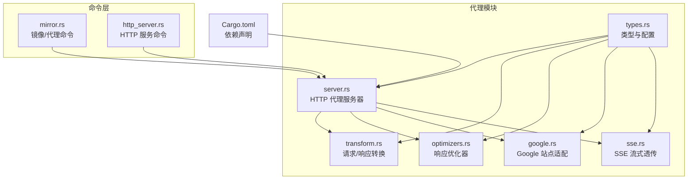
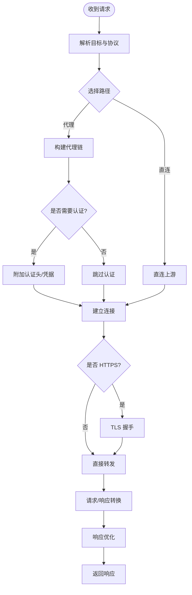
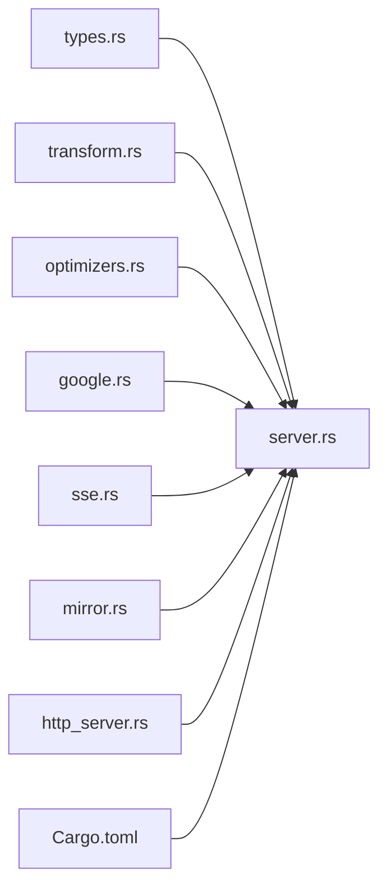

# 代理配置

<cite>
**本文引用的文件**   
- [src-tauri/src/proxy/mod.rs](file://src-tauri/src/proxy/mod.rs)
- [src-tauri/src/proxy/server.rs](file://src-tauri/src/proxy/server.rs)
- [src-tauri/src/proxy/types.rs](file://src-tauri/src/proxy/types.rs)
- [src-tauri/src/proxy/transform.rs](file://src-tauri/src/proxy/transform.rs)
- [src-tauri/src/proxy/optimizers.rs](file://src-tauri/src/proxy/optimizers.rs)
- [src-tauri/src/proxy/sse.rs](file://src-tauri/src/proxy/sse.rs)
- [src-tauri/src/proxy/google.rs](file://src-tauri/src/proxy/google.rs)
- [src-tauri/src/commands/mirror.rs](file://src-tauri/src/commands/mirror.rs)
- [src-tauri/src/commands/http_server.rs](file://src-tauri/src/commands/http_server.rs)
- [src-tauri/Cargo.toml](file://src-tauri/Cargo.toml)
</cite>

## 目录
1. [简介](#简介)
2. [项目结构](#项目结构)
3. [核心组件](#核心组件)
4. [架构总览](#架构总览)
5. [详细组件分析](#详细组件分析)
6. [依赖关系分析](#依赖关系分析)
7. [性能考虑](#性能考虑)
8. [故障排查指南](#故障排查指南)
9. [结论](#结论)
10. [附录](#附录)

## 简介
本章节面向“代理配置”主题，系统性梳理项目中与网络代理相关的实现与能力，覆盖 HTTP、HTTPS、SOCKS5 代理支持；代理服务器配置与连接池管理；请求转换与响应优化；认证、SSL 证书处理与错误重试；健康检查与自动切换；企业代理集成与防火墙穿透方案。文档同时为初学者提供基础概念与简单配置示例，并为高级用户提供自定义代理中间件与性能调优指南。

## 项目结构
本项目在 Rust 后端中通过独立的 proxy 模块组织代理相关能力，包含类型定义、HTTP 代理服务器、请求/响应转换、优化器、SSE 透传以及特定站点（如 Google）的适配逻辑。命令层暴露镜像与 HTTP 服务控制接口，便于上层应用或前端进行集成。



图表来源
- [src-tauri/src/proxy/types.rs](file://src-tauri/src/proxy/types.rs)
- [src-tauri/src/proxy/server.rs](file://src-tauri/src/proxy/server.rs)
- [src-tauri/src/proxy/transform.rs](file://src-tauri/src/proxy/transform.rs)
- [src-tauri/src/proxy/optimizers.rs](file://src-tauri/src/proxy/optimizers.rs)
- [src-tauri/src/proxy/google.rs](file://src-tauri/src/proxy/google.rs)
- [src-tauri/src/proxy/sse.rs](file://src-tauri/src/proxy/sse.rs)
- [src-tauri/src/commands/mirror.rs](file://src-tauri/src/commands/mirror.rs)
- [src-tauri/src/commands/http_server.rs](file://src-tauri/src/commands/http_server.rs)
- [src-tauri/Cargo.toml](file://src-tauri/Cargo.toml)

章节来源
- [src-tauri/src/proxy/mod.rs](file://src-tauri/src/proxy/mod.rs)
- [src-tauri/src/proxy/server.rs](file://src-tauri/src/proxy/server.rs)
- [src-tauri/src/proxy/types.rs](file://src-tauri/src/proxy/types.rs)
- [src-tauri/src/proxy/transform.rs](file://src-tauri/src/proxy/transform.rs)
- [src-tauri/src/proxy/optimizers.rs](file://src-tauri/src/proxy/optimizers.rs)
- [src-tauri/src/proxy/google.rs](file://src-tauri/src/proxy/google.rs)
- [src-tauri/src/proxy/sse.rs](file://src-tauri/src/proxy/sse.rs)
- [src-tauri/src/commands/mirror.rs](file://src-tauri/src/commands/mirror.rs)
- [src-tauri/src/commands/http_server.rs](file://src-tauri/src/commands/http_server.rs)
- [src-tauri/Cargo.toml](file://src-tauri/Cargo.toml)

## 核心组件
- 类型与配置：集中定义代理协议、认证信息、TLS 选项、超时与重试策略等，供各子模块复用。
- HTTP 代理服务器：监听本地端口，接收上游客户端请求，按目标域名/路径选择直连或经代理转发，并处理 CONNECT 隧道与常规 HTTP/HTTPS 请求。
- 请求/响应转换：对头部、Cookie、重定向等进行规范化与改写，确保跨域与企业代理环境下的兼容性。
- 响应优化器：压缩、缓存、去重、分块传输等策略，降低带宽与延迟。
- 站点适配：针对特定站点（如 Google）的路径重写、鉴权头注入、UA 调整等。
- SSE 透传：将服务端事件流稳定地透传给客户端，保障长连接稳定性。
- 命令层：对外暴露启动/停止代理、更新镜像源、查询状态等命令，便于上层集成。

章节来源
- [src-tauri/src/proxy/types.rs](file://src-tauri/src/proxy/types.rs)
- [src-tauri/src/proxy/server.rs](file://src-tauri/src/proxy/server.rs)
- [src-tauri/src/proxy/transform.rs](file://src-tauri/src/proxy/transform.rs)
- [src-tauri/src/proxy/optimizers.rs](file://src-tauri/src/proxy/optimizers.rs)
- [src-tauri/src/proxy/google.rs](file://src-tauri/src/proxy/google.rs)
- [src-tauri/src/proxy/sse.rs](file://src-tauri/src/proxy/sse.rs)
- [src-tauri/src/commands/mirror.rs](file://src-tauri/src/commands/mirror.rs)
- [src-tauri/src/commands/http_server.rs](file://src-tauri/src/commands/http_server.rs)

## 架构总览
下图展示了从客户端到上游服务器的完整代理链路，包括认证、TLS、转换、优化与健康检查等环节。

```mermaid
sequenceDiagram
participant Client as "客户端"
participant Proxy as "代理服务器(server.rs)"
participant Transform as "转换(transform.rs)"
participant Opt as "优化器(optimizers.rs)"
participant Upstream as "上游服务器"
participant Health as "健康检查"
Client->>Proxy : "发起 HTTP/HTTPS/SOCKS5 请求"
Proxy->>Transform : "解析并标准化请求头/URL"
alt "需要认证"
Proxy->>Proxy : "附加认证信息"
end
Proxy->>Health : "探测可用代理/直连"
Health-->>Proxy : "返回最优路径"
Proxy->>Upstream : "建立连接并转发请求"
Upstream-->>Proxy : "返回响应"
Proxy->>Opt : "执行压缩/缓存/去重等优化"
Opt-->>Proxy : "优化后的响应"
Proxy-->>Client : "返回最终响应"
```

图表来源
- [src-tauri/src/proxy/server.rs](file://src-tauri/src/proxy/server.rs)
- [src-tauri/src/proxy/transform.rs](file://src-tauri/src/proxy/transform.rs)
- [src-tauri/src/proxy/optimizers.rs](file://src-tauri/src/proxy/optimizers.rs)

## 详细组件分析

### 类型与配置（types.rs）
- 职责：定义代理协议枚举、认证参数、TLS 配置、超时与重试策略、连接池参数等。
- 关键点：
  - 协议支持：HTTP、HTTPS、SOCKS5。
  - 认证：用户名/密码、令牌等。
  - TLS：证书校验开关、自定义 CA、最小/最大协议版本。
  - 连接池：最大空闲连接、单主机并发、连接存活时间。
  - 重试：最大重试次数、退避策略、可重试错误码集合。
- 使用方式：其他模块通过引用该类型完成配置加载与校验。

章节来源
- [src-tauri/src/proxy/types.rs](file://src-tauri/src/proxy/types.rs)

### HTTP 代理服务器（server.rs）
- 职责：监听本地端口，处理 CONNECT 隧道与常规请求，路由至直连或代理，维护连接池与健康检查。
- 关键流程：
  - 接收请求后解析目标地址与协议。
  - 根据配置选择代理链或直连。
  - 若为 HTTPS，建立 CONNECT 隧道并通过 TLS 握手。
  - 将请求交由转换与优化器处理。
  - 记录指标与日志，支持动态启停。
- 连接池管理：
  - 基于主机维度的连接复用。
  - 空闲回收与最大并发限制。
  - 失败快速失败与降级策略。
- 健康检查与自动切换：
  - 周期性探测代理可达性与延迟。
  - 当主代理不可用时自动切换到备用代理或直连。



图表来源
- [src-tauri/src/proxy/server.rs](file://src-tauri/src/proxy/server.rs)
- [src-tauri/src/proxy/transform.rs](file://src-tauri/src/proxy/transform.rs)
- [src-tauri/src/proxy/optimizers.rs](file://src-tauri/src/proxy/optimizers.rs)

章节来源
- [src-tauri/src/proxy/server.rs](file://src-tauri/src/proxy/server.rs)

### 请求/响应转换（transform.rs）
- 职责：统一规范化请求与响应，处理重定向、跨域、Cookie、Host 重写等。
- 重点能力：
  - 头部清洗与合并，避免重复与冲突。
  - 重定向目标改写，确保经代理后可达。
  - Cookie 作用域与安全属性调整。
  - 针对企业代理的透明性处理（如保留必要鉴权头）。

章节来源
- [src-tauri/src/proxy/transform.rs](file://src-tauri/src/proxy/transform.rs)

### 响应优化器（optimizers.rs）
- 职责：对响应体进行压缩、缓存、去重、分块传输等优化。
- 策略：
  - 内容编码协商与自适应压缩。
  - 短生命周期资源的内存缓存。
  - 大文件分块与断点续传支持。
  - 响应体哈希去重，减少重复传输。

章节来源
- [src-tauri/src/proxy/optimizers.rs](file://src-tauri/src/proxy/optimizers.rs)

### 站点适配（google.rs）
- 职责：针对特定站点（如 Google）的路径重写、鉴权头注入、UA 调整等。
- 适用场景：企业内网访问受限站点时的兼容与加速。

章节来源
- [src-tauri/src/proxy/google.rs](file://src-tauri/src/proxy/google.rs)

### SSE 透传（sse.rs）
- 职责：将上游 SSE 流稳定地透传给客户端，保持事件顺序与心跳。
- 要点：
  - 心跳保活与超时重连。
  - 背压控制，防止内存膨胀。
  - 错误恢复与幂等处理。

章节来源
- [src-tauri/src/proxy/sse.rs](file://src-tauri/src/proxy/sse.rs)

### 命令层集成（mirror.rs、http_server.rs）
- 镜像命令：用于更新镜像源、切换代理策略、查询当前代理状态。
- HTTP 服务命令：用于启动/停止代理服务、设置监听端口、导出健康状态。

章节来源
- [src-tauri/src/commands/mirror.rs](file://src-tauri/src/commands/mirror.rs)
- [src-tauri/src/commands/http_server.rs](file://src-tauri/src/commands/http_server.rs)

## 依赖关系分析
- 内部依赖：
  - server.rs 依赖 types.rs、transform.rs、optimizers.rs、google.rs、sse.rs。
  - mirror.rs 与 http_server.rs 通过命令层调用 server.rs 的能力。
- 外部依赖：
  - Cargo.toml 声明了网络栈、TLS、HTTP 客户端/服务器、SOCKS5 支持等库。



图表来源
- [src-tauri/src/proxy/server.rs](file://src-tauri/src/proxy/server.rs)
- [src-tauri/src/proxy/types.rs](file://src-tauri/src/proxy/types.rs)
- [src-tauri/src/proxy/transform.rs](file://src-tauri/src/proxy/transform.rs)
- [src-tauri/src/proxy/optimizers.rs](file://src-tauri/src/proxy/optimizers.rs)
- [src-tauri/src/proxy/google.rs](file://src-tauri/src/proxy/google.rs)
- [src-tauri/src/proxy/sse.rs](file://src-tauri/src/proxy/sse.rs)
- [src-tauri/src/commands/mirror.rs](file://src-tauri/src/commands/mirror.rs)
- [src-tauri/src/commands/http_server.rs](file://src-tauri/src/commands/http_server.rs)
- [src-tauri/Cargo.toml](file://src-tauri/Cargo.toml)

章节来源
- [src-tauri/Cargo.toml](file://src-tauri/Cargo.toml)

## 性能考虑
- 连接池：
  - 合理设置最大空闲连接与单主机并发，避免资源耗尽。
  - 启用连接复用，减少握手开销。
- 超时与重试：
  - 区分读/写/连接超时，结合指数退避提升成功率。
  - 仅对幂等请求启用重试，避免副作用。
- 压缩与缓存：
  - 对文本类资源启用压缩，二进制资源谨慎处理。
  - 短生命周期资源采用内存缓存，注意内存上限。
- SSE 流：
  - 控制缓冲大小，避免背压导致内存增长。
  - 心跳间隔与超时阈值需与上游保持一致。
- 健康检查：
  - 定期探测延迟与错误率，动态切换最优路径。
  - 冷启动预热常用连接，降低首包延迟。

[本节为通用性能建议，不直接分析具体文件]

## 故障排查指南
- 常见问题定位：
  - 认证失败：检查认证头与凭据是否正确传递。
  - TLS 握手失败：确认证书链与最小/最大协议版本。
  - 重定向循环：查看转换逻辑中的 Host 与 Location 改写。
  - 连接池耗尽：监控活跃连接数与等待队列长度。
  - SSE 中断：检查心跳与超时配置，确认上游稳定性。
- 诊断手段：
  - 启用详细日志，记录请求/响应摘要与耗时。
  - 导出健康检查指标，观察代理可用性趋势。
  - 使用抓包工具验证头部与证书协商过程。

章节来源
- [src-tauri/src/proxy/server.rs](file://src-tauri/src/proxy/server.rs)
- [src-tauri/src/proxy/transform.rs](file://src-tauri/src/proxy/transform.rs)
- [src-tauri/src/proxy/optimizers.rs](file://src-tauri/src/proxy/optimizers.rs)
- [src-tauri/src/proxy/sse.rs](file://src-tauri/src/proxy/sse.rs)

## 结论
本项目的代理模块以清晰的类型定义为基础，构建了可扩展的 HTTP 代理服务器，并在请求转换、响应优化、站点适配与 SSE 透传方面提供了完善能力。通过连接池管理、健康检查与自动切换，系统在复杂企业网络环境中具备高可用与高性能表现。配合命令层接口，可实现灵活的部署与运维。

[本节为总结性内容，不直接分析具体文件]

## 附录

### 基础概念（初学者）
- 代理是什么：作为客户端与上游服务器之间的中介，负责转发请求与响应。
- 常见协议：
  - HTTP/HTTPS：Web 流量代理，HTTPS 通过 CONNECT 隧道建立加密通道。
  - SOCKS5：更通用的套接字级代理，适用于多种应用。
- 基本配置项：
  - 代理地址与端口。
  - 认证方式（用户名/密码或令牌）。
  - TLS 选项（证书校验、自定义 CA）。
  - 超时与重试策略。

[本节为概念性说明，不直接分析具体文件]

### 简单配置示例（初学者）
- 步骤概览：
  - 在配置文件中指定代理地址、端口与认证信息。
  - 启用 TLS 校验或使用自定义 CA。
  - 设置合理的超时与重试次数。
  - 启动代理服务并验证连通性。
- 验证方法：
  - 通过 curl 或浏览器指向本地代理端口访问目标站点。
  - 检查代理日志输出是否正常。

[本节为概念性说明，不直接分析具体文件]

### 高级指南（自定义中间件与调优）
- 自定义中间件：
  - 在转换阶段插入自定义逻辑，如签名注入、审计日志、A/B 分流。
  - 在优化器中扩展缓存策略或压缩算法。
- 性能调优：
  - 根据业务特征调整连接池大小与并发度。
  - 针对热点资源开启细粒度缓存。
  - 合理设置 SSE 心跳与超时，平衡实时性与资源占用。
- 企业集成与防火墙穿透：
  - 在企业代理前串联透明代理，统一出口 IP。
  - 使用白名单放行必要的域名与端口。
  - 结合 DNS 劫持与 hosts 映射，简化客户端配置。

[本节为概念性说明，不直接分析具体文件]