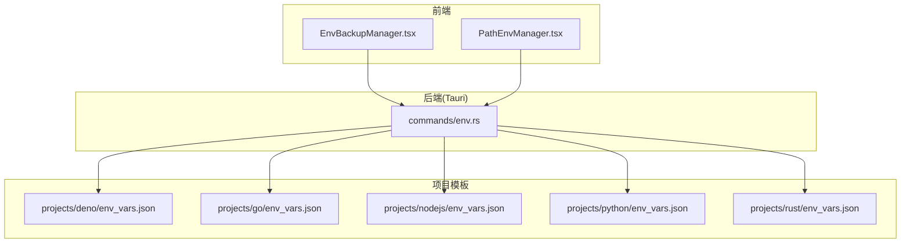
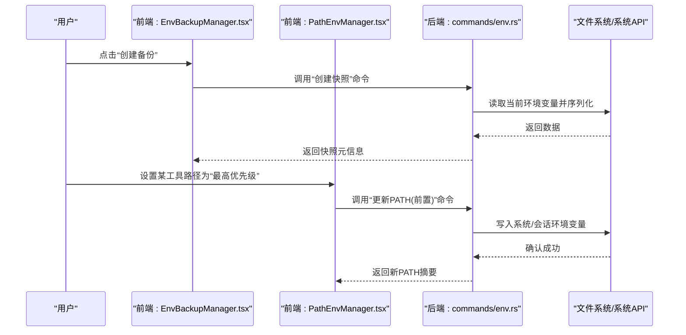
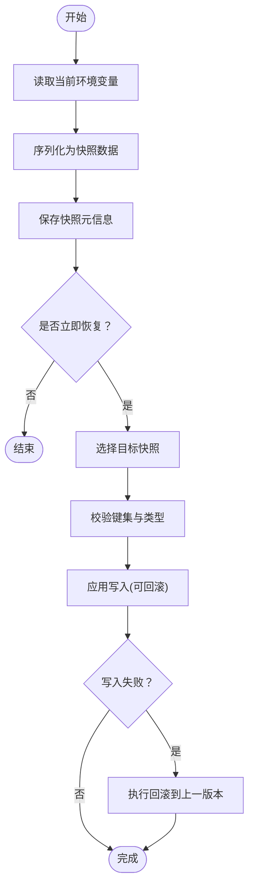
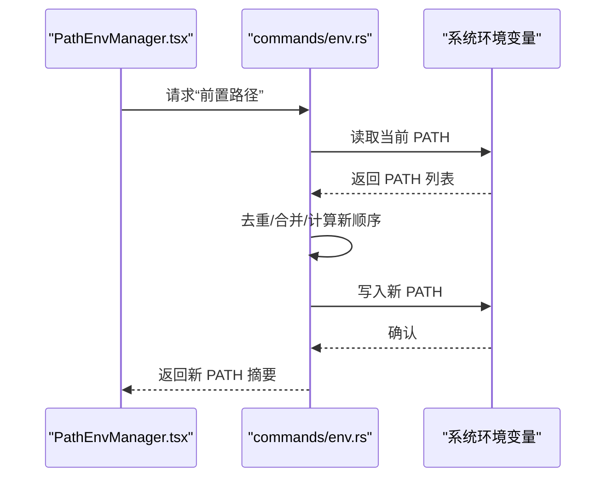
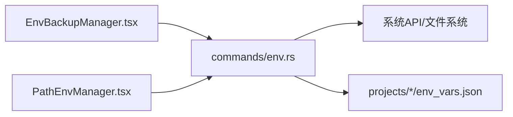

# 环境变量管理

<cite>
**本文引用的文件**   
- [src/components/EnvBackupManager.tsx](file://src/components/EnvBackupManager.tsx)
- [src/components/PathEnvManager.tsx](file://src/components/PathEnvManager.tsx)
- [src-tauri/src/commands/env.rs](file://src-tauri/src/commands/env.rs)
- [projects/deno/env_vars.json](file://projects/deno/env_vars.json)
- [projects/go/env_vars.json](file://projects/go/env_vars.json)
- [projects/nodejs/env_vars.json](file://projects/nodejs/env_vars.json)
- [projects/python/env_vars.json](file://projects/python/env_vars.json)
- [projects/rust/env_vars.json](file://projects/rust/env_vars.json)
</cite>

## 目录
1. [简介](#简介)
2. [项目结构](#项目结构)
3. [核心组件](#核心组件)
4. [架构总览](#架构总览)
5. [详细组件分析](#详细组件分析)
6. [依赖关系分析](#依赖关系分析)
7. [性能与一致性](#性能与一致性)
8. [故障排查指南](#故障排查指南)
9. [结论](#结论)
10. [附录](#附录)

## 简介
本章节面向初学者与高级用户，系统化阐述本项目的环境变量管理能力，包括：
- 环境变量的备份、恢复与同步机制
- PATH 环境变量管理（添加、删除、优先级）
- 不同操作系统差异与兼容性处理
- 导入导出格式与批量操作
- 环境变量模板与项目管理集成
- 环境隔离与虚拟环境支持
- 自动化脚本与环境一致性保障方案

## 项目结构
围绕环境变量管理的代码主要分布在以下位置：
- 前端界面层：用于可视化管理与交互
  - src/components/EnvBackupManager.tsx
  - src/components/PathEnvManager.tsx
- 后端命令层（Tauri/Rust）：提供系统级能力（读取、写入、持久化等）
  - src-tauri/src/commands/env.rs
- 项目级环境变量模板：各技术栈的默认或推荐配置
  - projects/<lang>/env_vars.json

图表来源
- [src/components/EnvBackupManager.tsx](file://src/components/EnvBackupManager.tsx)
- [src/components/PathEnvManager.tsx](file://src/components/PathEnvManager.tsx)
- [src-tauri/src/commands/env.rs](file://src-tauri/src/commands/env.rs)
- [projects/deno/env_vars.json](file://projects/deno/env_vars.json)
- [projects/go/env_vars.json](file://projects/go/env_vars.json)
- [projects/nodejs/env_vars.json](file://projects/nodejs/env_vars.json)
- [projects/python/env_vars.json](file://projects/python/env_vars.json)
- [projects/rust/env_vars.json](file://projects/rust/env_vars.json)

章节来源
- [src/components/EnvBackupManager.tsx](file://src/components/EnvBackupManager.tsx)
- [src/components/PathEnvManager.tsx](file://src/components/PathEnvManager.tsx)
- [src-tauri/src/commands/env.rs](file://src-tauri/src/commands/env.rs)

## 核心组件
- 环境变量备份管理器（EnvBackupManager）
  - 负责环境快照的创建、列表查看、选择恢复、清理旧快照等
  - 通过调用后端命令完成跨平台读写与持久化
- PATH 环境变量管理器（PathEnvManager）
  - 提供路径的增删改查、排序与优先级控制
  - 支持按项目上下文动态调整 PATH，避免全局污染
- 后端环境变量命令（env.rs）
  - 封装系统 API，统一处理 Windows/Linux/macOS 差异
  - 提供读取、写入、追加、前置、去重、排序等原子操作
  - 暴露导入/导出接口，支持 JSON 格式的批量操作

章节来源
- [src/components/EnvBackupManager.tsx](file://src/components/EnvBackupManager.tsx)
- [src/components/PathEnvManager.tsx](file://src/components/PathEnvManager.tsx)
- [src-tauri/src/commands/env.rs](file://src-tauri/src/commands/env.rs)

## 架构总览
整体采用“前端 UI + 后端命令”的分层架构。前端负责交互与状态展示，后端命令负责系统级访问与持久化。项目模板位于 projects 目录下，供快速初始化或应用标准环境。

图表来源
- [src/components/EnvBackupManager.tsx](file://src/components/EnvBackupManager.tsx)
- [src/components/PathEnvManager.tsx](file://src/components/PathEnvManager.tsx)
- [src-tauri/src/commands/env.rs](file://src-tauri/src/commands/env.rs)

## 详细组件分析

### 环境变量备份与恢复
- 功能要点
  - 快照命名与时间戳：便于回溯与对比
  - 增量与全量策略：可按需仅记录变更项或完整镜像
  - 恢复流程：校验目标键集、幂等写入、失败回滚
  - 清理策略：保留最近 N 份，自动删除过期快照
- 关键流程（流程图）

章节来源
- [src/components/EnvBackupManager.tsx](file://src/components/EnvBackupManager.tsx)
- [src-tauri/src/commands/env.rs](file://src-tauri/src/commands/env.rs)

### PATH 环境变量管理
- 能力清单
  - 添加路径：追加或前置
  - 删除路径：精确匹配或模糊匹配
  - 去重与排序：保证唯一性与稳定顺序
  - 优先级控制：将常用 SDK/工具置于更靠前位置
- 典型操作时序（以“前置某路径”为例）

章节来源
- [src/components/PathEnvManager.tsx](file://src/components/PathEnvManager.tsx)
- [src-tauri/src/commands/env.rs](file://src-tauri/src/commands/env.rs)

### 导入/导出与批量操作
- 导出
  - 将当前环境变量导出为 JSON，包含键值对与可选注释/分组
  - 支持选择性导出（如仅导出与 PATH 相关的条目）
- 导入
  - 解析 JSON，校验键名与值类型
  - 支持覆盖、合并、冲突提示三种策略
  - 批量写入时具备事务性语义（全部成功或全部回滚）
- 建议的 JSON 结构（概念说明）
  - 顶层对象：键名为环境变量名，值为字符串或结构化对象（含 value、priority、scope 等）
  - 可选字段：comment、group、platforms（限定生效平台）

章节来源
- [src-tauri/src/commands/env.rs](file://src-tauri/src/commands/env.rs)

### 环境变量模板与项目管理集成
- 模板位置
  - projects/<语言>/env_vars.json
- 用途
  - 为新项目快速注入推荐的环境变量（如 SDK 路径、代理、缓存目录等）
  - 作为团队基线，确保一致的开发体验
- 使用方式
  - 在创建或打开项目时，根据项目类型加载对应模板
  - 允许用户自定义覆盖项，最终合并生成项目级环境

章节来源
- [projects/deno/env_vars.json](file://projects/deno/env_vars.json)
- [projects/go/env_vars.json](file://projects/go/env_vars.json)
- [projects/nodejs/env_vars.json](file://projects/nodejs/env_vars.json)
- [projects/python/env_vars.json](file://projects/python/env_vars.json)
- [projects/rust/env_vars.json](file://projects/rust/env_vars.json)

### 环境隔离与虚拟环境支持
- 进程级隔离
  - 在子进程启动前注入环境变量，不影响父进程
- 会话级隔离
  - 针对当前终端会话生效，关闭后失效
- 项目级隔离
  - 基于项目根目录的环境变量集合，随项目切换而切换
- 与语言生态集成
  - Python venv、Node nvm/fnm、Go modules、Rust toolchain 等可通过 PATH 与专用变量协同工作

章节来源
- [src-tauri/src/commands/env.rs](file://src-tauri/src/commands/env.rs)

## 依赖关系分析
- 组件耦合
  - 前端两个管理器均依赖后端 env 命令，形成稳定的契约边界
  - 后端命令依赖系统 API 与文件系统，屏蔽平台差异
- 外部依赖
  - 操作系统环境变量存储机制（Windows 注册表/系统服务；Linux/macOS shell 配置文件）
  - 项目模板 JSON 文件的解析与合并逻辑

图表来源
- [src/components/EnvBackupManager.tsx](file://src/components/EnvBackupManager.tsx)
- [src/components/PathEnvManager.tsx](file://src/components/PathEnvManager.tsx)
- [src-tauri/src/commands/env.rs](file://src-tauri/src/commands/env.rs)

## 性能与一致性
- 性能
  - 批量写入采用最小化 I/O 与内存中合并策略，减少系统调用次数
  - PATH 去重与排序在内存中进行，避免频繁磁盘写入
- 一致性
  - 导入/导出采用幂等操作，重复执行不改变最终状态
  - 恢复流程具备回滚能力，失败时尽量保持原状
- 可靠性
  - 写入前进行预检（权限、路径存在性、格式校验）
  - 关键操作记录日志，便于审计与排障

[本节为通用指导，无需列出具体文件来源]

## 故障排查指南
- 常见问题
  - 写入失败：检查权限与目标作用域（用户/系统）
  - 路径未生效：确认是否在正确的会话/进程中查看
  - 导入冲突：优先使用“合并”模式，逐项确认覆盖
- 定位步骤
  - 查看最近一次备份快照，对比差异
  - 使用导出功能获取当前环境，人工核对关键字段
  - 逐步缩小范围，先恢复至已知良好状态，再增量应用变更

章节来源
- [src/components/EnvBackupManager.tsx](file://src/components/EnvBackupManager.tsx)
- [src-tauri/src/commands/env.rs](file://src-tauri/src/commands/env.rs)

## 结论
本项目通过前后端协作与模板化工程实践，提供了完善的环境变量管理能力。借助备份恢复、PATH 精细化控制、导入导出与项目集成，既能满足初学者的易用需求，也能支撑高级用户的自动化与一致性要求。

[本节为总结性内容，无需列出具体文件来源]

## 附录

### 基础概念与常用操作（初学者）
- 什么是环境变量
  - 操作系统或进程运行时的键值对配置，影响程序行为
- 常见变量
  - PATH：可执行文件搜索路径
  - HOME/USERPROFILE：用户主目录
  - LANG/LC_ALL：本地化设置
- 常用操作
  - 查看当前值、临时修改（仅当前会话）、永久修改（写入配置文件）

[本节为概念性内容，无需列出具体文件来源]

### 自动化与一致性保障（高级用户）
- 在 CI/CD 中注入必要环境变量，确保构建与测试一致
- 使用导出/导入实现多机环境对齐
- 结合项目模板，在新仓库初始化时一键拉起标准开发环境

[本节为通用指导，无需列出具体文件来源]