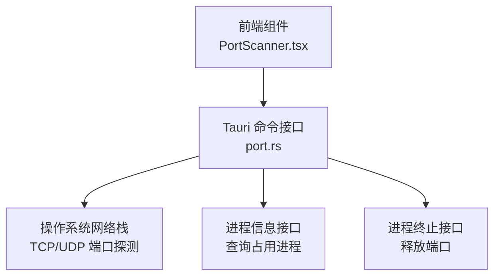
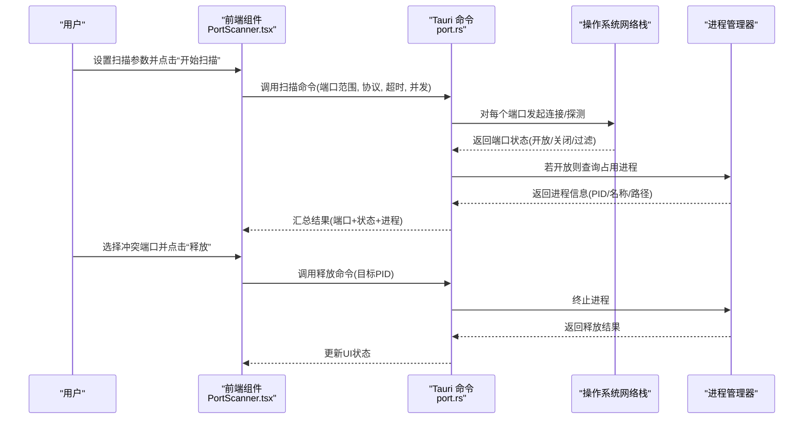
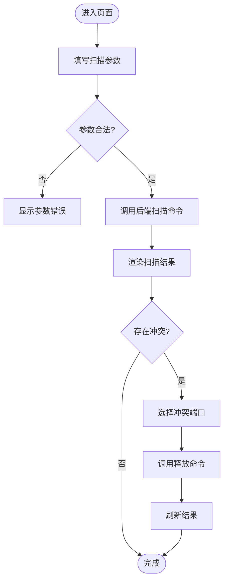
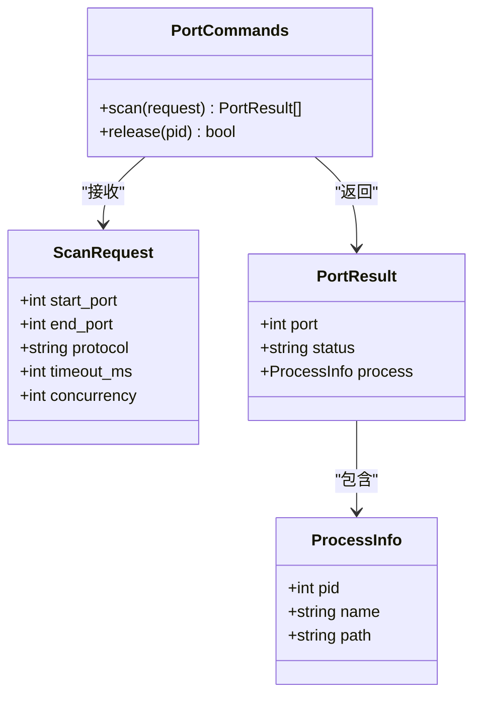
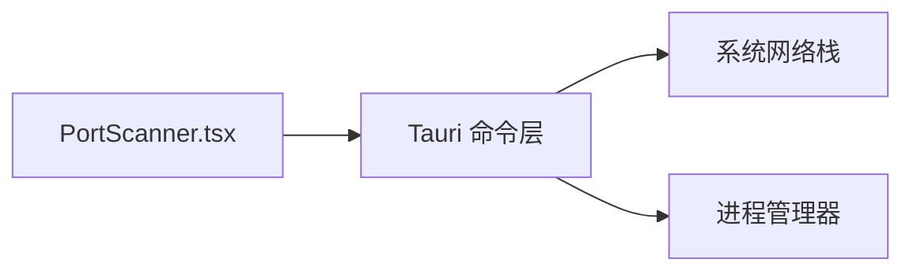

# 端口扫描器

<cite>
**本文引用的文件**   
- [PortScanner.tsx](file://src/components/PortScanner.tsx)
- [port.rs](file://src-tauri/src/commands/port.rs)
</cite>

## 目录
1. [简介](#简介)
2. [项目结构](#项目结构)
3. [核心组件](#核心组件)
4. [架构总览](#架构总览)
5. [详细组件分析](#详细组件分析)
6. [依赖关系分析](#依赖关系分析)
7. [性能考虑](#性能考虑)
8. [故障排查指南](#故障排查指南)
9. [结论](#结论)
10. [附录](#附录)

## 简介
本章节面向初学者与高级用户，系统化介绍“端口扫描器”功能：包括本地端口检测、端口占用查询、端口释放操作；详细说明扫描配置（范围、超时、并发）、状态判断逻辑与结果展示方式；文档化端口冲突检测与自动解决策略；提供开发环境管理、服务启动前检查等实际使用示例；并给出性能优化建议与最佳实践。

## 项目结构
端口扫描器由前端界面与后端命令两部分组成：
- 前端：React 组件负责交互、参数输入、结果展示与错误提示。
- 后端：Tauri 命令实现系统级端口探测、进程信息查询与端口释放能力。

图表来源
- [PortScanner.tsx](file://src/components/PortScanner.tsx)
- [port.rs](file://src-tauri/src/commands/port.rs)

章节来源
- [PortScanner.tsx](file://src/components/PortScanner.tsx)
- [port.rs](file://src-tauri/src/commands/port.rs)

## 核心组件
- 前端组件 PortScanner.tsx
  - 职责：渲染扫描表单（端口范围、协议、超时、并发），调用后端命令，展示扫描结果与冲突告警，触发端口释放流程。
  - 关键交互：开始扫描、停止扫描、导出结果、一键释放冲突端口。
- 后端命令 port.rs
  - 职责：暴露 Tauri 命令，执行端口探测、获取占用进程、尝试释放端口；返回结构化结果供前端展示。

章节来源
- [PortScanner.tsx](file://src/components/PortScanner.tsx)
- [port.rs](file://src-tauri/src/commands/port.rs)

## 架构总览
整体采用前后端分离的桌面应用架构：前端通过 Tauri 桥接调用 Rust 后端命令，后端利用系统能力完成端口探测与进程管理。

图表来源
- [PortScanner.tsx](file://src/components/PortScanner.tsx)
- [port.rs](file://src-tauri/src/commands/port.rs)

## 详细组件分析

### 前端组件 PortScanner.tsx
- 功能要点
  - 参数面板：端口范围（起始/结束）、协议（TCP/UDP）、超时（毫秒）、并发数。
  - 扫描控制：开始/停止、进度反馈、结果列表、冲突高亮。
  - 冲突处理：选中冲突项后调用释放命令，支持批量释放。
  - 结果展示：表格形式列出端口、状态、进程名、PID、路径；支持筛选与排序。
- 交互流程
  - 用户输入参数 → 校验 → 调用后端扫描 → 渲染结果 → 用户选择冲突 → 调用释放 → 刷新结果。
- 错误处理
  - 参数非法提示、网络不可用提示、权限不足提示、释放失败重试或回滚。

图表来源
- [PortScanner.tsx](file://src/components/PortScanner.tsx)

章节来源
- [PortScanner.tsx](file://src/components/PortScanner.tsx)

### 后端命令 port.rs
- 能力边界
  - 端口探测：基于 TCP/UDP 的系统调用进行连通性测试。
  - 进程查询：根据端口映射获取 PID、进程名与可执行路径。
  - 端口释放：向指定 PID 发送终止信号，必要时提升权限。
- 数据结构
  - 扫描请求：包含端口范围、协议、超时、并发等字段。
  - 扫描响应：端口号、状态（开放/关闭/过滤）、进程信息（可选）。
- 并发与超时
  - 并发控制：限制同时探测的端口数量，避免系统资源耗尽。
  - 超时机制：单个端口探测超时后标记为“未响应”，不影响其他端口。
- 错误与幂等
  - 释放命令具备幂等性：重复释放不会报错，但会记录日志。
  - 权限不足时返回明确错误码，便于前端提示。

图表来源
- [port.rs](file://src-tauri/src/commands/port.rs)

章节来源
- [port.rs](file://src-tauri/src/commands/port.rs)

## 依赖关系分析
- 前端依赖
  - React 生态：组件状态管理、事件处理、UI 渲染。
  - Tauri 客户端：调用 Rust 命令、处理异步回调。
- 后端依赖
  - Tauri 框架：命令注册、序列化/反序列化。
  - 系统库：网络栈（socket 探测）、进程管理（psutil 等价能力）。
- 耦合与内聚
  - 前后端通过稳定的命令接口解耦，变更内部实现不影响前端。
  - 后端将端口探测、进程查询、释放逻辑集中在同一模块，提高内聚性。

图表来源
- [PortScanner.tsx](file://src/components/PortScanner.tsx)
- [port.rs](file://src-tauri/src/commands/port.rs)

章节来源
- [PortScanner.tsx](file://src/components/PortScanner.tsx)
- [port.rs](file://src-tauri/src/commands/port.rs)

## 性能考虑
- 并发控制
  - 合理设置并发数：过小导致扫描慢，过大可能触发系统限流或防火墙拦截。
  - 推荐默认值：小范围扫描并发 50–200，大范围扫描并发 10–50。
- 超时设置
  - 单端口超时建议 100–500ms，结合网络质量调整。
  - 全局超时用于保护长时间挂起的任务。
- I/O 与内存
  - 分批拉取结果，避免一次性加载大量数据造成 UI 卡顿。
  - 结果分页或虚拟滚动，减少 DOM 节点数量。
- 平台差异
  - Windows 下可能需要管理员权限才能释放端口。
  - macOS/Linux 下 UDP 探测能力有限，需降级为 TCP 探测或忽略 UDP。

[本节为通用性能指导，不直接分析具体文件]

## 故障排查指南
- 常见问题
  - 权限不足：释放端口失败，提示需要管理员/Root 权限。
  - 防火墙拦截：端口被标记为“过滤”，无法确定是否开放。
  - 进程无响应：终止信号无效，需强制终止或手动处理。
- 定位步骤
  - 检查扫描参数是否合法（端口范围、协议、超时、并发）。
  - 查看后端日志确认系统调用是否成功。
  - 使用系统工具验证端口状态（如 netstat、lsof、Get-NetTCPConnection）。
- 恢复策略
  - 重试释放：短暂休眠后再次尝试。
  - 切换协议：从 UDP 切换到 TCP 重新探测。
  - 降低并发：避免系统资源争用。

章节来源
- [port.rs](file://src-tauri/src/commands/port.rs)
- [PortScanner.tsx](file://src/components/PortScanner.tsx)

## 结论
端口扫描器通过清晰的前后端分工与稳定的命令接口，实现了可靠的本地端口检测、占用查询与释放能力。合理的并发与超时配置、完善的错误处理与幂等设计，使其适用于开发环境管理与自动化流水线。建议在生产环境中谨慎使用释放功能，并结合审计日志确保操作可追溯。

[本节为总结性内容，不直接分析具体文件]

## 附录

### 基础概念（初学者）
- 端口：主机上用于区分不同服务的数字标识，常见范围 0–65535。
- TCP vs UDP：TCP 可靠连接，适合大多数服务；UDP 无连接，常用于音视频与 DNS。
- 端口状态：开放（可连接）、关闭（拒绝连接）、过滤（被防火墙拦截）。

[本节为概念性内容，不直接分析具体文件]

### 配置选项说明
- 扫描范围：起始端口与结束端口，建议按业务常用段划分。
- 协议选择：优先 TCP，必要时启用 UDP。
- 超时设置：单端口探测超时与全局超时。
- 并发控制：同时探测的端口数量，依据系统负载调整。

章节来源
- [PortScanner.tsx](file://src/components/PortScanner.tsx)
- [port.rs](file://src-tauri/src/commands/port.rs)

### 使用示例
- 开发环境端口管理
  - 启动前扫描常用端口（如 3000、8080、5432），发现冲突后自动释放。
- 服务启动前检查
  - 在 CI/CD 中预检端口可用性，失败则中止构建并输出报告。
- 批量操作
  - 读取配置文件中的端口清单，批量扫描并生成冲突报告。

章节来源
- [PortScanner.tsx](file://src/components/PortScanner.tsx)
- [port.rs](file://src-tauri/src/commands/port.rs)

### 自定义扫描规则与批量操作（高级用户）
- 自定义规则
  - 扩展协议支持（如 SCTP，视系统能力而定）。
  - 增加健康检查：对开放端口附加 HTTP 探针或握手验证。
- 批量操作
  - 通过脚本驱动 Tauri 命令，实现跨主机扫描与结果聚合。
  - 结合定时任务定期巡检端口占用情况。

章节来源
- [port.rs](file://src-tauri/src/commands/port.rs)