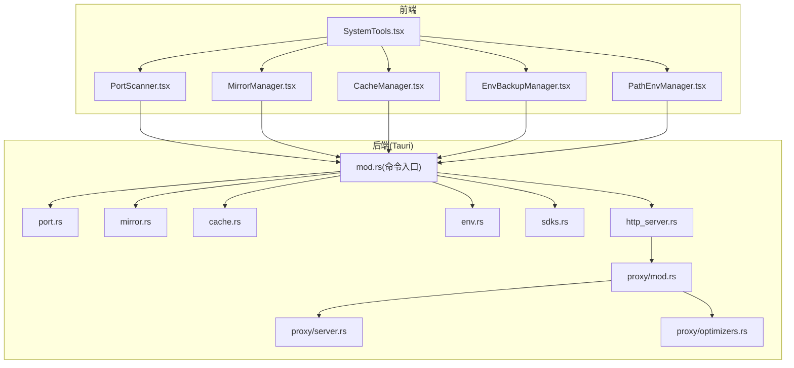
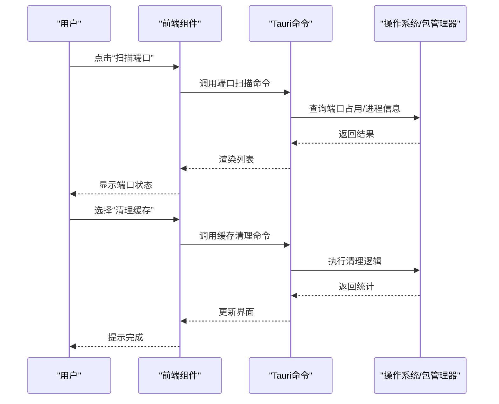
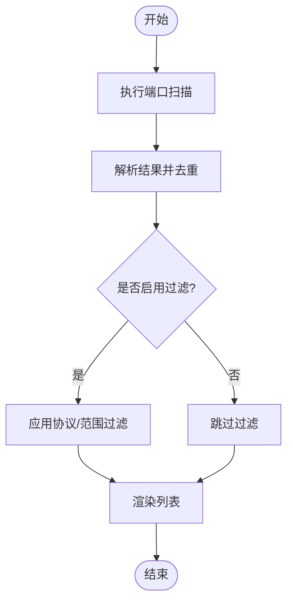
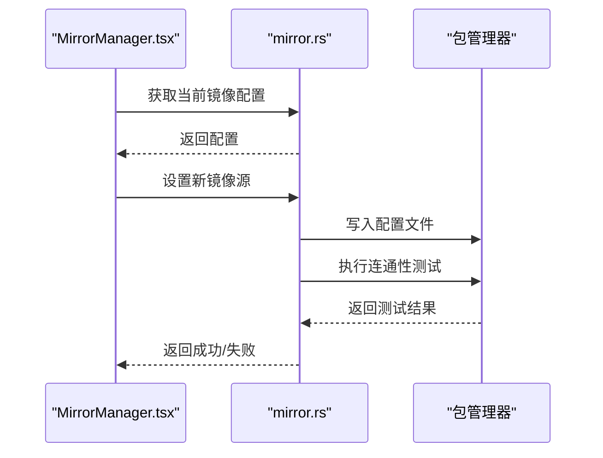
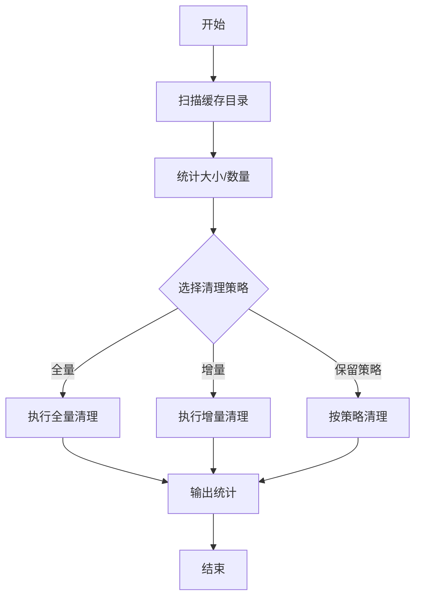
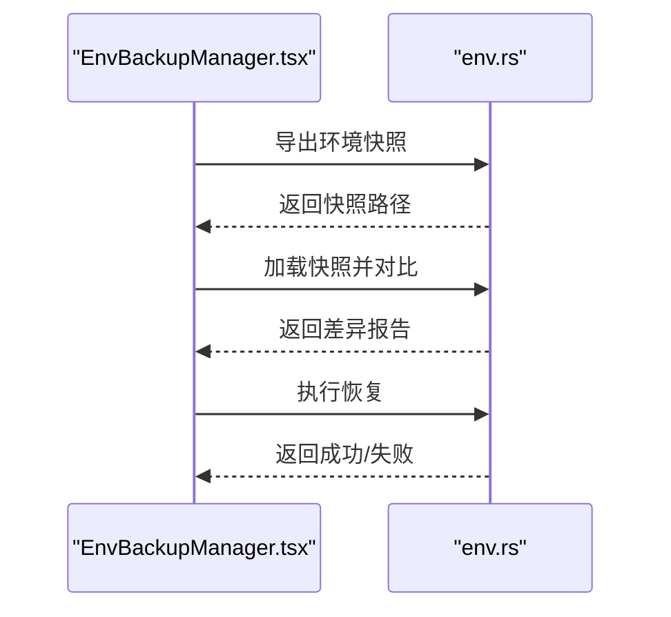
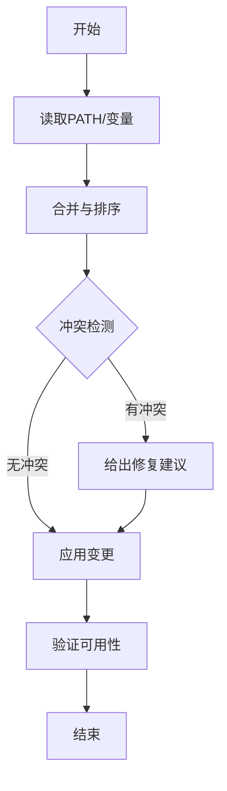
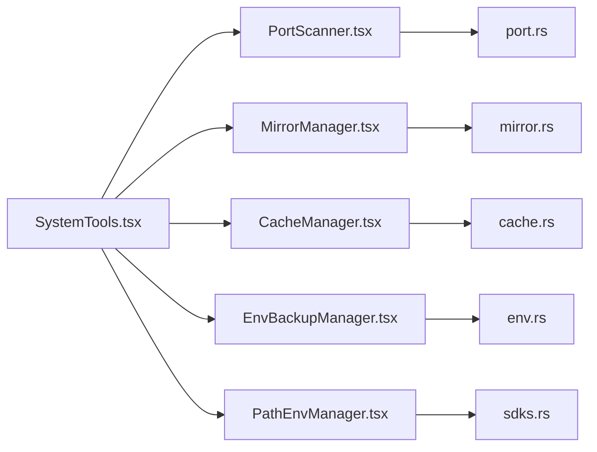

# 系统工具

<cite>
**本文引用的文件**   
- [src/components/PortScanner.tsx](file://src/components/PortScanner.tsx)
- [src-tauri/src/commands/port.rs](file://src-tauri/src/commands/port.rs)
- [src/components/MirrorManager.tsx](file://src/components/MirrorManager.tsx)
- [src-tauri/src/commands/mirror.rs](file://src-tauri/src/commands/mirror.rs)
- [src/components/CacheManager.tsx](file://src/components/CacheManager.tsx)
- [src-tauri/src/commands/cache.rs](file://src-tauri/src/commands/cache.rs)
- [src/components/EnvBackupManager.tsx](file://src/components/EnvBackupManager.tsx)
- [src-tauri/src/commands/env.rs](file://src-tauri/src/commands/env.rs)
- [src/components/PathEnvManager.tsx](file://src/components/PathEnvManager.tsx)
- [src-tauri/src/commands/sdks.rs](file://src-tauri/src/commands/sdks.rs)
- [src/components/SystemTools.tsx](file://src/components/SystemTools.tsx)
- [src-tauri/src/proxy/mod.rs](file://src-tauri/src/proxy/mod.rs)
- [src-tauri/src/proxy/server.rs](file://src-tauri/src/proxy/server.rs)
- [src-tauri/src/proxy/optimizers.rs](file://src-tauri/src/proxy/optimizers.rs)
- [src-tauri/src/commands/http_server.rs](file://src-tauri/src/commands/http_server.rs)
</cite>

## 目录
1. [简介](#简介)
2. [项目结构](#项目结构)
3. [核心组件](#核心组件)
4. [架构总览](#架构总览)
5. [详细组件分析](#详细组件分析)
6. [依赖关系分析](#依赖关系分析)
7. [性能考虑](#性能考虑)
8. [故障排查指南](#故障排查指南)
9. [结论](#结论)
10. [附录：使用示例与配置模板](#附录使用示例与配置模板)

## 简介
本章节面向“系统工具”模块，聚焦以下能力：
- 端口扫描与管理：快速检测本机端口占用、释放或绑定策略。
- 镜像源配置与管理：统一维护 npm、pip、cargo 等包管理器的镜像设置。
- 缓存管理与优化：集中清理、查看与优化各类缓存（构建产物、下载缓存等）。
- 环境变量备份与恢复：安全导出/导入环境配置，支持差异对比与回滚。
- 路径与环境变量管理：便捷维护 PATH 及常用环境变量，避免冲突。
- 网络代理配置与优化：提供本地代理能力与传输层优化选项。
- 协作关系与数据流：说明前端 UI 与后端命令的交互方式。
- 初学者入门与高级优化：提供从基础到进阶的使用指导与调优建议。

## 项目结构
系统工具采用前后端分离架构：
- 前端 React 组件负责用户交互与可视化展示。
- 后端 Tauri 命令暴露系统级能力（端口、镜像、缓存、环境变量、代理等）。
- 各功能以“组件 + 命令”成对组织，便于扩展与维护。



图表来源
- [src/components/SystemTools.tsx](file://src/components/SystemTools.tsx)
- [src/components/PortScanner.tsx](file://src/components/PortScanner.tsx)
- [src/components/MirrorManager.tsx](file://src/components/MirrorManager.tsx)
- [src/components/CacheManager.tsx](file://src/components/CacheManager.tsx)
- [src/components/EnvBackupManager.tsx](file://src/components/EnvBackupManager.tsx)
- [src/components/PathEnvManager.tsx](file://src/components/PathEnvManager.tsx)
- [src-tauri/src/commands/mod.rs](file://src-tauri/src/commands/mod.rs)
- [src-tauri/src/commands/port.rs](file://src-tauri/src/commands/port.rs)
- [src-tauri/src/commands/mirror.rs](file://src-tauri/src/commands/mirror.rs)
- [src-tauri/src/commands/cache.rs](file://src-tauri/src/commands/cache.rs)
- [src-tauri/src/commands/env.rs](file://src-tauri/src/commands/env.rs)
- [src-tauri/src/commands/sdks.rs](file://src-tauri/src/commands/sdks.rs)
- [src-tauri/src/commands/http_server.rs](file://src-tauri/src/commands/http_server.rs)
- [src-tauri/src/proxy/mod.rs](file://src-tauri/src/proxy/mod.rs)
- [src-tauri/src/proxy/server.rs](file://src-tauri/src/proxy/server.rs)
- [src-tauri/src/proxy/optimizers.rs](file://src-tauri/src/proxy/optimizers.rs)

章节来源
- [src/components/SystemTools.tsx](file://src/components/SystemTools.tsx)
- [src-tauri/src/commands/mod.rs](file://src-tauri/src/commands/mod.rs)

## 核心组件
本节概述系统工具的核心能力与职责边界，帮助读者建立整体认知。

- 端口扫描与管理
  - 能力：扫描本机端口占用、列出进程信息、尝试释放或重新绑定。
  - 适用场景：服务启动失败、端口冲突排查、自动化部署前检查。
- 镜像源配置与管理
  - 能力：为 npm、pip、cargo 等包管理器设置/切换/验证镜像源。
  - 适用场景：加速下载、内网镜像、多团队统一配置。
- 缓存管理与优化
  - 能力：查看缓存大小、分类清理、增量清理、保留策略。
  - 适用场景：磁盘空间回收、CI 加速、构建稳定性提升。
- 环境变量备份与恢复
  - 能力：导出当前环境、生成差异报告、一键恢复、版本化快照。
  - 适用场景：环境迁移、回滚、审计合规。
- 路径与环境变量管理
  - 能力：维护 PATH、常用变量、冲突检测与修复。
  - 适用场景：多 SDK 共存、跨平台一致性。
- 网络代理配置与优化
  - 能力：本地代理启停、转发规则、连接池与重试优化。
  - 适用场景：受限网络、调试抓包、加速访问。

章节来源
- [src/components/PortScanner.tsx](file://src/components/PortScanner.tsx)
- [src-tauri/src/commands/port.rs](file://src-tauri/src/commands/port.rs)
- [src/components/MirrorManager.tsx](file://src/components/MirrorManager.tsx)
- [src-tauri/src/commands/mirror.rs](file://src-tauri/src/commands/mirror.rs)
- [src/components/CacheManager.tsx](file://src/components/CacheManager.tsx)
- [src-tauri/src/commands/cache.rs](file://src-tauri/src/commands/cache.rs)
- [src/components/EnvBackupManager.tsx](file://src/components/EnvBackupManager.tsx)
- [src-tauri/src/commands/env.rs](file://src-tauri/src/commands/env.rs)
- [src/components/PathEnvManager.tsx](file://src/components/PathEnvManager.tsx)
- [src-tauri/src/commands/sdks.rs](file://src-tauri/src/commands/sdks.rs)
- [src-tauri/src/proxy/mod.rs](file://src-tauri/src/proxy/mod.rs)
- [src-tauri/src/proxy/server.rs](file://src-tauri/src/proxy/server.rs)
- [src-tauri/src/proxy/optimizers.rs](file://src-tauri/src/proxy/optimizers.rs)

## 架构总览
系统工具通过 Tauri 将前端操作映射到系统命令，形成“UI -> 命令 -> 系统资源”的调用链。



图表来源
- [src/components/PortScanner.tsx](file://src/components/PortScanner.tsx)
- [src-tauri/src/commands/port.rs](file://src-tauri/src/commands/port.rs)
- [src/components/CacheManager.tsx](file://src/components/CacheManager.tsx)
- [src-tauri/src/commands/cache.rs](file://src-tauri/src/commands/cache.rs)

## 详细组件分析

### 端口扫描与管理
- 功能要点
  - 扫描本机端口占用情况，展示进程与用途。
  - 支持按协议/端口范围过滤。
  - 提供释放或重新绑定的辅助能力（需权限）。
- 关键流程
  - 前端发起扫描请求 -> 后端执行系统查询 -> 返回结构化结果 -> 前端渲染。
- 注意事项
  - 某些端口需要管理员权限才能释放。
  - 大量端口扫描时建议分页或分批处理。



图表来源
- [src/components/PortScanner.tsx](file://src/components/PortScanner.tsx)
- [src-tauri/src/commands/port.rs](file://src-tauri/src/commands/port.rs)

章节来源
- [src/components/PortScanner.tsx](file://src/components/PortScanner.tsx)
- [src-tauri/src/commands/port.rs](file://src-tauri/src/commands/port.rs)

### 镜像源配置与管理
- 功能要点
  - 统一管理 npm、pip、cargo 等包管理器的镜像源。
  - 支持切换、验证连通性、批量应用。
- 关键流程
  - 选择目标包管理器 -> 读取当前配置 -> 写入新镜像源 -> 验证连通性 -> 保存生效。
- 最佳实践
  - 优先使用企业内网镜像；必要时开启超时与重试。
  - 变更镜像后建议清理对应缓存以提升命中率。



图表来源
- [src/components/MirrorManager.tsx](file://src/components/MirrorManager.tsx)
- [src-tauri/src/commands/mirror.rs](file://src-tauri/src/commands/mirror.rs)

章节来源
- [src/components/MirrorManager.tsx](file://src/components/MirrorManager.tsx)
- [src-tauri/src/commands/mirror.rs](file://src-tauri/src/commands/mirror.rs)

### 缓存管理与优化
- 功能要点
  - 汇总各工具缓存（构建、下载、临时文件）大小。
  - 支持分类清理、增量清理、保留策略。
- 关键流程
  - 扫描缓存目录 -> 计算大小与数量 -> 用户选择清理策略 -> 执行清理 -> 输出统计。
- 优化建议
  - CI 环境建议仅保留最近 N 次构建缓存。
  - 大对象缓存可结合压缩与分片策略。



图表来源
- [src/components/CacheManager.tsx](file://src/components/CacheManager.tsx)
- [src-tauri/src/commands/cache.rs](file://src-tauri/src/commands/cache.rs)

章节来源
- [src/components/CacheManager.tsx](file://src/components/CacheManager.tsx)
- [src-tauri/src/commands/cache.rs](file://src-tauri/src/commands/cache.rs)

### 环境变量备份与恢复
- 功能要点
  - 导出当前环境为快照文件，支持差异对比与一键恢复。
  - 支持选择性导出/导入，避免污染全局环境。
- 关键流程
  - 读取环境 -> 生成快照 -> 可选对比 -> 写入/恢复 -> 校验一致性。
- 注意事项
  - 敏感信息建议加密存储或限制可见性。
  - 恢复前建议创建系统还原点或备份重要配置。



图表来源
- [src/components/EnvBackupManager.tsx](file://src/components/EnvBackupManager.tsx)
- [src-tauri/src/commands/env.rs](file://src-tauri/src/commands/env.rs)

章节来源
- [src/components/EnvBackupManager.tsx](file://src/components/EnvBackupManager.tsx)
- [src-tauri/src/commands/env.rs](file://src-tauri/src/commands/env.rs)

### 路径与环境变量管理
- 功能要点
  - 维护 PATH 与常用环境变量，提供冲突检测与修复建议。
  - 支持按项目维度隔离配置。
- 关键流程
  - 读取当前 PATH/变量 -> 合并/排序 -> 冲突检测 -> 应用变更 -> 验证可用性。
- 最佳实践
  - 使用项目级配置覆盖全局配置，避免误改系统环境。
  - 变更前后进行可用性验证（如命令是否存在）。



图表来源
- [src/components/PathEnvManager.tsx](file://src/components/PathEnvManager.tsx)
- [src-tauri/src/commands/sdks.rs](file://src-tauri/src/commands/sdks.rs)

章节来源
- [src/components/PathEnvManager.tsx](file://src/components/PathEnvManager.tsx)
- [src-tauri/src/commands/sdks.rs](file://src-tauri/src/commands/sdks.rs)

### 网络代理配置与优化
- 功能要点
  - 本地代理服务启停、转发规则配置、连接池与重试优化。
  - 与 HTTP 服务器集成，提供统一的代理入口。
- 关键流程
  - 配置代理参数 -> 启动服务 -> 监听端口 -> 转发请求 -> 记录日志与指标。
- 优化建议
  - 合理设置连接池大小与超时时间。
  - 针对高延迟链路启用重试与退避策略。

```mermaid
sequenceDiagram
participant UI as "SystemTools.tsx"
participant CMD as "http_server.rs"
participant PROXY as "proxy/server.rs"
participant OPT as "proxy/optimizers.rs"
UI->>CMD : 启动/停止代理
CMD->>PROXY : 初始化代理服务
PROXY->>OPT : 加载优化策略
OPT-->>PROXY : 返回优化配置
PROXY-->>CMD : 服务就绪
CMD-->>UI : 返回状态
```

图表来源
- [src/components/SystemTools.tsx](file://src/components/SystemTools.tsx)
- [src-tauri/src/commands/http_server.rs](file://src-tauri/src/commands/http_server.rs)
- [src-tauri/src/proxy/server.rs](file://src-tauri/src/proxy/server.rs)
- [src-tauri/src/proxy/optimizers.rs](file://src-tauri/src/proxy/optimizers.rs)

章节来源
- [src-tauri/src/proxy/mod.rs](file://src-tauri/src/proxy/mod.rs)
- [src-tauri/src/proxy/server.rs](file://src-tauri/src/proxy/server.rs)
- [src-tauri/src/proxy/optimizers.rs](file://src-tauri/src/proxy/optimizers.rs)
- [src-tauri/src/commands/http_server.rs](file://src-tauri/src/commands/http_server.rs)

## 依赖关系分析
- 组件耦合
  - SystemTools 作为聚合入口，组合多个子组件。
  - 每个子组件与其对应的 Tauri 命令一一对应，降低耦合度。
- 外部依赖
  - 包管理器（npm/pip/cargo）通过命令间接调用。
  - 操作系统接口用于端口查询、环境变量读写、文件系统操作。
- 潜在风险
  - 权限不足导致端口释放失败。
  - 镜像源不可达导致安装失败。
  - 缓存清理误删重要文件。



图表来源
- [src/components/SystemTools.tsx](file://src/components/SystemTools.tsx)
- [src/components/PortScanner.tsx](file://src/components/PortScanner.tsx)
- [src/components/MirrorManager.tsx](file://src/components/MirrorManager.tsx)
- [src/components/CacheManager.tsx](file://src/components/CacheManager.tsx)
- [src/components/EnvBackupManager.tsx](file://src/components/EnvBackupManager.tsx)
- [src/components/PathEnvManager.tsx](file://src/components/PathEnvManager.tsx)
- [src-tauri/src/commands/port.rs](file://src-tauri/src/commands/port.rs)
- [src-tauri/src/commands/mirror.rs](file://src-tauri/src/commands/mirror.rs)
- [src-tauri/src/commands/cache.rs](file://src-tauri/src/commands/cache.rs)
- [src-tauri/src/commands/env.rs](file://src-tauri/src/commands/env.rs)
- [src-tauri/src/commands/sdks.rs](file://src-tauri/src/commands/sdks.rs)

章节来源
- [src/components/SystemTools.tsx](file://src/components/SystemTools.tsx)
- [src-tauri/src/commands/mod.rs](file://src-tauri/src/commands/mod.rs)

## 性能考虑
- 端口扫描
  - 使用并发与分页减少阻塞；对高频端口优先扫描。
- 镜像源
  - 启用连接复用与重试；在局域网优先使用内网镜像。
- 缓存清理
  - 增量清理优于全量；对大目录先统计再决策。
- 环境变量
  - 批量变更合并提交，减少多次写盘。
- 代理优化
  - 调整连接池大小、超时与退避策略；按需启用压缩。

[本节为通用指导，不直接分析具体文件]

## 故障排查指南
- 端口相关
  - 现象：端口被占用无法启动。
  - 排查：确认占用进程、权限不足、防火墙拦截。
- 镜像源
  - 现象：安装缓慢或失败。
  - 排查：连通性测试、证书问题、DNS 解析。
- 缓存
  - 现象：磁盘空间不足或构建不稳定。
  - 排查：清理策略不当、残留锁文件。
- 环境变量
  - 现象：命令找不到或路径冲突。
  - 排查：PATH 顺序、项目级覆盖、恢复快照。
- 代理
  - 现象：请求超时或丢包。
  - 排查：代理端口、转发规则、连接池与重试。

章节来源
- [src-tauri/src/commands/port.rs](file://src-tauri/src/commands/port.rs)
- [src-tauri/src/commands/mirror.rs](file://src-tauri/src/commands/mirror.rs)
- [src-tauri/src/commands/cache.rs](file://src-tauri/src/commands/cache.rs)
- [src-tauri/src/commands/env.rs](file://src-tauri/src/commands/env.rs)
- [src-tauri/src/commands/http_server.rs](file://src-tauri/src/commands/http_server.rs)

## 结论
系统工具通过清晰的“组件 + 命令”分层，提供了端口、镜像、缓存、环境变量、路径与代理等实用能力。遵循本文的最佳实践与优化建议，可在日常开发与运维中显著提升效率与稳定性。

[本节为总结性内容，不直接分析具体文件]

## 附录：使用示例与配置模板
以下为常见场景的操作步骤与配置思路（不含具体代码内容，请根据实际实现参考相应文件路径）：

- 端口扫描与管理
  - 操作步骤：打开“端口扫描”，选择协议与端口范围，执行扫描，查看占用详情，必要时释放端口。
  - 参考路径：[src/components/PortScanner.tsx](file://src/components/PortScanner.tsx)、[src-tauri/src/commands/port.rs](file://src-tauri/src/commands/port.rs)

- 镜像源配置与管理
  - 操作步骤：选择包管理器（npm/pip/cargo），设置镜像地址，执行连通性测试，保存并生效。
  - 参考路径：[src/components/MirrorManager.tsx](file://src/components/MirrorManager.tsx)、[src-tauri/src/commands/mirror.rs](file://src-tauri/src/commands/mirror.rs)

- 缓存管理与优化
  - 操作步骤：查看缓存统计，选择清理策略（全量/增量/保留策略），执行清理并查看结果。
  - 参考路径：[src/components/CacheManager.tsx](file://src/components/CacheManager.tsx)、[src-tauri/src/commands/cache.rs](file://src-tauri/src/commands/cache.rs)

- 环境变量备份与恢复
  - 操作步骤：导出快照，对比差异，选择恢复范围，执行恢复并验证。
  - 参考路径：[src/components/EnvBackupManager.tsx](file://src/components/EnvBackupManager.tsx)、[src-tauri/src/commands/env.rs](file://src-tauri/src/commands/env.rs)

- 路径与环境变量管理
  - 操作步骤：维护 PATH 与常用变量，检测冲突，应用变更并验证命令可用性。
  - 参考路径：[src/components/PathEnvManager.tsx](file://src/components/PathEnvManager.tsx)、[src-tauri/src/commands/sdks.rs](file://src-tauri/src/commands/sdks.rs)

- 网络代理配置与优化
  - 操作步骤：配置代理参数，启动服务，设置转发规则，观察日志与指标。
  - 参考路径：[src-tauri/src/commands/http_server.rs](file://src-tauri/src/commands/http_server.rs)、[src-tauri/src/proxy/server.rs](file://src-tauri/src/proxy/server.rs)、[src-tauri/src/proxy/optimizers.rs](file://src-tauri/src/proxy/optimizers.rs)

[本节为使用指导，不直接分析具体文件]