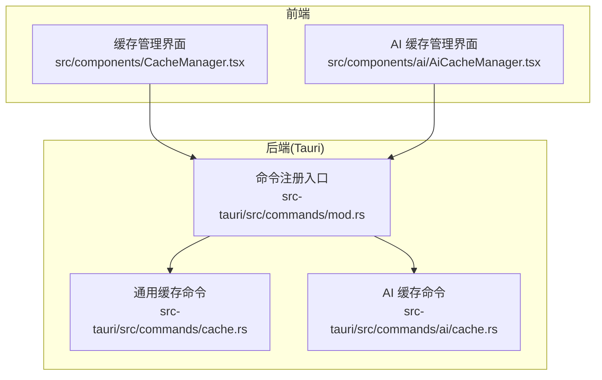
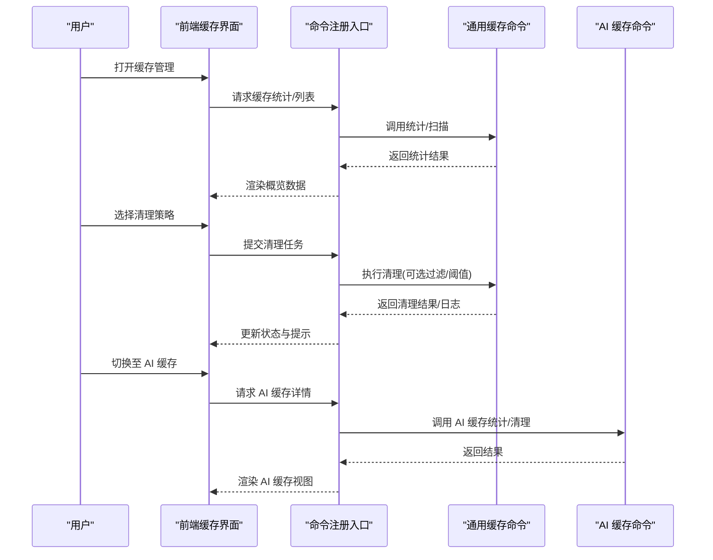
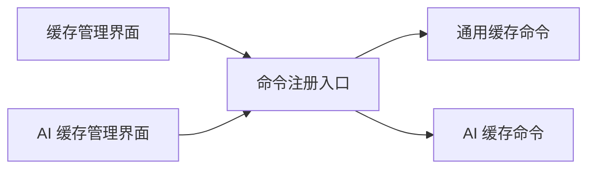
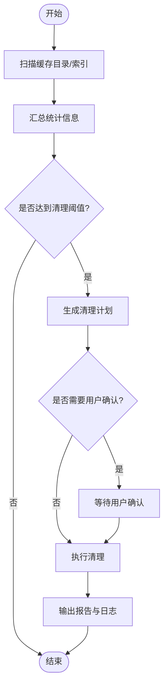

# 缓存管理器

<cite>
**本文引用的文件**   
- [src/components/CacheManager.tsx](file://src/components/CacheManager.tsx)
- [src-tauri/src/commands/cache.rs](file://src-tauri/src/commands/cache.rs)
- [src-tauri/src/commands/mod.rs](file://src-tauri/src/commands/mod.rs)
- [src/components/ai/AiCacheManager.tsx](file://src/components/ai/AiCacheManager.tsx)
- [src-tauri/src/commands/ai/cache.rs](file://src-tauri/src/commands/ai/cache.rs)
</cite>

## 目录
1. [简介](#简介)
2. [项目结构](#项目结构)
3. [核心组件](#核心组件)
4. [架构总览](#架构总览)
5. [详细组件分析](#详细组件分析)
6. [依赖分析](#依赖分析)
7. [性能考虑](#性能考虑)
8. [故障排查指南](#故障排查指南)
9. [结论](#结论)
10. [附录](#附录)

## 简介
本章节面向“缓存管理器”功能，系统性阐述应用内各类缓存的类型与用途、监控与统计、清理与优化策略、过期与自动清理机制、迁移与备份能力，以及配置调优与性能监控指标。文档同时覆盖初学者入门操作与高级用户的自定义策略和分布式缓存集成方案。

## 项目结构
缓存管理在前后端均有实现：前端提供可视化界面与交互，后端通过 Tauri 命令暴露底层能力（如扫描、统计、清理、迁移等）。

图表来源
- [src/components/CacheManager.tsx](file://src/components/CacheManager.tsx)
- [src/components/ai/AiCacheManager.tsx](file://src/components/ai/AiCacheManager.tsx)
- [src-tauri/src/commands/mod.rs](file://src-tauri/src/commands/mod.rs)
- [src-tauri/src/commands/cache.rs](file://src-tauri/src/commands/cache.rs)
- [src-tauri/src/commands/ai/cache.rs](file://src-tauri/src/commands/ai/cache.rs)

章节来源
- [src/components/CacheManager.tsx](file://src/components/CacheManager.tsx)
- [src/components/ai/AiCacheManager.tsx](file://src/components/ai/AiCacheManager.tsx)
- [src-tauri/src/commands/mod.rs](file://src-tauri/src/commands/mod.rs)
- [src-tauri/src/commands/cache.rs](file://src-tauri/src/commands/cache.rs)
- [src-tauri/src/commands/ai/cache.rs](file://src-tauri/src/commands/ai/cache.rs)

## 核心组件
- 通用缓存管理（前端）
  - 负责展示缓存概览、触发统计、执行清理、查看日志与错误提示。
  - 典型能力：列出缓存项、按类型筛选、一键清理、增量清理、导出报告。
- AI 缓存管理（前端）
  - 聚焦 AI 对话相关缓存，包括会话上下文、模型响应片段、工具调用结果等。
  - 典型能力：按会话/模型维度查看大小、清理过期或低优先级条目、导出/导入。
- 后端命令（Tauri）
  - 统一注册并暴露缓存相关的系统级能力：扫描、统计、清理、迁移、备份。
  - 将文件系统与持久化存储的访问封装为安全、可审计的命令接口。

章节来源
- [src/components/CacheManager.tsx](file://src/components/CacheManager.tsx)
- [src/components/ai/AiCacheManager.tsx](file://src/components/ai/AiCacheManager.tsx)
- [src-tauri/src/commands/mod.rs](file://src-tauri/src/commands/mod.rs)
- [src-tauri/src/commands/cache.rs](file://src-tauri/src/commands/cache.rs)
- [src-tauri/src/commands/ai/cache.rs](file://src-tauri/src/commands/ai/cache.rs)

## 架构总览
整体采用“前端 UI + Tauri 命令”的分层架构。前端通过命令通道调用后端能力，后端对磁盘与持久化进行受控访问，并提供统计、清理、迁移与备份等原子操作。

图表来源
- [src/components/CacheManager.tsx](file://src/components/CacheManager.tsx)
- [src/components/ai/AiCacheManager.tsx](file://src/components/ai/AiCacheManager.tsx)
- [src-tauri/src/commands/mod.rs](file://src-tauri/src/commands/mod.rs)
- [src-tauri/src/commands/cache.rs](file://src-tauri/src/commands/cache.rs)
- [src-tauri/src/commands/ai/cache.rs](file://src-tauri/src/commands/ai/cache.rs)

## 详细组件分析

### 通用缓存管理（前端）
- 职责
  - 聚合各模块缓存信息，提供统一的统计、清理与报告能力。
  - 支持按类型筛选、阈值控制、批量操作与进度反馈。
- 关键流程
  - 初始化：加载缓存分类、默认策略与上次使用记录。
  - 统计：调用后端统计接口，汇总容量、数量、最近访问时间等。
  - 清理：根据策略（时间、大小、频率）生成待清理清单，确认后执行。
  - 报告：输出清理摘要与异常日志，支持导出。
- 用户体验
  - 渐进式加载、失败重试、幂等清理、可撤销（若实现快照）。

章节来源
- [src/components/CacheManager.tsx](file://src/components/CacheManager.tsx)

### AI 缓存管理（前端）
- 职责
  - 针对 AI 对话场景的专用缓存：会话上下文、模型响应片段、工具调用结果、技能/模板缓存等。
  - 提供按会话、模型、时间窗口的细粒度管理与清理。
- 关键流程
  - 详情查询：按会话/模型维度拉取缓存元数据与大小分布。
  - 智能清理：基于活跃度、过期时间与配额策略剔除低价值条目。
  - 迁移/备份：导出当前会话缓存以便跨设备或版本迁移。
- 注意事项
  - 避免误删活跃会话；清理前给出影响面预览；保留必要的最小可用集。

章节来源
- [src/components/ai/AiCacheManager.tsx](file://src/components/ai/AiCacheManager.tsx)

### 后端命令：通用缓存（Tauri）
- 职责
  - 提供统一的缓存统计、扫描、清理、迁移与备份命令。
  - 对路径、权限、并发与事务性进行保护，确保数据安全。
- 典型能力
  - 统计：遍历目标目录/数据库，汇总大小、数量、最后访问时间。
  - 清理：支持按时间窗口、大小阈值、访问频率、标签等多维条件。
  - 迁移：将旧版缓存结构迁移到新版，保证兼容性与一致性。
  - 备份：打包指定缓存子树，生成校验信息，便于恢复。
- 错误处理
  - 权限不足、路径不存在、IO 异常、并发冲突等均有明确返回码与消息。

章节来源
- [src-tauri/src/commands/mod.rs](file://src-tauri/src/commands/mod.rs)
- [src-tauri/src/commands/cache.rs](file://src-tauri/src/commands/cache.rs)

### 后端命令：AI 缓存（Tauri）
- 职责
  - 面向 AI 对话数据的专用命令：会话索引、响应片段、工具结果、技能资源等。
  - 提供细粒度的统计、清理、迁移与备份能力。
- 典型能力
  - 会话级统计：按会话 ID、模型、时间范围聚合大小与命中率。
  - 智能清理：结合活跃度、过期策略与配额限制，优先清理冷数据。
  - 迁移/备份：按会话或模型维度导出/导入，支持增量与校验。
- 错误处理
  - 会话不存在、索引损坏、并发写入冲突等均有健壮的错误分支与恢复建议。

章节来源
- [src-tauri/src/commands/ai/cache.rs](file://src-tauri/src/commands/ai/cache.rs)

### 缓存类型与用途
- AI 对话缓存
  - 内容：会话上下文、模型响应片段、工具调用结果、技能/模板缓存。
  - 用途：加速多轮对话、减少重复计算、提升工具调用效率。
- 项目文件缓存
  - 内容：项目扫描结果、依赖解析、构建产物索引。
  - 用途：缩短项目加载与扫描时间，提高 IDE 体验。
- 下载缓存
  - 内容：远程资源、镜像包、离线包。
  - 用途：降低网络开销，提升安装与更新速度。
- 其他缓存
  - 内容：临时文件、日志轮转、预览缩略图等。
  - 用途：支撑运行时性能与用户体验。

[本节为概念性说明，不直接分析具体文件]

### 缓存大小统计与监控
- 统计维度
  - 总量、分类型占比、增长趋势、热点条目、最近访问时间。
- 监控指标
  - 命中率、平均延迟、I/O 吞吐、内存占用、清理耗时。
- 可视化
  - 前端以图表与列表呈现，支持排序、筛选与导出。

章节来源
- [src/components/CacheManager.tsx](file://src/components/CacheManager.tsx)
- [src/components/ai/AiCacheManager.tsx](file://src/components/ai/AiCacheManager.tsx)
- [src-tauri/src/commands/cache.rs](file://src-tauri/src/commands/cache.rs)
- [src-tauri/src/commands/ai/cache.rs](file://src-tauri/src/commands/ai/cache.rs)

### 过期策略与自动清理
- 过期策略
  - 时间窗口：按最后访问时间或创建时间判定过期。
  - 配额上限：按总量或分类型配额触发淘汰。
  - 活跃度：基于访问频率与权重进行 LRU/LFU 淘汰。
- 自动清理
  - 定时任务：后台周期性扫描与清理。
  - 事件驱动：在写入超限或启动时触发轻量清理。
- 策略组合
  - 先按时间窗口粗筛，再按配额与活跃度精排，最后执行删除。

章节来源
- [src-tauri/src/commands/cache.rs](file://src-tauri/src/commands/cache.rs)
- [src-tauri/src/commands/ai/cache.rs](file://src-tauri/src/commands/ai/cache.rs)

### 缓存迁移与数据备份
- 迁移
  - 版本升级时的结构变更适配，保证向后兼容。
  - 增量迁移与回滚预案，失败可恢复。
- 备份
  - 打包指定缓存子树，生成校验信息（如哈希），支持选择性恢复。
  - 支持导出为可读格式，便于审计与人工干预。

章节来源
- [src-tauri/src/commands/cache.rs](file://src-tauri/src/commands/cache.rs)
- [src-tauri/src/commands/ai/cache.rs](file://src-tauri/src/commands/ai/cache.rs)

### 配置调优指南
- 基础配置
  - 启用/禁用特定缓存类型、设置配额上限、调整过期时间窗口。
- 性能参数
  - 并发度、批处理大小、扫描深度、压缩开关。
- 行为开关
  - 是否允许自动清理、是否开启增量迁移、是否导出清理日志。
- 最佳实践
  - 大项目优先增大项目文件缓存配额；AI 高频会话启用更长的保留期；下载缓存开启去重与校验。

章节来源
- [src/components/CacheManager.tsx](file://src/components/CacheManager.tsx)
- [src/components/ai/AiCacheManager.tsx](file://src/components/ai/AiCacheManager.tsx)
- [src-tauri/src/commands/cache.rs](file://src-tauri/src/commands/cache.rs)
- [src-tauri/src/commands/ai/cache.rs](file://src-tauri/src/commands/ai/cache.rs)

### 性能分析与瓶颈识别
- 分析方法
  - 观察统计面板中的 I/O 峰值与清理耗时；定位热点目录与超大文件。
  - 对比不同策略下的命中率与延迟变化，评估策略有效性。
- 常见瓶颈
  - 全量扫描导致的 I/O 抖动；未命中缓存的重复计算；锁竞争与并发过高。
- 优化手段
  - 引入增量扫描与索引；合并小文件；合理设置批大小与并发；预热常用缓存。

章节来源
- [src/components/CacheManager.tsx](file://src/components/CacheManager.tsx)
- [src-tauri/src/commands/cache.rs](file://src-tauri/src/commands/cache.rs)

### 初学者操作指南
- 查看缓存概览：进入“缓存管理”，浏览总量与分类占比。
- 执行清理：选择“快速清理”或“自定义清理”，确认影响范围后执行。
- 查看 AI 缓存：切换到“AI 缓存”，按会话/模型筛选并清理低价值条目。
- 导出报告：保存统计与清理日志，便于复盘与分享。

章节来源
- [src/components/CacheManager.tsx](file://src/components/CacheManager.tsx)
- [src/components/ai/AiCacheManager.tsx](file://src/components/ai/AiCacheManager.tsx)

### 高级用户：自定义策略与分布式缓存集成
- 自定义策略
  - 扩展清理规则：基于标签、路径模式、内容指纹进行精准淘汰。
  - 动态配额：根据运行环境（开发/测试/生产）调整配额与过期时间。
- 分布式缓存集成
  - 本地作为热缓存，远端 Redis/Memcached 作为共享缓存。
  - 失效传播：本地清理时同步远端失效；远端命中时回填本地。
  - 一致性：使用版本号或哈希键避免脏读；必要时引入写扩散或读扩散。
- 安全与审计
  - 敏感数据脱敏；操作留痕；权限最小化。

[本节为概念性指导，不直接分析具体文件]

## 依赖分析
- 组件耦合
  - 前端 UI 仅依赖命令通道，解耦了具体实现细节。
  - 命令注册入口集中管理，新增缓存类型只需注册新命令。
- 外部依赖
  - 文件系统访问、序列化/反序列化、并发控制、日志与度量。
- 潜在风险
  - 长事务与高并发清理可能引发锁竞争；需分批与幂等设计。

图表来源
- [src/components/CacheManager.tsx](file://src/components/CacheManager.tsx)
- [src/components/ai/AiCacheManager.tsx](file://src/components/ai/AiCacheManager.tsx)
- [src-tauri/src/commands/mod.rs](file://src-tauri/src/commands/mod.rs)
- [src-tauri/src/commands/cache.rs](file://src-tauri/src/commands/cache.rs)
- [src-tauri/src/commands/ai/cache.rs](file://src-tauri/src/commands/ai/cache.rs)

章节来源
- [src-tauri/src/commands/mod.rs](file://src-tauri/src/commands/mod.rs)

## 性能考虑
- 扫描与统计
  - 使用增量索引与并行遍历，避免全量扫描带来的 I/O 抖动。
- 清理与迁移
  - 分批处理、事务性操作、失败重试与断点续跑。
- 内存与 CPU
  - 控制批大小与并发度，避免峰值占用过高。
- 命中率与延迟
  - 定期评估命中率与 P95/P99 延迟，针对性优化热点路径。

[本节为通用性能建议，不直接分析具体文件]

## 故障排查指南
- 常见问题
  - 权限不足导致无法读取/写入缓存目录。
  - 路径不存在或已被移动，导致统计为空或清理失败。
  - 并发清理造成锁竞争，出现超时或部分成功。
- 定位方法
  - 查看命令返回的错误码与消息；检查日志中涉及的目录与文件。
  - 复现步骤：缩小范围，单独执行某类缓存的统计/清理。
- 恢复建议
  - 从备份恢复；修复权限与路径；降低并发与批大小重试。

章节来源
- [src-tauri/src/commands/cache.rs](file://src-tauri/src/commands/cache.rs)
- [src-tauri/src/commands/ai/cache.rs](file://src-tauri/src/commands/ai/cache.rs)

## 结论
缓存管理器通过前后端协作，提供了统一的缓存监控、清理、优化、迁移与备份能力。合理的过期策略与自动清理机制能有效控制体积与提升性能。对于高级用户，可扩展自定义策略并与分布式缓存集成，以满足更大规模与更高一致性的需求。

## 附录
- 术语
  - 命中率：缓存命中次数 / 总访问次数。
  - 配额：允许占用的最大空间或条目数。
  - 增量扫描：仅扫描自上次以来发生变化的部分。
- 参考流程图（概念）
