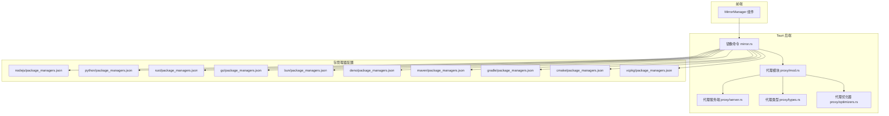
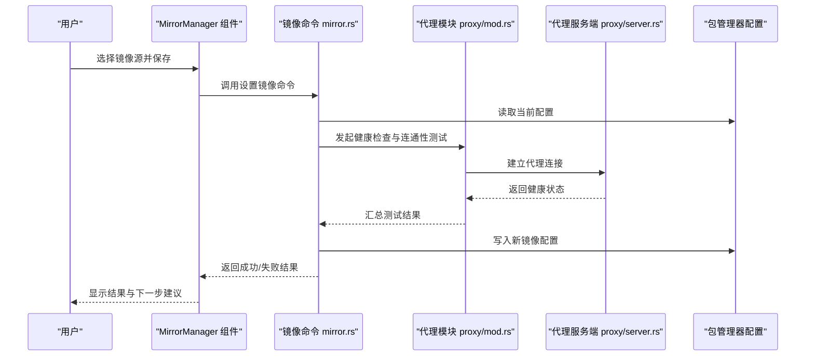
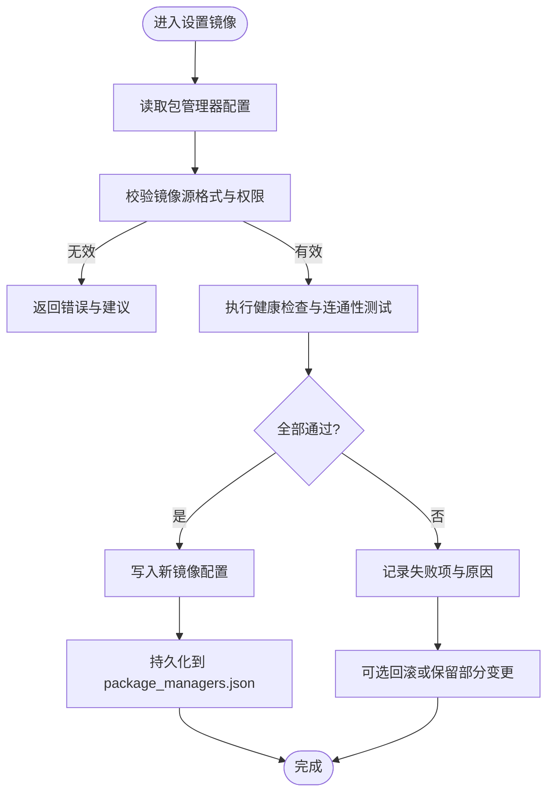
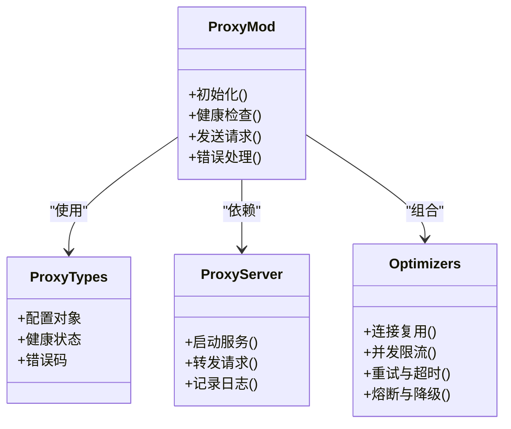
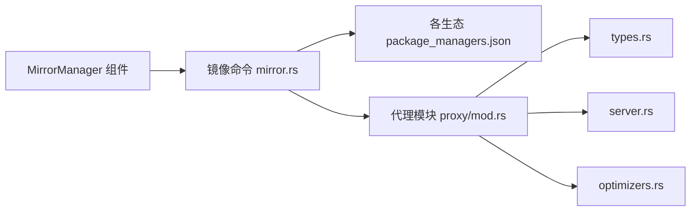

# 镜像管理器

<cite>
**本文引用的文件**   
- [src/components/MirrorManager.tsx](file://src/components/MirrorManager.tsx)
- [src-tauri/src/commands/mirror.rs](file://src-tauri/src/commands/mirror.rs)
- [src-tauri/src/proxy/mod.rs](file://src-tauri/src/proxy/mod.rs)
- [src-tauri/src/proxy/server.rs](file://src-tauri/src/proxy/server.rs)
- [src-tauri/src/proxy/types.rs](file://src-tauri/src/proxy/types.rs)
- [src-tauri/src/proxy/optimizers.rs](file://src-tauri/src/proxy/optimizers.rs)
- [projects/nodejs/package_managers.json](file://projects/nodejs/package_managers.json)
- [projects/python/package_managers.json](file://projects/python/package_managers.json)
- [projects/go/package_managers.json](file://projects/go/package_managers.json)
- [projects/rust/package_managers.json](file://projects/rust/package_managers.json)
- [projects/bun/package_managers.json](file://projects/bun/package_managers.json)
- [projects/deno/package_managers.json](file://projects/deno/package_managers.json)
- [projects/maven/package_managers.json](file://projects/maven/package_managers.json)
- [projects/gradle/package_managers.json](file://projects/gradle/package_managers.json)
- [projects/cmake/package_managers.json](file://projects/cmake/package_managers.json)
- [projects/vcpkg/package_managers.json](file://projects/vcpkg/package_managers.json)
</cite>

## 目录
1. [简介](#简介)
2. [项目结构](#项目结构)
3. [核心组件](#核心组件)
4. [架构总览](#架构总览)
5. [详细组件分析](#详细组件分析)
6. [依赖关系分析](#依赖关系分析)
7. [性能与网络优化](#性能与网络优化)
8. [故障排查指南](#故障排查指南)
9. [结论](#结论)
10. [附录：快速配置与最佳实践](#附录快速配置与最佳实践)

## 简介
本章节面向初学者与高级用户，系统性介绍“镜像管理器”的功能与能力。该功能围绕多语言包管理器的镜像源统一管理展开，覆盖 npm、pip、cargo、go mod、yarn、pnpm、bun、deno、Maven、Gradle、CMake、vcpkg 等主流生态。文档涵盖：
- 镜像源切换、测试与验证方法
- 代理配置与网络优化策略
- 健康检查与自动故障转移机制
- 企业级镜像服务器部署与私有镜像源配置示例
- 常见网络问题诊断与解决方案
- 自定义镜像规则与高可用架构设计

## 项目结构
镜像管理器由前端界面与后端命令模块组成，并通过 Tauri 桥接进行交互。关键路径如下：
- 前端 UI：MirrorManager 组件负责展示与管理镜像源
- 后端命令：mirror.rs 提供镜像相关命令（读取、写入、测试、切换）
- 代理子系统：proxy 模块提供代理、优化器、类型定义与服务端转发能力
- 包管理器配置：各项目的 package_managers.json 描述具体工具的镜像与缓存策略

图表来源
- [src/components/MirrorManager.tsx](file://src/components/MirrorManager.tsx)
- [src-tauri/src/commands/mirror.rs](file://src-tauri/src/commands/mirror.rs)
- [src-tauri/src/proxy/mod.rs](file://src-tauri/src/proxy/mod.rs)
- [src-tauri/src/proxy/server.rs](file://src-tauri/src/proxy/server.rs)
- [src-tauri/src/proxy/types.rs](file://src-tauri/src/proxy/types.rs)
- [src-tauri/src/proxy/optimizers.rs](file://src-tauri/src/proxy/optimizers.rs)
- [projects/nodejs/package_managers.json](file://projects/nodejs/package_managers.json)
- [projects/python/package_managers.json](file://projects/python/package_managers.json)
- [projects/rust/package_managers.json](file://projects/rust/package_managers.json)
- [projects/go/package_managers.json](file://projects/go/package_managers.json)
- [projects/bun/package_managers.json](file://projects/bun/package_managers.json)
- [projects/deno/package_managers.json](file://projects/deno/package_managers.json)
- [projects/maven/package_managers.json](file://projects/maven/package_managers.json)
- [projects/gradle/package_managers.json](file://projects/gradle/package_managers.json)
- [projects/cmake/package_managers.json](file://projects/cmake/package_managers.json)
- [projects/vcpkg/package_managers.json](file://projects/vcpkg/package_managers.json)

章节来源
- [src/components/MirrorManager.tsx](file://src/components/MirrorManager.tsx)
- [src-tauri/src/commands/mirror.rs](file://src-tauri/src/commands/mirror.rs)
- [src-tauri/src/proxy/mod.rs](file://src-tauri/src/proxy/mod.rs)
- [src-tauri/src/proxy/server.rs](file://src-tauri/src/proxy/server.rs)
- [src-tauri/src/proxy/types.rs](file://src-tauri/src/proxy/types.rs)
- [src-tauri/src/proxy/optimizers.rs](file://src-tauri/src/proxy/optimizers.rs)
- [projects/nodejs/package_managers.json](file://projects/nodejs/package_managers.json)
- [projects/python/package_managers.json](file://projects/python/package_managers.json)
- [projects/rust/package_managers.json](file://projects/rust/package_managers.json)
- [projects/go/package_managers.json](file://projects/go/package_managers.json)
- [projects/bun/package_managers.json](file://projects/bun/package_managers.json)
- [projects/deno/package_managers.json](file://projects/deno/package_managers.json)
- [projects/maven/package_managers.json](file://projects/maven/package_managers.json)
- [projects/gradle/package_managers.json](file://projects/gradle/package_managers.json)
- [projects/cmake/package_managers.json](file://projects/cmake/package_managers.json)
- [projects/vcpkg/package_managers.json](file://projects/vcpkg/package_managers.json)

## 核心组件
- 镜像命令层（mirror.rs）
  - 职责：暴露镜像相关的命令接口，封装对包管理器配置的读写、切换、测试与验证逻辑
  - 关键点：统一抽象不同包管理器的镜像协议；支持批量操作与回滚；集成健康检查与失败重试
- 代理模块（proxy/*）
  - 职责：为镜像请求提供代理、连接池、重试、超时控制与错误转换
  - 关键点：可插拔的优化器（如压缩、缓存、并发限制）；类型化配置与状态上报
- 包管理器配置（package_managers.json）
  - 职责：声明各工具（npm/pip/cargo/go/yarn/pnpm/bun/deno/maven/gradle/cmake/vcpkg）的镜像源、认证、缓存与回退策略
  - 关键点：按生态分组；支持环境覆盖与优先级；便于集中治理与企业分发

章节来源
- [src-tauri/src/commands/mirror.rs](file://src-tauri/src/commands/mirror.rs)
- [src-tauri/src/proxy/mod.rs](file://src-tauri/src/proxy/mod.rs)
- [src-tauri/src/proxy/server.rs](file://src-tauri/src/proxy/server.rs)
- [src-tauri/src/proxy/types.rs](file://src-tauri/src/proxy/types.rs)
- [src-tauri/src/proxy/optimizers.rs](file://src-tauri/src/proxy/optimizers.rs)
- [projects/nodejs/package_managers.json](file://projects/nodejs/package_managers.json)
- [projects/python/package_managers.json](file://projects/python/package_managers.json)
- [projects/rust/package_managers.json](file://projects/rust/package_managers.json)
- [projects/go/package_managers.json](file://projects/go/package_managers.json)
- [projects/bun/package_managers.json](file://projects/bun/package_managers.json)
- [projects/deno/package_managers.json](file://projects/deno/package_managers.json)
- [projects/maven/package_managers.json](file://projects/maven/package_managers.json)
- [projects/gradle/package_managers.json](file://projects/gradle/package_managers.json)
- [projects/cmake/package_managers.json](file://projects/cmake/package_managers.json)
- [projects/vcpkg/package_managers.json](file://projects/vcpkg/package_managers.json)

## 架构总览
镜像管理器采用前后端分离的桌面应用架构。前端通过 Tauri 调用后端命令，后端在代理层的支撑下访问各类包管理器镜像源。

图表来源
- [src/components/MirrorManager.tsx](file://src/components/MirrorManager.tsx)
- [src-tauri/src/commands/mirror.rs](file://src-tauri/src/commands/mirror.rs)
- [src-tauri/src/proxy/mod.rs](file://src-tauri/src/proxy/mod.rs)
- [src-tauri/src/proxy/server.rs](file://src-tauri/src/proxy/server.rs)
- [projects/nodejs/package_managers.json](file://projects/nodejs/package_managers.json)

## 详细组件分析

### 镜像命令层（mirror.rs）
- 功能要点
  - 提供统一的镜像设置、切换、回滚接口
  - 支持批量更新多个包管理器的镜像源
  - 集成健康检查与连通性测试，返回结构化结果
- 数据流
  - 从 package_managers.json 读取目标生态的配置
  - 通过代理模块发起探测请求
  - 将测试结果与变更持久化到对应配置文件
- 错误处理
  - 区分网络错误、认证失败、权限不足等场景
  - 提供部分失败的明细与恢复建议

图表来源
- [src-tauri/src/commands/mirror.rs](file://src-tauri/src/commands/mirror.rs)
- [projects/nodejs/package_managers.json](file://projects/nodejs/package_managers.json)

章节来源
- [src-tauri/src/commands/mirror.rs](file://src-tauri/src/commands/mirror.rs)

### 代理模块（proxy/*）
- 角色分工
  - types.rs：定义代理配置、健康状态、错误码等类型
  - server.rs：实现轻量代理服务端，负责转发、鉴权与日志
  - optimizers.rs：提供连接复用、并发限流、重试与超时控制等优化策略
  - mod.rs：聚合上述能力，对外暴露统一 API
- 关键特性
  - 可插拔优化器：按需启用压缩、缓存、重试、熔断
  - 健康探针：周期性检测上游镜像可用性
  - 错误归一化：将底层差异转换为统一错误模型

图表来源
- [src-tauri/src/proxy/types.rs](file://src-tauri/src/proxy/types.rs)
- [src-tauri/src/proxy/server.rs](file://src-tauri/src/proxy/server.rs)
- [src-tauri/src/proxy/optimizers.rs](file://src-tauri/src/proxy/optimizers.rs)
- [src-tauri/src/proxy/mod.rs](file://src-tauri/src/proxy/mod.rs)

章节来源
- [src-tauri/src/proxy/mod.rs](file://src-tauri/src/proxy/mod.rs)
- [src-tauri/src/proxy/server.rs](file://src-tauri/src/proxy/server.rs)
- [src-tauri/src/proxy/types.rs](file://src-tauri/src/proxy/types.rs)
- [src-tauri/src/proxy/optimizers.rs](file://src-tauri/src/proxy/optimizers.rs)

### 包管理器配置（package_managers.json）
- 覆盖范围
  - Node.js 生态：npm、yarn、pnpm、bun、deno
  - Python 生态：pip
  - Rust 生态：cargo
  - Go 生态：go mod
  - Java 生态：Maven、Gradle
  - C/C++ 生态：CMake、vcpkg
- 配置要点
  - 镜像源地址、认证信息、缓存目录
  - 回退策略与优先级
  - 环境变量注入与平台差异处理

章节来源
- [projects/nodejs/package_managers.json](file://projects/nodejs/package_managers.json)
- [projects/python/package_managers.json](file://projects/python/package_managers.json)
- [projects/rust/package_managers.json](file://projects/rust/package_managers.json)
- [projects/go/package_managers.json](file://projects/go/package_managers.json)
- [projects/bun/package_managers.json](file://projects/bun/package_managers.json)
- [projects/deno/package_managers.json](file://projects/deno/package_managers.json)
- [projects/maven/package_managers.json](file://projects/maven/package_managers.json)
- [projects/gradle/package_managers.json](file://projects/gradle/package_managers.json)
- [projects/cmake/package_managers.json](file://projects/cmake/package_managers.json)
- [projects/vcpkg/package_managers.json](file://projects/vcpkg/package_managers.json)

## 依赖关系分析
镜像管理器内部依赖清晰，耦合度低，扩展性强。主要依赖关系如下：
- MirrorManager 组件依赖镜像命令层
- 镜像命令层依赖代理模块与各生态的 package_managers.json
- 代理模块内部包含类型、服务端与优化器三个子模块

图表来源
- [src/components/MirrorManager.tsx](file://src/components/MirrorManager.tsx)
- [src-tauri/src/commands/mirror.rs](file://src-tauri/src/commands/mirror.rs)
- [src-tauri/src/proxy/mod.rs](file://src-tauri/src/proxy/mod.rs)
- [src-tauri/src/proxy/types.rs](file://src-tauri/src/proxy/types.rs)
- [src-tauri/src/proxy/server.rs](file://src-tauri/src/proxy/server.rs)
- [src-tauri/src/proxy/optimizers.rs](file://src-tauri/src/proxy/optimizers.rs)
- [projects/nodejs/package_managers.json](file://projects/nodejs/package_managers.json)

章节来源
- [src/components/MirrorManager.tsx](file://src/components/MirrorManager.tsx)
- [src-tauri/src/commands/mirror.rs](file://src-tauri/src/commands/mirror.rs)
- [src-tauri/src/proxy/mod.rs](file://src-tauri/src/proxy/mod.rs)

## 性能与网络优化
- 连接复用与并发控制
  - 通过代理优化器实现连接池与并发限流，避免频繁握手与资源争用
- 重试与超时
  - 针对瞬时网络抖动实施指数退避重试；合理设置超时阈值降低阻塞
- 缓存与压缩
  - 对元数据与小体积文件启用缓存；对大体积传输启用压缩以降低带宽占用
- 健康检查与自动故障转移
  - 周期性探测主备镜像源可用性；当主源不可用时自动切换到备用源
- 企业级优化建议
  - 本地缓存加速：在企业内网部署缓存节点，减少外网依赖
  - 分片下载与断点续传：提升大文件下载稳定性
  - 白名单与审计：仅允许受信任镜像源，记录访问日志用于合规审计

[本节为通用指导，不直接分析具体文件]

## 故障排查指南
- 常见问题定位
  - 无法解析域名：检查系统 DNS 与代理设置
  - 证书错误：确认 CA 证书链完整且时间同步
  - 认证失败：核对 token 有效期与作用域
  - 超时与中断：调整超时参数与重试策略
- 诊断步骤
  - 使用镜像命令的健康检查接口获取详细错误码
  - 查看代理服务端日志，定位转发失败的具体阶段
  - 对比不同生态的 package_managers.json 配置一致性
- 恢复建议
  - 临时切换至备用镜像源
  - 清理缓存并重试
  - 回滚到上一个稳定版本配置

章节来源
- [src-tauri/src/commands/mirror.rs](file://src-tauri/src/commands/mirror.rs)
- [src-tauri/src/proxy/server.rs](file://src-tauri/src/proxy/server.rs)

## 结论
镜像管理器通过统一的前后端架构与可插拔的代理优化层，为多语言包管理器提供了稳定的镜像管理能力。借助健康检查、自动故障转移与企业级优化策略，可在复杂网络环境下保障构建与安装的可靠性与效率。

[本节为总结性内容，不直接分析具体文件]

## 附录：快速配置与最佳实践
- 基本概念
  - 镜像源：指向包仓库的代理或缓存地址
  - 回退策略：当主源不可用时自动尝试备用源
  - 健康检查：定期探测镜像源可用性
- 快速配置
  - 在对应生态的 package_managers.json 中设置镜像源地址与认证信息
  - 使用镜像命令进行测试与切换，观察健康检查结果
- 最佳实践
  - 优先使用企业内网镜像与缓存节点
  - 为关键任务开启重试与熔断保护
  - 定期审计与更新镜像源列表，确保安全性与时效性

[本节为概念性与指导性内容，不直接分析具体文件]