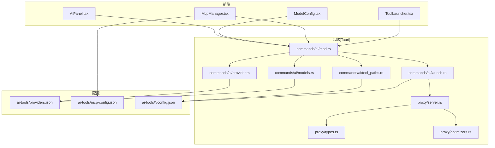
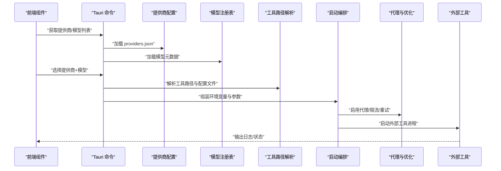
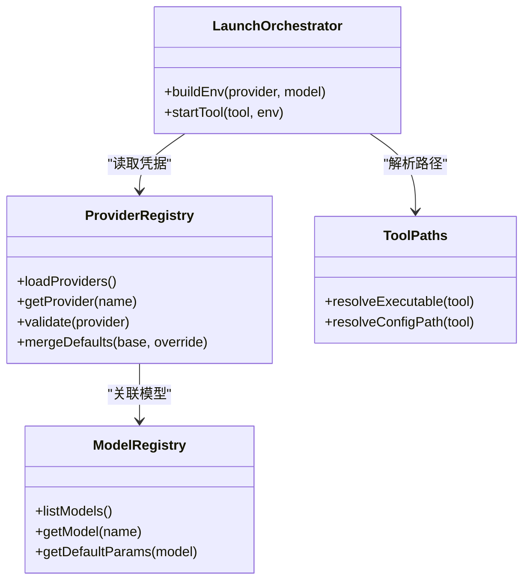
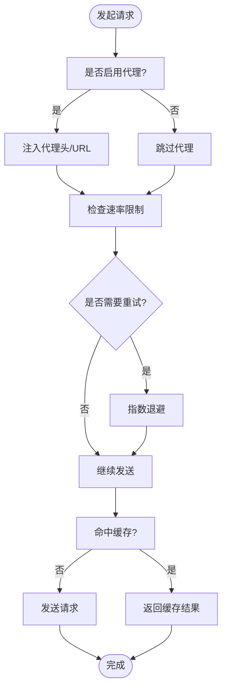
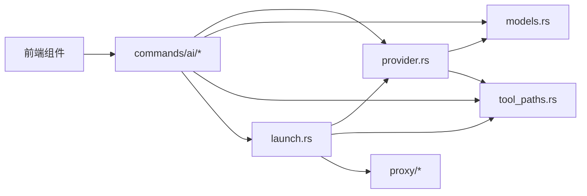

# AI 工具配置

<cite>
**本文引用的文件**   
- [ai-tools/providers.json](file://ai-tools/providers.json)
- [ai-tools/mcp-config.json](file://ai-tools/mcp-config.json)
- [ai-tools/claude-code/config.json](file://ai-tools/claude-code/config.json)
- [ai-tools/codex-cli/config.json](file://ai-tools/codex-cli/config.json)
- [ai-tools/gemini-cli/config.json](file://ai-tools/gemini-cli/config.json)
- [ai-tools/deveco/config.json](file://ai-tools/deveco/config.json)
- [ai-tools/mimocode/config.json](file://ai-tools/mimocode/config.json)
- [ai-tools/opencode/config.json](file://ai-tools/opencode/config.json)
- [ai-tools/qwencode/config.json](file://ai-tools/qwencode/config.json)
- [src-tauri/src/commands/ai/provider.rs](file://src-tauri/src/commands/ai/provider.rs)
- [src-tauri/src/commands/ai/models.rs](file://src-tauri/src/commands/ai/models.rs)
- [src-tauri/src/commands/ai/tool_paths.rs](file://src-tauri/src/commands/ai/tool_paths.rs)
- [src-tauri/src/commands/ai/tools.rs](file://src-tauri/src/commands/ai/tools.rs)
- [src-tauri/src/commands/ai/launch.rs](file://src-tauri/src/commands/ai/launch.rs)
- [src-tauri/src/commands/ai/mod.rs](file://src-tauri/src/commands/ai/mod.rs)
- [src-tauri/src/proxy/server.rs](file://src-tauri/src/proxy/server.rs)
- [src-tauri/src/proxy/types.rs](file://src-tauri/src/proxy/types.rs)
- [src-tauri/src/proxy/optimizers.rs](file://src-tauri/src/proxy/optimizers.rs)
- [src-tauri/src/proxy/google.rs](file://src-tauri/src/proxy/google.rs)
- [src/components/ai/ModelConfig.tsx](file://src/components/ai/ModelConfig.tsx)
- [src/components/ai/AiPanel.tsx](file://src/components/ai/AiPanel.tsx)
- [src/components/ai/McpManager.tsx](file://src/components/ai/McpManager.tsx)
- [src/components/ai/ToolLauncher.tsx](file://src/components/ai/ToolLauncher.tsx)
- [src/components/ai/types.ts](file://src/components/ai/types.ts)
</cite>

## 目录
1. [简介](#简介)
2. [项目结构](#项目结构)
3. [核心组件](#核心组件)
4. [架构总览](#架构总览)
5. [详细组件分析](#详细组件分析)
6. [依赖关系分析](#依赖关系分析)
7. [性能与网络优化](#性能与网络优化)
8. [故障排查指南](#故障排查指南)
9. [结论](#结论)
10. [附录：配置参考与扩展指南](#附录配置参考与扩展指南)

## 简介
本文件面向开发者与运维人员，系统化说明“AI 工具配置系统”的设计与实现，覆盖以下主题：
- AI 提供商配置：API 密钥管理、认证方式、请求限制等
- 各 AI 工具的配置文件结构与选项（Claude Code、Codex CLI、Gemini CLI 等）
- 模型选择、温度参数、最大令牌数等生成参数的配置方法
- 代理配置与网络优化设置
- 多提供商切换与负载均衡策略
- 安全存储与加密机制
- 自定义 AI 工具集成与配置扩展开发指南

## 项目结构
仓库采用前后端分离的 Tauri 应用结构：
- 前端 React 组件位于 src/components/ai，提供模型配置、MCP 管理、工具启动等 UI
- 后端 Rust 命令位于 src-tauri/src/commands/ai，负责加载 providers、models、工具路径、启动流程等
- 代理与网络优化位于 src-tauri/src/proxy
- 全局 AI 工具配置集中在 ai-tools 目录，包含各工具的 config.json 与 paths.json，以及 providers.json、mcp-config.json 等

图表来源
- [src/components/ai/AiPanel.tsx](file://src/components/ai/AiPanel.tsx)
- [src/components/ai/ModelConfig.tsx](file://src/components/ai/ModelConfig.tsx)
- [src/components/ai/McpManager.tsx](file://src/components/ai/McpManager.tsx)
- [src/components/ai/ToolLauncher.tsx](file://src/components/ai/ToolLauncher.tsx)
- [src-tauri/src/commands/ai/mod.rs](file://src-tauri/src/commands/ai/mod.rs)
- [src-tauri/src/commands/ai/provider.rs](file://src-tauri/src/commands/ai/provider.rs)
- [src-tauri/src/commands/ai/models.rs](file://src-tauri/src/commands/ai/models.rs)
- [src-tauri/src/commands/ai/tool_paths.rs](file://src-tauri/src/commands/ai/tool_paths.rs)
- [src-tauri/src/commands/ai/launch.rs](file://src-tauri/src/commands/ai/launch.rs)
- [src-tauri/src/proxy/server.rs](file://src-tauri/src/proxy/server.rs)
- [src-tauri/src/proxy/types.rs](file://src-tauri/src/proxy/types.rs)
- [src-tauri/src/proxy/optimizers.rs](file://src-tauri/src/proxy/optimizers.rs)
- [ai-tools/providers.json](file://ai-tools/providers.json)
- [ai-tools/mcp-config.json](file://ai-tools/mcp-config.json)
- [ai-tools/claude-code/config.json](file://ai-tools/claude-code/config.json)
- [ai-tools/codex-cli/config.json](file://ai-tools/codex-cli/config.json)
- [ai-tools/gemini-cli/config.json](file://ai-tools/gemini-cli/config.json)

章节来源
- [src-tauri/src/commands/ai/mod.rs](file://src-tauri/src/commands/ai/mod.rs)
- [src-tauri/src/commands/ai/provider.rs](file://src-tauri/src/commands/ai/provider.rs)
- [src-tauri/src/commands/ai/models.rs](file://src-tauri/src/commands/ai/models.rs)
- [src-tauri/src/commands/ai/tool_paths.rs](file://src-tauri/src/commands/ai/tool_paths.rs)
- [src-tauri/src/commands/ai/launch.rs](file://src-tauri/src/commands/ai/launch.rs)
- [src-tauri/src/proxy/server.rs](file://src-tauri/src/proxy/server.rs)
- [src-tauri/src/proxy/types.rs](file://src-tauri/src/proxy/types.rs)
- [src-tauri/src/proxy/optimizers.rs](file://src-tauri/src/proxy/optimizers.rs)
- [ai-tools/providers.json](file://ai-tools/providers.json)
- [ai-tools/mcp-config.json](file://ai-tools/mcp-config.json)
- [ai-tools/claude-code/config.json](file://ai-tools/claude-code/config.json)
- [ai-tools/codex-cli/config.json](file://ai-tools/codex-cli/config.json)
- [ai-tools/gemini-cli/config.json](file://ai-tools/gemini-cli/config.json)

## 核心组件
- 提供商配置中心：集中管理 AI 提供商的 API 密钥、认证方式、请求限制、负载均衡策略等
- 模型注册表：维护可用模型清单及其默认参数（如温度、最大令牌数）
- 工具路径解析：为 Claude Code、Codex CLI、Gemini CLI 等工具定位可执行文件与配置文件
- 启动编排：根据当前选择的提供商与模型，组装环境变量与命令行参数并启动工具
- 代理与网络优化：统一出口代理、重试、限流、缓存等能力
- MCP 管理：加载与管理 MCP 服务器配置，供工具链调用

章节来源
- [src-tauri/src/commands/ai/provider.rs](file://src-tauri/src/commands/ai/provider.rs)
- [src-tauri/src/commands/ai/models.rs](file://src-tauri/src/commands/ai/models.rs)
- [src-tauri/src/commands/ai/tool_paths.rs](file://src-tauri/src/commands/ai/tool_paths.rs)
- [src-tauri/src/commands/ai/launch.rs](file://src-tauri/src/commands/ai/launch.rs)
- [src-tauri/src/proxy/server.rs](file://src-tauri/src/proxy/server.rs)
- [src-tauri/src/proxy/optimizers.rs](file://src-tauri/src/proxy/optimizers.rs)
- [src/components/ai/McpManager.tsx](file://src/components/ai/McpManager.tsx)

## 架构总览
整体数据与控制流如下：
- 前端通过 Tauri 命令与后端交互，读取/写入 providers、models、tool_paths 等配置
- 启动时按所选提供商与模型，注入认证凭据与环境变量，调用外部工具
- 所有出站 HTTP 请求经代理层处理，支持重试、限流、缓存与 Google 专用优化
- MCP 配置由独立模块加载，供工具在运行时按需连接

图表来源
- [src-tauri/src/commands/ai/provider.rs](file://src-tauri/src/commands/ai/provider.rs)
- [src-tauri/src/commands/ai/models.rs](file://src-tauri/src/commands/ai/models.rs)
- [src-tauri/src/commands/ai/tool_paths.rs](file://src-tauri/src/commands/ai/tool_paths.rs)
- [src-tauri/src/commands/ai/launch.rs](file://src-tauri/src/commands/ai/launch.rs)
- [src-tauri/src/proxy/server.rs](file://src-tauri/src/proxy/server.rs)
- [src-tauri/src/proxy/optimizers.rs](file://src-tauri/src/proxy/optimizers.rs)

## 详细组件分析

### 提供商配置与认证
- 职责
  - 加载 providers.json，解析每个提供商的认证字段（如 API Key、OAuth、Bearer Token 等）
  - 校验必填项、合并默认值、暴露查询接口给前端
  - 支持按环境或用户维度覆盖敏感信息
- 关键要点
  - 认证字段命名需与具体提供商约定一致
  - 对空值或缺失进行友好提示
  - 建议将密钥从明文配置中剥离，使用安全存储（见“安全存储与加密机制”）

图表来源
- [src-tauri/src/commands/ai/provider.rs](file://src-tauri/src/commands/ai/provider.rs)
- [src-tauri/src/commands/ai/models.rs](file://src-tauri/src/commands/ai/models.rs)
- [src-tauri/src/commands/ai/tool_paths.rs](file://src-tauri/src/commands/ai/tool_paths.rs)
- [src-tauri/src/commands/ai/launch.rs](file://src-tauri/src/commands/ai/launch.rs)

章节来源
- [src-tauri/src/commands/ai/provider.rs](file://src-tauri/src/commands/ai/provider.rs)
- [ai-tools/providers.json](file://ai-tools/providers.json)

### 模型与生成参数
- 职责
  - 维护模型清单与默认生成参数（如 temperature、max_tokens、top_p 等）
  - 允许按提供商/模型粒度覆盖默认值
- 关键要点
  - 不同提供商的参数名可能不同，需在映射层做归一化
  - 对非法范围进行校验与回退到默认值

章节来源
- [src-tauri/src/commands/ai/models.rs](file://src-tauri/src/commands/ai/models.rs)

### 工具路径与配置文件
- 职责
  - 解析各工具的可执行文件路径与配置文件路径
  - 支持多版本共存与优先级策略
- 关键要点
  - 优先使用用户显式配置，其次回退到系统 PATH 或默认安装位置
  - 配置文件路径与内容遵循各工具规范

章节来源
- [src-tauri/src/commands/ai/tool_paths.rs](file://src-tauri/src/commands/ai/tool_paths.rs)
- [ai-tools/claude-code/config.json](file://ai-tools/claude-code/config.json)
- [ai-tools/codex-cli/config.json](file://ai-tools/codex-cli/config.json)
- [ai-tools/gemini-cli/config.json](file://ai-tools/gemini-cli/config.json)
- [ai-tools/deveco/config.json](file://ai-tools/deveco/config.json)
- [ai-tools/mimocode/config.json](file://ai-tools/mimocode/config.json)
- [ai-tools/opencode/config.json](file://ai-tools/opencode/config.json)
- [ai-tools/qwencode/config.json](file://ai-tools/qwencode/config.json)

### 启动编排与环境注入
- 职责
  - 根据当前提供商与模型，组装环境变量（如 API_KEY、BASE_URL、PROXY_* 等）
  - 启动目标工具进程，并透传必要参数
- 关键要点
  - 避免将敏感信息写入持久化日志
  - 支持 headless 模式与调试开关

章节来源
- [src-tauri/src/commands/ai/launch.rs](file://src-tauri/src/commands/ai/launch.rs)

### 代理与网络优化
- 职责
  - 统一代理出口、重试、限流、缓存、Google 专用优化
- 关键要点
  - 代理配置应支持全局与按域名/路径路由
  - 限流策略可按提供商维度隔离
  - 缓存策略针对幂等请求生效

图表来源
- [src-tauri/src/proxy/server.rs](file://src-tauri/src/proxy/server.rs)
- [src-tauri/src/proxy/types.rs](file://src-tauri/src/proxy/types.rs)
- [src-tauri/src/proxy/optimizers.rs](file://src-tauri/src/proxy/optimizers.rs)
- [src-tauri/src/proxy/google.rs](file://src-tauri/src/proxy/google.rs)

章节来源
- [src-tauri/src/proxy/server.rs](file://src-tauri/src/proxy/server.rs)
- [src-tauri/src/proxy/types.rs](file://src-tauri/src/proxy/types.rs)
- [src-tauri/src/proxy/optimizers.rs](file://src-tauri/src/proxy/optimizers.rs)
- [src-tauri/src/proxy/google.rs](file://src-tauri/src/proxy/google.rs)

### MCP 管理
- 职责
  - 加载 mcp-config.json，发现并管理 MCP 服务器
  - 为工具提供统一的 MCP 接入点
- 关键要点
  - 支持动态启停与热更新
  - 错误隔离与超时控制

章节来源
- [src/components/ai/McpManager.tsx](file://src/components/ai/McpManager.tsx)
- [ai-tools/mcp-config.json](file://ai-tools/mcp-config.json)

### 前端配置面板
- 职责
  - 展示与编辑提供商、模型、工具路径等配置
  - 触发启动流程并反馈状态
- 关键要点
  - 表单校验与错误提示
  - 本地缓存最近使用的配置

章节来源
- [src/components/ai/ModelConfig.tsx](file://src/components/ai/ModelConfig.tsx)
- [src/components/ai/AiPanel.tsx](file://src/components/ai/AiPanel.tsx)
- [src/components/ai/ToolLauncher.tsx](file://src/components/ai/ToolLauncher.tsx)
- [src/components/ai/types.ts](file://src/components/ai/types.ts)

## 依赖关系分析
- 组件耦合
  - 提供商配置与模型注册表强相关，启动编排依赖两者
  - 代理层对上层透明，仅通过环境变量或中间件注入
- 外部依赖
  - 各 AI 工具的可执行文件与配置文件
  - 系统代理与网络栈

图表来源
- [src-tauri/src/commands/ai/provider.rs](file://src-tauri/src/commands/ai/provider.rs)
- [src-tauri/src/commands/ai/models.rs](file://src-tauri/src/commands/ai/models.rs)
- [src-tauri/src/commands/ai/tool_paths.rs](file://src-tauri/src/commands/ai/tool_paths.rs)
- [src-tauri/src/commands/ai/launch.rs](file://src-tauri/src/commands/ai/launch.rs)
- [src-tauri/src/proxy/server.rs](file://src-tauri/src/proxy/server.rs)
- [src-tauri/src/proxy/types.rs](file://src-tauri/src/proxy/types.rs)
- [src-tauri/src/proxy/optimizers.rs](file://src-tauri/src/proxy/optimizers.rs)
- [src-tauri/src/proxy/google.rs](file://src-tauri/src/proxy/google.rs)

章节来源
- [src-tauri/src/commands/ai/mod.rs](file://src-tauri/src/commands/ai/mod.rs)
- [src-tauri/src/commands/ai/tools.rs](file://src-tauri/src/commands/ai/tools.rs)

## 性能与网络优化
- 并发与限流
  - 按提供商维度设置并发上限与令牌桶限流，避免触发远端配额
- 重试与退避
  - 对瞬态错误（超时、5xx）实施指数退避与抖动
- 缓存
  - 对幂等请求启用响应缓存，减少重复调用
- 代理优化
  - 复用连接池、压缩传输、就近节点选择
  - 针对特定厂商（如 Google）提供专用优化路径

[本节为通用指导，不直接分析具体文件]

## 故障排查指南
- 常见问题
  - 认证失败：检查 providers.json 中的密钥字段是否正确、是否被安全存储覆盖
  - 模型不可用：确认 models 列表中该模型存在且参数合法
  - 工具未找到：核对 tool_paths 解析结果与 PATH 配置
  - 代理异常：验证代理地址、端口、认证信息与证书
- 诊断步骤
  - 查看启动日志与代理层日志
  - 逐步禁用代理/缓存/重试以定位问题
  - 使用最小化配置复现问题

章节来源
- [src-tauri/src/commands/ai/launch.rs](file://src-tauri/src/commands/ai/launch.rs)
- [src-tauri/src/proxy/server.rs](file://src-tauri/src/proxy/server.rs)

## 结论
本系统通过“提供商-模型-工具-代理”的分层设计，实现了多 AI 工具的统一配置与稳定运行。借助清晰的配置边界与安全机制，可在保证安全的前提下灵活扩展新的提供商与工具。

[本节为总结性内容，不直接分析具体文件]

## 附录：配置参考与扩展指南

### 提供商配置（providers.json）
- 典型字段
  - name：提供商标识
  - auth：认证方式（如 api_key、bearer_token、oauth）
  - credentials：凭据键值（如 api_key、client_id、client_secret）
  - limits：请求限制（如 qpm、rpm、burst）
  - proxy：可选的代理覆盖
  - default_model：默认模型
- 建议
  - 将敏感字段从明文配置中剥离，使用安全存储（见下节）
  - 为每个提供商定义最小必填字段与默认值

章节来源
- [ai-tools/providers.json](file://ai-tools/providers.json)
- [src-tauri/src/commands/ai/provider.rs](file://src-tauri/src/commands/ai/provider.rs)

### 模型与生成参数
- 常见参数
  - temperature：创造性程度
  - max_tokens：最大生成长度
  - top_p / top_k：采样策略
  - presence_penalty / frequency_penalty：惩罚项
- 注意事项
  - 不同提供商参数名可能不同，需在映射层统一
  - 超出范围的值应回退到默认或报错提示

章节来源
- [src-tauri/src/commands/ai/models.rs](file://src-tauri/src/commands/ai/models.rs)

### 工具配置文件结构
- Claude Code
  - 关注点：模型选择、权限、设置项
  - 参考：ai-tools/claude-code/config.json
- Codex CLI
  - 关注点：认证、执行策略、沙箱、技能
  - 参考：ai-tools/codex-cli/config.json
- Gemini CLI
  - 关注点：配置入口与基本选项
  - 参考：ai-tools/gemini-cli/config.json
- 其他工具（deveco、mimocode、opencode、qwencode）
  - 参考各自 ai-tools/<tool>/config.json

章节来源
- [ai-tools/claude-code/config.json](file://ai-tools/claude-code/config.json)
- [ai-tools/codex-cli/config.json](file://ai-tools/codex-cli/config.json)
- [ai-tools/gemini-cli/config.json](file://ai-tools/gemini-cli/config.json)
- [ai-tools/deveco/config.json](file://ai-tools/deveco/config.json)
- [ai-tools/mimocode/config.json](file://ai-tools/mimocode/config.json)
- [ai-tools/opencode/config.json](file://ai-tools/opencode/config.json)
- [ai-tools/qwencode/config.json](file://ai-tools/qwencode/config.json)

### 代理配置与网络优化
- 代理类型
  - HTTP/HTTPS/SOCKS
  - 按域名/路径路由
- 优化策略
  - 重试与退避
  - 限流与配额
  - 缓存与去重
  - Google 专用优化路径

章节来源
- [src-tauri/src/proxy/server.rs](file://src-tauri/src/proxy/server.rs)
- [src-tauri/src/proxy/types.rs](file://src-tauri/src/proxy/types.rs)
- [src-tauri/src/proxy/optimizers.rs](file://src-tauri/src/proxy/optimizers.rs)
- [src-tauri/src/proxy/google.rs](file://src-tauri/src/proxy/google.rs)

### 多提供商切换与负载均衡
- 切换策略
  - 手动选择：前端面板指定
  - 自动切换：基于健康检查与延迟探测
- 负载均衡
  - 轮询/加权轮询
  - 基于配额与剩余容量的自适应分配
  - 熔断与降级

章节来源
- [src-tauri/src/commands/ai/provider.rs](file://src-tauri/src/commands/ai/provider.rs)
- [src-tauri/src/commands/ai/models.rs](file://src-tauri/src/commands/ai/models.rs)
- [src-tauri/src/proxy/optimizers.rs](file://src-tauri/src/proxy/optimizers.rs)

### 安全存储与加密机制
- 建议方案
  - 操作系统级密钥库（如 macOS Keychain、Windows Credential Manager、Linux Secret Service）
  - 应用内加密存储（AES-GCM），主密钥受用户口令保护
  - 环境变量注入，避免落盘
- 最佳实践
  - 最小权限原则
  - 定期轮换密钥
  - 审计与告警

[本节为通用指导，不直接分析具体文件]

### 自定义 AI 工具集成与配置扩展
- 集成步骤
  - 新增工具目录 ai-tools/<your-tool>/config.json 与 paths.json
  - 在 provider 与 models 中补充对应条目
  - 在 launch 编排中增加环境变量与参数映射
  - 在前端添加相应配置面板与校验
- 扩展点
  - 插件化的认证适配器
  - 可扩展的代理优化器
  - 可插拔的工具启动器

章节来源
- [src-tauri/src/commands/ai/tool_paths.rs](file://src-tauri/src/commands/ai/tool_paths.rs)
- [src-tauri/src/commands/ai/launch.rs](file://src-tauri/src/commands/ai/launch.rs)
- [src/components/ai/ToolLauncher.tsx](file://src/components/ai/ToolLauncher.tsx)
- [src/components/ai/ModelConfig.tsx](file://src/components/ai/ModelConfig.tsx)