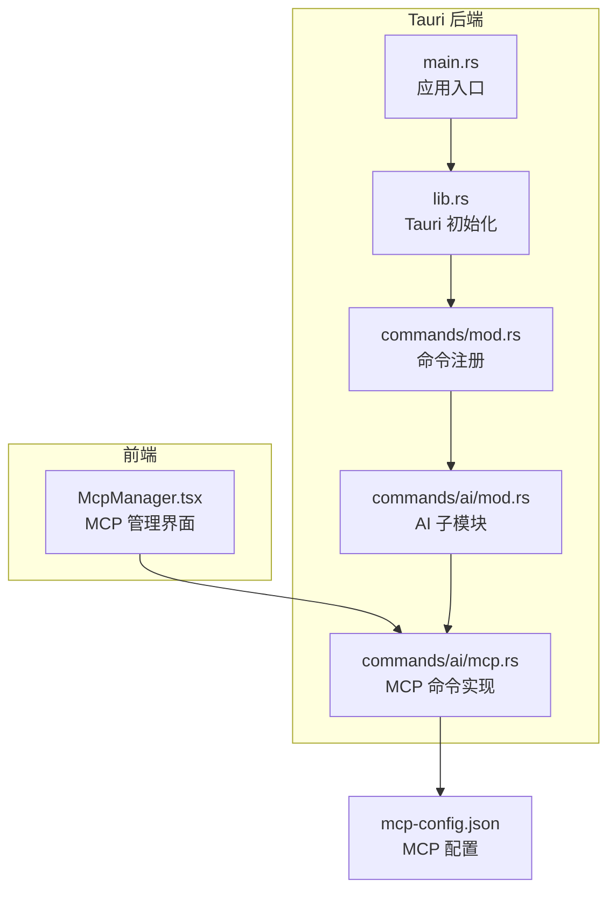
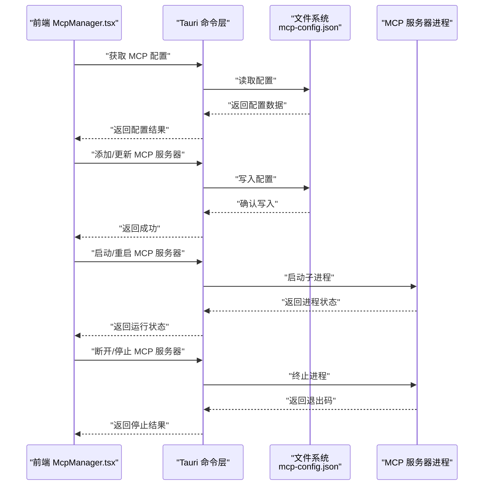
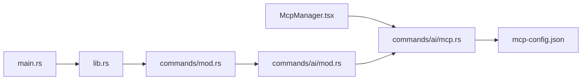

# MCP 协议配置

<cite>
**本文引用的文件**   
- [ai-tools/mcp-config.json](file://ai-tools/mcp-config.json)
- [src/components/ai/McpManager.tsx](file://src/components/ai/McpManager.tsx)
- [src-tauri/src/commands/ai/mcp.rs](file://src-tauri/src/commands/ai/mcp.rs)
- [src-tauri/src/commands/ai/mod.rs](file://src-tauri/src/commands/ai/mod.rs)
- [src-tauri/src/commands/mod.rs](file://src-tauri/src/commands/mod.rs)
- [src-tauri/src/lib.rs](file://src-tauri/src/lib.rs)
- [src-tauri/src/main.rs](file://src-tauri/src/main.rs)
- [docs/tool-config/qwen-code/features/mcp.md](file://docs/tool-config/qwen-code/features/mcp.md)
</cite>

## 目录
1. [简介](#简介)
2. [项目结构](#项目结构)
3. [核心组件](#核心组件)
4. [架构总览](#架构总览)
5. [详细组件分析](#详细组件分析)
6. [依赖关系分析](#依赖关系分析)
7. [性能与可靠性](#性能与可靠性)
8. [故障排查指南](#故障排查指南)
9. [结论](#结论)
10. [附录](#附录)

## 简介
本文件面向使用或扩展 Model Context Protocol（MCP）的开发者与运维人员，系统化说明本项目中 MCP 的配置体系与集成方式。内容覆盖：
- MCP 服务器连接配置（地址、认证、超时等）
- MCP 协议通信配置（消息格式、事件处理、错误重试）
- MCP 服务器发现与管理配置
- 上下文管理与状态持久化设置
- 客户端调试与监控配置
- 安全配置与访问控制
- 自定义 MCP 服务器的开发与集成指南

## 项目结构
围绕 MCP 的相关代码与配置主要分布在以下位置：
- 前端 UI 层：提供 MCP 管理界面与交互入口
- Tauri 后端命令层：暴露给前端的命令接口，负责与系统进程/外部服务交互
- 配置文件：集中存放 MCP 相关配置项
- 文档：包含对 MCP 功能的说明与最佳实践

图表来源
- [src/components/ai/McpManager.tsx](file://src/components/ai/McpManager.tsx)
- [src-tauri/src/commands/mod.rs](file://src-tauri/src/commands/mod.rs)
- [src-tauri/src/commands/ai/mod.rs](file://src-tauri/src/commands/ai/mod.rs)
- [src-tauri/src/commands/ai/mcp.rs](file://src-tauri/src/commands/ai/mcp.rs)
- [src-tauri/src/lib.rs](file://src-tauri/src/lib.rs)
- [src-tauri/src/main.rs](file://src-tauri/src/main.rs)
- [ai-tools/mcp-config.json](file://ai-tools/mcp-config.json)

章节来源
- [src/components/ai/McpManager.tsx](file://src/components/ai/McpManager.tsx)
- [src-tauri/src/commands/ai/mcp.rs](file://src-tauri/src/commands/ai/mcp.rs)
- [src-tauri/src/commands/ai/mod.rs](file://src-tauri/src/commands/ai/mod.rs)
- [src-tauri/src/commands/mod.rs](file://src-tauri/src/commands/mod.rs)
- [src-tauri/src/lib.rs](file://src-tauri/src/lib.rs)
- [src-tauri/src/main.rs](file://src-tauri/src/main.rs)
- [ai-tools/mcp-config.json](file://ai-tools/mcp-config.json)

## 核心组件
- 前端 MCP 管理器：提供 MCP 服务器的增删改查、连接测试、日志查看等能力，并通过 Tauri 命令与后端交互。
- Tauri MCP 命令：封装底层操作，如读取/写入 mcp-config.json、启动/停止 MCP 子进程、执行探测与诊断。
- 配置文件：集中定义 MCP 服务器列表、连接参数、认证信息、超时策略等。
- 文档参考：qwen-code 的 MCP 功能文档可作为协议与配置的补充参考。

章节来源
- [src/components/ai/McpManager.tsx](file://src/components/ai/McpManager.tsx)
- [src-tauri/src/commands/ai/mcp.rs](file://src-tauri/src/commands/ai/mcp.rs)
- [ai-tools/mcp-config.json](file://ai-tools/mcp-config.json)
- [docs/tool-config/qwen-code/features/mcp.md](file://docs/tool-config/qwen-code/features/mcp.md)

## 架构总览
整体采用“前端 UI + Tauri 命令”的分层架构。前端通过 Tauri 命令调用后端逻辑，后端读写本地配置文件并管理 MCP 服务器生命周期。

图表来源
- [src/components/ai/McpManager.tsx](file://src/components/ai/McpManager.tsx)
- [src-tauri/src/commands/ai/mcp.rs](file://src-tauri/src/commands/ai/mcp.rs)
- [ai-tools/mcp-config.json](file://ai-tools/mcp-config.json)

## 详细组件分析

### 前端 MCP 管理器（McpManager.tsx）
职责与要点
- 提供 MCP 服务器的可视化配置界面，支持新增、编辑、删除、启用/禁用等操作。
- 通过 Tauri 命令与后端交互，完成配置的读取、写入以及服务器进程的启停。
- 展示连接测试结果、错误信息与日志摘要，辅助用户快速定位问题。

关键交互流程
- 加载配置：调用后端命令读取 mcp-config.json，渲染到表单。
- 保存配置：将表单数据序列化后写入配置文件。
- 启动/停止：根据当前状态触发对应命令，刷新运行状态。
- 诊断与日志：请求后端输出诊断信息或最近日志片段。

章节来源
- [src/components/ai/McpManager.tsx](file://src/components/ai/McpManager.tsx)

### Tauri MCP 命令（commands/ai/mcp.rs）
职责与要点
- 实现 MCP 相关的 Tauri 命令，包括：
  - 读取/写入 mcp-config.json
  - 启动/停止/重启 MCP 服务器进程
  - 健康检查与连通性测试
  - 收集诊断信息（进程状态、端口占用、网络可达性等）
- 对错误进行统一包装与返回，便于前端展示。

典型命令序列
- 读取配置 -> 解析 JSON -> 返回结构化数据
- 写入配置 -> 校验字段 -> 落盘 -> 返回结果
- 启动进程 -> 记录 PID -> 返回状态
- 停止进程 -> 发送终止信号 -> 回收资源 -> 返回退出码

章节来源
- [src-tauri/src/commands/ai/mcp.rs](file://src-tauri/src/commands/ai/mcp.rs)

### 命令注册与模块组织（commands/mod.rs, commands/ai/mod.rs）
职责与要点
- 在命令模块中注册所有可用的 Tauri 命令，确保前端可调用。
- 按功能域划分子模块（如 ai），提高可维护性与可读性。

章节来源
- [src-tauri/src/commands/mod.rs](file://src-tauri/src/commands/mod.rs)
- [src-tauri/src/commands/ai/mod.rs](file://src-tauri/src/commands/ai/mod.rs)

### Tauri 初始化与入口（lib.rs, main.rs）
职责与要点
- lib.rs：初始化 Tauri 插件、注册命令、挂载能力集等。
- main.rs：应用主入口，负责构建与启动 Tauri 应用。

章节来源
- [src-tauri/src/lib.rs](file://src-tauri/src/lib.rs)
- [src-tauri/src/main.rs](file://src-tauri/src/main.rs)

### MCP 配置文件（mcp-config.json）
作用与范围
- 集中存储 MCP 服务器列表及其连接参数、认证信息、超时策略等。
- 作为前后端共享的单一事实来源，保证配置一致性。

建议字段类别（概念性说明）
- 服务器列表：名称、类型、地址、端口、协议、是否启用
- 连接参数：超时时间、重试次数、最大并发
- 认证方式：令牌、密钥、证书路径等
- 行为策略：自动重连、心跳间隔、日志级别
- 元数据：版本、更新时间、备注

章节来源
- [ai-tools/mcp-config.json](file://ai-tools/mcp-config.json)

### 协议与配置参考（qwen-code MCP 文档）
用途
- 作为 MCP 协议与配置的补充参考，帮助理解消息格式、事件模型与常见配置项。

章节来源
- [docs/tool-config/qwen-code/features/mcp.md](file://docs/tool-config/qwen-code/features/mcp.md)

## 依赖关系分析
- 前端 McpManager.tsx 依赖 Tauri 命令层提供的 MCP 相关命令。
- Tauri 命令层依赖文件系统读写 mcp-config.json。
- 命令注册位于 commands/mod.rs，子模块位于 commands/ai/mod.rs。
- Tauri 初始化在 lib.rs，应用入口在 main.rs。

图表来源
- [src/components/ai/McpManager.tsx](file://src/components/ai/McpManager.tsx)
- [src-tauri/src/commands/ai/mcp.rs](file://src-tauri/src/commands/ai/mcp.rs)
- [src-tauri/src/commands/ai/mod.rs](file://src-tauri/src/commands/ai/mod.rs)
- [src-tauri/src/commands/mod.rs](file://src-tauri/src/commands/mod.rs)
- [src-tauri/src/lib.rs](file://src-tauri/src/lib.rs)
- [src-tauri/src/main.rs](file://src-tauri/src/main.rs)
- [ai-tools/mcp-config.json](file://ai-tools/mcp-config.json)

## 性能与可靠性
- 连接与重试
  - 合理设置连接超时与重试次数，避免频繁失败导致 UI 卡顿。
  - 对长耗时操作（如启动进程、健康检查）增加进度反馈与取消机制。
- 并发与资源
  - 限制同时运行的 MCP 服务器数量，避免资源争用。
  - 为每个服务器分配独立的工作目录与日志文件，降低耦合。
- 稳定性
  - 进程异常退出时自动重启，结合指数退避策略减少抖动。
  - 定期健康检查，及时标记不可用实例。

[本节为通用指导，不直接分析具体文件]

## 故障排查指南
常见问题与定位步骤
- 无法读取配置
  - 检查 mcp-config.json 是否存在且格式正确。
  - 确认后端命令有权限访问该路径。
- 启动失败
  - 查看进程启动日志与退出码。
  - 检查端口占用、环境变量与依赖工具链。
- 连接超时
  - 验证目标地址与端口可达性。
  - 调整超时与重试参数，观察是否改善。
- 认证失败
  - 核对令牌/密钥是否正确注入。
  - 检查证书路径与信任链。

章节来源
- [src-tauri/src/commands/ai/mcp.rs](file://src-tauri/src/commands/ai/mcp.rs)
- [ai-tools/mcp-config.json](file://ai-tools/mcp-config.json)

## 结论
本项目通过“前端 UI + Tauri 命令 + 配置文件”的方式实现了 MCP 服务器的可视化管理与基础生命周期控制。建议在现有基础上进一步完善：
- 增强配置校验与迁移机制
- 完善事件总线与遥测上报
- 引入更细粒度的访问控制与安全隔离
- 提供标准化诊断与导出报告

[本节为总结性内容，不直接分析具体文件]

## 附录

### 配置项速查（概念性）
- 服务器地址与端口：用于建立连接的 host 与 port
- 认证方式：token、secret、证书等
- 超时设置：连接超时、请求超时、心跳间隔
- 重试策略：最大重试次数、退避算法
- 日志级别：debug、info、warn、error
- 启用/禁用：开关控制是否参与调度

[本节为概念性说明，不直接分析具体文件]