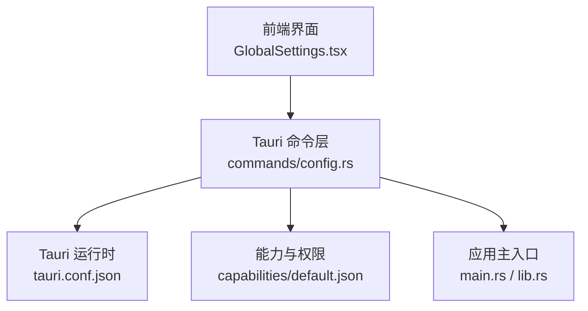
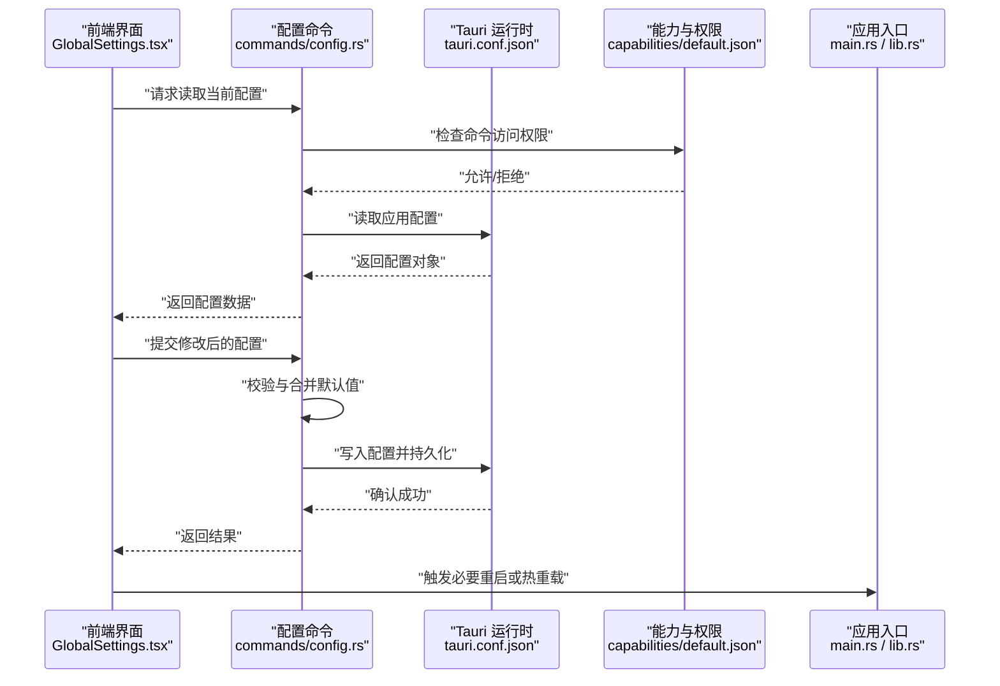
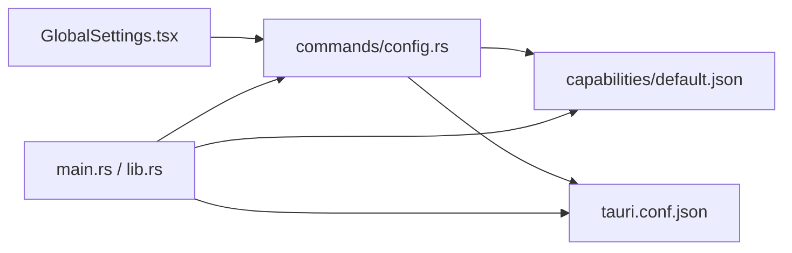

# 全局配置

<cite>
**本文引用的文件**   
- [tauri.conf.json](file://src-tauri/tauri.conf.json)
- [default.json](file://src-tauri/capabilities/default.json)
- [lib.rs](file://src-tauri/src/lib.rs)
- [main.rs](file://src-tauri/src/main.rs)
- [config.rs](file://src-tauri/src/commands/config.rs)
- [GlobalSettings.tsx](file://src/components/GlobalSettings.tsx)
</cite>

## 目录
1. [简介](#简介)
2. [项目结构](#项目结构)
3. [核心组件](#核心组件)
4. [架构总览](#架构总览)
5. [详细组件分析](#详细组件分析)
6. [依赖关系分析](#依赖关系分析)
7. [性能考虑](#性能考虑)
8. [故障排查指南](#故障排查指南)
9. [结论](#结论)
10. [附录](#附录)

## 简介
本章节面向“全局配置系统”，覆盖应用级配置文件结构、Tauri 应用配置（窗口、权限、安全策略）、配置的加载机制与默认值处理、验证规则、编辑指南与最佳实践，以及热重载与动态更新的使用说明。文档同时为初学者提供基础示例路径，并为高级用户提供扩展开发指引。

## 项目结构
全局配置相关的关键位置：
- Tauri 应用配置：src-tauri/tauri.conf.json
- 能力与权限：src-tauri/capabilities/default.json
- Rust 侧入口与插件注册：src-tauri/src/main.rs、src-tauri/src/lib.rs
- 配置命令实现（Rust）：src-tauri/src/commands/config.rs
- 前端设置界面（React）：src/components/GlobalSettings.tsx

图表来源
- [tauri.conf.json](file://src-tauri/tauri.conf.json)
- [default.json](file://src-tauri/capabilities/default.json)
- [lib.rs](file://src-tauri/src/lib.rs)
- [main.rs](file://src-tauri/src/main.rs)
- [config.rs](file://src-tauri/src/commands/config.rs)
- [GlobalSettings.tsx](file://src/components/GlobalSettings.tsx)

章节来源
- [tauri.conf.json](file://src-tauri/tauri.conf.json)
- [default.json](file://src-tauri/capabilities/default.json)
- [lib.rs](file://src-tauri/src/lib.rs)
- [main.rs](file://src-tauri/src/main.rs)
- [config.rs](file://src-tauri/src/commands/config.rs)
- [GlobalSettings.tsx](file://src/components/GlobalSettings.tsx)

## 核心组件
- Tauri 应用配置（tauri.conf.json）
  - 负责定义窗口行为、构建目标、资源、协议、插件、安全策略等。
  - 典型字段包括窗口尺寸与位置、是否无边框、是否置顶、菜单与托盘、代理与网络策略、插件白名单等。
- 能力与权限（capabilities/default.json）
  - 控制前端可访问的 Tauri 命令与模块范围，最小权限原则落地处。
- 配置命令（commands/config.rs）
  - 暴露给前端的配置读写接口，负责读取、合并、校验与持久化。
- 前端设置界面（GlobalSettings.tsx）
  - 提供用户可见的配置项编辑入口，调用后端命令完成保存与生效。

章节来源
- [tauri.conf.json](file://src-tauri/tauri.conf.json)
- [default.json](file://src-tauri/capabilities/default.json)
- [config.rs](file://src-tauri/src/commands/config.rs)
- [GlobalSettings.tsx](file://src/components/GlobalSettings.tsx)

## 架构总览
下图展示从前端到 Tauri 运行时的配置加载与写入流程，以及能力与权限对命令访问的控制点。

图表来源
- [tauri.conf.json](file://src-tauri/tauri.conf.json)
- [default.json](file://src-tauri/capabilities/default.json)
- [config.rs](file://src-tauri/src/commands/config.rs)
- [GlobalSettings.tsx](file://src/components/GlobalSettings.tsx)
- [main.rs](file://src-tauri/src/main.rs)
- [lib.rs](file://src-tauri/src/lib.rs)

## 详细组件分析

### Tauri 应用配置（tauri.conf.json）
- 作用
  - 定义窗口外观与行为（大小、位置、是否透明、是否置顶、是否全屏）。
  - 定义构建与打包选项（目标平台、图标、资源、插件）。
  - 定义安全策略（CSP、协议、网络、文件系统访问限制）。
  - 定义能力与权限绑定（通过 capabilities 引用）。
- 关键领域
  - 窗口设置：尺寸、位置、装饰、透明度、置顶、全屏、最小化/最大化行为。
  - 主题与界面：语言偏好、字体、缩放、快捷键映射（若由前端管理则在前端配置中）。
  - 权限与安全：CSP、协议白名单、IPC 白名单、文件系统沙箱。
  - 插件与能力：启用哪些插件、能力集引用。
- 默认值与校验
  - 未显式设置的字段采用 Tauri 默认值；非法值在启动时抛出错误。
- 建议
  - 将敏感信息（密钥、令牌）放入环境变量或外部受保护存储，不在 tauri.conf.json 明文存放。
  - 使用能力文件精细化授权，遵循最小权限原则。

章节来源
- [tauri.conf.json](file://src-tauri/tauri.conf.json)

### 能力与权限（capabilities/default.json）
- 作用
  - 声明前端页面可访问的命令与模块，是 IPC 安全的边界。
- 关键领域
  - 命令白名单：仅允许必要的命令被前端调用。
  - 资源访问：限定可访问的文件路径、网络域等。
  - 插件权限：控制插件的前端可用范围。
- 建议
  - 按功能域拆分能力文件，避免单一大权限集合。
  - 定期审计能力变更，确保与代码实现一致。

章节来源
- [default.json](file://src-tauri/capabilities/default.json)

### 配置命令实现（commands/config.rs）
- 职责
  - 暴露配置读取/写入命令。
  - 合并默认值、执行校验、持久化到磁盘。
  - 触发必要的热重载或提示重启。
- 处理流程
  - 读取：从 tauri.conf.json 与本地持久化配置合并，返回最终配置。
  - 写入：校验输入结构，合并默认值，落盘并返回结果。
  - 校验：类型、取值范围、必填项、互斥项等。
- 错误处理
  - 返回结构化错误码与消息，便于前端提示。
- 热重载
  - 对不影响进程状态的配置项支持即时生效；影响进程状态（如窗口、网络策略）需提示重启。

章节来源
- [config.rs](file://src-tauri/src/commands/config.rs)

### 前端设置界面（GlobalSettings.tsx）
- 职责
  - 渲染配置表单，提供界面设置、主题、语言、快捷键等编辑入口。
  - 调用配置命令进行读取与保存。
  - 根据返回结果给出成功/失败反馈，必要时引导重启。
- 交互要点
  - 实时预览（可选）：对非破坏性更改即时预览。
  - 变更检测：对比前后配置，仅提交差异。
  - 权限提示：当某些配置需要更高权限时，显示说明。

章节来源
- [GlobalSettings.tsx](file://src/components/GlobalSettings.tsx)

### 应用入口与插件注册（main.rs / lib.rs）
- 职责
  - 初始化 Tauri 应用、注册命令与插件、加载能力与权限。
  - 启动窗口、托盘、系统事件监听等。
- 与配置的关系
  - 启动阶段读取 tauri.conf.json 以决定窗口、菜单、插件、安全策略等。
  - 将 commands/config.rs 暴露为前端可用的命令。

章节来源
- [main.rs](file://src-tauri/src/main.rs)
- [lib.rs](file://src-tauri/src/lib.rs)

## 依赖关系分析
- 前端 GlobalSettings.tsx 依赖配置命令接口。
- 配置命令依赖 Tauri 运行时提供的配置读取/写入能力，并受能力与权限文件约束。
- 应用入口负责装配命令、能力与运行时配置。

图表来源
- [GlobalSettings.tsx](file://src/components/GlobalSettings.tsx)
- [config.rs](file://src-tauri/src/commands/config.rs)
- [default.json](file://src-tauri/capabilities/default.json)
- [tauri.conf.json](file://src-tauri/tauri.conf.json)
- [main.rs](file://src-tauri/src/main.rs)
- [lib.rs](file://src-tauri/src/lib.rs)

## 性能考虑
- 配置读取应缓存热点配置，减少频繁 I/O。
- 大配置文件的解析与校验应在后台线程执行，避免阻塞 UI。
- 增量保存：仅持久化变更字段，降低磁盘压力。
- 热重载只针对轻量配置，避免频繁重启导致用户体验下降。

## 故障排查指南
- 常见错误
  - 权限不足：前端无法访问某命令，检查 capabilities/default.json 是否包含对应命令。
  - 配置格式错误：tauri.conf.json 语法或类型不合法，查看启动日志定位具体字段。
  - 热重载无效：修改了需要重启的配置项，需提示用户重启应用。
- 诊断步骤
  - 打开开发者工具，观察命令调用返回值与错误码。
  - 核对能力文件与命令实现的一致性。
  - 逐步禁用插件或能力，缩小问题范围。

章节来源
- [default.json](file://src-tauri/capabilities/default.json)
- [config.rs](file://src-tauri/src/commands/config.rs)
- [tauri.conf.json](file://src-tauri/tauri.conf.json)

## 结论
全局配置系统围绕 tauri.conf.json 与能力文件构建，通过命令层统一对外暴露配置读写接口，并由前端界面提供易用编辑体验。遵循最小权限、明确默认值与严格校验的原则，可在保证安全性的前提下提供良好的可配置性与可扩展性。

## 附录

### 配置项速览（类别与用途）
- 界面设置
  - 语言偏好：选择应用界面语言。
  - 主题配置：浅色/深色/跟随系统。
  - 字体与字号：调整可读性与适配高分屏。
  - 快捷键映射：自定义常用操作快捷键。
- 窗口设置
  - 尺寸与位置：初始宽高、居中、记住上次位置。
  - 装饰与行为：无边框、置顶、最小化到托盘、全屏行为。
- 安全与权限
  - CSP 策略：限制内联脚本与外部资源。
  - 协议与网络：白名单域名、代理设置。
  - 文件系统：沙箱路径、只读/读写范围。
- 插件与能力
  - 启用插件：按需开启 AI、MCP、终端等插件。
  - 能力集：按功能域划分权限集合。

[本节为概念性概览，不直接分析具体文件]

### 基础配置示例（路径参考）
- 应用配置示例：参见 [tauri.conf.json](file://src-tauri/tauri.conf.json)
- 能力与权限示例：参见 [default.json](file://src-tauri/capabilities/default.json)
- 前端设置入口：参见 [GlobalSettings.tsx](file://src/components/GlobalSettings.tsx)

章节来源
- [tauri.conf.json](file://src-tauri/tauri.conf.json)
- [default.json](file://src-tauri/capabilities/default.json)
- [GlobalSettings.tsx](file://src/components/GlobalSettings.tsx)

### 高级扩展指南（自定义配置）
- 新增配置项
  - 在命令层增加读取/写入逻辑，并在前端添加对应表单字段。
  - 在能力文件中开放新命令访问权限。
- 配置迁移
  - 提供版本迁移钩子，自动升级旧配置到新结构。
- 校验与默认值
  - 为每个字段定义默认值与校验规则，确保向后兼容。
- 热重载策略
  - 区分“即时生效”和“需重启”两类配置，前端给出清晰提示。

[本节为通用指导，不直接分析具体文件]