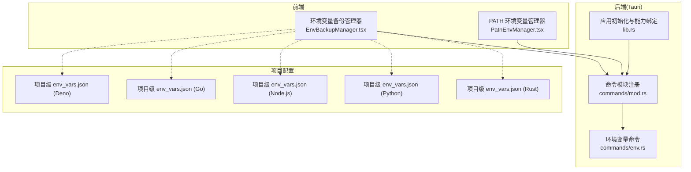
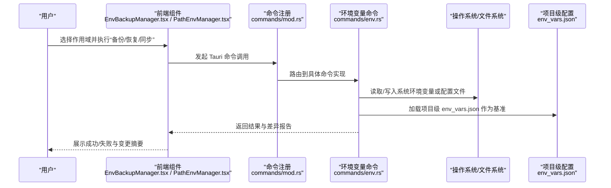
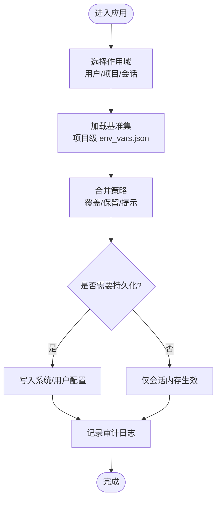
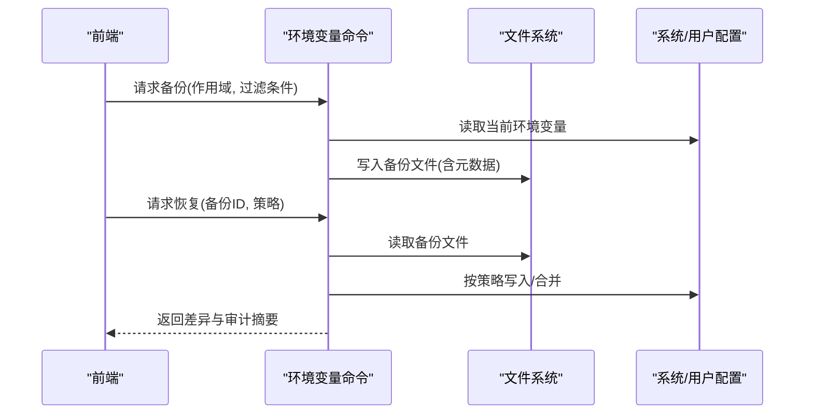
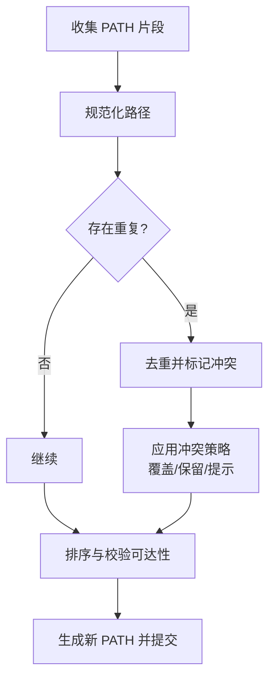
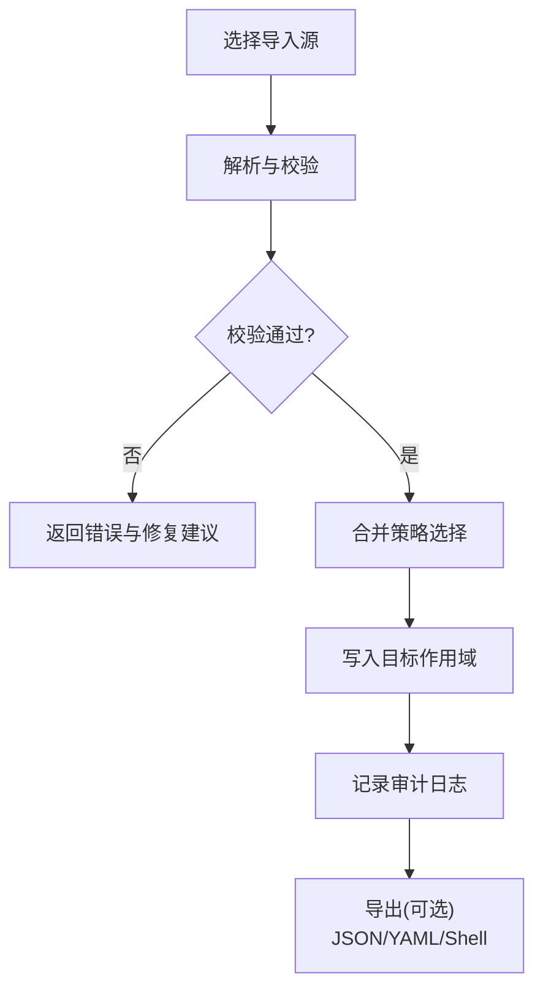
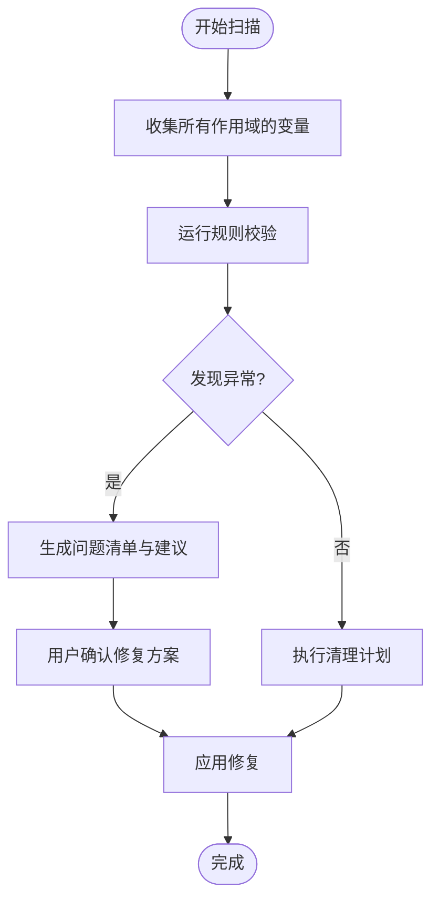
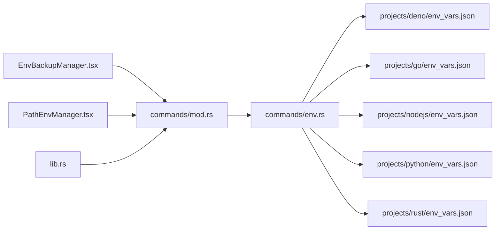

# 环境变量管理

<cite>
**本文引用的文件**   
- [src/components/EnvBackupManager.tsx](file://src/components/EnvBackupManager.tsx)
- [src/components/PathEnvManager.tsx](file://src/components/PathEnvManager.tsx)
- [src-tauri/src/commands/env.rs](file://src-tauri/src/commands/env.rs)
- [src-tauri/src/commands/mod.rs](file://src-tauri/src/commands/mod.rs)
- [src-tauri/src/lib.rs](file://src-tauri/src/lib.rs)
- [projects/deno/env_vars.json](file://projects/deno/env_vars.json)
- [projects/go/env_vars.json](file://projects/go/env_vars.json)
- [projects/nodejs/env_vars.json](file://projects/nodejs/env_vars.json)
- [projects/python/env_vars.json](file://projects/python/env_vars.json)
- [projects/rust/env_vars.json](file://projects/rust/env_vars.json)
</cite>

## 目录
1. [简介](#简介)
2. [项目结构](#项目结构)
3. [核心组件](#核心组件)
4. [架构总览](#架构总览)
5. [详细组件分析](#详细组件分析)
6. [依赖关系分析](#依赖关系分析)
7. [性能考虑](#性能考虑)
8. [故障排查指南](#故障排查指南)
9. [结论](#结论)
10. [附录](#附录)

## 简介
本文件围绕“环境变量管理系统”的目标，系统化阐述环境变量的作用域与生命周期（用户级、项目级、会话级）、备份/恢复/同步机制、PATH 管理与冲突解决策略、导入导出与格式支持、验证与清理工具、敏感信息加密存储与安全访问控制，以及面向开发者的最佳实践与自动化脚本开发指南。文档同时结合仓库中的前端组件与后端命令模块，给出可落地的实现建议与可视化图示。

## 项目结构
与环境变量管理直接相关的代码主要分布在以下位置：
- 前端 UI 层
  - 环境变量备份管理器：[src/components/EnvBackupManager.tsx](file://src/components/EnvBackupManager.tsx)
  - PATH 环境变量管理器：[src/components/PathEnvManager.tsx](file://src/components/PathEnvManager.tsx)
- 后端命令层（Tauri）
  - 环境变量命令入口与路由注册：[src-tauri/src/commands/env.rs](file://src-tauri/src/commands/env.rs)、[src-tauri/src/commands/mod.rs](file://src-tauri/src/commands/mod.rs)
  - Tauri 应用初始化与能力绑定：[src-tauri/src/lib.rs](file://src-tauri/src/lib.rs)
- 项目级环境变量定义示例
  - 各语言/框架的项目级 env_vars.json 示例：如 [projects/deno/env_vars.json](file://projects/deno/env_vars.json)、[projects/go/env_vars.json](file://projects/go/env_vars.json)、[projects/nodejs/env_vars.json](file://projects/nodejs/env_vars.json)、[projects/python/env_vars.json](file://projects/python/env_vars.json)、[projects/rust/env_vars.json](file://projects/rust/env_vars.json)

图表来源
- [src/components/EnvBackupManager.tsx](file://src/components/EnvBackupManager.tsx)
- [src/components/PathEnvManager.tsx](file://src/components/PathEnvManager.tsx)
- [src-tauri/src/commands/mod.rs](file://src-tauri/src/commands/mod.rs)
- [src-tauri/src/commands/env.rs](file://src-tauri/src/commands/env.rs)
- [src-tauri/src/lib.rs](file://src-tauri/src/lib.rs)
- [projects/deno/env_vars.json](file://projects/deno/env_vars.json)
- [projects/go/env_vars.json](file://projects/go/env_vars.json)
- [projects/nodejs/env_vars.json](file://projects/nodejs/env_vars.json)
- [projects/python/env_vars.json](file://projects/python/env_vars.json)
- [projects/rust/env_vars.json](file://projects/rust/env_vars.json)

章节来源
- [src/components/EnvBackupManager.tsx](file://src/components/EnvBackupManager.tsx)
- [src/components/PathEnvManager.tsx](file://src/components/PathEnvManager.tsx)
- [src-tauri/src/commands/env.rs](file://src-tauri/src/commands/env.rs)
- [src-tauri/src/commands/mod.rs](file://src-tauri/src/commands/mod.rs)
- [src-tauri/src/lib.rs](file://src-tauri/src/lib.rs)
- [projects/deno/env_vars.json](file://projects/deno/env_vars.json)
- [projects/go/env_vars.json](file://projects/go/env_vars.json)
- [projects/nodejs/env_vars.json](file://projects/nodejs/env_vars.json)
- [projects/python/env_vars.json](file://projects/python/env_vars.json)
- [projects/rust/env_vars.json](file://projects/rust/env_vars.json)

## 核心组件
- 环境变量备份管理器（前端）
  - 职责：提供环境变量的备份、恢复、对比与批量操作界面；对接后端命令完成持久化与系统级写入。
  - 关键交互：选择作用域（用户/项目/会话）、选择目标（全部或筛选）、执行备份/恢复/同步。
- PATH 环境变量管理器（前端）
  - 职责：维护 PATH 列表、去重、排序、冲突检测与合并策略展示；提供一键修复与回滚。
  - 关键交互：添加/删除路径、移动顺序、冲突高亮、提交变更。
- 环境变量命令（后端）
  - 职责：暴露 Tauri 命令接口，处理读取、写入、备份、恢复、同步等逻辑；负责跨平台差异与权限校验。
  - 关键能力：按作用域读写、增量同步、冲突解析、审计日志。
- 项目级环境变量定义（JSON）
  - 职责：为不同语言/框架提供默认或推荐的环境变量集合，便于快速初始化与团队共享。
  - 典型字段：键名、值、是否敏感、作用域、优先级、注释说明。

章节来源
- [src/components/EnvBackupManager.tsx](file://src/components/EnvBackupManager.tsx)
- [src/components/PathEnvManager.tsx](file://src/components/PathEnvManager.tsx)
- [src-tauri/src/commands/env.rs](file://src-tauri/src/commands/env.rs)
- [projects/deno/env_vars.json](file://projects/deno/env_vars.json)
- [projects/go/env_vars.json](file://projects/go/env_vars.json)
- [projects/nodejs/env_vars.json](file://projects/nodejs/env_vars.json)
- [projects/python/env_vars.json](file://projects/python/env_vars.json)
- [projects/rust/env_vars.json](file://projects/rust/env_vars.json)

## 架构总览
整体采用前后端分离的 Tauri 架构：前端通过 React 组件驱动用户操作，调用 Tauri 命令进行系统级环境变量管理；项目级环境变量以 JSON 形式沉淀在仓库中，供团队复用与版本化管理。

图表来源
- [src/components/EnvBackupManager.tsx](file://src/components/EnvBackupManager.tsx)
- [src/components/PathEnvManager.tsx](file://src/components/PathEnvManager.tsx)
- [src-tauri/src/commands/mod.rs](file://src-tauri/src/commands/mod.rs)
- [src-tauri/src/commands/env.rs](file://src-tauri/src/commands/env.rs)
- [projects/deno/env_vars.json](file://projects/deno/env_vars.json)
- [projects/go/env_vars.json](file://projects/go/env_vars.json)
- [projects/nodejs/env_vars.json](file://projects/nodejs/env_vars.json)
- [projects/python/env_vars.json](file://projects/python/env_vars.json)
- [projects/rust/env_vars.json](file://projects/rust/env_vars.json)

## 详细组件分析

### 环境变量作用域与生命周期
- 用户级
  - 范围：当前登录用户的所有进程与终端会话。
  - 生命周期：随用户会话创建而生效，注销后失效；持久化于用户配置。
  - 适用场景：全局密钥、代理、IDE 相关变量。
- 项目级
  - 范围：仅对指定项目有效，通常由启动脚本或工作区注入。
  - 生命周期：随项目工作区激活而生效，退出工作区后失效。
  - 适用场景：SDK 路径、构建参数、服务地址。
- 会话级
  - 范围：当前终端或子进程会话。
  - 生命周期：随会话结束而销毁。
  - 适用场景：临时调试开关、一次性令牌。

章节来源
- [src/components/EnvBackupManager.tsx](file://src/components/EnvBackupManager.tsx)
- [src-tauri/src/commands/env.rs](file://src-tauri/src/commands/env.rs)
- [projects/deno/env_vars.json](file://projects/deno/env_vars.json)
- [projects/go/env_vars.json](file://projects/go/env_vars.json)
- [projects/nodejs/env_vars.json](file://projects/nodejs/env_vars.json)
- [projects/python/env_vars.json](file://projects/python/env_vars.json)
- [projects/rust/env_vars.json](file://projects/rust/env_vars.json)

### 备份、恢复与同步机制
- 备份
  - 触发方式：手动或定时任务。
  - 内容：快照包含键值、作用域、时间戳、来源（系统/项目）。
  - 存储：本地加密文件或安全沙箱。
- 恢复
  - 粒度：全量恢复或选择性恢复。
  - 策略：冲突时提供“保留现有/覆盖/合并”选项。
- 同步
  - 方向：从项目级基准向用户级或会话级推送；或反向拉取差异。
  - 幂等：基于哈希或版本号避免重复写入。

图表来源
- [src/components/EnvBackupManager.tsx](file://src/components/EnvBackupManager.tsx)
- [src-tauri/src/commands/env.rs](file://src-tauri/src/commands/env.rs)

章节来源
- [src/components/EnvBackupManager.tsx](file://src/components/EnvBackupManager.tsx)
- [src-tauri/src/commands/env.rs](file://src-tauri/src/commands/env.rs)

### PATH 环境变量管理与冲突解决
- 管理要点
  - 去重：相同路径只保留一份。
  - 排序：优先顺序遵循“项目 > 用户 > 系统”或自定义规则。
  - 冲突检测：重复项、循环引用、不可达路径。
- 冲突解决策略
  - 自动：按优先级合并，保留最新或最旧版本。
  - 半自动：列出冲突项，用户确认后再应用。
  - 回滚：一键恢复到上次稳定状态。

图表来源
- [src/components/PathEnvManager.tsx](file://src/components/PathEnvManager.tsx)
- [src-tauri/src/commands/env.rs](file://src-tauri/src/commands/env.rs)

章节来源
- [src/components/PathEnvManager.tsx](file://src/components/PathEnvManager.tsx)
- [src-tauri/src/commands/env.rs](file://src-tauri/src/commands/env.rs)

### 导入导出与格式支持
- 支持的格式
  - JSON：结构化、易版本化，适合项目级共享。
  - Shell 兼容：export KEY=VALUE 或 set -x，便于终端直接使用。
  - YAML：可读性强，适合复杂注释与分组。
- 导入流程
  - 解析与校验：类型检查、键名规范、敏感标记。
  - 合并策略：覆盖/跳过/提示。
  - 审计与回滚：记录变更，支持撤销。
- 导出流程
  - 按作用域导出：用户/项目/会话。
  - 脱敏选项：可选隐藏敏感值。
  - 输出格式：JSON/YAML/Shell。

章节来源
- [src/components/EnvBackupManager.tsx](file://src/components/EnvBackupManager.tsx)
- [src-tauri/src/commands/env.rs](file://src-tauri/src/commands/env.rs)

### 验证与清理工具
- 验证
  - 键名合法性：长度、字符集、命名规范。
  - 值有效性：URL、端口、布尔、枚举等类型校验。
  - 依赖检查：必要变量是否存在且非空。
- 清理
  - 孤儿变量：未被任何项目使用的键。
  - 重复与别名：统一映射到标准键名。
  - 过期项：超过保留期的历史变量归档或删除。

章节来源
- [src/components/EnvBackupManager.tsx](file://src/components/EnvBackupManager.tsx)
- [src-tauri/src/commands/env.rs](file://src-tauri/src/commands/env.rs)

### 敏感信息加密存储与安全访问控制
- 加密存储
  - 使用强加密算法对敏感值进行加密，密钥与密文分离存放。
  - 支持多密钥轮换与版本化，确保历史数据可解密。
- 访问控制
  - 最小权限原则：仅允许必要的进程/用户访问。
  - 审计追踪：记录每次读取与修改的来源与作用域。
  - 动态注入：运行时按需注入，避免常驻明文。
- 最佳实践
  - 禁止将敏感值硬编码进项目级配置。
  - 提供模板占位符与外部密钥管理服务集成。

章节来源
- [src-tauri/src/commands/env.rs](file://src-tauri/src/commands/env.rs)
- [src/components/EnvBackupManager.tsx](file://src/components/EnvBackupManager.tsx)

### 开发者最佳实践与自动化脚本指南
- 最佳实践
  - 分层管理：用户级用于个人偏好，项目级用于协作一致，会话级用于临时调试。
  - 命名规范：统一前缀与大小写约定，避免冲突。
  - 版本化：将项目级 env_vars.json 纳入版本控制，配合变更评审。
  - 安全优先：敏感信息走加密存储与外部密钥服务。
- 自动化脚本
  - 初始化：根据项目模板生成基础环境变量。
  - 同步：在 CI/CD 中拉取项目级配置并校验。
  - 审计：定期扫描并生成合规报告。
  - 回滚：在部署失败时自动回滚到上一稳定快照。

章节来源
- [projects/deno/env_vars.json](file://projects/deno/env_vars.json)
- [projects/go/env_vars.json](file://projects/go/env_vars.json)
- [projects/nodejs/env_vars.json](file://projects/nodejs/env_vars.json)
- [projects/python/env_vars.json](file://projects/python/env_vars.json)
- [projects/rust/env_vars.json](file://projects/rust/env_vars.json)

## 依赖关系分析
- 前端组件依赖后端命令
  - EnvBackupManager.tsx 与 PathEnvManager.tsx 通过 Tauri 命令与后端交互。
- 命令模块注册与应用初始化
  - commands/mod.rs 集中注册命令，lib.rs 完成能力绑定与初始化。
- 项目级配置作为基准
  - 各项目的 env_vars.json 作为默认或推荐集合，供导入与同步使用。

图表来源
- [src/components/EnvBackupManager.tsx](file://src/components/EnvBackupManager.tsx)
- [src/components/PathEnvManager.tsx](file://src/components/PathEnvManager.tsx)
- [src-tauri/src/commands/mod.rs](file://src-tauri/src/commands/mod.rs)
- [src-tauri/src/commands/env.rs](file://src-tauri/src/commands/env.rs)
- [src-tauri/src/lib.rs](file://src-tauri/src/lib.rs)
- [projects/deno/env_vars.json](file://projects/deno/env_vars.json)
- [projects/go/env_vars.json](file://projects/go/env_vars.json)
- [projects/nodejs/env_vars.json](file://projects/nodejs/env_vars.json)
- [projects/python/env_vars.json](file://projects/python/env_vars.json)
- [projects/rust/env_vars.json](file://projects/rust/env_vars.json)

章节来源
- [src/components/EnvBackupManager.tsx](file://src/components/EnvBackupManager.tsx)
- [src/components/PathEnvManager.tsx](file://src/components/PathEnvManager.tsx)
- [src-tauri/src/commands/mod.rs](file://src-tauri/src/commands/mod.rs)
- [src-tauri/src/commands/env.rs](file://src-tauri/src/commands/env.rs)
- [src-tauri/src/lib.rs](file://src-tauri/src/lib.rs)
- [projects/deno/env_vars.json](file://projects/deno/env_vars.json)
- [projects/go/env_vars.json](file://projects/go/env_vars.json)
- [projects/nodejs/env_vars.json](file://projects/nodejs/env_vars.json)
- [projects/python/env_vars.json](file://projects/python/env_vars.json)
- [projects/rust/env_vars.json](file://projects/rust/env_vars.json)

## 性能考虑
- 批量操作优化
  - 合并多次写入为一次事务，减少系统调用次数。
  - 增量同步：仅传输差异，降低网络与磁盘开销。
- 缓存与索引
  - 对常用变量建立索引，加速查询与冲突检测。
  - 缓存最近使用的备份快照，提升恢复速度。
- 并发与锁
  - 并发写入时使用细粒度锁，避免竞争条件。
  - 长耗时任务异步执行，并提供进度反馈。

## 故障排查指南
- 常见问题
  - 权限不足：无法写入系统级变量，需提升权限或使用用户级作用域。
  - 路径无效：PATH 中包含不存在的路径，导致工具链找不到命令。
  - 冲突未解决：同名变量在不同作用域存在不同值，需明确策略。
- 定位方法
  - 查看审计日志：确认变更来源与作用域。
  - 对比快照：使用备份快照定位异常时间点。
  - 隔离测试：在会话级临时设置变量，验证影响范围。
- 恢复步骤
  - 回滚到上一个稳定快照。
  - 重新应用项目级基准配置。
  - 逐步引入变更并观察行为。

章节来源
- [src/components/EnvBackupManager.tsx](file://src/components/EnvBackupManager.tsx)
- [src-tauri/src/commands/env.rs](file://src-tauri/src/commands/env.rs)

## 结论
本环境变量管理系统通过清晰的作用域划分、完善的备份/恢复/同步机制、健壮的 PATH 管理与冲突解决策略、灵活的导入导出与格式支持、严格的验证与清理流程，以及安全的敏感信息管理，为开发者提供了高效、可靠、可审计的环境变量管理能力。结合项目级配置与自动化脚本，可在团队协作与持续集成中显著提升一致性与安全性。

## 附录
- 术语表
  - 作用域：变量生效的范围（用户/项目/会话）。
  - 快照：某一时刻的环境变量集合及其元数据。
  - 审计：记录与追踪变量变更的历史与责任人。
- 参考文件
  - 前端组件：[src/components/EnvBackupManager.tsx](file://src/components/EnvBackupManager.tsx)、[src/components/PathEnvManager.tsx](file://src/components/PathEnvManager.tsx)
  - 后端命令：[src-tauri/src/commands/env.rs](file://src-tauri/src/commands/env.rs)、[src-tauri/src/commands/mod.rs](file://src-tauri/src/commands/mod.rs)、[src-tauri/src/lib.rs](file://src-tauri/src/lib.rs)
  - 项目级配置示例：[projects/deno/env_vars.json](file://projects/deno/env_vars.json)、[projects/go/env_vars.json](file://projects/go/env_vars.json)、[projects/nodejs/env_vars.json](file://projects/nodejs/env_vars.json)、[projects/python/env_vars.json](file://projects/python/env_vars.json)、[projects/rust/env_vars.json](file://projects/rust/env_vars.json)